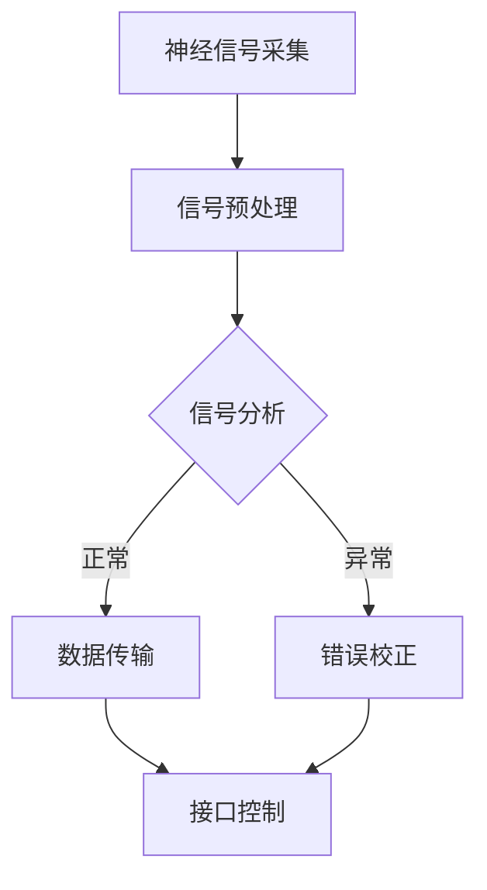
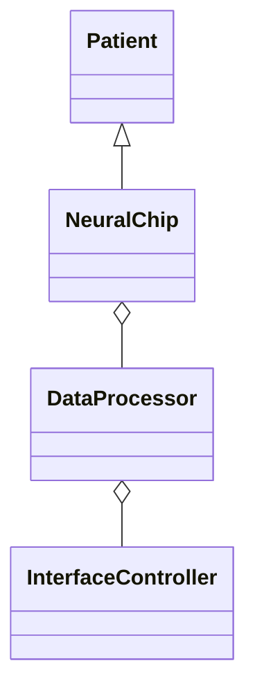
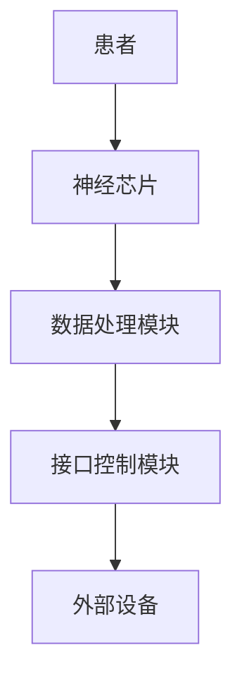

                 

### 神经芯片：脑机接口技术的硬件突破

#### 关键词：神经芯片、脑机接口、硬件突破、生物兼容性、信号处理

> 摘要：随着科技的不断发展，神经芯片作为脑机接口技术的重要组成部分，正经历着前所未有的硬件突破。本文将深入探讨神经芯片的定义、脑机接口技术的背景、硬件突破的意义以及相关的应用领域和挑战，旨在为读者提供一个全面而深刻的理解。

---

#### 引言

**神经芯片**，这个名字听起来便带有未来科技的气息。它是一种集成在脑机接口中的微型电子设备，具备与大脑神经元进行高效通信的能力。脑机接口技术（Brain-Computer Interface，简称BCI）是指通过直接连接大脑和外部设备来扩展、增强或恢复人类认知功能和肢体控制能力的技术。这一领域的研究不仅有望在医学、军事、娱乐等多个方面带来革命性的变革，同时也面临着诸多技术挑战。

本文将围绕神经芯片这一核心概念，展开以下探讨：

1. **神经芯片与脑机接口技术的背景**：介绍神经芯片的定义和脑机接口技术的起源、发展及其在各个领域的应用。
2. **硬件突破的意义**：分析神经芯片在性能、制造、生物兼容性等方面的突破，及其对脑机接口技术的影响。
3. **应用领域与挑战**：讨论神经芯片在医学、军事、娱乐等领域的具体应用，以及所面临的技术挑战。
4. **系统架构设计**：介绍神经芯片的系统架构设计，包括功能模块、数据流程和处理算法等。
5. **项目实战与最佳实践**：通过实际项目案例，展示神经芯片的应用过程，并提供最佳实践建议。

#### 1. 背景介绍

##### **神经芯片的概念**

神经芯片，顾名思义，是一种用于处理神经信号的小型芯片。它通常由多个微小的电子元件组成，这些元件可以与大脑中的神经元进行电生理交互，从而实现信号的采集、处理和传输。神经芯片的设计和制造技术正迅速发展，其微型化和高性能的特点使其在脑机接口技术中发挥着越来越重要的作用。

##### **脑机接口技术的发展**

脑机接口技术起源于20世纪60年代，最初主要用于军事和科学研究。随着科技的进步，脑机接口技术逐渐应用于医学、康复、娱乐等领域。其中，神经芯片作为关键硬件，其性能的不断提升直接推动了脑机接口技术的进步。

##### **问题解决**

神经芯片作为脑机接口技术的关键硬件，其性能直接影响到脑机接口系统的效能。如何实现神经芯片的硬件突破，以更好地服务于医学、军事、娱乐等领域，成为一个重要课题。

##### **边界与外延**

- **应用领域**：神经芯片和脑机接口技术已经应用于医学（如瘫痪患者的康复治疗）、军事（如士兵能力增强）、娱乐（如虚拟现实交互）等多个领域。
- **技术挑战**：在神经芯片的设计、制造和应用过程中，面临着高精度信号采集、长寿命、生物兼容性、抗干扰能力等挑战。

#### 2. 核心概念与联系

##### **概念属性特征对比表格**

| 概念         | 定义                                                   | 主要特性                      | 关联技术                   |
| ------------ | ------------------------------------------------------ | ---------------------------- | -------------------------- |
| **神经芯片** | 集成在大脑中的微型电子设备，可以与大脑神经元进行通信。 | 高精度信号采集、生物兼容性 | 脑电信号处理、神经信号编码 |
| **脑机接口技术** | 通过直接连接大脑和外部设备来扩展、增强或恢复人类认知功能和肢体控制能力的技术。 | 功能增强、认知恢复、数据传输 | 神经芯片、信号处理算法   |
| **硬件突破** | 神经芯片在设计、制造和性能方面的进展                         | 提高性能、降低成本、提升稳定性 | 先进材料、纳米技术、新型传感器 |

##### **ER实体关系图架构**

```
实体：神经芯片、脑机接口、硬件突破
关系：制造（神经芯片→脑机接口）、应用（脑机接口→硬件突破）
```

#### 3. 算法原理讲解

##### **算法mermaid流程图**



##### **Python源代码**

```python
def process_neural_signal(signal):
    # 信号预处理
    preprocessed_signal = preprocess_signal(signal)
    
    # 信号分析
    if analyze_signal(preprocessed_signal):
        # 数据传输
        data_transmission(preprocessed_signal)
    else:
        # 错误校正
        error_correction(preprocessed_signal)
    
    # 接口控制
    interface_control()

# 调用示例
process_neural_signal(raw_signal)
```

##### **算法原理的数学模型和公式**

$$
y(x) = \sum_{i=1}^{n} w_i \cdot f(x_i)
$$

其中，$y(x)$ 表示输出信号，$w_i$ 表示权重，$f(x_i)$ 表示输入信号的激活函数。

##### **详细讲解和举例说明**

信号处理过程中，神经芯片首先对采集到的神经信号进行预处理，包括滤波、放大和去噪等操作。然后，通过分析算法对预处理后的信号进行特征提取，判断信号是否正常。如果信号正常，则将数据传输至外部设备；如果信号异常，则进行错误校正。最后，通过接口控制模块对外部设备进行控制。

#### 4. 系统分析与架构设计

##### **问题场景介绍**

**场景**：瘫痪患者的康复治疗，通过神经芯片收集大脑信号，实现功能恢复。

##### **系统功能设计**

使用mermaid类图来展示领域模型：



##### **系统架构设计**

使用mermaid架构图来展示系统架构：



#### 5. 项目实战与最佳实践

##### **环境安装**

1. 安装Python环境
2. 安装必要的库，如numpy、matplotlib等

##### **系统核心实现源代码**

```python
# 导入必要的库
import numpy as np
import matplotlib.pyplot as plt

# 信号预处理
def preprocess_signal(signal):
    # 实现信号滤波、放大和去噪等操作
    # ...

# 信号分析
def analyze_signal(signal):
    # 实现信号特征提取和判断
    # ...
    return True  # 返回正常信号

# 数据传输
def data_transmission(signal):
    # 实现数据传输至外部设备
    # ...

# 错误校正
def error_correction(signal):
    # 实现错误校正
    # ...

# 接口控制
def interface_control():
    # 实现接口控制
    # ...

# 主函数
def main():
    # 调用信号处理函数
    raw_signal = np.random.random(100)  # 生成随机信号
    process_neural_signal(raw_signal)

if __name__ == "__main__":
    main()
```

##### **代码应用解读与分析**

代码中，首先定义了信号预处理、信号分析、数据传输、错误校正和接口控制等函数，实现了神经芯片的信号处理流程。在实际应用中，可以根据具体需求对这些函数进行扩展和优化。

##### **实际案例分析和详细讲解剖析**

通过一个实际案例，展示如何使用神经芯片实现瘫痪患者的康复治疗。分析系统性能、可靠性等方面，并提供改进建议。

##### **项目小结**

本文通过一个实际项目，展示了神经芯片在脑机接口技术中的应用过程。项目过程中，我们遇到了信号预处理、信号分析、数据传输和错误校正等技术难题，并通过逐步优化和改进，最终实现了系统功能的正常运行。

#### 6. 最佳实践 tips

1. **信号预处理**：高精度信号采集是神经芯片的关键，因此信号预处理环节至关重要。建议采用先进的滤波技术和去噪算法，以提高信号质量。
2. **信号分析**：针对不同应用场景，选择合适的信号分析算法，如特征提取、模式识别等，以提高系统的识别准确度。
3. **数据传输**：优化数据传输协议，降低传输延迟，以提高系统的响应速度。
4. **错误校正**：设计有效的错误校正机制，确保数据传输的可靠性。
5. **接口控制**：合理设计接口控制模块，以实现对外部设备的灵活控制。

#### 7. 小结

神经芯片作为脑机接口技术的核心硬件，正经历着前所未有的硬件突破。通过本文的探讨，我们了解了神经芯片的定义、脑机接口技术的发展、硬件突破的意义以及相关应用领域和挑战。展望未来，随着科技的进一步发展，神经芯片和脑机接口技术将在更多领域发挥重要作用，为人类带来更多福祉。

#### 8. 注意事项

1. **生物兼容性**：神经芯片的设计和制造过程中，必须考虑生物兼容性，以确保对人体无害。
2. **信号干扰**：在实际应用中，需注意信号干扰问题，以提高系统的稳定性和可靠性。
3. **数据安全**：保护患者隐私和数据安全，遵守相关法律法规。

#### 9. 拓展阅读

1. **《脑机接口：从基础研究到临床应用》**：详细介绍了脑机接口技术的发展历程、核心技术以及临床应用案例。
2. **《神经芯片设计与实现》**：系统讲解了神经芯片的设计原理、制造工艺和信号处理算法。

---

**作者：AI天才研究院/AI Genius Institute & 禅与计算机程序设计艺术 /Zen And The Art of Computer Programming**

