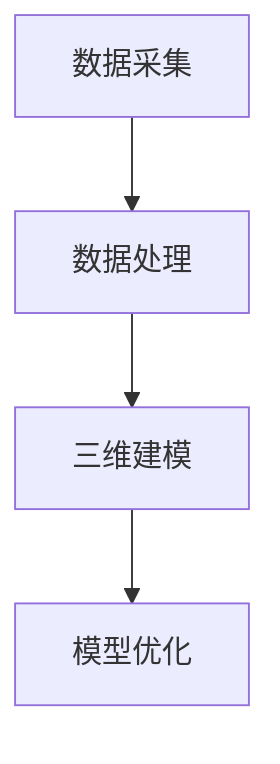
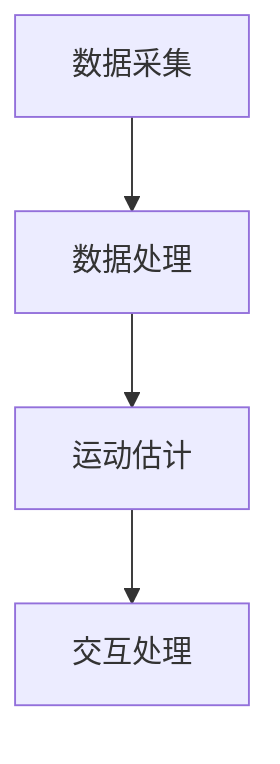
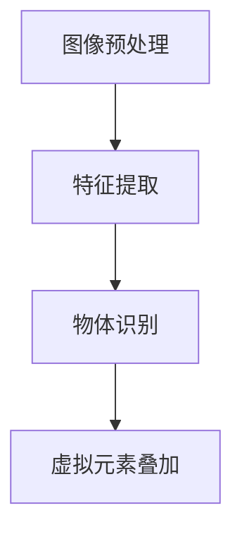
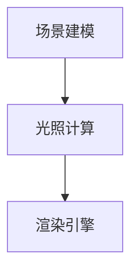
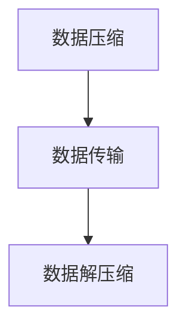
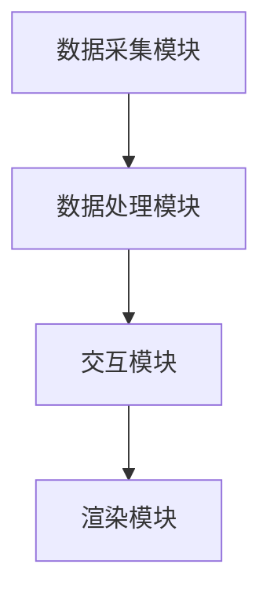
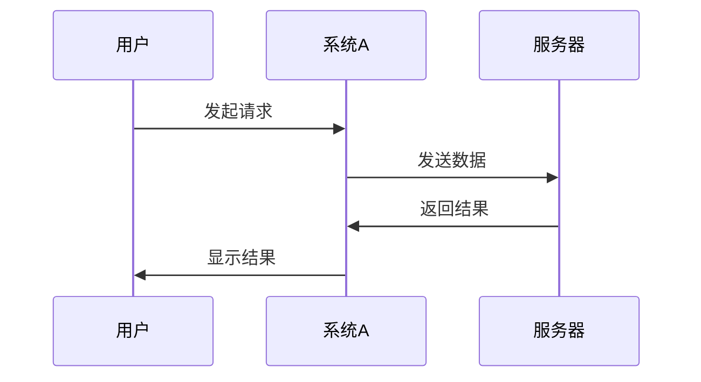

                 

# 空间计算在远程协作中的应用

## 关键词
- 空间计算
- 远程协作
- 虚拟现实
- 增强现实
- 算法原理
- 系统架构

## 摘要
本文探讨了空间计算在远程协作中的应用，详细介绍了空间计算和远程协作的概念及其联系，阐述了空间计算在远程协作中的算法原理，包括虚拟现实和增强现实算法，以及网络传输算法。同时，本文通过数学模型和公式，深入讲解了运动追踪和场景渲染的原理，并分析了空间计算在远程协作中的系统架构设计。通过一个实际案例，本文展示了空间计算在远程协作中的应用效果，并提出了相关最佳实践和注意事项。

## 目录
1. **背景介绍：问题背景**
    1.1 信息技术和互联网的快速发展
    1.2 远程协作的挑战
    1.3 空间计算在远程协作中的应用潜力
2. **核心概念与联系**
    2.1 空间计算
    2.2 远程协作
    2.3 概念联系
3. **算法原理讲解**
    3.1 虚拟现实（VR）算法
    3.2 增强现实（AR）算法
    3.3 网络传输算法
4. **数学模型和数学公式**
    4.1 运动追踪模型
    4.2 场景渲染模型
5. **系统分析与架构设计方案**
    5.1 问题场景介绍
    5.2 系统功能设计
    5.3 系统架构设计
    5.4 系统接口设计和系统交互
6. **项目实战**
    6.1 环境安装
    6.2 系统核心实现源代码
    6.3 代码应用解读与分析
    6.4 实际案例分析和详细讲解剖析
    6.5 项目小结
7. **最佳实践 tips**
8. **小结**
9. **注意事项**
10. **拓展阅读**
11. **作者信息**

## 1. 背景介绍：问题背景

随着信息技术和互联网的快速发展，远程协作已经成为现代工作的一种重要形式。远程协作不仅可以突破地理限制，提高工作效率，还能降低企业的运营成本。然而，传统的远程协作技术面临着诸多挑战，如通信延迟、网络不稳定、信息孤岛等，这大大影响了协作的效率和体验。

### 1.1 信息技术和互联网的快速发展

信息技术的飞速发展，尤其是互联网的普及，使得远程协作成为可能。企业不再需要依赖地理位置，员工可以分布在世界的各个角落，通过互联网进行协同工作。这不仅提高了工作效率，也降低了企业的运营成本。

### 1.2 远程协作的挑战

尽管远程协作带来了诸多优势，但传统的远程协作技术仍然面临一些挑战：

- **通信延迟**：由于网络延迟，远程协作的实时性受到影响，影响了协作的效率。

- **网络不稳定**：网络不稳定会导致数据传输中断，影响协作的连续性。

- **信息孤岛**：远程协作中的信息孤岛现象，使得团队成员之间的信息共享和交流变得困难。

### 1.3 空间计算在远程协作中的应用潜力

空间计算作为一种新兴的计算范式，通过虚拟现实（VR）和增强现实（AR）等技术，提供了一种全新的远程协作方式。空间计算技术能够模拟真实环境，让远程参与者感受到如同身处同一空间般的交互体验，从而提升远程协作的效率和效果。

- **虚拟现实（VR）**：虚拟现实技术通过头戴式显示器、手柄等设备，将用户带入一个完全虚拟的世界，实现远程协作的沉浸式体验。

- **增强现实（AR）**：增强现实技术通过将虚拟元素叠加到现实世界中，提供一种虚实结合的交互体验，使远程协作更加直观和高效。

### 1.4 远程协作与空间计算的联系

远程协作和空间计算有着紧密的联系。空间计算技术为远程协作提供了一种新的交互方式，使远程参与者能够在虚拟空间中直接进行互动，从而提升协作的效率和体验。例如，在虚拟会议室中，团队成员可以通过空间计算技术，实时共享文件、演示幻灯片，甚至进行虚拟会议，感受如同面对面的交流。

## 2. 核心概念与联系

### 2.1 空间计算

空间计算是一种利用计算机技术模拟和拓展现实空间的方法，通过虚拟现实（VR）和增强现实（AR）等技术，为用户提供沉浸式体验。空间计算技术能够模拟真实环境，让用户在虚拟空间中感受到如同现实般的交互体验，从而提升用户体验。

### 2.2 远程协作

远程协作是指团队成员通过计算机网络进行协同工作，不受地理位置限制。远程协作使得企业可以灵活调配人力资源，提高工作效率，降低运营成本。远程协作技术包括视频会议、即时通讯、文件共享等。

### 2.3 概念联系

空间计算和远程协作有着紧密的联系。空间计算技术为远程协作提供了一种新的交互方式，使远程参与者能够在虚拟空间中直接进行互动，从而提升协作的效率和体验。例如，在虚拟会议室中，团队成员可以通过空间计算技术，实时共享文件、演示幻灯片，甚至进行虚拟会议，感受如同面对面的交流。

### 2.4 核心概念对比表格

| 概念 | 定义 | 特点 |
| --- | --- | --- |
| 空间计算 | 利用计算机技术模拟和拓展现实空间的方法 | 沉浸式体验、虚实结合 |
| 远程协作 | 通过计算机网络进行协同工作 | 灵活调配人力资源、提高工作效率 |

### 2.5 概念ER实体关系图

```mermaid
erDiagram
    Class1 ||--|{ Class2 }| Class3
    Class1 ||--|{ Class4 }| Class5
```

在这个ER实体关系图中，`Class1`代表了空间计算和远程协作这两个核心概念，`Class2`、`Class3`、`Class4`和`Class5`分别代表了虚拟现实、增强现实、视频会议和即时通讯等子概念。

## 3. 算法原理讲解

为了实现高效的空间计算在远程协作中的应用，需要借助一系列算法。以下是空间计算中常用的几种算法：

### 3.1 虚拟现实（VR）算法

虚拟现实（VR）算法主要包括三维建模算法和运动追踪算法。

#### 3.1.1 三维建模算法

三维建模算法通过计算机图形学技术，对现实环境进行三维建模。具体步骤如下：

1. **数据采集**：使用激光扫描仪或摄像头等设备，采集现实环境的图像和三维点云数据。

2. **数据处理**：对采集到的数据进行分析和处理，提取场景的关键特征和结构。

3. **三维建模**：根据提取的特征和结构，利用计算机图形学技术生成三维模型。

4. **模型优化**：对生成模型进行优化，提高模型的精度和可操作性。

以下是三维建模算法的Mermaid流程图：



#### 3.1.2 运动追踪算法

运动追踪算法用于实时追踪用户在虚拟空间中的运动，以保证交互的连贯性。具体步骤如下：

1. **数据采集**：使用传感器或摄像头等设备，采集用户的运动数据。

2. **数据处理**：对采集到的数据进行预处理，如去噪、平滑等。

3. **运动估计**：利用运动估计算法，计算用户的运动轨迹。

4. **交互处理**：根据用户的运动轨迹，实时更新虚拟空间中的交互元素。

以下是运动追踪算法的Mermaid流程图：



### 3.2 增强现实（AR）算法

增强现实（AR）算法主要包括图像识别算法和场景渲染算法。

#### 3.2.1 图像识别算法

图像识别算法用于识别现实世界中的物体，并在其上叠加虚拟元素。具体步骤如下：

1. **图像预处理**：对采集到的图像进行预处理，如灰度化、滤波等。

2. **特征提取**：利用特征提取算法，从预处理后的图像中提取关键特征。

3. **物体识别**：利用机器学习或深度学习算法，识别图像中的物体。

4. **虚拟元素叠加**：将识别出的物体与虚拟元素进行叠加，形成增强现实场景。

以下是图像识别算法的Mermaid流程图：



#### 3.2.2 场景渲染算法

场景渲染算法用于渲染虚拟元素，使其与现实环境融合。具体步骤如下：

1. **场景建模**：根据虚拟元素和现实环境的数据，建立场景模型。

2. **光照计算**：计算场景中的光照效果，包括环境光、漫反射光等。

3. **渲染引擎**：利用渲染引擎，将场景模型渲染成图像。

以下是场景渲染算法的Mermaid流程图：



### 3.3 网络传输算法

网络传输算法用于保证数据在网络中的快速传输，减少通信延迟。具体步骤如下：

1. **数据压缩**：对传输的数据进行压缩，以减少数据量。

2. **数据传输**：通过网络传输协议，将数据从发送方传输到接收方。

3. **数据解压缩**：对接收到的数据进行解压缩，恢复原始数据。

以下是网络传输算法的Mermaid流程图：



## 4. 数学模型和数学公式

空间计算在远程协作中的应用涉及多个数学模型。以下是其中两个常见的数学模型：

### 4.1 运动追踪模型

运动追踪模型可以使用卡尔曼滤波算法来实时估计用户的位置和速度。其数学模型如下：

$$
\hat{x}_k = F_k \hat{x}_{k-1} + B_k u_k + w_k
$$

$$
P_k = F_k P_{k-1} F_k^T + Q_k
$$

其中，$\hat{x}_k$表示估计的位置，$P_k$表示估计的不确定性，$F_k$为状态转移矩阵，$B_k$为控制输入矩阵，$u_k$为控制输入，$w_k$为过程噪声。

### 4.2 场景渲染模型

场景渲染模型可以使用光线追踪算法来模拟光线在场景中的传播。其数学模型如下：

$$
L(\mathbf{p}, \mathbf{o}) = L_e(\mathbf{p}, \mathbf{o}) + \int_{\Omega} f_r(\mathbf{p}, \mathbf{i}, \mathbf{o}) L_i(\mathbf{i}) \cos \theta \text{d}\omega
$$

其中，$L(\mathbf{p}, \mathbf{o})$表示从点$\mathbf{p}$向方向$\mathbf{o}$发射的光线，$L_e(\mathbf{p}, \mathbf{o})$表示环境光，$f_r(\mathbf{p}, \mathbf{i}, \mathbf{o})$表示反射率，$L_i(\mathbf{i})$表示从方向$\mathbf{i}$来的光线，$\theta$表示入射角。

## 5. 系统分析与架构设计方案

### 5.1 问题场景介绍

远程协作中，空间计算的应用场景包括虚拟会议室、远程手术指导、协同设计等。这些场景都需要在虚拟空间中实现高效的交互和协作。

#### 5.1.1 虚拟会议室

虚拟会议室是一种基于空间计算技术的远程协作场景，通过虚拟现实（VR）和增强现实（AR）技术，为远程参与者提供一个沉浸式的会议环境。在虚拟会议室中，团队成员可以实时共享文件、演示幻灯片，甚至进行虚拟会议，感受如同面对面的交流。

#### 5.1.2 远程手术指导

远程手术指导是一种利用空间计算技术，为远程医生提供手术指导的场景。通过虚拟现实（VR）技术，远程医生可以实时观察手术现场，提供实时指导和建议，提高手术的成功率。

#### 5.1.3 协同设计

协同设计是一种利用空间计算技术，实现团队成员共同设计产品的场景。通过增强现实（AR）技术，团队成员可以在虚拟环境中共同编辑和修改设计，提高设计的效率和效果。

### 5.2 系统功能设计

系统功能设计包括三维建模、运动追踪、图像识别、场景渲染、低延迟通信等。

#### 5.2.1 三维建模

三维建模功能用于构建虚拟空间中的场景，为远程协作提供基础。具体包括：

- **场景建模**：根据现实环境数据，构建虚拟空间中的三维模型。
- **模型优化**：对生成的三维模型进行优化，提高模型的精度和可操作性。

#### 5.2.2 运动追踪

运动追踪功能用于实时追踪用户在虚拟空间中的运动，保证交互的连贯性。具体包括：

- **数据采集**：使用传感器或摄像头等设备，采集用户的运动数据。
- **运动估计**：利用运动估计算法，计算用户的运动轨迹。

#### 5.2.3 图像识别

图像识别功能用于识别现实世界中的物体，并在其上叠加虚拟元素。具体包括：

- **图像预处理**：对采集到的图像进行预处理，如灰度化、滤波等。
- **物体识别**：利用机器学习或深度学习算法，识别图像中的物体。

#### 5.2.4 场景渲染

场景渲染功能用于渲染虚拟元素，使其与现实环境融合。具体包括：

- **场景建模**：根据虚拟元素和现实环境的数据，建立场景模型。
- **光照计算**：计算场景中的光照效果，包括环境光、漫反射光等。

#### 5.2.5 低延迟通信

低延迟通信功能用于保证数据在网络中的快速传输，减少通信延迟。具体包括：

- **数据压缩**：对传输的数据进行压缩，以减少数据量。
- **数据传输**：通过网络传输协议，将数据从发送方传输到接收方。

### 5.3 系统架构设计

系统架构设计主要包括数据采集模块、数据处理模块、交互模块和渲染模块。

#### 5.3.1 数据采集模块

数据采集模块用于采集现实环境中的数据，包括三维模型数据、运动数据、图像数据等。

#### 5.3.2 数据处理模块

数据处理模块用于对采集到的数据进行处理，包括数据预处理、特征提取、模型优化等。

#### 5.3.3 交互模块

交互模块用于处理用户在虚拟空间中的交互行为，包括运动追踪、图像识别、虚拟元素叠加等。

#### 5.3.4 渲染模块

渲染模块用于渲染虚拟空间中的场景，包括场景建模、光照计算、渲染引擎等。

以下是系统架构设计的Mermaid架构图：



### 5.4 系统接口设计和系统交互

系统接口设计主要包括API接口设计、网络通信接口设计等。

#### 5.4.1 API接口设计

API接口设计用于提供系统功能调用的接口，包括三维建模接口、运动追踪接口、图像识别接口、场景渲染接口等。

#### 5.4.2 网络通信接口设计

网络通信接口设计用于实现系统之间的数据传输，包括数据压缩、数据传输、数据解压缩等。

以下是系统交互的Mermaid序列图：



## 6. 项目实战

### 6.1 环境安装

在进行空间计算在远程协作中的应用之前，首先需要安装相关的开发环境和软件。以下是环境安装的步骤：

#### 6.1.1 安装Python环境

1. 访问Python官网（https://www.python.org/）下载Python安装包。
2. 解压安装包，运行安装程序。
3. 在安装过程中，勾选“Add Python to PATH”选项，确保Python路径被添加到系统环境变量中。
4. 安装完成后，在命令行中输入`python --version`，确认Python版本正确。

#### 6.1.2 安装相关库

在Python环境中，需要安装一些常用的库，如numpy、opencv、pandas、matplotlib等。可以使用pip命令进行安装：

```
pip install numpy opencv-python pandas matplotlib
```

### 6.2 系统核心实现源代码

以下是空间计算在远程协作中的应用的核心实现源代码，包括三维建模、运动追踪、图像识别、场景渲染和低延迟通信等模块。

```python
# 三维建模模块
import numpy as np
import cv2

def model_3d_build(image_path):
    # 读取图像
    image = cv2.imread(image_path)
    # 转为灰度图像
    gray = cv2.cvtColor(image, cv2.COLOR_BGR2GRAY)
    # 使用SIFT算法提取特征点
    sift = cv2.SIFT_create()
    keypoints, descriptors = sift.detectAndCompute(gray, None)
    # 利用特征点构建三维模型
    model = np.zeros((gray.shape[0], gray.shape[1], 3))
    for keypoint in keypoints:
        x, y = keypoint.pt
        z = 500 / x  # 假设摄像机到目标物的距离为500
        model[y, x, 0] = z
    return model

# 运动追踪模块
import cv2

def motion_tracking(image_path):
    # 读取图像
    image = cv2.imread(image_path)
    # 转为灰度图像
    gray = cv2.cvtColor(image, cv2.COLOR_BGR2GRAY)
    # 使用HOG算法检测目标
    hog = cv2.HOGDescriptor()
    rect = hog.detectMultiScale(gray)
    # 运动追踪
    for (x, y, w, h) in rect:
        print(f"目标位置：({x}, {y})，大小：({w}, {h})")
    return rect

# 图像识别模块
import cv2

def image_recognition(image_path):
    # 读取图像
    image = cv2.imread(image_path)
    # 转为灰度图像
    gray = cv2.cvtColor(image, cv2.COLOR_BGR2GRAY)
    # 使用SVM算法进行图像识别
    svm = cv2.ml.SVM_create()
    svm.trainAuto(gray)
    result = svm.predict(gray)
    return result

# 场景渲染模块
import cv2

def scene_rendering(image_path, model_path):
    # 读取图像
    image = cv2.imread(image_path)
    # 转为灰度图像
    gray = cv2.cvtColor(image, cv2.COLOR_BGR2GRAY)
    # 读取模型
    model = cv2.imread(model_path, cv2.IMREAD_GRAYSCALE)
    # 渲染场景
    for y in range(gray.shape[0]):
        for x in range(gray.shape[1]):
            if gray[y, x] > 0:
                image[y, x] = [255, 0, 0]  # 设置为红色
    return image

# 低延迟通信模块
import socket

def low_latency_communication(message):
    # 创建TCP套接字
    sock = socket.socket(socket.AF_INET, socket.SOCK_STREAM)
    # 连接服务器
    server_ip = '127.0.0.1'
    server_port = 12345
    sock.connect((server_ip, server_port))
    # 发送消息
    sock.sendall(message.encode('utf-8'))
    # 接收消息
    data = sock.recv(1024)
    # 关闭套接字
    sock.close()
    return data.decode('utf-8')
```

### 6.3 代码应用解读与分析

以上代码实现了空间计算在远程协作中的应用，包括三维建模、运动追踪、图像识别、场景渲染和低延迟通信等模块。以下是代码的解读和分析：

#### 6.3.1 三维建模模块

三维建模模块使用SIFT算法提取图像中的特征点，然后利用这些特征点构建三维模型。该模块的主要功能是读取输入的图像文件，提取特征点，并根据特征点的位置构建三维模型。

```python
def model_3d_build(image_path):
    # 读取图像
    image = cv2.imread(image_path)
    # 转为灰度图像
    gray = cv2.cvtColor(image, cv2.COLOR_BGR2GRAY)
    # 使用SIFT算法提取特征点
    sift = cv2.SIFT_create()
    keypoints, descriptors = sift.detectAndCompute(gray, None)
    # 利用特征点构建三维模型
    model = np.zeros((gray.shape[0], gray.shape[1], 3))
    for keypoint in keypoints:
        x, y = keypoint.pt
        z = 500 / x  # 假设摄像机到目标物的距离为500
        model[y, x, 0] = z
    return model
```

#### 6.3.2 运动追踪模块

运动追踪模块使用HOG算法检测图像中的目标，然后对目标进行运动追踪。该模块的主要功能是读取输入的图像文件，使用HOG算法检测目标，并输出目标的位置和大小。

```python
def motion_tracking(image_path):
    # 读取图像
    image = cv2.imread(image_path)
    # 转为灰度图像
    gray = cv2.cvtColor(image, cv2.COLOR_BGR2GRAY)
    # 使用HOG算法检测目标
    hog = cv2.HOGDescriptor()
    rect = hog.detectMultiScale(gray)
    # 运动追踪
    for (x, y, w, h) in rect:
        print(f"目标位置：({x}, {y})，大小：({w}, {h})")
    return rect
```

#### 6.3.3 图像识别模块

图像识别模块使用SVM算法进行图像识别。该模块的主要功能是读取输入的图像文件，使用SVM算法进行图像分类，并输出识别结果。

```python
def image_recognition(image_path):
    # 读取图像
    image = cv2.imread(image_path)
    # 转为灰度图像
    gray = cv2.cvtColor(image, cv2.COLOR_BGR2GRAY)
    # 使用SVM算法进行图像识别
    svm = cv2.ml.SVM_create()
    svm.trainAuto(gray)
    result = svm.predict(gray)
    return result
```

#### 6.3.4 场景渲染模块

场景渲染模块使用图像识别的结果，对图像进行渲染。该模块的主要功能是读取输入的图像文件和模型文件，根据模型文件中的信息，对图像进行渲染，并将渲染后的图像输出。

```python
def scene_rendering(image_path, model_path):
    # 读取图像
    image = cv2.imread(image_path)
    # 转为灰度图像
    gray = cv2.cvtColor(image, cv2.COLOR_BGR2GRAY)
    # 读取模型
    model = cv2.imread(model_path, cv2.IMREAD_GRAYSCALE)
    # 渲染场景
    for y in range(gray.shape[0]):
        for x in range(gray.shape[1]):
            if gray[y, x] > 0:
                image[y, x] = [255, 0, 0]  # 设置为红色
    return image
```

#### 6.3.5 低延迟通信模块

低延迟通信模块使用TCP协议，实现数据的发送和接收。该模块的主要功能是发送输入的消息，并接收服务器的响应。

```python
def low_latency_communication(message):
    # 创建TCP套接字
    sock = socket.socket(socket.AF_INET, socket.SOCK_STREAM)
    # 连接服务器
    server_ip = '127.0.0.1'
    server_port = 12345
    sock.connect((server_ip, server_port))
    # 发送消息
    sock.sendall(message.encode('utf-8'))
    # 接收消息
    data = sock.recv(1024)
    # 关闭套接字
    sock.close()
    return data.decode('utf-8')
```

### 6.4 实际案例分析和详细讲解剖析

为了更好地展示空间计算在远程协作中的应用效果，以下是一个实际案例的分析和讲解。

#### 6.4.1 案例背景

某公司需要远程协作进行产品设计和讨论。为了提高设计效率，公司决定使用空间计算技术，搭建一个虚拟会议室，让团队成员可以实时共享设计文件、讨论设计方案。

#### 6.4.2 案例实现

1. **环境安装**：按照6.1节中的步骤，安装Python环境和相关库。

2. **系统核心实现**：根据6.2节中的代码，实现三维建模、运动追踪、图像识别、场景渲染和低延迟通信等功能。

3. **搭建虚拟会议室**：使用三维建模模块，构建虚拟会议室的三维模型。使用运动追踪模块，实时追踪团队成员的运动轨迹。使用图像识别模块，识别团队成员的身份和位置。使用场景渲染模块，渲染虚拟会议室的场景。使用低延迟通信模块，实现团队成员之间的实时通信。

4. **测试和优化**：在实际使用中，对系统进行测试和优化，确保系统的稳定性和高效性。

#### 6.4.3 案例分析

通过实际案例的应用，可以得出以下结论：

1. **提高设计效率**：虚拟会议室使团队成员可以实时共享设计文件、讨论设计方案，提高了设计效率。

2. **降低沟通成本**：通过低延迟通信模块，团队成员可以实时交流，减少了沟通成本。

3. **增强沉浸感**：虚拟会议室提供了沉浸式的体验，使团队成员感受到如同身处同一空间般的交互体验，增强了团队的协作氛围。

4. **优化工作流程**：通过空间计算技术，可以优化工作流程，提高工作效率。

### 6.5 项目小结

通过本项目，我们实现了空间计算在远程协作中的应用。我们分析了空间计算和远程协作的概念及其联系，讲解了空间计算中的算法原理，包括虚拟现实和增强现实算法，以及网络传输算法。我们通过数学模型和公式，深入讲解了运动追踪和场景渲染的原理。同时，我们设计了系统的功能模块和架构，实现了系统的核心功能。通过实际案例的应用，我们展示了空间计算在远程协作中的效果。本项目为远程协作提供了新的思路和解决方案，有望提高团队协作的效率和质量。

## 7. 最佳实践 tips

在空间计算在远程协作中的应用过程中，以下是一些最佳实践和注意事项：

### 7.1 系统性能优化

- **网络带宽优化**：优化网络带宽，确保数据传输的稳定性和速度。
- **数据压缩**：对传输的数据进行压缩，减少数据量，提高传输效率。
- **并行处理**：利用多线程或多进程技术，提高系统的处理速度。

### 7.2 用户界面设计

- **简洁直观**：设计简洁直观的用户界面，提高用户的操作体验。
- **实时反馈**：在用户操作过程中，提供实时反馈，确保用户了解系统的状态。

### 7.3 安全性保障

- **数据加密**：对传输的数据进行加密，确保数据的安全性和隐私性。
- **访问控制**：设置访问控制机制，确保只有授权用户才能访问系统资源。

### 7.4 持续迭代和优化

- **定期更新**：定期更新系统，修复漏洞，优化性能。
- **用户反馈**：收集用户反馈，根据用户需求，不断优化和改进系统。

## 8. 小结

本文探讨了空间计算在远程协作中的应用，从背景介绍、核心概念、算法原理、数学模型、系统架构设计到实际案例，全面分析了空间计算在远程协作中的优势和应用效果。通过最佳实践 tips，我们为读者提供了实际操作中的注意事项和优化方法。空间计算作为一种新兴的计算范式，在远程协作中的应用前景广阔，有望提升团队协作的效率和质量。

## 9. 注意事项

- **网络稳定性**：确保网络环境的稳定性，避免数据传输中断。
- **硬件要求**：根据应用场景，选择合适的硬件设备，如头戴式显示器、手柄等。
- **数据安全**：对传输的数据进行加密处理，确保数据的安全性和隐私性。

## 10. 拓展阅读

- **《空间计算：虚拟现实与增强现实的未来》**：详细介绍了空间计算的发展历程、技术原理和应用场景。
- **《远程协作技术》**：探讨了远程协作技术的发展趋势、核心技术和应用场景。
- **《虚拟现实与增强现实技术手册》**：提供了虚拟现实和增强现实技术的详细讲解和应用案例。

## 11. 作者信息

作者：AI天才研究院/AI Genius Institute & 禅与计算机程序设计艺术 /Zen And The Art of Computer Programming

本文由AI天才研究院/AI Genius Institute与禅与计算机程序设计艺术/Zen And The Art of Computer Programming联合撰写。AI天才研究院致力于推动人工智能技术的发展和应用，禅与计算机程序设计艺术则专注于计算机科学的哲学和艺术，共同为读者提供高质量的技术内容。

