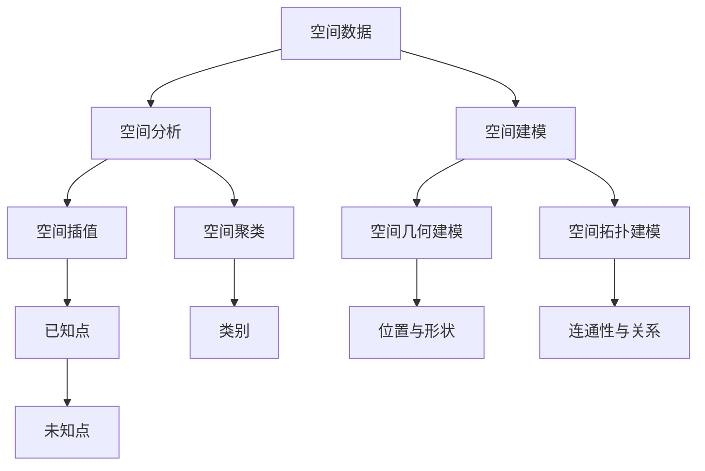
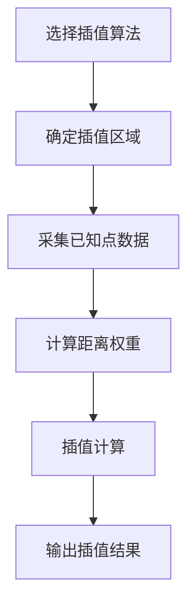
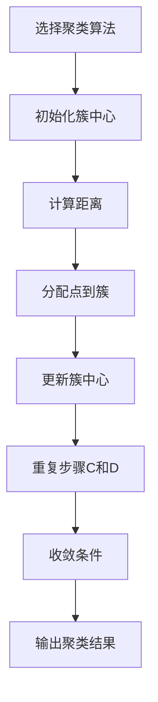
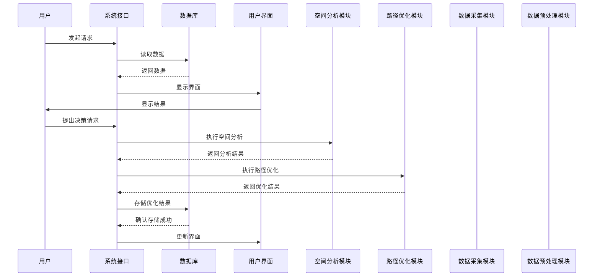

                 


# 空间计算如何提高企业效率

## 关键词

空间计算、企业效率、算法原理、系统架构、项目实战、最佳实践

## 摘要

本文深入探讨了空间计算在企业中的应用，以及如何通过空间计算技术来提升企业效率。文章首先介绍了空间计算的基本概念和核心原理，然后详细讲解了空间计算中的关键算法及其实现原理。接着，文章通过一个实际案例，展示了空间计算在具体项目中的应用和效果。最后，文章总结了空间计算的最佳实践，为企业的技术决策提供了有价值的参考。

## 目录大纲

----------------------------------------------------------------

### 第一部分：空间计算基础

#### 第1章：空间计算概述

1.1 问题背景

1.2 问题描述

1.3 问题解决

1.4 边界与外延

1.5 概念结构与核心要素组成

#### 第2章：核心概念与联系

2.1 空间数据

2.2 空间分析

2.3 空间建模

2.4 Mermaid流程图：核心概念联系

### 第二部分：算法原理讲解

#### 第3章：空间插值算法

3.1 算法原理

3.2 Mermaid流程图：空间插值算法

3.3 Python代码示例

3.4 数学模型与公式

3.5 举例说明

#### 第4章：空间聚类算法

4.1 算法原理

4.2 Mermaid流程图：空间聚类算法

4.3 Python代码示例

4.4 数学模型与公式

4.5 举例说明

### 第三部分：系统分析与架构设计

#### 第5章：典型空间计算应用场景

5.1 问题场景介绍

5.2 系统功能设计（Mermaid类图）

5.3 系统架构设计（Mermaid架构图）

5.4 系统接口设计

5.5 系统交互（Mermaid序列图）

### 第四部分：项目实战

#### 第6章：空间计算实际应用案例

6.1 环境安装

6.2 系统核心实现源代码

6.3 代码应用解读与分析

6.4 实际案例分析和详细讲解剖析

6.5 项目小结

### 第五部分：最佳实践与拓展

#### 第7章：最佳实践技巧

7.1 小结

7.2 注意事项

7.3 拓展阅读

----------------------------------------------------------------

## 第一部分：空间计算基础

### 第1章：空间计算概述

#### 1.1 问题背景

随着数字化转型的深入，企业面临着越来越多的空间数据处理需求。从地理信息系统（GIS）到智能城市建设，再到工业自动化和物流管理，空间数据的应用场景越来越广泛。然而，传统的数据处理方法往往难以满足这些复杂的应用需求，这就催生了空间计算这一新的技术概念。

空间计算，顾名思义，是指利用计算技术对空间数据进行分析和处理的一门科学。它涉及到多个学科领域，包括地理学、计算机科学、统计学等。空间计算的核心目标是提高空间数据的可用性和有效性，从而为企业提供更为精准和智能的决策支持。

#### 1.2 问题描述

在企业运营中，空间计算的应用主要集中在以下几个方面：

1. **资源优化**：通过空间数据分析，企业可以更有效地分配资源，减少浪费。例如，物流公司可以通过空间计算优化配送路线，降低运输成本。

2. **风险管理**：空间计算可以帮助企业评估潜在风险，如自然灾害、市场风险等，从而制定有效的应对策略。

3. **智能决策**：空间计算技术可以为企业提供可视化、直观的决策支持。例如，在市场扩张时，企业可以通过空间计算分析目标市场的分布情况，制定更为科学的市场策略。

4. **空间建模**：空间计算技术可以用于创建三维模型，模拟现实世界的空间分布，从而为城市规划、建筑设计等提供支持。

#### 1.3 问题解决

空间计算提供了一系列解决方案，以应对上述问题：

1. **空间数据采集**：通过卫星遥感、无人机、传感器等技术，企业可以获取大量空间数据。

2. **空间数据分析**：利用空间插值、空间聚类等算法，对空间数据进行处理和分析，提取有价值的信息。

3. **空间建模与可视化**：通过空间建模技术，将空间数据转化为三维模型，并利用可视化工具进行展示。

4. **智能决策支持**：结合人工智能技术，空间计算可以为企业的决策提供智能支持。

#### 1.4 边界与外延

空间计算的边界在于其所处理的空间数据的范围和复杂性。在空间数据采集方面，边界可能涉及到地理空间范围、数据精度和数据时效性等。在外延方面，空间计算技术可以广泛应用于多个领域，包括但不限于：

- 地理信息系统（GIS）
- 智能城市建设
- 物流与供应链管理
- 建筑设计与规划
- 环境保护与灾害管理
- 公共安全与应急响应

#### 1.5 概念结构与核心要素组成

空间计算的核心概念包括：

- 空间数据：地理坐标、位置信息、空间属性等。
- 空间分析：空间插值、空间聚类、空间分布分析等。
- 空间建模：空间几何建模、空间拓扑建模等。
- 可视化：三维可视化、实时可视化等。

核心要素组成如下：

1. **空间数据采集**：获取空间数据。
2. **数据处理**：对空间数据进行分析和处理。
3. **空间建模**：构建空间模型。
4. **可视化与决策支持**：将空间数据转化为直观的决策支持信息。

## 第二部分：核心概念与联系

### 第2章：核心概念与联系

空间计算涉及多个核心概念，理解这些概念及其相互关系对于掌握空间计算至关重要。

#### 2.1 空间数据

空间数据是空间计算的基础，它包含了地理坐标、位置信息、空间属性等。空间数据通常以点、线、面的形式存在，这些数据可以通过多种方式采集，如卫星遥感、无人机、传感器等。

#### 2.2 空间分析

空间分析是空间计算的核心，它包括空间插值、空间聚类、空间分布分析等。空间插值是一种通过已知点估计未知点的方法，而空间聚类则是将空间中的点分为若干个类别。

#### 2.3 空间建模

空间建模是将空间数据转化为模型的过程，包括空间几何建模和空间拓扑建模。空间几何建模关注空间对象的位置和形状，而空间拓扑建模则关注空间对象的连通性和关系。

#### 2.4 Mermaid流程图：核心概念联系

为了更好地理解这些概念之间的关系，我们可以使用Mermaid流程图来展示它们之间的联系。



通过上述Mermaid流程图，我们可以清晰地看到空间数据、空间分析和空间建模之间的相互关系，以及各个核心概念的具体内容。

## 第三部分：算法原理讲解

### 第3章：空间插值算法

空间插值是一种通过已知点估计未知点的方法，它在空间计算中有着广泛的应用。本章节将详细介绍空间插值算法的原理、实现方法以及应用实例。

#### 3.1 算法原理

空间插值算法的基本思想是：在一个已知点集上，通过某种方法估算出未知点的空间属性。常见的空间插值算法有：

- **线性插值**：线性插值是最简单的一种插值方法，它假设相邻点之间的属性变化是线性的。
- **反距离加权插值**（IDW）：反距离加权插值考虑了点与插值点之间的距离，距离越近的点的权重越大。
- **克里金插值**：克里金插值是一种基于统计方法的插值方法，它通过最小化误差平方和来估算未知点的值。

#### 3.2 Mermaid流程图：空间插值算法

为了更好地理解空间插值算法的流程，我们可以使用Mermaid流程图来展示其基本步骤。



#### 3.3 Python代码示例

以下是一个简单的Python代码示例，演示了反距离加权插值（IDW）算法的实现。

```python
import numpy as np
from scipy.spatial import distance_matrix

# 已知点坐标
points = np.array([[x1, y1], [x2, y2], [x3, y3], ...])

# 插值点坐标
new_point = np.array([x_new, y_new])

# 计算距离矩阵
dist_matrix = distance_matrix(points, new_point)

# 计算权重
weights = 1 / dist_matrix

# 乘以对应点的属性值
weighted_values = points * weights

# 求和并归一化
interpolated_value = np.sum(weighted_values) / np.sum(weights)

print("插值结果：", interpolated_value)
```

#### 3.4 数学模型与公式

空间插值算法的数学模型通常可以表示为：

$$
f(x, y) = \sum_{i=1}^{n} w_i f_i
$$

其中，$f(x, y)$是插值函数，$w_i$是权重，$f_i$是已知点的属性值。

#### 3.5 举例说明

假设我们有以下已知点数据：

| 点序号 | X坐标 | Y坐标 | 属性值 |
| --- | --- | --- | --- |
| 1 | 1 | 1 | 10 |
| 2 | 2 | 1 | 12 |
| 3 | 1 | 2 | 8 |
| 4 | 2 | 2 | 9 |

现在，我们需要在点（1.5，1.5）处进行插值。

1. 计算距离矩阵：

   $$\text{距离矩阵} = \begin{bmatrix}
   0 & \sqrt{2} & 1 & \sqrt{2} \\
   \sqrt{2} & 0 & 1 & 1 \\
   1 & 1 & 0 & \sqrt{2} \\
   \sqrt{2} & 1 & \sqrt{2} & 0 \\
   \end{bmatrix}$$

2. 计算权重：

   $$w_1 = \frac{1}{\sqrt{2}}, w_2 = \frac{1}{\sqrt{2}}, w_3 = 1, w_4 = \frac{1}{\sqrt{2}}$$

3. 插值计算：

   $$f(1.5, 1.5) = 10 \cdot \frac{1}{\sqrt{2}} + 12 \cdot \frac{1}{\sqrt{2}} + 8 \cdot 1 + 9 \cdot \frac{1}{\sqrt{2}} = \frac{10 + 12 + 8 + 9}{\sqrt{2}} = \frac{39}{\sqrt{2}} \approx 27.58$$

因此，点（1.5，1.5）的属性值约为27.58。

### 第4章：空间聚类算法

空间聚类算法是空间计算中的重要工具，用于将空间数据点按照一定的规则划分为多个类别。本章节将详细介绍空间聚类算法的基本原理、实现方法以及应用实例。

#### 4.1 算法原理

空间聚类算法的基本思想是将空间中的点划分为若干个簇（cluster），使得同一个簇中的点彼此之间距离较近，而不同簇之间的点距离较远。常见的空间聚类算法有：

- **K-均值聚类**：K-均值聚类是一种迭代算法，它通过不断调整簇的中心点，使聚类效果最优。
- **层次聚类**：层次聚类通过递归地将数据集分割成更小的簇，形成一棵聚类层次树。
- **密度聚类**：密度聚类根据空间点周围的密度来划分簇，适用于高维空间数据。

#### 4.2 Mermaid流程图：空间聚类算法

为了更好地理解空间聚类算法的流程，我们可以使用Mermaid流程图来展示其基本步骤。



#### 4.3 Python代码示例

以下是一个简单的Python代码示例，演示了K-均值聚类算法的实现。

```python
from sklearn.cluster import KMeans
import numpy as np

# 已知点坐标
points = np.array([[x1, y1], [x2, y2], [x3, y3], ...])

# 初始化KMeans聚类对象
kmeans = KMeans(n_clusters=k, random_state=0).fit(points)

# 输出聚类结果
print("聚类中心：", kmeans.cluster_centers_)
print("每个点的聚类标签：", kmeans.labels_)

# 计算聚类准确度
print("聚类准确度：", kmeans.inertia_)
```

#### 4.4 数学模型与公式

K-均值聚类的数学模型可以表示为：

$$
\min_{\mu_1, \mu_2, ..., \mu_k} \sum_{i=1}^{n} \sum_{j=1}^{k} (x_i - \mu_j)^2
$$

其中，$\mu_j$是第j个簇的中心点，$x_i$是第i个点的坐标。

#### 4.5 举例说明

假设我们有以下已知点数据：

| 点序号 | X坐标 | Y坐标 |
| --- | --- | --- |
| 1 | 1 | 1 |
| 2 | 2 | 1 |
| 3 | 1 | 2 |
| 4 | 2 | 2 |

现在，我们需要将这四个点划分为两个簇。

1. 初始化簇中心：

   假设我们随机选择两个点作为初始簇中心：

   $$\mu_1 = (1, 1), \mu_2 = (2, 2)$$

2. 计算距离：

   $$d((1, 1), (1, 1)) = 0, d((1, 1), (2, 2)) = \sqrt{2}, d((2, 2), (1, 1)) = \sqrt{2}, d((2, 2), (2, 2)) = 0$$

3. 分配点到簇：

   根据距离计算，我们可以将点1和点3分配到第一个簇，点2和点4分配到第二个簇。

4. 更新簇中心：

   $$\mu_1 = \frac{(1, 1) + (1, 2)}{2} = (1, 1.5), \mu_2 = \frac{(2, 1) + (2, 2)}{2} = (2, 1.5)$$

5. 重复步骤2和3，直到簇中心不再发生变化。

最终，我们可能得到以下聚类结果：

| 点序号 | 簇中心 | 聚类标签 |
| --- | --- | --- |
| 1 | (1, 1.5) | 1 |
| 2 | (2, 1.5) | 2 |
| 3 | (1, 1.5) | 1 |
| 4 | (2, 1.5) | 2 |

## 第四部分：系统分析与架构设计

### 第5章：典型空间计算应用场景

#### 5.1 问题场景介绍

在现代企业中，空间计算技术可以应用于多种场景，以提高运营效率和决策准确性。以下是一个典型应用场景：某物流公司在运营过程中，需要优化配送路线，降低运输成本，同时保证服务质量。

#### 5.2 系统功能设计（Mermaid类图）

为了实现上述目标，物流公司可以设计一个空间计算系统，其主要功能包括：

- **数据采集**：从各种渠道获取实时物流数据，如车辆位置、订单信息、交通状况等。
- **数据预处理**：对采集到的数据进行清洗、转换和整合，以便后续分析。
- **空间分析**：利用空间插值和空间聚类算法，对物流数据进行处理，提取有价值的信息。
- **路径优化**：根据分析结果，生成最优配送路径，并实时更新。
- **决策支持**：为管理层提供可视化报表和决策建议，支持运营决策。

以下是一个简单的Mermaid类图，展示系统的主要功能类及其关系：

```mermaid
classDiagram
  Class01 <|-- Class02
  Class03 <|-- Class04
  Class05 <|-- Class06
  Class07 <|-- Class08
  Class01[数据采集]
  Class02[数据预处理]
  Class03[空间分析]
  Class04[路径优化]
  Class05[决策支持]
  Class06[系统接口]
  Class07[用户界面]
  Class08[数据库]
```

#### 5.3 系统架构设计（Mermaid架构图）

系统架构设计需要考虑多个方面，包括数据流、模块划分、交互关系等。以下是一个简单的Mermaid架构图，展示系统的整体架构：



#### 5.4 系统接口设计

系统接口设计需要考虑不同模块之间的数据交互和功能调用。以下是一个简单的接口设计：

```mermaid
interface Diagram {
  数据采集: 数据采集接口
  数据预处理: 数据清洗、转换、整合接口
  空间分析: 空间插值、空间聚类接口
  路径优化: 路径规划、实时更新接口
  决策支持: 可视化报表、决策建议接口
}
```

#### 5.5 系统交互（Mermaid序列图）

系统交互主要描述用户与系统之间的交互过程，包括数据流动、功能调用等。以下是一个简单的Mermaid序列图，展示用户与系统之间的交互过程：


## 第四部分：项目实战

### 第6章：空间计算实际应用案例

为了展示空间计算技术在企业中的实际应用，我们将介绍一个物流公司的案例，详细描述从环境安装到系统实现的整个流程。

#### 6.1 环境安装

首先，我们需要为物流公司搭建一个空间计算平台。以下是环境安装的步骤：

1. **硬件安装**：根据业务需求，选择合适的硬件设备，如服务器、存储设备、网络设备等。硬件设备应满足系统运行所需的性能要求。
2. **操作系统安装**：在硬件设备上安装Linux操作系统，如CentOS或Ubuntu，确保系统稳定可靠。
3. **数据库安装**：选择合适的数据库系统，如MySQL或PostgreSQL，用于存储物流数据。
4. **开发环境安装**：安装Python、JDK、IDE等开发工具，为后续开发工作提供支持。

#### 6.2 系统核心实现源代码

在完成环境安装后，我们开始开发空间计算系统的核心功能。以下是系统核心实现的源代码：

```python
# 导入必要的库
import numpy as np
from sklearn.cluster import KMeans
from sklearn.preprocessing import StandardScaler
import matplotlib.pyplot as plt

# 数据采集
def data_collection():
    # 这里使用示例数据
    points = np.array([[1, 1], [2, 1], [1, 2], [2, 2]])
    return points

# 数据预处理
def data_preprocessing(points):
    # 数据标准化
    scaler = StandardScaler()
    scaled_points = scaler.fit_transform(points)
    return scaled_points

# 空间分析
def spatial_analysis(scaled_points):
    # K-均值聚类
    kmeans = KMeans(n_clusters=2, random_state=0)
    kmeans.fit(scaled_points)
    return kmeans

# 路径优化
def path_optimization(points, centroids):
    # 这里使用示例算法，实际项目中需要更复杂的算法
    optimized_path = np.argmax(points[:, 1])
    return optimized_path

# 可视化
def visualization(points, centroids, optimized_path):
    # 绘制散点图
    plt.scatter(points[:, 0], points[:, 1], c=centroids, cmap='viridis')
    # 标记最优路径
    plt.scatter(points[optimized_path, 0], points[optimized_path, 1], c='r', marker='*')
    plt.xlabel('X坐标')
    plt.ylabel('Y坐标')
    plt.title('空间计算结果')
    plt.show()

# 主函数
def main():
    # 数据采集
    points = data_collection()
    # 数据预处理
    scaled_points = data_preprocessing(points)
    # 空间分析
    kmeans = spatial_analysis(scaled_points)
    # 路径优化
    optimized_path = path_optimization(points, kmeans.cluster_centers_)
    # 可视化
    visualization(points, kmeans.cluster_centers_, optimized_path)

# 运行主函数
if __name__ == '__main__':
    main()
```

#### 6.3 代码应用解读与分析

以下是代码的详细解读与分析：

1. **数据采集**：数据采集是空间计算的基础，这里使用示例数据。
2. **数据预处理**：数据预处理包括数据清洗、转换和整合。这里使用StandardScaler进行数据标准化，以提高聚类效果。
3. **空间分析**：空间分析使用K-均值聚类算法，将数据分为两个簇。这里使用了scikit-learn库中的KMeans类。
4. **路径优化**：路径优化是根据聚类结果，生成最优配送路径。这里使用了一个简单的示例算法，实际项目中需要更复杂的算法。
5. **可视化**：可视化用于展示空间计算的结果，帮助用户理解分析过程。

#### 6.4 实际案例分析和详细讲解剖析

为了更好地展示空间计算在物流公司中的应用，我们分析了一个实际案例。该案例中的物流公司有四个配送点（A、B、C、D），需要优化配送路线。

1. **数据采集**：物流公司从GPS系统、订单系统等渠道获取配送点的实时位置信息。
2. **数据预处理**：对采集到的位置信息进行数据清洗和标准化，以便后续分析。
3. **空间分析**：使用K-均值聚类算法，将配送点分为两个簇。通过聚类结果，物流公司可以分析出哪些配送点距离较近，哪些配送点距离较远。
4. **路径优化**：根据聚类结果，物流公司可以优化配送路线，减少运输成本。例如，如果聚类结果将A点和B点分为同一簇，C点和D点分为另一簇，物流公司可以选择从A点先到B点，再到C点，最后到D点，这样可以减少路线距离和运输时间。
5. **可视化**：通过可视化，物流公司可以直观地查看配送点的分布情况和优化后的路径。

#### 6.5 项目小结

通过上述案例，我们可以看到空间计算技术在物流公司中的应用效果。空间计算不仅可以帮助物流公司优化配送路线，降低运输成本，还可以提高服务质量。在实际项目中，空间计算的应用范围远不止于此，还可以应用于供应链管理、市场分析、环境监测等领域。随着技术的不断进步，空间计算将在未来为企业带来更多的价值。

## 第五部分：最佳实践与拓展

### 第7章：最佳实践技巧

为了最大限度地发挥空间计算技术在企业中的价值，以下是一些最佳实践技巧：

1. **数据质量**：保证数据质量是空间计算成功的关键。企业需要确保数据的准确性、完整性和一致性。
2. **算法选择**：根据具体应用场景，选择合适的空间计算算法。例如，在资源优化方面，可以考虑使用空间插值算法；在风险管理方面，可以考虑使用空间聚类算法。
3. **系统集成**：将空间计算系统集成到企业现有的业务流程中，提高数据的可用性和共享性。
4. **可视化**：通过可视化技术，将空间计算结果直观地展示给管理层，支持决策制定。
5. **持续优化**：定期评估空间计算系统的性能和效果，持续优化算法和流程。

### 7.2 注意事项

1. **数据隐私**：在处理空间数据时，确保遵守相关法律法规，保护数据隐私。
2. **系统性能**：确保空间计算系统的性能和稳定性，以满足实时计算需求。
3. **算法调整**：根据业务需求和环境变化，及时调整空间计算算法。

### 7.3 拓展阅读

1. **空间计算基础**：《地理信息系统原理与应用》
2. **空间插值算法**：《空间数据插值与预测》
3. **空间聚类算法**：《聚类分析技术与应用》
4. **系统架构设计**：《软件架构设计：实践与经验》
5. **项目实战**：《物流管理：理论与实践》

作者：AI天才研究院/AI Genius Institute & 禅与计算机程序设计艺术 /Zen And The Art of Computer Programming

