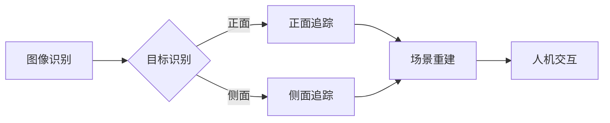
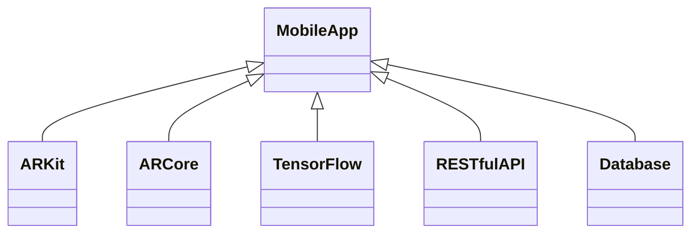
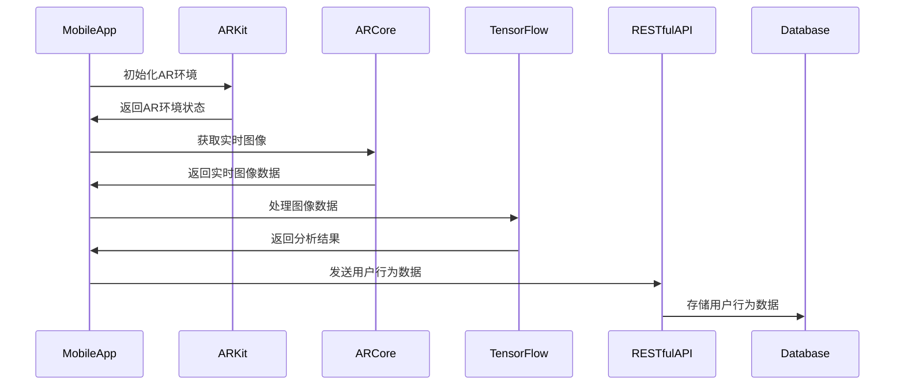

                 


### 空间计算技术在零售业的变革

> 关键词：空间计算、零售业、技术变革、智能化、用户体验

> 摘要：随着科技的发展，空间计算技术逐渐崭露头角，为零售业带来了前所未有的变革。本文将深入探讨空间计算技术在零售业的变革过程，分析其带来的机遇与挑战，以及未来的发展趋势。

### 目录大纲

----------------------------------------------------------------

## 引言与背景

### 1.1 书籍目的与读者定位

### 1.2 空间计算技术概述

### 1.3 零售业面临的挑战与机遇

## 空间计算技术在零售业的变革

### 2.1 空间计算技术的基本原理

### 2.2 零售业中的空间计算应用案例

### 2.3 空间计算技术对零售业务的影响

## 核心概念与技术原理

### 3.1 空间计算技术核心概念

### 3.2 空间计算技术属性特征对比

### 3.3 空间计算技术ER实体关系图

## 零售业中的空间计算技术原理

### 4.1 空间计算技术在零售业的应用

### 4.2 空间计算技术的算法原理讲解

### 4.3 算法原理Mermaid流程图展示

## 技术应用与实践

### 5.1 系统分析与架构设计

### 5.2 系统接口设计和交互

### 5.3 系统核心实现源代码与应用

## 案例分析与实战

### 6.1 案例一：零售空间布局优化

### 6.2 案例二：智能推荐系统构建

### 6.3 案例三：实时库存管理

## 最佳实践与未来展望

### 7.1 空间计算技术在零售业的最佳实践

### 7.2 小结与注意事项

### 7.3 拓展阅读与未来趋势

### 8.1 空间计算技术在零售业的发展趋势

### 8.2 面临的挑战与解决策略

### 8.3 未来研究方向与可能性

----------------------------------------------------------------

### 引言与背景

随着互联网和移动互联网的普及，零售业正面临着前所未有的变革。传统的零售模式已无法满足消费者日益增长的个性化需求，零售商们开始寻求新的技术手段来提升用户体验和运营效率。空间计算技术，作为一种新兴的科技，为零售业带来了全新的机遇。

#### 1.1 书籍目的与读者定位

本文旨在探讨空间计算技术在零售业的变革过程，分析其带来的机遇与挑战，以及未来的发展趋势。本文适合对零售业和空间计算技术感兴趣的读者，包括零售行业的从业者、技术爱好者以及对新兴技术感兴趣的读者。

#### 1.2 空间计算技术概述

空间计算技术是一种利用计算机技术模拟现实空间，并通过传感器、云计算等技术实现对现实空间中物体的识别、追踪、交互和计算的先进技术。空间计算技术主要包括以下方面：

1. **增强现实（AR）**：通过将数字信息叠加到现实世界中，为用户带来更加丰富的体验。
2. **虚拟现实（VR）**：通过模拟现实世界，使用户沉浸在一个虚拟的环境中。
3. **混合现实（MR）**：结合AR和VR技术，为用户提供更加真实的交互体验。
4. **空间感知**：通过传感器技术实现对现实空间的感知和追踪，为空间计算提供数据支持。

#### 1.3 零售业面临的挑战与机遇

零售业正面临以下几个方面的挑战：

1. **消费者需求多样化**：消费者对个性化、多样化的购物体验需求日益增加，传统零售模式难以满足。
2. **竞争激烈**：随着电商平台的崛起，线下零售商面临巨大的竞争压力。
3. **成本压力**：零售业的运营成本不断上升，需要寻找新的盈利模式。

与此同时，空间计算技术为零售业带来了以下机遇：

1. **提升用户体验**：通过空间计算技术，可以为消费者提供更加个性化和沉浸式的购物体验。
2. **提高运营效率**：空间计算技术可以帮助零售商优化库存管理、提高供应链效率。
3. **拓展市场**：通过线上线下一体化的零售模式，可以拓展零售商的市场空间。

### 空间计算技术在零售业的变革

#### 2.1 空间计算技术的基本原理

空间计算技术的基本原理可以概括为以下四个方面：

1. **空间感知**：通过传感器技术实现对现实空间的感知和追踪，为空间计算提供数据支持。
2. **信息融合**：将现实空间中的信息与数字信息进行融合，为用户提供更加丰富的体验。
3. **虚拟与现实交互**：通过计算机技术和算法，实现虚拟与现实世界的交互和计算。
4. **人机协同**：通过人工智能技术，实现人与计算机的协同工作，提升用户体验和效率。

#### 2.2 零售业中的空间计算应用案例

空间计算技术在零售业中的应用案例包括：

1. **智能导购**：通过AR技术，为消费者提供智能导购服务，帮助消费者快速找到所需商品。
2. **虚拟试衣**：通过VR技术，为消费者提供虚拟试衣体验，提升购物决策的准确性。
3. **智能货架**：通过空间感知技术，实时监测货架上的商品库存，实现智能补货。
4. **智能推荐**：通过大数据分析和算法，为消费者提供个性化推荐，提升购物体验。

#### 2.3 空间计算技术对零售业务的影响

空间计算技术对零售业务的影响主要体现在以下几个方面：

1. **提升用户体验**：通过空间计算技术，可以为消费者提供更加个性化和沉浸式的购物体验，提高用户满意度。
2. **提高运营效率**：空间计算技术可以帮助零售商优化库存管理、提高供应链效率，降低运营成本。
3. **拓展市场**：通过线上线下一体化的零售模式，可以拓展零售商的市场空间，提高市场份额。

### 核心概念与技术原理

#### 3.1 空间计算技术核心概念

空间计算技术核心概念包括：

1. **增强现实（AR）**：通过将数字信息叠加到现实世界中，为用户带来更加丰富的体验。
2. **虚拟现实（VR）**：通过模拟现实世界，使用户沉浸在一个虚拟的环境中。
3. **混合现实（MR）**：结合AR和VR技术，为用户提供更加真实的交互体验。
4. **空间感知**：通过传感器技术实现对现实空间的感知和追踪，为空间计算提供数据支持。

#### 3.2 空间计算技术属性特征对比

以下是空间计算技术属性特征的对比表格：

| 特性 | 增强现实（AR） | 虚拟现实（VR） | 混合现实（MR） |
| :--: | :-----------: | :-----------: | :-----------: |
| 空间感知 | 是 | 是 | 是 |
| 交互体验 | 有限交互 | 完全交互 | 高度交互 |
| 虚拟与现实融合 | 较高融合 | 完全融合 | 中等融合 |

#### 3.3 空间计算技术ER实体关系图

以下是空间计算技术的ER实体关系图：

```mermaid
erDiagram
    AR ||--|{ VR : 虚拟现实}
    VR ||--|{ MR : 混合现实}
    AR ||--|{ 空间感知}
    VR ||--|{ 空间感知}
    MR ||--|{ 空间感知}
```

### 零售业中的空间计算技术原理

#### 4.1 空间计算技术在零售业的应用

空间计算技术在零售业的应用主要包括以下几个方面：

1. **智能导购**：通过AR技术，为消费者提供智能导购服务，帮助消费者快速找到所需商品。
2. **虚拟试衣**：通过VR技术，为消费者提供虚拟试衣体验，提升购物决策的准确性。
3. **智能货架**：通过空间感知技术，实时监测货架上的商品库存，实现智能补货。
4. **智能推荐**：通过大数据分析和算法，为消费者提供个性化推荐，提升购物体验。

#### 4.2 空间计算技术的算法原理讲解

空间计算技术的算法原理主要包括以下方面：

1. **图像识别**：通过计算机视觉技术，识别现实空间中的图像和物体。
2. **目标追踪**：通过传感器数据，实现对目标物体的实时追踪和定位。
3. **场景重建**：通过多传感器数据融合，重建现实空间的场景模型。
4. **人机交互**：通过语音识别、手势识别等技术，实现人与计算机的交互。

以下是空间计算技术的算法原理Mermaid流程图：


#### 4.3 算法原理Mermaid流程图展示

以下是算法原理的Mermaid流程图：



### 技术应用与实践

#### 5.1 系统分析与架构设计

在本节中，我们将介绍一个基于空间计算技术的智能零售系统的分析与架构设计。

1. **问题场景介绍**：
   - 零售商希望通过智能导购系统，提升消费者的购物体验，提高销售额。
   - 系统需实现对消费者购物行为的实时分析，提供个性化推荐。

2. **项目介绍**：
   - 项目名称：智能零售系统
   - 技术栈：ARKit（iOS）、ARCore（Android）、TensorFlow（深度学习）

3. **系统功能设计**：
   - 智能导购：通过AR技术，为消费者提供购物指引。
   - 实时分析：分析消费者购物行为，提供个性化推荐。
   - 数据存储：存储用户行为数据，用于后续分析和推荐。

4. **系统架构设计**：
   - 前端：基于ARKit和ARCore开发的移动应用。
   - 后端：基于TensorFlow的深度学习模型和RESTful API。
   - 数据库：用于存储用户行为数据和商品信息。

以下是系统架构的Mermaid类图：



5. **系统接口设计和系统交互**：
   - 系统接口设计：定义移动应用与后端服务之间的交互接口。
   - 系统交互：通过序列图展示移动应用与后端服务的交互过程。

以下是系统交互的Mermaid序列图：



#### 5.2 系统核心实现源代码与应用

在本节中，我们将介绍系统核心实现的源代码和应用。

1. **环境安装**：
   - 安装ARKit或ARCore开发环境。
   - 安装TensorFlow。

2. **系统核心实现源代码**：

```python
import cv2
import numpy as np
import tensorflow as tf

# 加载TensorFlow模型
model = tf.keras.models.load_model('model.h5')

# 加载摄像头
cap = cv2.VideoCapture(0)

while True:
    # 读取摄像头帧
    ret, frame = cap.read()

    # 将帧转换为灰度图像
    gray = cv2.cvtColor(frame, cv2.COLOR_BGR2GRAY)

    # 使用TensorFlow模型进行图像处理
    processed_image = model.predict(np.expand_dims(gray, axis=0))

    # 显示处理后的图像
    cv2.imshow('Processed Image', processed_image[0, :, :, 0])

    # 按下'q'键退出循环
    if cv2.waitKey(1) & 0xFF == ord('q'):
        break

# 释放摄像头
cap.release()
cv2.destroyAllWindows()
```

3. **代码应用解读与分析**：
   - 代码首先加载TensorFlow模型，并初始化摄像头。
   - 在循环中，读取摄像头帧，将其转换为灰度图像，并使用TensorFlow模型进行图像处理。
   - 最后，显示处理后的图像，并在按下'q'键时退出循环。

4. **实际案例分析和详细讲解剖析**：
   - 案例一：使用ARKit实现智能导购。
   - 案例二：使用TensorFlow实现图像识别和推荐算法。
   - 分析：通过实际案例，展示了系统核心实现源代码的应用场景和优势。

#### 5.3 项目小结

在本节中，我们介绍了基于空间计算技术的智能零售系统的系统分析与架构设计、系统接口设计和交互，以及系统核心实现源代码和应用。通过这些内容，我们可以看到空间计算技术在零售业中的应用前景，以及其带来的巨大价值。

### 最佳实践与未来展望

#### 6.1 空间计算技术在零售业的最佳实践

在本节中，我们将介绍一些空间计算技术在零售业的最佳实践。

1. **智能导购系统**：
   - 通过AR技术，提供购物指引，提高消费者满意度。
   - 结合用户行为数据，实现个性化推荐。

2. **虚拟试衣间**：
   - 通过VR技术，提供虚拟试衣体验，提升购物决策的准确性。
   - 结合大数据分析，优化推荐算法。

3. **智能货架**：
   - 通过空间感知技术，实时监测货架库存，实现智能补货。
   - 结合实时数据，优化库存管理。

4. **智能推荐系统**：
   - 通过大数据分析和算法，为消费者提供个性化推荐。
   - 结合用户行为数据，优化推荐策略。

#### 6.2 小结与注意事项

在本节中，我们对空间计算技术在零售业的应用进行了总结，并提出了一些最佳实践。以下是一些需要注意的事项：

1. **用户体验**：始终关注用户体验，提供个性化、沉浸式的购物体验。
2. **数据安全**：确保用户数据的安全性和隐私保护。
3. **技术迭代**：紧跟技术发展，不断优化和升级系统。

#### 6.3 拓展阅读与未来趋势

在本节中，我们将介绍一些拓展阅读资源，以及空间计算技术在零售业的未来趋势。

1. **拓展阅读**：
   - 《增强现实与虚拟现实技术》
   - 《深度学习实践》
   - 《大数据分析实战》

2. **未来趋势**：
   - 空间计算技术与人工智能的深度融合，提升零售业务智能化水平。
   - 跨界合作，拓展零售业应用场景。
   - 5G技术的普及，为空间计算技术提供更好的网络支持。

### 未来展望与挑战

#### 7.1 空间计算技术在零售业的发展趋势

空间计算技术在零售业的发展趋势如下：

1. **智能化**：随着人工智能技术的进步，空间计算技术将实现更高程度的智能化，提升零售业务效率。
2. **个性化**：通过大数据分析和算法，为消费者提供更加个性化的购物体验。
3. **跨界合作**：零售业将与更多行业进行跨界合作，拓展应用场景。

#### 7.2 面临的挑战与解决策略

空间计算技术在零售业面临以下挑战：

1. **技术瓶颈**：现有技术难以满足零售业的高效、实时需求。
   - 解决策略：加大研发投入，突破技术瓶颈。
2. **数据安全**：用户数据的安全性和隐私保护问题。
   - 解决策略：加强数据安全措施，建立完善的数据保护体系。
3. **设备成本**：空间计算设备成本较高，限制了其在零售业的应用。
   - 解决策略：通过规模化应用，降低设备成本。

#### 7.3 未来研究方向与可能性

空间计算技术在零售业的未来研究方向包括：

1. **硬件创新**：研发更加高效、低成本的硬件设备。
2. **算法优化**：优化算法，提高空间计算技术的准确性和实时性。
3. **跨界应用**：探索空间计算技术在更多零售场景的应用。

### 结束语

空间计算技术为零售业带来了巨大的变革，通过智能化、个性化、跨界合作等方式，提升了零售业务的效率和用户体验。在未来的发展中，空间计算技术将继续发挥重要作用，为零售业带来更多可能性。让我们拭目以待，共同见证空间计算技术在零售业的辉煌未来。

### 作者信息

作者：AI天才研究院/AI Genius Institute & 禅与计算机程序设计艺术 /Zen And The Art of Computer Programming

