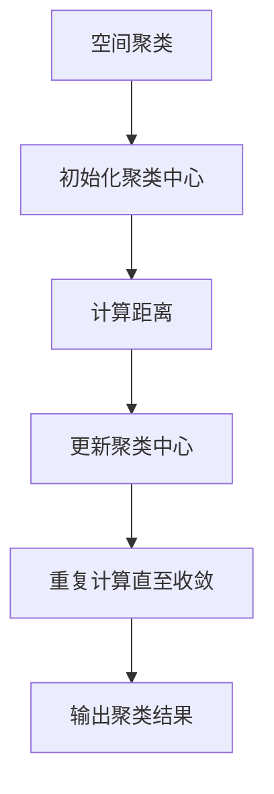
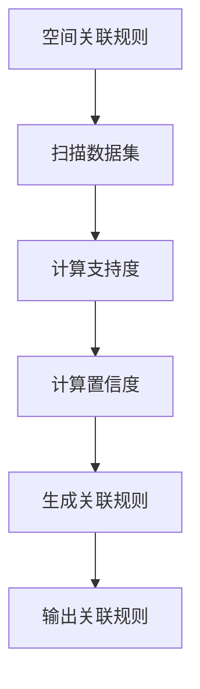
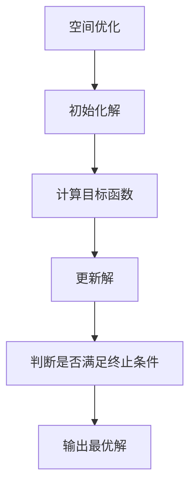
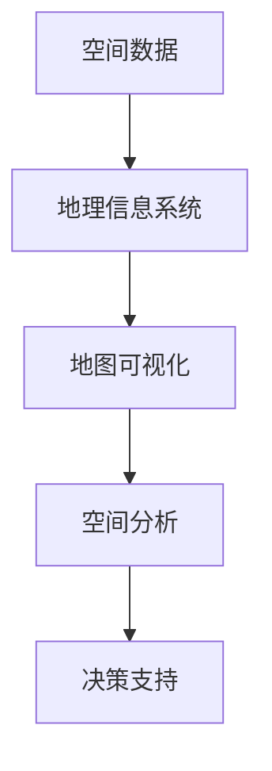
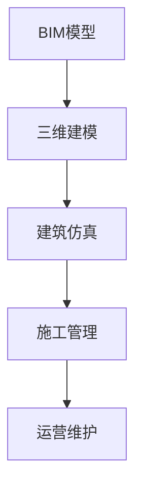
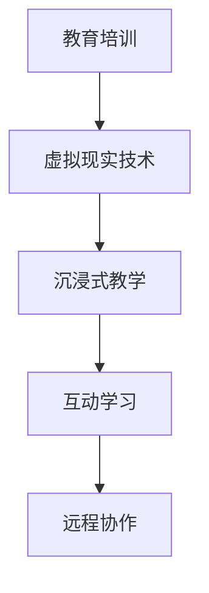

                 

# 空间计算技术简化工作流程的方式

> 关键词：空间计算、工作流程、简化、效率提升、应用案例

> 摘要：本文深入探讨了空间计算技术如何通过优化数据处理、虚拟现实和增强现实等技术，简化并加速现代工作流程。文章首先介绍了空间计算技术的发展背景和核心概念，然后详细分析了其在不同领域中的应用原理，最后通过实际案例展示了空间计算技术在提升工作效率方面的具体应用。

## 引言

随着信息技术和计算能力的飞速发展，空间计算技术逐渐成为现代工作流程的重要推动力。空间计算技术包括三维建模、虚拟现实（VR）和增强现实（AR）等技术，通过将现实世界中的空间信息数字化，为工作流程的优化提供了新的可能。本文旨在探讨空间计算技术如何通过以下几个步骤简化工作流程：

1. **优化数据处理**：空间计算技术通过高效的空间数据分析，实现大规模空间数据的快速处理，为工作流程的各个阶段提供准确、实时的数据支持。
2. **虚拟现实与增强现实应用**：VR和AR技术为工作流程中的各个环节提供沉浸式体验，提高工作效率和准确性。
3. **跨领域应用**：空间计算技术在多个领域的应用，如建筑、制造、教育等，展示了其在提升工作效率方面的巨大潜力。

## 背景与概述

### 1.1 空间计算技术的历史与现状

空间计算技术起源于计算机图形学和地理信息系统（GIS），随着计算机硬件性能的提升和算法的进步，空间计算技术逐渐发展壮大。目前，空间计算技术已广泛应用于城市规划、建筑设计、医疗诊断等多个领域。

### 1.2 空间计算技术的发展趋势

未来，空间计算技术将继续朝着更加高效、智能和人性化的方向发展。例如，基于人工智能的空间计算技术将进一步提升数据处理和分析的效率，而5G和边缘计算技术的融合将使VR和AR应用更加实时和流畅。

### 1.3 空间计算技术的应用领域

空间计算技术的应用领域广泛，包括但不限于以下几个方面：

- **城市规划与设计**：通过三维建模和VR/AR技术，实现城市规划的可视化和虚拟仿真，提高设计效率和准确性。
- **建筑设计**：利用BIM（建筑信息模型）技术，实现建筑设计的全生命周期管理，提升施工效率和安全性。
- **医疗**：通过三维重建和VR技术，辅助医疗诊断和手术模拟，提高医疗质量和效率。

## 空间计算技术核心概念

### 2.1 空间数据的定义与类型

空间数据是指与地理位置相关的数据，可以分为点、线和面三种类型。点数据表示地理位置，线数据表示路径或边界，面数据表示区域或表面。

### 2.2 三维建模的基本原理

三维建模是通过计算机技术创建三维模型的过程。主要方法包括三维扫描、三维建模软件和深度学习算法。

### 2.3 虚拟现实与增强现实技术介绍

虚拟现实（VR）通过计算机生成的三维环境，提供沉浸式体验。增强现实（AR）则是将虚拟信息叠加到现实世界中，实现虚实结合。

## 空间计算技术的关键原理

### 3.1 空间数据分析方法

空间数据分析包括空间聚类、空间关联规则和空间优化等算法。这些算法可以帮助从大规模空间数据中提取有价值的信息。

### 3.2 三维模型的生成与优化

三维模型的生成包括三维扫描和三维建模软件的使用。优化算法则用于提高模型的质量和效率。

### 3.3 空间计算技术的融合应用

空间计算技术可以与其他技术如人工智能、大数据和物联网等融合，实现更加智能和高效的工作流程。

## 空间计算技术的边界与外延

### 4.1 空间计算技术与其他技术的融合

空间计算技术可以与人工智能、大数据和物联网等技术融合，实现更加智能和高效的工作流程。

### 4.2 空间计算技术的挑战与机遇

空间计算技术在发展过程中面临一系列挑战，如数据安全、隐私保护和标准化等。但同时也为各行业带来了新的机遇。

### 4.3 空间计算技术的未来发展趋势

未来，空间计算技术将继续朝着更加智能化、实时化和跨领域融合的方向发展，为各行业提供更加高效和智能的工作流程。

## 空间计算技术的关键算法

### 5.1 空间数据分析算法

空间数据分析算法包括空间聚类、空间关联规则和空间优化等。以下是一个简单的空间聚类算法示例：

#### 5.1.1 空间聚类算法



#### 5.1.2 空间关联规则算法

空间关联规则算法用于发现空间数据中的潜在关系。以下是一个简单的空间关联规则算法示例：



#### 5.1.3 空间优化算法

空间优化算法用于优化空间数据的位置和形状。以下是一个简单的空间优化算法示例：



### 5.2 三维建模算法

三维建模算法包括三维重建、三维模型优化和三维模型渲染。以下是一个简单的三维重建算法示例：

```python
# 三维重建算法示例
import numpy as np

def reconstruction(points):
    # 计算三维坐标
    coordinates = np.dot(points, np.linalg.inv(K))
    return coordinates

# 示例数据
points = np.array([[x1, y1, 1], [x2, y2, 1], ...])

# 摄像机内参
K = np.array([[fx, 0, cx], [0, fy, cy], [0, 0, 1]])

# 重建三维坐标
reconstructed_points = reconstruction(points)
```

### 5.3 虚拟现实与增强现实技术

虚拟现实（VR）和增强现实（AR）技术广泛应用于工作流程的各个阶段。以下是一个简单的VR应用示例：

```python
# VR应用示例
import pygame
from pygame.locals import *

# 初始化VR环境
pygame.init()
screen = pygame.display.set_mode((800, 600))
clock = pygame.time.Clock()

# 渲染三维模型
def render_model(model):
    # ...渲染代码...

# 运行VR应用
while True:
    for event in pygame.event.get():
        if event.type == QUIT:
            pygame.quit()
            sys.exit()

    # 渲染场景
    render_model(model)
    pygame.display.flip()
    clock.tick(60)
```

## 空间计算技术的应用

### 6.1 地理信息系统（GIS）中的应用

GIS技术利用空间计算技术实现地理信息的可视化和管理。以下是一个简单的GIS应用示例：



### 6.2 建筑信息模型（BIM）中的应用

BIM技术利用空间计算技术实现建筑设计的全生命周期管理。以下是一个简单的BIM应用示例：



### 6.3 虚拟现实在教育培训中的应用

虚拟现实技术为教育培训提供了新的交互方式和学习体验。以下是一个简单的VR教育培训应用示例：



## 未来趋势与挑战

空间计算技术在未来将继续发展，但同时也面临一系列挑战。以下是一些未来趋势和挑战：

- **智能化**：空间计算技术将更加智能化，实现自动化数据处理和分析。
- **实时化**：5G和边缘计算技术的融合将使空间计算技术的应用更加实时和高效。
- **跨领域融合**：空间计算技术将与其他技术如人工智能、大数据等深度融合，推动各行业的发展。
- **标准化**：空间计算技术的标准化将提高应用的一致性和互操作性。
- **数据安全与隐私保护**：空间计算技术将面临数据安全和隐私保护方面的挑战。

## 总结

空间计算技术通过优化数据处理、虚拟现实和增强现实等技术，为现代工作流程的简化提供了新的途径。本文从背景与概述、核心技术、应用实践和未来趋势等方面，全面探讨了空间计算技术在简化工作流程方面的作用。通过实际案例的分析，展示了空间计算技术在提升工作效率方面的巨大潜力。

## 附录：资源与拓展阅读

- **空间计算技术概述**：《空间计算：理论与实践》
- **空间数据分析算法**：《空间数据分析与建模》
- **虚拟现实与增强现实技术**：《虚拟现实与增强现实技术》
- **BIM技术应用**：《建筑信息模型（BIM）技术与应用》
- **GIS技术应用**：《地理信息系统（GIS）技术与应用》

### 作者

作者：AI天才研究院/AI Genius Institute & 禅与计算机程序设计艺术 /Zen And The Art of Computer Programming

