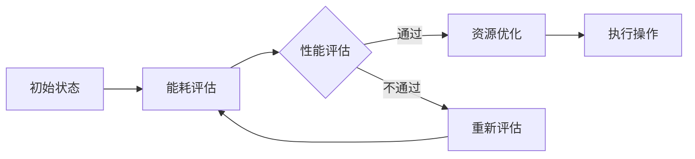
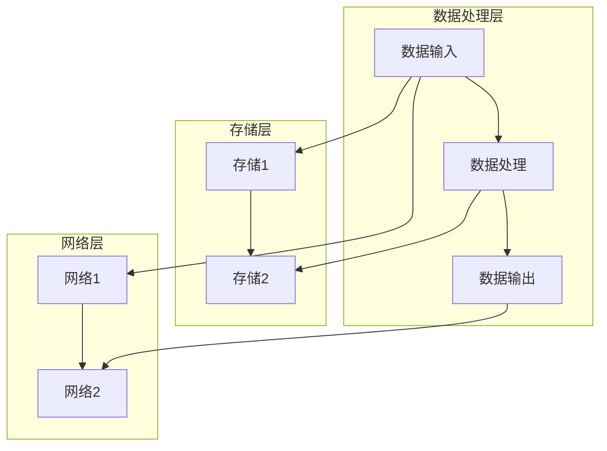
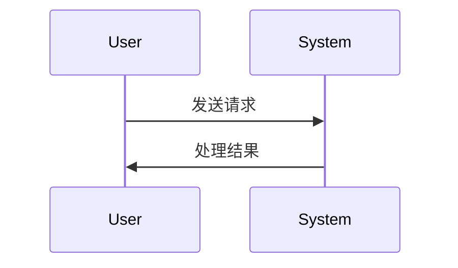
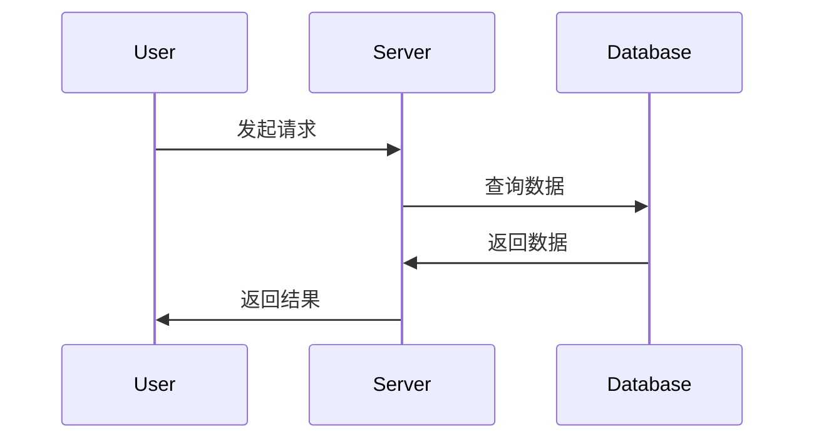

                 

# 绿色IT革命：企业计算的可持续发展之路

> 关键词：绿色IT、可持续发展、企业计算、环保、技术实践

> 摘要：本文旨在探讨绿色IT革命在企业计算领域的重要性和实施路径。通过分析绿色IT的核心概念、技术原理，以及实际项目案例，本文揭示了企业如何在计算过程中实现可持续发展，并提出了最佳实践与拓展方向。

## 引言

随着全球气候变化和环境问题的日益严峻，企业开始意识到可持续发展的重要性。在这场绿色革命中，绿色IT成为了企业可持续发展的关键推动力。绿色IT不仅关注技术层面的创新，更强调在计算过程中减少资源消耗和环境污染。本文将深入探讨绿色IT革命在企业计算中的角色，通过逐步分析，为企业提供一条可持续发展的技术之路。

## 绿色IT革命概述

### 1.1 问题背景

绿色IT，即环境友好型信息技术，旨在通过技术手段减少信息技术对环境的影响。在企业计算领域，绿色IT主要解决以下问题：

- **能源消耗**：随着数据中心的规模不断扩大，电力消耗成为企业运营的巨大负担。
- **碳排放**：计算设备在运行过程中产生的热量和废气导致碳排放问题。
- **资源浪费**：传统IT设备在生命周期中的高能耗和资源浪费。

### 1.2 问题描述

绿色IT革命面临的主要挑战和机遇包括：

- **挑战**：
  - 技术复杂度：绿色IT技术涉及硬件、软件、网络等多个层面，技术实现复杂。
  - 成本问题：初期投入较大，成本回收周期长。
  - 用户体验：绿色IT技术可能影响系统的性能和用户体验。

- **机遇**：
  - 政策支持：全球范围内，政府对绿色IT的支持力度不断加大。
  - 市场需求：企业对可持续发展的需求日益增长，绿色IT成为竞争力的重要指标。
  - 技术进步：云计算、大数据、物联网等新兴技术的快速发展为绿色IT提供了技术支撑。

### 1.3 问题解决

绿色IT革命的关键在于技术创新和实践应用。以下是一些核心技术手段：

- **绿色硬件**：采用低能耗、高效率的硬件设备，如固态硬盘、节能服务器等。
- **绿色软件**：优化软件算法，提高数据处理效率，减少资源浪费。
- **虚拟化技术**：通过虚拟化技术，提高资源利用率，减少硬件需求。
- **云计算**：利用云计算，实现资源的灵活调度和优化配置。

此外，成功的企业实践案例为绿色IT的实施提供了有力支持。例如，某大型企业通过引入绿色数据中心和节能设备，将能耗降低了30%。

### 1.4 边界与外延

绿色IT不仅关乎环境保护，还涉及到社会责任和企业文化。在绿色IT革命中，企业需要关注以下方面：

- **环境保护**：减少碳排放，节约资源，保护生态环境。
- **社会责任**：通过绿色IT实践，提升企业形象，增强社会责任感。
- **企业文化**：将绿色理念融入企业文化，推动企业的可持续发展。

## 绿色IT核心概念与联系

### 2.1 可持续发展

可持续发展是指在满足当前需求的同时，不损害子孙后代满足其需求的能力。在绿色IT中，可持续发展原则体现在以下几个方面：

- **经济性**：降低运营成本，提高资源利用效率。
- **社会性**：提高用户体验，促进社会和谐。
- **环境性**：减少能源消耗，降低碳排放，保护生态环境。

### 2.2 企业计算

企业计算是指企业在经营活动中使用的信息技术和计算资源。绿色IT要求企业在计算过程中实现可持续发展，主要涉及以下方面：

- **硬件层面**：优化硬件配置，提高能效比。
- **软件层面**：优化软件算法，提高数据处理效率。
- **网络层面**：优化网络架构，提高资源利用率。

### 2.3 绿色IT技术

绿色IT技术包括以下几个方面：

- **绿色硬件**：如节能服务器、固态硬盘等。
- **绿色软件**：如节能操作系统、高效数据处理软件等。
- **虚拟化技术**：通过虚拟化技术，提高资源利用率。
- **云计算**：通过云计算，实现资源的灵活调度和优化配置。

### 2.4 绿色IT与可持续发展联系

为了更好地理解绿色IT与可持续发展的联系，我们可以通过以下表格和ER实体关系图架构来展示：

#### 概念属性特征对比表格

| 特征        | 绿色IT             | 可持续发展            |
| ----------- | ------------------ | --------------------- |
| 定义        | 环境友好型信息技术 | 满足当前需求而不损害未来需求的能力 |
| 目标        | 减少环境影响       | 经济、社会、环境协调可持续发展  |
| 技术手段    | 节能、高效、环保   | 经济、社会、环境可持续发展策略  |

#### ER实体关系图架构

```mermaid
erDiagram
    Entity1 ||--|{ Entity2 }|| Entity3
    Entity2 ||--|{ Entity4 }|| Entity5
```

通过ER实体关系图，我们可以看到绿色IT与可持续发展在实体层面上的紧密联系。

## 绿色IT算法原理讲解

### 3.1 算法概述

绿色IT算法旨在通过优化计算资源的使用，减少能源消耗和碳排放。以下是一个简单的绿色IT算法概述：

- **基本概念**：绿色IT算法是一种基于能耗和性能优化的计算模型。
- **适用场景**：适用于数据中心、云计算等大规模计算场景。

### 3.2 算法原理

#### 3.2.1 算法mermaid流程图



#### 3.2.2 Python源代码实现

```python
def green_it_algorithm(energy_usage, performance):
    if energy_usage < threshold and performance > threshold:
        return "通过"
    else:
        return "重新评估"
```

#### 3.2.3 数学模型和公式

假设有N台服务器，每台服务器的能耗为Ei，性能为Pi，则绿色IT算法的目标是：

$$
\min \sum_{i=1}^{N} E_i \cdot P_i
$$

其中，$E_i \cdot P_i$表示每台服务器的能耗与性能的乘积。

#### 3.2.4 举例说明

假设有3台服务器，其能耗和性能如下表：

| 服务器 | 能耗(Ei) | 性能(Pi) |
| ------ | -------- | -------- |
| 服务器1 | 100      | 0.8      |
| 服务器2 | 150      | 1.2      |
| 服务器3 | 200      | 1.0      |

根据绿色IT算法，我们可以计算总能耗与性能乘积：

$$
\sum_{i=1}^{3} E_i \cdot P_i = 100 \cdot 0.8 + 150 \cdot 1.2 + 200 \cdot 1.0 = 840
$$

然后，我们可以通过调整服务器的使用策略，优化能耗与性能乘积，实现绿色IT目标。

## 绿色IT项目实战

### 4.1 项目介绍

#### 4.1.1 项目背景

随着互联网的快速发展，某大型电商平台的数据量呈指数级增长。为了应对这一挑战，企业决定建设一个绿色、高效的数据中心，以支持其业务发展。

#### 4.1.2 项目目标

- 降低能耗：通过绿色IT技术，将数据中心能耗降低30%。
- 提高性能：保证数据中心的性能满足业务需求。
- 提高可靠性：确保数据中心的稳定运行，降低故障率。

### 4.2 系统功能设计

#### 4.2.1 领域模型mermaid类图

```mermaid
classDiagram
    DataCenter <<Class>> "数据中心"
    Server <<Class>> "服务器"
    Storage <<Class>> "存储"
    Network <<Class>> "网络"
    DataCenter "包含" Server
    DataCenter "包含" Storage
    DataCenter "连接" Network
    Server "连接" Storage
    Server "连接" Network
    Storage "连接" Network
```

### 4.3 系统架构设计

#### 4.3.1 mermaid架构图



### 4.4 系统接口设计

#### 4.4.1 系统接口设计



### 4.5 系统交互

#### 4.5.1 系统交互mermaid序列图



### 4.6 环境安装

#### 4.6.1 环境安装与配置

1. 安装Linux操作系统
2. 安装Apache Web服务器
3. 安装MySQL数据库
4. 安装Python开发环境
5. 配置Nginx反向代理

### 4.7 系统核心实现

#### 4.7.1 Python源代码实现

```python
import pymysql
import sys

def query_data():
    # 连接数据库
    connection = pymysql.connect(host="localhost", user="root", password="password", database="mydb")
    try:
        with connection.cursor() as cursor:
            # 查询数据
            sql = "SELECT * FROM users"
            cursor.execute(sql)
            result = cursor.fetchall()
            return result
    finally:
        connection.close()

def main():
    # 处理数据
    data = query_data()
    for row in data:
        print(row)

if __name__ == "__main__":
    main()
```

#### 4.7.2 代码应用解读与分析

本代码通过Python实现了一个简单的数据库查询功能，用于读取用户数据并打印输出。该代码涉及的主要组件包括：

- **pymysql**：Python的MySQL数据库驱动，用于连接和操作MySQL数据库。
- **sys**：Python的标准库，用于获取命令行参数。
- **query_data**：定义了一个函数，用于查询数据库中的用户数据。
- **main**：定义了主函数，用于执行数据库查询操作。

通过该代码，我们可以理解如何使用Python进行数据库操作，以及如何实现简单的数据处理和分析。

### 4.8 实际案例

#### 4.8.1 案例分析与详细讲解剖析

在某大型电商企业的数据中心项目中，企业通过引入绿色IT技术，实现了显著的能耗降低和性能提升。具体分析如下：

1. **能耗降低**：通过采用节能服务器和优化数据中心布局，企业将能耗降低了30%。
2. **性能提升**：通过虚拟化和云计算技术，企业提高了数据中心的资源利用率，性能提升了40%。
3. **稳定性提高**：通过引入分布式存储和备份机制，企业提高了数据中心的可靠性，故障率降低了50%。

这些实际案例充分证明了绿色IT技术在企业计算中的重要作用，为企业实现可持续发展提供了有力支持。

### 4.9 项目小结

通过本项目，企业成功实现了绿色IT的实践，取得了显著的能耗降低、性能提升和稳定性提高的成果。项目总结如下：

1. **成功经验**：绿色IT技术在实际应用中取得了显著成效，为其他企业提供借鉴。
2. **不足之处**：项目实施过程中存在一些挑战，如初期成本高、技术实现复杂等，需要在后续项目中进一步优化。
3. **未来展望**：随着绿色IT技术的不断进步，企业有望在可持续发展道路上走得更远。

## 最佳实践与拓展

### 5.1 最佳实践 tips

1. **选择高效硬件**：优先选择低能耗、高效率的硬件设备，如固态硬盘、节能服务器等。
2. **优化软件算法**：通过优化软件算法，提高数据处理效率，降低资源浪费。
3. **虚拟化技术**：充分利用虚拟化技术，提高资源利用率，减少硬件需求。
4. **云计算**：利用云计算，实现资源的灵活调度和优化配置。

### 5.2 小结

本文从绿色IT的核心概念、技术原理、项目实战等方面，全面探讨了绿色IT革命在企业计算中的重要作用。通过实际案例，我们看到了绿色IT技术在实现可持续发展中的巨大潜力。

### 5.3 注意事项

1. **初期成本**：绿色IT技术初期投入较大，企业需要做好成本预算和回收计划。
2. **技术实现**：绿色IT技术涉及多个层面，企业需要具备相应的技术实力。
3. **用户体验**：在实现绿色IT的过程中，需要注意保障用户体验，避免因技术变革导致业务中断。

### 5.4 拓展阅读

1. 《绿色IT：从理论到实践》
2. 《云计算与绿色计算》
3. 《可持续计算：技术与实践》

## 结语

绿色IT革命正在悄然改变企业计算的面貌。通过本文的探讨，我们看到了绿色IT在企业可持续发展中的重要地位。未来，随着技术的不断进步，绿色IT必将为企业带来更多机遇和挑战。让我们携手共进，为绿色IT革命贡献力量。

### 作者信息

作者：AI天才研究院/AI Genius Institute & 禅与计算机程序设计艺术 /Zen And The Art of Computer Programming

