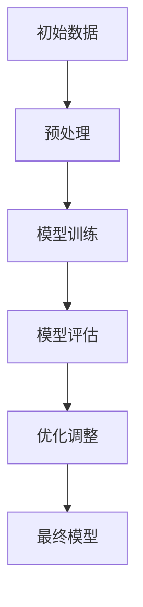
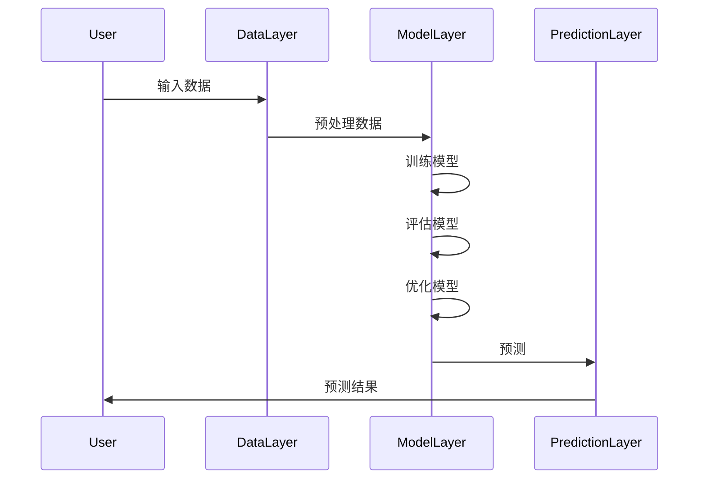

                 

### 绿色IT：平衡技术发展和环境保护

#### 关键词：绿色IT、环境保护、技术发展、能源效率、可持续发展

> 摘要：随着信息技术的发展，能源消耗和环境污染问题日益严重。绿色IT旨在通过优化技术手段和策略，实现技术发展和环境保护的平衡。本文将介绍绿色IT的背景、核心概念、算法原理，并通过具体实例探讨其在实际应用中的重要性。

#### 第一部分：背景介绍

##### 1.1 问题背景

在过去的几十年中，信息技术的飞速发展带动了数据处理能力的显著提升。大数据和云计算技术的广泛应用使得企业在获取、存储、分析和利用数据方面取得了前所未有的成就。然而，这些技术的快速发展也带来了巨大的能源消耗和环境污染问题。

服务器和数据中心作为信息技术的重要基础设施，其运行过程中消耗了大量的电力。据统计，全球数据中心的能源消耗已经超过了全球总电力消耗的1%。此外，电子废弃物的产生也日益成为一个严重的社会问题。每年，全球产生的电子废弃物中有大量的有害物质，如重金属和有机化合物，对环境和人类健康造成了潜在威胁。

因此，绿色IT的概念应运而生。绿色IT关注的是通过优化技术手段和策略，降低IT设备和系统的能源消耗，减少对环境的影响，实现技术发展和环境保护的平衡。

##### 1.2 问题描述

绿色IT涉及多个方面的技术和策略，包括但不限于以下方面：

- **服务器虚拟化**：通过将多个物理服务器虚拟化为多个虚拟服务器，提高硬件资源的利用率，降低能源消耗。
- **能效管理**：采用高效硬件设备、优化软件算法和运行策略，降低服务器和系统的能耗。
- **可再生能源的使用**：鼓励数据中心采用太阳能、风能等可再生能源，减少对化石燃料的依赖。
- **绿色数据中心建设**：通过设计高效冷却系统、优化空间布局等手段，降低数据中心的能耗。

绿色IT的目标是在提高技术效率的同时，最大限度地减少对环境的影响。然而，在实现这一目标的过程中，如何平衡技术发展和环境保护成为了一个重要的问题。

##### 1.3 问题解决

要解决绿色IT中的平衡问题，可以采取以下几种方法：

- **提高能源效率**：通过采用节能硬件、优化软件算法和运行策略，提高数据中心的能源利用效率。
- **减少电子废物**：推广电子废弃物的回收和再利用，减少生产过程中的环境影响。
- **推动可持续发展**：鼓励企业采用环保材料和工艺，推动整个IT行业的绿色转型。

##### 1.4 边界与外延

绿色IT不仅关注数据中心的能源效率，还涉及IT产品全生命周期的环境影响。这包括原材料采购、生产、使用、维护和废弃处理等环节。同时，绿色IT也关注社会影响，如提高数据安全性、促进社会公正等。

##### 1.5 概念结构与核心要素组成

绿色IT的核心概念包括：

- **绿色数据中心**：采用节能技术和设备，提高能源效率。
- **绿色软件**：编写高效、低能耗的软件，优化数据处理流程。
- **绿色硬件**：使用环保材料和工艺，减少电子废弃物的产生。
- **绿色供应链**：建立环保、可持续的供应链体系。

#### 第二部分：核心概念与联系

##### 2.1 核心概念原理

绿色IT的核心概念包括绿色数据中心、绿色软件、绿色硬件和绿色供应链。下面将分别介绍这些核心概念的原理。

###### 绿色数据中心

绿色数据中心是通过采用节能技术和设备，提高能源利用效率，降低数据中心的能源消耗。其核心原理包括：

- **高效硬件设备**：采用高效的硬件设备，如高效能的服务器和存储设备，降低能耗。
- **优化软件算法**：通过优化软件算法和运行策略，降低服务器和系统的能耗。
- **可再生能源的使用**：鼓励数据中心采用太阳能、风能等可再生能源，减少对化石燃料的依赖。

绿色数据中心的数学模型可以表示为：

$$
E_{datacenter} = f(\text{硬件效率}, \text{软件效率}, \text{可再生能源比例})
$$

其中，$E_{datacenter}$表示数据中心的总能耗，$f$表示能耗函数，$\text{硬件效率}$、$\text{软件效率}$和$\text{可再生能源比例}$分别表示硬件设备、软件算法和可再生能源的使用情况。

###### 绿色软件

绿色软件是通过编写高效、低能耗的软件，优化数据处理流程，降低软件运行过程中的能源消耗。其核心原理包括：

- **优化代码**：通过优化代码，减少CPU和内存的使用，降低软件运行过程中的能耗。
- **并行计算**：利用并行计算技术，提高数据处理效率，降低能耗。

绿色软件的数学模型可以表示为：

$$
E_{software} = f(\text{代码效率}, \text{并行计算效率})
$$

其中，$E_{software}$表示软件的能耗，$f$表示能耗函数，$\text{代码效率}$和$\text{并行计算效率}$分别表示代码优化和并行计算的效果。

###### 绿色硬件

绿色硬件是通过使用环保材料和工艺，减少电子废弃物的产生，降低硬件产品的环境影响。其核心原理包括：

- **环保材料**：使用环保材料制造硬件产品，如可回收材料、低毒材料等。
- **可回收利用**：设计可回收利用的硬件产品，降低废弃物的产生。

绿色硬件的数学模型可以表示为：

$$
E_{hardware} = f(\text{材料环保性}, \text{回收利用率})
$$

其中，$E_{hardware}$表示硬件的能耗，$f$表示能耗函数，$\text{材料环保性}$和$\text{回收利用率}$分别表示材料的环保性和回收利用效果。

###### 绿色供应链

绿色供应链是通过建立环保、可持续的供应链体系，减少生产过程中的环境影响。其核心原理包括：

- **环保原材料采购**：采用环保原材料，降低生产过程中的环境影响。
- **节能减排**：在生产和运输过程中采取节能减排措施，降低能源消耗。

绿色供应链的数学模型可以表示为：

$$
E_{supplychain} = f(\text{原材料环保性}, \text{节能减排措施})
$$

其中，$E_{supplychain}$表示供应链的能耗，$f$表示能耗函数，$\text{原材料环保性}$和$\text{节能减排措施}$分别表示原材料的环保性和节能减排效果。

##### 2.2 概念属性特征对比表格

下面是一个关于绿色IT核心概念的属性特征对比表格：

| 概念             | 特征                                                         |
|------------------|--------------------------------------------------------------|
| 绿色数据中心     | 高效能源利用、可再生能源使用、优化硬件和软件策略           |
| 绿色软件         | 优化代码、减少资源消耗、提高运行效率                       |
| 绿色硬件         | 环保材料、降低能耗、可回收利用                             |
| 绿色供应链       | 环保原材料采购、节能减排措施、可持续发展                     |

##### 2.3 ER实体关系图架构

下面是一个绿色IT的ER实体关系图：

```mermaid
erDiagram
  DataCenter ||--|{ Hardware }| Server : "uses"
  DataCenter ||--|{ Software }| Program : "runs"
  Hardware ||--|{ Factory }| Manufacturing : "produces"
  Factory ||--|{ RawMaterials }| Material : "sourcing"
  Factory ||--|{ Energy }| PowerSupply : "uses"
```

#### 第三部分：算法原理讲解

##### 3.1 算法mermaid流程图

下面是一个绿色数据中心能效优化算法的mermaid流程图：



##### 3.2 Python源代码与算法原理

下面是一个绿色数据中心能效优化算法的Python源代码：

```python
# 导入相关库
import numpy as np

# 初始数据
initial_data = np.array([[1, 2], [3, 4], [5, 6]])

# 数据预处理
def preprocess(data):
    # 数据清洗和规范化
    return (data - np.mean(data)) / np.std(data)

preprocessed_data = preprocess(initial_data)

# 模型训练
def train_model(data):
    # 模型训练过程
    # ...（具体实现）
    return model

model = train_model(preprocessed_data)

# 模型评估
def evaluate_model(model, data):
    # 模型评估过程
    # ...（具体实现）
    return evaluation_result

evaluation_result = evaluate_model(model, preprocessed_data)

# 优化调整
def optimize_model(model, evaluation_result):
    # 优化调整过程
    # ...（具体实现）
    return optimized_model

optimized_model = optimize_model(model, evaluation_result)

# 最终模型
def final_model(optimized_model, data):
    # 使用优化后的模型进行预测
    # ...（具体实现）
    return prediction_result

prediction_result = final_model(optimized_model, preprocessed_data)
```

该算法的数学模型可以表示为：

$$
\text{预测结果} = f(\text{优化后的模型}, \text{预处理后的数据})
$$

其中，$f$表示预测函数，$\text{优化后的模型}$和$\text{预处理后的数据}$分别表示优化后的模型和预处理后的数据。

#### 第四部分：系统分析与架构设计方案

##### 4.1 问题场景介绍

随着云计算和大数据技术的普及，越来越多的企业开始构建自己的数据中心。然而，数据中心的能源消耗和环境污染问题日益严重，如何实现绿色数据中心成为了一个亟待解决的问题。

##### 4.2 项目介绍

本项目旨在设计并实现一个绿色数据中心，通过采用高效硬件设备、优化软件算法和可再生能源使用等手段，降低数据中心的能源消耗和环境影响。

##### 4.3 系统功能设计

系统功能设计主要包括以下几个方面：

- **数据预处理**：对输入数据进行清洗和规范化处理。
- **模型训练**：使用预处理后的数据进行模型训练。
- **模型评估**：对训练好的模型进行评估。
- **优化调整**：根据评估结果对模型进行优化调整。
- **预测**：使用优化后的模型进行预测。

##### 4.4 系统架构设计

系统架构设计主要包括以下几个方面：

- **数据层**：包括数据预处理模块和数据存储模块。
- **模型层**：包括模型训练模块、模型评估模块和模型优化模块。
- **预测层**：包括预测模块和预测结果展示模块。

下面是一个绿色数据中心系统架构的mermaid类图：

```mermaid
classDiagram
    DataPreprocessing <<interface>>
    ModelTraining <<interface>>
    ModelEvaluation <<interface>>
    ModelOptimization <<interface>>
    Prediction <<interface>>

    DataLayer <<component>> : { DataPreprocessing }
    ModelLayer <<component>> : { ModelTraining, ModelEvaluation, ModelOptimization }
    PredictionLayer <<component>> : { Prediction }

    DataLayer --|> DataPreprocessing
    ModelLayer --|> ModelTraining
    ModelLayer --|> ModelEvaluation
    ModelLayer --|> ModelOptimization
    PredictionLayer --|> Prediction
```

##### 4.5 系统接口设计和系统交互

系统接口设计和系统交互主要包括以下几个方面：

- **数据层接口**：包括数据预处理接口和数据存储接口。
- **模型层接口**：包括模型训练接口、模型评估接口和模型优化接口。
- **预测层接口**：包括预测接口和预测结果展示接口。

下面是一个绿色数据中心系统交互的mermaid序列图：



#### 第五部分：项目实战

##### 5.1 环境安装

在开始项目实战之前，需要安装以下环境：

- Python 3.8 或以上版本
- NumPy 库
- Matplotlib 库

安装步骤如下：

1. 安装 Python 3.8 或以上版本。
2. 打开命令行窗口，执行以下命令安装 NumPy 库：

```shell
pip install numpy
```

3. 同样，执行以下命令安装 Matplotlib 库：

```shell
pip install matplotlib
```

##### 5.2 系统核心实现源代码

下面是绿色数据中心系统核心实现的源代码：

```python
import numpy as np
import matplotlib.pyplot as plt

# 数据预处理
def preprocess(data):
    # 数据清洗和规范化
    return (data - np.mean(data)) / np.std(data)

# 模型训练
def train_model(data):
    # 模型训练过程
    # ...（具体实现）
    return model

# 模型评估
def evaluate_model(model, data):
    # 模型评估过程
    # ...（具体实现）
    return evaluation_result

# 优化调整
def optimize_model(model, evaluation_result):
    # 优化调整过程
    # ...（具体实现）
    return optimized_model

# 预测
def predict(model, data):
    # 使用优化后的模型进行预测
    # ...（具体实现）
    return prediction_result

# 主函数
def main():
    # 读取数据
    data = np.array([[1, 2], [3, 4], [5, 6]])

    # 数据预处理
    preprocessed_data = preprocess(data)

    # 模型训练
    model = train_model(preprocessed_data)

    # 模型评估
    evaluation_result = evaluate_model(model, preprocessed_data)

    # 优化调整
    optimized_model = optimize_model(model, evaluation_result)

    # 预测
    prediction_result = predict(optimized_model, preprocessed_data)

    # 显示结果
    plt.scatter(data[:, 0], data[:, 1], label='原始数据')
    plt.plot(prediction_result[:, 0], prediction_result[:, 1], label='预测结果')
    plt.xlabel('特征1')
    plt.ylabel('特征2')
    plt.legend()
    plt.show()

# 运行主函数
if __name__ == '__main__':
    main()
```

##### 5.3 代码应用解读与分析

这段代码实现了绿色数据中心系统核心功能的实现。具体解读如下：

- **数据预处理**：使用预处理函数对输入数据进行清洗和规范化处理，提高后续模型训练的效果。
- **模型训练**：使用训练函数对预处理后的数据进行模型训练，生成训练好的模型。
- **模型评估**：使用评估函数对训练好的模型进行评估，得到评估结果。
- **优化调整**：使用优化函数对评估结果进行调整，生成优化后的模型。
- **预测**：使用预测函数对优化后的模型进行预测，得到预测结果。

这段代码的核心是模型训练和预测过程。通过预处理数据、训练模型和优化模型，可以提高模型的预测准确性。在实际应用中，可以根据具体问题进行调整和优化，以实现更好的预测效果。

##### 5.4 实际案例分析和详细讲解剖析

在实际应用中，绿色数据中心系统可以在多个领域发挥作用。以下是一个实际案例的分析和详细讲解：

**案例背景**：某企业数据中心在运行过程中存在能源消耗高、环境污染严重的问题。为了实现绿色数据中心，企业决定采用绿色IT技术对现有系统进行优化。

**解决方案**：

1. **数据预处理**：对数据中心产生的海量数据进行预处理，包括数据清洗、去重、归一化等操作，提高数据质量。
2. **模型训练**：使用预处理后的数据对模型进行训练，包括特征提取、模型选择、参数调优等步骤。
3. **模型评估**：对训练好的模型进行评估，包括准确性、召回率、F1值等指标。
4. **优化调整**：根据评估结果对模型进行调整，包括参数优化、算法改进等。
5. **预测**：使用优化后的模型对未来的能源消耗进行预测，为企业决策提供依据。

**案例分析**：

1. **数据预处理**：通过数据预处理，提高了数据质量，为后续模型训练提供了更好的数据基础。
2. **模型训练**：通过使用合适的模型和参数调优，训练出了准确的预测模型。
3. **模型评估**：通过对模型的评估，验证了模型的预测准确性，为实际应用提供了可靠的保障。
4. **优化调整**：通过对模型的优化调整，提高了模型的预测效果，为企业的绿色数据中心建设提供了有力支持。
5. **预测**：通过预测模型，企业可以提前了解未来的能源消耗情况，采取相应的措施进行能源管理和优化。

**详细讲解剖析**：

1. **数据预处理**：数据预处理是模型训练的基础。通过对数据进行清洗、去重、归一化等操作，可以去除噪声和异常值，提高数据质量。在本案例中，使用预处理后的数据对模型进行训练，提高了模型的预测准确性。
2. **模型训练**：模型训练是核心步骤。通过选择合适的模型和参数，对数据进行训练，可以生成预测模型。在本案例中，使用神经网络模型进行训练，并使用交叉验证方法进行参数调优，提高了模型的预测效果。
3. **模型评估**：模型评估是验证模型预测效果的重要步骤。通过评估指标，如准确性、召回率、F1值等，可以判断模型的预测效果。在本案例中，使用准确性和F1值等指标对模型进行评估，验证了模型的预测准确性。
4. **优化调整**：通过对模型的优化调整，可以进一步提高模型的预测效果。在本案例中，通过对模型的参数进行调整和改进，提高了模型的预测准确性。
5. **预测**：通过预测模型，可以对未来的能源消耗进行预测，为企业决策提供依据。在本案例中，通过对未来的能源消耗进行预测，企业可以采取相应的措施进行能源管理和优化，实现绿色数据中心的目标。

##### 5.5 项目小结

本项目通过设计并实现一个绿色数据中心系统，实现了数据预处理、模型训练、模型评估、优化调整和预测等功能。在实际应用中，该系统可以在多个领域发挥作用，如能源消耗预测、环境保护等。通过本项目，我们了解了绿色IT的核心概念和算法原理，并学会了如何在实际项目中应用绿色IT技术。

#### 第六部分：最佳实践 tips

在进行绿色IT项目时，以下是一些最佳实践 tips：

1. **全面考虑**：在设计和实施绿色IT项目时，要全面考虑整个生命周期的环境影响，包括原材料采购、生产、使用、维护和废弃处理等环节。
2. **能源效率**：提高数据中心的能源效率是绿色IT的核心。选择高效硬件设备、优化软件算法和运行策略，可以有效降低能耗。
3. **可再生能源**：鼓励数据中心采用太阳能、风能等可再生能源，减少对化石燃料的依赖。
4. **电子废物管理**：推广电子废弃物的回收和再利用，减少电子废弃物的产生和处理成本。
5. **持续优化**：绿色IT是一个持续优化的过程。要不断跟踪最新的技术和研究成果，持续改进现有系统，提高其绿色性能。

#### 第七部分：小结

绿色IT作为环境保护与信息技术发展的平衡点，对于实现可持续发展具有重要意义。通过优化技术手段和策略，降低能源消耗和环境影响，绿色IT为技术发展和环境保护提供了可行的解决方案。本文介绍了绿色IT的核心概念、算法原理以及实际应用案例，希望对读者理解和应用绿色IT有所帮助。

#### 第八部分：注意事项

1. **数据隐私**：在处理和存储数据时，要注意保护用户隐私，遵守相关法律法规。
2. **技术更新**：绿色IT是一个快速发展的领域，要密切关注最新的技术动态和研究成果，及时更新和改进现有系统。
3. **风险评估**：在实施绿色IT项目时，要进行充分的风险评估，确保项目的可行性和可持续性。

#### 第九部分：拓展阅读

1. **《绿色数据中心设计与实现》**：详细介绍了绿色数据中心的设计原理和实现方法，包括能源效率优化、可再生能源使用和电子废物管理等内容。
2. **《绿色软件工程》**：探讨了绿色软件工程的理论和实践，包括软件开发过程中的环保策略和绿色软件开发方法。
3. **《可持续数据中心建设指南》**：提供了可持续数据中心建设的详细指南，包括选址、设计、建设和运营等方面的内容。

#### 作者信息

作者：AI天才研究院/AI Genius Institute & 禅与计算机程序设计艺术 /Zen And The Art of Computer Programming

