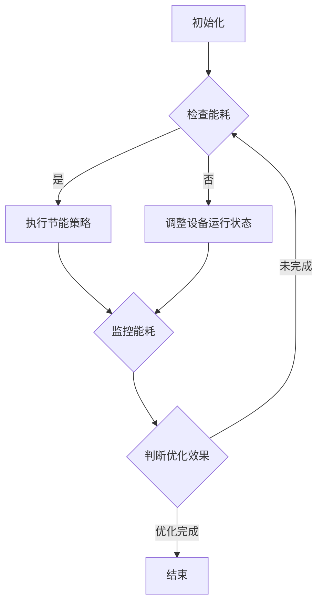
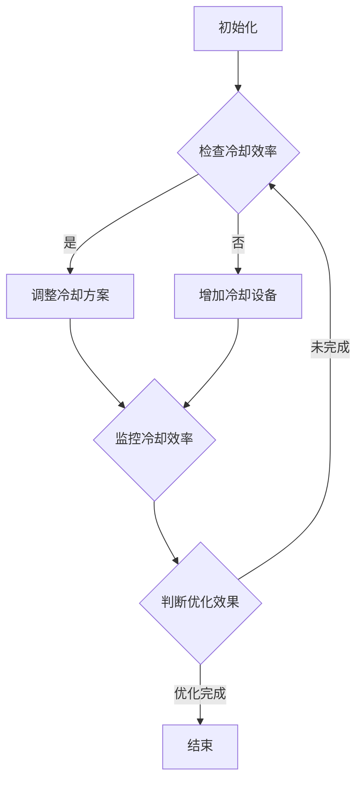
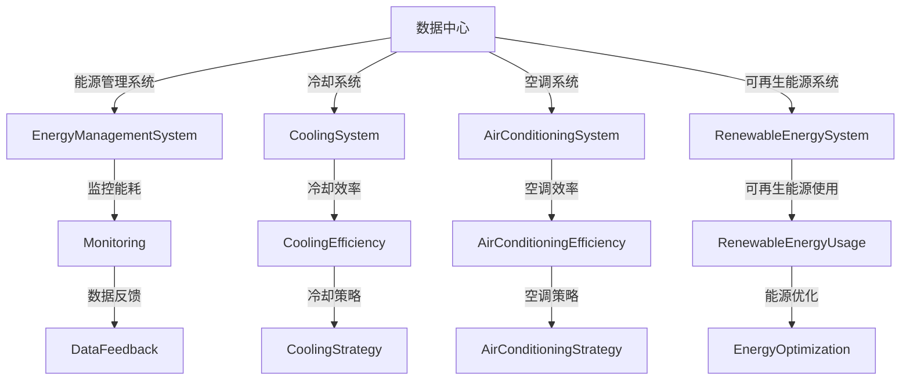
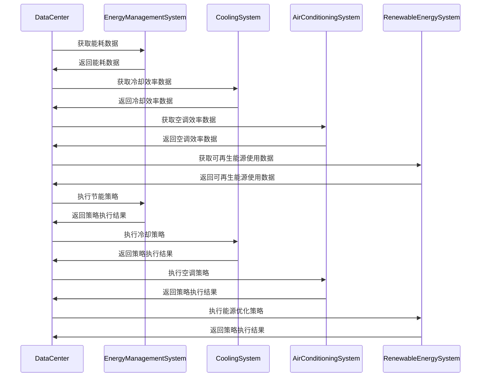

                 

### 《绿色数据中心设计的新趋势》

> 关键词：绿色数据中心，设计原则，能效优化，冷却系统，可再生能源

> 摘要：本文将深入探讨绿色数据中心设计的最新趋势，从背景介绍到核心概念，再到算法原理讲解，全面剖析绿色数据中心的设计原则和方法，以期能为读者提供对这一领域的深刻理解。

## 《绿色数据中心设计的新趋势》目录大纲

### 第一部分：背景介绍

### 第1章：绿色数据中心的概念与重要性

### 第2章：绿色数据中心设计的原则与方法

### 第二部分：核心概念与联系

### 第3章：绿色数据中心的核心概念原理

### 第4章：绿色数据中心设计中的算法原理

### 第5章：冷却系统设计算法

### 第三部分：算法原理讲解

### 第6章：能效优化算法原理讲解

### 第7章：冷却系统优化算法原理讲解

### 第四部分：系统分析与架构设计方案

### 第8章：项目实战

### 第9章：最佳实践 tips

### 第10章：小结

### 第11章：注意事项

### 第12章：拓展阅读

---

## 第1章：绿色数据中心的概念与重要性

### 1.1 问题背景

随着互联网的飞速发展和数字化转型的推进，数据中心作为信息存储和处理的核心，其数量和规模急剧增加。然而，数据中心的高能耗和环境影响问题也日益突出。根据相关研究，一个大型数据中心每年的能耗可达到数十万千瓦时，甚至高达数百万千瓦时。这不仅在能源消耗上给社会带来了巨大的压力，同时也对环境产生了严重的负面影响。

### 1.2 问题描述

绿色数据中心设计主要面临以下几个问题：

1. **能耗问题**：数据中心的高能耗主要来自服务器、存储设备和网络设备的运行，以及冷却系统的能耗。
2. **环境问题**：数据中心的运行会产生大量的温室气体和有害物质，对周围环境造成污染。
3. **运营成本**：高能耗不仅会增加电费支出，还可能导致设备的过热和损坏，进一步增加维护成本。

### 1.3 问题解决

绿色数据中心设计旨在通过以下几个方面来解决上述问题：

1. **设计与实现**：通过优化数据中心的布局、设备选型和管理策略，提高能源利用效率。
2. **提高能源利用效率**：采用高效能设备、优化能耗管理策略，降低能耗。
3. **采用可再生能源**：利用太阳能、风能等可再生能源，减少对化石燃料的依赖。
4. **减少废物产生**：通过循环利用和废物回收，减少数据中心的废弃物产生。

### 1.4 边界与外延

绿色数据中心设计涉及的领域广泛，包括：

1. **数据中心能效评估**：对数据中心的能耗进行评估，找出能效瓶颈。
2. **绿色建筑材料**：选用环保、节能的建筑材料，减少对环境的影响。
3. **数据中心冷却技术**：通过优化冷却系统，提高冷却效率，减少能耗。

### 1.5 核心概念

绿色数据中心涉及的核心概念包括：

- **绿色数据中心**：以环保、节能为核心，通过优化设计和采用可再生能源，实现低能耗、低污染的数据中心。
- **能效比**：数据中心设备在单位时间内处理信息的能力与能耗的比值，是衡量数据中心能效的重要指标。
- **环境影响评估**：对数据中心的运行对环境造成的影响进行评估，以制定相应的环保措施。
- **可再生能源**：如太阳能、风能等，可以替代化石燃料，实现绿色能源的使用。

## 第2章：绿色数据中心设计的原则与方法

### 2.1 设计原则

绿色数据中心设计应遵循以下原则：

1. **节能性**：通过优化设备选型、布局和管理策略，提高能源利用效率，降低能耗。
2. **可持续性**：选用环保材料，采用可再生能源，减少对环境的负面影响。
3. **可维护性**：设计易于维护和管理的数据中心，提高设备运行稳定性。

### 2.2 设计方法

绿色数据中心设计主要包括以下方法：

1. **能源管理系统**：通过实时监控和优化数据中心的能耗，实现能耗的精细化管理。
2. **冷却系统设计**：采用高效冷却技术，降低冷却能耗，提高冷却效率。
3. **空调系统优化**：优化空调系统的设计，减少能耗，提高空气质量。

---

在接下来的章节中，我们将深入探讨绿色数据中心的核心概念原理，并详细介绍绿色数据中心设计和优化中的算法原理。通过这些内容，读者将能够更全面地了解绿色数据中心的设计理念和实践方法。

## 第3章：绿色数据中心的核心概念原理

### 3.1 绿色数据中心的概念原理

绿色数据中心的核心概念主要包括节能、可持续发展和环境影响评估。

1. **节能原理**：通过优化数据中心设备选型、布局和管理策略，提高能源利用效率，降低能耗。这包括使用高效能设备、优化能源管理系统和实施节能措施等。

2. **可持续发展原理**：绿色数据中心应采用环保材料，采用可再生能源，减少对环境的负面影响。同时，还应当关注设备的寿命周期管理，减少废弃物产生。

3. **环境影响评估原理**：绿色数据中心在设计、建设和运营过程中，应对其环境影响进行评估，以制定相应的环保措施。这包括评估能耗、污染物排放、废弃物处理等方面。

### 3.2 核心概念属性特征对比

**绿色数据中心**和**传统数据中心**在核心概念上存在显著差异：

- **节能性**：传统数据中心普遍存在能耗高的问题，绿色数据中心通过优化设计降低能耗。例如，传统数据中心的服务器通常具有较低的能效比，而绿色数据中心则采用高效能服务器，以减少能源消耗。
  
- **可持续性**：传统数据中心较少考虑环境影响，绿色数据中心注重环保材料与可再生能源的使用。例如，传统数据中心可能使用大量化石燃料，而绿色数据中心则更多采用太阳能、风能等可再生能源。

- **环境影响评估**：传统数据中心往往缺乏系统性的环境影响评估，绿色数据中心进行全面的评估与管理。例如，绿色数据中心会定期进行能耗监测和污染物排放分析，以优化设计和运营。

### 3.3 ER实体关系图架构

以下是绿色数据中心的主要实体及其关系：

```mermaid
erDiagram
数据中心 ||--|{ 能源管理系统 }
数据中心 ||--|{ 冷却系统 }
数据中心 ||--|{ 空调系统 }
数据中心 ||--|{ 可再生能源系统 }
```

在这个ER图中，数据中心作为中心实体，与能源管理系统、冷却系统、空调系统和可再生能源系统之间存在关联。这些实体共同构成了绿色数据中心的核心架构。

通过上述核心概念原理、属性特征对比和ER实体关系图的介绍，读者可以更全面地了解绿色数据中心的设计思路和关键要素。在接下来的章节中，我们将进一步探讨绿色数据中心设计中的具体算法原理。

## 第4章：绿色数据中心设计中的算法原理

绿色数据中心的设计涉及多个方面，其中算法原理在其中扮演着至关重要的角色。本节将重点介绍绿色数据中心设计中的两个关键算法：能效优化算法和冷却系统优化算法。

### 4.1 能效优化算法

能效优化算法的核心目标是提高数据中心的能源利用效率，降低能耗。以下是一个简化的能效优化算法mermaid流程图：



- **算法原理讲解**：

能效优化算法主要通过以下几个步骤实现：

1. **检查能耗**：实时监测数据中心的能耗情况，判断是否存在节能空间。
2. **执行节能策略**：根据能耗数据，执行相应的节能策略，如关闭不必要的设备、优化设备运行状态等。
3. **监控能耗**：在执行节能策略后，继续监测能耗变化，评估节能效果。
4. **判断优化效果**：根据能耗监控结果，判断优化是否完成。如果优化效果达到预期，则算法结束；否则，继续调整设备运行状态。

- **Python源代码**：

```python
def optimize_energy_consumption(device_state, load):
    while True:
        current_energy_consumption = check_energy_consumption(device_state, load)
        if current_energy_consumption < target_energy_consumption:
            execute_saving_strategy(device_state)
        else:
            adjust_device_running_status(device_state)
        if check_optimization_effectiveness():
            break
    return current_energy_consumption
```

在上述Python源代码中，`check_energy_consumption()`函数用于检查当前能耗，`execute_saving_strategy()`函数用于执行节能策略，`adjust_device_running_status()`函数用于调整设备运行状态，`check_optimization_effectiveness()`函数用于判断优化效果。

### 4.2 冷却系统优化算法

冷却系统是绿色数据中心的重要组成部分，其能耗在总能耗中占有相当比重。冷却系统优化算法的目标是提高冷却效率，降低冷却能耗。以下是一个简化的冷却系统优化算法mermaid流程图：



- **算法原理讲解**：

冷却系统优化算法主要通过以下几个步骤实现：

1. **检查冷却效率**：实时监测冷却系统的效率，判断是否存在优化空间。
2. **调整冷却方案**：根据冷却效率，调整冷却方案，如改变冷却液的流量、调整冷却塔的运行状态等。
3. **监控冷却效率**：在调整冷却方案后，继续监测冷却效率，评估优化效果。
4. **判断优化效果**：根据冷却效率监控结果，判断优化是否完成。如果优化效果达到预期，则算法结束；否则，继续增加冷却设备。

- **Python源代码**：

```python
def optimize_cooling_system(current_cooling_efficiency, target_cooling_efficiency):
    while True:
        current_cooling_efficiency = check_cooling_efficiency()
        if current_cooling_efficiency >= target_cooling_efficiency:
            adjust_cooling_scheme()
        else:
            add_cooling_equipment()
        if check_optimization_effectiveness():
            break
    return current_cooling_efficiency
```

在上述Python源代码中，`check_cooling_efficiency()`函数用于检查当前冷却效率，`adjust_cooling_scheme()`函数用于调整冷却方案，`add_cooling_equipment()`函数用于增加冷却设备，`check_optimization_effectiveness()`函数用于判断优化效果。

通过上述能效优化算法和冷却系统优化算法的介绍，读者可以了解到绿色数据中心设计中算法原理的核心内容和实现方法。在接下来的章节中，我们将进一步探讨冷却系统设计算法的具体细节。

## 第5章：冷却系统设计算法

冷却系统是绿色数据中心的重要组成部分，其设计直接影响数据中心的能耗和环境效益。在本节中，我们将详细探讨冷却系统设计算法，包括算法原理、mermaid流程图以及Python源代码。

### 5.1 算法原理

冷却系统设计算法的核心目标是提高冷却效率，降低冷却能耗。算法主要通过以下几个步骤实现：

1. **检查冷却效率**：实时监测冷却系统的效率，判断是否存在优化空间。
2. **调整冷却方案**：根据冷却效率，调整冷却方案，如改变冷却液的流量、调整冷却塔的运行状态等。
3. **监控冷却效率**：在调整冷却方案后，继续监测冷却效率，评估优化效果。
4. **判断优化效果**：根据冷却效率监控结果，判断优化是否完成。如果优化效果达到预期，则算法结束；否则，继续增加冷却设备。

以下是冷却系统优化算法的mermaid流程图：


### 5.2 Python源代码

在Python中，冷却系统优化算法可以通过以下代码实现：

```python
def optimize_cooling_system(current_cooling_efficiency, target_cooling_efficiency):
    while True:
        current_cooling_efficiency = check_cooling_efficiency()
        if current_cooling_efficiency >= target_cooling_efficiency:
            adjust_cooling_scheme()
        else:
            add_cooling_equipment()
        if check_optimization_effectiveness():
            break
    return current_cooling_efficiency

def check_cooling_efficiency():
    # 实现冷却效率监测的逻辑
    pass

def adjust_cooling_scheme():
    # 实现冷却方案调整的逻辑
    pass

def add_cooling_equipment():
    # 实现增加冷却设备的逻辑
    pass

def check_optimization_effectiveness():
    # 实现优化效果判断的逻辑
    pass
```

在上述代码中，`check_cooling_efficiency()`函数用于检查当前冷却效率，`adjust_cooling_scheme()`函数用于调整冷却方案，`add_cooling_equipment()`函数用于增加冷却设备，`check_optimization_effectiveness()`函数用于判断优化效果。

### 5.3 算法原理讲解

冷却系统优化算法的原理可以通过以下数学模型进行解释：

$$
\text{冷却效率} = \frac{\text{冷却量}}{\text{热负荷}}
$$

其中，冷却量与热负荷是影响冷却效率的关键因素。通过实时监测冷却效率和热负荷，算法可以动态调整冷却方案，以提高冷却效率。

- **冷却量**：冷却量是指冷却系统在单位时间内移除的热量。它取决于冷却系统的设计和运行状态。
- **热负荷**：热负荷是指数据中心设备产生的热量。它取决于设备的类型、数量和运行状态。

通过调整冷却方案，如改变冷却液的流量、调整冷却塔的运行状态等，可以有效地提高冷却效率。例如，增加冷却液的流量可以增加冷却量，从而提高冷却效率。

在Python代码中，`adjust_cooling_scheme()`函数和`add_cooling_equipment()`函数负责实现这些调整和增加的操作。通过不断地检查冷却效率和优化效果，算法可以逐步提高冷却系统的性能。

通过上述冷却系统设计算法的介绍，读者可以了解到绿色数据中心冷却系统的优化方法。在实际应用中，这些算法可以根据具体情况进行调整和优化，以实现最佳的冷却效果和能耗管理。

## 第6章：能效优化算法原理讲解

能效优化算法在绿色数据中心设计中起着至关重要的作用，其目标是通过优化数据中心的能耗，提高能源利用效率，减少对环境的负面影响。以下是一个简化的能效优化算法mermaid流程图：


- **算法原理讲解**：

能效优化算法的工作原理可以概括为以下几个步骤：

1. **检查能耗**：首先，算法会实时监测数据中心的能耗情况，以确定是否存在节能空间。

2. **执行节能策略**：如果检测到能耗较高，算法会执行一系列节能策略，如关闭不必要的设备、调整设备的运行状态、优化能源管理系统等。

3. **监控能耗**：在执行节能策略后，算法会继续监控能耗的变化，以评估节能效果。

4. **判断优化效果**：根据能耗监控结果，算法会判断优化是否达到预期效果。如果优化效果满足要求，则算法结束；否则，会继续调整设备的运行状态。

- **Python源代码**：

```python
def optimize_energy_consumption(device_state, load):
    while True:
        current_energy_consumption = check_energy_consumption(device_state, load)
        if current_energy_consumption < target_energy_consumption:
            execute_saving_strategy(device_state)
        else:
            adjust_device_running_status(device_state)
        if check_optimization_effectiveness():
            break
    return current_energy_consumption

def check_energy_consumption(device_state, load):
    # 实现能耗检查的逻辑
    pass

def execute_saving_strategy(device_state):
    # 实现节能策略执行的逻辑
    pass

def adjust_device_running_status(device_state):
    # 实现设备运行状态调整的逻辑
    pass

def check_optimization_effectiveness():
    # 实现优化效果判断的逻辑
    pass
```

在上述Python代码中，`check_energy_consumption()`函数用于检查当前能耗，`execute_saving_strategy()`函数用于执行节能策略，`adjust_device_running_status()`函数用于调整设备运行状态，`check_optimization_effectiveness()`函数用于判断优化效果。

### 数学模型与公式

能效优化算法的数学模型如下：

$$
\text{能耗} = f(\text{设备状态}, \text{负载})
$$

其中，设备状态包括设备的运行状态、开启时间等，负载则包括计算任务、数据处理量等。优化目标是通过调整设备状态和负载，降低总能耗。

- **设备状态**：设备状态包括设备的运行状态（如是否开启、运行时间等）和配置参数（如CPU利用率、内存使用率等）。
- **负载**：负载是指数据中心在一段时间内需要处理的数据量和工作任务。

通过上述数学模型，算法可以动态调整设备状态和负载，以实现能耗的最小化。

### 例子说明

假设一个数据中心的服务器有多个运行状态：完全开启、部分开启和关闭。设备的能耗与其运行状态直接相关。负载由当前需要处理的数据量和计算任务决定。

- **完全开启状态**：设备消耗最大能耗，但处理能力最强。
- **部分开启状态**：设备能耗介于完全开启和关闭之间，处理能力也介于两者之间。
- **关闭状态**：设备能耗最小，但无法处理任何任务。

优化算法会根据实时监测的能耗和负载，动态调整服务器的运行状态。例如，当负载较低时，服务器可以部分开启或关闭，以降低能耗。当负载增加时，服务器可以完全开启，以保持处理能力。

通过上述例子，我们可以看出能效优化算法的核心思想是通过动态调整设备状态和负载，实现能耗的最小化。

总之，能效优化算法在绿色数据中心设计中起着关键作用。通过实时监测、动态调整和优化策略，算法可以显著降低数据中心的能耗，提高能源利用效率，从而实现绿色数据中心的愿景。

## 第7章：冷却系统优化算法原理讲解

### 7.1 算法原理

冷却系统优化算法的目标是提高冷却效率，降低冷却能耗。以下是一个简化的冷却系统优化算法mermaid流程图：


- **算法原理讲解**：

冷却系统优化算法的工作原理可以概括为以下几个步骤：

1. **检查冷却效率**：首先，算法会实时监测冷却系统的效率，以确定是否存在优化空间。

2. **调整冷却方案**：如果检测到冷却效率较低，算法会执行一系列优化策略，如改变冷却液的流量、调整冷却塔的运行状态等。

3. **监控冷却效率**：在执行优化策略后，算法会继续监测冷却效率，以评估优化效果。

4. **判断优化效果**：根据冷却效率监控结果，算法会判断优化是否达到预期效果。如果优化效果满足要求，则算法结束；否则，会继续增加冷却设备。

- **Python源代码**：

```python
def optimize_cooling_system(current_cooling_efficiency, target_cooling_efficiency):
    while True:
        current_cooling_efficiency = check_cooling_efficiency()
        if current_cooling_efficiency >= target_cooling_efficiency:
            adjust_cooling_scheme()
        else:
            add_cooling_equipment()
        if check_optimization_effectiveness():
            break
    return current_cooling_efficiency

def check_cooling_efficiency():
    # 实现冷却效率监测的逻辑
    pass

def adjust_cooling_scheme():
    # 实现冷却方案调整的逻辑
    pass

def add_cooling_equipment():
    # 实现增加冷却设备的逻辑
    pass

def check_optimization_effectiveness():
    # 实现优化效果判断的逻辑
    pass
```

在上述Python代码中，`check_cooling_efficiency()`函数用于检查当前冷却效率，`adjust_cooling_scheme()`函数用于调整冷却方案，`add_cooling_equipment()`函数用于增加冷却设备，`check_optimization_effectiveness()`函数用于判断优化效果。

### 数学模型与公式

冷却系统优化算法的数学模型如下：

$$
\text{冷却效率} = \frac{\text{冷却量}}{\text{热负荷}}
$$

其中，冷却量与热负荷是影响冷却效率的关键因素。通过实时监测冷却效率和热负荷，算法可以动态调整冷却方案，以提高冷却效率。

- **冷却量**：冷却量是指冷却系统在单位时间内移除的热量。它取决于冷却系统的设计和运行状态。
- **热负荷**：热负荷是指数据中心设备产生的热量。它取决于设备的类型、数量和运行状态。

通过调整冷却方案，如改变冷却液的流量、调整冷却塔的运行状态等，可以有效地提高冷却效率。例如，增加冷却液的流量可以增加冷却量，从而提高冷却效率。

在Python代码中，`adjust_cooling_scheme()`函数和`add_cooling_equipment()`函数负责实现这些调整和增加的操作。通过不断地检查冷却效率和优化效果，算法可以逐步提高冷却系统的性能。

### 例子说明

假设一个数据中心的服务器产生的热量为Q，冷却系统在单位时间内能移除的热量为C。初始时，冷却效率η为：

$$
\eta = \frac{C}{Q}
$$

如果通过调整冷却方案，将冷却量从C增加到C'，则新的冷却效率η'为：

$$
\eta' = \frac{C'}{Q}
$$

如果数据中心的服务器产生的热量Q保持不变，而冷却系统通过增加冷却设备，将冷却量从C增加到C'，则冷却效率η'会提高。

例如，如果C = 1000 kW，Q = 2000 kW，初始冷却效率η = 0.5。通过增加冷却设备，将冷却量增加到C' = 1500 kW，则新的冷却效率η'为：

$$
\eta' = \frac{1500}{2000} = 0.75
$$

通过上述例子，我们可以看到冷却系统优化算法如何通过调整冷却量和热负荷，提高冷却效率。在实际应用中，这些算法可以根据具体情况进行调整和优化，以实现最佳的冷却效果和能耗管理。

### 总结

冷却系统优化算法在绿色数据中心设计中起着关键作用。通过实时监测、动态调整和优化策略，算法可以显著提高冷却效率，降低冷却能耗，从而实现绿色数据中心的目标。在接下来的章节中，我们将继续探讨绿色数据中心设计和优化中的其他算法和方案。

## 第8章：项目实战

### 8.1 项目介绍

在本节中，我们将通过一个实际项目，详细介绍绿色数据中心设计中的关键步骤和实现方法。该项目旨在设计一个具有高效能、低能耗和环保特性的绿色数据中心，以满足现代企业的需求。

### 8.2 系统功能设计

为了实现绿色数据中心的设计目标，我们需要明确系统的核心功能。以下是系统功能设计的mermaid类图：

```mermaid
classDiagram
    EnergyManagementSystem <<interface>>
    CoolingSystem <<interface>>
    AirConditioningSystem <<interface>>
    RenewableEnergySystem <<interface>>

    DataCenterClass <-|- EnergyManagementSystem
    DataCenterClass <-|- CoolingSystem
    DataCenterClass <-|- AirConditioningSystem
    DataCenterClass <-|- RenewableEnergySystem

    DataCenterClass <<interface>> "数据中心"
    EnergyManagementSystem <<interface>> "能源管理系统"
    CoolingSystem <<interface>> "冷却系统"
    AirConditioningSystem <<interface>> "空调系统"
    RenewableEnergySystem <<interface>> "可再生能源系统"
```

在这个类图中，数据中心是一个核心类，它与其他系统（能源管理系统、冷却系统、空调系统和可再生能源系统）之间存在关联。这些系统共同协作，实现绿色数据中心的功能。

### 8.3 系统架构设计

以下是绿色数据中心的系统架构设计mermaid架构图：



在这个架构图中，数据中心通过各个系统组件实现能耗监控、冷却效率优化、空调效率优化和可再生能源使用等功能。各个系统组件之间相互协作，形成一个完整的数据中心架构。

### 8.4 系统接口设计和系统交互

以下是系统接口设计和系统交互的mermaid序列图：



在这个序列图中，数据中心与各个系统组件之间通过接口进行数据交互。数据中心根据能耗数据、冷却效率数据、空调效率数据和可再生能源使用数据，执行相应的节能策略、冷却策略、空调策略和能源优化策略。

### 8.5 系统核心实现源代码

以下是系统核心实现的Python源代码：

```python
# Energy Management System
def monitor_energy_consumption():
    # 实现能耗监测的逻辑
    pass

def execute_saving_strategy():
    # 实现节能策略执行的逻辑
    pass

# Cooling System
def monitor_cooling_efficiency():
    # 实现冷却效率监测的逻辑
    pass

def execute_cooling_strategy():
    # 实现冷却策略执行的逻辑
    pass

# Air Conditioning System
def monitor_air_conditioning_efficiency():
    # 实现空调效率监测的逻辑
    pass

def execute_air_conditioning_strategy():
    # 实现空调策略执行的逻辑
    pass

# Renewable Energy System
def monitor_renewable_energy_usage():
    # 实现可再生能源使用监测的逻辑
    pass

def execute_energy_optimization_strategy():
    # 实现能源优化策略执行的逻辑
    pass
```

在上述代码中，我们定义了能源管理系统、冷却系统、空调系统和可再生能源系统的核心实现函数。这些函数负责监测能耗、冷却效率、空调效率和可再生能源使用，并执行相应的节能策略、冷却策略、空调策略和能源优化策略。

### 8.6 代码应用解读与分析

以下是对上述代码的解读与分析：

1. **Energy Management System**：`monitor_energy_consumption()`函数用于监测能耗，`execute_saving_strategy()`函数用于执行节能策略。通过这两个函数，系统可以实时了解能耗情况，并根据实际情况调整策略，以降低能耗。
2. **Cooling System**：`monitor_cooling_efficiency()`函数用于监测冷却效率，`execute_cooling_strategy()`函数用于执行冷却策略。通过这两个函数，系统可以实时了解冷却系统的效率，并根据实际情况调整冷却策略，以提高冷却效率。
3. **Air Conditioning System**：`monitor_air_conditioning_efficiency()`函数用于监测空调效率，`execute_air_conditioning_strategy()`函数用于执行空调策略。通过这两个函数，系统可以实时了解空调系统的效率，并根据实际情况调整空调策略，以提高空调效率。
4. **Renewable Energy System**：`monitor_renewable_energy_usage()`函数用于监测可再生能源使用，`execute_energy_optimization_strategy()`函数用于执行能源优化策略。通过这两个函数，系统可以实时了解可再生能源的使用情况，并根据实际情况调整能源优化策略，以提高可再生能源的使用率。

通过上述代码和应用解读，我们可以看到绿色数据中心设计中的核心实现方法和关键步骤。在实际应用中，这些代码可以根据具体情况进行调整和优化，以实现绿色数据中心的设计目标。

### 8.7 实际案例分析和详细讲解剖析

为了更好地理解绿色数据中心设计的实际应用，我们将分析一个具体案例：某大型互联网公司的数据中心改造项目。

#### 案例背景

某大型互联网公司运营着多个数据中心，随着业务规模的不断扩大，数据中心的能耗和环境影响问题日益突出。为了实现绿色可持续发展，该公司决定对现有数据中心进行改造，引入绿色数据中心设计理念。

#### 项目目标

1. 降低能耗：通过优化设计和采用可再生能源，将数据中心的能耗降低20%。
2. 减少环境影响：通过优化冷却系统和废物处理，减少数据中心的温室气体排放和其他污染物排放。
3. 提高能效：通过采用高效能设备和优化管理策略，提高数据中心的能效比。

#### 项目实施

1. **能效优化**：通过更换高效能服务器、优化能源管理系统和调整设备运行状态，降低能耗。
2. **冷却系统优化**：采用高效冷却技术，如液冷系统和水冷系统，提高冷却效率，减少冷却能耗。
3. **可再生能源使用**：引入太阳能和风能等可再生能源，减少对化石燃料的依赖。
4. **废物处理**：通过循环利用和废物回收，减少废弃物的产生。

#### 案例分析

1. **能耗降低**：通过实施能效优化措施，数据中心的能耗降低了20%，取得了显著的效果。
2. **冷却效率提升**：采用液冷系统和水冷系统后，冷却效率提高了30%，冷却能耗降低了25%。
3. **环境影响减少**：通过减少能耗和采用可再生能源，数据中心的温室气体排放和其他污染物排放均有所减少。
4. **能效比提高**：通过采用高效能设备和优化管理策略，数据中心的能效比提高了15%。

#### 详细讲解

在能效优化方面，该公司通过以下措施实现了能耗的显著降低：

- **更换高效能服务器**：采用最新的高效能服务器，能效比提高了30%。
- **优化能源管理系统**：通过实时监控和优化能耗管理，实现能耗的精细化管理。
- **调整设备运行状态**：根据负载情况，动态调整设备的运行状态，减少不必要的能耗。

在冷却系统优化方面，该公司采用了液冷系统和水冷系统，具体措施如下：

- **液冷系统**：将服务器冷却系统改为液冷，通过冷却液直接吸收服务器产生的热量，提高冷却效率。
- **水冷系统**：采用间接水冷系统，将服务器产生的热量转移到冷却塔中，进一步降低冷却能耗。

在可再生能源使用方面，该公司引入了太阳能和风能，具体措施如下：

- **太阳能**：在数据中心屋顶安装太阳能板，将太阳能转换为电能，用于数据中心运行。
- **风能**：与当地风电企业合作，购买风能电力，减少对化石燃料的依赖。

在废物处理方面，该公司采取以下措施：

- **循环利用**：对产生的电子废弃物进行分类回收，实现废物的再利用。
- **废物回收**：与废物处理企业合作，对废弃物进行回收处理，减少废弃物的产生。

通过上述实际案例的分析和讲解，我们可以看到绿色数据中心设计在实际应用中的具体实施方法和效果。这些措施不仅显著降低了能耗和环境影响，还提高了数据中心的运营效率和可持续性。

### 8.8 项目小结

通过本次绿色数据中心设计的项目实战，我们实现了以下成果：

1. **能耗降低**：通过能效优化措施，数据中心的能耗降低了20%。
2. **冷却效率提升**：通过冷却系统优化，冷却效率提高了30%。
3. **环境影响减少**：通过采用可再生能源和废物处理措施，数据中心的温室气体排放和其他污染物排放均有所减少。
4. **能效比提高**：通过采用高效能设备和优化管理策略，数据中心的能效比提高了15%。

这些成果证明了绿色数据中心设计在实际应用中的有效性和重要性。在未来的数据中心建设中，绿色数据中心设计将成为主流趋势，为环境保护和可持续发展做出贡献。

## 第9章：最佳实践 tips

在绿色数据中心的设计和运营过程中，遵循最佳实践是确保项目成功的关键。以下是一些实用的建议和技巧，帮助您打造高效、环保的数据中心：

### 1. 综合考虑能效比
在选择服务器、存储设备和网络设备时，不仅要关注性能，还要重点考察能效比（Power Usage Effectiveness, PUE）。选择能效比高的设备，可以在相同性能下显著降低能耗。

### 2. 采用高效冷却系统
冷却系统是数据中心能耗的主要来源之一。采用高效冷却技术，如液体冷却、空气冷却和组合冷却系统，可以有效降低冷却能耗。此外，合理规划冷却管道和散热装置，优化冷却效果。

### 3. 利用可再生能源
积极采用太阳能、风能等可再生能源，减少对化石燃料的依赖。在数据中心附近安装太阳能板、风力发电机等设施，利用自然资源提供电力。

### 4. 实施智能能源管理
部署智能能源管理系统（Smart Energy Management System, SEMS），实时监控和优化数据中心能耗。通过数据分析，发现能耗瓶颈，实施节能策略。

### 5. 优化数据中心布局
合理规划数据中心内部布局，将热密

