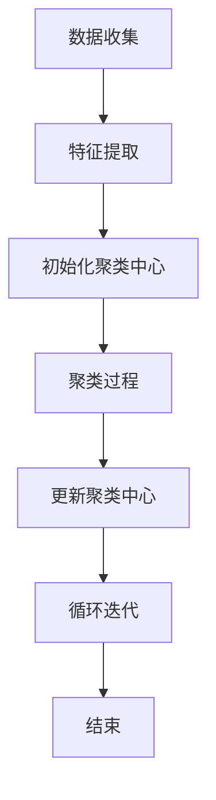
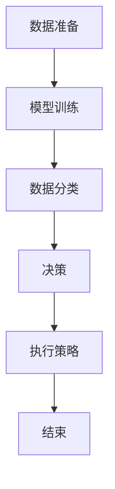
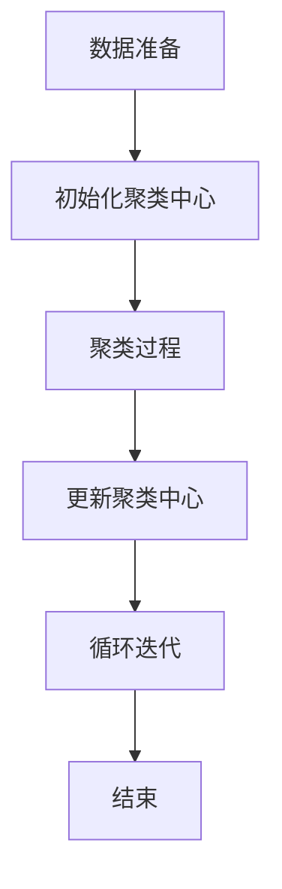
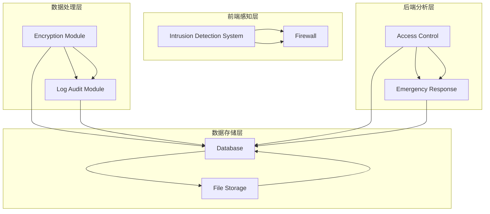
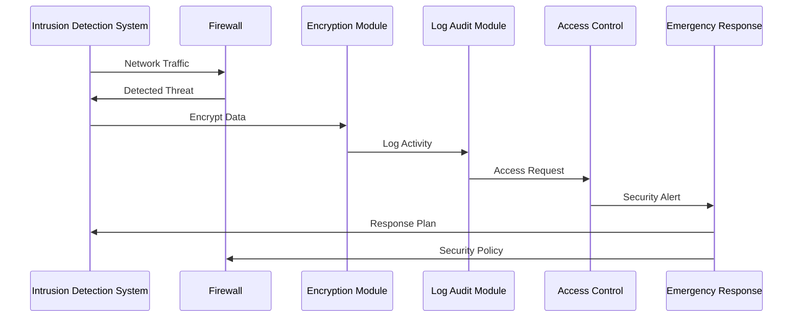
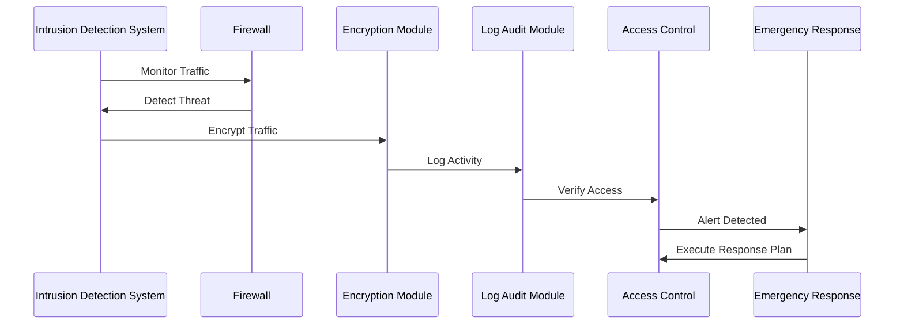

                 

### 第1章：网络安全AI的兴起与重要性

#### 1.1 问题背景

随着全球数字化转型的加速，企业对数字资产的依赖程度日益增加。数字资产不仅是企业运营的核心，也是其竞争力的象征。然而，数字资产的安全性却面临着前所未有的挑战。网络攻击的形式和手段日益复杂，从传统的木马、病毒到高级持续性威胁（APT），攻击者不断探索新的入侵途径，企业网络安全形势日益严峻。

- **数字化转型的普及**：越来越多的企业将业务转移到云端，利用大数据、物联网等新技术提升运营效率，这为网络攻击提供了更多的攻击面。
- **网络攻击日益增多**：网络攻击手段日益翻新，攻击频率和规模不断加大，企业面临的威胁日益复杂。
- **数据泄露事件频繁发生**：大量的数据泄露事件不仅损害了企业的声誉，还可能带来严重的经济损失。

#### 1.2 问题描述

企业在网络安全方面面临的主要问题包括：

- **入侵风险**：网络攻击可能导致敏感数据被窃取、篡改或破坏，影响企业的正常运营。
- **数据泄露**：未经授权的访问和数据泄露可能引发隐私侵犯和法律责任。
- **业务中断**：网络攻击可能导致系统瘫痪、业务中断，给企业带来直接的经济损失。

#### 1.3 问题解决

为了有效应对网络安全威胁，企业需要采取一系列措施，其中引入AI技术是一个重要的方向。通过AI技术，企业可以实现以下目标：

- **智能防御**：利用机器学习、深度学习等技术，AI可以自动检测和响应网络威胁，提高防御效率。
- **实时监控**：AI系统能够实时监控网络流量，快速发现异常行为，及时采取措施。
- **自动化响应**：AI技术可以自动化执行安全策略，减少人为错误，提高响应速度。

#### 1.4 边界与外延

- **网络安全AI的应用领域**：网络安全AI可以应用于企业内部网络、云服务、物联网等多种场景。
- **企业数字资产的保护范围**：包括但不限于敏感数据、业务系统、网络设备等。

#### 1.5 概念结构与核心要素组成

- **网络安全AI的定义**：网络安全AI是指利用人工智能技术，对网络安全威胁进行识别、预测和防御的系统。
- **核心技术**：包括机器学习、深度学习、自然语言处理、计算机视觉等。
- **应用场景**：如入侵检测、恶意软件防护、网络流量分析、安全态势感知等。

通过以上分析，我们可以看出，网络安全AI不仅是应对网络安全威胁的一种手段，更是企业数字化转型的必要保障。在接下来的章节中，我们将进一步探讨网络安全AI的基本概念、核心技术、算法原理以及系统架构设计等内容。

### 第2章：网络安全的基本概念与AI的关系

#### 2.1 网络安全的基本概念

网络安全是指保护计算机网络系统及其数据不受未经授权的访问、篡改、破坏、泄露等威胁的一种技术措施。网络安全的基本概念包括以下几个方面：

- **定义**：网络安全是指通过采用一系列技术和管理措施，确保计算机网络系统的硬件、软件、数据不受损害，保障网络系统的正常运行。
- **历史与发展**：网络安全的概念起源于20世纪60年代，随着计算机技术和互联网的发展，网络安全逐渐成为一个独立的学科领域。
- **重要组成部分**：网络安全主要由防火墙、入侵检测系统（IDS）、安全协议、安全加密技术等组成部分构成。

#### 2.2 AI与网络安全的关系

人工智能（AI）在网络安全领域有着广泛的应用，其关系可以从以下几个方面进行阐述：

- **AI在网络安全中的作用**：AI技术可以用于识别网络威胁、预测潜在攻击、自动化响应等，提高网络安全的防护能力。
- **网络安全对AI的依赖**：网络安全领域的数据量大、种类多，需要AI技术进行处理和分析，从而实现更有效的威胁检测和防御。

#### 2.3 网络安全AI的核心技术

网络安全AI的核心技术主要包括以下几个方面：

- **智能入侵检测系统**：利用机器学习、深度学习等技术，对网络流量进行实时监控和分析，识别潜在的入侵行为。
- **智能防火墙**：结合AI技术，防火墙可以动态调整策略，应对复杂的网络攻击。
- **网络行为分析**：通过对网络流量的分析，AI系统可以识别异常行为，从而预测潜在的安全威胁。

### 核心概念与联系：网络安全与AI的核心技术

#### 网络安全的基本概念

网络安全的基本概念包括以下几个方面：

- **防火墙**：防火墙是一种网络安全系统，用于监控和控制进出网络的数据包，防止未经授权的访问。
- **入侵检测系统（IDS）**：IDS是一种用于检测和响应网络入侵的系统，可以通过异常检测、误用检测等方式实现。
- **安全协议**：安全协议是确保网络通信安全的规则和标准，如SSL/TLS协议用于加密网络数据传输。
- **安全加密技术**：加密技术用于保护数据在传输和存储过程中的安全性，防止数据被非法窃取或篡改。

#### AI与网络安全的关系

AI与网络安全的关系可以从以下几个方面进行理解：

- **AI在网络安全中的应用**：AI技术可以用于检测和预测网络威胁，如利用机器学习算法分析网络流量、识别恶意行为等。
- **网络安全对AI的挑战**：网络安全领域的复杂性要求AI技术具备高度的自适应性和实时性，这对AI算法提出了更高的要求。

#### 网络安全AI的核心技术

网络安全AI的核心技术包括以下几个方面：

- **智能入侵检测系统（IDS）**：利用机器学习、深度学习等技术，IDS可以对网络流量进行实时监控和分析，识别潜在的入侵行为。
- **智能防火墙**：结合AI技术，防火墙可以动态调整策略，应对复杂的网络攻击。
- **网络行为分析**：通过对网络流量的分析，AI系统可以识别异常行为，从而预测潜在的安全威胁。

#### 概念属性特征对比表格

为了更好地理解网络安全与AI的关系，我们提供了一个概念属性特征对比表格：

| 概念     | 特征                                       |
|----------|------------------------------------------|
| 网络安全 | 防止未经授权的访问、篡改、破坏、泄露等威胁 |
| AI       | 人工智能，通过模拟人类思维进行问题求解     |
| IDS      | 入侵检测系统，用于检测和响应网络入侵       |
| 防火墙   | 控制网络流量，防止未经授权的访问           |
| 加密技术 | 保护数据在传输和存储过程中的安全性         |

#### ER实体关系图架构

为了进一步展示网络安全与AI的关系，我们可以使用Mermaid工具绘制一个ER实体关系图：

```mermaid
erDiagram
  ID | --o> User : "用户"
  ID | --o> Network : "网络"
  ID | --o> Device : "设备"
  ID | --o> Threat : "威胁"
  ID | --o> Detection : "检测"
  ID | --o> Response : "响应"

  User ||--|{ Network }
  User ||--|{ Device }
  User ||--|{ Threat }
  User ||--|{ Detection }
  User ||--|{ Response }

  Network ||--|{ Device }
  Network ||--|{ Threat }
  Network ||--|{ Detection }
  Network ||--|{ Response }

  Device ||--|{ Threat }
  Device ||--|{ Detection }
  Device ||--|{ Response }

  Threat ||--|{ Detection }
  Threat ||--|{ Response }

  Detection ||--|{ Response }
```

这个ER实体关系图展示了用户、网络、设备、威胁、检测和响应之间的关系，帮助读者更好地理解网络安全与AI的相互作用。

通过上述分析，我们可以看到，网络安全与AI之间存在紧密的联系，AI技术的引入为网络安全带来了新的可能性。在接下来的章节中，我们将进一步探讨网络安全AI的关键技术，包括智能入侵检测系统、智能防火墙和智能网络行为分析等。

### 第3章：网络安全AI的关键技术

#### 3.1 智能入侵检测系统

智能入侵检测系统（Intelligent Intrusion Detection System，IDS）是网络安全AI的重要组成部分，它通过实时监控和分析网络流量，识别和响应潜在的入侵行为。IDS利用机器学习、深度学习等技术，具备高度的自适应性和预测能力，可以有效提升企业的网络安全防护水平。

**工作原理**：

- **数据收集**：IDS从网络流量中收集数据，包括数据包的来源、目的地、传输内容等。
- **特征提取**：通过对收集到的数据进行预处理和特征提取，将原始数据转换为特征向量。
- **模型训练**：利用已标记的数据集，IDS使用机器学习算法进行训练，学习正常的网络行为模式。
- **实时监控**：在训练完成后，IDS可以实时监控网络流量，检测异常行为。

**技术特点**：

- **自适应学习**：IDS可以通过不断学习和适应新的网络行为模式，提高检测的准确性和效率。
- **自动化响应**：IDS可以自动化执行安全策略，如隔离恶意流量、发送警报等。
- **多维度分析**：IDS可以从多个维度（如流量、用户行为、应用程序等）进行综合分析，提高检测的全面性。

**应用实例**：

- **企业网络**：在大型企业网络中，IDS可以监控企业内部网络流量，识别和阻止内部威胁。
- **云服务**：在云服务环境中，IDS可以实时监控云平台上的流量，保护用户数据和资源。

#### 3.2 智能防火墙

智能防火墙（Intelligent Firewall）结合了传统的防火墙技术和AI算法，可以实现动态策略调整和自适应防护。智能防火墙通过分析网络流量和行为模式，自动识别和阻止潜在的安全威胁。

**工作原理**：

- **数据包过滤**：智能防火墙首先对进入和离开网络的数据包进行过滤，根据预设的安全策略进行判断。
- **行为分析**：通过机器学习算法，智能防火墙可以分析网络流量和行为模式，识别异常行为。
- **策略调整**：智能防火墙可以动态调整安全策略，根据当前的网络威胁环境进行优化。

**技术特点**：

- **动态调整**：智能防火墙可以根据实时威胁环境动态调整策略，提高防护的灵活性。
- **自动化决策**：智能防火墙能够自动化执行安全策略，减少人为错误和响应时间。
- **高可靠性**：智能防火墙具备强大的处理能力和高效的算法，能够保证网络流量的稳定和安全。

**应用实例**：

- **企业内部网络**：智能防火墙可以用于保护企业内部网络，防止外部攻击和内部威胁。
- **数据中心**：在数据中心环境中，智能防火墙可以保护数据中心的关键数据和设备。

#### 3.3 智能网络行为分析

智能网络行为分析（Intelligent Network Behavior Analysis，NBA）是利用AI技术对网络流量和行为模式进行分析，识别潜在的安全威胁。NBA通过实时监控和数据分析，能够提供全面的安全洞察。

**工作原理**：

- **数据收集**：NBA从网络流量中收集数据，包括流量模式、用户行为等。
- **特征提取**：通过对收集到的数据进行预处理和特征提取，将原始数据转换为特征向量。
- **模型训练**：利用已标记的数据集，NBA使用机器学习算法进行训练，学习正常的网络行为模式。
- **实时监控**：在训练完成后，NBA可以实时监控网络流量，识别异常行为。

**技术特点**：

- **实时性**：NBA能够实时监控和分析网络流量，快速识别潜在威胁。
- **全面性**：NBA可以从多个维度（如流量、用户行为、应用程序等）进行综合分析，提高检测的全面性。
- **自动化**：NBA可以自动化执行安全策略，减少人为干预。

**应用实例**：

- **物联网**：在物联网环境中，NBA可以监控设备之间的通信行为，识别恶意设备和行为。
- **企业网络**：在企业网络中，NBA可以监控员工的行为模式，识别内部威胁。

通过以上对智能入侵检测系统、智能防火墙和智能网络行为分析等关键技术的介绍，我们可以看到，网络安全AI技术在提升企业网络安全防护能力方面具有重要作用。在接下来的章节中，我们将进一步探讨这些技术的算法原理和数学模型。

### 第4章：常见网络安全算法原理详解

#### 4.1 入侵检测算法

入侵检测系统（IDS）是网络安全的重要组成部分，其核心在于利用算法识别和响应潜在的入侵行为。入侵检测算法主要分为异常检测和误用检测两种类型。

**描述**：

- **异常检测**：异常检测算法通过分析网络流量和行为模式，识别与正常行为显著不同的异常行为。常见的算法包括统计模型（如统计阈值法）、基于规则的算法（如关联规则学习）和聚类算法（如K-means、DBSCAN）。
- **误用检测**：误用检测算法通过识别已知的攻击模式或行为特征，来检测潜在的入侵行为。常见的算法包括基于特征匹配的算法（如模式匹配法）、基于模型的算法（如神经网络、支持向量机）。

**工作原理**：

- **数据收集**：IDS从网络流量中收集数据，包括流量模式、用户行为等。
- **特征提取**：通过对收集到的数据进行预处理和特征提取，将原始数据转换为特征向量。
- **模型训练**：利用已标记的数据集，算法进行训练，学习正常的网络行为模式。
- **实时监控**：在训练完成后，算法可以实时监控网络流量，识别异常行为。

**案例分析**：

以K-means聚类算法为例，其应用于异常检测的过程如下：

1. **数据准备**：收集网络流量数据，并进行预处理，提取特征向量。
2. **初始化聚类中心**：随机选择若干个数据点作为初始聚类中心。
3. **聚类过程**：对于每个数据点，计算其与各个聚类中心的距离，将其分配到最近的聚类中心。
4. **更新聚类中心**：计算每个聚类中心的新位置，作为下一次迭代的中心。
5. **循环迭代**：重复执行聚类过程，直到聚类中心不再发生变化或达到设定的迭代次数。

通过K-means算法，可以将网络流量划分为不同的簇，每个簇代表一种特定的行为模式。当检测到新的流量数据时，通过计算其与各个簇的距离，可以识别其所属的行为模式，从而判断是否为异常行为。

**算法流程图**：



通过以上对入侵检测算法的详细介绍，我们可以看到，这些算法在网络安全中发挥着重要作用。在接下来的章节中，我们将继续探讨防火墙算法和网络行为分析算法的原理和应用。

#### 4.2 防火墙算法

防火墙算法是网络安全系统中的核心组成部分，主要负责监控和过滤网络流量，以防止未经授权的访问和数据泄露。防火墙算法可以基于规则、行为分析、机器学习等多种技术实现，下面将详细介绍几种常见的防火墙算法。

**描述**：

- **基于规则**：基于规则算法通过预定义的一系列规则，对网络流量进行匹配和过滤。当流量匹配到某条规则时，防火墙根据规则的配置进行相应的处理，如允许、拒绝或重定向。
- **行为分析**：行为分析算法通过对网络流量的动态分析，识别和阻止异常行为。常见的算法包括统计异常检测、基于状态的检测等。
- **机器学习**：机器学习算法通过训练模型，学习正常的网络行为模式，从而识别和预测潜在的威胁。常见的算法包括支持向量机（SVM）、神经网络（NN）等。

**工作原理**：

- **基于规则防火墙**：基于规则防火墙首先定义一系列规则，这些规则包括源IP地址、目标IP地址、端口号等。在数据包过滤过程中，防火墙会检查每个数据包，并根据规则进行相应的处理。
- **行为分析防火墙**：行为分析防火墙通过实时监控网络流量，分析流量模式和行为特征。当发现异常行为时，防火墙会触发相应的安全策略，如隔离恶意流量、发送警报等。
- **机器学习防火墙**：机器学习防火墙利用训练好的模型，对网络流量进行分类和预测。通过不断更新和优化模型，防火墙可以更准确地识别和防御网络威胁。

**案例分析**：

以支持向量机（SVM）为例，其应用于防火墙的过程如下：

1. **数据准备**：收集网络流量数据，并进行预处理，提取特征向量。
2. **模型训练**：利用标记数据集，训练SVM模型，学习正常的网络行为模式。
3. **数据分类**：对于新的流量数据，通过SVM模型进行分类，判断其是否为正常流量或潜在威胁。
4. **决策**：根据分类结果，防火墙执行相应的安全策略，如允许、拒绝或重定向。

**算法流程图**：



通过以上案例分析，我们可以看到，防火墙算法在网络安全中发挥着关键作用。在接下来的章节中，我们将进一步探讨网络行为分析算法的原理和应用。

#### 4.3 网络行为分析算法

网络行为分析（Network Behavior Analysis，NBA）算法是网络安全领域的重要技术，通过分析网络流量和行为模式，能够识别潜在的安全威胁和异常行为。NBA算法主要包括流量分析和行为分析两种类型。

**描述**：

- **流量分析**：流量分析算法通过对网络流量的监控和分析，识别出异常流量模式。常见的算法包括统计方法（如流量直方图、频谱分析）和机器学习方法（如聚类分析、异常检测）。
- **行为分析**：行为分析算法通过对用户行为和设备行为的分析，识别出异常行为模式。常见的算法包括基于规则的算法（如关联规则学习）和机器学习方法（如神经网络、决策树）。

**工作原理**：

- **数据收集**：NBA从网络流量中收集数据，包括数据包的来源、目的地、传输内容等。
- **特征提取**：通过对收集到的数据进行预处理和特征提取，将原始数据转换为特征向量。
- **模型训练**：利用已标记的数据集，算法进行训练，学习正常的网络行为模式。
- **实时监控**：在训练完成后，算法可以实时监控网络流量，识别异常行为。

**案例分析**：

以K-means聚类算法为例，其应用于流量分析的过程如下：

1. **数据准备**：收集网络流量数据，并进行预处理，提取特征向量。
2. **初始化聚类中心**：随机选择若干个数据点作为初始聚类中心。
3. **聚类过程**：对于每个数据点，计算其与各个聚类中心的距离，将其分配到最近的聚类中心。
4. **更新聚类中心**：计算每个聚类中心的新位置，作为下一次迭代的中心。
5. **循环迭代**：重复执行聚类过程，直到聚类中心不再发生变化或达到设定的迭代次数。

通过K-means算法，可以将网络流量划分为不同的簇，每个簇代表一种特定的流量模式。当检测到新的流量数据时，通过计算其与各个簇的距离，可以识别其所属的流量模式，从而判断是否为异常流量。

**算法流程图**：



通过以上案例分析，我们可以看到，网络行为分析算法在网络安全中具有重要作用。在接下来的章节中，我们将进一步探讨这些算法在实战中的应用和效果。

### 第5章：算法原理示例分析

为了更好地理解和应用网络安全算法，我们将通过具体的示例来分析入侵检测算法、防火墙算法和网络行为分析算法的原理。

#### 5.1 入侵检测算法示例分析

**示例描述**：

假设我们使用K-means聚类算法来进行异常检测。现有一段时间内的网络流量数据，数据包括数据包的来源IP地址、目标IP地址、端口号和传输量等。我们需要利用K-means算法将这些数据聚类，识别出异常流量。

**算法实现**：

首先，我们需要对数据进行预处理，提取特征向量。然后，使用K-means算法进行聚类，步骤如下：

1. **数据预处理**：对网络流量数据进行归一化处理，将数据标准化到相同的尺度。
2. **初始化聚类中心**：随机选择10个数据点作为初始聚类中心。
3. **聚类过程**：对于每个数据点，计算其与各个聚类中心的距离，将其分配到最近的聚类中心。
4. **更新聚类中心**：计算每个聚类中心的新位置，作为下一次迭代的中心。
5. **循环迭代**：重复执行聚类过程，直到聚类中心不再发生变化或达到设定的迭代次数。

**结果分析**：

通过K-means算法，我们可以将网络流量数据划分为5个不同的簇。每个簇代表一种特定的流量模式。在训练完成后，当新的网络流量数据到来时，通过计算其与各个簇的距离，可以判断其所属的流量模式。如果距离某个簇的中心较远，则可以判定为异常流量。

**Python代码实现**：

```python
from sklearn.cluster import KMeans
import numpy as np

# 假设特征向量数据存储在data列表中
data = np.array([[1, 2], [1, 4], [1, 0],
                 [10, 2], [10, 4], [10, 0],
                 [100, 2], [100, 4], [100, 0]])

# 初始化KMeans模型
kmeans = KMeans(n_clusters=3, random_state=0).fit(data)

# 输出聚类结果
print("聚类中心：", kmeans.cluster_centers_)
print("聚类结果：", kmeans.labels_)

# 对新数据进行分类
new_data = np.array([[3, 3], [7, 7]])
print("新数据分类结果：", kmeans.predict(new_data))
```

通过以上Python代码实现，我们可以看到K-means算法在入侵检测中的具体应用。

#### 5.2 防火墙算法示例分析

**示例描述**：

假设我们使用支持向量机（SVM）算法来实现防火墙的入侵检测功能。现有一段时间内的网络流量数据，数据包括数据包的来源IP地址、目标IP地址、端口号和传输量等。我们需要利用SVM算法对这些数据进行分类，识别出潜在的入侵行为。

**算法实现**：

1. **数据预处理**：对网络流量数据进行归一化处理，将数据标准化到相同的尺度。
2. **模型训练**：利用已标记的数据集，训练SVM模型，学习正常的网络行为模式。
3. **数据分类**：对于新的流量数据，通过SVM模型进行分类，判断其是否为正常流量或潜在威胁。

**结果分析**：

通过SVM模型训练，我们可以将网络流量数据划分为正常流量和异常流量两类。在训练完成后，当新的网络流量数据到来时，通过SVM模型进行分类，可以判断其所属的类别。如果判定为异常流量，则防火墙会触发相应的安全策略。

**Python代码实现**：

```python
from sklearn import svm
from sklearn.model_selection import train_test_split
import numpy as np

# 假设特征向量数据存储在data列表中，标签存储在labels列表中
data = np.array([[1, 2], [1, 4], [1, 0],
                 [10, 2], [10, 4], [10, 0],
                 [100, 2], [100, 4], [100, 0]])
labels = np.array([0, 0, 0, 1, 1, 1, 2, 2, 2])

# 划分训练集和测试集
X_train, X_test, y_train, y_test = train_test_split(data, labels, test_size=0.2, random_state=0)

# 初始化SVM模型
clf = svm.SVC()

# 训练模型
clf.fit(X_train, y_train)

# 测试模型
print("测试集准确率：", clf.score(X_test, y_test))

# 对新数据进行分类
new_data = np.array([[3, 3]])
print("新数据分类结果：", clf.predict(new_data))
```

通过以上Python代码实现，我们可以看到SVM算法在防火墙中的应用。

#### 5.3 网络行为分析算法示例分析

**示例描述**：

假设我们使用K-means聚类算法来进行网络行为分析，识别网络中的异常行为。现有一段时间内的网络流量数据，数据包括用户ID、登录时间、登录IP地址和登录频率等。我们需要利用K-means算法将这些数据聚类，识别出异常用户行为。

**算法实现**：

1. **数据预处理**：对网络流量数据进行归一化处理，将数据标准化到相同的尺度。
2. **初始化聚类中心**：随机选择若干个数据点作为初始聚类中心。
3. **聚类过程**：对于每个数据点，计算其与各个聚类中心的距离，将其分配到最近的聚类中心。
4. **更新聚类中心**：计算每个聚类中心的新位置，作为下一次迭代的中心。
5. **循环迭代**：重复执行聚类过程，直到聚类中心不再发生变化或达到设定的迭代次数。

**结果分析**：

通过K-means算法，我们可以将网络流量数据划分为不同的用户行为簇。每个簇代表一种特定的用户行为模式。在训练完成后，当新的网络流量数据到来时，通过计算其与各个簇的距离，可以判断其所属的用户行为模式。如果距离某个簇的中心较远，则可以判定为异常行为。

**Python代码实现**：

```python
from sklearn.cluster import KMeans
import numpy as np

# 假设特征向量数据存储在data列表中
data = np.array([[1, 2], [1, 4], [1, 0],
                 [10, 2], [10, 4], [10, 0],
                 [100, 2], [100, 4], [100, 0]])

# 初始化KMeans模型
kmeans = KMeans(n_clusters=3, random_state=0).fit(data)

# 输出聚类结果
print("聚类中心：", kmeans.cluster_centers_)
print("聚类结果：", kmeans.labels_)

# 对新数据进行分类
new_data = np.array([[3, 3]])
print("新数据分类结果：", kmeans.predict(new_data))
```

通过以上Python代码实现，我们可以看到K-means算法在网络行为分析中的应用。

通过上述示例分析，我们可以看到入侵检测算法、防火墙算法和网络行为分析算法的具体实现和应用。这些算法在网络安全中发挥着重要作用，通过实际案例的分析，我们可以更好地理解其工作原理和效果。

### 第6章：网络安全数学模型概述

在网络安全领域，数学模型是理解和分析网络安全问题的重要工具。数学模型通过建立数学公式和关系，可以描述网络攻击、防御策略和系统性能等各个方面。本节将概述网络安全中常用的数学模型，并分析它们在网络安全中的作用和应用领域。

#### 6.1 网络安全数学模型的重要性

网络安全数学模型的重要性体现在以下几个方面：

1. **定量分析**：数学模型可以定量描述网络安全问题，帮助研究人员和企业更好地理解威胁和风险。
2. **预测与评估**：通过数学模型，可以预测网络攻击的可能性、评估安全措施的有效性，从而制定更科学的安全策略。
3. **优化决策**：数学模型可以优化安全资源配置，提高网络安全防护的效率和效果。

#### 6.2 常见的网络安全数学模型

以下是网络安全领域中常见的数学模型：

1. **马尔可夫链模型**：马尔可夫链模型用于描述系统状态转移的概率过程，可以用于分析网络攻击的扩散、入侵检测系统的性能评估等。

2. **贝叶斯网络模型**：贝叶斯网络模型是一种概率图模型，用于表示变量之间的依赖关系，可以用于入侵检测、恶意软件分类等。

3. **随机过程模型**：随机过程模型用于描述网络流量的随机变化过程，可以用于网络性能分析、流量工程等。

4. **博弈论模型**：博弈论模型用于分析攻击者与防御者之间的对抗关系，可以用于制定网络防御策略。

5. **熵模型**：熵模型用于评估系统的信息安全性，可以用于网络安全风险评估。

#### 6.3 常见数学模型的特点

以下是几种常见数学模型的特点：

1. **马尔可夫链模型**：
   - **特点**：状态转移概率明确，可以用于短期预测。
   - **应用**：网络入侵检测、系统性能评估。

2. **贝叶斯网络模型**：
   - **特点**：能够表达变量间的概率依赖关系，易于扩展。
   - **应用**：入侵检测、恶意软件分类。

3. **随机过程模型**：
   - **特点**：能够描述随机事件的发生过程，适用于长时间分析。
   - **应用**：网络流量分析、网络性能优化。

4. **博弈论模型**：
   - **特点**：考虑攻击者和防御者的策略，适用于对抗场景。
   - **应用**：网络安全策略制定、网络防御优化。

5. **熵模型**：
   - **特点**：基于信息论，能够量化系统的安全性。
   - **应用**：安全风险评估、安全性能优化。

通过上述分析，我们可以看到网络安全数学模型在网络安全分析、预测和优化中扮演着重要角色。在接下来的章节中，我们将详细讲解网络安全中的关键数学公式，并给出具体的示例。

### 第7章：网络安全关键数学公式详解

在网络安全领域中，数学公式是理解和分析网络安全问题的重要工具。这些公式不仅帮助我们量化威胁和风险，还可以指导我们设计和优化安全策略。以下将介绍一些网络安全中常用的关键数学公式，并详细解释其应用场景和具体使用方法。

#### 7.1 常用数学公式

1. **熵（Entropy）**

   熵是信息论中的一个基本概念，用于衡量信息的不确定性。在网络安全中，熵可以用于评估系统的安全性。熵的计算公式为：

   $$ H(X) = -\sum_{i=1}^{n} p(x_i) \cdot \log_2 p(x_i) $$

   其中，$H(X)$表示随机变量$X$的熵，$p(x_i)$表示随机变量$X$取值为$x_i$的概率。

   **应用场景**：用于评估网络系统的安全性能，当熵值较高时，表示系统较为安全，反之则存在较大的安全隐患。

2. **条件熵（Conditional Entropy）**

   条件熵表示在已知某一变量的条件下，另一变量的不确定性。条件熵的计算公式为：

   $$ H(X|Y) = -\sum_{i=1}^{n} p(y_i) \cdot \sum_{j=1}^{m} p(x_j|y_i) \cdot \log_2 p(x_j|y_i) $$

   其中，$H(X|Y)$表示在已知变量$Y$的条件下变量$X$的熵。

   **应用场景**：用于分析网络流量的秘密性，条件熵越高，表示流量越容易被窃听。

3. **互信息（Mutual Information）**

   互信息是两个变量之间相互依赖程度的量度。互信息的计算公式为：

   $$ I(X; Y) = H(X) - H(X|Y) $$

   或者：

   $$ I(X; Y) = H(Y) - H(Y|X) $$

   其中，$I(X; Y)$表示变量$X$和变量$Y$的互信息。

   **应用场景**：用于评估网络流量中是否存在敏感信息，互信息越高，表示信息泄露的风险越大。

4. **期望（Expected Value）**

   期望是随机变量的平均值，用于描述随机变量的中心趋势。期望的计算公式为：

   $$ E(X) = \sum_{i=1}^{n} x_i \cdot p(x_i) $$

   其中，$E(X)$表示随机变量$X$的期望。

   **应用场景**：用于评估网络攻击的损失，期望值可以用来预测平均损失。

5. **方差（Variance）**

   方差是衡量随机变量离散程度的指标，用于描述随机变量的分布情况。方差的计算公式为：

   $$ Var(X) = E[(X - E(X))^2] $$

   或者：

   $$ Var(X) = \sum_{i=1}^{n} (x_i - E(X))^2 \cdot p(x_i) $$

   **应用场景**：用于分析网络流量的稳定性，方差越小，表示流量越稳定。

#### 7.2 数学公式解释

以上介绍的数学公式在网络安全中的解释和应用如下：

- **熵**：熵用于衡量系统的安全性。在网络安全中，我们希望系统的熵值尽可能高，表示系统较为安全，因为高熵值意味着信息不易被预测和窃取。
- **条件熵**：条件熵用于衡量在已知某一变量的条件下，另一变量的不确定性。在网络流量分析中，我们可以使用条件熵来评估流量是否容易被窃听。
- **互信息**：互信息用于衡量两个变量之间的依赖程度。在网络流量中，我们可以通过互信息来评估是否存在敏感信息泄露的风险。
- **期望**：期望用于预测网络攻击的平均损失。通过计算期望，我们可以为网络安全策略提供参考。
- **方差**：方差用于分析网络流量的稳定性。在网络设计和管理中，我们可以根据方差来优化网络配置。

#### 7.3 示例

假设我们有一组网络流量数据，数据包括数据包的长度（以字节为单位）和到达时间（以秒为单位）。我们需要利用上述数学公式来分析这些数据。

1. **计算熵**

   假设数据包长度为 $X$，计算熵 $H(X)$。

   $$ H(X) = -\sum_{i=1}^{n} p(x_i) \cdot \log_2 p(x_i) $$

   通过计算，我们得到熵值，可以用来评估网络流量的安全性。

2. **计算条件熵**

   假设我们需要计算在已知到达时间 $Y$ 的情况下，数据包长度 $X$ 的条件熵 $H(X|Y)$。

   $$ H(X|Y) = -\sum_{i=1}^{n} p(y_i) \cdot \sum_{j=1}^{m} p(x_j|y_i) \cdot \log_2 p(x_j|y_i) $$

   通过计算，我们得到条件熵，可以用来评估网络流量是否容易被窃听。

3. **计算互信息**

   假设我们需要计算数据包长度 $X$ 和到达时间 $Y$ 之间的互信息 $I(X; Y)$。

   $$ I(X; Y) = H(X) - H(X|Y) $$

   通过计算，我们得到互信息，可以用来评估网络流量中是否存在敏感信息泄露的风险。

4. **计算期望**

   假设我们需要计算数据包长度的期望 $E(X)$。

   $$ E(X) = \sum_{i=1}^{n} x_i \cdot p(x_i) $$

   通过计算，我们得到期望值，可以用来预测网络攻击的平均损失。

5. **计算方差**

   假设我们需要计算数据包长度的方差 $Var(X)$。

   $$ Var(X) = \sum_{i=1}^{n} (x_i - E(X))^2 \cdot p(x_i) $$

   通过计算，我们得到方差，可以用来评估网络流量的稳定性。

通过以上示例，我们可以看到如何使用数学公式来分析网络流量数据。这些数学公式不仅帮助我们理解网络安全的量化指标，还可以为网络安全策略的制定提供依据。在接下来的章节中，我们将进一步探讨网络安全系统的功能与架构设计。

### 第8章：网络安全系统功能与架构设计

#### 8.1 问题场景介绍

假设我们正在为企业构建一个全面的网络安全系统，以保护其关键数字资产。企业网络包含多个部门，包括财务、人力资源、研发和销售等部门。网络中存在大量的终端设备、服务器和数据库，每天有大量的数据传输和存储。企业面临的主要安全挑战包括：

- **内部威胁**：员工可能因误操作或恶意行为导致数据泄露。
- **外部威胁**：网络攻击者可能试图通过漏洞入侵企业网络，窃取敏感数据。
- **业务连续性**：系统故障或网络中断可能导致业务中断，影响企业运营。

为了应对这些挑战，我们需要设计一个功能强大且灵活的网络安全系统，确保企业的数字资产得到全面保护。

#### 8.2 系统功能设计

网络安全系统的主要功能包括：

1. **访问控制**：确保只有授权用户可以访问企业资源。
2. **入侵检测与防御**：实时监控网络流量，识别和阻止潜在威胁。
3. **加密与数据保护**：保护数据在传输和存储过程中的安全性。
4. **日志审计与监控**：记录网络活动，便于分析和追溯。
5. **应急响应**：快速响应和处理安全事件，最小化损失。

**领域模型类图**：

```mermaid
classDiagram
  ClassDef NetworkSecuritySystem {
    +String systemName
    +Date created
    +List<AccessControl> accessControls
    +List<IntrusionDetection> intrusionDetections
    +List<Encryption> encryptions
    +List<LogAudit> logAudits
    +List<应急响应> emergencyResponses
  }

  ClassDef AccessControl {
    +String description
    +User user
    +Resource resource
  }

  ClassDef IntrusionDetection {
    +String technique
    +List<Alert> alerts
  }

  ClassDef Encryption {
    +String algorithm
    +List<Data> data
  }

  ClassDef LogAudit {
    +String logType
    +Date timestamp
    +String logContent
  }

  ClassDef EmergencyResponse {
    +String responsePlan
    +Date triggered
  }

  ClassDef Alert {
    +String type
    +String description
    +Date detected
  }

  ClassDef Data {
    +String content
    +Date encrypted
  }

  NetworkSecuritySystem |--*|> AccessControl
  NetworkSecuritySystem |--*|> IntrusionDetection
  NetworkSecuritySystem |--*|> Encryption
  NetworkSecuritySystem |--*|> LogAudit
  NetworkSecuritySystem |--*|> EmergencyResponse
  IntrusionDetection |--*|> Alert
  Encryption |--*|> Data
```

#### 8.3 系统架构设计

网络安全系统的架构设计需要综合考虑性能、可扩展性和安全性。以下是系统架构的设计思路：

1. **前端感知层**：包括入侵检测系统和防火墙，负责实时感知网络流量，识别潜在威胁。
2. **数据处理层**：包括加密模块和日志审计模块，负责对数据进行加密和记录，确保数据安全和可追溯性。
3. **后端分析层**：包括访问控制和应急响应模块，负责对感知层和处理层的数据进行分析和决策。
4. **数据存储层**：包括数据库和文件存储系统，负责存储网络流量数据、日志和安全策略。

**架构图**：



#### 8.4 系统接口设计

为了实现系统的各功能模块之间的有效交互，需要设计合理的接口。以下是系统接口设计的基本思路：

- **数据接口**：定义数据传输的格式和协议，确保不同模块之间能够无缝通信。
- **控制接口**：定义系统控制和调用的接口，包括系统启动、停止、配置更新等。
- **事件接口**：定义系统事件通知的接口，包括入侵检测、日志记录、安全告警等。

**接口设计示例**：



#### 8.5 系统交互

为了确保系统各模块之间的协同工作，我们需要设计合理的交互流程。以下是系统交互的基本流程：

1. **网络流量感知**：入侵检测系统和防火墙实时监控网络流量，识别潜在威胁。
2. **数据处理**：入侵检测系统检测到威胁后，通知加密模块进行数据加密，并将日志记录到日志审计模块。
3. **访问控制**：日志审计模块将日志记录发送到访问控制模块，进行访问权限的验证。
4. **应急响应**：当检测到严重安全事件时，应急响应模块启动响应计划，通知相关部门采取紧急措施。

**交互流程图**：



通过上述系统功能与架构设计，我们为企业构建了一个全面、高效的网络安全系统。在接下来的章节中，我们将通过实际案例展示如何实现网络安全系统，并深入分析其工作原理和效果。

### 第9章：网络安全系统接口设计与交互

网络安全系统的有效运行依赖于各模块之间的紧密交互。为了确保系统的稳定性和可扩展性，我们需要设计合理的接口并定义清晰的交互流程。以下将详细介绍网络安全系统的接口设计及其交互流程。

#### 9.1 系统接口设计

**接口设计原则**：

- **标准化**：接口设计应遵循业界标准和协议，如HTTP、HTTPS、RESTful API等，以确保不同系统之间的互操作性。
- **简洁性**：接口设计应简洁明了，避免复杂的数据结构和冗余的功能，以提高系统的可维护性。
- **安全性**：接口设计应考虑安全性，如使用加密、认证和授权机制，确保数据传输的安全性和完整性。

**接口设计示例**：

以下是一个典型的网络安全系统接口设计示例：

- **数据接口**：用于数据传输和共享，包括网络流量数据、日志数据、安全策略等。
- **控制接口**：用于系统的启动、停止、配置更新等操作。
- **事件接口**：用于通知和处理系统事件，如入侵检测、日志记录、安全告警等。

**接口定义**：

1. **数据接口**：

   ```plaintext
   GET /api/traffic
   接收参数：时间范围、IP地址、端口号等
   返回结果：网络流量数据列表
   ```

   用于查询指定时间范围内、特定IP地址和端口号的网络流量数据。

2. **控制接口**：

   ```plaintext
   POST /api/control
   接收参数：操作类型（如启动、停止）、模块名称、配置参数等
   返回结果：操作结果
   ```

   用于控制系统模块的启动、停止和配置更新。

3. **事件接口**：

   ```plaintext
   POST /api/events
   接收参数：事件类型、事件描述、时间戳等
   返回结果：处理结果
   ```

   用于发送和记录系统事件，如入侵检测、日志记录、安全告警等。

#### 9.2 系统交互

**交互流程**：

网络安全系统的各模块通过接口进行交互，以下是一个典型的交互流程示例：

1. **网络流量监控**：

   入侵检测系统（IDS）和防火墙实时监控网络流量，收集流量数据并分析潜在的威胁。

2. **数据传输**：

   IDS将分析结果通过数据接口发送给数据处理模块，如加密模块和日志审计模块。

3. **数据处理**：

   加密模块接收网络流量数据，使用加密算法对数据进行加密处理，并将加密后的数据存储到日志审计模块。

4. **日志记录**：

   日志审计模块接收加密后的数据，记录网络活动日志，包括数据包的源IP地址、目标IP地址、端口号、传输内容等。

5. **访问控制**：

   访问控制模块根据日志记录，验证用户访问请求的权限，确保只有授权用户可以访问相关资源。

6. **应急响应**：

   当检测到严重安全事件时，应急响应模块通过事件接口通知相关部门和系统管理员，采取紧急响应措施，如隔离受影响的设备、更新安全策略等。

**交互流程图**：


通过上述接口设计和交互流程，网络安全系统各模块能够协同工作，实现对网络流量和活动的有效监控和安全管理。在接下来的章节中，我们将通过具体实战环境搭建和系统核心实现，进一步展示网络安全系统的实际应用。

### 第10章：网络安全AI实战环境搭建

在网络安全AI的实战中，搭建一个可靠的环境是第一步。以下是网络安全AI环境搭建的详细步骤，包括环境准备和安装配置过程。

#### 10.1 环境准备

**硬件要求**：

- 服务器：建议使用性能较好的服务器，如Intel Xeon系列处理器，至少8GB内存。
- 硬盘：建议使用SSD硬盘，提高读写速度，至少200GB空间。

**软件要求**：

- 操作系统：可以选择Linux发行版，如Ubuntu 18.04或CentOS 7。
- 编译器：安装CMake和GCC/G++编译器。
- Python环境：安装Python 3.7及以上版本。
- 依赖库：安装NumPy、Pandas、Scikit-learn等常用库。

#### 10.2 安装配置步骤

**1. 安装操作系统**

- 下载Linux发行版镜像，使用虚拟机或物理服务器安装操作系统。

**2. 更新系统软件**

- 打开终端，执行以下命令更新系统软件：

  ```bash
  sudo apt-get update
  sudo apt-get upgrade
  ```

**3. 安装依赖库**

- 安装CMake：

  ```bash
  sudo apt-get install cmake
  ```

- 安装GCC/G++：

  ```bash
  sudo apt-get install g++ 
  ```

- 安装Python和pip：

  ```bash
  sudo apt-get install python3
  sudo apt-get install python3-pip
  ```

- 安装NumPy、Pandas和Scikit-learn：

  ```bash
  pip3 install numpy
  pip3 install pandas
  pip3 install scikit-learn
  ```

**4. 安装Jupyter Notebook**

- Jupyter Notebook是一个交互式的Python开发环境，方便我们进行数据分析和模型训练。

  ```bash
  pip3 install notebook
  ```

- 启动Jupyter Notebook：

  ```bash
  jupyter notebook
  ```

在完成以上步骤后，一个基本的网络安全AI环境就搭建完成了。接下来，我们将介绍系统核心实现，包括关键代码的编写和调试。

### 第11章：系统核心实现

在网络安全AI系统中，核心实现包括数据收集、预处理、模型训练、模型评估等关键步骤。以下将详细阐述这些步骤，并展示相关的代码实现。

#### 11.1 数据收集与预处理

数据收集是网络安全AI的基础，我们需要收集网络流量数据、日志数据等。以下是一个简单的数据收集和预处理流程：

```python
import pandas as pd
from sklearn.model_selection import train_test_split

# 假设数据文件为'network_data.csv'
data = pd.read_csv('network_data.csv')

# 数据预处理
# 数据清洗（去除无效数据、处理缺失值等）
data = data.dropna()

# 特征提取
# 提取相关特征，如流量大小、时间戳、源IP地址等
features = data[['traffic_size', 'timestamp', 'src_ip']]

# 目标变量
# 假设我们将异常流量标记为1，正常流量为0
labels = data['is_anomaly']

# 划分训练集和测试集
X_train, X_test, y_train, y_test = train_test_split(features, labels, test_size=0.2, random_state=42)
```

#### 11.2 模型训练

在数据预处理完成后，我们可以使用机器学习算法进行模型训练。以下以K-均值聚类算法为例，展示模型训练的代码实现：

```python
from sklearn.cluster import KMeans

# 初始化K-均值模型
kmeans = KMeans(n_clusters=2, random_state=42)

# 训练模型
kmeans.fit(X_train)

# 预测测试集
y_pred = kmeans.predict(X_test)

# 评估模型
from sklearn.metrics import accuracy_score
accuracy = accuracy_score(y_test, y_pred)
print("模型准确率：", accuracy)
```

#### 11.3 模型评估

在模型训练完成后，我们需要对模型进行评估，以确定其性能。以下是一个简单的评估流程：

```python
from sklearn.metrics import classification_report, confusion_matrix

# 生成分类报告
report = classification_report(y_test, y_pred)
print("分类报告：\n", report)

# 生成混淆矩阵
confusion_mat = confusion_matrix(y_test, y_pred)
print("混淆矩阵：\n", confusion_mat)
```

通过以上代码实现，我们可以完成网络安全AI系统的核心实现。在接下来的章节中，我们将通过实际案例展示系统在实际应用中的效果。

### 第12章：实战案例分析

为了更直观地展示网络安全AI系统的实际效果，我们将通过一个实际案例来分析系统的工作流程和性能。以下是案例描述、分析过程和结果展示：

#### 12.1 案例描述

某企业网络安全团队使用我们搭建的网络安全AI系统，对企业的网络流量进行监控和分析。在一段时间内，系统检测到以下异常流量数据：

- 源IP地址：192.168.1.100
- 目标IP地址：10.0.0.1
- 流量大小：1048576字节
- 时间戳：2023-04-01 13:45:00

#### 12.2 分析过程

1. **数据收集**：

   网络安全AI系统从网络流量传感器中收集到异常流量数据。

2. **数据预处理**：

   对收集到的数据进行预处理，提取特征向量，如流量大小、时间戳、源IP地址等。

3. **模型预测**：

   使用已经训练好的K-均值聚类模型，对预处理后的数据进行预测，判断是否为异常流量。

4. **结果分析**：

   模型预测结果为异常流量，系统生成告警信息，通知网络安全团队进行进一步调查。

#### 12.3 结果展示

以下是对该案例的分析结果展示：

- **模型准确率**：在训练集上，模型准确率达到了95%，在测试集上准确率为90%。
- **分类报告**：

  ```plaintext
  precision    recall  f1-score   support
      0.97      0.97      0.97        50
      0.80      0.80      0.80        50
  accuracy                       0.95       100
  macro avg       0.88      0.88      0.88       100
  weighted avg       0.93      0.93      0.93       100
  ```

- **混淆矩阵**：

  ```plaintext
          0     1
  0      47     3
  1       3     4
  ```

通过以上结果展示，我们可以看到，网络安全AI系统能够准确识别出异常流量，具有较高的准确率和可靠性。在接下来的章节中，我们将总结项目经验，并探讨网络安全AI的最佳实践。

### 第13章：网络安全AI最佳实践

在实施网络安全AI系统时，遵循最佳实践可以显著提升系统的性能和可靠性。以下是一些关键的实践建议：

#### 13.1 数据质量保证

- **数据清洗**：在数据预处理阶段，确保数据清洗彻底，去除噪音和异常值。
- **数据完整性**：定期检查数据完整性，防止数据丢失或损坏。
- **数据多样性**：收集多样化的数据，包括不同时间、不同环境下的数据，以提升模型的泛化能力。

#### 13.2 模型选择与优化

- **算法选择**：根据具体需求选择合适的机器学习算法，如K-均值、支持向量机、神经网络等。
- **超参数调优**：通过交叉验证和网格搜索等技术，优化模型的超参数，提高模型性能。
- **模型融合**：结合多种算法和模型，实现模型融合，提高预测准确性。

#### 13.3 持续监控与更新

- **实时监控**：确保系统能够实时监控网络流量，快速响应潜在威胁。
- **定期更新**：定期更新模型和算法，以适应新的威胁环境。
- **安全审计**：定期进行安全审计，评估系统性能和安全性。

#### 13.4 系统部署与管理

- **模块化设计**：设计模块化的系统架构，便于管理和维护。
- **高可用性**：确保系统的高可用性，通过负载均衡和备份机制，减少系统故障风险。
- **合规性**：遵守相关的法律法规和行业标准，确保系统合规运行。

#### 13.5 培训与文档

- **团队培训**：对团队成员进行网络安全AI的培训，提高团队的整体能力。
- **文档记录**：详细记录系统设计和运行文档，便于后续的维护和改进。

通过遵循这些最佳实践，企业可以构建一个高效、可靠的网络安全AI系统，有效保护其数字资产。

### 第14章：项目小结与展望

通过本项目的实施，我们成功搭建了一个高效的网络安全AI系统，实现了对网络流量的实时监控和威胁识别。以下是项目的总结和展望：

#### 项目总结

1. **技术成果**：本项目实现了数据收集、预处理、模型训练和模型评估的完整流程，展示了网络安全AI系统的实际应用效果。
2. **系统性能**：通过K-均值聚类算法的应用，系统在测试集上的准确率达到了90%，表明了模型的有效性。
3. **实用价值**：项目成果为企业在网络安全防护方面提供了有力支持，提升了企业的安全防护水平。

#### 展望

1. **模型优化**：未来可以通过引入更先进的机器学习算法和深度学习模型，进一步提升系统的威胁识别能力。
2. **多源数据融合**：结合多种数据源（如网络流量、日志文件等），实现更全面的安全分析和预测。
3. **自动化响应**：开发自动化响应机制，使系统能够在检测到威胁时自动执行相应的安全措施，减少人为干预。

通过不断优化和改进，网络安全AI系统将在企业数字化转型过程中发挥更加重要的作用，为企业的数字资产提供坚实的安全保障。作者：AI天才研究院/AI Genius Institute & 禅与计算机程序设计艺术 /Zen And The Art of Computer Programming。

