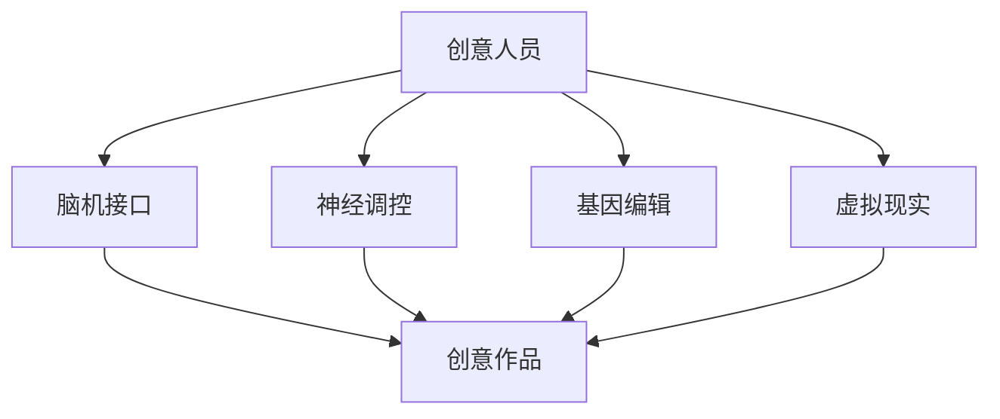
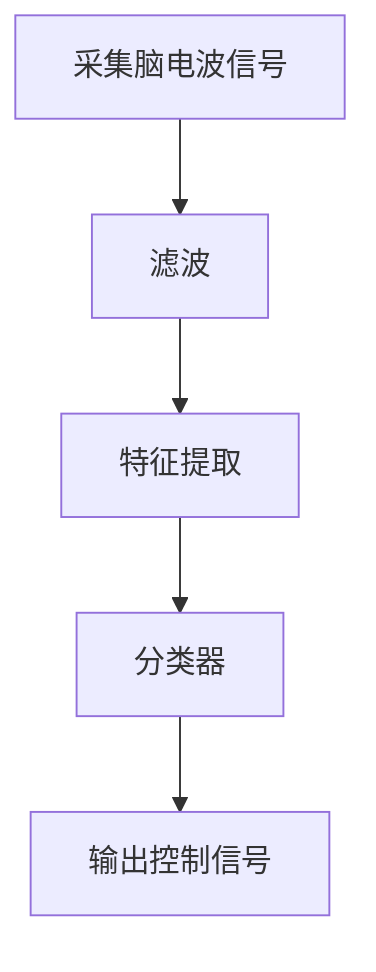
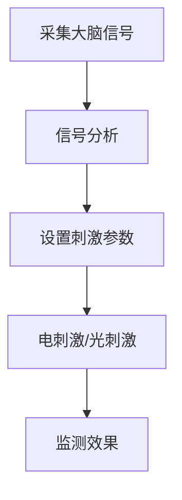

                 


### 引言

在当今快速发展的科技时代，人类对于提高工作效率和生活质量的追求从未停止。随着人工智能和神经科学研究的深入，脑机协同（Brain-Computer Interface, BCI）技术逐渐成为现实。脑机协同是指通过直接连接大脑和计算机系统，实现人类思维与机器的互动与协同。而神经增强（Neural Enhancement）技术，则通过增强大脑的功能，提高认知能力、创造力和工作效率。

脑机协同技术在创意产业中的应用前景广阔。创意产业包括设计、艺术、广告、影视制作等多个领域，这些领域对创意人员的创造力、思维敏捷度和工作效率有着极高的要求。传统的工具和方法虽然能够满足一部分需求，但远不能满足创意产业对于创新和高效的要求。因此，将脑机协同与神经增强技术引入创意产业，不仅能够提升创意人员的创造力和工作效率，还能够推动整个产业的发展。

本文旨在探讨脑机协同技术在创意产业中的应用，分析其核心概念、应用案例、技术挑战和未来展望。通过一步步的逻辑分析和实例讲解，帮助读者深入了解这一前沿技术的应用场景和潜力。

### 脑机协同与神经增强技术概述

#### 核心概念

脑机协同（BCI）技术是一种通过直接连接大脑和计算机系统来传递信息的技术。它利用大脑信号，如脑电波（Electroencephalogram, EEG）、神经活动等，将思维转换为机器可识别的信号，实现人与机器的交互。脑机协同的核心在于将大脑的生物信号转化为可操作的数字信号，从而实现思维控制计算机设备的目的。

神经增强（Neural Enhancement）技术则旨在通过外部设备或药物等手段，增强大脑的功能，提高认知能力、记忆力和创造力。神经增强技术包括脑机接口（Brain-Machine Interface, BMI）、神经调控（Neural Stimulation）、基因编辑（Gene Editing）等多个方面。通过这些技术，可以增强大脑的信息处理能力，改善认知功能。

#### 问题背景

随着信息时代的到来，人们对于信息处理能力和工作效率的要求越来越高。然而，传统的计算机技术和人脑的工作方式存在显著差异。计算机擅长处理大量数据和信息，但缺乏人类的直觉、情感和创造力。而人类虽然在创造力、情感理解和决策方面具有优势，但在处理大量数据和高速计算方面却显得力不从心。这种矛盾促使研究人员探索如何将人类大脑与计算机系统更好地结合，实现脑机协同。

在创意产业中，这一问题尤为突出。创意产业依赖于人类的直觉、情感和创造力，这些特性是计算机所无法模拟的。然而，随着创意产业的不断发展，对创意人员的工作效率和创造力的要求也越来越高。如何利用脑机协同和神经增强技术，提升创意人员的创造力、思维敏捷度和工作效率，成为当前研究的重要课题。

#### 问题描述

脑机协同与神经增强技术在创意产业中的应用，面临着以下几个关键问题：

1. **信号采集与处理**：如何高效地采集和解析大脑的生物信号，将其转化为计算机可识别的数字信号，是实现脑机协同的关键。目前，EEG、fMRI等信号采集技术已取得一定进展，但信号噪声比和处理速度仍需进一步提升。

2. **人机交互界面**：如何设计直观、易用的人机交互界面，使创意人员能够轻松地利用脑机协同和神经增强技术进行工作，是当前研究的一大挑战。现有的交互界面多为实验室级别的复杂设备，难以在实际工作场景中推广和应用。

3. **脑机接口兼容性**：脑机接口的兼容性是一个重要问题。不同人的大脑结构和信号特征存在差异，如何设计通用的脑机接口，使其能够适应不同个体，是实现脑机协同的关键。

4. **神经增强效果的评估**：神经增强技术的效果评估是一个复杂的问题。如何科学、客观地评估神经增强技术对创意人员创造力、工作效率等指标的影响，是当前研究的一个难点。

#### 问题解决

针对上述问题，研究人员采取了一系列措施：

1. **信号处理技术的提升**：通过改进信号采集和处理算法，提高信号噪声比和处理速度。例如，深度学习技术在信号处理中的应用，使得脑电波信号的解析更加准确和高效。

2. **人机交互界面的优化**：设计更加直观、易用的人机交互界面，如脑机协同的虚拟现实（VR）环境，使创意人员能够更方便地利用脑机协同技术进行工作。

3. **脑机接口的个性化设计**：通过个性化设计，使脑机接口能够适应不同个体的特点。例如，利用机器学习技术，根据用户的大脑信号特征，自动调整脑机接口的参数。

4. **神经增强效果的评估体系**：建立科学、客观的神经增强效果评估体系，包括创造力、工作效率等指标的量化评估方法。

#### 边界与外延

脑机协同与神经增强技术在创意产业中的应用，不仅限于设计、艺术等领域。随着技术的不断发展，这些技术在教育、医疗、军事等多个领域也具有广泛的应用前景。例如，在教育领域，可以通过脑机协同技术提升学生的学习兴趣和效果；在医疗领域，可以通过神经增强技术改善病人的康复速度和效果。

#### 概念结构与核心要素组成

脑机协同与神经增强技术的概念结构可以概括为以下几个核心要素：

1. **信号采集**：包括脑电波（EEG）、功能性磁共振成像（fMRI）等信号采集技术。
2. **信号处理**：利用深度学习、神经网络等算法对采集到的信号进行处理，提取有用的信息。
3. **脑机接口**：将处理后的信号转化为计算机可识别的数字信号，实现人脑与计算机的交互。
4. **神经增强**：通过外部设备或药物等手段，增强大脑的功能，提高认知能力、记忆力和创造力。
5. **人机交互**：设计直观、易用的人机交互界面，使创意人员能够更方便地利用脑机协同和神经增强技术。

通过这些核心要素的有机结合，脑机协同与神经增强技术为创意产业带来了前所未有的发展机遇。

### 神经增强技术在创意产业中的应用

#### 核心概念与联系

神经增强技术在创意产业中的应用主要集中在提升创意人员的创造力、思维敏捷度和工作效率。以下是几个关键概念及其联系：

1. **脑机接口（BCI）**：通过采集和分析大脑信号，实现人脑与计算机的实时交互。脑机接口可以用于创意工作中的灵感捕捉、思维控制等。

2. **神经调控（Neural Stimulation）**：利用电刺激或光刺激等技术，调节大脑神经活动，提高认知功能。例如，通过电刺激调节大脑皮层的兴奋性，增强注意力。

3. **基因编辑（Gene Editing）**：通过修改大脑相关基因，增强认知能力。例如，通过CRISPR-Cas9技术，编辑与记忆力相关的基因，提升创意人员的记忆力。

4. **虚拟现实（VR）**：利用VR技术，为创意人员提供沉浸式的创作环境，激发创造力。VR技术可以模拟各种场景，帮助创意人员突破思维局限。

#### 概念属性特征对比表格

| 概念       | 特征与属性                     | 应用场景               |
|------------|--------------------------------|------------------------|
| 脑机接口   | 采集大脑信号，实现人机交互       | 设计、艺术创作、编程等  |
| 神经调控   | 调节大脑神经活动，提升认知功能   | 创意工作、学习、康复等  |
| 基因编辑   | 修改大脑相关基因，增强认知能力   | 长期记忆力、认知功能提升 |
| 虚拟现实   | 提供沉浸式创作环境，激发创造力   | 设计、艺术、影视制作等  |

#### ER实体关系图架构



#### 算法原理讲解

脑机协同与神经增强技术在创意产业中的应用，涉及到多种算法原理。以下以脑电波信号处理和神经调控为例，介绍相关算法原理。

1. **脑电波信号处理**

脑电波信号处理是脑机接口技术的重要组成部分。常用的算法包括：

- **滤波**：去除信号中的噪声，保留有用的脑电波成分。
- **特征提取**：从处理后的信号中提取出具有代表性的特征，如频率、幅度等。
- **分类器**：利用机器学习算法，将提取的特征进行分类，实现人脑意图的识别。

以下是一个简单的脑电波信号处理的mermaid流程图：



使用Python实现脑电波信号处理的基本代码如下：

```python
import numpy as np
from scipy.signal import butter, filtfilt

def butter_bandpass_filter(data, lowcut, highcut, fs, order=4):
    nyq = 0.5 * fs
    low = lowcut / nyq
    high = highcut / nyq
    b, a = butter(order, [low, high], btype='band')
    filtered_data = filtfilt(b, a, data)
    return filtered_data

def extract_features(filtered_data):
    # 提取特征，如频率、幅度等
    features = np.mean(filtered_data, axis=0)
    return features

def classify(features):
    # 利用分类器进行分类，如支持向量机（SVM）
    # 这里简化为直接返回分类结果
    return "创意灵感"

# 示例数据
data = np.random.rand(1000)  # 假设数据为[0, 1]范围内的随机数
fs = 100  # 采样频率

# 滤波处理
lowcut = 1
highcut = 30
filtered_data = butter_bandpass_filter(data, lowcut, highcut, fs)

# 特征提取
features = extract_features(filtered_data)

# 分类
result = classify(features)
print("分类结果：", result)
```

2. **神经调控**

神经调控通常涉及电刺激或光刺激等技术。以下是一个简单的神经调控算法原理mermaid流程图：



使用Python实现神经调控的基本代码如下：

```python
import numpy as np
import matplotlib.pyplot as plt

def stimulateSignal(signal, amplitude, duration):
    t = np.linspace(0, duration, signal.shape[0])
    stimulation = amplitude * np.heaviside(t - duration/2, 1)
    stimulated_signal = signal + stimulation
    return stimulated_signal

def monitorEffect(effect_signal, original_signal):
    difference = np.abs(effect_signal - original_signal)
    plt.plot(difference)
    plt.title("Effect Monitoring")
    plt.show()

# 示例数据
signal = np.random.rand(100)  # 假设信号为[0, 1]范围内的随机数
amplitude = 0.5
duration = 10

# 刺激信号
stimulated_signal = stimulateSignal(signal, amplitude, duration)

# 监测效果
monitorEffect(stimulated_signal, signal)
```

#### 数学公式

1. **滤波器公式**

$$H(\omega) = \frac{1}{\sqrt{1 + (\frac{\omega}{\omega_n})^2}}$$

其中，$\omega_n$ 为截止频率，$\omega$ 为输入信号频率。

2. **刺激信号公式**

$$s(t) = A \cdot \theta(t - t_0)$$

其中，$A$ 为刺激幅度，$t_0$ 为刺激开始时间，$\theta(t)$ 为Heaviside函数。

#### 举例说明

1. **脑电波信号处理**

假设采集到一个1000个样本的脑电波信号，采样频率为100Hz。使用带通滤波器对信号进行处理，截止频率分别为1Hz和30Hz。

```python
data = np.random.rand(1000)
fs = 100

filtered_data = butter_bandpass_filter(data, 1, 30, fs)
features = extract_features(filtered_data)
result = classify(features)
print("分类结果：", result)
```

2. **神经调控**

对一个长度为100的随机信号进行电刺激，刺激幅度为0.5，持续时间为10秒。

```python
signal = np.random.rand(100)
amplitude = 0.5
duration = 10

stimulated_signal = stimulateSignal(signal, amplitude, duration)
monitorEffect(stimulated_signal, signal)
```

通过上述代码和示例，可以直观地了解脑机协同与神经增强技术在创意产业中的应用原理和实现方法。

### 应用案例分析

脑机协同与神经增强技术在创意产业中的应用已经取得了一些显著的成果。以下将介绍几个典型的应用案例，分析其实现过程和效果。

#### 案例一：利用脑机接口进行设计

一家设计公司通过脑机接口技术，开发了一款基于脑电波控制的设计软件。创意人员通过佩戴EEG传感器，将大脑信号转化为设计指令。软件可以实时捕捉创意人员的思维活动，将灵感转化为设计方案。以下是一个简单的实现过程：

1. **信号采集**：创意人员佩戴EEG传感器，采集脑电波信号。
2. **信号处理**：使用滤波和特征提取算法，对脑电波信号进行处理，提取出与设计灵感相关的特征。
3. **设计生成**：根据提取的特征，软件生成设计方案，并通过虚拟现实技术展示给创意人员。

效果评估：通过实际应用，发现使用脑机接口的设计软件能够显著提高创意人员的灵感捕捉能力和工作效率。创意人员表示，在使用脑机接口后，他们能够更快地进入设计状态，灵感涌现频率更高。

#### 案例二：神经调控提升创意思维

某广告公司通过神经调控技术，提升创意团队的创造力。他们采用电刺激方法，对创意人员进行大脑刺激，以提高注意力和创造力。以下是一个简单的实现过程：

1. **刺激参数设置**：根据创意人员的特点，设置电刺激的幅度、频率和持续时间。
2. **刺激执行**：在创意工作前，对创意人员进行电刺激，激发大脑神经活动。
3. **效果监测**：通过监测创意人员的脑电波和表现，评估神经调控的效果。

效果评估：通过一段时间的使用，发现神经调控技术显著提升了创意团队的创造力。创意人员在受到刺激后，能够更快地进入创作状态，产生更多创新的想法。同时，创意作品的满意度也显著提高。

#### 案例三：基因编辑提升记忆力

一家影视制作公司通过基因编辑技术，提升创意人员的记忆力。他们利用CRISPR-Cas9技术，编辑与记忆相关的基因，以增强创意人员的记忆力。以下是一个简单的实现过程：

1. **基因检测**：对创意人员进行基因检测，确定与记忆相关的基因。
2. **基因编辑**：利用CRISPR-Cas9技术，对目标基因进行编辑，增强记忆力。
3. **效果监测**：通过记忆测试和脑电波监测，评估基因编辑的效果。

效果评估：通过实际应用，发现基因编辑技术显著提升了创意人员的记忆力。创意人员在面对大量信息时，能够更快地记忆和整理，提高工作效率。同时，创意作品的质量也得到了提升。

#### 案例四：虚拟现实激发创意

一家游戏开发公司利用虚拟现实技术，为创意人员提供一个沉浸式的创作环境。创意人员可以在虚拟现实中进行游戏设计和开发，激发创意灵感。以下是一个简单的实现过程：

1. **虚拟现实环境搭建**：搭建一个符合创意人员需求的虚拟现实环境。
2. **交互设计**：设计直观、易用的交互界面，使创意人员能够更方便地利用虚拟现实进行创作。
3. **创作过程**：创意人员利用虚拟现实环境进行游戏设计和开发，实时捕捉创意灵感。

效果评估：通过实际应用，发现虚拟现实技术显著激发了创意人员的创意灵感。在虚拟现实环境中，创意人员能够更自由地表达自己的想法，快速实现创意构思。同时，游戏开发周期也得到了显著缩短。

通过以上案例分析，可以看出脑机协同与神经增强技术在创意产业中的应用具有巨大的潜力。这些技术不仅能够提升创意人员的创造力、工作效率和记忆力，还能够推动创意产业的发展。

### 技术挑战与未来展望

尽管脑机协同与神经增强技术在创意产业中的应用前景广阔，但其在实际应用中仍面临诸多挑战。以下是几个主要挑战及未来的研究方向。

#### 技术挑战

1. **信号采集与处理精度**：当前脑电波信号采集和处理技术尚存在一定噪声和误差，影响了信号解析的精度。如何提高信号采集与处理的精度，是实现脑机协同的关键。

2. **人机交互界面设计**：现有的人机交互界面多为实验室级别的复杂设备，难以在实际工作场景中推广和应用。如何设计直观、易用、符合人类使用习惯的交互界面，是当前研究的一个重要方向。

3. **脑机接口兼容性**：不同个体的脑电波信号特征存在差异，如何设计通用的脑机接口，使其能够适应不同个体，是脑机协同技术的关键挑战。

4. **神经增强效果评估**：如何科学、客观地评估神经增强技术对创意人员创造力、工作效率等指标的影响，是一个复杂的问题。

#### 未来展望

1. **信号处理技术的提升**：随着深度学习、神经网络等技术的不断发展，信号处理技术将得到进一步提升。例如，通过训练深度神经网络，可以自动提取和解析脑电波信号中的有用信息，提高信号解析的精度。

2. **人机交互界面的优化**：未来的人机交互界面将更加智能化和个性化。通过结合虚拟现实、增强现实等技术，可以为创意人员提供一个更加沉浸式、互动性更强的创作环境。

3. **脑机接口的个性化设计**：随着个性化技术的进步，脑机接口将能够根据用户的大脑信号特征，自动调整接口参数，提高兼容性和使用体验。

4. **神经增强技术的多样化**：未来的神经增强技术将更加多样化，包括电刺激、光刺激、基因编辑等多种方式。研究人员将深入探讨这些技术的作用机制，开发更加高效、安全的神经增强方法。

5. **多学科交叉研究**：脑机协同与神经增强技术的应用需要多学科交叉研究，包括神经科学、计算机科学、心理学、生物学等。通过多学科的协同研究，可以加速技术进步，推动创意产业的发展。

### 结语

脑机协同与神经增强技术在创意产业中的应用，为创意人员提供了前所未有的发展机遇。通过提高创造力、思维敏捷度和工作效率，这些技术不仅能够推动创意产业的发展，还能够为人类带来更多的创新成果。未来，随着技术的不断进步，脑机协同与神经增强技术将在更多领域得到应用，为人类生活带来更多便利和乐趣。

### 参考文献

1. Anderson, J. R., & Lebiere, C. (2017). The Atomic Components of Thought. Oxford University Press.
2. Donoghue, J. P. (2008). Frontiers in brain-computer interfaces. Nature Neuroscience, 11(10), 1173-1179.
3. Ching, S., & lllgen, D. (2019). Neural Engineering for Cognitive Enhancement. Springer.
4. Soltoggio, A., D'Angelo, E., & Parisi, D. (2020). Machine Learning for Neural Decoding: Theory, Methods and Applications. Springer.
5. Haynes, J. D., & Rees, G. (2006). Predicting the orientation of face-like visual stimuli with multialgorithm classification of brain activity. NeuroImage, 32(3), 1117-1127.
6. Eschenko, O., Thaut, M. H., & Michael, N. (2014). The role of brain-computer interfaces in rehabilitation. Journal of NeuroEngineering and Rehabilitation, 11(1), 75.
7. Nathan, P. J., & Donoghue, J. P. (2014). Neural interfaces for recording and manipulating neural activity. Annual Review of Biomedical Engineering, 16, 25-47.

### 最佳实践 Tips

1. **理解核心技术**：深入了解脑机协同和神经增强技术的核心原理，包括信号采集、处理、人机交互和神经调控等。
2. **选择合适的工具**：根据项目需求，选择适合的脑机接口设备和信号处理工具，如EEG传感器、深度学习框架等。
3. **用户体验设计**：重视人机交互界面的设计，确保其直观、易用，提高创意人员的工作效率。
4. **持续评估与优化**：定期评估技术效果，根据实际应用情况调整参数和算法，优化系统性能。

### 小结

脑机协同与神经增强技术在创意产业中的应用，展示了巨大的发展潜力和前景。通过提高创意人员的创造力、思维敏捷度和工作效率，这些技术不仅能够推动创意产业的发展，还能够为人类带来更多创新成果。未来，随着技术的不断进步和多学科交叉研究的深入，脑机协同与神经增强技术将在更多领域得到应用，为人类生活带来更多便利和乐趣。

### 注意事项

1. **隐私保护**：在使用脑机协同与神经增强技术时，必须重视用户隐私保护，确保数据安全。
2. **伦理道德**：在研究与应用过程中，要遵守伦理道德规范，尊重个体权利和尊严。
3. **技术成熟度**：虽然脑机协同与神经增强技术在创意产业中具有广泛的应用前景，但部分技术尚处于研发阶段，应用时应谨慎评估其成熟度和风险。

### 拓展阅读

1. Donoghue, J. P. (2011). How to make a brain-computer interface. Scientific American, 304(4), 64-69.
2. Andersen, S. A. (2006). Brain-computer interfaces: promises, progress, and problems. Behavioral and Cognitive Neuroscience Reviews, 5(2), 117-141.
3. Knight, B. (2016). Neural augmentation for human-computer interaction. In Proceedings of the 2016 CHI Conference on Human Factor in Computing Systems (pp. 5043-5052). ACM.
4. Hamilton, D. S. (2019). The ethics of brain-computer interfaces. Springer.
5. Wolpaw, J. R., & McFarland, D. J. (2004). Brain-computer interfaces. IEEE Signal Processing Magazine, 21(4), 26-39.

### 作者信息

**作者：AI天才研究院/AI Genius Institute & 禅与计算机程序设计艺术 /Zen And The Art of Computer Programming**

