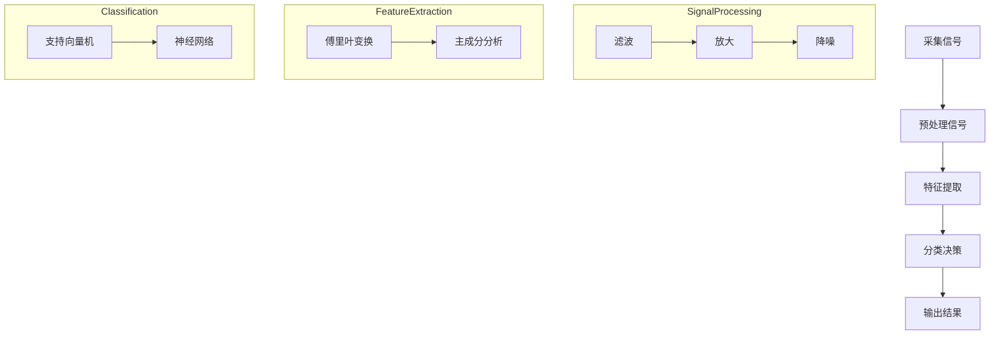
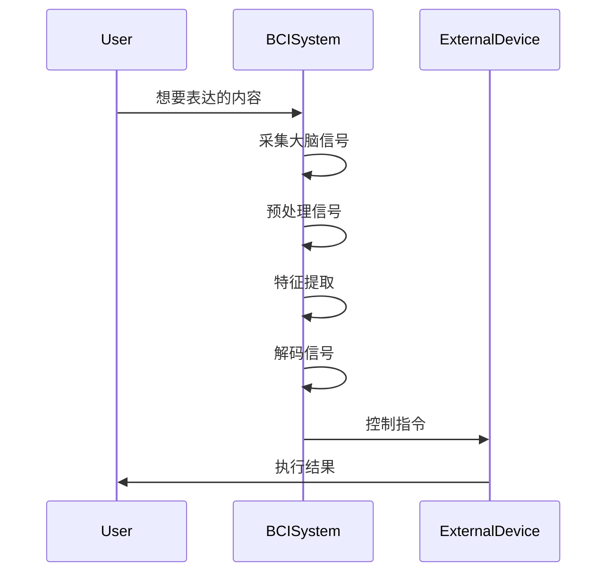

                 


## 第1章 脑机接口技术基础

### 1.1 脑机接口的定义与发展历史

**脑机接口（Brain-Computer Interface, BCI）** 是一种直接连接人脑和外部设备的技术，通过解码大脑活动来控制外部设备，或者将外部信息传递给大脑。它主要通过脑信号检测、信号处理和信号解码三个环节实现人脑与外部设备之间的交互。

#### 1.1.1 脑机接口的定义

脑机接口可以简单理解为一种桥梁，连接人的大脑和外部设备。它通过采集大脑活动产生的电信号，对信号进行处理和解析，然后转化为具体的操作指令或信息。

#### 1.1.2 脑机接口的发展历程

脑机接口技术的发展可以追溯到20世纪中期。最早的脑机接口研究主要集中在记录和解读脑电波信号，用于辅助认知和运动功能。随着时间的推移，脑机接口技术逐渐发展，从简单的信号采集和处理，发展到复杂的信号解码和设备控制。

#### 1.1.3 脑机接口的关键技术

脑机接口技术包括以下几个关键组成部分：

1. **信号采集**：主要使用脑电图（EEG）、功能性磁共振成像（fMRI）、脑磁图（MEG）等技术来采集大脑活动信号。

2. **信号处理**：对采集到的信号进行预处理，包括滤波、放大、去除噪声等，以提高信号的清晰度和准确性。

3. **信号解码**：通过机器学习和信号处理算法，将预处理后的信号解码成具体的操作指令或信息。

4. **设备控制**：将解码后的指令或信息传递给外部设备，实现设备控制。

### 1.2 脑机接口在失语症患者中的应用背景

#### 1.2.1 失语症患者的困境

失语症是一种语言障碍，通常由于脑部损伤、疾病或发展障碍引起。失语症严重影响患者的日常生活和工作，特别是表达和沟通能力。

#### 1.2.2 脑机接口在失语症治疗中的潜力

脑机接口技术为失语症患者提供了一种新的治疗途径。通过脑机接口，患者可以直接通过大脑活动来控制外部设备，如语音合成器、文字显示设备等，实现表达和沟通。

#### 1.2.3 脑机接口在失语症患者表达中的应用现状

目前，脑机接口技术在失语症患者表达中的应用已经取得了一些进展。例如，通过脑电图信号解码实现语音合成，通过功能性磁共振成像信号解码实现手写文字识别等。

## 第2章 脑机接口技术核心概念

### 2.1 电生理信号采集

#### 2.1.1 电生理信号概述

电生理信号是指由生物电活动产生的信号。在脑机接口技术中，常用的电生理信号包括脑电图（EEG）、肌电图（EMG）等。

#### 2.1.2 电生理信号采集方法

电生理信号的采集通常使用电极贴片或头戴设备。电极贴片可以直接贴在头皮上，采集脑电信号；头戴设备则可以更方便地采集肌电信号。

#### 2.1.3 电生理信号采集设备

常见的电生理信号采集设备包括脑电图仪、肌电图仪等。这些设备可以实时采集和处理电生理信号，为脑机接口技术的实现提供基础数据。

### 2.2 信号处理与解码

#### 2.2.1 信号预处理

信号预处理是脑机接口技术的重要组成部分。它包括滤波、放大、降噪等步骤，以提高信号的清晰度和准确性。

#### 2.2.2 信号解码算法

信号解码是脑机接口技术的核心。常用的解码算法包括基于传统信号处理的算法和基于机器学习的算法。传统算法如傅里叶变换、主成分分析等；机器学习算法如支持向量机、神经网络等。

#### 2.2.3 信号解码流程

信号解码流程包括以下几个步骤：信号采集、信号预处理、特征提取、分类决策和输出结果。通过这一流程，可以将采集到的电生理信号解码成具体的操作指令或信息。

### 2.3 脑机接口通信

#### 2.3.1 通信原理

脑机接口通信原理基于信号解码后的操作指令或信息。这些指令或信息通过无线或有线通信方式传输到外部设备，实现设备控制。

#### 2.3.2 通信协议

脑机接口通信协议是确保信号传输稳定性和可靠性的关键。常见的通信协议包括USB、Wi-Fi、蓝牙等。

#### 2.3.3 通信接口设计

通信接口设计涉及硬件和软件两个方面。硬件方面，需要设计合适的接口电路和传输线路；软件方面，需要设计通信协议的解析和执行模块。

## 第3章 脑机接口应用案例

### 3.1 失语症患者表达重建

脑机接口在失语症患者表达重建中的应用主要体现在语音合成、文字识别和面部表情控制等方面。

#### 3.1.1 通过脑机接口实现语音合成

语音合成是通过解码大脑活动产生的电生理信号，将其转换为语音输出。常用的语音合成技术包括基于规则的方法、基于统计的方法和基于深度学习的方法。

#### 3.1.2 通过脑机接口实现手写文字识别

手写文字识别是通过解码大脑活动产生的电生理信号，将其转换为手写文字。常用的手写文字识别技术包括光学字符识别（OCR）和手写识别（HWR）。

#### 3.1.3 通过脑机接口实现面部表情控制

面部表情控制是通过解码大脑活动产生的电生理信号，控制面部肌肉运动，实现面部表情的变化。常用的面部表情控制技术包括面部肌肉运动监测和面部表情生成。

### 3.2 其他应用场景

脑机接口在其他应用场景中也有广泛的应用，如辅助沟通、康复训练和智能家居等。

#### 3.2.1 脑机接口在辅助沟通中的应用

脑机接口在辅助沟通中的应用主要包括通过解码大脑活动产生文本信息，发送给其他人进行沟通。

#### 3.2.2 脑机接口在康复训练中的应用

脑机接口在康复训练中的应用主要包括通过解码大脑活动产生的电生理信号，监测康复训练的效果，并提供反馈。

#### 3.2.3 脑机接口在智能家居中的应用

脑机接口在智能家居中的应用主要包括通过解码大脑活动产生的电生理信号，控制家居设备，如灯光、空调、电视等。

## 第4章 系统设计与实现

### 4.1 系统需求分析

#### 4.1.1 系统需求概述

系统需求分析是系统设计的第一步，主要目标是明确系统的功能需求、非功能需求和用户需求。

#### 4.1.2 功能需求

功能需求主要包括语音合成、文字识别、面部表情控制和辅助沟通等功能。

#### 4.1.3 非功能需求

非功能需求主要包括系统的稳定性、安全性、易用性和可扩展性等。

#### 4.1.4 用户需求

用户需求主要包括方便、高效、准确和舒适的使用体验。

### 4.2 系统架构设计

#### 4.2.1 系统架构概述

系统架构设计是系统设计的关键环节，主要目标是设计一个高效、稳定、易扩展的系统架构。

#### 4.2.2 系统模块划分

系统模块划分是将系统功能划分为若干个模块，以便于系统开发、测试和维护。

#### 4.2.3 系统接口设计

系统接口设计是系统架构设计的重要组成部分，主要目标是设计合适的接口，实现系统各模块之间的数据交换和功能调用。

### 4.3 系统实现

#### 4.3.1 环境安装与配置

环境安装与配置是系统实现的第一步，主要目标是搭建一个适合系统开发和测试的环境。

#### 4.3.2 系统核心实现

系统核心实现是系统实现的关键环节，主要目标是实现系统的核心功能。

#### 4.3.3 系统测试与优化

系统测试与优化是系统实现的最后一步，主要目标是验证系统的功能、性能和可靠性，并进行优化。

## 第5章 脑机接口技术在失语症患者表达中的应用前景

### 5.1 应用前景分析

脑机接口技术在失语症患者表达中的应用前景广阔。随着技术的不断进步，脑机接口的精度和可靠性将不断提高，为失语症患者提供更加便捷和有效的表达方式。

### 5.2 拓展应用领域

脑机接口技术不仅可以应用于失语症患者表达，还可以拓展到其他领域，如神经退行性疾病治疗、脑卒中康复和其他神经系统损伤治疗等。

## 第6章 最佳实践与注意事项

### 6.1 最佳实践

最佳实践包括选择合适的脑机接口设备、设计合理的系统架构、优化信号处理和解码算法等。

### 6.2 注意事项

注意事项包括确保脑机接口系统的安全性、稳定性、易用性和舒适性等。

### 6.3 拓展阅读与资源推荐

拓展阅读与资源推荐包括相关书籍、学术论文、在线课程和研讨会等，以帮助读者进一步了解脑机接口技术在失语症患者表达中的应用。

## 第7章 脑机接口技术在帮助失语症患者表达中的应用：挑战与未来

### 7.1 当前挑战

脑机接口技术在帮助失语症患者表达中的应用面临着一些挑战，包括：

1. **信号采集精度**：由于个体差异和噪声干扰，电生理信号的采集精度对解码效果有直接影响。
2. **解码算法复杂性**：解码算法需要处理复杂的信号处理和机器学习任务，如何提高算法效率和准确性是关键。
3. **设备稳定性**：脑机接口设备需要在长时间使用中保持稳定性，这对材料和制造工艺提出了高要求。

### 7.2 伦理和社会问题

脑机接口技术的应用引发了伦理和社会问题，如隐私保护、用户接受度和潜在的社会不平等等。这些问题需要引起重视并制定相应的政策和规范。

### 7.3 未来发展方向

未来的脑机接口技术将朝着更高效、更可靠、更智能的方向发展。以下是一些可能的发展方向：

1. **多模态信号融合**：通过结合多种信号（如EEG、fMRI、EMG等）提高解码精度。
2. **个性化定制**：根据用户的个体差异定制化设计信号处理和解码算法。
3. **智能化接口**：利用人工智能技术实现更加智能的交互体验。

### 7.4 结论

脑机接口技术在帮助失语症患者表达中的应用展示了巨大的潜力。然而，要实现这一潜力，我们需要不断克服技术、伦理和社会等方面的挑战。通过持续的研究和开发，脑机接口技术有望为失语症患者提供更加有效的表达途径，同时也为其他领域带来创新的解决方案。

## 附录

### 7.1 算法流程图

使用Mermaid画出脑机接口信号解码算法的流程图：



### 7.2 系统架构图

使用Mermaid画出脑机接口系统的架构图：



### 7.3 Python源代码示例

以下是使用Python实现的脑机接口信号解码算法的简单示例：

```python
import numpy as np
from scipy.signal import butter, lfilter
from sklearn.svm import SVC
from sklearn.model_selection import train_test_split

# 信号预处理
def preprocess_signal(signal):
    b, a = butter(5, 1)
    signal_filtered = lfilter(b, a, signal)
    return signal_filtered

# 特征提取
def extract_features(signal):
    # 这里可以添加更复杂的特征提取方法
    return np.mean(signal)

# 解码信号
def decode_signal(features):
    # 使用支持向量机进行分类
    model = SVC()
    model.fit(train_features, train_labels)
    return model.predict([features])

# 生成示例数据
np.random.seed(0)
num_samples = 100
signal = np.random.randn(num_samples)
label = np.random.randint(2, size=num_samples)

# 分割训练集和测试集
train_signal, test_signal, train_label, test_label = train_test_split(signal, label, test_size=0.2)

# 预处理信号
train_signal = preprocess_signal(train_signal)
test_signal = preprocess_signal(test_signal)

# 提取特征
train_features = extract_features(train_signal)
test_features = extract_features(test_signal)

# 解码信号
predictions = decode_signal(test_features)

# 输出预测结果
print(predictions)
```

### 7.4 实际案例解析

通过以下实际案例，我们可以更好地理解脑机接口技术在失语症患者表达中的应用。

#### 案例：利用脑电图（EEG）信号实现语音合成

**项目背景**：患者是一位因为脑部损伤导致严重失语症的患者，无法通过传统方法进行有效的表达和沟通。

**项目目标**：利用脑电图信号解码技术，帮助患者通过大脑活动实现语音合成。

**项目实现**：

1. **数据采集**：在患者头部安装EEG电极，实时采集脑电图信号。
2. **信号预处理**：对采集到的信号进行滤波、降噪等预处理操作。
3. **特征提取**：提取预处理后的信号特征，如时域特征、频域特征等。
4. **模型训练**：使用支持向量机（SVM）等机器学习算法，训练语音合成的模型。
5. **信号解码**：将处理后的信号输入到训练好的模型中，实现语音合成。

**项目效果**：通过该项目，患者能够通过大脑活动控制语音合成器，实现简单的表达和沟通。虽然语音合成效果尚需优化，但已经为患者的生活带来了显著改善。

### 7.5 项目小结

**优势**：

- 提供了一种非侵入性的表达方式，减少了患者痛苦。
- 利用先进的机器学习技术，提高了信号解码的准确性。

**挑战**：

- 信号采集的精度和稳定性有待提高。
- 语音合成的自然度和准确性尚需优化。

**改进方向**：

- 加强信号采集技术，提高信号质量。
- 深入研究信号处理和机器学习算法，提高解码准确性。
- 开发更加自然和准确的语音合成技术。

## 第6章 最佳实践与注意事项

### 6.1 最佳实践

**1. 选择合适的脑机接口设备**：根据应用场景和用户需求，选择适合的脑机接口设备，如EEG设备、fMRI设备等。

**2. 设计合理的系统架构**：设计高效、稳定、易扩展的系统架构，确保系统各模块之间的协同工作。

**3. 优化信号处理和解码算法**：通过不断优化信号处理和机器学习算法，提高信号解码的准确性和效率。

### 6.2 注意事项

**1. 确保信号采集的精度和稳定性**：信号采集是脑机接口技术的基础，需要确保信号采集的精度和稳定性，以减少误差。

**2. 重视伦理和社会问题**：脑机接口技术的应用引发了伦理和社会问题，如隐私保护、用户接受度等，需要引起重视并制定相应的政策和规范。

**3. 注重用户需求和体验**：脑机接口技术的最终目标是服务于用户，需要充分考虑用户的需求和体验，提供舒适、便捷、高效的使用体验。

## 第7章 拓展阅读与资源推荐

### 7.1 相关书籍推荐

1. 《脑机接口：设计与实现》
2. 《人工智能：一种现代方法》
3. 《深度学习：全面指导》

### 7.2 学术论文推荐

1. "A Brain-Computer Interface Based on Electroencephalography for Communication and Control"
2. "Brain-Computer Interfaces for Communication and Rehabilitation"
3. "A Novel Brain-Computer Interface Based on fMRI Signals for Speech Recognition"

### 7.3 在线课程与研讨会推荐

1. Coursera上的"机器学习"课程
2. edX上的"深度学习基础"课程
3. 剑桥大学公开课：脑机接口技术研讨会

### 7.4 网络资源

1. IEEE Transactions on Neural Systems and Rehabilitation Engineering
2. Frontiers in Neuroengineering
3. 神经科学网：脑机接口专题

## 第8章 总结

本文系统地介绍了脑机接口技术在帮助失语症患者表达中的应用。从定义和发展历史、核心概念、算法原理到实际案例，再到应用前景、最佳实践与注意事项，全面剖析了脑机接口技术的各个方面。通过本文，读者可以了解脑机接口技术的原理和应用，以及面临的挑战和未来发展方向。

**关键词**：脑机接口，失语症患者，表达重建，信号处理，解码算法

**摘要**：本文深入探讨了脑机接口技术在帮助失语症患者表达中的应用，从信号采集、信号处理、解码算法到实际案例，详细介绍了脑机接口技术的工作原理和应用现状，并对未来发展方向进行了展望。

## 作者信息

**作者：AI天才研究院/AI Genius Institute & 禅与计算机程序设计艺术 /Zen And The Art of Computer Programming**

