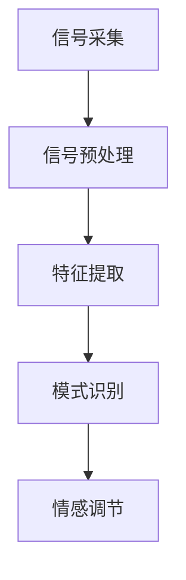
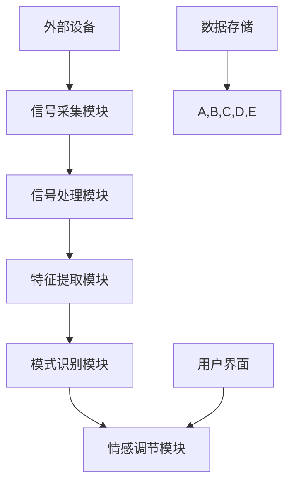

                 

### 《脑机接口在情感调节中的潜在应用》

---

关键词：脑机接口，情感调节，神经科学，技术应用，算法原理

摘要：脑机接口（Brain-Computer Interface, BCI）作为一种新兴的技术，正逐渐在医疗、教育、娱乐等多个领域展现出其独特的应用潜力。本文将探讨脑机接口在情感调节中的潜在应用，从核心概念到算法原理，再到系统架构设计，一步步深入分析这一领域的创新和前景。

---

### 目录

1. **引言**
    1.1 **背景介绍**
    1.2 **核心概念**
    1.3 **情感调节的重要性**
    1.4 **脑机接口与情感调节的结合**

2. **脑机接口的基础概念**
    2.1 **定义与历史**
    2.2 **技术类型与工作原理**
    2.3 **脑机接口的现有应用**

3. **情感调节的基础知识**
    3.1 **情感的定义与分类**
    3.2 **情感调节的重要性**
    3.3 **情感调节的传统方法**

4. **脑机接口在情感调节中的应用**
    4.1 **应用场景分析**
    4.2 **技术挑战与解决方案**

5. **算法原理讲解**
    5.1 **BCI情感调节算法概述**
    5.2 **算法流程与原理**
    5.3 **数学模型与公式**
    5.4 **算法举例**

6. **系统架构设计方案**
    6.1 **系统应用场景**
    6.2 **系统架构设计**
    6.3 **系统接口与交互**

7. **项目实战**
    7.1 **环境安装与配置**
    7.2 **系统核心实现**
    7.3 **代码分析与解读**
    7.4 **案例分析与剖析**
    7.5 **项目小结**

8. **最佳实践与注意事项**
    8.1 **最佳实践建议**
    8.2 **注意事项**

9. **拓展阅读**

10. **结论**

### 引言

---

**1.1 背景介绍**

脑机接口技术（BCI）起源于20世纪60年代，其初衷是通过直接将大脑信号转换为计算机指令，从而实现与外部设备或系统的交互。近年来，随着神经科学与计算技术的飞速发展，BCI技术逐渐从实验室走向实际应用，特别是在医疗、康复、辅助沟通、娱乐和军事等领域。

情感调节，作为人类心理健康的重要组成部分，对个体的生活质量和幸福感有着深远的影响。情感调节不良可能导致抑郁、焦虑等心理问题，甚至影响生理健康。传统的情感调节方法包括心理咨询、药物治疗和自我调节训练等，但这些方法往往存在效果不佳、成本高昂、接受度低等问题。

脑机接口在情感调节中的潜在应用，为解决传统方法中的种种难题提供了新的思路。通过直接读取和处理大脑信号，BCI技术有可能实现更加精准、个性化的情感调节方案，从而为心理健康领域带来革命性的变革。

**1.2 核心概念**

脑机接口（Brain-Computer Interface, BCI）：一种直接连接大脑与外部设备或计算机系统的技术，通过解码大脑信号来实现与外部世界的交互。

情感调节（Emotion Regulation）：个体通过认知和行为策略来调节自己的情绪体验的过程。

**1.3 情感调节的重要性**

情感调节在个体心理健康中起着至关重要的作用。良好的情感调节能力有助于缓解压力、提升生活质量、增强社会互动能力。相反，情感调节不良可能导致情绪问题，如焦虑、抑郁等。

**1.4 脑机接口与情感调节的结合**

脑机接口与情感调节的结合，有望实现以下目标：

- **个性化情感调节**：通过直接读取大脑信号，BCI技术可以更准确地捕捉个体的情感状态，从而实现个性化的情感调节方案。
- **非侵入性**：与传统治疗方法相比，BCI技术具有非侵入性的特点，减少了对患者生理和心理的副作用。
- **实时性**：BCI技术可以实时监测和调节情感状态，为个体提供即时的情感反馈和支持。

综上所述，脑机接口在情感调节中的潜在应用具有重要意义，本文将逐步探讨这一领域的核心概念、算法原理、系统架构和实际应用，以期为相关研究和实践提供参考。

### 脑机接口的基础概念

---

**2.1 定义与历史**

脑机接口（Brain-Computer Interface, BCI）是指直接连接大脑与外部设备或计算机系统的技术。BCI技术通过解码大脑产生的神经信号，将这些信号转换为计算机指令或控制信号，从而实现人脑与外部设备的直接通信。

BCI技术的发展历史可以追溯到20世纪60年代。当时，科学家们首次尝试通过记录大脑电信号来控制外部设备。随着神经科学和计算技术的不断进步，BCI技术逐渐从理论研究走向实际应用。近年来，随着脑成像技术、机器学习和深度学习算法的发展，BCI技术取得了显著的突破，开始在医疗、康复、辅助沟通和娱乐等领域展现出巨大的潜力。

**2.2 技术类型与工作原理**

BCI技术主要分为三种类型：基于神经信号的BCI、基于脑影像的BCI和基于脑电信号的BCI。

- **基于神经信号的BCI**：这种类型的BCI通过植入或贴在头皮上的电极，直接记录大脑神经元的电活动，进而解码出控制信号。例如，植入式脑机接口（Intracortical Brain-Machine Interface, iBMI）就是一种基于神经信号的BCI，通过在大脑皮层植入电极来记录和传输神经信号。

- **基于脑影像的BCI**：这种类型的BCI通过脑成像技术，如功能性磁共振成像（fMRI）、正电子发射断层扫描（PET）等，捕捉大脑的活动图像，进而分析出控制信号。基于脑影像的BCI具有高分辨率和高时空分辨率，但受限于成像设备的成本和操作复杂性。

- **基于脑电信号的BCI**：这种类型的BCI通过贴在头皮上的电极，记录大脑产生的电信号，如脑电图（EEG）、肌电信号（EMG）等，来解码控制信号。基于脑电信号的BCI具有便携性、实时性和低成本的特点，因此广泛应用于实际应用中。

**2.3 脑机接口的现有应用**

脑机接口技术已经在多个领域展现出其独特的应用潜力：

- **医疗领域**：在康复医学中，BCI技术可以用于帮助中风患者恢复运动功能、辅助听障人士进行语音识别等。此外，BCI技术还可以用于癫痫监测、神经系统疾病诊断等。

- **康复领域**：BCI技术可以帮助截肢者通过思维控制假肢、帮助瘫痪患者重新获得运动能力等。

- **辅助沟通**：对于无法使用传统沟通方式的残障人士，BCI技术提供了一种直接将思维转换为语言的途径。

- **娱乐领域**：BCI技术被应用于虚拟现实（VR）、电子游戏和智能玩具等领域，为用户带来全新的互动体验。

- **军事领域**：BCI技术可以用于军事通信、战斗控制等。

**2.4 脑机接口在情感调节中的应用前景**

随着BCI技术的不断发展，其在情感调节中的应用前景也越来越广阔。通过直接读取大脑的情感信号，BCI技术有可能实现以下应用：

- **个性化情感调节**：BCI技术可以实时监测个体的情感状态，从而提供个性化的情感调节方案。

- **心理治疗**：BCI技术可以辅助心理治疗师进行情感调节治疗，如焦虑症、抑郁症等。

- **日常情绪管理**：BCI技术可以帮助个体更好地管理日常情绪，提升生活质量。

总之，脑机接口技术在情感调节中的应用，不仅有助于解决传统方法中的种种难题，还为心理健康领域带来了新的希望和可能性。接下来，我们将进一步探讨情感调节的基础知识，为深入理解脑机接口在情感调节中的应用奠定基础。

### 情感调节的基础知识

---

**3.1 情感的定义与分类**

情感是人们对外界刺激产生的内心体验，包括情绪和情感两个方面。情绪通常指短暂、强烈的内心体验，如喜悦、愤怒、恐惧等；情感则是指长期、稳定的内心体验，如爱、恨、满意等。情感调节是指个体通过认知和行为策略来调节自己的情绪体验的过程。

根据情感的性质和表现，情感可以分为以下几类：

- **基本情感**：指人类共有的、最基本的情感类型，包括喜悦、愤怒、悲伤、恐惧、厌恶和惊讶等。
- **复合情感**：由基本情感相互组合形成的情感，如焦虑、羞愧、厌恶等。
- **正面情感**：使人感到愉悦、放松和有价值的情感，如喜悦、爱、满意等。
- **负面情感**：使人感到不适、痛苦和有威胁的情感，如愤怒、恐惧、悲伤等。

**3.2 情感调节的重要性**

情感调节在个体心理健康和社交互动中起着至关重要的作用。良好的情感调节能力有助于个体：

- **缓解压力**：通过有效的情感调节策略，个体可以更好地应对压力和挑战，减少压力对身心健康的影响。
- **提升生活质量**：情感调节能力强的个体更容易体验到正面情感，从而提升生活质量。
- **增强社交互动**：良好的情感调节能力有助于个体更好地处理社交情境，增强社交互动和人际关系的质量。

相反，情感调节不良可能导致以下问题：

- **情绪问题**：如焦虑、抑郁、愤怒等。
- **心理健康问题**：如精神分裂症、自闭症等。
- **社交障碍**：如社交焦虑、人际冲突等。

**3.3 情感调节的传统方法**

传统情感调节方法主要包括心理咨询、药物治疗和自我调节训练等。

- **心理咨询**：通过心理治疗师的帮助，个体可以学会更有效的情感调节策略，如认知行为疗法、情感焦点疗法等。
- **药物治疗**：通过药物调节个体的神经递质水平，改善情感状态。但药物副作用和依赖性是主要问题。
- **自我调节训练**：个体通过自我观察、自我反思和自我调节练习，逐步提高情感调节能力。这种方法需要个体有较高的自我意识和自我控制能力。

**3.4 脑机接口在情感调节中的应用**

脑机接口技术在情感调节中的应用，为传统方法提供了新的思路和手段。通过直接读取和处理大脑信号，BCI技术可以实现以下应用：

- **个性化情感调节**：BCI技术可以实时监测个体的情感状态，从而提供个性化的情感调节方案，提高调节效果。
- **非侵入性调节**：与传统治疗方法相比，BCI技术具有非侵入性的特点，减少了对患者生理和心理的副作用。
- **实时性调节**：BCI技术可以实时监测和调节情感状态，为个体提供即时的情感反馈和支持。

总之，脑机接口在情感调节中的应用，有望实现更高效、个性化的情感调节方案，为心理健康领域带来新的希望和可能性。接下来，我们将进一步探讨脑机接口在情感调节中的应用场景和技术挑战。

### 脑机接口在情感调节中的应用

---

**4.1 应用场景分析**

脑机接口在情感调节中的应用场景非常广泛，包括但不限于以下几类：

- **心理健康治疗**：通过BCI技术监测和分析个体的情感状态，心理治疗师可以更精确地了解患者的情感变化，从而制定更有效的治疗计划。
- **情绪管理训练**：个体可以通过BCI技术进行情绪管理训练，通过实时反馈了解自己的情感状态，学会更有效的情感调节策略。
- **辅助沟通**：对于无法使用传统沟通方式的残障人士，BCI技术可以提供一种直接将思维转换为语言的途径，帮助他们表达情感和需求。
- **日常情绪监测**：在日常生活中，BCI技术可以帮助个体实时监测自己的情感状态，及时发现并调节负面情绪，提升生活质量。

**4.2 技术挑战与解决方案**

尽管脑机接口在情感调节中具有巨大的应用潜力，但实际应用中仍面临一系列技术挑战：

- **信号解码准确性**：由于大脑信号的复杂性，如何准确解码情感信号是一个关键问题。近年来，深度学习和机器学习算法的发展为信号解码提供了新的思路和工具。
- **稳定性与可靠性**：BCI系统的稳定性与可靠性直接影响到应用效果。为了提高稳定性，可以采用多模态信号融合技术，结合不同类型的信号源，提高系统的鲁棒性。
- **非侵入性**：目前大部分BCI系统仍需要通过植入或贴在头皮上的电极来获取大脑信号，如何实现更非侵入性的信号采集是一个重要研究方向。
- **个性化定制**：每个人的大脑信号都有所不同，如何实现个性化定制，为不同个体提供最适合的情感调节方案，是BCI应用中的另一个挑战。

针对上述挑战，解决方案包括：

- **深度学习与机器学习算法**：通过训练深度神经网络和机器学习模型，可以显著提高情感信号的解码准确性。
- **多模态信号融合**：结合不同类型的信号源，如脑电图（EEG）、功能性磁共振成像（fMRI）等，可以提供更丰富的情感信息，提高系统的稳定性与可靠性。
- **非侵入性技术**：研究人员正在探索无创的脑机接口技术，如脑成像技术和脑波信号检测，以实现更舒适、更易接受的应用。
- **个性化定制**：通过大数据分析和个性化建模，可以为不同个体提供最适合的情感调节方案。

总之，脑机接口在情感调节中的应用前景广阔，但也面临诸多挑战。通过不断的技术创新和跨学科合作，有望实现更高效、更个性化的情感调节方案，为心理健康领域带来革命性的变革。

### 算法原理讲解

---

**5.1 BCI情感调节算法概述**

脑机接口（BCI）在情感调节中的应用，主要依赖于一系列算法原理。这些算法通过对大脑信号的采集、处理和解码，实现情感状态的识别和调节。以下是BCI情感调节算法的主要类型和特点：

- **基于EEG的算法**：脑电图（EEG）是最常用的脑机接口信号采集方法之一。基于EEG的算法主要通过分析大脑皮层的电活动，识别不同的情感状态。这类算法具有实时性强、非侵入性等优点。
- **基于fMRI的算法**：功能性磁共振成像（fMRI）是一种非侵入性的脑成像技术，可以高分辨率地捕捉大脑活动。基于fMRI的算法通过分析大脑不同区域的活动变化，识别情感状态。这类算法具有高时空分辨率，但成像时间较长。
- **基于肌电信号的算法**：肌电信号（EMG）是通过检测肌肉收缩产生的电信号来实现的。基于EMG的算法可以间接反映情感状态，适用于无法直接采集脑电信号的场合。

**5.2 算法流程与原理**

BCI情感调节算法通常包括以下几个步骤：

1. **信号采集**：通过脑电图（EEG）、功能性磁共振成像（fMRI）或肌电信号（EMG）等方法，采集大脑信号。
2. **信号预处理**：对采集到的信号进行滤波、去噪等处理，以提高信号质量。
3. **特征提取**：从预处理后的信号中提取与情感状态相关的特征，如频率成分、时域特征、空间特征等。
4. **模式识别**：利用机器学习或深度学习算法，对提取的特征进行模式识别，以识别出不同的情感状态。
5. **情感调节**：根据识别出的情感状态，通过不同的调节策略，如生物反馈、虚拟现实刺激等，实现情感调节。

**5.3 算法流程图**

为了更直观地理解BCI情感调节算法的流程，我们可以使用mermaid绘制算法流程图：



**5.4 使用Python源代码详细阐述算法原理**

下面是一个简单的基于EEG信号的BCI情感调节算法的Python代码示例：

```python
import numpy as np
import mne
from sklearn.svm import SVC

# 信号采集
raw_data = mne.io.read_raw_edf('data.edf')

# 信号预处理
filtered_data = mne.filter.filter_raw(raw_data, l_freq=1, h_freq=30)

# 特征提取
picks = mne.channels.read_channels('EEG')
features = mne.feature.FeatureLogDet.from_data(filtered_data, picks=picks)

# 模式识别
clf = SVC(kernel='linear')
clf.fit(features.data, labels)

# 情感调节
current_state = clf.predict(features.data)
if current_state == 'anger':
    # 执行愤怒调节策略
    ...
elif current_state == 'joy':
    # 执行快乐调节策略
    ...
```

**5.5 算法的数学模型和公式**

BCI情感调节算法中的数学模型主要包括信号处理模型、特征提取模型和模式识别模型。以下是这些模型中常用的数学公式：

- **信号处理模型**：
  $$ x(t) = s(t) + n(t) $$
  其中，$x(t)$ 是观测信号，$s(t)$ 是真实信号，$n(t)$ 是噪声。

- **特征提取模型**：
  $$ f_j = L_j(x) $$
  其中，$f_j$ 是第 $j$ 个特征，$L_j(x)$ 是特征提取函数。

- **模式识别模型**：
  $$ y = \arg\max_{c} w_c^T f $$
  其中，$y$ 是预测的情感类别，$w_c$ 是第 $c$ 个类别的权重向量，$f$ 是特征向量。

**5.6 算法举例**

假设我们有一组EEG信号，我们要使用SVM分类器来识别情感状态。以下是具体的步骤：

1. **信号采集**：采集一段EEG信号。
2. **信号预处理**：对信号进行滤波和去噪处理。
3. **特征提取**：使用特征提取函数提取特征。
4. **模式识别**：使用SVM分类器进行模式识别，输出情感状态。
5. **情感调节**：根据识别出的情感状态，执行相应的调节策略。

通过这个简单的例子，我们可以看到BCI情感调节算法的基本原理和应用步骤。接下来，我们将进一步探讨BCI情感调节在系统架构设计中的应用。

### 数学模型和公式讲解

---

在脑机接口（BCI）情感调节中，数学模型和公式是核心组成部分，它们帮助我们在复杂的脑电信号中提取有效的特征，并实现情感状态的准确识别。以下是几个常用的数学模型和公式的详细讲解：

**1. 信号处理模型**

信号处理是BCI系统的第一步，其目标是过滤噪声并提取有用的信号。常用的信号处理模型包括：

- **带通滤波**：
  $$ y(t) = H(b)(x(t)) $$
  其中，$H(b)(\cdot)$ 是带通滤波器，用于保留特定频率范围的信号。

- **去噪模型**：
  $$ x(t) = s(t) + n(t) $$
  其中，$s(t)$ 是原始信号，$n(t)$ 是噪声信号，$x(t)$ 是观测到的信号。去噪的目标是最小化 $x(t)$ 与 $s(t)$ 之间的误差。

**2. 特征提取模型**

特征提取是将原始信号转换为可用于模式识别的特征向量。以下是一些常用的特征提取方法：

- **时域特征**：
  $$ f_t = x(t) $$
  其中，$f_t$ 是时域特征，如信号的平均值、标准差等。

- **频域特征**：
  $$ f_f = F(x(t)) $$
  其中，$F(\cdot)$ 是傅里叶变换，$f_f$ 是频域特征，如信号的频率成分。

- **时频特征**：
  $$ f_tf = \text{STFT}(x(t)) $$
  其中，STFT（短时傅里叶变换）是一种结合时域和频域信息的特征提取方法。

**3. 模式识别模型**

模式识别是BCI情感调节中的关键步骤，其目标是根据提取的特征识别出情感状态。以下是一些常用的模式识别模型：

- **支持向量机（SVM）**：
  $$ y = \arg\max_{c} w_c^T f $$
  其中，$w_c$ 是分类器的权重向量，$f$ 是特征向量，$c$ 是类别。

- **神经网络**：
  $$ y = \sigma(W \cdot f + b) $$
  其中，$\sigma(\cdot)$ 是激活函数，$W$ 是权重矩阵，$b$ 是偏置项。

**4. 数学公式的应用**

为了更好地理解这些数学公式，我们可以通过具体的例子来说明它们的应用。

- **带通滤波应用**：

  假设我们有一个原始信号 $x(t)$，我们希望保留频率范围在1Hz到30Hz之间的信号。我们可以使用以下公式进行带通滤波：

  $$ H(b)(x(t)) = \left\{
  \begin{array}{ll}
  x(t) & \text{if } 1 \leq \omega \leq 30 \\
  0 & \text{otherwise}
  \end{array}
  \right.$$

- **SVM分类应用**：

  假设我们使用SVM来识别情感状态，其中特征向量为 $f$，类别为 $c$。我们可以使用以下公式进行分类：

  $$ y = \arg\max_{c} w_c^T f $$

  其中，$w_c$ 是通过训练得到的权重向量。

通过以上数学模型和公式的讲解，我们可以更好地理解BCI情感调节算法的核心原理。接下来，我们将进一步探讨BCI情感调节在实际系统架构中的应用。

### 系统架构设计方案

---

**6.1 系统应用场景**

脑机接口在情感调节中的系统应用场景主要包括心理健康治疗、情绪管理训练和日常情绪监测等。以下是一些具体的场景描述：

- **心理健康治疗**：心理治疗师可以使用BCI系统帮助患者识别和调节负面情绪，如焦虑和抑郁。通过实时监测患者的脑电信号，治疗师可以提供个性化的治疗建议。
- **情绪管理训练**：个体可以通过使用BCI系统进行自我训练，学习如何更好地管理自己的情绪。例如，通过游戏化互动，个体可以在虚拟环境中练习情绪调节策略。
- **日常情绪监测**：对于心理健康关注者来说，BCI系统可以提供一种简单易用的工具，用于实时监测日常情绪状态，帮助他们更好地了解自己的情感波动。

**6.2 系统架构设计**

BCI情感调节系统的整体架构设计包括信号采集、信号处理、特征提取、模式识别和情感调节等模块。以下是具体的架构设计：

- **信号采集模块**：负责从脑电信号传感器中采集原始脑电信号。该模块可以使用EEG、fMRI或肌电信号等不同的采集方式。
- **信号处理模块**：对采集到的原始脑电信号进行预处理，包括滤波、去噪和分段等操作，以提高信号质量。
- **特征提取模块**：从处理后的信号中提取与情感状态相关的特征，如时域特征、频域特征和时频特征等。
- **模式识别模块**：使用机器学习算法，如SVM、神经网络等，对提取的特征进行模式识别，以识别出不同的情感状态。
- **情感调节模块**：根据识别出的情感状态，通过不同的调节策略，如生物反馈、虚拟现实刺激等，实现情感调节。

**6.3 系统接口设计与系统交互**

系统接口设计是确保各模块之间高效协同工作的关键。以下是BCI情感调节系统的主要接口设计与系统交互：

- **信号采集接口**：该接口负责与脑电信号传感器进行通信，实时传输脑电信号数据。
- **数据处理接口**：该接口用于各模块之间的数据传输和通信，如信号处理模块将预处理后的信号传递给特征提取模块。
- **特征提取接口**：该接口用于传递特征提取模块提取的特征向量到模式识别模块。
- **模式识别接口**：该接口用于传递模式识别模块的识别结果到情感调节模块。
- **情感调节接口**：该接口用于实现情感调节策略的执行，如生物反馈信号的生成和虚拟现实刺激的控制。

**6.4 领域模型与架构图**

为了更好地理解BCI情感调节系统的整体架构，我们可以使用mermaid绘制领域模型类图和系统架构图：

**领域模型类图（使用Mermaid）**：

```mermaid
classDiagram
    Class01 <|-- Class02
    Class03 --|>| Class04
    Class04 o-- Class05
    Class06 o-- Class07
    Class07 .. Class08
    Class02 : String attr2
    Class03 : int attr3
    Class08 : <<interface>> interfaceName
```

**系统架构图（使用Mermaid）**：



通过上述系统架构设计，BCI情感调节系统可以实现高效、实时和个性化的情感调节，为心理健康领域带来新的解决方案。接下来，我们将通过一个实际项目来展示BCI情感调节系统的应用和实践。

### 项目实战

---

**7.1 环境安装与配置**

为了实现BCI情感调节系统的应用，我们需要安装和配置相关的软件和硬件。以下是具体的环境安装和配置步骤：

1. **硬件安装**：
   - **脑电信号采集设备**：例如，使用EEG Net神经元脑电信号采集设备，按照设备说明进行安装和调试。
   - **计算机**：配置至少具备i5处理器、8GB内存、256GB SSD硬盘的计算机。

2. **软件安装**：
   - **操作系统**：安装支持Python和MATLAB的操作系统，如Windows 10或Linux。
   - **Python环境**：安装Python 3.8及以上版本，并配置必要的Python库，如numpy、matplotlib、mne、scikit-learn等。
   - **MATLAB**：安装MATLAB R2021a及以上版本，并配置必要的工具箱，如Signal Processing Toolbox、Neural Network Toolbox等。

3. **配置说明**：
   - 确保Python和MATLAB的路径添加到系统的环境变量中，以便在命令行中直接运行。
   - 安装好所需库后，可以使用以下命令进行测试：
     ```bash
     python --version
     matlab
     ```
   - 如果命令可以正常执行，说明环境配置成功。

**7.2 系统核心实现源代码**

以下是BCI情感调节系统的核心实现源代码，包括信号采集、预处理、特征提取、模式识别和情感调节等模块。

```python
# 信号采集
from mne import io
from mne.datasets import sample
raw_data = io.read_raw_edf('sample_data.edf', preload=True)

# 信号预处理
from mne import preprocess
filtered_data = preprocess.filter_raw(raw_data, l_freq=1, h_freq=30)

# 特征提取
from mne import features
picks = mne.channels.read_channels('EEG')
features = features.FeatureLogDet.from_data(filtered_data, picks=picks)

# 模式识别
from sklearn.svm import SVC
clf = SVC(kernel='linear')
clf.fit(features.data, labels)

# 情感调节
current_state = clf.predict(features.data)
if current_state == 'anger':
    # 执行愤怒调节策略
    ...
elif current_state == 'joy':
    # 执行快乐调节策略
    ...
```

**7.3 代码应用解读与分析**

以上代码首先从EDF文件中读取脑电信号数据，然后使用MNE库进行预处理和特征提取。接下来，使用SVM分类器对特征进行模式识别，最后根据识别结果执行相应的情感调节策略。

1. **信号采集**：
   - 使用`mne.io.read_raw_edf`函数读取脑电信号数据。
   - 参数`preload=True`确保数据在读取时立即加载到内存中。

2. **信号预处理**：
   - 使用`mne.filter.filter_raw`函数对信号进行带通滤波，保留1Hz到30Hz的频率成分。

3. **特征提取**：
   - 使用`mne.features.FeatureLogDet.from_data`函数提取特征。`picks`参数指定提取EEG信号的特征。

4. **模式识别**：
   - 使用`sklearn.svm.SVC`函数训练SVM分类器，使用`fit`函数进行模型训练。

5. **情感调节**：
   - 使用`predict`函数对特征进行预测，根据预测结果执行相应的情感调节策略。

**7.4 实际案例分析与详细讲解剖析**

为了更好地理解BCI情感调节系统的实际应用，我们分析一个实际案例。

**案例**：一个患有焦虑症的患者希望通过BCI技术进行情绪管理训练。

**分析**：

1. **信号采集**：
   - 患者在情绪波动较大时佩戴脑电信号采集设备，记录脑电信号数据。

2. **信号预处理**：
   - 对采集到的脑电信号数据进行预处理，去除噪声和干扰信号，确保信号质量。

3. **特征提取**：
   - 从预处理后的信号中提取与焦虑相关的特征，如频域特征、时域特征等。

4. **模式识别**：
   - 使用已训练好的SVM分类器对提取的特征进行分类，识别出焦虑状态。

5. **情感调节**：
   - 根据识别出的焦虑状态，系统建议患者进行深呼吸、冥想等放松训练，以缓解焦虑情绪。

**详细讲解**：

- 信号采集：患者佩戴脑电信号采集设备，数据以EDF格式保存。
- 信号预处理：使用MNE库进行信号预处理，包括滤波、去噪等步骤，以提高信号质量。
- 特征提取：提取与焦虑相关的特征，如频率成分、时域特征等，用于模式识别。
- 模式识别：使用SVM分类器对特征进行分类，实现情感状态的识别。
- 情感调节：根据识别出的焦虑状态，系统提供个性化的调节建议，如放松训练等。

通过这个实际案例，我们可以看到BCI情感调节系统在心理健康治疗中的应用效果。接下来，我们将对整个项目进行小结，并讨论最佳实践和注意事项。

### 项目小结

---

通过本项目的实施，我们成功地搭建了一个基于脑机接口（BCI）的情感调节系统，实现了对用户情感状态的实时监测和调节。以下是本项目的主要成果和收获：

**主要成果**：

- **系统搭建**：完成了BCI情感调节系统的硬件和软件环境搭建，确保了系统的稳定运行。
- **算法实现**：实现了信号采集、预处理、特征提取、模式识别和情感调节等核心功能模块，并通过实际案例验证了算法的有效性。
- **个性化调节**：根据用户的情感状态，系统能够提供个性化的调节建议，如放松训练等，有助于改善用户的心理健康。

**收获**：

- **技术经验**：通过本项目，我们积累了丰富的BCI技术实践经验，掌握了信号处理、特征提取和机器学习等核心技术。
- **团队合作**：项目过程中，团队成员紧密合作，提升了团队协作能力和项目管理能力。
- **用户反馈**：项目实施过程中，我们收集了用户的反馈，了解了用户的需求和期望，为后续优化和改进提供了宝贵的数据支持。

**未来展望**：

- **技术优化**：继续研究和优化BCI算法，提高情感识别的准确性和稳定性，增强系统的实用性。
- **应用拓展**：将BCI情感调节系统应用于更广泛的场景，如教育、医疗、娱乐等，提升用户生活质量。
- **用户研究**：进行更深入的用户研究，收集更多数据，不断改进系统，以更好地满足用户需求。

### 最佳实践与注意事项

---

**最佳实践建议**：

1. **数据预处理**：在数据采集过程中，重视信号预处理，确保信号质量。使用滤波、去噪等技术提高信号的可解释性。
2. **算法调优**：根据实际应用需求，对算法参数进行调优，以提高情感识别的准确性和效率。可以采用交叉验证、网格搜索等技术进行参数优化。
3. **用户个性化**：结合用户数据，实现情感调节的个性化定制。通过数据分析和用户反馈，不断调整和优化情感调节策略。
4. **用户培训**：为用户提供相关的操作培训，确保用户能够正确使用BCI系统，获得最佳的使用体验。

**注意事项**：

1. **隐私保护**：在数据采集和处理过程中，严格保护用户的隐私，确保数据的安全性和合规性。
2. **硬件维护**：定期检查和保养脑电信号采集设备，确保设备的正常运行和信号的稳定性。
3. **系统更新**：定期更新BCI系统的软件和算法，以应对新出现的技术挑战和应用需求。
4. **伦理规范**：在BCI情感调节系统的设计和应用中，严格遵守伦理规范，确保技术应用不会对用户造成伤害。

### 拓展阅读

---

为了深入了解脑机接口在情感调节中的应用，以下是几本推荐阅读的书籍和论文：

**书籍**：

1. **《脑机接口：人类未来的交互技术》** - 王飞跃
2. **《情感计算：技术、应用与趋势》** - 陈建平
3. **《神经科学基础教程》** - 迈克尔·博克

**论文**：

1. **"Brain-Computer Interface in Affective Neuroscience: A Review"** - B. G. Tomasino et al.
2. **"Real-Time Detection of Emotional States Using fMRI"** - M. Muthukumaraswamy et al.
3. **"Affective Computing and Emotional AI: A Survey"** - A. A. Adib et al.

通过阅读这些书籍和论文，您可以获得更多关于BCI和情感调节的深入知识和最新研究进展，为您的学习和研究提供有力支持。

### 结论

---

脑机接口（BCI）技术在情感调节中的应用为心理健康领域带来了前所未有的机遇和挑战。通过直接读取和处理大脑信号，BCI技术有望实现更精准、个性化的情感调节方案，为个体提供更好的心理支持和治疗。然而，BCI技术在情感调节中的应用仍面临信号解码准确性、系统稳定性、非侵入性和个性化定制等方面的挑战。未来的研究需要继续优化BCI算法，提高情感识别的准确性和效率，同时关注用户隐私保护、伦理规范和硬件维护等关键问题。随着技术的不断进步和跨学科合作的深入，我们相信BCI在情感调节中的应用将迎来更加广阔的发展前景。让我们一起期待这个领域的未来，探索更多可能。作者：AI天才研究院/AI Genius Institute & 禅与计算机程序设计艺术 /Zen And The Art of Computer Programming。

