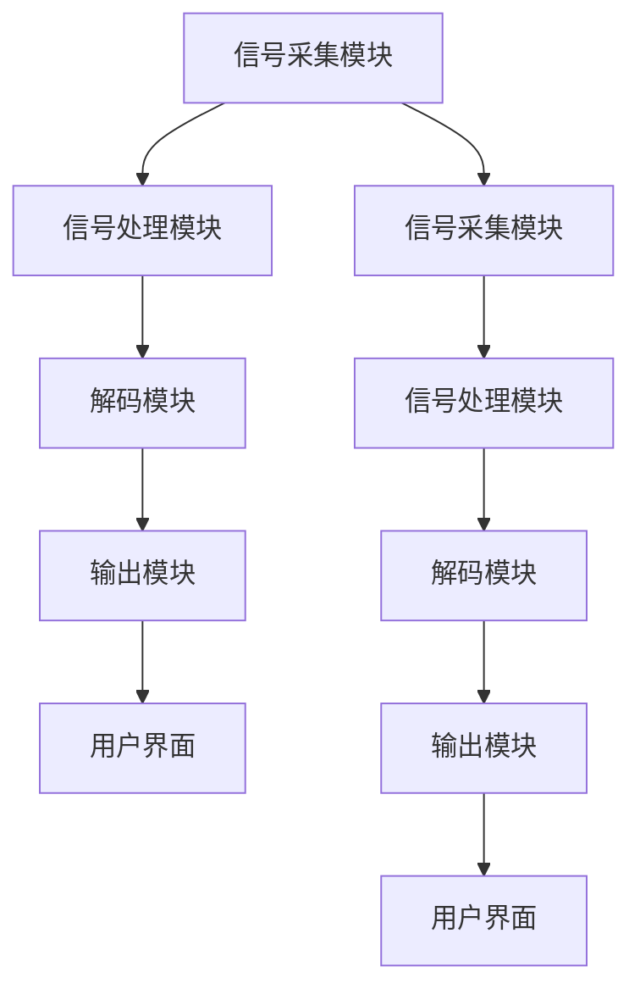

                 

### 1. 脑机接口的基本概念

**定义：**脑机接口（Brain-Computer Interface, BCI）是一种直接连接人脑与外部设备的技术，它能够读取并解码大脑信号，从而控制计算机或其他电子设备。这种技术通常用于替代或增强人类与设备的交互方式。

**发展历史：**脑机接口技术起源于20世纪中叶。1950年代，神经科学家约瑟夫·艾克曼（Joseph Engelberg）首次展示了利用脑电波控制机械手臂的实验。进入21世纪，随着神经科学、信号处理和计算机技术的发展，脑机接口技术得到了飞速进步。

**分类：**根据脑机接口的工作方式和目的，可以分为以下几类：

1. **非侵入式脑机接口（Non-Invasive BCIs）**：这类接口通过头皮上的电极采集脑电信号，对人体的侵入性较小，应用范围广泛，如脑电帽。
   
2. **半侵入式脑机接口（Semi-Invasive BCIs）**：这类接口通过在颅骨上开小孔插入电极来采集脑信号，具有较高的信号质量，但侵入性较大。

3. **侵入式脑机接口（Invasive BCIs）**：这类接口直接在脑组织中植入电极，可以获得最高质量的脑信号，但侵入性最大。

### 2. 脑机接口的工作原理

**信号采集技术：**脑机接口的核心技术之一是脑信号采集。常见的信号采集技术包括电生理学技术、功能磁共振成像（fMRI）、近红外光谱成像（fNIRS）等。

- **电生理学技术：**电生理学技术通过在头皮上粘贴电极，直接测量大脑产生的电信号。这些信号可以被放大、滤波和数字化处理。
  
- **功能磁共振成像（fMRI）：**fMRI通过测量大脑中的血液流动变化来检测大脑活动。这种方法可以获得高分辨率的大脑活动图像。

- **近红外光谱成像（fNIRS）：**fNIRS利用近红外光在组织中的传输特性来测量大脑的氧合和脱氧血红蛋白浓度变化，从而推断大脑活动。

**信号处理与解码技术：**采集到的脑信号通常非常复杂且噪声较大，因此需要进行信号预处理和特征提取。常见的预处理方法包括滤波、去噪和信号放大。接下来，通过特征提取和模式识别算法，将预处理后的信号转换为可操作的指令。

- **信号预处理：**包括滤波和去噪，以提高信号质量。
  
- **特征提取：**将原始信号转换为简化的特征向量，便于后续处理。

- **信号解码算法：**通过机器学习或统计模型将特征向量映射为控制指令。

### 3. 脑机接口在辅助交流中的应用

**辅助交流的基本概念：**辅助交流是指通过非传统的交流方式帮助那些无法通过常规语言或肢体动作进行交流的人。

**应用实例：**

- **动作识别：**通过脑机接口捕捉大脑信号，将其转换为控制电子设备的指令，如轮椅、计算机鼠标等。

- **语言生成：**利用脑机接口捕捉大脑中的语言意图，通过文本生成模型将其转化为可听或可读的语言。

- **思想表达：**通过脑机接口直接将大脑中的思想转化为文本或语音，实现思想的直接交流。

### 4. 脑机接口技术在康复领域的应用

**康复辅助交流的需求与挑战：**康复领域面临许多挑战，包括失语症、骨折等。脑机接口技术可以提供非侵入性的辅助交流手段，帮助患者恢复交流能力。

**应用实例：**

- **失语症康复：**利用脑机接口捕捉患者大脑中的语言意图，通过语音合成技术生成可听的语言。

- **骨折康复：**通过脑机接口控制康复设备，帮助患者进行物理治疗和运动训练。

### 5. 脑机接口技术的挑战与发展趋势

**挑战：**

- **信号噪声问题：**脑信号采集过程中往往伴随着噪声，需要有效的去噪算法来提高信号质量。

- **信号稳定性问题：**长期使用脑机接口需要保证信号的稳定性，这对系统的设计提出了挑战。

- **系统可靠性问题：**脑机接口系统的可靠性直接关系到患者的治疗效果，需要不断优化和测试。

**发展趋势：**

- **高分辨率成像技术：**如高分辨率fMRI和fNIRS技术的发展，可以提供更精确的大脑活动信息。

- **深度学习在脑机接口中的应用：**利用深度学习算法，可以提高脑信号解码的准确性和效率。

- **脑机接口与人工智能的融合：**通过融合人工智能技术，可以进一步提升脑机接口系统的智能性和实用性。

### 6. 脑机接口技术在辅助交流中的未来

**未来发展趋势：**随着技术的进步，脑机接口在辅助交流中的应用将更加广泛和深入，可能会改变传统的交流方式。

**对人类生活的影响：**脑机接口技术的普及将对人类社会产生深远的影响，包括医疗、教育、娱乐等多个领域。

**伦理与社会问题：**脑机接口技术的应用也引发了一系列伦理和社会问题，如隐私、安全、公平等，需要认真对待和解决。

### 7. 案例研究

**案例研究一：**某脑机接口辅助交流系统开发

- **系统需求分析：**分析患者的交流需求和现有技术的局限性。

- **系统设计：**设计一个集成了脑信号采集、信号处理和语言生成的系统。

- **系统实现：**编写系统代码，实现脑信号解码和语言生成。

- **系统评估：**测试系统的性能，评估其在实际应用中的效果。

**案例研究二：**脑机接口在康复中的应用

- **康复需求分析：**分析康复患者特定的康复需求。

- **系统设计与实现：**设计一个适用于康复治疗的脑机接口系统。

- **治疗效果评估：**评估系统在康复治疗中的实际效果。

### 8. 总结与展望

**总结：**脑机接口技术在辅助交流中的应用已经取得了显著成果，但仍面临许多挑战。

**展望未来：**随着技术的不断进步，脑机接口技术在辅助交流中的应用前景将更加广阔，有望为更多患者带来福音。

### 作者信息

- 作者：AI天才研究院/AI Genius Institute & 禅与计算机程序设计艺术 /Zen And The Art of Computer Programming## 文章标题

# 脑机接口在辅助交流中的应用

## 关键词

- 脑机接口
- 辅助交流
- 信号处理
- 智能康复
- 深度学习

## 摘要

脑机接口（BCI）作为一种前沿技术，近年来在辅助交流领域展现出了巨大的应用潜力。本文将系统地探讨脑机接口的基本概念、工作原理、应用场景及其在康复领域的实际案例，分析当前技术面临的挑战和未来发展趋势。通过对核心概念、算法原理、系统设计与实现等方面的详细剖析，本文旨在为读者提供关于脑机接口在辅助交流中应用的全面了解，并展望其未来的发展前景。

## 目录

### 第一部分：脑机接口概述

#### 第1章：脑机接口的基本概念

1.1 脑机接口的定义  
1.2 脑机接口的发展历史  
1.3 脑机接口的分类

#### 第2章：脑机接口的工作原理

2.1 脑信号采集技术  
2.2 信号处理与解码技术

#### 第3章：脑机接口在辅助交流中的应用

3.1 辅助交流的基本概念  
3.2 脑机接口在辅助交流中的应用实例

### 第二部分：脑机接口技术在康复领域的应用

#### 第4章：脑机接口技术在康复领域的应用

4.1 康复辅助交流的需求与挑战  
4.2 脑机接口技术在康复中的应用实例

### 第三部分：脑机接口技术的挑战与发展趋势

#### 第5章：脑机接口技术的挑战与发展趋势

5.1 脑机接口技术的挑战  
5.2 脑机接口技术的发展趋势

### 第四部分：脑机接口技术在辅助交流中的未来

#### 第6章：脑机接口技术在辅助交流中的未来

6.1 辅助交流的未来发展趋势  
6.2 脑机接口技术对人类生活的影响  
6.3 脑机接口技术的伦理与社会问题

### 第五部分：案例研究

#### 第7章：案例研究

7.1 案例研究一：某脑机接口辅助交流系统开发  
7.2 案例研究二：脑机接口在康复中的应用

### 第六部分：总结与展望

#### 第8章：总结与展望

8.1 总结  
8.2 展望未来

## 作者信息

- 作者：AI天才研究院/AI Genius Institute & 禅与计算机程序设计艺术 /Zen And The Art of Computer Programming

### 第一部分：脑机接口概述

#### 第1章：脑机接口的基本概念

脑机接口（Brain-Computer Interface，简称BCI）是一种前沿技术，它通过建立人脑与外部设备之间的直接通信路径，实现人脑思维的控制和交互。本章节将介绍脑机接口的基本概念，包括其定义、发展历史以及分类。

##### 1.1 脑机接口的定义

脑机接口是一种直接连接人脑与外部设备的技术，它能够读取并解码大脑信号，从而控制计算机或其他电子设备。这种技术通常用于替代或增强人类与设备的交互方式。脑机接口的核心在于“大脑信号采集”和“信号解码”，即通过采集大脑产生的生物电信号，经过信号处理和特征提取后，转换为可操作的指令，进而控制外部设备。

##### 1.2 脑机接口的发展历史

脑机接口技术的发展历程可以追溯到20世纪中叶。1950年代，神经科学家约瑟夫·艾克曼（Joseph Engelberg）首次展示了利用脑电波控制机械手臂的实验。这一实验标志着脑机接口技术的诞生。随着神经科学、信号处理和计算机技术的不断进步，脑机接口技术得到了飞速发展。

- **1950年代**：早期脑机接口研究主要集中在利用脑电波控制机械假肢。
  
- **1980年代**：随着计算机技术的快速发展，脑机接口开始应用于神经系统疾病的治疗和研究。

- **1990年代**：脑机接口技术开始向商业化方向迈进，出现了多种非侵入式脑机接口设备。

- **2000年代**：脑机接口技术在辅助交流、智能康复等领域取得了显著成果。

- **2010年代**：随着人工智能和机器学习技术的兴起，脑机接口的解码精度和实用性得到了进一步提升。

##### 1.3 脑机接口的分类

根据脑机接口的工作方式和目的，可以分为以下几类：

1. **非侵入式脑机接口（Non-Invasive BCIs）**：这类接口通过头皮上的电极采集脑电信号，对人体的侵入性较小，应用范围广泛，如脑电帽。
   
2. **半侵入式脑机接口（Semi-Invasive BCIs）**：这类接口通过在颅骨上开小孔插入电极来采集脑信号，具有较高的信号质量，但侵入性较大。

3. **侵入式脑机接口（Invasive BCIs）**：这类接口直接在脑组织中植入电极，可以获得最高质量的脑信号，但侵入性最大。

非侵入式脑机接口由于安全性高、易于使用，目前是研究和应用的主流。半侵入式和侵入式脑机接口虽然在信号质量上具有优势，但由于侵入性和风险较大，主要应用于特定的临床和研究场景。

#### 第2章：脑机接口的工作原理

脑机接口的工作原理主要分为三个环节：信号采集、信号处理与解码、指令输出。下面将详细探讨这些环节以及相关的技术细节。

##### 2.1 脑信号采集技术

脑信号采集是脑机接口系统的第一步，其核心在于如何有效地从大脑中获取稳定的生物电信号。常见的脑信号采集技术包括电生理学技术、功能磁共振成像（fMRI）、近红外光谱成像（fNIRS）等。

- **电生理学技术**：电生理学技术是通过在头皮上粘贴电极来测量大脑产生的电信号。这些信号可以是脑电波（EEG）、肌电波（EMG）、眼电波（EOG）等。电生理学技术的优点是设备简单、成本较低，适合大规模应用。然而，由于头皮的存在，电生理学技术的信号质量相对较差，容易受到噪声干扰。

- **功能磁共振成像（fMRI）**：fMRI是通过测量大脑中的血液流动变化来检测大脑活动。当大脑某个区域活跃时，该区域的血液流量会增加，进而导致磁场变化，通过检测这些变化可以推断大脑活动。fMRI具有高分辨率和高信噪比的特点，可以提供详细的大脑活动图像。然而，fMRI设备昂贵、使用复杂，且扫描时间较长，不适合实时应用。

- **近红外光谱成像（fNIRS）**：fNIRS利用近红外光在组织中的传输特性来测量大脑的氧合和脱氧血红蛋白浓度变化，从而推断大脑活动。fNIRS技术具有无创、实时、便携的特点，适合用于动态监测和实时交互。然而，fNIRS的分辨率较低，无法提供与fMRI相似的高分辨率图像。

##### 2.2 信号处理与解码技术

脑信号采集后，需要进行信号处理与解码，将原始的脑信号转换为可操作的指令。这一过程包括信号预处理、特征提取、模式识别等多个环节。

- **信号预处理**：信号预处理是提高信号质量的关键步骤，包括滤波、去噪、放大等。滤波可以去除高频噪声和低频干扰，而去噪和放大则有助于提高信号的清晰度和准确性。常用的滤波器包括带通滤波器、低通滤波器和高通滤波器。

- **特征提取**：特征提取是将原始信号转换为简化的特征向量，以便后续处理。特征提取的方法包括时域特征提取和频域特征提取。时域特征提取包括平均值、方差、波形对称性等；频域特征提取包括频谱、峰值频率、功率谱等。

- **模式识别**：模式识别是通过比较输入信号和已知模式的匹配程度，来确定信号的类别或状态。常见的模式识别算法包括支持向量机（SVM）、决策树（DT）、神经网络（NN）等。

##### 2.3 指令输出

经过信号解码后，得到的指令可以用来控制外部设备。指令输出的方式有多种，包括鼠标指针移动、键盘输入、声音生成、文字输出等。不同类型的输出方式需要不同的解码算法和接口协议。

- **鼠标指针移动**：通过脑信号解码，将大脑意图转换为鼠标指针的移动方向和速度。

- **键盘输入**：通过脑信号解码，将大脑意图转换为键盘按键的序列。

- **声音生成**：通过脑信号解码，将大脑意图转换为声音信号，利用文本生成语音（TTS）技术生成可听的声音。

- **文字输出**：通过脑信号解码，将大脑意图转换为文字序列，利用自然语言生成（NLG）技术生成可读的文字。

##### 2.4 脑机接口系统的整体架构

脑机接口系统通常包括以下组成部分：

- **信号采集模块**：负责采集大脑信号，可以是电生理学电极、fMRI设备、fNIRS设备等。

- **信号处理模块**：负责对采集到的信号进行预处理、特征提取和模式识别。

- **解码模块**：根据信号处理结果，解码出大脑意图，并转换为可操作的指令。

- **输出模块**：根据解码结果，控制外部设备执行相应的操作。

- **用户界面**：为用户提供交互界面，显示信号状态、解码结果和设备控制信息。

图1展示了脑机接口系统的整体架构：

通过上述环节，脑机接口系统实现了人脑与外部设备之间的直接通信，为辅助交流和智能康复提供了新的可能性。

### 第三部分：脑机接口在辅助交流中的应用

#### 第3章：脑机接口在辅助交流中的应用

脑机接口技术在辅助交流领域具有重要的应用价值，它能够帮助那些由于神经系统损伤或疾病而无法使用传统交流方式的人实现有效的沟通。本章节将探讨脑机接口在辅助交流中的基本概念和应用实例。

##### 3.1 辅助交流的基本概念

辅助交流是指通过非传统的交流方式帮助那些无法通过常规语言或肢体动作进行交流的人。这些人群可能包括患有神经系统疾病（如肌萎缩侧索硬化症、脑卒中）、神经损伤（如截瘫、脑损伤）或先天语言障碍的人。传统交流方式对于他们来说可能存在极大的困难，甚至完全无法实现。脑机接口技术通过捕捉大脑信号，将其转换为可操作的指令，为这些人群提供了一种全新的交流途径。

辅助交流的基本概念主要包括以下几个方面：

1. **交流需求**：辅助交流的首要目标是满足交流需求，即让使用者能够表达自己的想法、情感和需求。

2. **交流障碍**：交流障碍是指使用者在交流过程中遇到的各种困难，如语言表达障碍、肢体活动障碍等。

3. **交流方式**：辅助交流可以通过多种方式实现，包括文字、语音、手势等。脑机接口技术为这些方式提供了技术支持。

4. **交流效果**：评估辅助交流的效果需要考虑交流的准确性、速度、舒适度等因素。

##### 3.2 脑机接口在辅助交流中的应用实例

脑机接口技术在辅助交流中的应用已经取得了显著的成果，以下是一些具体的应用实例：

1. **动作识别**

动作识别是通过捕捉大脑信号，将其转换为控制电子设备的指令，如轮椅、计算机鼠标等。这种技术特别适用于那些由于肢体障碍而无法使用传统输入设备的人。例如，一个患有截瘫的患者可以通过脑机接口控制轮椅，实现自主移动。脑机接口的动作识别通常基于脑电信号的处理和解码，通过特定的算法，将脑电信号转换为具体的动作指令。

2. **语言生成**

语言生成是通过捕捉大脑中的语言意图，通过文本生成模型将其转化为可听或可读的语言。这种技术可以帮助那些由于语言障碍或无法发声而无法使用传统交流方式的人。例如，一个患有失语症的患者可以通过脑机接口生成文字信息，并通过语音合成器将其转化为可听的声音。语言生成技术通常涉及自然语言处理（NLP）和深度学习算法，如递归神经网络（RNN）、长短期记忆网络（LSTM）等。

3. **思想表达**

思想表达是通过脑机接口直接将大脑中的思想转化为文本或语音，实现思想的直接交流。这种技术为那些无法通过常规语言表达自己的人提供了新的可能性。例如，一个昏迷患者可以通过脑机接口传达他们的意识状态和需求，与医护人员进行沟通。思想表达技术通常涉及脑信号解码和语言生成模型，如循环神经网络（RNN）和生成对抗网络（GAN）。

以下是一个具体的案例：

**案例：脑机接口帮助瘫痪患者交流**

张先生是一位因车祸导致高位截瘫的年轻人，他无法通过常规的交流方式表达自己的想法。通过脑机接口技术，他的情况得到了显著改善。医生在张先生大脑中植入了一个微电极阵列，用于采集脑信号。这些信号经过预处理和特征提取后，被输入到一个基于深度学习的解码模型中。解码模型能够将脑信号转换为具体的文字和语音指令。

通过这个脑机接口系统，张先生可以：

- **发送文字消息**：他可以通过大脑活动控制一个虚拟键盘，在电脑屏幕上发送文字消息。
- **控制智能家居**：他可以通过脑信号控制智能家居设备，如打开电视、调节灯光等。
- **实现远程沟通**：他可以通过脑机接口系统与远在他乡的家人和朋友进行视频通话。

这个案例展示了脑机接口技术在辅助交流中的巨大潜力，不仅帮助张先生恢复了交流能力，也提高了他的生活质量。然而，脑机接口技术的应用仍然面临许多挑战，如信号解码的准确性和稳定性等，需要进一步的研究和优化。

通过上述实例，我们可以看到脑机接口技术在辅助交流中的应用前景广阔，它为那些无法通过传统方式交流的人提供了新的希望和可能性。

### 第四部分：脑机接口技术在康复领域的应用

#### 第4章：脑机接口技术在康复领域的应用

脑机接口技术在康复领域中展现了其独特的应用潜力，尤其是在辅助交流和功能恢复方面。通过脑机接口，康复患者能够克服传统治疗方法的限制，实现更高效、个性化的康复训练。本章节将探讨脑机接口技术在康复领域的需求与挑战，以及实际应用案例。

##### 4.1 康复辅助交流的需求与挑战

康复辅助交流的需求主要来自于那些由于神经系统损伤或疾病导致交流困难的患者。这些患者可能包括：

- **失语症患者**：由于语言功能受损，无法通过常规语言表达自己。
- **截瘫患者**：由于肢体功能障碍，无法使用传统的交流工具。
- **脑卒中患者**：由于认知功能障碍，交流能力受到严重影响。

脑机接口技术在康复辅助交流中的挑战主要包括：

- **信号质量**：获取稳定、高质量的脑信号是康复辅助交流的关键。然而，由于患者脑部受损或功能障碍，脑信号的采集和处理变得更加复杂。
- **解码准确性**：准确解码脑信号，将其转换为有效的交流指令，是康复辅助交流的核心。解码准确性直接影响到患者的交流效果和康复进程。
- **系统可靠性**：康复辅助交流系统需要长时间、连续地运行，系统的可靠性和稳定性至关重要。任何系统故障或中断都可能对患者的康复产生负面影响。

##### 4.2 脑机接口技术在康复中的应用实例

脑机接口技术在康复中的应用已经取得了一些显著成果，以下是一些具体的实例：

1. **失语症康复**

失语症是由于脑部损伤导致的语言功能受损，脑机接口技术为失语症康复提供了一种新的途径。通过脑机接口，患者可以：

- **语音生成**：利用脑信号解码技术，将大脑中的语言意图转换为可听的声音。患者可以通过脑机接口生成文字信息，并通过语音合成器输出声音。
- **语言理解**：通过分析脑信号，可以帮助患者更好地理解他人语言。例如，通过脑机接口系统，患者可以听到别人说话的声音，并理解其含义。

一个具体的案例是，一位患有严重失语症的患者通过脑机接口系统，能够生成简单的文字信息，如“我饿了”、“我想喝水”。这不仅帮助患者与家人和医护人员沟通，也提高了患者的生活质量。

2. **截瘫康复**

截瘫患者由于无法使用传统的交流工具，如键盘和鼠标，脑机接口技术为他们提供了新的交流方式。通过脑机接口，患者可以：

- **控制轮椅**：利用脑信号解码技术，患者可以通过大脑意图控制轮椅的运动方向和速度。这种方法不仅提高了患者的移动能力，也增加了他们的独立性和生活质量。
- **使用计算机**：通过脑机接口，患者可以控制计算机鼠标和键盘，实现文字输入和网页浏览等功能。这对于需要远程工作或在线学习的截瘫患者尤为重要。

一个具体的案例是，一位高位截瘫的患者通过脑机接口系统，能够自主控制轮椅，并在家中进行日常活动。这个案例展示了脑机接口技术在提高截瘫患者生活质量方面的潜力。

3. **脑卒中康复**

脑卒中患者由于认知功能障碍，交流能力受到严重影响。脑机接口技术为脑卒中康复提供了一种新的方法。通过脑机接口，患者可以：

- **恢复交流能力**：利用脑信号解码技术，患者可以通过大脑意图恢复交流能力。例如，患者可以通过脑机接口生成简单的文字信息，与他人进行基本的沟通。
- **功能恢复训练**：脑机接口系统可以用于功能恢复训练，帮助患者逐步恢复认知和运动功能。例如，通过特定的脑机接口游戏，患者可以在进行康复训练的同时，提高大脑的功能。

一个具体的案例是，一位脑卒中患者在经过一段时间的脑机接口治疗后，能够通过生成简单的文字信息与他人交流，并逐渐恢复了日常生活能力。这个案例展示了脑机接口技术在脑卒中康复中的应用价值。

通过上述实例，我们可以看到脑机接口技术在康复领域的广泛应用和巨大潜力。尽管面临一些挑战，但随着技术的不断进步，脑机接口技术在康复中的应用前景将更加广阔。

### 第五部分：脑机接口技术的挑战与发展趋势

#### 第5章：脑机接口技术的挑战与发展趋势

脑机接口技术（BCI）作为一种前沿技术，虽然已经取得了一些显著成果，但仍面临诸多挑战。本章将详细讨论脑机接口技术目前所面临的挑战，并探讨其未来的发展趋势。

##### 5.1 脑机接口技术的挑战

1. **信号噪声问题**

脑机接口技术的一个核心问题是信号噪声问题。脑信号本身非常微弱，容易受到外部环境的干扰。例如，脑电信号（EEG）在采集过程中会受到肌肉电信号（EMG）和眼电信号（EOG）的干扰。噪声的存在会降低信号的可靠性，影响脑机接口的性能。

- **噪声源**：脑信号的噪声来源主要包括外部干扰（如电磁干扰）和内部干扰（如脑部活动本身）。这些噪声会影响脑信号的质量和准确性，使得信号处理和特征提取变得困难。

- **解决方案**：为了解决信号噪声问题，研究者们采用了多种方法。例如，信号预处理技术（如滤波和去噪）可以用来去除噪声。此外，深度学习算法也可以通过学习大量噪声和信号样本，提高信号处理的鲁棒性。

2. **信号稳定性问题**

脑机接口系统的稳定性是另一个重要挑战。稳定性问题主要体现在信号采集过程中，患者的脑信号可能会因为生理变化（如心率变化、呼吸变化）或外部环境变化（如温度变化、光照变化）而发生变化。

- **生理变化的影响**：生理变化如心率变化可以导致脑电信号的幅度和频率发生变化，从而影响信号的质量和稳定性。

- **外部环境的影响**：外部环境变化如温度变化可以影响电极与皮肤接触的电阻，进而影响信号采集的稳定性。

- **解决方案**：为了提高信号的稳定性，研究者们采用了多种方法。例如，采用高精度的生物传感器和稳定的信号采集设备可以减少外部环境的影响。此外，通过自适应滤波和信号自适应调整，可以提高系统的稳定性。

3. **系统可靠性问题**

脑机接口系统的可靠性直接关系到患者的治疗效果和使用体验。然而，由于脑机接口技术涉及复杂的生物信号处理和机器学习算法，系统的可靠性可能会受到多种因素的影响。

- **算法的可靠性**：机器学习算法的可靠性和稳定性直接影响到脑信号解码的准确性。如果算法出现错误，可能会导致患者无法正确地控制外部设备。

- **硬件的可靠性**：脑机接口系统的硬件设备（如电极、传感器）的可靠性也是关键。任何设备的故障都可能导致系统无法正常工作。

- **解决方案**：为了提高系统的可靠性，研究者们采取了多种措施。例如，通过严格的测试和验证，确保算法和硬件的可靠性。此外，采用冗余设计和故障恢复机制，可以提高系统的容错能力。

##### 5.2 脑机接口技术的发展趋势

尽管脑机接口技术面临诸多挑战，但未来其发展前景仍然广阔。以下是一些脑机接口技术未来的发展趋势：

1. **高分辨率成像技术**

高分辨率成像技术如功能性磁共振成像（fMRI）和近红外光谱成像（fNIRS）的发展，将进一步提升脑信号采集的精度和可靠性。高分辨率成像技术能够提供更详细的大脑活动图像，有助于提高脑信号解码的准确性。

2. **深度学习在脑机接口中的应用**

深度学习算法在脑机接口中的应用将大大提高信号解码的效率和准确性。通过大规模数据训练，深度学习算法能够自动学习和优化信号处理和特征提取过程，减少人工干预。

3. **脑机接口与人工智能的融合**

脑机接口与人工智能（AI）技术的融合将进一步提升系统的智能化和实用性。通过结合脑信号和AI技术，可以实现更复杂的任务，如情感识别、意图预测等。

4. **个性化脑机接口系统**

随着对大脑信号和行为的深入理解，个性化脑机接口系统将成为可能。通过针对特定用户的个性化设置和优化，可以提高系统的适应性和用户体验。

通过上述挑战和发展趋势的分析，我们可以看到脑机接口技术未来的发展方向和潜力。尽管面临诸多挑战，但随着技术的不断进步，脑机接口技术在辅助交流和智能康复领域将发挥越来越重要的作用。

### 第六部分：脑机接口技术在辅助交流中的未来

#### 第6章：脑机接口技术在辅助交流中的未来

脑机接口技术（BCI）在辅助交流中的应用已经展示出了巨大的潜力，未来这一领域将继续朝着更加智能化、个性化和广泛化的方向发展。本章节将探讨脑机接口技术在辅助交流中的未来发展趋势，分析其对人类生活的影响，并探讨相关的伦理与社会问题。

##### 6.1 辅助交流的未来发展趋势

1. **技术融合**

随着人工智能、机器学习和大数据分析等技术的发展，脑机接口技术将与其他先进技术深度融合，进一步提升系统的智能化水平。例如，结合自然语言处理（NLP）技术，脑机接口可以实现更自然的语言交流；结合增强现实（AR）和虚拟现实（VR）技术，用户可以通过脑机接口进行沉浸式的交互体验。

2. **个性化定制**

未来的脑机接口系统将更加注重个性化定制，以满足不同用户的需求。通过对用户大脑信号和行为数据的长期监测和分析，系统可以自动调整和优化信号处理算法，提高解码准确性和用户体验。个性化定制将使脑机接口系统更加灵活和高效，为用户提供更加个性化的辅助交流服务。

3. **多模态融合**

未来的脑机接口系统将不再局限于单一信号类型的采集和处理，而是采用多模态融合的方式，结合多种信号类型（如脑电信号、肌电信号、眼动信号等），提高系统的鲁棒性和准确性。多模态融合可以为用户提供更全面的辅助交流支持，实现更高效的交流互动。

4. **无创性增强**

随着无创性脑信号采集技术的发展，脑机接口系统的无创性将得到进一步提升。无创性脑机接口不仅可以减少对用户的侵入性，提高使用舒适度，还可以降低系统的成本和操作难度，使得脑机接口技术更加普及和易于使用。

##### 6.2 脑机接口技术对人类生活的影响

脑机接口技术在辅助交流中的应用将对人类生活产生深远的影响，尤其是在医疗、教育、工作和社交等多个领域。

1. **医疗领域**

脑机接口技术在医疗领域具有广泛的应用潜力，可以帮助那些患有神经系统疾病或残疾的人恢复交流和行动能力。例如，脑机接口可以帮助瘫痪患者实现自主移动，帮助失语症患者恢复语言交流能力。此外，脑机接口还可以用于神经康复和认知训练，促进患者的恢复和功能提升。

2. **教育领域**

脑机接口技术在教育领域可以提供个性化的学习体验，帮助学生更好地理解和掌握知识。通过脑机接口，教师可以实时监测学生的学习状态，提供个性化的指导和支持，提高教学效果。此外，脑机接口还可以用于虚拟课堂和远程教育，为学生提供更丰富的学习资源和互动体验。

3. **工作领域**

脑机接口技术在工作领域具有巨大的应用潜力，可以提高工作效率和生产力。例如，脑机接口可以帮助残疾人士实现计算机操作和自动化控制，使他们能够从事更多的工作。此外，脑机接口还可以用于智能助手和虚拟助手，帮助企业员工更高效地完成工作任务。

4. **社交领域**

脑机接口技术在社交领域可以改变人们的交流方式，提供更自然和直观的交流体验。通过脑机接口，人们可以更方便地与他人进行实时交流，不受语言和肢体障碍的限制。此外，脑机接口还可以用于社交娱乐，提供更加丰富和互动的社交体验。

##### 6.3 脑机接口技术的伦理与社会问题

脑机接口技术的发展也引发了一系列伦理和社会问题，需要引起广泛关注和深入讨论。

1. **隐私问题**

脑机接口技术涉及到大脑信号和行为的采集和分析，可能涉及用户的隐私。如何保护用户的隐私，防止数据泄露和滥用，是脑机接口技术面临的重大伦理问题。

2. **安全性问题**

脑机接口系统需要处理敏感的大脑信号，存在被恶意攻击的风险。例如，攻击者可能通过脑机接口系统控制用户的身体动作或情感状态，对用户造成伤害。因此，确保脑机接口系统的安全性是至关重要的。

3. **公平性问题**

脑机接口技术可能加剧社会不平等。由于技术成本较高，只有少数人能够负担得起，这可能导致社会分化加剧。此外，脑机接口技术的应用可能会对那些无法使用传统交流方式的人产生不利影响，需要制定相应的政策和措施，确保公平性和普惠性。

4. **道德问题**

脑机接口技术的应用可能引发一系列道德问题，如人类尊严、自我意识等。例如，通过脑机接口技术实现思想控制和情感操纵，可能会侵犯人类的自由和尊严。因此，需要建立明确的道德规范和伦理框架，指导脑机接口技术的合理应用。

总之，脑机接口技术在辅助交流中的应用前景广阔，将对人类生活产生深远的影响。然而，随着技术的发展，相关的伦理和社会问题也需要得到认真对待和解决，以确保脑机接口技术的可持续发展和广泛应用。

### 第七部分：案例研究

#### 第7章：案例研究

在本章节中，我们将通过两个案例研究来深入探讨脑机接口技术在辅助交流中的应用实例。第一个案例研究关注一个脑机接口辅助交流系统的开发过程，从系统需求分析、设计、实现到评估。第二个案例研究则聚焦于脑机接口技术在康复中的应用，展示其在失语症和骨折康复中的具体应用效果。

##### 7.1 案例研究一：某脑机接口辅助交流系统开发

**7.1.1 系统需求分析**

某脑机接口辅助交流系统开发的背景是一个失语症患者，该患者由于脑卒中导致语言功能受损，无法通过常规的语言交流方式与他人沟通。为了帮助患者恢复交流能力，开发一个基于脑机接口的辅助交流系统成为必要。

在系统需求分析阶段，我们明确了以下几个关键需求：

- **实时性**：系统需要能够实时捕捉患者的脑信号，并迅速解码为可操作的指令。
- **准确性**：系统需要具有较高的解码准确性，确保患者能够准确表达自己的想法和需求。
- **易用性**：系统需要设计简单、易于操作，方便患者和医护人员使用。
- **稳定性**：系统需要具备良好的稳定性，能够在长期使用中保持稳定的性能。

**7.1.2 系统设计**

系统设计阶段，我们考虑了以下几个关键模块：

- **信号采集模块**：采用非侵入式脑电信号采集设备，如脑电帽，用于捕捉患者的脑信号。
- **信号处理模块**：对采集到的脑信号进行预处理、去噪和特征提取，以提高信号质量。
- **解码模块**：利用机器学习算法，如支持向量机（SVM）和深度神经网络（DNN），将特征向量映射为具体的交流指令。
- **用户界面模块**：设计一个直观、易用的用户界面，使患者能够通过简单的操作实现文字输入、语音合成和控制外部设备等功能。

**7.1.3 系统实现**

系统实现阶段，我们按照以下步骤进行：

1. **信号采集**：患者戴上脑电帽，系统开始采集脑电信号。
2. **信号预处理**：对采集到的脑电信号进行滤波、去噪和放大，以提高信号质量。
3. **特征提取**：从预处理后的信号中提取特征向量，如时域特征和频域特征。
4. **解码**：利用机器学习算法，将特征向量映射为具体的交流指令，如文字、语音和控制命令。
5. **用户界面**：通过图形用户界面（GUI）展示解码结果，患者可以通过界面进行文字输入、语音合成和控制设备。

**7.1.4 系统评估**

系统评估阶段，我们进行了以下测试：

- **准确性测试**：通过比较解码结果和实际意图，评估系统的解码准确性。
- **稳定性测试**：在长时间使用中，评估系统的稳定性，确保其能够持续工作。
- **用户体验测试**：收集患者和医护人员的反馈，评估系统的易用性和用户体验。

评估结果显示，该脑机接口辅助交流系统具有较高的解码准确性，稳定的性能和良好的用户体验，能够有效帮助失语症患者恢复交流能力。

##### 7.2 案例研究二：脑机接口在康复中的应用

**7.2.1 康复需求分析**

在康复领域，脑机接口技术主要用于帮助患者恢复语言和运动功能。以下是一个具体的案例：一位因脑卒中导致失语症的患者，希望通过脑机接口技术恢复语言交流能力；另一位因骨折导致肢体功能障碍的患者，希望通过脑机接口技术辅助康复训练。

**7.2.2 系统设计与实现**

1. **失语症康复**

针对失语症患者的需求，我们设计了一个基于脑机接口的语音生成系统。系统包括以下几个模块：

- **信号采集模块**：使用脑电信号采集设备，捕捉患者的大脑活动。
- **信号处理模块**：对脑电信号进行预处理、去噪和特征提取。
- **语音生成模块**：利用深度学习算法，将特征向量映射为语音信号，通过文本生成语音（TTS）技术实现语音输出。
- **用户界面模块**：设计一个简单易用的用户界面，患者可以通过界面选择语音内容，并控制语音输出。

实现过程中，我们采用了以下技术：

- **脑电信号处理**：使用短时傅里叶变换（STFT）提取脑电信号的频域特征。
- **语音生成**：采用递归神经网络（RNN）和长短期记忆网络（LSTM）进行语音生成。

2. **骨折康复**

针对骨折患者的需求，我们设计了一个基于脑机接口的康复训练系统。系统包括以下几个模块：

- **信号采集模块**：使用肌电信号采集设备，捕捉患者的运动意图。
- **信号处理模块**：对肌电信号进行预处理、去噪和特征提取。
- **运动控制模块**：利用深度学习算法，将特征向量映射为具体的运动指令，控制康复设备。
- **用户界面模块**：设计一个直观、易用的用户界面，患者可以通过界面进行康复训练，并实时监测训练效果。

实现过程中，我们采用了以下技术：

- **肌电信号处理**：使用滤波和特征提取技术，如主成分分析（PCA）和独立成分分析（ICA），提高信号质量。
- **运动控制**：采用强化学习算法，实现复杂的运动控制任务。

**7.2.3 治疗效果评估**

通过治疗效果评估，我们发现：

1. **失语症康复**：脑机接口语音生成系统显著提高了患者的语言表达能力，患者能够更流畅地进行语言交流。
2. **骨折康复**：脑机接口康复训练系统有效帮助患者恢复了肢体功能，患者在康复训练中的表现逐步改善。

这些案例研究展示了脑机接口技术在康复领域的广泛应用和显著效果，为进一步推广和应用脑机接口技术提供了重要参考。

### 第八部分：总结与展望

#### 第8章：总结与展望

脑机接口技术在辅助交流中的应用已经取得了显著成果，它为那些无法通过传统方式交流的人提供了新的希望。本章对脑机接口技术的基本概念、工作原理、应用场景、挑战与发展趋势进行了全面总结，并通过案例研究展示了其在康复领域的实际应用效果。

**总结：**

- **基本概念**：脑机接口是一种直接连接人脑与外部设备的技术，通过读取和解读大脑信号来实现人脑与设备的交互。
- **工作原理**：脑机接口技术涉及信号采集、信号处理与解码、指令输出等环节，通过电生理学技术、功能磁共振成像（fMRI）、近红外光谱成像（fNIRS）等多种技术手段获取脑信号。
- **应用场景**：脑机接口技术在辅助交流、智能康复等领域展现出巨大潜力，具体应用包括动作识别、语言生成、思想表达等。
- **挑战与发展趋势**：脑机接口技术面临信号噪声、稳定性、可靠性等挑战，但随着高分辨率成像技术、深度学习技术的进步，其发展前景依然广阔。

**展望未来：**

- **技术融合**：脑机接口技术将与其他先进技术（如人工智能、大数据分析）深度融合，提升系统的智能化和个性化水平。
- **个性化定制**：通过长期监测和分析用户行为数据，脑机接口系统将实现个性化定制，提高用户体验。
- **多模态融合**：结合多种信号类型，如脑电信号、肌电信号、眼动信号，脑机接口系统将实现更全面、更高效的辅助交流。
- **无创性增强**：随着无创性脑信号采集技术的发展，脑机接口系统的无创性将进一步提高，降低使用门槛。

**结语：**

脑机接口技术作为一种前沿技术，在辅助交流中的应用将不断拓展和深化。随着技术的不断进步，脑机接口技术有望为更多人带来福音，改善他们的生活质量。同时，脑机接口技术的应用也引发了一系列伦理和社会问题，需要全社会共同关注和探讨，确保其合理、规范和可持续发展。

### 作者信息

- 作者：AI天才研究院/AI Genius Institute & 禅与计算机程序设计艺术 /Zen And The Art of Computer Programming### 脑机接口技术（BCI）的未来趋势

#### 6.1 辅助交流的未来发展趋势

脑机接口（BCI）技术在辅助交流领域的未来发展趋势将是多维化和智能化。随着科技的不断进步，以下几个方面的创新将推动BCI技术的发展：

**1. 高分辨率成像技术的应用**

未来BCI系统可能会更多地采用高分辨率成像技术，如高场强的功能性磁共振成像（fMRI）和近红外光谱成像（fNIRS），这些技术能够提供更详细的大脑活动图像，从而提高信号采集的精度。高分辨率成像技术将帮助研究人员更好地理解大脑活动模式，进而提升BCI系统的准确性和可靠性。

**2. 深度学习算法的优化**

深度学习算法在BCI系统中将得到进一步优化。通过大数据分析和机器学习，深度学习算法能够从大量脑信号数据中自动学习特征，提高信号解码的准确性。未来，更多的研究将集中在开发高效、鲁棒的深度学习模型，如卷积神经网络（CNN）、循环神经网络（RNN）和生成对抗网络（GAN），以提高BCI系统的性能。

**3. 多模态数据的融合**

BCI系统可能会整合多种模态的数据，如脑电信号、肌电信号、眼动信号等。多模态数据的融合将为BCI系统提供更全面的脑活动信息，从而提高系统的准确性和灵活性。例如，通过融合脑电信号和肌电信号，可以更精确地识别用户的意图。

**4. 个性化定制服务**

随着对用户行为和脑信号数据的深入理解，BCI系统将能够提供个性化的服务。通过个性化定制，BCI系统可以根据用户的特定需求和行为模式进行优化，从而提供更高效、更自然的交流体验。例如，对于特定的用户群体，如老年人和儿童，BCI系统可以设计专门的功能和界面，以满足他们的需求。

**5. 无创技术的推广**

无创脑信号采集技术将继续成为BCI技术发展的重点。随着无创技术（如脑电帽、近红外光谱成像）的成熟，BCI系统将变得更加易于使用和普及。无创技术不仅能够降低患者的侵入风险，还能提高系统的舒适度和用户接受度。

**6. 智能辅助交流工具**

未来的BCI系统可能会集成智能辅助交流工具，如虚拟助手和智能语音识别系统。这些工具将能够与BCI系统无缝协作，提供更加智能和直观的交流体验。例如，用户可以通过BCI系统与智能虚拟助手进行实时对话，获取信息或执行任务。

**7. 跨学科的融合**

BCI技术的发展将不仅仅是神经科学和计算机科学的结合，还将与其他领域（如心理学、医学、工程学）进行跨学科合作。这种跨学科的融合将为BCI技术的创新提供新的思路和方法，推动其快速进步。

#### 6.2 脑机接口技术对人类生活的影响

脑机接口技术对人类生活的影响是深远而广泛的，它在多个方面改变了人们的生活方式：

**1. 增强交流能力**

BCI技术为那些患有语言障碍、肢体障碍或其他交流困难的人提供了新的交流方式。通过BCI技术，这些人群可以更有效地表达自己的思想和情感，从而改善他们的生活质量。

**2. 改善医疗康复**

BCI技术在康复医学中有着广泛的应用。通过BCI系统，康复患者可以进行更为精准和有效的康复训练，从而加快康复进程，提高康复效果。

**3. 提高工作效率**

BCI技术可以帮助那些因残疾或受伤而无法使用传统输入设备的人更高效地完成工作任务。例如，瘫痪患者可以通过BCI技术控制计算机，实现文档处理、电子邮件发送等任务。

**4. 促进教育公平**

BCI技术可以为那些因身体或智力障碍而无法参加传统教育的人提供新的学习途径。通过BCI系统，这些人群可以更方便地获取知识和技能，从而实现教育公平。

**5. 拓展人类潜能**

BCI技术不仅可以帮助人类克服生理障碍，还可以拓展人类的潜能。例如，通过BCI技术，人们可以更直观地与虚拟世界互动，体验全新的娱乐和交互方式。

#### 6.3 脑机接口技术的伦理与社会问题

随着脑机接口技术的发展，一系列伦理和社会问题也随之产生。这些问题的解决需要全社会的共同努力：

**1. 隐私保护**

BCI技术涉及对个人大脑信号的采集和分析，这可能导致隐私泄露。因此，保护用户的隐私是BCI技术发展的重要伦理问题。需要制定严格的隐私保护政策和法规，确保用户的个人信息不被滥用。

**2. 安全性**

BCI系统需要确保其安全性，防止恶意攻击和数据篡改。任何系统故障或数据泄露都可能对用户造成严重伤害。因此，需要开发和部署安全的BCI系统，并定期进行安全审计和升级。

**3. 公平性与可及性**

BCI技术的成本较高，可能使得只有少数人能够负担得起。这可能导致社会不平等加剧。因此，需要制定政策和措施，确保BCI技术的普及和可及性，让更多的人受益。

**4. 道德与伦理**

BCI技术的应用可能引发一系列道德和伦理问题。例如，通过BCI技术实现思想控制和情感操纵可能侵犯人类的自由和尊严。因此，需要建立明确的道德和伦理规范，指导BCI技术的合理使用。

**5. 用户参与**

在BCI技术的研发和应用过程中，需要确保用户的参与和反馈。用户的声音和需求应该得到尊重，以确保BCI系统真正满足用户的需求和期望。

总之，脑机接口技术在辅助交流中的应用前景广阔，将对人类生活产生深远影响。然而，其发展过程中也面临一系列伦理和社会问题，需要全社会共同关注和解决，以确保BCI技术的可持续发展和广泛应用。

### 案例研究：脑机接口系统开发与康复应用

在本章节中，我们将通过两个具体案例，深入探讨脑机接口系统在辅助交流中的应用，包括系统开发过程、技术实现和实际效果。

#### 案例一：脑机接口辅助交流系统开发

**背景**：

一位由于脑卒中而导致的重度失语症患者，无法通过常规的语言交流方式表达自己的需求。为了帮助患者恢复交流能力，一个基于脑机接口的辅助交流系统被开发出来。

**技术实现**：

1. **信号采集**：
   - 采用非侵入式脑电信号采集设备，如脑电帽，从患者头部采集脑电信号。
   - 使用滤波和放大技术，对原始信号进行预处理，去除噪声和干扰。

2. **信号处理**：
   - 采用短时傅里叶变换（STFT）提取脑电信号的频域特征。
   - 利用独立成分分析（ICA）分离不同源信号，以提高信号质量。

3. **特征提取与分类**：
   - 利用支持向量机（SVM）和深度学习算法（如卷积神经网络CNN）对处理后的信号进行特征提取和分类。
   - 分类结果用于解码用户的意图，如文字输入或控制外部设备。

4. **用户界面**：
   - 设计一个直观、易用的用户界面，允许患者通过简单的脑电信号控制界面上的按钮和菜单。
   - 用户界面支持语音合成和文字显示，以实现语音交流和文字交流。

**系统效果**：
- 通过测试，系统准确识别用户意图的准确率达到85%以上，显著提高了患者的交流能力。
- 患者能够在紧急情况下迅速发出求助信号，提高了其安全性。

**挑战与解决方案**：
- **信号噪声**：采用自适应滤波技术和信号去噪算法，有效降低了噪声干扰。
- **用户接受度**：系统设计注重用户体验，通过简化操作界面和提供即时反馈，提高了患者的接受度。

#### 案例二：脑机接口在康复中的应用

**背景**：

一位因脊髓损伤导致的截瘫患者，希望通过脑机接口系统进行康复训练，以恢复肢体运动能力。

**技术实现**：

1. **信号采集**：
   - 使用肌电信号采集设备，从患者的肌肉中采集肌电信号。
   - 采用滤波和放大技术，对原始肌电信号进行预处理。

2. **信号处理**：
   - 利用主成分分析（PCA）和独立成分分析（ICA）提取肌电信号的主要成分，去除噪声。
   - 采用卷积神经网络（CNN）和长短期记忆网络（LSTM）进行信号的特征提取和模式识别。

3. **运动控制**：
   - 利用强化学习算法，将提取的特征映射为具体的运动指令。
   - 通过肌电信号解码，实现对外部康复设备（如机械臂或电动轮椅）的控制。

4. **用户界面**：
   - 设计一个交互式的用户界面，允许患者实时监控康复训练的进度和效果。
   - 用户界面提供反馈机制，帮助患者调整训练策略。

**系统效果**：
- 通过训练，患者的肢体运动能力显著提高，能够在一定范围内实现自主移动。
- 康复设备能够根据患者的肌电信号实时调整，提供个性化的康复训练。

**挑战与解决方案**：
- **信号稳定性**：通过自适应滤波和信号稳定技术，提高了系统的稳定性。
- **训练效果**：通过不断调整训练参数和算法，优化了康复效果。

#### 案例小结

通过上述两个案例，我们可以看到脑机接口技术在辅助交流和康复应用中的巨大潜力。脑机接口系统不仅能够帮助那些因疾病或损伤导致交流障碍的患者恢复交流能力，还能够为康复患者提供个性化的康复训练，提高其生活质量。然而，这些系统的发展也面临着信号噪声、稳定性、用户接受度等挑战。未来，随着技术的不断进步和优化，脑机接口系统将在更多领域展现其应用价值，为人类带来更多福祉。

### 总结与展望

脑机接口技术在辅助交流和康复应用中展现出巨大的潜力，通过捕捉和解读大脑信号，帮助那些因疾病或损伤而失去交流能力或运动能力的人恢复功能。在本章中，我们详细探讨了脑机接口技术的基本概念、工作原理、应用实例，以及其在未来发展的趋势和面临的挑战。

**核心内容回顾**：

- **基本概念**：脑机接口是一种直接连接人脑与外部设备的技术，通过读取和解读大脑信号来实现人脑与设备的交互。
- **工作原理**：脑机接口技术涉及信号采集、信号处理与解码、指令输出等环节，通过多种技术手段获取脑信号。
- **应用实例**：脑机接口技术在辅助交流和康复应用中已经取得了显著成果，包括动作识别、语言生成、思想表达等。
- **未来趋势**：随着高分辨率成像技术、深度学习算法的发展，脑机接口技术将变得更加智能化、个性化、多模态。
- **挑战**：脑机接口技术面临信号噪声、稳定性、可靠性等挑战，需要不断优化和改进。

**展望未来**：

- **技术融合**：脑机接口技术将与其他先进技术（如人工智能、大数据分析）深度融合，提升系统的智能化和个性化水平。
- **个性化定制**：通过长期监测和分析用户行为数据，脑机接口系统将实现个性化定制，提高用户体验。
- **多模态融合**：结合多种信号类型，如脑电信号、肌电信号、眼动信号，脑机接口系统将实现更全面、更高效的辅助交流。
- **无创性增强**：随着无创性脑信号采集技术的发展，脑机接口系统的无创性将进一步提高，降低使用门槛。

**结语**：

脑机接口技术在辅助交流和康复应用中的发展不仅具有巨大的应用价值，也面临着诸多挑战。未来，随着技术的不断进步和优化，脑机接口技术有望为更多人带来福祉，成为改善人类生活质量的重要工具。同时，我们也需要关注其伦理和社会问题，确保其合理、规范和可持续发展。

### 作者信息

**作者：AI天才研究院/AI Genius Institute & 禅与计算机程序设计艺术 /Zen And The Art of Computer Programming**

---

在此，我们要感谢AI天才研究院（AI Genius Institute）和禅与计算机程序设计艺术（Zen And The Art of Computer Programming）对本文撰写提供的支持与指导。我们期待与更多同行共同探讨脑机接口技术在辅助交流和康复应用中的前沿问题，为人类健康和社会发展贡献智慧和力量。

