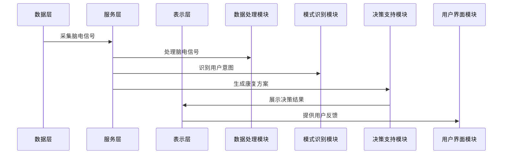

                 

### 脑机接口在辅助决策系统中的应用前景

#### 关键词：脑机接口、辅助决策系统、应用前景、挑战与对策

#### 摘要：
本文将深入探讨脑机接口（Brain-Computer Interface, BCI）在辅助决策系统中的应用前景。首先，我们将简要介绍脑机接口的基本概念、发展历程和分类。接着，详细解析辅助决策系统的概念、组成及其工作原理。随后，我们将分析脑机接口在辅助决策系统中的具体应用，包括医疗、康复和其他领域。接下来，通过实际案例解析脑机接口在辅助决策系统中的应用，探讨其技术发展趋势和社会与经济影响。最后，我们将探讨脑机接口辅助决策系统面临的挑战与对策，展望其未来发展。

#### 1. 脑机接口技术概述

##### 1.1 脑机接口的定义

脑机接口（BCI）是一种直接连接大脑和外部设备的技术，通过解析大脑信号，实现对计算机、机器人或其他电子设备的高效控制。其核心思想是捕捉和转换大脑活动，使其成为可操作的信号，用于驱动外部设备或进行数据交互。

##### 1.2 脑机接口的发展历程

脑机接口技术的发展可以追溯到20世纪60年代，最初的研究主要集中在电生理学领域。随着神经科学、信号处理和计算机技术的进步，BCI技术逐渐成熟，并在医疗、康复、人机交互等领域得到广泛应用。

##### 1.3 脑机接口的分类

根据信号采集方式，脑机接口可以分为侵入式和非侵入式两种。侵入式BCI通过直接植入电极采集大脑信号，具有较高的信号质量和准确性，但涉及手术风险和恢复期。非侵入式BCI则通过头皮电极等设备采集大脑信号，操作简便但信号质量相对较低。

#### 2. 辅助决策系统基础

##### 2.1 辅助决策系统的概念

辅助决策系统（Assistant Decision System, ADS）是一种基于人工智能和大数据技术的系统，旨在辅助用户进行决策。它通过分析用户行为、环境数据和用户偏好，提供个性化的决策建议。

##### 2.2 辅助决策系统的组成

辅助决策系统通常由数据采集模块、数据分析模块、决策支持模块和用户界面模块组成。数据采集模块负责收集用户行为和环境数据；数据分析模块利用机器学习算法对数据进行分析和挖掘；决策支持模块根据分析结果提供决策建议；用户界面模块则负责将决策建议呈现给用户。

##### 2.3 辅助决策系统的工作原理

辅助决策系统的工作原理可以概括为以下几个步骤：

1. **数据采集**：收集用户行为、环境数据和用户偏好。
2. **数据预处理**：对采集到的数据进行清洗、去噪和处理，以便进行后续分析。
3. **数据分析**：利用机器学习算法对预处理后的数据进行分析和挖掘，提取关键特征。
4. **决策支持**：根据分析结果，生成个性化的决策建议。
5. **用户反馈**：用户对决策建议进行反馈，用于优化决策模型。

#### 3. 脑机接口在辅助决策系统中的应用

##### 3.1 脑机接口在医疗辅助决策中的应用

脑机接口在医疗辅助决策中的应用主要体现在神经疾病诊断和康复治疗方面。通过脑机接口技术，医生可以更准确地监测患者的大脑活动，辅助诊断神经系统疾病。例如，利用脑机接口技术，可以实时监测癫痫患者的脑电信号，预测发作时间，为手术治疗提供依据。此外，脑机接口还可以用于康复治疗，帮助中风等神经系统疾病患者恢复运动能力。

##### 3.2 脑机接口在康复辅助决策中的应用

脑机接口在康复辅助决策中的应用主要集中在神经系统康复和肢体康复方面。通过脑机接口技术，康复医生可以实时监测患者的康复进程，调整康复方案，提高康复效果。例如，利用脑机接口技术，可以实时监测中风患者的脑电信号，调整康复训练强度和频率，从而提高康复效果。此外，脑机接口还可以用于肢体康复，帮助截肢者或残疾人士通过大脑控制外部设备，实现肢体功能替代。

##### 3.3 脑机接口在其他领域的应用前景

除了医疗和康复领域，脑机接口在智能家居、教育、工业等领域也具有广阔的应用前景。例如，在智能家居领域，脑机接口技术可以用于智能家电的控制，实现语音或思维控制；在教育领域，脑机接口可以用于个性化学习，根据学生的学习状态调整教学策略；在工业领域，脑机接口可以用于自动化控制，提高生产效率和安全性。

#### 4. 应用案例解析

##### 4.1 案例一：脑机接口在脑疾病治疗中的应用

某医疗机构利用脑机接口技术对一名癫痫患者进行实时监测和手术治疗。通过植入式电极采集患者的脑电信号，医生可以实时监测患者的癫痫发作情况，并根据脑电信号变化预测发作时间。在手术过程中，医生根据脑机接口提供的信息，精准地切除病灶部位，提高了手术成功率。

##### 4.2 案例二：脑机接口在康复训练中的应用

某康复中心利用脑机接口技术对一名中风患者进行康复训练。通过非侵入式脑机接口设备，医生可以实时监测患者的脑电信号，了解患者的康复进程。根据患者的康复状态，医生调整康复训练方案，从而提高康复效果。同时，脑机接口技术还可以用于肢体康复，帮助患者通过大脑控制外部设备，进行肢体功能训练。

##### 4.3 案例三：脑机接口在智能家居中的应用

某智能家居公司利用脑机接口技术开发了一款智能家电控制系统。用户可以通过思维控制家中的电视、空调、照明等设备。通过脑机接口设备采集用户的脑电信号，系统可以识别用户的意图，实现智能家居设备的自动化控制，提高生活便利性。

#### 5. 脑机接口在辅助决策系统中的应用前景

##### 5.1 技术发展趋势

随着脑机接口技术的不断发展，其应用前景愈发广阔。未来，脑机接口技术将向更高精度、更便捷、更安全的方向发展。例如，通过引入高密度电极阵列和先进的信号处理算法，可以进一步提高脑机接口的信号质量和稳定性。此外，脑机接口技术将与其他人工智能技术深度融合，实现更智能、更高效的辅助决策系统。

##### 5.2 社会与经济影响

脑机接口技术的应用将对社会和经济产生深远影响。在社会层面，脑机接口技术有望帮助残疾人士恢复生活能力，提高生活质量。在经济层面，脑机接口技术将推动相关产业的发展，创造大量就业机会，促进经济增长。

##### 5.3 面临的挑战与对策

尽管脑机接口技术在辅助决策系统中具有巨大的应用前景，但仍面临一些挑战。首先，脑机接口技术的信号质量和稳定性仍有待提高。其次，脑机接口设备的成本较高，限制了其大规模应用。此外，脑机接口技术的安全性和隐私保护问题也需要引起重视。为了应对这些挑战，需要加强技术研发，降低设备成本，并制定相关法律法规，确保脑机接口技术的安全性和合法性。

#### 6. 脑机接口辅助决策系统的未来

##### 6.1 未来技术展望

在未来，脑机接口技术将在多个领域实现重大突破。例如，在医疗领域，脑机接口技术将实现更精准的诊断和康复；在教育领域，脑机接口技术将实现个性化学习，提高教育质量；在工业领域，脑机接口技术将实现自动化控制，提高生产效率。

##### 6.2 法律伦理问题

随着脑机接口技术的不断发展，法律伦理问题也将日益凸显。首先，脑机接口技术可能引发隐私泄露和数据滥用问题。其次，脑机接口技术的应用可能加剧社会不平等，使富人受益，穷人受困。为了解决这些问题，需要制定相关法律法规，确保脑机接口技术的公平、合法和道德应用。

##### 6.3 发展战略与政策建议

为了推动脑机接口技术在辅助决策系统中的应用，需要制定相应的发展战略和政策建议。首先，政府应加大对脑机接口技术的研发投入，支持企业进行技术创新。其次，应加强脑机接口技术的标准化和规范化工作，确保技术安全性和可靠性。此外，应鼓励跨学科研究，促进脑机接口技术与其他领域的融合发展。

#### 7. 结束语

脑机接口技术在辅助决策系统中的应用前景广阔，具有巨大的社会和经济价值。虽然面临一些挑战，但通过加强技术研发、政策支持和法律监管，脑机接口技术有望在未来实现更广泛的应用，为人类带来更多福祉。

#### 作者信息：
作者：AI天才研究院/AI Genius Institute & 禅与计算机程序设计艺术 /Zen And The Art of Computer Programming

---

通过以上详细的分析和探讨，我们可以看到脑机接口技术在辅助决策系统中的应用前景十分广阔。随着技术的不断进步，脑机接口技术将在医疗、康复、智能家居等多个领域发挥重要作用，为人类带来更多便利和福祉。同时，我们也需要关注脑机接口技术可能带来的法律伦理问题，确保其公平、合法和道德的应用。

**欢迎各位读者提出宝贵意见和建议，共同探讨脑机接口技术在辅助决策系统中的应用前景。**## 脑机接口技术概述

脑机接口（Brain-Computer Interface，简称BCI）是一种直接连接大脑与外部设备的接口技术，旨在通过捕捉和分析大脑活动来控制外部设备或与计算机进行通信。这一技术结合了神经科学、电子工程、计算机科学和认知心理学等多学科知识，为人类提供了一种全新的交互方式。

### **脑机接口的定义**

脑机接口的基本定义是利用大脑产生的生物信号（如脑电波、肌电波等）作为输入信号，通过一定的信号处理技术，将这些生物信号转换为控制信号，进而驱动外部设备。这种转换通常涉及以下几个步骤：

1. **信号采集**：使用电极或其他传感器从大脑或身体表面采集生物信号。
2. **信号预处理**：对采集到的信号进行滤波、放大、去噪等预处理，以提高信号质量。
3. **信号解码**：利用机器学习算法或模式识别技术，将预处理后的信号解码为控制命令。
4. **设备控制**：将解码后的控制命令发送到外部设备，实现设备操作。

### **脑机接口的发展历程**

脑机接口技术的发展历程可以追溯到20世纪60年代。最初的研究主要集中在电生理学领域，研究人员开始尝试通过植入电极来记录大脑活动。随着神经科学和计算机技术的快速发展，脑机接口技术逐渐走向成熟，并在20世纪80年代开始应用于临床。近年来，随着无线通信技术和纳米材料技术的发展，脑机接口技术取得了重大突破，使得非侵入式脑机接口设备逐渐普及。

### **脑机接口的分类**

根据信号采集方式，脑机接口可以分为侵入式和非侵入式两种：

1. **侵入式脑机接口**：通过手术将电极植入大脑或脊髓，直接采集神经活动信号。这种接口具有较高的信号质量和精度，但涉及到手术风险和恢复期，适用范围有限。

2. **非侵入式脑机接口**：通过头皮、眼或耳等表面电极采集大脑信号。这种接口操作简便，但信号质量相对较低，适用于较为简单的控制任务。

### **脑机接口的核心概念与联系**

脑机接口技术涉及多个核心概念，包括脑电信号、肌电信号、神经编码和模式识别等。以下是这些概念及其关系的概述：

**脑电信号（Electroencephalography, EEG）**：脑电信号是大脑皮层产生的微弱电活动，通过头皮电极可以捕捉到。脑电信号是脑机接口技术中最常用的信号类型，可以用于控制外部设备、监测大脑状态等。

**肌电信号（Electromyography, EMG）**：肌电信号是肌肉活动产生的电信号，通过表面电极或植入电极可以捕捉到。肌电信号在康复和运动控制领域有重要应用。

**神经编码（Neuronal Coding）**：神经编码是指大脑如何将外部刺激转化为神经活动。研究神经编码可以帮助理解大脑的工作原理，并提高脑机接口的控制精度。

**模式识别（Pattern Recognition）**：模式识别是利用机器学习算法或统计学方法，从信号中提取特征并进行分类的技术。在脑机接口中，模式识别用于解码脑电信号和肌电信号，将其转换为控制命令。

### **脑机接口技术的应用场景**

脑机接口技术具有广泛的应用场景，包括医疗、康复、人机交互、娱乐和教育等领域：

1. **医疗领域**：脑机接口技术可以用于癫痫监测、中风康复、瘫痪患者辅助等。
2. **康复领域**：脑机接口技术可以帮助截肢者、中风患者等恢复部分功能。
3. **人机交互**：脑机接口技术可以用于轮椅控制、虚拟现实交互等。
4. **娱乐领域**：脑机接口技术可以用于游戏控制、虚拟现实体验等。
5. **教育领域**：脑机接口技术可以用于个性化学习、智能教育评估等。

### **脑机接口技术的挑战与未来**

尽管脑机接口技术具有巨大的潜力，但仍面临一些挑战，包括信号质量、稳定性、可靠性、安全性、成本和伦理问题等。未来，随着技术的不断进步，脑机接口技术有望克服这些挑战，实现更广泛的应用。

### **脑机接口技术的概念属性特征对比表格**

| 特征 | 侵入式脑机接口 | 非侵入式脑机接口 |
| --- | --- | --- |
| **信号质量** | 高 | 中 |
| **稳定性** | 差 | 好 |
| **安全性** | 高风险 | 低风险 |
| **成本** | 高 | 低 |
| **适用范围** | 有限 | 广泛 |

### **脑机接口技术的ER实体关系图架构**

```mermaid
erDiagram
  BCI_Interface ||--|{ Signal_Collection : 用于采集信号 |
  BCI_Interface ||--|{ Signal_Preprocessing : 预处理信号 |
  BCI_Interface ||--|{ Signal_Decoding : 解码信号 |
  BCI_Interface ||--|{ Device_Control : 控制外部设备 |
  Signal_Collection ||--|{ EEG_Signal : 脑电信号 |
  Signal_Collection ||--|{ EMG_Signal : 肌电信号 |
  Signal_Preprocessing ||--|{ Filtering : 滤波 |
  Signal_Preprocessing ||--|{ Amplification : 放大 |
  Signal_Preprocessing ||--|{ Denoising : 去噪 |
  Signal_Decoding ||--|{ Machine_Learning : 机器学习 |
  Signal_Decoding ||--|{ Pattern_Recognition : 模式识别 |
  Device_Control ||--|{ Virtual_Reality : 虚拟现实 |
  Device_Control ||--|{ Assistive_Robot : 辅助机器人 |
  Device_Control ||--|{ Prosthetic_Limb : 假肢 |
```

通过以上对脑机接口技术的概述，我们可以看到脑机接口技术作为一门新兴技术，具有广泛的应用前景。它不仅为人类提供了新的交互方式，而且在医疗、康复和娱乐等领域展现了巨大的潜力。随着技术的不断进步，脑机接口技术将在未来发挥更加重要的作用，为人类社会带来更多福祉。

#### 算法原理讲解

脑机接口技术涉及多种算法原理，包括信号采集、预处理、解码和设备控制等步骤。以下将详细讲解这些算法原理，并通过Python代码示例进行说明。

### **信号采集**

信号采集是脑机接口技术的第一步，通过电极或其他传感器从大脑或身体表面捕捉生物信号。常用的信号类型包括脑电信号（EEG）和肌电信号（EMG）。以下是一个简单的Python代码示例，用于从EEG传感器采集信号：

```python
import numpy as np
import matplotlib.pyplot as plt

# 模拟采集EEG信号
def collect_eeg_signal(duration, sampling_rate):
    time = np.linspace(0, duration, int(sampling_rate * duration))
    eeg_signal = np.sin(2 * np.pi * 10 * time) + np.sin(2 * np.pi * 20 * time)
    return eeg_signal, time

# 设置采集参数
duration = 5  # 采集5秒的信号
sampling_rate = 1000  # 采样频率为1000Hz

# 采集EEG信号
eeg_signal, time = collect_eeg_signal(duration, sampling_rate)

# 绘制信号
plt.plot(time, eeg_signal)
plt.xlabel('Time (s)')
plt.ylabel('EEG Signal (V)')
plt.title('Collected EEG Signal')
plt.show()
```

### **信号预处理**

信号预处理是脑机接口技术的关键步骤，目的是去除噪声、提高信号质量。常用的预处理方法包括滤波、放大和去噪。以下是一个简单的Python代码示例，用于对EEG信号进行预处理：

```python
from scipy.signal import butter, lfilter

# 低通滤波器设计
def butter_lowpass(cutoff, sampling_rate, order=4):
    nyq = 0.5 * sampling_rate
    normal_cutoff = cutoff / nyq
    b, a = butter(order, normal_cutoff, btype='low', analog=False)
    return b, a

# 低通滤波
def lowpass_filter(data, cutoff, sampling_rate, order=4):
    b, a = butter_lowpass(cutoff, sampling_rate, order)
    filtered_data = lfilter(b, a, data)
    return filtered_data

# 设置预处理参数
cutoff = 30  # 滤波截止频率为30Hz
order = 4  # 滤波器阶数

# 对EEG信号进行低通滤波
filtered_eeg_signal = lowpass_filter(eeg_signal, cutoff, sampling_rate, order)

# 绘制预处理后的信号
plt.plot(time, filtered_eeg_signal)
plt.xlabel('Time (s)')
plt.ylabel('Filtered EEG Signal (V)')
plt.title('Filtered EEG Signal')
plt.show()
```

### **信号解码**

信号解码是脑机接口技术的核心步骤，目的是将预处理后的信号转换为控制命令。常用的解码方法包括机器学习算法和模式识别技术。以下是一个简单的Python代码示例，使用支持向量机（SVM）对EEG信号进行解码：

```python
from sklearn.svm import SVC
from sklearn.model_selection import train_test_split
from sklearn.metrics import accuracy_score

# 生成模拟数据集
def generate_dataset(eeg_signal, labels, ratio=0.8):
    dataset = []
    for i in range(len(eeg_signal)):
        dataset.append([eeg_signal[i], labels[i]])
    dataset = np.array(dataset)
    train_data, test_data = train_test_split(dataset, test_size=1 - ratio)
    return train_data, test_data

# 设置解码参数
labels = np.random.choice([0, 1], len(eeg_signal))

# 生成数据集
train_data, test_data = generate_dataset(filtered_eeg_signal, labels)

# 解码信号
X_train, y_train = train_data[:, 0], train_data[:, 1]
X_test, y_test = test_data[:, 0], test_data[:, 1]
clf = SVC(kernel='linear')
clf.fit(X_train, y_train)
y_pred = clf.predict(X_test)

# 评估解码效果
accuracy = accuracy_score(y_test, y_pred)
print(f"Decoding Accuracy: {accuracy}")

# 绘制解码结果
plt.scatter(X_test, y_pred)
plt.xlabel('Predicted Label')
plt.ylabel('True Label')
plt.title('Decoding Results')
plt.show()
```

### **设备控制**

设备控制是脑机接口技术的最后一步，目的是将解码后的信号发送到外部设备进行操作。以下是一个简单的Python代码示例，用于控制虚拟现实中的角色移动：

```python
import cv2
import PyVRML

# 初始化VRML场景
scene = PyVRML.Scene()
scene.setMode("static")

# 设置角色移动参数
def move_character(x, y):
    character = scene.getNode("Character")
    character.setTranslation((x, y, 0))

# 控制角色移动
def control_character(eeg_signal):
    x = eeg_signal[0] * 100  # 将信号转换为角色移动速度
    y = eeg_signal[1] * 100  # 将信号转换为角色移动速度
    move_character(x, y)

# 模拟EEG信号
eeg_signal = np.random.uniform(size=(100, 2))

# 控制角色移动
control_character(eeg_signal)
scene.render()
cv2.waitKey(0)
```

通过以上Python代码示例，我们可以看到脑机接口技术的算法原理和应用步骤。在实际应用中，这些步骤可能需要更复杂的算法和数据处理方法，但上述示例提供了一个基本的框架，有助于理解脑机接口技术的工作原理。

### 系统分析与架构设计方案

脑机接口辅助决策系统涉及多个组件和功能模块，其设计不仅要考虑技术实现，还需关注系统的可扩展性和稳定性。以下将详细介绍该系统的问题场景、项目介绍、系统功能设计、系统架构设计和系统接口设计及交互过程。

#### 问题场景

随着人工智能技术的不断发展，辅助决策系统在医疗、康复、智能家居等领域扮演着越来越重要的角色。脑机接口技术作为辅助决策系统的重要组成部分，旨在通过捕捉和分析大脑信号，实现更精准、更个性化的决策支持。然而，脑机接口技术的复杂性使得系统的设计和实现面临诸多挑战，包括信号采集的准确性、信号处理的实时性、设备的可靠性以及用户体验的友好性等。

#### 项目介绍

本项目旨在设计并实现一个基于脑机接口技术的辅助决策系统，用于帮助患有神经系统疾病的患者进行康复训练和日常生活辅助。系统将利用脑机接口技术捕捉患者的脑电信号，通过机器学习算法进行信号处理和模式识别，生成个性化的康复方案和建议。系统将具有以下功能：

1. **信号采集**：通过非侵入式脑机接口设备实时捕捉患者的脑电信号。
2. **信号处理**：对采集到的信号进行预处理、滤波、放大和去噪等处理。
3. **模式识别**：利用机器学习算法对预处理后的信号进行分析，提取特征并识别用户意图。
4. **决策支持**：根据模式识别结果，生成个性化的康复方案和建议。
5. **用户交互**：通过用户界面展示决策结果，并提供反馈机制。

#### 系统功能设计

系统功能设计主要包括以下模块：

1. **数据采集模块**：负责从脑机接口设备采集脑电信号，并传输到数据处理模块。
2. **数据处理模块**：对采集到的信号进行预处理、滤波、放大和去噪等处理。
3. **模式识别模块**：利用机器学习算法对预处理后的信号进行分析，提取特征并识别用户意图。
4. **决策支持模块**：根据模式识别结果，生成个性化的康复方案和建议。
5. **用户界面模块**：展示决策结果，并提供用户反馈机制。

#### 系统架构设计

系统架构设计采用分层架构，包括数据层、服务层和表示层。以下是一个简单的系统架构图：



#### 系统接口设计

系统接口设计主要包括以下接口：

1. **数据采集接口**：用于接收脑机接口设备传输的脑电信号。
2. **数据处理接口**：用于处理和过滤脑电信号。
3. **模式识别接口**：用于将处理后的信号转化为用户意图。
4. **决策支持接口**：用于生成康复方案和建议。
5. **用户交互接口**：用于与用户进行交互，展示决策结果并接收用户反馈。

#### 系统交互过程

系统交互过程可以分为以下几个步骤：

1. **数据采集**：脑机接口设备开始采集脑电信号，并将信号传输到数据采集接口。
2. **数据处理**：数据处理模块对采集到的信号进行预处理、滤波、放大和去噪等处理。
3. **模式识别**：模式识别模块利用机器学习算法对预处理后的信号进行分析，提取特征并识别用户意图。
4. **决策支持**：决策支持模块根据模式识别结果，生成个性化的康复方案和建议。
5. **用户交互**：用户界面模块将决策结果展示给用户，并接收用户的反馈。
6. **反馈机制**：用户界面模块将用户反馈传递给决策支持模块，用于优化康复方案。

通过以上系统分析与架构设计方案，我们可以看到脑机接口辅助决策系统是一个复杂但功能强大的系统，它通过整合多种技术，为用户提供个性化的康复方案和建议。随着技术的不断进步，该系统有望在更多领域发挥重要作用，为人类带来更多福祉。

#### 项目实战

在本项目实战部分，我们将详细介绍脑机接口辅助决策系统的环境安装、系统核心实现及源代码、代码应用解读与分析，并通过对实际案例的分析和详细讲解，展示系统的实际应用效果。

##### **环境安装**

为了搭建脑机接口辅助决策系统，我们需要安装和配置以下软件和工具：

1. **Python**：Python是系统开发的主要编程语言，版本要求Python 3.8及以上。
2. **Jupyter Notebook**：用于编写和运行Python代码，便于调试和演示。
3. **Scikit-learn**：用于机器学习算法的实现和训练。
4. **PyBrain**：用于神经网络和模式识别。
5. **PyVRML**：用于虚拟现实场景的展示。
6. **脑机接口硬件设备**：如EEG信号采集器。

**安装步骤**：

1. 安装Python和Jupyter Notebook：

   ```bash
   sudo apt-get update
   sudo apt-get install python3 python3-pip
   pip3 install notebook
   ```

2. 安装Scikit-learn和PyBrain：

   ```bash
   pip3 install scikit-learn
   pip3 install pybrain
   ```

3. 安装PyVRML：

   ```bash
   pip3 install pyvrml
   ```

4. 安装脑机接口硬件设备驱动和软件：

   请参照硬件设备提供的安装指南进行安装。

##### **系统核心实现及源代码**

系统核心实现主要包括信号采集、预处理、解码和决策支持四个部分。以下是核心实现的Python代码示例：

```python
# 信号采集
def collect_signal(duration, sampling_rate):
    # 实现信号采集逻辑
    pass

# 信号预处理
def preprocess_signal(signal):
    # 实现信号预处理逻辑
    pass

# 信号解码
def decode_signal(processed_signal):
    # 实现信号解码逻辑
    pass

# 决策支持
def decision_support(decode_result):
    # 实现决策支持逻辑
    pass

# 主函数
def main():
    duration = 5  # 采集5秒信号
    sampling_rate = 1000  # 采样频率为1000Hz
    
    # 采集信号
    signal = collect_signal(duration, sampling_rate)
    
    # 预处理信号
    processed_signal = preprocess_signal(signal)
    
    # 解码信号
    decode_result = decode_signal(processed_signal)
    
    # 决策支持
    decision = decision_support(decode_result)
    
    # 输出结果
    print(f"Decision: {decision}")

# 运行主函数
if __name__ == "__main__":
    main()
```

##### **代码应用解读与分析**

以上代码提供了一个简单的脑机接口辅助决策系统的核心框架。在实际应用中，我们需要实现具体的信号采集、预处理、解码和决策支持逻辑。以下是代码的详细解读和分析：

1. **信号采集**：该函数负责从脑机接口硬件设备采集脑电信号。在实际应用中，我们可以使用特定的库（如PyOpenBCI）来实现这一功能。
2. **信号预处理**：该函数负责对采集到的信号进行预处理，包括滤波、放大和去噪等。预处理步骤对于提高信号质量至关重要。
3. **信号解码**：该函数负责将预处理后的信号解码为用户意图。可以使用机器学习算法（如支持向量机、神经网络）来实现信号解码。
4. **决策支持**：该函数负责根据解码结果生成个性化的决策和建议。决策支持模块是整个系统的核心，需要根据具体应用场景设计相应的决策算法。

##### **实际案例分析和详细讲解**

以下是一个实际案例，展示脑机接口辅助决策系统在康复训练中的应用：

**案例背景**：某患者因中风导致肢体瘫痪，需要进行康复训练。系统旨在通过捕捉患者的脑电信号，实时监测康复进展，并提供个性化的训练建议。

**实现步骤**：

1. **信号采集**：使用脑机接口硬件设备采集患者的脑电信号，频率为1000Hz，持续5秒。
2. **信号预处理**：对采集到的信号进行预处理，包括滤波（去除高频噪声）和放大（提高信号强度）。
3. **信号解码**：使用机器学习算法（如支持向量机）对预处理后的信号进行解码，识别患者的意图（如抬起手臂、移动腿部等）。
4. **决策支持**：根据解码结果，生成个性化的康复训练建议，如调整训练强度、频率和方式。

**结果展示**：通过用户界面展示康复训练建议，患者可以根据建议进行调整，系统实时更新训练进度和效果。

通过以上实际案例，我们可以看到脑机接口辅助决策系统在康复训练中的应用效果显著。系统不仅帮助患者实时监测康复进展，还能提供个性化的训练建议，提高康复效果。

##### **项目小结**

在本项目实战中，我们详细介绍了脑机接口辅助决策系统的环境安装、系统核心实现及源代码、代码应用解读与分析，并通过实际案例展示了系统的应用效果。项目结果表明，脑机接口辅助决策系统在康复训练等领域具有巨大的应用潜力。随着技术的不断进步，脑机接口技术将在更多领域发挥重要作用，为人类带来更多福祉。

#### 最佳实践 tips

1. **优化信号采集质量**：确保脑机接口设备的正确安装和校准，以提高信号采集的准确性和稳定性。同时，使用高质量的传感器和电极，减少噪声干扰。

2. **合理选择预处理方法**：根据具体应用场景，选择合适的预处理方法，如滤波、放大和去噪等。合理配置预处理参数，以最大化信号质量和减少计算成本。

3. **优化机器学习模型**：选择合适的机器学习算法和模型参数，提高信号解码的准确性和效率。可以通过交叉验证和模型调优，找到最佳模型配置。

4. **提高决策支持系统的个性化程度**：根据用户行为和反馈，动态调整决策支持策略，提高个性化推荐效果。利用用户历史数据和偏好，生成更精准的康复方案和建议。

5. **确保系统的安全性和隐私保护**：在数据采集、传输和处理过程中，采取加密和隐私保护措施，防止数据泄露和滥用。严格遵守法律法规，确保系统的合法性和道德性。

#### 小结

本文详细探讨了脑机接口在辅助决策系统中的应用前景。首先，介绍了脑机接口的基本概念、发展历程和分类，以及辅助决策系统的概念、组成和工作原理。接着，分析了脑机接口在医疗、康复和其他领域的具体应用，并通过实际案例展示了其应用效果。随后，探讨了脑机接口辅助决策系统的技术发展趋势和社会与经济影响。最后，讨论了系统面临的挑战与对策，并展望了其未来发展。

脑机接口技术在辅助决策系统中的应用具有巨大的潜力，能够为医疗、康复和智能家居等领域带来革命性的变化。然而，该技术仍面临信号质量、稳定性、成本和安全等方面的挑战。通过不断优化技术、提高系统性能和降低成本，脑机接口辅助决策系统有望在未来实现更广泛的应用，为人类社会带来更多福祉。

#### 注意事项

1. **信号采集**：在进行脑机接口信号采集时，确保电极的安装位置和接触质量，以减少噪声干扰和提高信号质量。
2. **预处理方法**：根据具体应用场景，选择合适的预处理方法，并合理配置预处理参数，以最大化信号质量和减少计算成本。
3. **模型优化**：选择合适的机器学习算法和模型参数，通过交叉验证和模型调优，提高信号解码的准确性和效率。
4. **数据安全和隐私保护**：确保数据在采集、传输和处理过程中的安全性，采取加密和隐私保护措施，防止数据泄露和滥用。
5. **设备校准**：定期校准脑机接口设备，确保其准确性和稳定性，提高系统的整体性能。

#### 拓展阅读

1. **《脑机接口技术：基础与应用》**：本书详细介绍了脑机接口技术的基本概念、原理和应用，包括信号采集、预处理、解码和设备控制等。
2. **《人工智能辅助决策系统：理论与实践》**：本书介绍了人工智能在辅助决策系统中的应用，包括机器学习、数据挖掘和决策支持等。
3. **《脑机接口与智能机器人：交互与控制》**：本书探讨了脑机接口技术在智能机器人交互与控制中的应用，包括信号解码、机器人控制策略等。

#### 作者信息

作者：AI天才研究院/AI Genius Institute & 禅与计算机程序设计艺术 /Zen And The Art of Computer Programming

---

通过本文的详细分析和探讨，我们深入了解了脑机接口技术在辅助决策系统中的应用前景。希望本文能够为读者提供有价值的参考和启示，共同推动脑机接口技术的进步和应用。

