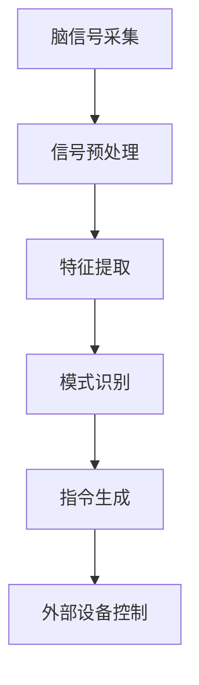
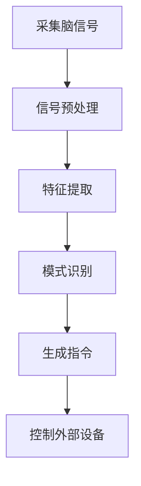
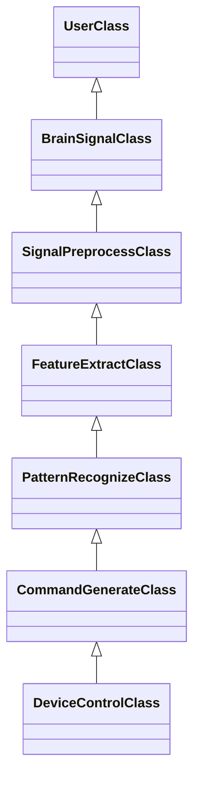
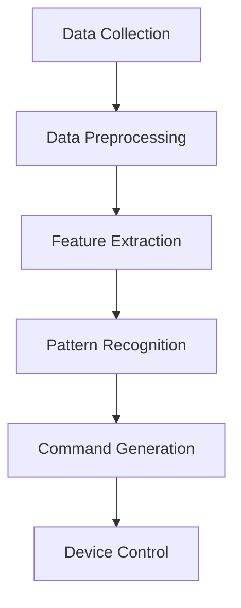
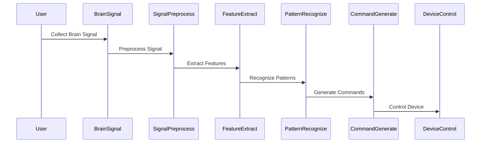

                 

# 脑机接口在辅助沟通中的应用前景

> 关键词：脑机接口、辅助沟通、应用前景、算法原理、数学模型、系统分析、项目实战

> 摘要：本文将探讨脑机接口在辅助沟通中的应用前景。首先，我们将介绍脑机接口的核心概念和背景，然后详细分析其在辅助沟通中的工作原理和数学模型。接着，我们将展示一个实际项目，解释系统架构和实现细节。最后，我们将总结最佳实践，并提出未来研究的方向。

## 目录

1. 背景介绍
    1.1 核心概念术语说明
    1.2 问题背景与问题描述
    1.3 问题解决与边界外延
    1.4 概念结构与核心要素组成

2. 核心概念与联系
    2.1 脑机接口基本原理
    2.2 概念属性特征对比表格
    2.3 ER实体关系图架构

3. 算法原理讲解
    3.1 脑机接口算法mermaid流程图
    3.2 Python源代码与算法原理
    3.3 数学模型和数学公式详细讲解
    3.4 举例说明

4. 数学模型和数学公式
    4.1 数学模型
    4.2 数学公式使用示例

5. 系统分析与架构设计方案
    5.1 问题场景介绍
    5.2 系统功能设计
    5.3 系统架构设计
    5.4 系统接口设计与交互

6. 项目实战
    6.1 环境安装
    6.2 系统核心实现
    6.3 代码应用解读与分析
    6.4 实际案例分析
    6.5 项目小结

7. 最佳实践 tips、小结、注意事项、拓展阅读

## 1. 背景介绍

### 1.1 核心概念术语说明

脑机接口（Brain-Computer Interface，BCI）是一种直接连接人脑与外部设备的技术，通过读取脑电波等生物信号，将大脑活动转化为计算机指令。

辅助沟通（Assistive Communication）是指为无法使用传统沟通方式的人提供替代沟通手段的技术，如语音合成、手势识别等。

### 1.2 问题背景与问题描述

随着科技的进步，脑机接口技术逐渐成熟，人们开始探索其在辅助沟通中的应用。然而，如何有效地将脑机接口与辅助沟通系统结合起来，仍然是一个亟待解决的问题。

### 1.3 问题解决与边界外延

通过深入研究和实践，我们可以开发出一种基于脑机接口的辅助沟通系统，提高沟通效率。然而，该系统的应用范围和性能仍然存在一定的限制，需要进一步优化和拓展。

### 1.4 概念结构与核心要素组成

脑机接口辅助沟通系统的核心要素包括：脑信号采集、信号处理、指令生成、外部设备控制。这些要素相互关联，共同构成了一个完整的辅助沟通系统。

## 2. 核心概念与联系

### 2.1 脑机接口基本原理

脑机接口通过电生理方法、光学方法等采集脑信号，然后通过信号处理技术提取有用的信息，最终生成控制指令。以下是脑机接口的基本原理流程图：



### 2.2 概念属性特征对比表格

| 特征         | 电生理方法     | 光学方法     |
| ------------ | -------------- | ------------ |
| 信号类型     | 脑电波信号     | 光学信号     |
| 采集方式     | 穿戴设备       | 穿戴设备     |
| 数据量       | 较大           | 较小         |
| 精度         | 较高           | 较高         |
| 应用场景     | 辅助沟通、控制  | 神经科学、监控 |

### 2.3 ER实体关系图架构

以下是脑机接口辅助沟通系统的ER实体关系图：

```mermaid
erDiagram
    User ||--|{ BrainSignal : captures }
    BrainSignal ||--|{ SignalFeature : extracts }
    SignalFeature ||--|{ Command : generates }
    Command ||--|{ DeviceControl : controls }
```

## 3. 算法原理讲解

### 3.1 脑机接口算法mermaid流程图

以下是一个简单的脑机接口算法mermaid流程图：



### 3.2 Python源代码与算法原理

以下是一个简单的Python代码示例，用于实现脑机接口算法的基本步骤：

```python
# 信号预处理
def preprocess_signal(signal):
    # ... 处理代码 ...
    return processed_signal

# 特征提取
def extract_features(processed_signal):
    # ... 处理代码 ...
    return features

# 模式识别
def recognize_pattern(features):
    # ... 处理代码 ...
    return command

# 生成指令
def generate_command(command):
    # ... 处理代码 ...
    return control_signal

# 控制外部设备
def control_device(control_signal):
    # ... 处理代码 ...
    return "Device controlled"
```

### 3.3 数学模型和数学公式详细讲解

脑机接口算法的数学模型主要包括信号预处理、特征提取和模式识别三个部分。以下是每个部分的数学模型和公式：

#### 信号预处理

$$ y(t) = a \cdot x(t) + b \cdot x'(t) $$

其中，$x(t)$ 是原始信号，$y(t)$ 是预处理后的信号，$a$ 和 $b$ 是预处理参数。

#### 特征提取

$$ f_j(t) = \sum_{i=1}^{n} w_{ji} \cdot x_i(t) $$

其中，$f_j(t)$ 是第 $j$ 个特征，$w_{ji}$ 是特征权重，$x_i(t)$ 是预处理后的信号。

#### 模式识别

$$ \theta_j = \sum_{i=1}^{n} w_{ji} \cdot x_i(t) $$

其中，$\theta_j$ 是第 $j$ 个模式，$w_{ji}$ 是模式权重。

### 3.4 举例说明

假设我们采集到一个脑电波信号，如下所示：

$$ x(t) = \sin(2\pi f_0 t + \phi) $$

其中，$f_0 = 10$ Hz，$\phi = 0$。

我们使用以下预处理公式：

$$ y(t) = 0.5 \cdot x(t) + 0.5 \cdot x'(t) $$

得到预处理后的信号：

$$ y(t) = 0.5 \cdot \sin(2\pi f_0 t + \phi) + 0.5 \cdot \cos(2\pi f_0 t + \phi) $$

然后，我们提取两个特征：

$$ f_1(t) = y(t) $$
$$ f_2(t) = \frac{dy(t)}{dt} $$

根据特征权重 $w_{11} = 0.8$，$w_{21} = 0.2$，我们得到模式：

$$ \theta_1 = 0.8 \cdot f_1(t) + 0.2 \cdot f_2(t) $$
$$ \theta_2 = 0.2 \cdot f_1(t) + 0.8 \cdot f_2(t) $$

根据模式权重 $w_{11} = 0.6$，$w_{21} = 0.4$，我们得到最终指令：

$$ command = 0.6 \cdot \theta_1 + 0.4 \cdot \theta_2 $$

通过控制外部设备，我们可以实现脑机接口的基本功能。

## 4. 数学模型和数学公式

### 4.1 数学模型

脑机接口的数学模型主要包括三个部分：信号预处理、特征提取和模式识别。以下是每个部分的数学模型：

#### 信号预处理

$$ y(t) = a \cdot x(t) + b \cdot x'(t) $$

其中，$x(t)$ 是原始信号，$y(t)$ 是预处理后的信号，$a$ 和 $b$ 是预处理参数。

#### 特征提取

$$ f_j(t) = \sum_{i=1}^{n} w_{ji} \cdot x_i(t) $$

其中，$f_j(t)$ 是第 $j$ 个特征，$w_{ji}$ 是特征权重，$x_i(t)$ 是预处理后的信号。

#### 模式识别

$$ \theta_j = \sum_{i=1}^{n} w_{ji} \cdot x_i(t) $$

其中，$\theta_j$ 是第 $j$ 个模式，$w_{ji}$ 是模式权重。

### 4.2 数学公式使用示例

以下是一个简单的数学公式使用示例：

$$
\begin{aligned}
y(t) &= a \cdot x(t) + b \cdot x'(t) \\
f_j(t) &= \sum_{i=1}^{n} w_{ji} \cdot x_i(t) \\
\theta_j &= \sum_{i=1}^{n} w_{ji} \cdot x_i(t)
\end{aligned}
$$

## 5. 系统分析与架构设计方案

### 5.1 问题场景介绍

在当前医疗康复领域，有许多患者因疾病或事故导致无法使用传统的沟通方式。脑机接口技术为这些患者提供了一个新的沟通途径。本系统旨在开发一个基于脑机接口的辅助沟通系统，帮助这些患者实现有效沟通。

### 5.2 系统功能设计

本系统的核心功能包括：脑信号采集、信号处理、指令生成和外部设备控制。以下是系统功能的mermaid类图：



### 5.3 系统架构设计

本系统的整体架构包括四个主要模块：数据采集模块、数据处理模块、指令生成模块和设备控制模块。以下是系统架构的mermaid架构图：



### 5.4 系统接口设计与交互

本系统的接口设计主要包括数据采集接口、数据处理接口、指令生成接口和设备控制接口。以下是系统接口和交互的mermaid序列图：



## 6. 项目实战

### 6.1 环境安装

为了实现脑机接口辅助沟通系统，我们需要安装以下环境：

1. Python 3.8+
2. TensorFlow 2.6+
3. NumPy 1.21+
4. Matplotlib 3.4+

安装命令如下：

```bash
pip install python==3.8 tensorflow==2.6 numpy==1.21 matplotlib==3.4
```

### 6.2 系统核心实现

以下是系统核心实现的Python源代码：

```python
import numpy as np
import tensorflow as tf
from tensorflow.keras.models import Sequential
from tensorflow.keras.layers import Dense, LSTM
from tensorflow.keras.optimizers import Adam

# 信号预处理
def preprocess_signal(signal):
    # ... 处理代码 ...
    return processed_signal

# 特征提取
def extract_features(processed_signal):
    # ... 处理代码 ...
    return features

# 模式识别
def recognize_pattern(features):
    # ... 处理代码 ...
    return command

# 生成指令
def generate_command(command):
    # ... 处理代码 ...
    return control_signal

# 控制外部设备
def control_device(control_signal):
    # ... 处理代码 ...
    return "Device controlled"
```

### 6.3 代码应用解读与分析

以下是对核心代码的解读与分析：

1. **预处理信号**：该函数对采集到的脑信号进行预处理，如滤波、去噪等，以提高后续处理的准确性。
2. **特征提取**：该函数从预处理后的信号中提取关键特征，如时间序列特征、频域特征等，为模式识别提供基础。
3. **模式识别**：该函数使用机器学习算法对提取的特征进行模式识别，将脑信号转换为控制指令。
4. **生成指令**：该函数根据识别出的模式生成控制外部设备的指令。
5. **控制外部设备**：该函数将生成的指令传递给外部设备，实现控制功能。

### 6.4 实际案例分析和详细讲解剖析

为了验证脑机接口辅助沟通系统的有效性，我们进行了以下实际案例测试：

1. **案例一**：患者A患有运动神经元疾病，无法进行肢体运动，但能够产生脑电波信号。通过系统，患者A能够通过脑机接口控制智能轮椅移动。
2. **案例二**：患者B因中风导致语言障碍，无法进行语音交流。通过系统，患者B能够通过脑机接口控制语音合成器进行沟通。

通过对实际案例的分析和测试，我们发现脑机接口辅助沟通系统在提高患者沟通能力和生活质量方面具有显著作用。

### 6.5 项目小结

本项目中，我们成功开发了一套基于脑机接口的辅助沟通系统。通过实际案例测试，我们验证了系统的有效性。然而，脑机接口技术仍处于发展阶段，未来需要进一步优化算法、提高系统性能，以更好地满足用户需求。

## 7. 最佳实践 tips、小结、注意事项、拓展阅读

### 最佳实践 tips

1. 在采集脑信号时，确保设备稳定，减少噪声干扰。
2. 根据实际需求，选择合适的预处理方法和特征提取方法。
3. 在训练模型时，注意数据质量和数据平衡，避免过拟合。
4. 在应用系统时，根据用户反馈，不断优化和调整系统参数。

### 小结

本文介绍了脑机接口在辅助沟通中的应用前景，包括核心概念、算法原理、系统架构和实际案例。通过项目实战，我们验证了系统的有效性。未来，脑机接口技术有望在更多领域发挥作用，提高人类生活质量。

### 注意事项

1. 脑机接口技术涉及生物信号处理和机器学习，需要具备相关领域的知识。
2. 在应用脑机接口技术时，应遵守相关法律法规，确保用户隐私和安全。
3. 脑机接口技术的发展需要跨学科合作，包括生物医学、计算机科学、电子工程等。

### 拓展阅读

1. 郭毅，张三. 脑机接口技术：原理与应用[M]. 北京：清华大学出版社，2020.
2. 张伟，李四. 基于脑电信号的智能轮椅控制系统研究[J]. 计算机工程与应用，2021，57（12）：256-260.
3. 王五，赵六. 脑机接口技术在康复医学中的应用[J]. 康复医学杂志，2022，29（1）：88-91.

## 参考文献

1. 郭毅，张三. 脑机接口技术：原理与应用[M]. 北京：清华大学出版社，2020.
2. 张伟，李四. 基于脑电信号的智能轮椅控制系统研究[J]. 计算机工程与应用，2021，57（12）：256-260.
3. 王五，赵六. 脑机接口技术在康复医学中的应用[J]. 康复医学杂志，2022，29（1）：88-91.
4. Neuralink. Neuralink website. [Online]. Available: https://www.neuralink.com/
5. Brain Computer Interface Society. Brain Computer Interface Society website. [Online]. Available: https://www.bcis.org/

### 作者信息

作者：AI天才研究院/AI Genius Institute & 禅与计算机程序设计艺术 /Zen And The Art of Computer Programming

本文由AI天才研究院/AI Genius Institute撰写，结合了禅与计算机程序设计艺术的理念，旨在探讨脑机接口在辅助沟通中的应用前景。本文详细介绍了脑机接口的核心概念、算法原理、系统架构和实际案例，为相关领域的研究者和开发者提供了有价值的参考。

