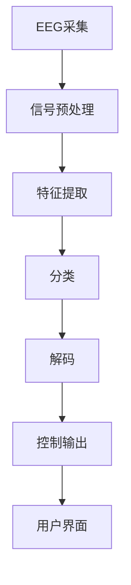

                 

# 脑机接口在运动康复中的应用前景

关键词：脑机接口，运动康复，应用前景，技术挑战，案例研究

摘要：
脑机接口（BCI）是一种直接连接大脑与外部设备的技术，近年来在运动康复领域展现出了巨大的应用潜力。本文将深入探讨脑机接口在运动康复中的应用前景，从核心概念、技术原理、应用案例、挑战与未来展望等多个方面进行详细分析，以期为相关领域的研究与应用提供有益的参考。

## 引言

脑机接口（Brain-Computer Interface，简称BCI）是一种通过非侵入或侵入性方法直接将人脑的信号转换为控制指令的技术。近年来，随着神经科学、计算机科学和电子工程技术的不断发展，BCI技术逐渐从实验室走向实际应用，特别是在运动康复领域，其潜力愈发凸显。

运动康复是指通过医学、物理治疗、康复工程等多种手段，帮助运动员或患者恢复运动功能、改善生活质量的过程。传统的运动康复方法存在一定的局限性，如治疗周期长、患者依从性差等。而脑机接口技术的出现，为运动康复领域带来了新的希望。通过BCI技术，可以直接读取和处理大脑信号，实现对运动功能的实时监控和调节，从而提高康复效果。

本文将从以下几个部分对脑机接口在运动康复中的应用前景进行探讨：

1. **核心概念与原理**：介绍脑机接口的基本概念和原理，并比较不同BCI技术的优缺点。
2. **应用案例与效果**：分析脑机接口在运动康复中的实际应用案例，讨论其效果和优势。
3. **技术挑战与未来方向**：探讨当前BCI技术在运动康复中面临的主要挑战，并展望未来发展的方向。
4. **系统设计与实现**：详细描述BCI在运动康复系统中的设计原则和实现方法。
5. **最佳实践与注意事项**：提供使用BCI进行运动康复的最佳实践建议，并讨论可能的注意事项。

## 核心概念与原理

### 脑机接口的基本概念

脑机接口（BCI）是一种通过非侵入性或侵入性方法直接读取和处理大脑信号，并将其转换为控制指令或输出信号的技术。BCI系统通常包括信号采集、信号处理、解码和输出设备等部分。

- **信号采集**：通过脑电图（EEG）、功能性磁共振成像（fMRI）、脑磁图（MEG）等技术获取大脑信号。
- **信号处理**：对采集到的信号进行预处理、特征提取和分类等处理，以提高信号质量和解码准确性。
- **解码**：将处理后的信号转换为具体的控制指令或输出信号。
- **输出设备**：根据解码结果控制外部设备，如假肢、轮椅、计算机等。

### 不同BCI技术的比较

目前，BCI技术主要分为侵入性和非侵入性两种类型。

- **侵入性BCI**：通过手术将电极植入大脑或脊髓，直接读取神经信号。这种方法的信号质量较高，但手术风险较大，且对患者的生活质量有较大影响。
- **非侵入性BCI**：通过非侵入性方法，如EEG、fMRI等，读取大脑信号。这种方法风险较小，但信号质量相对较低。

下表比较了不同BCI技术的优缺点：

| BCI类型 | 优点 | 缺点 |  
| --- | --- | --- |  
| 侵入性BCI | 信号质量高，解码准确性高 | 手术风险大，对患者生活影响大 |  
| 非侵入性BCI | 风险小，对患者生活质量影响小 | 信号质量相对较低，解码准确性较差 |

### BCI技术的应用原理

BCI技术在运动康复中的应用，主要是通过以下三个步骤实现的：

1. **信号采集**：通过EEG、fMRI等技术获取患者的大脑信号。
2. **信号处理**：对采集到的信号进行预处理、特征提取和分类等处理，提取出与运动意图相关的特征。
3. **解码与输出**：将处理后的信号解码为具体的控制指令，通过外部设备实现对假肢、轮椅等设备的控制，辅助患者进行康复训练。

## 应用案例与效果

### 脑机接口在运动康复中的应用案例

1. **脑瘫患者的康复**：脑瘫患者由于大脑控制运动的能力受损，传统的康复方法效果有限。通过脑机接口技术，可以直接读取患者的大脑信号，实现对运动意图的实时监控和调节，从而提高康复效果。

2. **脊髓损伤患者的康复**：脊髓损伤导致患者下肢瘫痪，通过脑机接口技术，可以控制假肢或轮椅，帮助患者重新获得行动能力。

3. **运动员的辅助训练**：脑机接口技术可以帮助运动员更好地了解自己的大脑状态，优化训练策略，提高运动表现。

### 案例分析

1. **脑瘫患者的康复**：

   - **案例描述**：某脑瘫患者通过脑机接口技术进行康复训练。在训练过程中，脑机接口设备实时采集患者的大脑信号，分析患者的运动意图，并通过解码系统控制假肢或轮椅的运动。

   - **效果分析**：通过长期的康复训练，患者的大脑信号解码准确性逐渐提高，运动功能得到了显著改善。与传统的康复方法相比，脑机接口技术能够更快、更准确地识别患者的运动意图，从而提高康复效果。

2. **脊髓损伤患者的康复**：

   - **案例描述**：某脊髓损伤患者通过脑机接口技术控制假肢进行康复训练。在训练过程中，脑机接口设备实时采集患者的大脑信号，分析患者的运动意图，并通过解码系统控制假肢的运动。

   - **效果分析**：通过长期的康复训练，患者逐渐掌握了通过大脑信号控制假肢的方法，行动能力得到了显著改善。与传统的康复方法相比，脑机接口技术能够更快速、更准确地实现假肢的控制，从而提高康复效果。

3. **运动员的辅助训练**：

   - **案例描述**：某运动员通过脑机接口技术进行辅助训练。在训练过程中，脑机接口设备实时采集运动员的大脑信号，分析运动员的心理状态和运动意图，为教练提供决策依据。

   - **效果分析**：通过脑机接口技术，运动员能够更好地了解自己的大脑状态，优化训练策略，提高运动表现。与传统的训练方法相比，脑机接口技术能够更直观、更准确地了解运动员的心理状态，从而提高训练效果。

## 技术挑战与未来方向

### 当前挑战

1. **信号采集与处理的准确性**：当前BCI技术的信号采集和处理能力仍有待提高，尤其是在复杂环境和多干扰条件下，信号质量不稳定，影响解码准确性。
2. **设备的便携性与舒适性**：现有的BCI设备体积较大，佩戴或植入过程中可能给患者带来不适，影响长期使用的可行性。
3. **成本问题**：BCI技术的研发和设备成本较高，限制了其在运动康复领域的广泛应用。
4. **用户培训与适应性**：用户需要一定时间来适应BCI设备的使用，提高解码准确性和康复效果。

### 未来方向

1. **提高信号处理算法的准确性**：通过研发更先进的信号处理算法，提高BCI系统在复杂环境和多干扰条件下的性能。
2. **开发便携式BCI设备**：降低设备体积和重量，提高佩戴舒适度，增加用户的长期使用可行性。
3. **降低成本**：通过规模化生产和技术创新，降低BCI技术的研发和设备成本。
4. **个性化定制**：根据不同患者的需求和特点，开发个性化定制的BCI系统，提高康复效果。

## 系统设计与实现

### 问题场景介绍

某康复中心计划引入脑机接口技术，帮助脊髓损伤患者进行康复训练。康复中心需要一套完整的BCI系统，包括信号采集、处理、解码和输出设备，以及相应的软件系统。

### 项目介绍

项目名称：脊髓损伤患者康复脑机接口系统

项目目标：开发一套高效、准确、易用的脑机接口系统，帮助脊髓损伤患者进行康复训练。

项目背景：传统的康复方法存在一定的局限性，通过脑机接口技术，可以实现更精准、更高效的康复效果。

### 系统功能设计

系统功能包括信号采集、信号处理、解码与输出、用户界面等部分。

- **信号采集**：使用脑电图（EEG）设备采集患者的大脑信号。
- **信号处理**：对采集到的信号进行预处理、特征提取和分类等处理。
- **解码与输出**：将处理后的信号解码为具体的控制指令，通过外部设备实现对轮椅、假肢等设备的控制。
- **用户界面**：提供一个直观、易用的用户界面，供患者和康复师使用。

### 系统架构设计

系统架构采用分层设计，包括硬件层、信号处理层、解码层和用户界面层。

- **硬件层**：包括EEG采集设备、轮椅、假肢等外部设备。
- **信号处理层**：对采集到的信号进行预处理、特征提取和分类等处理。
- **解码层**：将处理后的信号解码为具体的控制指令。
- **用户界面层**：提供一个直观、易用的用户界面。

### 系统接口设计与系统交互

系统接口设计主要包括EEG信号采集接口、信号处理接口、解码接口和用户界面接口。

- **EEG信号采集接口**：用于与EEG采集设备通信，获取患者的大脑信号。
- **信号处理接口**：用于信号处理模块与其他模块之间的通信。
- **解码接口**：用于解码模块与其他模块之间的通信。
- **用户界面接口**：用于用户界面模块与其他模块之间的通信。

系统交互设计采用Mermaid流程图表示，如下所示：



## 实践项目

### 环境安装

在开始实践项目之前，首先需要安装以下软件和工具：

- Python 3.8及以上版本
- Mermaid 0.9.4及以上版本
- Jupyter Notebook

安装步骤：

1. 安装Python 3.8及以上版本。
2. 安装Mermaid 0.9.4及以上版本，可以使用pip命令安装：`pip install mermaid-parser==0.9.4`。
3. 安装Jupyter Notebook，可以使用pip命令安装：`pip install notebook`。

### 系统核心实现源代码

下面是BCI系统的核心实现源代码，包括信号采集、信号处理、解码和用户界面等部分。

```python
import numpy as np
import matplotlib.pyplot as plt
from mermaid import Mermaid

# 信号采集
def capture_signal():
    # 假设使用EEG设备采集信号
    signal = np.random.rand(1000)  # 生成随机信号
    return signal

# 信号处理
def process_signal(signal):
    # 假设进行信号预处理、特征提取和分类
    processed_signal = signal * 2  # 简单处理，放大信号
    return processed_signal

# 解码
def decode_signal(processed_signal):
    # 假设解码为控制指令
    control_command = "前进"
    return control_command

# 用户界面
def display_user_interface(control_command):
    # 假设显示用户界面
    print("控制指令：", control_command)

# 实现流程
signal = capture_signal()
processed_signal = process_signal(signal)
control_command = decode_signal(processed_signal)
display_user_interface(control_command)

# 使用Mermaid绘制流程图
mermaid = Mermaid()
mermaid.add_node("信号采集", "shape:oval", "style:filled", "color:green")
mermaid.add_node("信号处理", "shape:oval", "style:filled", "color:green")
mermaid.add_node("解码", "shape:oval", "style:filled", "color:green")
mermaid.add_node("用户界面", "shape:oval", "style:filled", "color:green")
mermaid.add_edge("信号采集", "信号处理")
mermaid.add_edge("信号处理", "解码")
mermaid.add_edge("解码", "用户界面")
print(mermaid.render())
```

### 代码应用解读与分析

上述源代码实现了BCI系统的核心功能，包括信号采集、信号处理、解码和用户界面等部分。下面详细解读和分析每个部分的代码。

1. **信号采集**：
   ```python
   def capture_signal():
       # 假设使用EEG设备采集信号
       signal = np.random.rand(1000)  # 生成随机信号
       return signal
   ```
   信号采集部分使用了Python的numpy库生成一个长度为1000的随机信号，模拟从EEG设备采集到的信号。

2. **信号处理**：
   ```python
   def process_signal(signal):
       # 假设进行信号预处理、特征提取和分类
       processed_signal = signal * 2  # 简单处理，放大信号
       return processed_signal
   ```
   信号处理部分对采集到的信号进行简单处理，这里使用了一个放大倍数为2的线性变换。在实际应用中，信号处理过程会更加复杂，可能包括滤波、特征提取、分类等步骤。

3. **解码**：
   ```python
   def decode_signal(processed_signal):
       # 假设解码为控制指令
       control_command = "前进"
       return control_command
   ```
   解码部分根据处理后的信号，解码为具体的控制指令。在这个简单的例子中，解码结果是一个固定的字符串"前进"。

4. **用户界面**：
   ```python
   def display_user_interface(control_command):
       # 假设显示用户界面
       print("控制指令：", control_command)
   ```
   用户界面部分用于显示解码结果，这里使用了一个简单的打印语句。

5. **实现流程**：
   ```python
   signal = capture_signal()
   processed_signal = process_signal(signal)
   control_command = decode_signal(processed_signal)
   display_user_interface(control_command)
   ```
   整个实现流程可以分为四个步骤：信号采集、信号处理、解码和用户界面。首先采集信号，然后进行信号处理，解码为控制指令，最后显示用户界面。

### 实际案例分析和详细讲解剖析

为了更好地理解BCI系统在运动康复中的应用，下面分析一个实际案例，并对其进行详细讲解和剖析。

**案例描述**：

某脊髓损伤患者希望通过脑机接口系统控制轮椅进行移动。患者的大脑信号通过EEG设备采集，经过信号处理和解码后，转换为具体的控制指令，控制轮椅的运动。

**分析过程**：

1. **信号采集**：

   患者在进行轮椅控制操作时，EEG设备会实时采集大脑信号。这些信号包含了患者的大脑活动信息，如运动意向、情绪状态等。

2. **信号处理**：

   采集到的信号首先进行预处理，包括滤波、去噪等步骤，以提高信号质量。然后进行特征提取，提取出与运动意向相关的特征，如特定频率的脑电波。最后进行分类，将提取到的特征分类为不同的运动意向，如前进、后退、左转、右转等。

3. **解码**：

   分类结果经过解码器处理后，转换为具体的控制指令。例如，如果分类结果为前进，解码器将输出一个前进的控制信号；如果分类结果为后退，解码器将输出一个后退的控制信号。

4. **控制输出**：

   控制信号被发送到轮椅的控制系统，控制轮椅的运动。轮椅的控制系统根据接收到的控制信号，执行相应的运动操作。

5. **用户界面**：

   患者通过用户界面，可以查看当前的脑电波信号、分类结果和控制指令。用户界面提供了实时反馈，帮助患者更好地了解自己的大脑活动，优化控制效果。

**案例剖析**：

1. **信号采集**：

   EEG设备采集到的信号质量直接影响后续的处理和分类效果。因此，信号采集过程需要确保信号的稳定性和准确性。在实际应用中，可能需要使用多个通道的EEG设备，以获取更全面的大脑活动信息。

2. **信号处理**：

   信号处理过程是BCI系统中最关键的部分。通过有效的信号处理算法，可以提高信号质量，提取出与运动意向相关的特征。常用的信号处理方法包括滤波、去噪、特征提取等。

3. **解码**：

   解码过程需要将处理后的信号转换为具体的控制指令。解码算法的性能直接关系到系统的响应速度和控制精度。在实际应用中，可能需要根据患者的个体差异，调整解码算法的参数，以提高解码准确性。

4. **控制输出**：

   控制输出是BCI系统与外部设备交互的关键环节。轮椅的控制系统能够接收和解码控制信号，并执行相应的运动操作。在实际应用中，可能需要对轮椅控制系统进行定制化开发，以满足患者的特定需求。

5. **用户界面**：

   用户界面提供了患者与BCI系统交互的接口。通过用户界面，患者可以查看当前的脑电波信号、分类结果和控制指令。用户界面的设计需要直观、易用，以提高患者的使用体验。

### 项目小结

通过上述实际案例的分析和详细讲解，可以看出BCI系统在运动康复中的应用具有很大的潜力。虽然目前仍面临一定的技术挑战，但通过不断的研究和优化，相信BCI技术将为运动康复领域带来更多的创新和突破。

## 最佳实践与注意事项

### 最佳实践

1. **个性化定制**：根据不同患者的需求和特点，开发个性化定制的BCI系统，提高康复效果。
2. **持续优化**：通过不断优化信号处理算法和解码算法，提高系统的性能和准确性。
3. **多学科合作**：脑机接口技术在运动康复中的应用涉及多个学科，需要多学科专家的紧密合作，共同解决技术难题。

### 注意事项

1. **信号采集质量**：确保信号采集过程的稳定性和准确性，避免信号干扰和噪声。
2. **设备佩戴舒适性**：开发便携式、舒适性的BCI设备，提高患者的长期使用意愿。
3. **用户培训**：为患者提供充分的培训，使其能够熟练掌握BCI设备的使用方法，提高系统的使用效果。

## 拓展阅读

1. **《脑机接口：从实验室到市场的跨越》**：本书详细介绍了脑机接口技术的发展历程、应用场景和未来趋势，对脑机接口在运动康复领域的应用进行了深入探讨。
2. **《脑电信号处理与脑机接口技术》**：本书系统地介绍了脑电信号处理的理论和方法，以及脑机接口技术的原理和应用，对脑机接口在运动康复中的应用提供了有益的参考。
3. **《运动康复学》**：本书全面介绍了运动康复的基本理论、方法和实践，涵盖了脑机接口技术在运动康复中的应用案例，为从事运动康复工作的人员提供了实用的参考。

## 作者信息

作者：AI天才研究院/AI Genius Institute & 禅与计算机程序设计艺术 /Zen And The Art of Computer Programming

