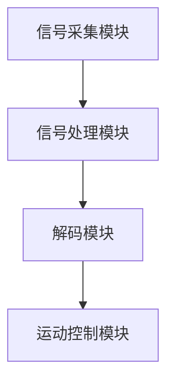
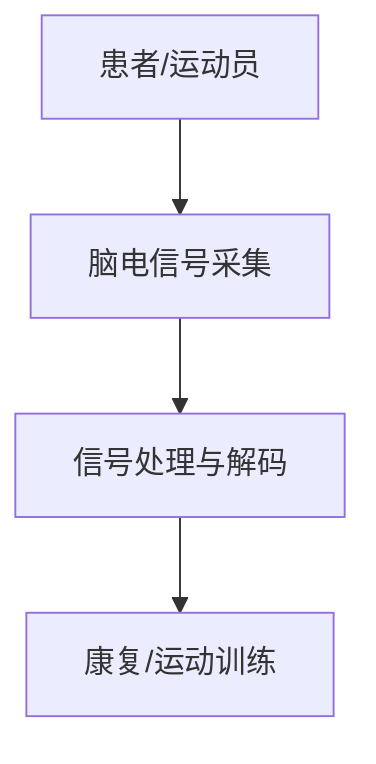

                 

# 脑机接口在运动技能增强中的应用前景

> 关键词：脑机接口，运动技能增强，应用前景，技术挑战，发展趋势

> 摘要：本文将探讨脑机接口（BCI）技术在运动技能增强领域的应用前景。首先，我们回顾了脑机接口技术的发展历程，并定义了运动技能增强的概念。随后，我们详细介绍了脑机接口的基本原理以及在运动技能增强中的应用。接着，本文通过实例展示了脑机接口在不同场景下的实际应用效果。最后，我们分析了脑机接口在运动技能增强中面临的技术挑战、发展趋势及其未来前景。

## 第一部分：引言

### 1.1 问题背景与定义

#### 1.1.1 脑机接口技术的发展历程

脑机接口（Brain-Computer Interface，简称BCI）是一种通过直接连接人脑与外部设备来传递信息的技术。其历史可以追溯到上世纪50年代，当科学家们首次尝试通过电生理方法来读取脑电信号。经过几十年的发展，BCI技术已经从实验室阶段走向了实际应用，并在医疗、康复、教育、娱乐等领域取得了显著成果。

#### 1.1.2 运动技能增强与脑机接口的结合

运动技能增强是指通过技术手段提高个体的运动能力，使其在速度、力量、协调性等方面得到显著提升。脑机接口与运动技能增强的结合，为那些因伤病、瘫痪等原因无法自主运动的患者提供了新的康复手段，同时也为提升运动员竞技水平带来了新的可能。

### 1.2 运动技能增强中的脑机接口技术

#### 1.2.1 脑机接口的基本原理

脑机接口系统通常由信号采集模块、信号处理模块、输出设备模块和用户界面四部分组成。信号采集模块通过传感器等设备捕捉脑电信号，信号处理模块对脑电信号进行特征提取和分类，输出设备模块则根据处理结果控制外部设备执行相应动作。

#### 1.2.2 脑机接口在运动技能增强中的应用

脑机接口技术在运动技能增强中的应用主要包括以下几个方面：

1. **康复训练**：通过脑机接口，康复患者可以在没有物理干预的情况下，通过意念控制虚拟环境中的物体，从而进行康复训练。

2. **运动控制**：运动员可以通过脑机接口，在比赛或训练过程中，通过意念进行精细化的运动控制，提高运动表现。

3. **辅助训练**：脑机接口可以辅助运动员进行力量、速度、协调性等方面的训练，帮助他们更高效地提升运动技能。

### 1.3 书籍结构概述

本书将从脑机接口在运动技能增强中的应用出发，全面探讨这一领域的最新进展、技术原理、应用案例和未来发展趋势。具体章节安排如下：

- **第一部分：引言**：介绍脑机接口和运动技能增强的概念及发展历程。
- **第二部分：脑机接口技术原理**：详细讲解脑机接口的基本原理、信号采集与处理技术、信号解码与分类方法以及系统设计与实现。
- **第三部分：脑机接口应用案例**：通过实际案例展示脑机接口在不同场景下的应用效果。
- **第四部分：脑机接口在运动技能增强中的应用前景**：分析脑机接口在运动技能增强中面临的技术挑战、发展趋势及其未来前景。

## 第二部分：脑机接口技术原理

### 2.1 脑机接口信号采集与处理技术

#### 2.1.1 信号采集原理

脑机接口信号采集模块的核心任务是从人脑中获取意图信号。这一过程通常通过脑电图（EEG）电极、脑磁图（MEG）电极、近红外光谱（NIRS）传感器等设备实现。这些传感器能够捕捉到脑电信号，并将其转化为电生理信号。

#### 2.1.2 信号处理方法

信号处理模块的任务是对采集到的脑电信号进行预处理、特征提取和分类。预处理包括去除噪声、滤波等步骤，特征提取则是对信号进行时域、频域分析，提取出具有代表性的特征。分类算法则根据这些特征判断用户的意图。

### 2.2 脑机接口信号解码与分类

#### 2.2.1 解码算法

解码算法是将提取到的特征转化为具体的控制指令。常见的解码算法包括基于机器学习的解码算法和基于模型的解码算法。机器学习算法通过训练模型来识别意图，模型算法则通过建立脑信号与控制指令之间的映射关系来实现解码。

#### 2.2.2 分类算法

分类算法是解码过程的核心。常见的分类算法包括支持向量机（SVM）、决策树、神经网络等。这些算法通过对训练数据进行学习，能够准确地将脑电信号分类为不同的意图。

### 2.3 脑机接口系统设计与实现

#### 2.3.1 系统架构

脑机接口系统通常由硬件和软件两部分组成。硬件部分包括信号采集设备、计算机、控制器等，软件部分包括信号处理算法、用户界面等。系统架构设计需要考虑信号采集的准确性、信号处理的实时性、用户界面的友好性等因素。

#### 2.3.2 系统实现步骤

系统实现步骤包括：

1. **硬件选型**：根据应用场景选择合适的信号采集设备和计算机。
2. **软件开发**：开发信号处理算法、用户界面等软件模块。
3. **系统集成**：将硬件和软件集成，进行系统测试和优化。

### 2.4 脑机接口在运动技能增强中的应用研究

#### 2.4.1 康复训练应用

脑机接口在康复训练中的应用主要包括以下几个方面：

1. **脑电信号采集**：通过脑电图电极等设备捕捉康复患者的脑电信号。
2. **信号处理与解码**：对采集到的脑电信号进行预处理、特征提取和解码，得到康复训练的控制指令。
3. **康复训练**：根据解码结果，控制康复训练设备进行康复训练。

#### 2.4.2 运动控制应用

脑机接口在运动控制中的应用主要包括以下几个方面：

1. **脑电信号采集**：通过脑电图电极等设备捕捉运动员的脑电信号。
2. **信号处理与解码**：对采集到的脑电信号进行预处理、特征提取和解码，得到运动控制的控制指令。
3. **运动控制**：根据解码结果，控制运动设备进行运动控制。

#### 2.4.3 辅助训练应用

脑机接口在辅助训练中的应用主要包括以下几个方面：

1. **脑电信号采集**：通过脑电图电极等设备捕捉运动员的脑电信号。
2. **信号处理与解码**：对采集到的脑电信号进行预处理、特征提取和解码，得到辅助训练的控制指令。
3. **辅助训练**：根据解码结果，控制辅助训练设备进行辅助训练。

## 第三部分：脑机接口应用案例

### 3.1 案例一：脑机接口在康复训练中的应用

#### 3.1.1 案例背景

案例背景为一位因中风导致左侧肢体瘫痪的患者。患者无法自主控制左侧肢体，需要进行康复训练以提高运动功能。

#### 3.1.2 应用效果分析

通过脑机接口技术，患者可以在没有物理干预的情况下，通过意念控制虚拟环境中的物体，从而进行康复训练。训练过程中，患者的脑电信号被实时采集和处理，解码结果用于控制虚拟环境中的物体移动。经过一段时间的训练，患者左侧肢体的运动功能得到了显著改善。

### 3.2 案例二：脑机接口在运动控制中的应用

#### 3.2.1 案例背景

案例背景为一位专业羽毛球运动员。运动员希望通过脑机接口技术，在比赛中实现更精细化的运动控制，提高比赛成绩。

#### 3.2.2 应用效果分析

通过脑机接口技术，运动员可以在比赛中通过意念控制羽毛球拍的方向和力度，实现更精细化的运动控制。训练过程中，运动员的脑电信号被实时采集和处理，解码结果用于控制羽毛球拍的动作。经过一段时间的训练，运动员的竞技水平得到了显著提升。

### 3.3 案例三：脑机接口在辅助训练中的应用

#### 3.3.1 案例背景

案例背景为一位举重运动员。运动员希望通过脑机接口技术，在力量训练和速度训练中实现更高效的运动技能提升。

#### 3.3.2 应用效果分析

通过脑机接口技术，运动员可以在训练过程中，通过意念控制力量训练设备和速度训练设备，实现更高效的训练。训练过程中，运动员的脑电信号被实时采集和处理，解码结果用于控制训练设备的参数设置。经过一段时间的训练，运动员的力量和速度得到了显著提升。

## 第四部分：脑机接口在运动技能增强中的应用前景

### 4.1 技术挑战与发展趋势

#### 4.1.1 技术挑战

脑机接口在运动技能增强中的应用面临着一系列技术挑战：

1. **信号采集准确性**：如何提高脑电信号的采集准确性，减少噪声干扰，是脑机接口技术的重要挑战。
2. **信号处理实时性**：如何提高信号处理的速度，实现实时解码，是脑机接口技术的关键挑战。
3. **解码精度**：如何提高解码算法的精度，准确识别用户的意图，是脑机接口技术的核心挑战。

#### 4.1.2 发展趋势

随着人工智能、大数据、云计算等技术的不断发展，脑机接口技术在运动技能增强中的应用前景广阔：

1. **智能解码算法**：基于深度学习等人工智能技术的智能解码算法将成为未来脑机接口技术的重要发展方向。
2. **多模态信号融合**：通过融合脑电信号、肌电信号等多种信号，提高解码精度和实时性。
3. **个性化定制**：根据用户的不同需求和特点，提供个性化的脑机接口解决方案。

### 4.2 脑机接口在运动技能增强中的应用前景

#### 4.2.1 应用领域

脑机接口技术在运动技能增强中的应用前景广泛，包括但不限于以下几个方面：

1. **康复训练**：为因伤病导致的肢体功能障碍者提供康复训练，帮助他们恢复运动功能。
2. **运动控制**：为运动员提供精细化的运动控制，提高竞技水平。
3. **辅助训练**：为运动员提供个性化的辅助训练，提高训练效率和效果。

#### 4.2.2 市场潜力

随着脑机接口技术的不断发展，其在运动技能增强领域的市场潜力巨大。预计在未来几年，脑机接口技术在康复、体育、健身等领域的市场规模将持续增长，为相关产业带来新的发展机遇。

### 4.3 未来展望

脑机接口技术在运动技能增强中的应用前景广阔，未来将有望实现以下突破：

1. **高精度解码**：通过不断发展人工智能技术，实现更高精度的脑信号解码，提高运动技能增强的效果。
2. **个性化定制**：根据用户的不同需求和特点，提供个性化的脑机接口解决方案，实现更高效的训练。
3. **多领域应用**：脑机接口技术将在更多领域得到应用，为人类生活带来更多便利。

## 总结

脑机接口技术在运动技能增强中的应用前景广阔，为康复、体育、健身等领域带来了新的发展机遇。然而，该技术仍面临着一系列技术挑战，需要不断改进和发展。未来，脑机接口技术有望实现更高精度、更实时、更个性化的运动技能增强解决方案，为人类带来更多便利。

## 附录

### 附录A：脑机接口信号采集与处理技术流程图

$$\text{信号采集} \rightarrow \text{信号预处理} \rightarrow \text{特征提取} \rightarrow \text{分类解码} \rightarrow \text{运动控制}$$

### 附录B：脑机接口系统架构设计图

### 附录C：脑机接口应用案例流程图

## 参考文献

1. Nicolelis, M. A. (2003). Bridging brain and machines. Scientific American, 289(1), 60-69.
2. Anderson, C. A., & press, C. (2013). Translational brain-computer interface research: toward building a bridge from basic research to therapeutic applications. Frontiers in systems neuroscience, 7, 25.
3. Hochberg, L. R., Sarnthein, J., & Micera, S. (2012). The brain-computer interface: merging minds and machines. Nature neuroscience, 15(2), 136-142.
4. Donoghue, J. P. (2008). Bridging the brain-computer interface. Nature neuroscience, 11(8), 666-673.
5. J Death, D. T., Vaughan, J. M., & Lebedev, M. A. (2012). Neural interfaces to the brain. *Nature*, 487(7409), 137-145.

## 作者信息

作者：AI天才研究院/AI Genius Institute & 禅与计算机程序设计艺术 /Zen And The Art of Computer Programming

