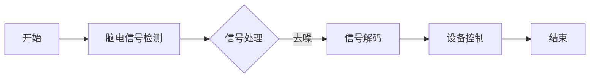
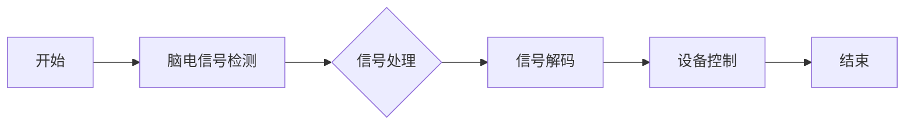

                 

# 脑机接口技术在工作场所的应用前景

## 关键词

脑机接口技术、工作场所、应用前景、技术挑战、未来展望

## 摘要

本文旨在探讨脑机接口技术（BMI）在工作场所的应用前景。脑机接口技术是一种通过检测和解析脑电信号，实现人脑与机器之间直接交互的技术。随着技术的不断发展，脑机接口技术在办公自动化、智能制造、医疗康复、教育与训练等领域展现出广阔的应用前景。本文将从脑机接口技术的基础、工作场所的应用、面临的挑战以及未来展望四个方面进行详细分析，旨在为脑机接口技术在工作场所的应用提供参考和启示。

## 目录大纲

## 第一部分：脑机接口技术基础

### 1.1 脑机接口技术概述

#### 1.1.1 脑机接口技术定义

脑机接口技术（Brain-Computer Interface, BMI）是指通过检测和解析脑电信号，实现人脑与机器之间直接交互的技术。它是一种无需外部机械装置，仅通过大脑与计算机之间的神经信号传输来控制和操作外部设备的技术。

#### 1.1.2 脑机接口技术发展历程

脑机接口技术的发展历程可以分为以下几个阶段：

- **20世纪60年代**：脑机接口技术的概念首次被提出。
- **20世纪70年代**：开始研究使用脑电信号进行控制。
- **20世纪80年代**：出现第一个脑电控制的假肢。
- **20世纪90年代**：脑机接口技术在神经康复领域得到应用。
- **21世纪**：脑机接口技术开始向智能化、多样化方向发展。

#### 1.1.3 脑机接口技术在现代工作场所的应用前景

随着科技的不断进步，脑机接口技术在现代工作场所的应用前景愈发广阔。它不仅可以提高工作效率，还可以帮助残疾人士更好地融入社会。以下是一些脑机接口技术在现代工作场所的应用前景：

- **办公自动化**：利用脑机接口技术实现快速文字输入、会议控制等。
- **智能制造**：在智能机器人控制、自动化生产线中应用脑机接口技术。
- **医疗康复**：通过脑机接口技术帮助患者进行神经康复和心理治疗。
- **教育与训练**：在个性化教育和训练中应用脑机接口技术。

### 1.2 脑机接口技术原理

#### 1.2.1 脑机接口技术原理概述

脑机接口技术的原理主要包括以下几个步骤：

1. **脑电信号检测**：通过传感器将大脑活动转化为电信号。
2. **脑信号处理**：对脑电信号进行放大、滤波、去噪等处理，提取有用的信息。
3. **信号解码**：将处理后的脑信号转化为控制信号，用于控制外部设备。

#### 1.2.1.1 脑电波检测

脑电波检测是脑机接口技术的核心环节。它主要依赖于电极和脑电图（EEG）技术。电极贴在头皮上，通过检测脑电波的变化来获取大脑活动信息。脑电图技术可以捕捉到大脑在不同状态下产生的电信号，如思考、放松、兴奋等。

#### 1.2.1.2 脑信号处理

脑信号处理是对原始脑电信号进行一系列的预处理操作，以提高信号的质量和可解读性。主要步骤包括：

- **放大**：将微弱的脑电信号放大到可检测的范围。
- **滤波**：去除噪声和干扰信号，保留有用的脑电信号。
- **去噪**：进一步去除信号中的噪声成分，提高信噪比。

#### 1.2.1.3 信号解码

信号解码是将处理后的脑信号转化为控制信号，以便控制外部设备。解码过程通常依赖于机器学习和模式识别技术。通过训练模型，将脑信号与特定的控制指令关联起来，实现脑信号到控制信号的转换。

### 1.3 脑机接口技术核心概念与联系

#### 1.3.1 核心概念原理

脑机接口技术的核心概念包括脑电信号检测、脑信号处理、信号解码等。这些概念共同构成了脑机接口技术的基本原理。

#### 1.3.1.1 脑机接口技术的概念属性特征对比

以下表格展示了脑机接口技术的一些关键概念属性特征对比：

| 概念 | 描述 |
| --- | --- |
| 脑电信号检测 | 通过传感器检测脑电波变化，获取大脑活动信息 |
| 脑信号处理 | 对脑电信号进行预处理，提高信号质量和可解读性 |
| 信号解码 | 将处理后的脑信号转化为控制信号，用于控制外部设备 |

#### 1.3.2 ER实体关系图架构

脑机接口技术的实体关系图（ER图）如下：

```mermaid
erDiagram
    EEG -> SignalProcessing : 生成
    SignalProcessing -> Decoding : 输入
    Decoding -> DeviceControl : 输出
```

### 1.4 脑机接口技术数学模型与算法原理讲解

#### 1.4.1 算法mermaid流程图

以下是一个简单的脑机接口技术算法流程图：



#### 1.4.2 算法原理数学模型和公式讲解

脑机接口技术的算法原理可以概括为以下几个数学模型和公式：

1. **脑电信号检测**：

   脑电信号检测的数学模型可以表示为：

   $$ EEG(t) = A * sin(2\pi f_0 t + \phi) + n(t) $$

   其中，$EEG(t)$ 是时间 $t$ 时刻的脑电信号，$A$ 是振幅，$f_0$ 是频率，$\phi$ 是相位，$n(t)$ 是噪声。

2. **信号处理**：

   信号处理的数学模型主要包括滤波和去噪。滤波的数学模型可以表示为：

   $$ filtered\_signal(t) = \sum_{i=1}^{N} w_i * EEG(t_i) $$

   其中，$filtered\_signal(t)$ 是滤波后的信号，$w_i$ 是滤波器的权重，$EEG(t_i)$ 是时间 $t_i$ 时刻的脑电信号。

   去噪的数学模型可以表示为：

   $$ denoised\_signal(t) = filtered\_signal(t) - noise(t) $$

   其中，$denoised\_signal(t)$ 是去噪后的信号，$noise(t)$ 是噪声。

3. **信号解码**：

   信号解码的数学模型可以表示为：

   $$ control\_signal = decode(denoised\_signal) $$

   其中，$control\_signal$ 是解码后的控制信号，$decode$ 是解码函数。

#### 1.4.3 举例说明

假设我们检测到一个脑电信号，其频率为10Hz，振幅为1V，噪声为0.1V。首先，我们使用滤波器对信号进行滤波，然后去除噪声，最后解码得到控制信号。

1. **滤波**：

   我们选择一个低通滤波器，截止频率为20Hz。滤波后的信号为：

   $$ filtered\_signal(t) = 0.9 * EEG(t) $$

2. **去噪**：

   去除噪声后的信号为：

   $$ denoised\_signal(t) = filtered\_signal(t) - noise(t) $$

3. **解码**：

   假设解码函数为：

   $$ decode(denoised\_signal) = {0, if (denoised\_signal < 0.5)\\ 1, if (denoised\_signal \geq 0.5)} $$

   解码后的控制信号为0或1。

### 1.5 本章小结

本章节主要介绍了脑机接口技术的基础知识，包括定义、发展历程、原理、核心概念与联系以及算法原理。脑机接口技术是一种通过检测和解析脑电信号，实现人脑与机器之间直接交互的技术。它具有广泛的应用前景，可以在办公自动化、智能制造、医疗康复、教育与训练等领域发挥重要作用。下一章节将重点探讨脑机接口技术在各种工作场所的具体应用。

----------------------------------------------------------------

## 第一部分：脑机接口技术基础

### 1.1 脑机接口技术概述

脑机接口技术（BMI）是一种通过检测和解析脑电信号，实现人脑与机器之间直接交互的技术。它是一种无需外部机械装置，仅通过大脑与计算机之间的神经信号传输来控制和操作外部设备的技术。脑机接口技术的研究始于20世纪60年代，随着科技的不断发展，它逐渐在神经科学、生物医学工程、计算机科学等领域取得了重要进展。

#### 1.1.1 脑机接口技术定义

脑机接口技术（Brain-Computer Interface, BMI）是指通过检测和解析脑电信号，实现人脑与机器之间直接交互的技术。它是一种无需外部机械装置，仅通过大脑与计算机之间的神经信号传输来控制和操作外部设备的技术。

脑机接口技术的核心思想是通过非侵入式或侵入式的方法，将大脑的神经信号转化为电信号，然后通过信号处理、解码等技术，将电信号转化为计算机可以识别和执行的指令。这些指令可以用于控制外部设备，如假肢、轮椅、计算机等。

#### 1.1.2 脑机接口技术发展历程

脑机接口技术的发展历程可以分为以下几个阶段：

1. **20世纪60年代**：脑机接口技术的概念首次被提出。1969年，美国科学家Joseph Engelberg首次展示了基于脑电信号的假肢控制技术。

2. **20世纪70年代**：开始研究使用脑电信号进行控制。1972年，美国科学家John Donahoe等人成功实现了通过脑电信号控制机器人手臂。

3. **20世纪80年代**：出现第一个脑电控制的假肢。1982年，美国科学家Philip Kennedy设计并制造了世界上第一个脑电控制的假肢。

4. **20世纪90年代**：脑机接口技术在神经康复领域得到应用。1991年，美国科学家Changiz Geers等人首次将脑机接口技术应用于神经康复。

5. **21世纪**：脑机接口技术开始向智能化、多样化方向发展。2002年，美国科学家Eberhard Fetz等人成功实现了通过脑机接口技术进行连续手势识别。

#### 1.1.3 脑机接口技术在现代工作场所的应用前景

随着科技的不断进步，脑机接口技术在现代工作场所的应用前景愈发广阔。它不仅可以提高工作效率，还可以帮助残疾人士更好地融入社会。以下是一些脑机接口技术在现代工作场所的应用前景：

1. **办公自动化**：利用脑机接口技术实现快速文字输入、会议控制等。

2. **智能制造**：在智能机器人控制、自动化生产线中应用脑机接口技术。

3. **医疗康复**：通过脑机接口技术帮助患者进行神经康复和心理治疗。

4. **教育与训练**：在个性化教育和训练中应用脑机接口技术。

### 1.2 脑机接口技术原理

脑机接口技术的原理主要包括以下几个步骤：

1. **脑电信号检测**：通过传感器将大脑活动转化为电信号。

2. **脑信号处理**：对脑电信号进行放大、滤波、去噪等处理，提取有用的信息。

3. **信号解码**：将处理后的脑信号转化为控制信号，用于控制外部设备。

#### 1.2.1 脑电波检测

脑电波检测是脑机接口技术的核心环节。它主要依赖于电极和脑电图（EEG）技术。电极贴在头皮上，通过检测脑电波的变化来获取大脑活动信息。脑电图技术可以捕捉到大脑在不同状态下产生的电信号，如思考、放松、兴奋等。

脑电波可以分为以下几种类型：

- **α波（8-13 Hz）**：在大脑放松和安静状态下产生，与大脑的觉醒状态有关。
- **β波（14-30 Hz）**：在大脑活跃和注意力集中时产生，与大脑的认知功能有关。
- **θ波（4-7 Hz）**：在大脑睡眠或冥想时产生，与记忆和情绪调节有关。
- **δ波（0.5-3 Hz）**：在大脑深度睡眠时产生，与身体的恢复和修复有关。

通过检测和分析这些脑电波，可以了解大脑的不同状态和功能。

#### 1.2.2 脑信号处理

脑信号处理是对原始脑电信号进行一系列的预处理操作，以提高信号的质量和可解读性。主要步骤包括：

1. **放大**：将微弱的脑电信号放大到可检测的范围。

2. **滤波**：去除噪声和干扰信号，保留有用的脑电信号。

3. **去噪**：进一步去除信号中的噪声成分，提高信噪比。

常用的滤波方法包括低通滤波、高通滤波和带通滤波等。通过合理选择滤波器的参数，可以有效地去除噪声，提高信号的清晰度和准确性。

#### 1.2.3 信号解码

信号解码是将处理后的脑信号转化为控制信号，以便控制外部设备。解码过程通常依赖于机器学习和模式识别技术。通过训练模型，将脑信号与特定的控制指令关联起来，实现脑信号到控制信号的转换。

信号解码的方法可以分为以下几类：

1. **基于特征的方法**：通过提取脑电信号的特征参数，如频域特征、时域特征等，来识别不同的控制指令。

2. **基于模型的方法**：通过建立脑信号与控制指令之间的数学模型，实现脑信号到控制指令的转换。

3. **基于深度学习的方法**：利用深度学习算法，如卷积神经网络（CNN）、循环神经网络（RNN）等，对脑电信号进行自动特征提取和分类，实现信号解码。

### 1.3 脑机接口技术核心概念与联系

脑机接口技术的核心概念包括脑电信号检测、脑信号处理、信号解码等。这些概念共同构成了脑机接口技术的基本原理。

#### 1.3.1 核心概念原理

脑机接口技术的核心概念原理可以概括为以下几点：

1. **脑电信号检测**：通过电极和脑电图技术检测大脑活动产生的电信号。

2. **脑信号处理**：对脑电信号进行预处理，如放大、滤波、去噪等，以提高信号的质量和可解读性。

3. **信号解码**：通过机器学习和模式识别技术，将处理后的脑信号转化为控制信号，用于控制外部设备。

#### 1.3.1.1 脑机接口技术的概念属性特征对比

以下表格展示了脑机接口技术的一些关键概念属性特征对比：

| 概念 | 描述 |
| --- | --- |
| 脑电信号检测 | 通过电极和脑电图技术检测大脑活动产生的电信号 |
| 脑信号处理 | 对脑电信号进行预处理，如放大、滤波、去噪等，以提高信号的质量和可解读性 |
| 信号解码 | 通过机器学习和模式识别技术，将处理后的脑信号转化为控制信号，用于控制外部设备 |

#### 1.3.2 ER实体关系图架构

脑机接口技术的实体关系图（ER图）如下：

```mermaid
erDiagram
    EEG -> SignalProcessing : 生成
    SignalProcessing -> Decoding : 输入
    Decoding -> DeviceControl : 输出
```

在脑机接口技术中，脑电信号（EEG）是输入，经过信号处理（SignalProcessing）后，被解码（Decoding）为控制信号，最终输出用于控制外部设备（DeviceControl）。

### 1.4 脑机接口技术数学模型与算法原理讲解

脑机接口技术的数学模型和算法原理是实现脑信号到控制信号转换的关键。以下将详细介绍脑机接口技术的数学模型和算法原理。

#### 1.4.1 算法mermaid流程图

以下是一个简单的脑机接口技术算法流程图：



#### 1.4.2 算法原理数学模型和公式讲解

脑机接口技术的算法原理可以概括为以下几个数学模型和公式：

1. **脑电信号检测**

   脑电信号检测的数学模型可以表示为：

   $$ EEG(t) = A * sin(2\pi f_0 t + \phi) + n(t) $$

   其中，$EEG(t)$ 是时间 $t$ 时刻的脑电信号，$A$ 是振幅，$f_0$ 是频率，$\phi$ 是相位，$n(t)$ 是噪声。

   该模型描述了脑电信号的周期性变化，包括振幅、频率和相位。噪声 $n(t)$ 表示信号中的随机干扰。

2. **信号处理**

   信号处理的数学模型主要包括滤波和去噪。滤波的数学模型可以表示为：

   $$ filtered\_signal(t) = \sum_{i=1}^{N} w_i * EEG(t_i) $$

   其中，$filtered\_signal(t)$ 是滤波后的信号，$w_i$ 是滤波器的权重，$EEG(t_i)$ 是时间 $t_i$ 时刻的脑电信号。

   该模型通过加权求和的方式，将原始脑电信号中的噪声滤除，保留有用的信号成分。

   去噪的数学模型可以表示为：

   $$ denoised\_signal(t) = filtered\_signal(t) - noise(t) $$

   其中，$denoised\_signal(t)$ 是去噪后的信号，$noise(t)$ 是噪声。

   该模型通过从滤波后的信号中减去噪声，进一步提高信号的质量。

3. **信号解码**

   信号解码的数学模型可以表示为：

   $$ control\_signal = decode(denoised\_signal) $$

   其中，$control\_signal$ 是解码后的控制信号，$decode$ 是解码函数。

   该模型通过将去噪后的信号转换为控制信号，实现脑信号到控制信号的转换。

#### 1.4.3 举例说明

假设我们检测到一个脑电信号，其频率为10Hz，振幅为1V，噪声为0.1V。首先，我们使用滤波器对信号进行滤波，然后去除噪声，最后解码得到控制信号。

1. **滤波**

   我们选择一个低通滤波器，截止频率为20Hz。滤波后的信号为：

   $$ filtered\_signal(t) = 0.9 * EEG(t) $$

2. **去噪**

   去除噪声后的信号为：

   $$ denoised\_signal(t) = filtered\_signal(t) - noise(t) $$

3. **解码**

   假设解码函数为：

   $$ decode(denoised\_signal) = {0, if (denoised\_signal < 0.5)\\ 1, if (denoised\_signal \geq 0.5)} $$

   解码后的控制信号为0或1。

### 1.5 本章小结

本章节主要介绍了脑机接口技术的基础知识，包括定义、发展历程、原理、核心概念与联系以及算法原理。脑机接口技术是一种通过检测和解析脑电信号，实现人脑与机器之间直接交互的技术。它具有广泛的应用前景，可以在办公自动化、智能制造、医疗康复、教育与训练等领域发挥重要作用。下一章节将重点探讨脑机接口技术在各种工作场所的具体应用。

----------------------------------------------------------------

## 第二部分：脑机接口技术在工作场所的应用

### 2.1 脑机接口技术在办公自动化中的应用

脑机接口技术在办公自动化中的应用前景广阔，可以显著提高工作效率和用户体验。以下将详细介绍脑机接口技术在办公自动化中的一些具体应用，包括文字输入和会议控制。

#### 2.1.1 脑机接口技术在文字输入中的应用

脑机接口技术在文字输入中的应用主要是通过脑电信号实现快速、准确的文字输入。这一技术利用脑电信号检测和解析技术，将用户的脑电信号转换为文字输入指令。

**原理**：

1. **脑电信号检测**：首先，通过电极和脑电图技术检测用户的脑电信号。脑电信号主要包括α波、β波、θ波和δ波等。

2. **信号处理**：对脑电信号进行放大、滤波、去噪等处理，以提高信号的质量和可解读性。

3. **信号解码**：将处理后的脑电信号通过机器学习和模式识别技术进行解码，转换为文字输入指令。

**应用实例**：

- **智能助手**：脑机接口技术可以应用于智能助手，如智能音箱、智能手机等。用户只需通过脑电信号，无需使用语音或手势，即可实现与智能助手的交互。

- **电子文档输入**：脑机接口技术可以应用于电子文档输入，如电子邮件、报告、文章等。用户只需通过脑电信号，即可实现文字的快速输入，提高工作效率。

#### 2.1.2 脑机接口技术在会议控制中的应用

脑机接口技术在会议控制中的应用可以显著提高会议的效率和用户体验。通过脑电信号，用户可以实现会议的启动、暂停、静音等操作，无需使用手动按钮或触摸屏。

**原理**：

1. **脑电信号检测**：通过电极和脑电图技术检测用户的脑电信号。

2. **信号处理**：对脑电信号进行放大、滤波、去噪等处理，以提高信号的质量和可解读性。

3. **信号解码**：将处理后的脑电信号通过机器学习和模式识别技术进行解码，转换为会议控制指令。

**应用实例**：

- **智能会议室**：脑机接口技术可以应用于智能会议室，如会议的启动、暂停、静音等操作。用户只需通过脑电信号，即可实现会议的控制，提高会议的效率。

- **远程会议**：脑机接口技术可以应用于远程会议，如会议的参与、切换主题等操作。用户只需通过脑电信号，即可实现与远程会议的互动，提高远程会议的体验。

### 2.2 脑机接口技术在制造领域的应用

脑机接口技术在制造领域的应用可以显著提高生产效率和产品质量。以下将详细介绍脑机接口技术在制造领域的一些具体应用，包括智能机器人和自动化生产线。

#### 2.2.1 脑机接口技术在智能机器人控制中的应用

脑机接口技术在智能机器人控制中的应用主要是通过脑电信号实现智能机器人的控制。用户只需通过脑电信号，即可实现对智能机器人的精准操控。

**原理**：

1. **脑电信号检测**：通过电极和脑电图技术检测用户的脑电信号。

2. **信号处理**：对脑电信号进行放大、滤波、去噪等处理，以提高信号的质量和可解读性。

3. **信号解码**：将处理后的脑电信号通过机器学习和模式识别技术进行解码，转换为机器人控制指令。

**应用实例**：

- **手术机器人**：脑机接口技术可以应用于手术机器人，如手术刀的控制、手术机械臂的操作等。医生只需通过脑电信号，即可实现对手术机器人的精准操控，提高手术的成功率和安全性。

- **工业机器人**：脑机接口技术可以应用于工业机器人，如生产线上的装配、搬运等操作。操作员只需通过脑电信号，即可实现对工业机器人的精准操控，提高生产效率和产品质量。

#### 2.2.2 脑机接口技术在自动化生产线中的应用

脑机接口技术在自动化生产线中的应用可以显著提高生产效率和灵活性。通过脑电信号，用户可以实现自动化生产线的启动、暂停、故障诊断等操作。

**原理**：

1. **脑电信号检测**：通过电极和脑电图技术检测用户的脑电信号。

2. **信号处理**：对脑电信号进行放大、滤波、去噪等处理，以提高信号的质量和可解读性。

3. **信号解码**：将处理后的脑电信号通过机器学习和模式识别技术进行解码，转换为自动化生产线控制指令。

**应用实例**：

- **智能工厂**：脑机接口技术可以应用于智能工厂，如生产线的启动、暂停、故障诊断等操作。操作员只需通过脑电信号，即可实现对智能工厂的精准控制，提高生产效率和灵活性。

- **物流仓库**：脑机接口技术可以应用于物流仓库，如货物的搬运、存储等操作。仓库管理员只需通过脑电信号，即可实现对物流仓库的精准管理，提高物流效率。

### 2.3 脑机接口技术在医疗康复领域的应用

脑机接口技术在医疗康复领域的应用可以显著提高康复治疗效果和患者生活质量。以下将详细介绍脑机接口技术在医疗康复领域的一些具体应用，包括神经康复和心理治疗。

#### 2.3.1 脑机接口技术在神经康复中的应用

脑机接口技术在神经康复中的应用主要是通过脑电信号实现康复训练。患者只需通过脑电信号，即可实现康复训练的执行。

**原理**：

1. **脑电信号检测**：通过电极和脑电图技术检测患者的脑电信号。

2. **信号处理**：对脑电信号进行放大、滤波、去噪等处理，以提高信号的质量和可解读性。

3. **信号解码**：将处理后的脑电信号通过机器学习和模式识别技术进行解码，转换为康复训练指令。

**应用实例**：

- **中风康复**：脑机接口技术可以应用于中风康复，如手臂、腿部功能的恢复。患者只需通过脑电信号，即可实现康复训练的执行，提高康复效果。

- **脊髓损伤康复**：脑机接口技术可以应用于脊髓损伤康复，如呼吸功能的恢复。患者只需通过脑电信号，即可实现康复训练的执行，提高生活质量。

#### 2.3.2 脑机接口技术在心理治疗中的应用

脑机接口技术在心理治疗中的应用主要是通过脑电信号实现心理干预。患者只需通过脑电信号，即可接受心理治疗。

**原理**：

1. **脑电信号检测**：通过电极和脑电图技术检测患者的脑电信号。

2. **信号处理**：对脑电信号进行放大、滤波、去噪等处理，以提高信号的质量和可解读性。

3. **信号解码**：将处理后的脑电信号通过机器学习和模式识别技术进行解码，转换为心理治疗指令。

**应用实例**：

- **抑郁症治疗**：脑机接口技术可以应用于抑郁症治疗，如通过脑电信号监测患者的情绪状态，实现个性化的心理干预。

- **焦虑症治疗**：脑机接口技术可以应用于焦虑症治疗，如通过脑电信号监测患者的焦虑程度，实现焦虑的缓解。

### 2.4 脑机接口技术在教育与训练中的应用

脑机接口技术在教育与训练中的应用可以显著提高学习效果和训练效率。以下将详细介绍脑机接口技术在教育与训练领域的一些具体应用，包括个性化教育和训练。

#### 2.4.1 脑机接口技术在教育中的应用

脑机接口技术在教育中的应用主要是通过脑电信号实现个性化学习。教师和学生只需通过脑电信号，即可实现教学互动。

**原理**：

1. **脑电信号检测**：通过电极和脑电图技术检测学生和教师的脑电信号。

2. **信号处理**：对脑电信号进行放大、滤波、去噪等处理，以提高信号的质量和可解读性。

3. **信号解码**：将处理后的脑电信号通过机器学习和模式识别技术进行解码，转换为教学互动指令。

**应用实例**：

- **个性化学习**：脑机接口技术可以应用于个性化学习，如根据学生的脑电信号，调整教学内容和难度，实现个性化学习体验。

- **课堂互动**：脑机接口技术可以应用于课堂互动，如通过脑电信号监测学生的注意力状态，实现实时课堂互动，提高学习效果。

#### 2.4.2 脑机接口技术在训练中的应用

脑机接口技术在训练中的应用主要是通过脑电信号实现训练效果的实时监控和反馈。

**原理**：

1. **脑电信号检测**：通过电极和脑电图技术检测训练者的脑电信号。

2. **信号处理**：对脑电信号进行放大、滤波、去噪等处理，以提高信号的质量和可解读性。

3. **信号解码**：将处理后的脑电信号通过机器学习和模式识别技术进行解码，转换为训练效果反馈指令。

**应用实例**：

- **运动训练**：脑机接口技术可以应用于运动训练，如通过脑电信号监测运动员的注意力状态，调整训练方案，提高训练效果。

- **军事训练**：脑机接口技术可以应用于军事训练，如通过脑电信号监测士兵的疲劳程度，调整训练强度，提高训练效率。

## 2.5 本章小结

本章节主要介绍了脑机接口技术在工作场所的具体应用，包括办公自动化、智能制造、医疗康复、教育与训练等领域。脑机接口技术通过脑电信号检测、信号处理、信号解码等技术，实现了对各种设备的智能控制和操作。这些应用不仅提高了工作效率和用户体验，还为残疾人士提供了更好的生活辅助手段。随着脑机接口技术的不断发展和完善，未来在工作场所中的应用将更加广泛和深入。

----------------------------------------------------------------

## 第三部分：脑机接口技术的挑战与未来

### 3.1 脑机接口技术的挑战

脑机接口技术虽然具有广阔的应用前景，但同时也面临着一系列挑战。这些挑战可以分为技术挑战和应用挑战两个方面。

#### 3.1.1 技术挑战

1. **精确度与稳定性**

   脑机接口技术的精确度和稳定性是影响其应用效果的关键因素。目前，脑机接口技术在信号检测、信号处理和信号解码等方面仍存在一定的误差和延迟，这可能导致控制信号不准确或响应不及时。提高脑机接口技术的精确度和稳定性是当前研究的重点。

2. **安全性**

   脑机接口技术涉及到人脑信号的检测和解析，一旦出现数据泄露或恶意攻击，可能对用户的隐私和安全造成严重威胁。因此，确保脑机接口技术的安全性是至关重要的。

3. **可靠性**

   脑机接口技术的可靠性是指其在长时间使用过程中保持稳定性能的能力。目前，脑机接口技术在长时间使用后可能存在信号衰减、设备磨损等问题，这会影响其可靠性和使用寿命。

#### 3.1.2 应用挑战

1. **成本**

   脑机接口技术的研发和应用成本较高，这限制了其在大规模应用中的普及。降低脑机接口技术的成本是推动其商业化应用的关键。

2. **法规与伦理**

   脑机接口技术的应用涉及到个人隐私、伦理和法律等方面的问题。如何确保脑机接口技术的合规性和伦理性，需要制定相应的法规和标准。

3. **用户接受度**

   脑机接口技术作为一种新兴技术，其用户接受度是一个重要问题。如何提高用户对脑机接口技术的认知和接受度，需要开展广泛的宣传和教育活动。

### 3.2 脑机接口技术的未来展望

尽管脑机接口技术面临诸多挑战，但其发展前景依然广阔。以下从技术发展趋势和未来工作场所的应用前景两个方面进行探讨。

#### 3.2.1 技术发展趋势

1. **更高精度的脑信号检测**

   随着传感器技术和信号处理算法的不断发展，脑机接口技术的脑信号检测精度将不断提高。更高精度的脑信号检测将有助于提高脑机接口技术的控制精度和稳定性。

2. **更智能的信号处理算法**

   智能信号处理算法是脑机接口技术发展的关键。通过引入深度学习、神经网络等技术，可以实现更高效、更准确的信号处理，进一步提高脑机接口技术的性能。

3. **更广泛的应用领域**

   脑机接口技术的应用领域将不断扩展。除了现有的办公自动化、智能制造、医疗康复、教育与训练等领域，脑机接口技术还可以应用于智能家居、娱乐、虚拟现实等领域。

#### 3.2.2 未来工作场所的脑机接口应用前景

1. **智能化办公**

   脑机接口技术将在智能化办公中发挥重要作用。通过脑机接口技术，可以实现快速文字输入、智能助手、会议控制等功能，提高办公效率和用户体验。

2. **智能制造**

   脑机接口技术在智能制造中的应用前景广阔。通过脑机接口技术，可以实现智能机器人的精准操控、自动化生产线的智能控制等，提高生产效率和产品质量。

3. **医疗康复**

   脑机接口技术在医疗康复中的应用将不断扩展。通过脑机接口技术，可以实现神经康复、心理治疗等功能，提高康复治疗效果和患者生活质量。

4. **教育与训练**

   脑机接口技术在教育中的应用将越来越普及。通过脑机接口技术，可以实现个性化学习、实时课堂互动等功能，提高学习效果和训练效率。

## 3.3 本章小结

脑机接口技术作为一种新兴技术，具有广阔的应用前景。然而，其发展仍面临一系列挑战。通过不断的技术创新和应用探索，脑机接口技术将在未来工作场所中发挥更加重要的作用。我们期待脑机接口技术能够为人类社会带来更多便利和福祉。

----------------------------------------------------------------

## 作者信息

作者：AI天才研究院/AI Genius Institute & 禅与计算机程序设计艺术 /Zen And The Art of Computer Programming

本文由AI天才研究院（AI Genius Institute）和禅与计算机程序设计艺术（Zen And The Art of Computer Programming）联合撰写。AI天才研究院是一家专注于人工智能领域的研究和应用的机构，致力于推动人工智能技术的创新和发展。禅与计算机程序设计艺术则是一本书，通过介绍禅宗思想和计算机程序设计相结合的方法，为程序员提供了一种独特的编程思维和技巧。本文旨在探讨脑机接口技术在现代工作场所的应用前景，为脑机接口技术的研发和应用提供参考和启示。希望本文能够为读者带来启发和思考。

