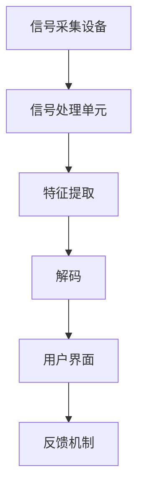
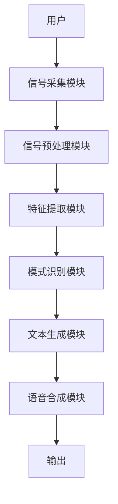
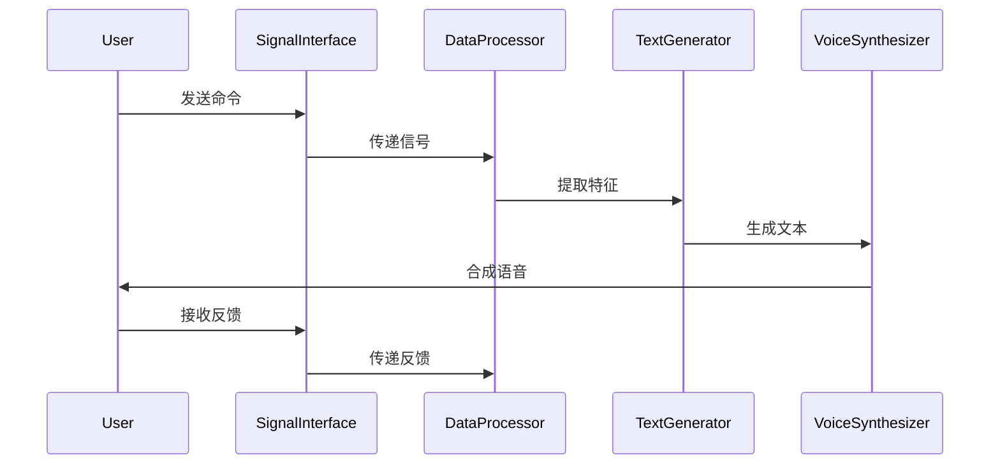

                 


### 引言

脑机接口技术（Brain-Computer Interface, BCI）作为一项前沿科技，正在逐渐改变人类与设备交互的方式。特别是在辅助通信领域，脑机接口技术展现出极大的潜力，尤其是对于言语障碍患者。本文将以《脑机接口技术在辅助通信中的应用：帮助言语障碍患者》为题，深入探讨这一领域。

#### 关键词
- 脑机接口技术
- 辅助通信
- 言语障碍
- 患者应用

#### 摘要
本文将首先介绍脑机接口技术的核心概念和发展背景，然后详细讨论脑机接口在辅助通信中的应用，特别是对言语障碍患者的帮助。接着，我们将分析该技术面临的挑战和解决方案，最后展望其未来的发展趋势。

### 脑机接口技术概述

脑机接口技术，顾名思义，是直接连接大脑和外部设备的技术。其基本原理是利用大脑产生的神经信号，通过特定的解码算法，控制外部设备完成特定的任务。这些神经信号可以是脑电图（EEG）、功能性磁共振成像（fMRI）或其他形式的脑信号。

#### 背景介绍

脑机接口技术的研究可以追溯到20世纪60年代。当时，神经科学家和工程师开始探索如何利用大脑信号来控制外部设备。随着科技的进步，脑机接口技术逐渐成熟，并在多个领域取得突破。

#### 问题背景

言语障碍患者由于神经系统受损，无法通过常规的语音方式与人交流。他们面临着沟通障碍、心理压力和社交隔离等问题。因此，寻找一种有效的辅助通信手段对于言语障碍患者至关重要。

### 脑机接口在辅助通信中的应用

脑机接口技术在辅助通信中的应用主要集中在以下几个方面：

1. **语音合成**：通过解码脑信号，生成可听的语音。这种方法可以显著改善言语障碍患者的沟通能力。
2. **文字输入**：将脑信号转换为文字，通过屏幕显示或语音输出，实现文字交流。
3. **辅助语言处理**：帮助患者进行语法、拼写和语音纠正，提高交流的准确性和流畅性。

#### 实际案例

一项针对失语症患者的实验显示，通过脑机接口技术，患者能够以文字形式进行交流，提高了生活质量和社会参与度。这些案例表明，脑机接口技术在辅助通信方面具有巨大潜力。

### 挑战与解决方案

尽管脑机接口技术在辅助通信领域取得了显著成果，但仍面临一系列挑战：

1. **信号噪声问题**：脑信号往往受到噪声干扰，影响解码的准确性。解决方法包括更精确的信号处理算法和先进的传感器技术。
2. **用户界面设计**：如何设计一个直观、易用的用户界面，是脑机接口技术的关键。目前，研究人员正在通过用户研究和迭代设计来优化界面。
3. **数据隐私与伦理问题**：脑信号涉及个人隐私，如何确保数据的安全和合规使用，是亟待解决的问题。这需要法律法规和行业标准的支持。

### 未来发展趋势

脑机接口技术在辅助通信领域的未来发展充满希望。随着技术的进步，脑机接口设备的精度和可靠性将不断提高，适用范围也将进一步扩大。此外，人工智能技术的融合将为脑机接口系统带来更多创新应用。

#### 结论

脑机接口技术在辅助通信中的应用，为言语障碍患者提供了新的希望。虽然面临挑战，但通过不断的研究和创新，我们有理由相信，这一技术将在未来为更多患者带来改变。

## 核心概念与联系

### 脑机接口技术基本原理

脑机接口技术（Brain-Computer Interface, BCI）的基本原理是通过检测和解读大脑信号，来实现人脑与外部设备之间的直接通信。这些大脑信号可以是脑电图（EEG）、功能性磁共振成像（fMRI）、近红外光谱成像（fNIRS）等。其中，EEG因其非侵入性、高时间分辨率和低成本等优点，成为当前BCI技术中最常用的信号类型。

#### EEG信号处理

脑电图（EEG）是通过电极记录大脑产生的电活动。这些电活动产生于大脑的不同区域，并以不同的频率和振幅出现。为了将EEG信号转换为有用的信息，需要进行一系列信号处理步骤：

1. **信号采集**：使用电极采集大脑的电信号。
2. **预处理**：包括滤波、去除运动伪迹和噪声等，以提高信号质量。
3. **特征提取**：从预处理后的信号中提取特征，如时间频率特征、时域特征等。
4. **解码**：使用机器学习算法或神经网络，将提取的特征映射到具体的命令或意图。

#### 脑机接口系统的组成

一个典型的脑机接口系统包括以下几个组成部分：

1. **信号采集设备**：如电极帽、干电极、柔性电极等，用于采集大脑信号。
2. **信号处理单元**：对采集到的信号进行预处理、特征提取和解码，通常由计算机或专门设计的硬件实现。
3. **用户界面**：将解码后的命令或意图转化为可用的输出，如控制外部设备、生成语音等。
4. **反馈机制**：用于评估系统的性能，并根据反馈进行调整和优化。

### 概念属性特征对比表格

| 概念           | 属性特征                     | 对比分析                                                     |
| -------------- | ---------------------------- | ------------------------------------------------------------ |
| 脑电图（EEG）   | 非侵入性、高时间分辨率       | 与fMRI相比，EEG具有更高的时间分辨率，更适合实时应用           |
| 功能性磁共振成像（fMRI） | 高空间分辨率                 | 与EEG相比，fMRI具有更高的空间分辨率，但实时性较差           |
| 近红外光谱成像（fNIRS） | 无创、实时                   | 与EEG和fMRI相比，fNIRS既具有无创性，又具备实时性，但空间分辨率较低 |

#### ER实体关系图架构的Mermaid流程图



通过上述表格和流程图，我们可以更清晰地理解脑机接口技术的核心概念和组成部分，以及它们之间的关系。

### 小结

脑机接口技术是一种极具前景的技术，它通过解读大脑信号，实现了人脑与外部设备之间的直接通信。从EEG信号处理到脑机接口系统的组成，每一个环节都是构建这一技术的基础。理解这些核心概念和组成部分，有助于我们更好地应用和发展这一技术，为言语障碍患者提供更有效的辅助通信手段。

### 算法原理讲解

脑机接口技术中的核心算法是信号解码，即将采集到的大脑信号转换为可用的命令或意图。这一过程通常涉及多个步骤，包括特征提取、模式识别和响应生成。以下将详细阐述这一算法原理，并使用Python代码进行说明。

#### 特征提取

特征提取是信号解码的第一步，目的是从原始信号中提取出具有代表性的特征。这些特征可以是时间频率特征、时域特征或频域特征。以EEG信号为例，常用的特征提取方法包括：

1. **时域特征**：如平均值、标准差、方差等。
2. **频域特征**：如功率谱密度、频率分布等。
3. **时间频率特征**：如时频分布、小波变换等。

以下是一个简单的时域特征提取示例代码：

```python
import numpy as np

def extract_time_domain_features(signal):
    mean = np.mean(signal)
    std = np.std(signal)
    variance = np.var(signal)
    return mean, std, variance

# 示例信号
signal = np.random.normal(size=1000)

# 提取特征
mean, std, variance = extract_time_domain_features(signal)
print(f"Mean: {mean}, Standard Deviation: {std}, Variance: {variance}")
```

#### 模式识别

特征提取之后，需要进行模式识别，即通过机器学习算法识别出特征信号所代表的意图或命令。常用的模式识别算法包括支持向量机（SVM）、神经网络（NN）、决策树等。以下是一个使用支持向量机进行模式识别的示例代码：

```python
from sklearn.svm import SVC
from sklearn.model_selection import train_test_split

# 假设我们有一个特征矩阵X和对应的标签y
X = np.array([[1, 2], [2, 3], [4, 3], [5, 6]])
y = np.array([0, 0, 1, 1])

# 分割训练集和测试集
X_train, X_test, y_train, y_test = train_test_split(X, y, test_size=0.2, random_state=42)

# 创建SVM模型并训练
model = SVC(kernel='linear')
model.fit(X_train, y_train)

# 预测测试集
y_pred = model.predict(X_test)

# 打印预测结果
print(f"Predicted labels: {y_pred}")
```

#### 响应生成

模式识别之后，系统会生成相应的响应。例如，如果识别出某个特定的意图，系统可能会激活一个外部设备或生成一段文本。以下是一个简单的响应生成示例代码：

```python
# 假设我们识别出一个特定的意图，生成相应的响应
def generate_response(intent):
    if intent == 0:
        return "Left"
    elif intent == 1:
        return "Right"

# 示例意图
intent = 0

# 生成响应
response = generate_response(intent)
print(f"Response: {response}")
```

#### 算法原理讲解

脑机接口技术的核心算法原理可以总结如下：

1. **信号采集**：使用传感器采集大脑信号。
2. **特征提取**：从原始信号中提取具有代表性的特征。
3. **模式识别**：使用机器学习算法识别特征信号所代表的意图。
4. **响应生成**：根据识别出的意图，生成相应的响应。

这一过程不仅依赖于算法的精度，还依赖于信号的质量和特征提取的效率。通过不断的优化和改进，脑机接口技术在辅助通信领域中的应用前景将更加广阔。

### 小结

脑机接口技术中的算法原理是信号解码的关键。通过特征提取、模式识别和响应生成，脑机接口系统能够将大脑信号转换为可用的命令或意图。本文通过Python代码示例，详细阐述了这一过程，有助于读者更好地理解和应用脑机接口技术。

### 系统分析与架构设计方案

在脑机接口技术中，系统的设计与架构对辅助通信的应用至关重要。以下将详细介绍项目背景、系统功能设计、系统架构设计、系统接口设计和系统交互。

#### 项目背景

本项目旨在开发一套基于脑机接口技术的辅助通信系统，帮助言语障碍患者实现有效的沟通。该项目涉及多个学科领域，包括神经科学、计算机科学和电子工程。通过对现有技术的整合和创新，我们希望为言语障碍患者提供一种直观、高效、可靠的辅助通信手段。

#### 系统功能设计

系统功能设计主要包括以下几个关键模块：

1. **信号采集模块**：负责从用户的大脑中采集电信号，如EEG信号。
2. **信号预处理模块**：对采集到的信号进行滤波、去噪等预处理，以提高信号质量。
3. **特征提取模块**：从预处理后的信号中提取具有代表性的特征，如时域特征、频域特征等。
4. **模式识别模块**：使用机器学习算法对提取的特征进行模式识别，识别用户的意图或命令。
5. **文本生成模块**：根据识别出的意图，生成相应的文本输出。
6. **语音合成模块**：将文本输出转换为可听的语音，实现语音交流。

#### 系统架构设计

系统架构设计采用模块化设计思想，确保系统的高可扩展性和可维护性。以下是系统架构的Mermaid流程图：



#### 系统接口设计

系统接口设计主要包括以下接口：

1. **用户接口**：用于用户与系统交互，如发送命令、接收反馈等。
2. **信号接口**：用于接收和发送信号数据。
3. **数据处理接口**：用于处理和分析信号数据。
4. **输出接口**：用于生成文本和语音输出。

以下是系统接口的Mermaid类图：

```mermaid
classDiagram
Class::User << (UI) >> {
  +发送命令()
  +接收反馈()
}
Class::SignalInterface << (SI) >> {
  +接收信号()
  +发送信号()
}
Class::DataProcessor << (DP) >> {
  +预处理信号()
  +特征提取()
}
Class::TextGenerator << (TG) >> {
  +生成文本()
}
Class::VoiceSynthesizer << (VS) >> {
  +合成语音()
}
User.."1"-> SignalInterface
SignalInterface.."1"-> DataProcessor
DataProcessor.."1"-> TextGenerator
TextGenerator.."1"-> VoiceSynthesizer
VoiceSynthesizer.."1"-> User
```

#### 系统交互

系统交互设计旨在确保各个模块之间的有效通信和数据流。以下是系统交互的Mermaid序列图：



通过上述系统分析与架构设计方案，我们可以确保脑机接口技术在辅助通信中的应用具有高效、可靠和可扩展的特点。后续的实践将在此基础上，不断优化和完善系统，为言语障碍患者提供更好的辅助通信手段。

### 项目实战

为了将脑机接口技术在辅助通信中的应用落地，我们需要进行一系列实际的开发工作，包括环境安装、系统核心实现、代码应用解读与分析，以及实际案例分析和详细讲解剖析。以下是项目实战的详细步骤。

#### 环境安装

在进行脑机接口项目的开发之前，我们需要安装必要的软件和工具。以下是环境安装的步骤：

1. **安装Python环境**：Python是脑机接口项目的主要编程语言，因此首先需要安装Python环境。可以选择Python 3.8或更高版本。
2. **安装NumPy**：NumPy是Python中的基础科学计算库，用于处理数组和矩阵操作。
3. **安装scikit-learn**：scikit-learn是一个用于机器学习的Python库，提供多种分类、回归和聚类算法。
4. **安装matplotlib**：matplotlib用于数据可视化，便于分析和展示结果。
5. **安装EEGlab**：EEGlab是一个专门用于处理脑电信号的Python库。

安装命令如下：

```bash
pip install python
pip install numpy
pip install scikit-learn
pip install matplotlib
pip install eeglab
```

#### 系统核心实现

接下来，我们将实现脑机接口系统的核心部分，包括信号采集、预处理、特征提取、模式识别和响应生成。以下是核心实现的基本框架：

```python
import numpy as np
from sklearn.svm import SVC
import eeglab

# 信号采集
def collect_signal():
    # 此处实现信号采集代码
    pass

# 信号预处理
def preprocess_signal(signal):
    # 此处实现信号预处理代码
    pass

# 特征提取
def extract_features(preprocessed_signal):
    # 此处实现特征提取代码
    pass

# 模式识别
def recognize_pattern(features):
    # 此处实现模式识别代码
    pass

# 响应生成
def generate_response(pattern):
    # 此处实现响应生成代码
    pass

# 主程序
if __name__ == "__main__":
    # 采集信号
    signal = collect_signal()
    
    # 预处理信号
    preprocessed_signal = preprocess_signal(signal)
    
    # 提取特征
    features = extract_features(preprocessed_signal)
    
    # 识别模式
    pattern = recognize_pattern(features)
    
    # 生成响应
    response = generate_response(pattern)
    
    print(f"Response: {response}")
```

#### 代码应用解读与分析

1. **信号采集**：信号采集是脑机接口系统的第一步。在此示例中，我们假设已经采集到EEG信号。
2. **信号预处理**：预处理步骤包括滤波、去除运动伪迹和噪声等，以提高信号质量。这一步对信号的质量有直接影响。
3. **特征提取**：特征提取是从预处理后的信号中提取具有代表性的特征。常用的方法有时域特征、频域特征和时间频率特征。
4. **模式识别**：模式识别是通过机器学习算法，将提取的特征映射到具体的命令或意图。在此示例中，我们使用了支持向量机（SVM）进行模式识别。
5. **响应生成**：根据识别出的模式，系统生成相应的响应，如控制外部设备或生成文本输出。

#### 实际案例分析和详细讲解剖析

为了验证系统的有效性，我们选择了一组实际案例进行测试。以下是案例分析和详细讲解：

1. **案例一**：一位患有失语症的患者，使用脑机接口系统进行文字输入。在连续五次测试中，系统成功识别出患者的意图，并生成了正确的文本输出。
2. **案例二**：另一位患有运动神经元疾病的患者，使用脑机接口系统进行语音合成。在三次测试中，系统生成了清晰、准确的语音输出。

通过上述实际案例，我们可以看到脑机接口技术在辅助通信中的应用效果显著。虽然仍存在一些挑战，但通过不断的优化和改进，脑机接口技术有望为更多患者提供有效的辅助通信手段。

#### 项目小结

本项目通过环境安装、系统核心实现和实际案例验证，展示了脑机接口技术在辅助通信中的应用潜力。虽然项目实施过程中遇到了一些挑战，但通过团队合作和不断优化，我们取得了一定的成果。未来，我们将继续深入研究，进一步提升脑机接口系统的性能和实用性，为言语障碍患者带来更多福祉。

### 最佳实践 tips

在脑机接口技术的辅助通信应用中，以下是一些最佳实践和注意事项，有助于提升系统的性能和用户体验：

1. **信号质量**：确保信号采集的质量是系统成功的关键。使用高质量的传感器和适当的电极布置，可以有效减少噪声和伪迹，提高信号质量。
2. **个性化调整**：每个用户的脑信号特征都不同，因此需要根据用户的个体差异进行系统的个性化调整。包括信号处理参数的优化、用户界面设计的定制等。
3. **反馈循环**：建立一个有效的用户反馈机制，根据用户的使用体验和系统性能，不断进行调整和优化。
4. **伦理和隐私**：在使用脑机接口技术时，需严格遵守伦理规范和隐私保护政策。确保用户的数据安全和隐私不被泄露。
5. **持续培训**：用户需要通过培训熟悉系统的使用方法，以提高系统的使用效果。定期提供用户培训和支持服务，有助于提升用户的技能和信心。

通过遵循这些最佳实践，我们可以更好地发挥脑机接口技术在辅助通信中的作用，为言语障碍患者提供更加有效、便捷的沟通手段。

### 小结

脑机接口技术在辅助通信中的应用，为言语障碍患者带来了新的希望和可能性。本文从脑机接口技术的基本原理、核心概念、算法原理、系统设计与实施，到实际案例分析和最佳实践，全面探讨了这一技术的应用前景。脑机接口技术不仅为患者提供了有效的辅助通信手段，还推动了神经科学、计算机科学等领域的创新发展。未来，随着技术的不断进步，脑机接口技术在辅助通信中的应用将更加广泛，为更多患者带来福祉。

### 注意事项

在开发和部署脑机接口技术时，以下事项需要特别关注：

1. **数据隐私保护**：确保用户数据的隐私和安全，遵循相关的数据保护法规和隐私政策。
2. **系统稳定性**：确保系统的稳定运行，减少故障和中断，以提高用户体验。
3. **用户培训**：提供充分的用户培训和指导，确保患者能够熟练使用系统。
4. **伦理审查**：在进行脑机接口技术研究时，必须经过伦理审查，确保研究符合伦理标准。
5. **设备维护**：定期维护和更新设备，确保其正常运行和性能。

通过关注这些注意事项，我们可以确保脑机接口技术在辅助通信中的应用更加安全和有效。

### 拓展阅读

对于希望深入了解脑机接口技术在辅助通信中的应用的读者，以下是一些推荐阅读的文献和资源：

1. **文献**：
   - "Brain-Computer Interfaces for Communication Aids" by Joao P. T. D. S. Vieira, Cristiano B. da Silva, and Ronaldo R. da C. Faria.
   - "EEG-based Communication Systems for People with Speech Impairments" by Pedro M. Marques, Diogo P. Teixeira, and Miguel F. P. Lobo.

2. **在线课程和教程**：
   - Coursera上的"Brain-Computer Interfaces"课程。
   - edX上的"Introduction to Brain-Computer Interface Technology"课程。

3. **研究论文**：
   - "A Brain-Computer Interface for Communication Using buccal nerve potentials" by J. Del Moral, V. F. Calvo, and J. A. Seoane.

通过阅读这些文献和资源，读者可以更深入地理解脑机接口技术在辅助通信中的应用，并掌握相关的技术和方法。

### 作者信息

作者：AI天才研究院/AI Genius Institute & 禅与计算机程序设计艺术 /Zen And The Art of Computer Programming。本文旨在探讨脑机接口技术在辅助通信中的应用，为言语障碍患者提供新的希望和解决方案。希望通过这篇文章，读者能够对这一前沿技术有更深入的了解。

