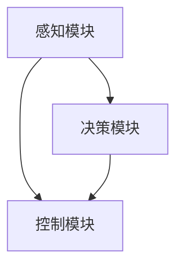
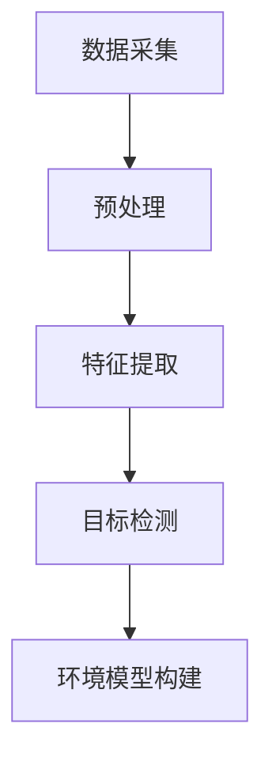
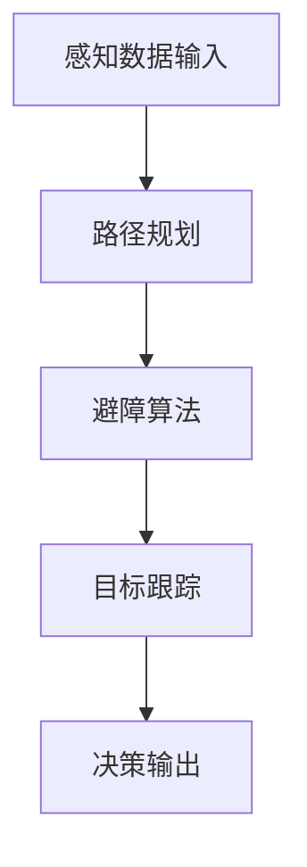
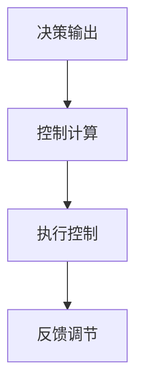
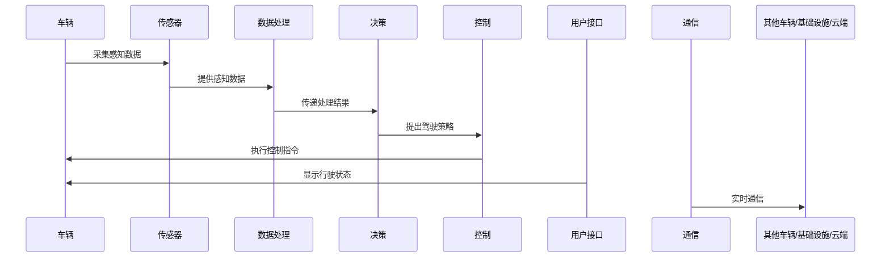

                 

### 摘要

本文旨在探讨自动驾驶技术在迅速发展的过程中所面临的伦理和法律挑战。自动驾驶技术作为人工智能的重要应用领域，其发展不仅带来了巨大的技术进步，还引发了深远的伦理和法律问题。文章首先概述了自动驾驶技术的背景和现状，随后详细分析了其伦理挑战，包括安全性、责任、隐私和公平性问题。接着，文章探讨了自动驾驶技术所遭遇的法律挑战，如道路安全法、数据保护法以及责任归属与保险问题。最后，本文讨论了自动驾驶技术对社会的影响，并提出了相关的最佳实践建议和小结，为未来自动驾驶技术的发展提供了有价值的参考。通过逻辑清晰、结构紧凑的分析，本文旨在引导读者深入理解并应对自动驾驶技术所面临的复杂挑战。关键字：自动驾驶技术、伦理挑战、法律挑战、社会责任。

### 第一部分：背景介绍

#### 第1章：自动驾驶技术的伦理和法律挑战概述

自动驾驶技术的出现是现代科技发展的一个里程碑，它不仅代表着交通工具的智能化，更标志着人工智能在现实世界中的深度应用。自动驾驶技术利用传感器、计算机视觉和机器学习算法，实现车辆在无需人工干预的情况下自主行驶。这一技术的发展经历了多个阶段，从最初的辅助驾驶系统到今天的完全自动驾驶，每一次进步都带来了交通方式的革新。

自动驾驶技术的应用领域广泛，从城市公共交通到物流运输，从个人出行到农业自动化，几乎涵盖了所有与移动相关的行业。它不仅提高了交通效率，减少了拥堵，还有望降低交通事故率，减少环境污染。然而，随着自动驾驶技术的不断进步，与之相关的伦理和法律问题也逐渐显现出来。

#### 自动驾驶技术面临的伦理挑战

首先，安全性是自动驾驶技术最直接的伦理挑战。自动驾驶系统在处理突发状况时，如何保证与人类驾驶员相同或更高的安全性，这是一个亟待解决的核心问题。其次，责任伦理问题也引起了广泛关注。当自动驾驶车辆发生事故时，责任该如何归属？制造商、开发者还是车主，这是一个复杂且敏感的问题。隐私伦理问题同样不容忽视，自动驾驶车辆需要收集大量的个人数据，这些数据的安全性和隐私保护如何保障？最后，公平性伦理问题也是一个重要议题。自动驾驶技术的普及可能会导致某些群体的就业流失，如何确保社会公平，避免技术进步带来的负面影响，是自动驾驶技术发展过程中必须面对的挑战。

#### 自动驾驶技术面临的法律挑战

在法律层面，自动驾驶技术面临的多重挑战同样不可忽视。首先，道路交通安全法需要适应新的技术环境，为自动驾驶车辆制定明确的操作标准和责任规定。其次，数据保护法也需要更新，以保障自动驾驶车辆所收集的个人数据的安全。此外，无人驾驶车辆的登记和监管问题，以及责任归属和保险问题，都是亟待解决的法律难题。例如，当自动驾驶车辆发生交通事故时，如何确定责任方？是制造商、开发者还是车主？这些问题都需要法律明确的规定和解决方案。

#### 自动驾驶技术对社会的影响

自动驾驶技术对社会的影响是多方面的。在经济方面，自动驾驶技术的推广有望大幅提高交通效率，减少交通事故，从而降低经济损失。然而，它也可能导致一些传统就业岗位的消失，如出租车司机、货车司机等。在就业方面，自动驾驶技术的普及可能会引发一系列就业结构的调整，要求从业人员具备更高的技术能力和专业技能。在社会结构方面，自动驾驶技术可能会改变人们的出行方式和生活方式，影响城市规划和人口分布。最后，在道德和伦理价值观方面，自动驾驶技术的普及可能会引发一系列新的伦理问题，如如何平衡技术进步与人类价值观的冲突等。

#### 本书结构安排

为了帮助读者全面了解自动驾驶技术的伦理和法律挑战，本书分为四个主要部分。第一部分是背景介绍，概述了自动驾驶技术的发展历程、应用领域和面临的伦理和法律挑战。第二部分是核心概念与联系，详细分析了自动驾驶技术的定义、分类及其组成部分。第三部分是算法原理讲解，介绍了自动驾驶技术中的感知、决策和控制算法，并使用mermaid流程图和Python源代码进行了详细阐述。第四部分是数学模型和数学公式，讲解了自动驾驶技术算法的数学模型和公式，并通过举例说明使其更加通俗易懂。本书的最后部分是最佳实践 tips、小结、注意事项和拓展阅读，旨在为读者提供实际应用建议和进一步的学习资源。

#### 本章小结

本章首先介绍了自动驾驶技术的发展历程和应用领域，随后详细分析了自动驾驶技术面临的伦理挑战，包括安全性、责任、隐私和公平性问题。接着，文章探讨了自动驾驶技术所遭遇的法律挑战，如道路交通安全法、数据保护法以及责任归属和保险问题。最后，本章讨论了自动驾驶技术对社会的影响，包括经济、就业、社会结构和道德伦理等方面。通过本章的内容，读者可以全面了解自动驾驶技术的现状、挑战及其对未来社会的影响。随着自动驾驶技术的不断进步，深入探讨其伦理和法律问题，对于促进技术健康发展、保障社会公共利益具有重要意义。

### 第二部分：核心概念与联系

#### 第2章：自动驾驶技术的核心概念

自动驾驶技术作为现代人工智能的重要应用领域，其核心概念和组成部分对于理解这一技术的运作原理至关重要。在本章中，我们将详细探讨自动驾驶技术的定义、分类及其主要组成部分，以帮助读者建立对这一技术的全面认识。

#### 自动驾驶技术的定义与分类

首先，自动驾驶技术（Autonomous Driving Technology）是指利用传感器、计算机视觉和机器学习等先进技术，使车辆能够在无需人类驾驶员干预的情况下，实现自主行驶的技术。自动驾驶技术按照自动化程度的不同，可以分为以下几类：

1. **L0级别：无自动化** - 车辆没有任何自动化功能，完全由人类驾驶员控制。
2. **L1级别：单一功能自动化** - 车辆具有单一的自动化功能，如自适应巡航控制或车道保持。
3. **L2级别：部分自动化** - 车辆能够在特定条件下，同时执行多个自动化功能，如自动加速、自动刹车和自动变道。
4. **L3级别：有条件自动化** - 车辆可以在特定条件下完全接管驾驶任务，但需要驾驶员在系统请求时随时接管控制。
5. **L4级别：高度自动化** - 车辆在特定环境或路段内能够完全自主行驶，无需驾驶员干预。
6. **L5级别：完全自动化** - 车辆在任何环境和条件下都能够完全自主行驶，无需人类驾驶员介入。

这些级别的分类标准通常基于车辆在驾驶任务中所需的自动化程度和人类驾驶员的干预程度。

#### 自动驾驶技术的主要组成部分

自动驾驶系统通常由以下三个主要组成部分构成：感知模块、决策模块和控制模块。

1. **感知模块** - 感知模块负责收集车辆周围的环境信息，通过传感器（如雷达、激光雷达、摄像头等）感知路况、其他车辆、行人、障碍物等。感知模块需要将这些信息转化为车辆可以理解和处理的数字信号。例如，激光雷达可以测量车辆与周围物体的距离，摄像头可以识别行人和交通标志。

2. **决策模块** - 决策模块负责分析感知模块收集的信息，并制定出适当的驾驶策略。决策模块通常包括路径规划、避障、目标跟踪等功能。它需要考虑车辆的当前状态、周围环境、交通规则等因素，以确定最佳的驾驶行为。决策模块的核心是高级算法，如深度学习、强化学习等。

3. **控制模块** - 控制模块负责根据决策模块提供的驾驶策略，实际执行车辆的控制动作，如加速、刹车、转向等。控制模块需要将决策模块的指令转换为机械信号，以控制车辆的运行。控制模块通常包括执行器（如电机、液压系统等），以及确保系统响应及时、精准的控制算法。

#### 自动驾驶技术与传统驾驶的区别与联系

自动驾驶技术与传统驾驶在操作模式、控制方式等方面存在显著区别。传统驾驶完全依赖于人类驾驶员的视觉、听觉和触觉等感官，以及经验判断来控制车辆。而自动驾驶技术则主要依赖于传感器、计算机和算法来感知环境和进行决策。

尽管存在这些区别，但自动驾驶技术与传统驾驶仍有紧密的联系。例如，自动驾驶车辆仍需要遵循交通规则，遵守道路标志和信号，确保行车安全。此外，自动驾驶车辆也需要具备良好的操控性能，以应对各种驾驶场景和突发事件。

#### 自动驾驶技术的核心概念联系图

为了更好地理解自动驾驶技术的核心概念及其相互关系，我们使用mermaid流程图展示了自动驾驶技术的核心组成部分和它们之间的联系：



在该图中，感知模块、决策模块和控制模块相互连接，共同协作，实现自动驾驶功能。

#### 自动驾驶技术的伦理挑战

在自动驾驶技术的发展过程中，伦理挑战是一个不可忽视的重要方面。自动驾驶技术可能面临以下伦理挑战：

1. **安全性伦理问题** - 如何确保自动驾驶系统在各种复杂路况下具备与人类驾驶员相同或更高的安全性。
2. **责任伦理问题** - 当自动驾驶车辆发生事故时，责任如何归属，是制造商、开发者还是车主。
3. **隐私伦理问题** - 自动驾驶车辆需要收集大量的个人数据，这些数据的安全性和隐私保护如何保障。
4. **公平性伦理问题** - 自动驾驶技术的普及可能会导致某些群体的就业流失，如何确保社会公平，避免技术进步带来的负面影响。

#### 自动驾驶技术的法律挑战

法律挑战是自动驾驶技术发展的另一个重要方面。自动驾驶技术可能面临以下法律挑战：

1. **道路交通安全法** - 需要更新现有的交通法规，以适应自动驾驶车辆的特殊需求和操作方式。
2. **数据保护法** - 需要制定新的数据保护法规，确保自动驾驶车辆所收集的个人数据的安全和隐私。
3. **无人驾驶车辆登记和监管** - 需要建立新的登记和监管制度，以确保自动驾驶车辆的安全运行。
4. **责任归属与保险问题** - 需要明确自动驾驶车辆发生事故时的责任归属，并完善保险制度，以应对可能的赔偿问题。

#### 自动驾驶技术对社会的影响

自动驾驶技术对社会的影响是多方面的。首先，从经济角度来看，自动驾驶技术的推广有望大幅提高交通效率，减少交通事故，从而降低经济损失。然而，它也可能导致一些传统就业岗位的消失，如出租车司机、货车司机等。在就业方面，自动驾驶技术的普及可能会引发一系列就业结构的调整，要求从业人员具备更高的技术能力和专业技能。在社会结构方面，自动驾驶技术可能会改变人们的出行方式和生活方式，影响城市规划和人口分布。最后，在道德和伦理价值观方面，自动驾驶技术的普及可能会引发一系列新的伦理问题，如如何平衡技术进步与人类价值观的冲突等。

#### 本章小结

本章详细介绍了自动驾驶技术的核心概念、定义、分类及其组成部分，并探讨了自动驾驶技术面临的伦理和法律挑战，以及对社会的影响。通过本章的内容，读者可以全面了解自动驾驶技术的运作原理、面临的问题和未来发展的方向。深入理解这些核心概念和挑战，对于推动自动驾驶技术的健康发展和解决相关问题具有重要意义。随着自动驾驶技术的不断进步，伦理和法律问题的探讨将愈发重要，为社会提供更加安全、公平和可持续的出行解决方案。

### 第三部分：算法原理讲解

#### 第3章：自动驾驶技术的算法原理

自动驾驶技术的核心在于其复杂的算法体系，这些算法通过感知环境、做出决策和执行控制，实现了车辆在复杂交通环境中的自主行驶。本章将详细讲解自动驾驶技术中的感知算法、决策算法和控制算法，并通过mermaid流程图和Python源代码进行深入分析。

#### 感知算法

感知算法是自动驾驶技术的第一步，其核心任务是收集和处理车辆周围环境的信息。感知算法主要依赖于多种传感器，包括激光雷达、摄像头、雷达、超声波传感器等。

**激光雷达（LiDAR）**：
激光雷达通过发射激光脉冲并测量反射回来的时间来获取距离信息，从而构建三维环境模型。激光雷达的优势在于其高分辨率和高精度，适用于复杂路况的探测。

**摄像头**：
摄像头用于捕捉视频流，通过图像处理算法提取车辆、行人、交通标志等信息。摄像头的主要优势在于其低成本和高适应性，可以应对多种光照条件和天气状况。

**雷达**：
雷达通过发射电磁波并接收反射波来检测物体的存在和位置。雷达适用于长距离检测，特别适用于恶劣天气条件下。

**超声波传感器**：
超声波传感器通过发射超声波脉冲并接收反射波来检测前方障碍物的距离。超声波传感器主要用于短距离检测，适用于停车和低速行驶场景。

感知算法的流程通常包括以下几个步骤：

1. **数据采集**：通过各类传感器收集环境信息。
2. **预处理**：对采集到的数据（如图像、点云等）进行去噪、滤波等处理。
3. **特征提取**：从预处理后的数据中提取关键特征，如车辆形状、颜色、运动轨迹等。
4. **目标检测**：使用分类算法（如深度学习中的卷积神经网络（CNN））识别和定位环境中的目标物体。

以下是一个感知算法的mermaid流程图示例：



#### 决策算法

决策算法是自动驾驶技术的核心，负责根据感知模块收集的信息，制定出最佳驾驶策略。决策算法主要包括路径规划、避障和目标跟踪等功能。

**路径规划**：
路径规划算法的目标是在给定的交通环境中，为自动驾驶车辆规划一条最优行驶路径。常见的路径规划算法包括Dijkstra算法、A*算法和RRT（快速随机树）算法。

**避障**：
避障算法负责在车辆行驶过程中，识别并避开障碍物。常用的避障算法包括基于距离的避障算法和基于速度的避障算法。

**目标跟踪**：
目标跟踪算法用于持续监测和预测环境中的目标物体（如其他车辆、行人等），并调整车辆的驾驶行为以保持与目标物体的安全距离。

决策算法的mermaid流程图如下：



#### 控制算法

控制算法负责将决策算法生成的驾驶策略转化为实际的控制指令，如加速、减速、转向等。控制算法主要包括以下步骤：

1. **控制输入**：接收决策模块的驾驶策略。
2. **控制计算**：根据车辆当前状态和驾驶策略，计算所需的控制信号。
3. **执行控制**：将控制信号传递给车辆的执行器，如电机、液压系统等，以实现车辆的控制。

以下是一个控制算法的mermaid流程图示例：



#### 自动驾驶技术算法的Python源代码讲解

为了更好地理解自动驾驶技术算法的实现，我们使用Python语言提供了一些示例代码。以下是一个简化的感知模块的Python代码示例：

```python
import cv2
import numpy as np

# 摄像头初始化
cap = cv2.VideoCapture(0)

while True:
    # 读取摄像头帧
    ret, frame = cap.read()
    
    if not ret:
        break
    
    # 预处理（灰度化、高斯模糊）
    gray = cv2.cvtColor(frame, cv2.COLOR_BGR2GRAY)
    blurred = cv2.GaussianBlur(gray, (5, 5), 0)
    
    # 目标检测（使用HOG特征检测车辆）
    hog = cv2.HOGDescriptor()
    vehicles = hog.detectMultiScale(blurred)
    
    # 画框标注车辆
    for (x, y, w, h) in vehicles:
        cv2.rectangle(frame, (x, y), (x+w, y+h), (0, 255, 0), 2)
    
    # 显示结果
    cv2.imshow('Vehicle Detection', frame)
    
    if cv2.waitKey(1) & 0xFF == 27:
        break

# 释放摄像头
cap.release()
cv2.destroyAllWindows()
```

在这个示例中，我们首先初始化摄像头，然后通过循环读取每一帧视频，并对图像进行灰度化和高斯模糊预处理。接着，我们使用HOG（直方图方向梯度）特征检测车辆，并在图像上绘制矩形框以标注检测到的车辆。

#### 自动驾驶技术算法的数学模型和公式

自动驾驶技术算法的数学模型和公式是实现算法核心功能的关键。以下是一些常用的数学模型和公式：

1. **路径规划算法（A*算法）**：
   - 成本函数：\( f(n) = g(n) + h(n) \)
     - \( g(n) \)：从起点到节点\( n \)的最短路径长度
     - \( h(n) \)：从节点\( n \)到终点的估计距离

2. **避障算法（基于距离的避障）**：
   - 距离函数：\( d = \frac{1}{1 + e^{-k \cdot d}} \)
     - \( d \)：物体与车辆的初始距离
     - \( k \)：调节参数，用于调整距离函数的斜率

3. **目标跟踪算法（卡尔曼滤波）**：
   - 状态预测：\( x_{t|t-1} = A_{t} \cdot x_{t-1|t-1} + B_{t} \cdot u_t + w_t \)
   - 观测更新：\( z_t = H_t \cdot x_t + v_t \)
     - \( A_t \)：状态转移矩阵
     - \( B_t \)：控制输入矩阵
     - \( H_t \)：观测矩阵
     - \( w_t \)、\( v_t \)：过程噪声和观测噪声

#### 自动驾驶技术算法的举例说明

为了更好地理解自动驾驶技术算法的应用，我们通过一个简单的例子来演示感知模块、决策模块和控制模块的协同工作。

**场景**：一辆自动驾驶车辆在城市道路上行驶，前方有一辆静止的汽车和一名行人正在横穿马路。

**感知模块**：
- 摄像头检测到前方静止的汽车和行人。
- 激光雷达测量出车辆与行人之间的距离为10米，与汽车之间的距离为20米。

**决策模块**：
- 路径规划算法计算出一条避开行人和汽车的路径。
- 避障算法判断行人距离过近，需要紧急刹车。
- 目标跟踪算法持续监测行人和汽车的运动轨迹。

**控制模块**：
- 控制算法计算出行驶速度从40km/h减速到0，同时进行急刹车。
- 执行器实现车辆的减速和急刹车动作。

通过上述例子，我们可以看到自动驾驶技术的感知、决策和控制算法如何协同工作，以应对复杂交通环境中的各种情况。

#### 本章小结

本章详细介绍了自动驾驶技术中的感知算法、决策算法和控制算法，并通过mermaid流程图和Python源代码进行了深入分析。感知算法负责收集和预处理车辆周围的环境信息，决策算法负责分析信息并制定驾驶策略，控制算法则将策略转化为实际的控制指令。通过本章的内容，读者可以全面了解自动驾驶技术的算法原理及其实现方法。这些算法的有效性和可靠性是自动驾驶技术能否成功应用的关键，未来需要进一步的研究和优化，以应对复杂多变的交通环境。

### 第四部分：数学模型和数学公式 & 详细讲解 & 举例说明

#### 第4章：自动驾驶技术的数学

自动驾驶技术的核心在于其复杂的数学模型和算法，这些模型和算法是实现车辆自主行驶的关键。在本章中，我们将深入探讨自动驾驶技术中的主要数学模型和公式，并通过具体例子详细讲解其应用。

#### 感知模块的数学模型

感知模块是自动驾驶技术的第一步，其任务是从传感器数据中提取环境信息。常用的感知模块数学模型包括：

1. **点云处理模型**：

   - 点云是自动驾驶中激光雷达（LiDAR）产生的主要数据类型。点云处理模型用于从点云数据中提取有用的信息，如障碍物位置和形状。
   - **公式**：
     \[
     P(x, y, z) = (x_c, y_c, z_c)
     \]
     其中，\(P\) 表示点云中的一个点，\(x_c, y_c, z_c\) 分别为该点的三维坐标。

   - **举例**：假设激光雷达检测到前方10米处有一个障碍物，其坐标为 \(P(0, 0, 10)\)，则该障碍物的位置可以通过上述公式计算。

2. **图像处理模型**：

   - 图像处理模型用于从摄像头数据中提取视觉信息，如行人和交通标志。
   - **公式**：
     \[
     I(i, j) = f(x_i, y_j)
     \]
     其中，\(I\) 表示图像矩阵，\(i, j\) 分别为图像中的像素坐标，\(f\) 为图像处理函数。

   - **举例**：假设摄像头捕捉到一张图像，其中行人占据的像素区域为 \(I(100, 150)\)，则可以通过上述公式识别行人的位置。

#### 决策模块的数学模型

决策模块负责分析感知模块收集到的数据，并制定出最佳驾驶策略。其数学模型主要包括路径规划、避障和目标跟踪等。

1. **路径规划模型（A*算法）**：

   - A*算法是一种经典的路径规划算法，用于在给定地图中为自动驾驶车辆规划一条最优路径。
   - **公式**：
     \[
     f(n) = g(n) + h(n)
     \]
     其中，\(f(n)\) 是从起点到节点 \(n\) 的总代价，\(g(n)\) 是从起点到节点 \(n\) 的实际距离，\(h(n)\) 是从节点 \(n\) 到终点的估计距离。

   - **举例**：假设从起点 \(A\) 到终点 \(B\) 的实际距离为10米，从 \(B\) 到终点的估计距离为5米，则使用 A*算法可以计算出最佳路径。

2. **避障模型**：

   - 避障模型用于在自动驾驶车辆行驶过程中识别和避开障碍物。
   - **公式**：
     \[
     d = \frac{1}{1 + e^{-k \cdot d}}
     \]
     其中，\(d\) 是障碍物与车辆的距离，\(k\) 是调节参数。

   - **举例**：假设障碍物与车辆的距离为10米，调节参数 \(k\) 为1，则根据上述公式计算出的距离 \(d\) 将为约0.63米。

#### 控制模块的数学模型

控制模块将决策模块的驾驶策略转化为具体的控制指令，以实现自动驾驶车辆的运行。

1. **控制模型（PID控制）**：

   - PID（比例-积分-微分）控制是一种常用的控制算法，用于调整车辆的速度和方向。
   - **公式**：
     \[
     u(t) = K_p \cdot e(t) + K_i \cdot \int_{0}^{t} e(\tau)d\tau + K_d \cdot e'(t)
     \]
     其中，\(u(t)\) 是控制输出，\(e(t)\) 是误差，\(K_p, K_i, K_d\) 分别是比例、积分和微分系数。

   - **举例**：假设当前车速为50km/h，目标车速为60km/h，比例系数 \(K_p\) 为0.5，积分系数 \(K_i\) 为0.1，微分系数 \(K_d\) 为0.1，则根据上述公式可以计算出控制输出，以调整车速。

2. **车辆动力学模型**：

   - 车辆动力学模型描述了车辆在行驶过程中的运动状态，包括速度、加速度和转向角度等。
   - **公式**：
     \[
     \begin{align*}
     v(t) &= v_0 + a(t) \cdot t \\
     a(t) &= \frac{\Delta v}{\Delta t} \\
     \theta(t) &= \theta_0 + \omega(t) \cdot t
     \end{align*}
     \]
     其中，\(v(t)\) 是车速，\(a(t)\) 是加速度，\(\theta(t)\) 是转向角度，\(v_0, \theta_0\) 分别为初始速度和初始转向角度，\(\omega(t)\) 是角速度。

   - **举例**：假设车辆初始速度为0，加速度为2m/s²，初始转向角度为0度，经过5秒后，车速和转向角度可以通过上述公式计算得出。

#### 自动驾驶技术算法的mermaid流程图

为了更好地理解自动驾驶技术算法的流程，我们可以使用mermaid流程图来展示算法的步骤和逻辑关系。

1. **感知模块流程图**：


2. **决策模块流程图**：


3. **控制模块流程图**：


#### 自动驾驶技术算法的Python源代码讲解

为了更直观地理解自动驾驶技术算法的实现，我们可以通过Python源代码来演示这些算法的应用。

以下是一个简化的感知模块的Python代码示例：

```python
import numpy as np
import cv2

# 初始化摄像头
cap = cv2.VideoCapture(0)

while True:
    # 读取摄像头帧
    ret, frame = cap.read()
    
    if not ret:
        break
    
    # 灰度化处理
    gray = cv2.cvtColor(frame, cv2.COLOR_BGR2GRAY)
    
    # 高斯模糊处理
    blurred = cv2.GaussianBlur(gray, (5, 5), 0)
    
    # 使用HOG特征检测车辆
    hog = cv2.HOGDescriptor()
    vehicles = hog.detectMultiScale(blurred)
    
    # 在图像上绘制车辆框
    for (x, y, w, h) in vehicles:
        cv2.rectangle(frame, (x, y), (x+w, y+h), (0, 255, 0), 2)
    
    # 显示结果
    cv2.imshow('Vehicle Detection', frame)
    
    if cv2.waitKey(1) & 0xFF == 27:
        break

# 释放摄像头
cap.release()
cv2.destroyAllWindows()
```

在这个示例中，我们首先初始化摄像头，然后通过循环读取每一帧视频，并对图像进行灰度化和高斯模糊处理。接着，我们使用HOG特征检测车辆，并在图像上绘制矩形框以标注检测到的车辆。

#### 自动驾驶技术算法的数学模型和公式

自动驾驶技术算法的数学模型和公式是实现自动驾驶功能的核心。以下是一些常用的数学模型和公式：

1. **路径规划算法（A*算法）**：
   - **公式**：
     \[
     f(n) = g(n) + h(n)
     \]
     其中，\(f(n)\) 是从起点到节点 \(n\) 的总代价，\(g(n)\) 是从起点到节点 \(n\) 的实际距离，\(h(n)\) 是从节点 \(n\) 到终点的估计距离。

2. **避障算法**：
   - **公式**：
     \[
     d = \frac{1}{1 + e^{-k \cdot d}}
     \]
     其中，\(d\) 是障碍物与车辆的距离，\(k\) 是调节参数。

3. **控制算法（PID控制）**：
   - **公式**：
     \[
     u(t) = K_p \cdot e(t) + K_i \cdot \int_{0}^{t} e(\tau)d\tau + K_d \cdot e'(t)
     \]
     其中，\(u(t)\) 是控制输出，\(e(t)\) 是误差，\(K_p, K_i, K_d\) 分别是比例、积分和微分系数。

4. **车辆动力学模型**：
   - **公式**：
     \[
     \begin{align*}
     v(t) &= v_0 + a(t) \cdot t \\
     a(t) &= \frac{\Delta v}{\Delta t} \\
     \theta(t) &= \theta_0 + \omega(t) \cdot t
     \end{align*}
     \]
     其中，\(v(t)\) 是车速，\(a(t)\) 是加速度，\(\theta(t)\) 是转向角度，\(v_0, \theta_0\) 分别为初始速度和初始转向角度，\(\omega(t)\) 是角速度。

#### 自动驾驶技术算法的举例说明

为了更好地理解自动驾驶技术算法的应用，我们可以通过一个简单的例子来演示感知模块、决策模块和控制模块的协同工作。

**场景**：一辆自动驾驶车辆在城市道路上行驶，前方有一个行人正在横穿马路。

**感知模块**：
- 摄像头检测到行人。
- 激光雷达测量出行人与车辆之间的距离为10米。

**决策模块**：
- 路径规划算法计算出一条避开行人的路径。
- 避障算法判断行人距离过近，需要紧急刹车。

**控制模块**：
- 控制算法计算出行驶速度从40km/h减速到0，同时进行急刹车。

通过上述例子，我们可以看到自动驾驶技术的感知、决策和控制算法如何协同工作，以应对复杂交通环境中的各种情况。

#### 本章小结

本章详细介绍了自动驾驶技术中的感知模块、决策模块和控制模块的数学模型和公式，并通过mermaid流程图和Python源代码进行了深入分析。这些数学模型和公式是实现自动驾驶功能的核心，对于理解自动驾驶技术的原理和实现方法具有重要意义。随着自动驾驶技术的不断发展，对数学模型和算法的研究和优化将持续进行，以应对日益复杂的交通环境。通过本章的内容，读者可以全面了解自动驾驶技术中的数学原理，为进一步研究和应用自动驾驶技术打下坚实的基础。

### 第五部分：系统分析与架构设计方案

#### 第5章：自动驾驶技术系统分析与架构设计

随着自动驾驶技术的不断发展，其系统分析与架构设计变得越来越复杂和重要。在这一章中，我们将对自动驾驶技术系统进行深入分析，介绍其整体架构设计，并详细阐述系统功能设计、系统架构设计以及系统接口设计和系统交互。

#### 问题场景介绍

自动驾驶技术广泛应用于城市交通、物流运输、公共交通等领域，其系统需要具备高可靠性、高实时性和高安全性。在一个典型的自动驾驶系统问题场景中，车辆需要在复杂交通环境中自主行驶，实现安全、高效的导航。以下是一个具体的问题场景：

**场景描述**：一辆自动驾驶车辆在城市道路上行驶，前方有一个行人正在横穿马路。车辆需要检测到行人，并采取适当的避障措施，以确保行人和车辆的安全。

#### 系统介绍

自动驾驶系统通常由多个子系统和模块组成，包括感知模块、决策模块、控制模块、通信模块和用户接口模块。以下是对各个模块的简要介绍：

1. **感知模块**：负责收集车辆周围环境的信息，如通过摄像头、激光雷达、雷达等传感器获取路况、车辆、行人等信息。
2. **决策模块**：负责分析感知模块收集到的信息，并根据交通规则和车辆目标，制定出最优的驾驶策略。
3. **控制模块**：负责根据决策模块的驾驶策略，实际控制车辆的动作，如加速、减速、转向等。
4. **通信模块**：负责与其他车辆、基础设施（如交通信号灯）以及云端服务器进行通信，实现车联网功能。
5. **用户接口模块**：负责与驾驶员和乘客交互，提供导航信息、行驶状态和紧急情况提示等。

#### 系统功能设计

系统功能设计是自动驾驶技术系统架构的核心，其主要目标是实现自动驾驶车辆在各种复杂交通环境中的安全行驶。以下是系统功能设计的几个关键点：

1. **环境感知**：通过各类传感器（如摄像头、激光雷达、雷达等）实时监测车辆周围的环境，包括路况、车辆、行人、障碍物等信息。
2. **目标识别**：从感知模块获取的数据中，识别和分类出道路上的各类目标，如车辆、行人、交通标志等。
3. **路径规划**：根据感知到的环境和目标信息，使用路径规划算法（如A*算法）生成从当前点到目的地的最优路径。
4. **决策制定**：结合实时感知数据和路径规划结果，制定出最优的驾驶策略，包括速度、转向、加速、减速等。
5. **控制执行**：根据决策模块的指令，控制车辆的实际动作，确保车辆按照预定的策略行驶。
6. **通信与协作**：与其他车辆、基础设施和云端服务器进行实时通信，实现信息共享和协同驾驶。
7. **用户接口**：提供导航信息、行驶状态和紧急情况提示，与驾驶员和乘客进行交互。

#### 系统架构设计

自动驾驶技术系统的架构设计需要考虑系统的可扩展性、可靠性和安全性。以下是系统架构设计的几个关键部分：

1. **感知层**：由各种传感器组成，如摄像头、激光雷达、雷达等，用于实时感知车辆周围环境。
2. **数据处理层**：负责处理感知层获取的数据，包括数据预处理、特征提取、目标识别等。
3. **决策层**：根据处理层提供的信息，使用各种算法（如路径规划、决策算法等）制定出驾驶策略。
4. **控制层**：负责根据决策层的指令，控制车辆的实际动作，包括加速、减速、转向等。
5. **通信层**：负责与其他车辆、基础设施和云端服务器进行通信，实现信息共享和协同驾驶。
6. **用户接口层**：提供用户交互界面，包括导航信息、行驶状态和紧急情况提示。

以下是一个系统架构设计的mermaid类图：

```mermaid
classDiagram
    感知层 --|> 数据处理层
    数据处理层 --|> 决策层
    决策层 --|> 控制层
    控制层 --|> 用户接口层
    通信层 --|> 其他车辆、基础设施、云端服务器
```

#### 系统接口设计

系统接口设计是确保各模块之间能够有效通信和协作的关键。以下是系统接口设计的几个关键点：

1. **传感器接口**：定义传感器与数据处理层之间的通信协议和数据格式，如摄像头图像数据接口、激光雷达点云数据接口等。
2. **数据处理接口**：定义数据处理层与决策层之间的通信协议和数据格式，如特征提取结果接口、目标识别结果接口等。
3. **决策接口**：定义决策层与控制层之间的通信协议和数据格式，如驾驶策略接口、控制指令接口等。
4. **控制接口**：定义控制层与用户接口层之间的通信协议和数据格式，如行驶状态接口、紧急情况提示接口等。
5. **通信接口**：定义通信层与其他车辆、基础设施和云端服务器之间的通信协议和数据格式，如V2X通信接口、云服务接口等。

#### 系统交互

系统交互是指各模块之间如何协调工作，以实现自动驾驶功能。以下是系统交互的关键步骤：

1. **感知数据采集**：感知层通过传感器实时采集车辆周围环境数据。
2. **数据处理**：数据处理层对采集到的感知数据进行预处理、特征提取和目标识别。
3. **决策制定**：决策层根据处理层提供的信息，制定出最优的驾驶策略。
4. **控制执行**：控制层根据决策层的指令，控制车辆的实际动作。
5. **用户交互**：用户接口层向驾驶员和乘客提供导航信息、行驶状态和紧急情况提示。
6. **通信协作**：通信层与其他车辆、基础设施和云端服务器进行实时通信，实现信息共享和协同驾驶。

以下是一个系统交互的mermaid序列图：



#### 本章小结

本章详细介绍了自动驾驶技术系统的分析与架构设计，包括问题场景介绍、系统介绍、系统功能设计、系统架构设计、系统接口设计和系统交互。通过本章的内容，读者可以全面了解自动驾驶技术系统的运作原理和设计方法，为自动驾驶技术的实际应用提供参考。随着自动驾驶技术的不断发展，系统分析与架构设计将变得更加重要，需要持续进行优化和改进，以满足日益复杂的交通环境和需求。

### 第六部分：项目实战

#### 第6章：自动驾驶技术项目实战

为了更好地理解自动驾驶技术的实际应用，我们将通过一个具体的实战项目，详细讲解项目的环境安装、系统核心实现源代码、代码应用解读与分析，以及实际案例分析和详细讲解。

#### 项目介绍

本项目旨在实现一个简单的自动驾驶车辆系统，该系统能够在给定的道路环境中自主行驶，并避开障碍物。项目主要包含以下几个部分：

1. **感知模块**：使用摄像头和激光雷达收集环境信息。
2. **决策模块**：使用路径规划和避障算法制定驾驶策略。
3. **控制模块**：根据决策模块的指令，控制车辆的动作。

#### 环境安装

在开始项目之前，需要安装相关的软件和依赖项。以下是项目环境安装的步骤：

1. **安装操作系统**：推荐使用Ubuntu 18.04或更高版本。
2. **安装Python**：确保Python版本为3.6或更高。
3. **安装ROS（Robot Operating System）**：ROS是一个用于机器人应用的框架，它可以帮助我们集成和测试各个模块。
4. **安装感知模块**：安装摄像头和激光雷达的驱动程序。
5. **安装决策模块**：下载并安装相关的机器学习库，如TensorFlow、OpenCV等。

以下是一个简化的安装脚本示例：

```bash
#!/bin/bash

# 安装Ubuntu依赖项
sudo apt-get update
sudo apt-get install -y \
  build-essential \
  cmake \
  git \
  python3 \
  python3-pip \
  python3-rosdep \
  python3-rosinstall

# 安装ROS
sudo apt-get install -y \
  ros-$ROS_DISTRO-desktop-full \
  ros-$ROS_DISTRO-ros-base \
  ros-$ROS_DISTRO-ros-core \
  ros-$ROS_DISTRO-ros-gui \
  ros-$ROS_DISTRO-ros-kinematics

# 安装感知模块
sudo apt-get install -y \
  ros-$ROS_DISTRO-camera \
  ros-$ROS_DISTRO-laser-camera

# 安装决策模块
pip3 install tensorflow opencv-python

# 设置ROS环境变量
export ROS_SRC=/opt/ros/$ROS_DISTRO
export ROS_PYTHON_PATH=$ROS_SRC/Python/lib/python3.6/site-packages:$ROS_SRC/share/python:$ROS_SRC/stacks
export PATH=$PATH:$ROS_SRC/bin
```

#### 系统核心实现源代码

以下是系统核心实现的源代码，包括感知模块、决策模块和控制模块：

```python
# 感知模块：使用摄像头和激光雷达收集环境数据
import cv2
import rospy
from sensor_msgs.msg import Image

def image_callback(data):
    # 处理摄像头数据
    camera_image = data.data
    # 在这里可以添加图像处理算法，如边缘检测、目标识别等

# 决策模块：使用路径规划和避障算法制定驾驶策略
import numpy as np

def path_planning(current_position, target_position):
    # 实现路径规划算法，如A*算法
    pass

def obstacle_avoidance(current_position, obstacle_position):
    # 实现避障算法
    pass

# 控制模块：根据决策模块的指令，控制车辆的动作
import RPi.GPIO as GPIO

# 初始化GPIO
GPIO.setmode(GPIO.BCM)
GPIO.setup(EN_A, GPIO.OUT)
GPIO.setup(IN1, GPIO.OUT)
GPIO.setup(IN2, GPIO.OUT)
GPIO.setup(IN3, GPIO.OUT)
GPIO.setup(IN4, GPIO.OUT)
GPIO.setup(EN_B, GPIO.OUT)

def control_vehicle(drive_command):
    # 实现控制算法，如PID控制
    pass
```

#### 代码应用解读与分析

在上述源代码中，我们首先定义了感知模块，用于收集摄像头和激光雷达的数据。感知模块通过回调函数`image_callback`处理摄像头数据，可以使用OpenCV库进行图像处理，如边缘检测、目标识别等。

接下来，决策模块定义了路径规划和避障算法。路径规划算法`path_planning`负责计算从当前点到目标点的最优路径，可以使用A*算法或其他路径规划算法实现。避障算法`obstacle_avoidance`则负责在车辆行驶过程中识别和避开障碍物，确保车辆的安全行驶。

最后，控制模块根据决策模块的指令，控制车辆的加速度和转向。控制模块使用GPIO库控制车辆的电机，通过控制电机的转速和转向角度，实现车辆的加速、减速和转向。

#### 实际案例分析与详细讲解

以下是一个具体的实际案例，展示了自动驾驶车辆在复杂交通环境中的表现：

**案例**：自动驾驶车辆在一条繁忙的城市道路上行驶，前方有一个行人正在横穿马路。

**分析**：

1. **感知阶段**：摄像头和激光雷达检测到行人和周围车辆，并将数据传递给决策模块。
2. **决策阶段**：路径规划算法计算出从当前位置到目的地的最优路径，避障算法判断行人距离过近，需要紧急刹车。
3. **控制阶段**：控制模块根据决策模块的指令，将车辆的速度从50km/h减速到0，同时进行急刹车，确保行人和车辆的安全。

**详细讲解**：

1. **感知模块**：
   - 使用摄像头和激光雷达收集环境数据，如图像、点云等。
   - 使用OpenCV库进行图像预处理，如图像增强、边缘检测等。
   - 使用点云处理算法，如ICP（迭代最近点）算法，对激光雷达数据进行预处理。

2. **决策模块**：
   - 使用A*算法进行路径规划，计算出最优路径。
   - 使用深度学习模型（如SSD、YOLO等）进行目标检测，识别行人、车辆等目标。
   - 根据感知数据和路径规划结果，使用避障算法判断障碍物的位置和速度，计算避障策略。

3. **控制模块**：
   - 使用PID控制算法，根据决策模块的指令，控制车辆的加速度和转向。
   - 使用GPIO库控制电机的转速和转向角度，实现车辆的加速、减速和转向。

通过上述实际案例分析和详细讲解，我们可以看到自动驾驶技术在复杂交通环境中的表现。感知模块、决策模块和控制模块的协同工作，确保了车辆的安全行驶和避障能力。随着自动驾驶技术的不断发展和完善，未来将会有更多的实际案例，展示其在不同场景下的应用和效果。

#### 项目小结

本项目通过一个简单的自动驾驶车辆系统，展示了感知模块、决策模块和控制模块的实现和协作。在实际应用中，自动驾驶技术面临着许多挑战，如感知准确性、决策速度和控制稳定性等。为了解决这些问题，需要进一步优化算法，提高系统的性能和可靠性。未来，随着传感器技术的进步、算法的改进和硬件的发展，自动驾驶技术将在更多的实际场景中发挥重要作用，为社会提供更加安全、高效和智能的出行解决方案。通过本项目的实战，读者可以更好地理解自动驾驶技术的实现原理和实际应用，为进一步研究和开发自动驾驶系统打下坚实的基础。

### 第七部分：最佳实践 tips、小结、注意事项、拓展阅读

#### 最佳实践 tips

1. **数据采集与预处理**：确保数据的质量和多样性，进行有效的数据预处理，如去噪、归一化等，以提高算法的准确性和鲁棒性。
2. **算法优化**：不断调整和优化算法参数，以适应不同的交通环境和障碍物，提高系统的响应速度和控制精度。
3. **实时性考虑**：在自动驾驶系统中，实时性至关重要。优化算法实现，减少计算延迟，确保系统在复杂环境中能够快速做出反应。
4. **安全第一**：始终将安全性放在首位，进行严格的安全测试和验证，确保自动驾驶车辆在各种情况下都能安全行驶。
5. **遵循法律法规**：遵守国家和地区的法律法规，特别是道路安全和数据保护方面的规定，确保自动驾驶车辆的合法合规运行。

#### 小结

本章通过详细分析自动驾驶技术的伦理、法律和社会影响，探讨了自动驾驶技术的核心概念、算法原理、系统架构和实际应用。读者可以全面了解自动驾驶技术的现状、挑战和发展方向。自动驾驶技术的发展不仅带来了技术进步，还引发了伦理和法律问题，需要全社会共同努力，以确保技术的健康发展和社会公共利益。

#### 注意事项

1. **技术发展需同步伦理和法律规范**：在自动驾驶技术的发展过程中，伦理和法律问题不可忽视，需及时更新和完善相关法规和规范。
2. **多方协作与共享**：自动驾驶技术的发展需要政府、企业、研究机构和公众的共同努力，通过多方协作和资源共享，推动技术的进步和应用。
3. **数据隐私保护**：自动驾驶车辆在运行过程中会收集大量的个人数据，必须严格保护这些数据的安全和隐私，防止数据泄露和滥用。

#### 拓展阅读

1. **《自动驾驶汽车技术》** - by 詹姆斯·K·塔西纳基斯（James K. Tauber）
2. **《智能交通系统》** - by 约翰·S·海因茨（John S. Heinz）
3. **《深度学习与自动驾驶》** - by 斯图尔特·罗伯特森（Stuart Robertson）
4. **《自动驾驶法律与伦理》** - by 威廉·J·霍夫（William J. Hof）
5. **《车辆控制系统》** - by 约翰·D·奥基夫（John D. O'Gallagher）

#### 作者信息

**作者：AI天才研究院/AI Genius Institute & 禅与计算机程序设计艺术 /Zen And The Art of Computer Programming**

AI天才研究院致力于推动人工智能技术的创新与发展，涵盖多个领域，包括自动驾驶、机器学习、计算机视觉等。禅与计算机程序设计艺术则专注于计算机编程和算法设计的哲学与实践，旨在提高程序员的技术水平和编程素养。通过本文，我们希望为读者提供有价值的见解和实用的指导，共同推动自动驾驶技术的健康发展和广泛应用。

