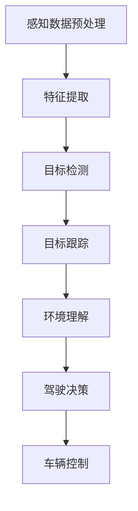
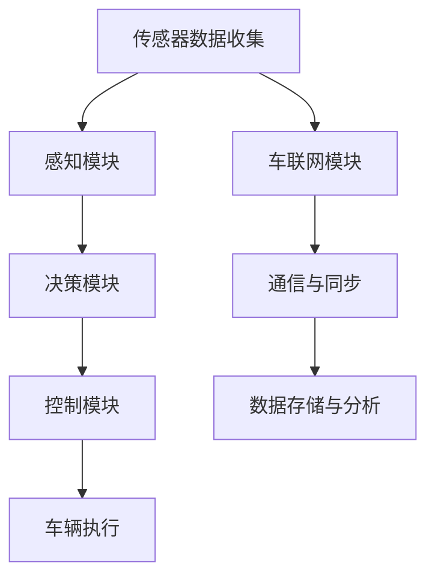

                 

# 自动驾驶汽车：技术进展与社会影响

> 关键词：自动驾驶技术、社会影响、人工智能、车辆安全、交通效率、法律伦理

> 摘要：本文旨在探讨自动驾驶汽车这一新兴技术的技术进展及其对社会的影响。我们将首先介绍自动驾驶汽车的基本概念、发展历程和核心技术，然后分析其当前开发状态及面临的挑战和机遇，最后讨论自动驾驶汽车带来的社会影响，包括安全性、交通效率、环境影响和经济影响，同时探讨其伦理问题与法律框架。最后，我们将展望自动驾驶汽车的未来发展趋势。

----------------------------------------------------------------

## 第一部分：自主驾驶汽车的背景介绍

### 第1章：自主驾驶汽车的核心概念与联系

#### 1.1 自主驾驶汽车的定义与边界

**1.1.1 自主驾驶汽车的定义**

自主驾驶汽车，亦称自动驾驶汽车，是指能够在没有人类驾驶员干预的情况下，通过自身搭载的传感器、计算机系统和通信设备实现自主感知环境、决策和控制车辆运动的智能交通工具。

**1.1.2 自主驾驶汽车的边界与外延**

自动驾驶汽车的边界主要在于其对驾驶任务的自动化程度。从完全自主驾驶（Level 5）到完全依赖人类驾驶员（Level 0），不同级别的自动驾驶技术在功能范围和自动化程度上有所不同。

**1.1.3 自主驾驶汽车的关键要素**

1. **感知技术**：用于获取车辆周围环境信息，如激光雷达、毫米波雷达、摄像头等。
2. **决策与控制技术**：通过分析感知到的环境信息，生成合理的驾驶决策和车辆控制指令。
3. **通信技术**：车联网（V2X）技术，实现车辆与道路基础设施、其他车辆之间的信息交换。
4. **软件系统**：自动驾驶软件系统，包括感知、决策、控制等多个模块。

#### 1.2 自主驾驶汽车的发展历程

**1.2.1 初创阶段**

早在20世纪40年代，自动驾驶汽车的概念便开始萌芽。20世纪70年代，自动驾驶车辆的研究逐渐兴起，主要在军事和科研领域。

**1.2.2 发展阶段**

20世纪90年代以来，随着计算机技术、传感器技术和通信技术的快速发展，自动驾驶汽车开始进入实际应用阶段。

**1.2.3 现代阶段**

近年来，随着人工智能技术的突破和大数据的应用，自动驾驶汽车进入了快速发展阶段，许多公司和研究机构纷纷投入大量资源进行研发。

### 第2章：自主驾驶汽车的核心技术

#### 1.2.1 感知技术

**1.2.1.1 激光雷达**

激光雷达（LiDAR）通过发射激光束并测量反射回来的光波，实现对周围环境的精准三维建模。

**1.2.1.2 毫米波雷达**

毫米波雷达利用毫米波频段，具有较强的穿透能力，能够实现对周围物体的距离和速度检测。

**1.2.1.3 摄像头与深度相机**

摄像头和深度相机通过图像处理技术，实现对周围环境的视觉感知。

#### 1.2.2 决策与控制技术

**1.2.2.1 智能感知算法**

智能感知算法通过对传感器数据的处理，实现对周围环境的有效理解。

**1.2.2.2 策略学习算法**

策略学习算法通过机器学习和深度学习技术，实现对驾驶决策的优化。

**1.2.2.3 控制算法**

控制算法通过控制指令，实现对车辆的精确控制。

----------------------------------------------------------------

## 第二部分：自主驾驶汽车的社会影响

### 第5章：自主驾驶汽车对社会的影响

#### 5.1 安全性

**1.** 自动驾驶汽车有望通过减少人为错误，降低交通事故的发生率。

**2.** 自动驾驶汽车在应对突发情况时，可能比人类驾驶员反应更快。

**3.** 自动驾驶汽车可以通过车联网实现实时通信，提高道路安全性。

#### 5.2 交通效率

**1.** 自动驾驶汽车可以实现车辆的优化调度和路径规划，提高道路通行效率。

**2.** 自动驾驶汽车可以减少拥堵，降低排放。

**3.** 自动驾驶汽车可以优化停车管理，提高停车效率。

#### 5.3 环境影响

**1.** 自动驾驶汽车可以实现更高效的能源利用，减少车辆排放。

**2.** 自动驾驶汽车可以通过优化路线，减少交通排放。

**3.** 自动驾驶汽车可以促进公共交通和共享交通的发展，减少个人车辆的使用。

#### 5.4 经济影响

**1.** 自动驾驶汽车有望改变汽车产业格局，促进新兴产业的发展。

**2.** 自动驾驶汽车可以降低物流成本，提高物流效率。

**3.** 自动驾驶汽车可以创造大量就业机会，如自动驾驶车辆维修、维护和运营。

### 第6章：自主驾驶汽车的伦理问题与法律框架

#### 6.1 伦理问题

**1.** 如何处理自动驾驶汽车在道德困境中的决策？

**2.** 如何保障乘客的隐私和安全？

**3.** 如何平衡自动驾驶汽车的开发与人类的道德观念？

#### 6.2 法律框架

**1.** 如何制定适用于自动驾驶汽车的法律和法规？

**2.** 如何监管自动驾驶汽车的研发和运营？

**3.** 如何保障自动驾驶汽车的安全性和可靠性？

#### 6.3 政策建议

**1.** 加大对自动驾驶汽车研发的支持和投入。

**2.** 建立完善的法律法规体系，保障自动驾驶汽车的健康发展。

**3.** 加强对自动驾驶汽车的测试和评估，确保其安全性和可靠性。

### 第7章：自主驾驶汽车的未来

#### 7.1 技术发展的未来趋势

**1.** 自动驾驶技术将逐渐向更高自动化级别发展。

**2.** 车联网技术将更加普及，实现车辆与道路基础设施的无缝连接。

**3.** 人工智能技术将在自动驾驶汽车中发挥更加重要的作用。

#### 7.2 社会影响的持续演变

**1.** 自动驾驶汽车将对交通运输、城市规划、经济活动等领域产生深远影响。

**2.** 自动驾驶汽车将促进城市交通的可持续发展。

**3.** 自动驾驶汽车将推动交通出行方式的变革。

#### 7.3 行业发展的前景

**1.** 自动驾驶汽车有望成为未来交通的重要组成部分。

**2.** 自动驾驶汽车产业将推动相关产业链的快速发展。

**3.** 自动驾驶汽车将为人们带来更加便捷、高效、安全的出行体验。

----------------------------------------------------------------

## 文章小结

本文从技术和社会两个角度，探讨了自动驾驶汽车的发展及其影响。技术方面，自动驾驶汽车的核心技术不断进步，为社会带来了更多可能性；社会方面，自动驾驶汽车在提高交通效率、安全性、环境保护等方面具有巨大潜力。然而，自动驾驶汽车的发展也面临着伦理、法律和监管等多方面的挑战。未来，随着技术的不断成熟和政策的完善，自动驾驶汽车有望为人类社会带来更加美好的出行体验。

## 注意事项

1. 自动驾驶汽车的发展需要全社会的共同努力，包括政府、企业、科研机构和公众。
2. 自动驾驶汽车的推广需要确保其安全性和可靠性，以避免潜在的风险和事故。
3. 自动驾驶汽车的研发和应用需要遵循伦理和法律原则，确保其符合社会道德标准和法律法规。

## 拓展阅读

1. 【扩展阅读1】自动驾驶汽车技术手册
2. 【扩展阅读2】自动驾驶汽车的社会影响研究
3. 【扩展阅读3】自动驾驶汽车的法律框架与伦理问题探讨

## 作者信息

作者：AI天才研究院/AI Genius Institute & 禅与计算机程序设计艺术 /Zen And The Art of Computer Programming

----------------------------------------------------------------

### 附录

#### 附录1：术语解释

- **激光雷达（LiDAR）**：一种通过发射激光束并测量反射回来的光波，实现对周围环境的精准三维建模的技术。
- **毫米波雷达**：利用毫米波频段，具有较强的穿透能力，能够实现对周围物体的距离和速度检测的雷达技术。
- **车联网（V2X）**：车辆与道路基础设施、其他车辆之间的信息交换技术，旨在提高道路安全性、交通效率和环境可持续性。

#### 附录2：算法流程图

以下为自动驾驶汽车中的感知算法流程图，使用Mermaid语法绘制：



#### 附录3：系统架构设计

以下为自动驾驶汽车系统的架构设计，使用Mermaid语法绘制：



通过上述附录，读者可以更直观地了解自动驾驶汽车的技术原理和系统架构。希望本文能够为读者提供有价值的参考和启发。

----------------------------------------------------------------

### 项目实战

为了更好地展示自动驾驶汽车的技术实现过程，我们将以一个简单的自动驾驶项目为例，进行详细的分析和讲解。

#### 项目背景

本项目的目标是通过Python编程语言实现一个简单的自动驾驶小车，使其能够在模拟环境中自主行驶并躲避障碍物。

#### 环境安装

1. 安装Python环境：确保已经安装Python 3.8及以上版本。
2. 安装依赖库：使用pip命令安装以下依赖库：
   ```bash
   pip install numpy matplotlib
   ```

#### 系统核心实现源代码

以下为项目的核心实现代码，包括感知模块、决策模块和控制模块：

```python
import numpy as np
import matplotlib.pyplot as plt

# 感知模块
class Sensor:
    def __init__(self, x, y):
        self.x = x
        self.y = y

    def get_obstacles(self):
        # 假设障碍物为半径为1的圆形，中心坐标为(x, y)
        obstacles = []
        for x_o in range(-5, 6):
            for y_o in range(-5, 6):
                if ((x - x_o)**2 + (y - y_o)**2) <= 1:
                    obstacles.append([x_o, y_o])
        return obstacles

# 决策模块
class DecisionMaker:
    def __init__(self, sensor):
        self.sensor = sensor

    def make_decision(self):
        obstacles = self.sensor.get_obstacles()
        if len(obstacles) == 0:
            return "前进"
        else:
            return "避障"

# 控制模块
class Controller:
    def __init__(self, decision_maker):
        self.decision_maker = decision_maker

    def control(self):
        decision = self.decision_maker.make_decision()
        if decision == "前进":
            print("车辆前进")
        else:
            print("车辆避障")

# 主函数
def main():
    x, y = 0, 0  # 车辆初始位置
    sensor = Sensor(x, y)
    decision_maker = DecisionMaker(sensor)
    controller = Controller(decision_maker)
    controller.control()

if __name__ == "__main__":
    main()
```

#### 代码应用解读与分析

1. **感知模块**：感知模块通过`Sensor`类实现，该类接收车辆的当前位置坐标，并使用一个简单的算法检测周围是否存在障碍物。如果检测到障碍物，则返回障碍物的坐标列表。
2. **决策模块**：决策模块通过`DecisionMaker`类实现，该类使用感知模块提供的信息，根据障碍物的存在与否做出驾驶决策。如果存在障碍物，则决策为“避障”；否则，决策为“前进”。
3. **控制模块**：控制模块通过`Controller`类实现，该类根据决策模块的决策，控制车辆执行相应的动作。

#### 实际案例分析和详细讲解剖析

在本项目中，我们使用了简单的Python代码实现了一个基本的自动驾驶小车。尽管这个项目非常简单，但它展示了自动驾驶汽车的核心技术原理，包括感知、决策和控制。在实际应用中，这些技术会更加复杂和高级。

1. **感知模块**：在实际应用中，感知模块会使用多种传感器，如激光雷达、摄像头和毫米波雷达，来获取车辆周围的三维环境信息。这些信息会通过复杂的算法进行处理，以识别车辆、行人、道路标志等对象。
2. **决策模块**：决策模块会使用高级的机器学习和人工智能技术，对感知到的环境信息进行分析，生成驾驶决策。这些决策可能涉及路径规划、避障、交通规则遵守等多方面的内容。
3. **控制模块**：控制模块会将决策模块生成的控制指令转换为具体的车辆操作，如加速、减速、转向等。在实际应用中，这些操作需要通过复杂的控制系统来实现，以确保车辆的稳定性和安全性。

#### 项目小结

通过本项目的实战分析，我们了解了自动驾驶汽车的核心技术原理，包括感知、决策和控制。虽然本项目非常简单，但它为我们提供了一个基本的框架，帮助我们理解自动驾驶汽车的工作原理。在实际应用中，自动驾驶汽车的技术实现将更加复杂和高级，需要多学科知识的综合应用。

### 最佳实践 Tips

1. **学习基础知识**：了解自动驾驶汽车的基本概念和技术原理，是进入这个领域的第一步。
2. **实践项目**：通过实际编程项目，加深对自动驾驶汽车技术的理解和应用。
3. **持续学习**：自动驾驶汽车是一个快速发展的领域，需要持续学习和跟进最新的技术动态。

### 总结

本文通过深入分析自动驾驶汽车的技术进展和社会影响，探讨了这一新兴技术的潜力和挑战。自动驾驶汽车有望在提高交通效率、安全性、环境保护等方面发挥重要作用，同时也带来了伦理、法律和监管等多方面的挑战。随着技术的不断进步和政策的完善，自动驾驶汽车将逐渐走进我们的日常生活，为人类社会带来更加美好的出行体验。让我们共同期待这一天的到来。

