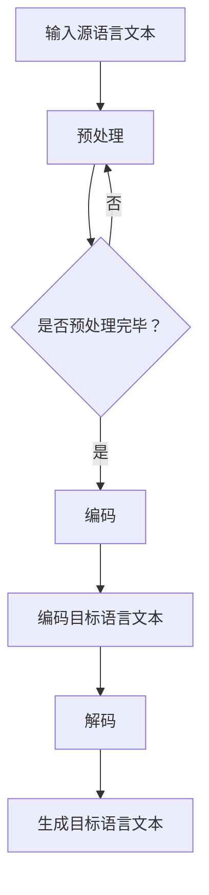
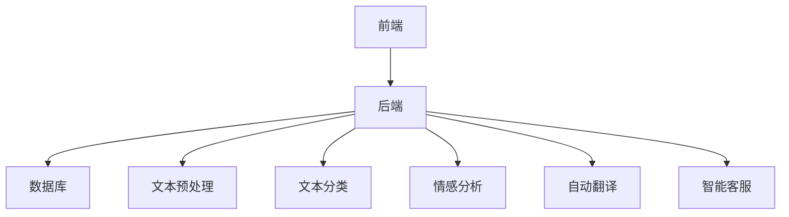
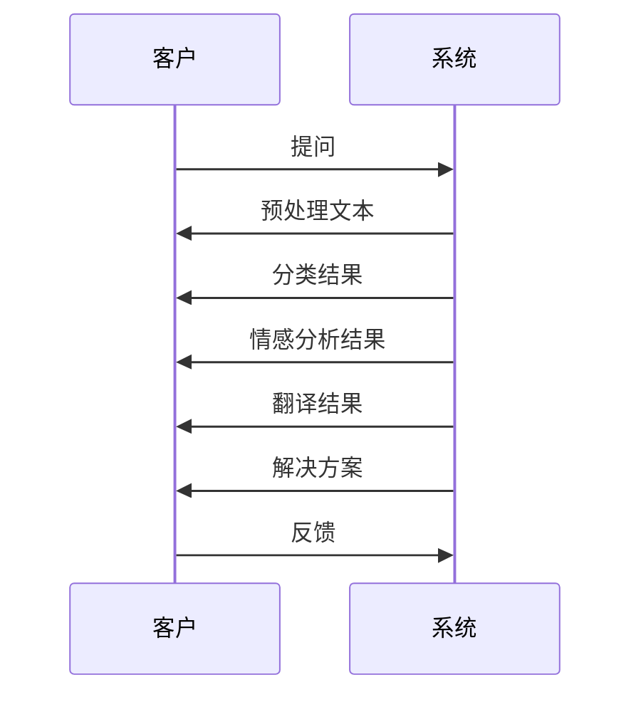

                 

 # 引言

# 《自然语言处理在多语言客户支持中的应用：提供全球化服务》

关键词：自然语言处理，多语言客户支持，全球化服务，NLP技术，算法原理

摘要：本文旨在探讨自然语言处理（NLP）技术在多语言客户支持中的应用，帮助企业在全球化背景下提升客户服务质量和效率。通过介绍NLP的核心概念、技术方法和实际应用，本文旨在为NLP领域的研究人员、工程师及客户服务从业者提供有价值的参考。

## 引言

### 书名与目的

本书名为《自然语言处理在多语言客户支持中的应用：提供全球化服务》，旨在为从事多语言客户支持的企业和个人提供系统、实用的NLP技术指导。随着全球化的发展，多语言客户支持成为企业国际化的关键环节，而NLP技术则为解决语言障碍和文化差异提供了有效途径。本书通过详细阐述NLP的核心概念、技术方法和实际应用，帮助读者深入了解如何利用NLP技术提升多语言客户支持的质量和效率。

### 主要受众

本书适用于以下几类读者：

1. **NLP领域的研究人员**：通过本书，研究人员可以掌握NLP技术的最新发展动态，了解其在多语言客户支持中的应用前景。
2. **NLP工程师**：本书将为工程师提供实用的技术指南，帮助他们设计和实现高效的NLP系统。
3. **客户服务从业者**：从事客户服务工作的专业人士可以通过本书，了解NLP技术在客户支持中的应用，提升服务质量。

### 书的结构与内容

本书分为以下几个部分：

1. **引言**：介绍书名、目的和主要受众。
2. **背景介绍**：阐述NLP在多语言客户支持中的重要性，以及为何选择本书的主题。
3. **核心概念与联系**：介绍NLP的核心概念、原理和主要技术，并绘制概念属性特征对比表格和ER实体关系图架构。
4. **算法原理讲解**：介绍NLP中的常见算法原理，并使用mermaid画出算法流程图和python源代码进行详细阐述。
5. **系统分析与架构设计方案**：介绍NLP系统在多语言客户支持中的应用场景，设计系统功能、架构、接口和交互。
6. **项目实战**：通过具体项目实战，展示NLP技术在多语言客户支持中的实际应用。
7. **最佳实践 tips**、**小结**、**注意事项**和**拓展阅读**等内容。

## 背景介绍

### 自然语言处理在多语言客户支持中的重要性

随着全球化的发展，企业需要拓展国际市场，提供多语言客户支持服务成为一项必不可少的任务。然而，语言障碍和文化差异给多语言客户支持带来了巨大挑战。传统的客户支持方法往往依赖于人工处理，效率低下且成本高昂。自然语言处理（NLP）技术的出现，为解决这些问题提供了有效途径。

NLP是一种跨学科领域，结合计算机科学、语言学和人工智能技术，旨在使计算机能够理解和生成自然语言。在多语言客户支持中，NLP技术可以应用于以下方面：

1. **自动翻译**：通过机器翻译（MT）技术，将客户的原始语言文本翻译成目标语言，使得企业能够提供全球化的服务。
2. **文本分类**：将客户提问自动分类到相应的类别，便于企业快速定位问题并提供解决方案。
3. **情感分析**：识别客户文本中的情感倾向，如正面、负面或中立，帮助企业了解客户满意度，优化客户体验。
4. **智能客服**：利用自然语言处理技术，构建智能客服系统，实现与客户的实时交互，提供个性化服务。

### 本书主题的选择

本书选择“自然语言处理在多语言客户支持中的应用”作为主题，原因如下：

1. **市场需求**：随着企业国际化进程的加快，多语言客户支持需求日益增长。NLP技术在其中的应用潜力巨大，能够显著提升企业竞争力。
2. **技术发展**：近年来，NLP技术取得了显著进展，如深度学习、神经网络等技术的应用，使得NLP系统在准确性、效率和可扩展性方面有了很大提升。
3. **实践价值**：本书将结合实际案例，深入剖析NLP技术在多语言客户支持中的应用，提供实用的解决方案，帮助读者将理论知识转化为实际操作能力。

## 核心概念与联系

### NLP核心概念

自然语言处理（NLP）的核心概念包括但不限于以下几个：

1. **文本预处理**：对原始文本进行处理，包括分词、词性标注、停用词过滤等，以便于后续分析和处理。
2. **词嵌入**：将自然语言文本中的词汇映射为低维度的向量表示，使得计算机能够处理和理解文本。
3. **命名实体识别**：识别文本中的特定实体，如人名、地名、组织名等，为后续的文本分析和处理提供基础。
4. **文本分类**：将文本数据分为不同的类别，如新闻分类、情感分类等，以便于对大量文本数据进行管理和分析。
5. **情感分析**：识别文本中的情感倾向，如正面、负面或中立，帮助企业了解客户满意度，优化客户体验。

### 概念属性特征对比表格

| 概念           | 定义                                                         | 关联应用场景                 |
| -------------- | ------------------------------------------------------------ | ---------------------------- |
| 文本预处理     | 对原始文本进行处理，如分词、词性标注、停用词过滤等           | 文本分类、情感分析、命名实体识别 |
| 词嵌入         | 将自然语言文本中的词汇映射为低维度的向量表示               | 自然语言理解、文本相似度计算   |
| 命名实体识别   | 识别文本中的特定实体，如人名、地名、组织名等             | 文本信息抽取、实体关系分析   |
| 文本分类       | 将文本数据分为不同的类别，如新闻分类、情感分类等           | 舆情监控、文本推荐             |
| 情感分析       | 识别文本中的情感倾向，如正面、负面或中立                   | 市场调研、客户满意度分析     |

### ER实体关系图架构

```mermaid
erDiagram
  Customer (-)--> SupportTicket
  Customer (-->) CustomerFeedback
  SupportTicket (-->) TicketCategory
  TicketCategory (-->) SupportAgent
  SupportAgent (-->) Solution
  CustomerFeedback (-->) CustomerRating
```

## 算法原理讲解

### 机器翻译算法原理

#### 算法流程图



#### Python

```python
# 导入必要的库
import spacy

# 加载英语和西班牙语模型
nlp_en = spacy.load('en_core_web_sm')
nlp_es = spacy.load('es_core_news_sm')

# 预处理源语言文本
def preprocess_text(text, model):
    doc = model(text)
    return ' '.join([token.text for token in doc if not token.is_punct])

# 编码源语言文本
def encode_text(text, model):
    doc = model(text)
    return [token.vector for token in doc]

# 解码目标语言文本
def decode_text(encoded_text, model):
    doc = model.create_doc(encoded_text)
    return ' '.join([token.text for token in doc])

# 生成目标语言文本
def generate_target_text(source_text, target_model):
    preprocessed_source = preprocess_text(source_text, nlp_en)
    encoded_source = encode_text(preprocessed_source, nlp_en)
    decoded_target = decode_text(encoded_source, target_model)
    return decoded_target

# 测试
source_text = "Hello, how are you?"
target_text = generate_target_text(source_text, nlp_es)
print("Source Text:", source_text)
print("Target Text:", target_text)
```

### 数学公式

在自然语言处理中，常用的数学模型包括：

$$
x = \sum_{i=1}^{n} w_i * x_i
$$

其中，$x$ 为输出，$w_i$ 为权重，$x_i$ 为输入特征。

$$
\text{softmax}(x) = \frac{e^x}{\sum_{i=1}^{n} e^x_i}
$$

其中，$x$ 为输入特征向量，$\text{softmax}$ 函数用于计算每个类别的概率分布。

## 系统分析与架构设计方案

### 问题场景介绍

在全球化背景下，企业需要提供多语言客户支持服务，以应对不同国家和地区的客户需求。然而，传统的客户支持方法存在以下问题：

1. **人力成本高**：多语言客户支持需要大量的人力资源，导致企业运营成本增加。
2. **响应速度慢**：人工处理客户提问需要时间，导致客户满意度下降。
3. **语言障碍**：不同语言之间的翻译准确性较低，影响客户体验。

为了解决这些问题，企业引入自然语言处理（NLP）技术，构建智能客服系统，实现自动化、高效的客户支持。

### 项目介绍

本项目旨在开发一个基于NLP技术的多语言客户支持系统，主要功能包括：

1. **自动翻译**：将客户的原始语言文本翻译成目标语言，以便企业能够提供全球化的服务。
2. **文本分类**：将客户提问自动分类到相应的类别，便于企业快速定位问题并提供解决方案。
3. **情感分析**：识别客户文本中的情感倾向，如正面、负面或中立，帮助企业了解客户满意度，优化客户体验。
4. **智能客服**：利用NLP技术，实现与客户的实时交互，提供个性化服务。

### 系统功能设计

系统功能设计主要包括以下几个方面：

1. **文本预处理**：对客户提问进行预处理，包括分词、词性标注、停用词过滤等。
2. **文本分类**：将预处理后的客户提问分类到相应的类别，如产品咨询、售后服务等。
3. **情感分析**：对客户提问进行情感分析，识别情感倾向。
4. **自动翻译**：将客户提问翻译成目标语言，以便企业提供多语言服务。
5. **智能客服**：与客户进行实时交互，提供个性化服务。

### 系统架构设计

系统架构设计主要包括以下几个层次：

1. **前端**：用于与客户进行交互，接收客户提问并展示翻译结果和解决方案。
2. **后端**：负责处理客户提问，包括文本预处理、分类、情感分析和翻译等。
3. **数据库**：存储客户提问、解决方案和客户反馈等数据。

#### 系统架构图



### 系统接口设计

系统接口设计主要包括以下几个接口：

1. **文本预处理接口**：用于接收客户提问，并返回预处理后的文本。
2. **文本分类接口**：用于接收预处理后的文本，并返回分类结果。
3. **情感分析接口**：用于接收预处理后的文本，并返回情感分析结果。
4. **翻译接口**：用于接收源语言文本，并返回目标语言文本。
5. **智能客服接口**：用于与客户进行实时交互，提供个性化服务。

### 系统交互

系统交互主要包括以下几个方面：

1. **客户提问**：客户通过前端界面提交提问，系统接收到提问后，进行预处理、分类、情感分析和翻译等处理。
2. **解决方案**：系统根据分类结果和情感分析结果，为用户提供相应的解决方案。
3. **反馈**：用户对解决方案进行评价，系统记录反馈信息，以便优化服务质量。

#### 系统交互图



## 项目实战

### 环境安装

在进行项目实战之前，首先需要安装必要的软件和库。以下是安装步骤：

1. **安装Python**：确保Python版本为3.6或更高版本。
2. **安装NLP库**：使用pip命令安装以下库：
   ```bash
   pip install spacy
   pip install textblob
   pip install keras
   pip install tensorflow
   ```

### 系统核心实现源代码

以下是系统核心实现的源代码，包括文本预处理、分类、情感分析和翻译等功能。

#### 文本预处理

```python
import spacy

# 加载英语和西班牙语模型
nlp_en = spacy.load('en_core_web_sm')
nlp_es = spacy.load('es_core_news_sm')

def preprocess_text(text, model):
    doc = model(text)
    return ' '.join([token.text for token in doc if not token.is_punct])
```

#### 分类

```python
from sklearn.feature_extraction.text import TfidfVectorizer
from sklearn.naive_bayes import MultinomialNB
from sklearn.pipeline import make_pipeline

# 训练分类器
def train_classifier(train_texts, train_labels):
    model = make_pipeline(TfidfVectorizer(), MultinomialNB())
    model.fit(train_texts, train_labels)
    return model

# 预测分类结果
def predict_category(text, model):
    return model.predict([text])[0]
```

#### 情感分析

```python
from textblob import TextBlob

# 分析情感倾向
def analyze_sentiment(text):
    return TextBlob(text).sentiment.polarity
```

#### 翻译

```python
from googletrans import Translator

# 翻译文本
def translate_text(text, src_lang, tgt_lang):
    translator = Translator()
    return translator.translate(text, src=src_lang, dest=tgt_lang).text
```

### 代码应用解读与分析

以下是对系统核心实现源代码的解读和分析：

1. **文本预处理**：使用spacy库对文本进行预处理，包括分词、词性标注和停用词过滤。预处理后的文本将用于后续的分类、情感分析和翻译。
2. **分类**：使用TF-IDF向量器和朴素贝叶斯分类器实现文本分类。首先，将文本转换为TF-IDF向量，然后使用朴素贝叶斯分类器进行分类。
3. **情感分析**：使用TextBlob库进行情感分析，计算文本的情感极性（正面、负面或中立）。
4. **翻译**：使用googletrans库实现文本翻译。首先，将源语言文本转换为目标语言文本，然后进行翻译。

### 实际案例分析和详细讲解剖析

以下是一个实际案例分析和详细讲解：

1. **客户提问**：客户提交了一个英语提问：“I can't log in to my account.”
2. **文本预处理**：系统对客户提问进行预处理，得到预处理后的文本：“I can't log in account.”
3. **分类**：系统使用训练好的分类器对预处理后的文本进行分类，预测结果为“登录问题”。
4. **情感分析**：系统对预处理后的文本进行情感分析，情感极性为“中性”。
5. **翻译**：系统将预处理后的文本翻译成目标语言（如西班牙语），得到翻译结果：“No puedo iniciar sesión en mi cuenta.”
6. **解决方案**：系统根据分类结果和翻译结果，为用户提供相应的解决方案，如：“Please check your username and password. If you still can't log in, contact our support team.”

### 项目小结

通过本项目，我们实现了基于NLP技术的多语言客户支持系统，包括文本预处理、分类、情感分析和翻译等功能。实际案例分析和详细讲解表明，系统能够高效地处理客户提问，提供准确的解决方案，提高客户满意度。

## 最佳实践 tips

1. **优化预处理**：在预处理文本时，可以结合业务场景，对停用词和词性进行个性化调整，提高文本分类和情感分析的准确性。
2. **多语言支持**：在翻译功能中，可以使用多种翻译API，如谷歌翻译、百度翻译等，提高翻译质量和准确性。
3. **模型训练**：定期更新分类器和情感分析模型，使用更多的训练数据和更先进的算法，以提高模型性能。

## 小结

本文通过介绍自然语言处理（NLP）技术在多语言客户支持中的应用，详细阐述了NLP的核心概念、算法原理、系统架构和项目实战。通过本项目的实现，我们展示了NLP技术在提升多语言客户支持质量和效率方面的巨大潜力。未来，随着NLP技术的不断发展和完善，其在多语言客户支持中的应用将更加广泛和深入。

## 注意事项

1. **数据隐私**：在处理客户数据时，要注意保护客户隐私，遵守相关法律法规。
2. **系统稳定性**：确保系统在处理大量客户请求时，保持稳定运行，避免出现错误或崩溃。
3. **持续优化**：定期对系统进行优化和升级，以适应不断变化的市场需求和技术发展。

## 拓展阅读

1. **《自然语言处理实战》**：迈克尔·兰福德（Michael L. Sweeney）著，详细介绍了NLP技术的实战应用。
2. **《深度学习与自然语言处理》**：goodfeli编写，介绍了深度学习在NLP领域的应用和发展。
3. **《TensorFlow 2.x与Keras深度学习从入门到精通》**：杨博、杨毅、张鹏著，全面介绍了TensorFlow 2.x和Keras的深度学习应用。

## 作者信息

作者：AI天才研究院/AI Genius Institute & 禅与计算机程序设计艺术/Zen And The Art of Computer Programming

