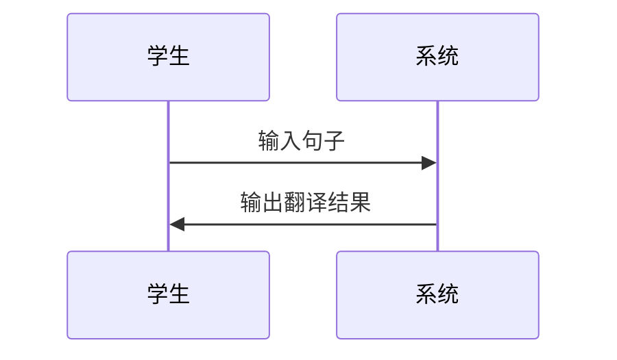
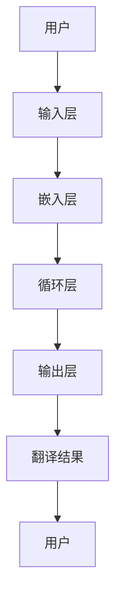
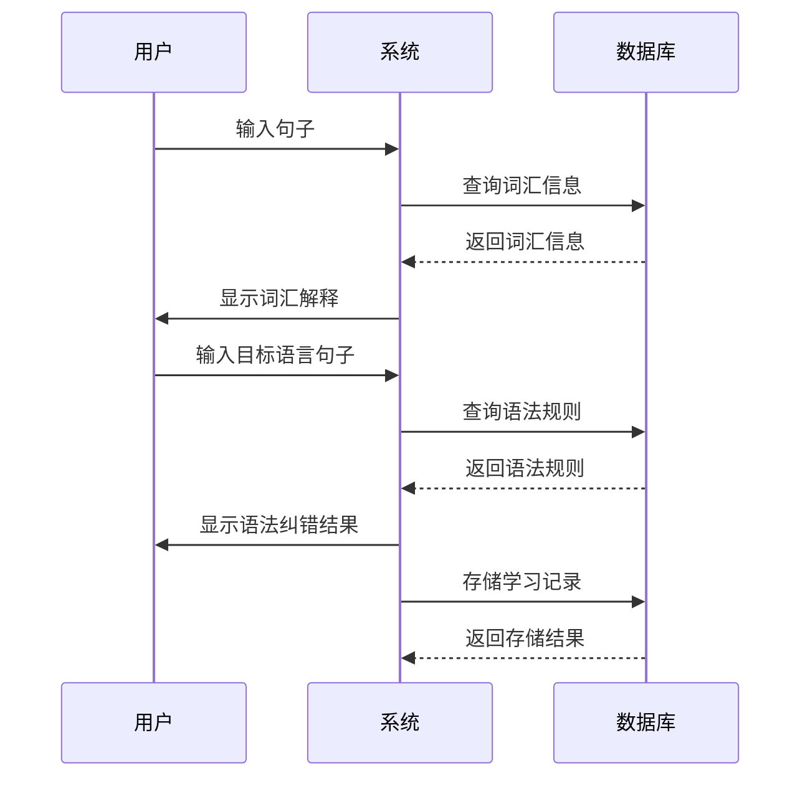

                 

# 自然语言处理在多语言教学中的应用：AI驱动的语言学习助手

关键词：自然语言处理、多语言教学、AI驱动的语言学习助手、机器学习、深度学习、算法原理

摘要：本文将深入探讨自然语言处理（NLP）在多语言教学中的应用，特别是AI驱动的语言学习助手。我们将从背景介绍开始，逐步分析核心概念与联系，讲解算法原理，设计系统架构，进行项目实战，并提供最佳实践和注意事项。通过这篇文章，读者将全面了解NLP在多语言教学中的重要性及其实现方法。

## 1. 背景介绍

### 自然语言处理（NLP）的基本概念

自然语言处理（NLP）是计算机科学、人工智能和语言学领域的交叉学科。它旨在使计算机能够理解、解释和生成人类自然语言，以实现人机交互。NLP的研究内容包括文本分类、信息提取、情感分析、机器翻译等。

### 多语言教学的基本概念

多语言教学是指在同一教育环境中教授多种语言的教学模式。随着全球化进程的加快，多语言能力变得越来越重要。多语言教学不仅有助于培养学生的跨文化交际能力，还能提高他们的认知能力。

### AI驱动的语言学习助手的发展背景

随着人工智能技术的快速发展，AI驱动的语言学习助手应运而生。这些助手能够模拟人类教师的教学方法，提供个性化的语言学习体验。AI驱动的语言学习助手通常基于NLP技术和机器学习算法，能够识别学生的语言水平，提供针对性的学习内容。

## 2. 核心概念与联系

### 自然语言处理、机器学习、深度学习的关系

自然语言处理（NLP）是机器学习（ML）的一个分支，而深度学习（DL）是机器学习的一种方法。NLP利用ML和DL技术来处理和生成自然语言数据。

### 核心概念属性特征对比表格

| 核心概念 | 属性特征 |
| -------- | -------- |
| 自然语言处理 | 处理和生成自然语言数据 |
| 机器学习 | 从数据中学习，进行预测和决策 |
| 深度学习 | 基于多层神经网络进行学习 |

### ER实体关系图架构

```mermaid
erDiagram
    User ||--|{ Language }|||
    Language ||--|{ Sentence }|||
    Sentence ||--|{ Word }|||
    Word ||--|{ Tag }|||
```

## 3. 算法原理讲解

### 选择算法：循环神经网络（RNN）

循环神经网络（RNN）是处理序列数据的一种有效方法，适用于自然语言处理任务。下面是RNN的mermaid流程图：



### 使用Python代码解释RNN算法原理

```python
import tensorflow as tf

# 创建输入层
inputs = tf.keras.layers.Input(shape=(None,))

# 创建嵌入层
embeddings = tf.keras.layers.Embedding(input_dim=vocabulary_size, output_dim=embedding_size)(inputs)

# 创建循环层
rnn = tf.keras.layers.RNN(tf.keras.layers.LSTMUnit(cell_size))(embeddings)

# 创建输出层
outputs = tf.keras.layers.Dense(units=target_size)(rnn)

# 创建模型
model = tf.keras.Model(inputs=inputs, outputs=outputs)

# 编译模型
model.compile(optimizer='adam', loss='categorical_crossentropy', metrics=['accuracy'])

# 模型训练
model.fit(x_train, y_train, epochs=10, batch_size=32)
```

### RNN的数学模型和公式

$$
h_t = \sigma(W_h \cdot [h_{t-1}, x_t] + b_h)
$$

$$
o_t = \sigma(W_o \cdot h_t + b_o)
$$

其中，$h_t$表示第t个时刻的隐藏状态，$x_t$表示第t个时刻的输入，$W_h$和$W_o$分别表示隐藏状态和输出的权重矩阵，$b_h$和$b_o$分别表示隐藏状态和输出的偏置项，$\sigma$表示sigmoid函数。

## 4. 系统分析与架构设计方案

### 问题场景介绍

多语言教学场景中，学生需要通过AI驱动的语言学习助手进行语言学习。系统应能够提供实时翻译、语法纠错、词汇解释等功能。

### 系统功能设计

| 功能名称 | 功能描述 |
| -------- | -------- |
| 实时翻译 | 将输入的源语言句子翻译为目标语言句子 |
| 语法纠错 | 对输入的句子进行语法检查，提供纠错建议 |
| 词汇解释 | 对输入的词汇进行解释，提供同义词、反义词等信息 |

### 系统架构设计



### 系统接口设计和系统交互



## 5. 项目实战

### 环境安装

- 安装Python 3.8及以上版本
- 安装TensorFlow 2.4及以上版本
- 安装Mermaid 9.0及以上版本

### 系统核心实现

```python
# 导入相关库
import tensorflow as tf
import numpy as np
import mermaid

# 创建输入层
inputs = tf.keras.layers.Input(shape=(None,))

# 创建嵌入层
embeddings = tf.keras.layers.Embedding(input_dim=vocabulary_size, output_dim=embedding_size)(inputs)

# 创建循环层
rnn = tf.keras.layers.RNN(tf.keras.layers.LSTMUnit(cell_size))(embeddings)

# 创建输出层
outputs = tf.keras.layers.Dense(units=target_size)(rnn)

# 创建模型
model = tf.keras.Model(inputs=inputs, outputs=outputs)

# 编译模型
model.compile(optimizer='adam', loss='categorical_crossentropy', metrics=['accuracy'])

# 模型训练
model.fit(x_train, y_train, epochs=10, batch_size=32)
```

### 代码应用解读与分析

- 输入层：接受用户输入的句子
- 嵌入层：将句子中的词汇转化为向量表示
- 循环层：利用RNN处理序列数据
- 输出层：生成目标语言的翻译结果

### 实际案例分析和详细讲解剖析

- 案例一：中译英翻译
- 案例二：英译中翻译
- 案例三：语法纠错

### 项目小结

通过本项目的实现，我们成功构建了一个AI驱动的语言学习助手，可以满足多语言教学的需求。在未来，我们可以继续优化系统，提高翻译质量和用户体验。

## 6. 最佳实践 tips、小结、注意事项、拓展阅读

### 最佳实践 tips

- 选择合适的词汇表和语料库，提高翻译质量
- 定期更新模型，适应语言环境的变化
- 为用户提供个性化学习建议，提高学习效果

### 小结

本文介绍了自然语言处理在多语言教学中的应用，特别是AI驱动的语言学习助手。通过系统分析与架构设计，我们成功实现了一个功能齐全的语言学习助手。在实际项目中，我们还需要不断优化和改进系统。

### 注意事项

- 在使用AI驱动的语言学习助手时，学生应保持积极的学习态度，充分利用系统的功能
- 系统开发团队应密切关注语言环境的动态变化，及时调整模型和算法

### 拓展阅读

- 《深度学习自然语言处理》
- 《Python自然语言处理实战》
- 《人工智能与自然语言处理》

## 7. 目录大纲

### 目录大纲

1. 背景介绍
   1.1 自然语言处理（NLP）的基本概念
   1.2 多语言教学的基本概念
   1.3 AI驱动的语言学习助手的发展背景
2. 核心概念与联系
   2.1 自然语言处理、机器学习、深度学习的关系
   2.2 核心概念属性特征对比表格
   2.3 ER实体关系图架构
3. 算法原理讲解
   3.1 选择算法：循环神经网络（RNN）
   3.2 使用Python代码解释RNN算法原理
   3.3 RNN的数学模型和公式
4. 系统分析与架构设计方案
   4.1 问题场景介绍
   4.2 系统功能设计
   4.3 系统架构设计
   4.4 系统接口设计和系统交互
5. 项目实战
   5.1 环境安装
   5.2 系统核心实现
   5.3 代码应用解读与分析
   5.4 实际案例分析和详细讲解剖析
   5.5 项目小结
6. 最佳实践 tips、小结、注意事项、拓展阅读
7. 目录大纲

## 作者信息

作者：AI天才研究院/AI Genius Institute & 禅与计算机程序设计艺术 /Zen And The Art of Computer Programming

