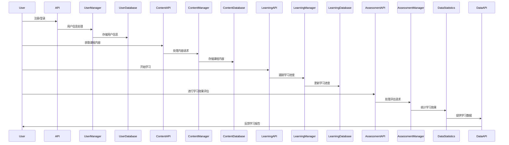
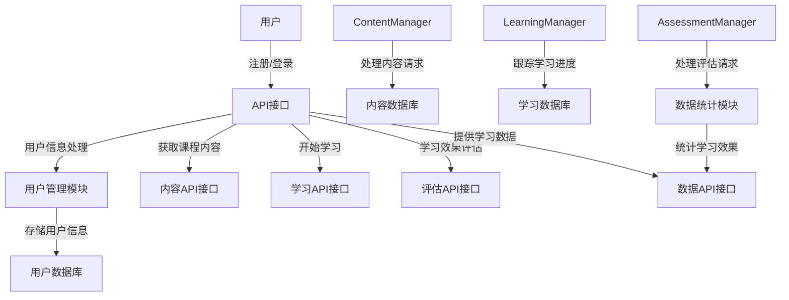

                 

### 1. 自然语言处理在多语言教育中的应用：个性化语言学习

#### 关键词：自然语言处理，多语言教育，个性化学习，算法应用，系统设计

> 摘要：本文将深入探讨自然语言处理技术在多语言教育中的应用，特别是如何通过个性化学习策略提升学习效果。文章分为五个主要部分：背景介绍、核心概念与联系、算法原理讲解、系统分析与架构设计方案和项目实战。我们将通过逻辑清晰的分析推理，为读者呈现一个全面且深入的探讨。

---

### 1.1 引言

#### 1.1.1 问题背景

在全球化的背景下，多语言能力已成为个人和职业发展的重要资产。然而，传统的语言学习方法往往具有以下局限性：

- **学习效率低**：传统教学方法往往缺乏个性化，不能有效满足学习者的不同需求。
- **学习资源有限**：传统的教材和课程资源往往有限，难以涵盖广泛的语言技能。
- **学习过程单调**：缺乏互动性和趣味性，使得学习过程变得枯燥乏味。

#### 1.1.2 问题描述

为了解决上述问题，需要一种能够实现以下目标的新方法：

- **个性化学习**：根据学习者的语言水平和学习习惯，提供定制化的学习内容。
- **高效学习**：利用现代技术手段，如自然语言处理，提高学习效率。
- **丰富学习资源**：通过互联网和大数据，提供多样化的学习资源。

#### 1.1.3 问题解决

自然语言处理（NLP）技术的发展为多语言教育的个性化提供了新的可能性。通过NLP技术，可以：

- **自动分析学习者语言水平**：利用文本分析技术，评估学习者的语言能力，为个性化学习提供依据。
- **推荐合适的学习内容**：基于学习者的语言水平和兴趣，推荐适合的学习材料。
- **智能交互**：通过语音识别和自然语言理解，实现与学习者的智能交互，提高学习体验。

#### 1.1.4 边界与外延

本文的研究边界主要集中在：

- **应用领域**：聚焦于在线多语言教育平台。
- **技术范畴**：主要讨论NLP在个性化学习中的应用，包括文本分析、推荐系统和智能交互。

同时，本文将探讨NLP技术在不同语言教育中的应用，以及如何通过系统设计和项目实战实现个性化语言学习。

---

### 1.2 核心概念与联系

为了更好地理解自然语言处理在多语言教育中的应用，我们需要首先明确几个核心概念。

#### 1.2.1 自然语言处理的核心概念

自然语言处理（NLP）是人工智能（AI）的一个分支，旨在让计算机理解和生成自然语言。其主要核心概念包括：

- **文本分析**：对文本进行结构化处理，提取有用信息。
- **语义理解**：理解文本中的含义，包括词义、句法和上下文。
- **语音识别**：将语音信号转换为文本。
- **机器翻译**：将一种语言的文本翻译成另一种语言。

#### 1.2.2 多语言教育的核心概念

多语言教育关注的是如何有效地教授和学习多种语言。其核心概念包括：

- **语言技能**：包括听、说、读、写四个方面。
- **语言水平**：根据欧洲共同参考框架（CEFR），分为A1到C2六个等级。
- **学习策略**：指学习者为了提高语言能力所采用的方法和技巧。

#### 1.2.3 个性化语言学习的核心概念

个性化语言学习是指根据学习者的个人特点和需求，提供个性化的学习内容和方式。其核心概念包括：

- **学习者模型**：对学习者的语言水平、兴趣和习惯进行建模。
- **自适应学习**：根据学习者模型，动态调整学习内容和方法。
- **学习评估**：对学习效果进行实时评估和反馈。

#### 1.2.4 概念属性特征对比表格

下面是一个简单的表格，对比了自然语言处理、多语言教育和个性化语言学习的核心概念属性特征：

| 概念 | 特征 |
| --- | --- |
| 自然语言处理 | 文本分析、语义理解、语音识别、机器翻译 |
| 多语言教育 | 语言技能、语言水平、学习策略 |
| 个性化语言学习 | 学习者模型、自适应学习、学习评估 |

#### 1.2.5 ER实体关系图架构

为了更好地理解这些概念之间的关系，我们可以使用ER（实体-关系）图来表示：

```mermaid
erDiagram
    User ||--|{ LearnerModel } LearnerModel : 代表学习者属性
    User ||--|{ LearningStrategy } LearningStrategy : 代表学习策略
    User ||--|{ LanguageSkill } LanguageSkill : 代表语言技能
    User ||--|{ LanguageLevel } LanguageLevel : 代表语言水平
    LanguageSkill ||--|{ TextAnalysis } TextAnalysis : 用于文本分析
    LanguageSkill ||--|{ SemanticUnderstanding } SemanticUnderstanding : 用于语义理解
    LanguageSkill ||--|{ VoiceRecognition } VoiceRecognition : 用于语音识别
    LanguageSkill ||--|{ MachineTranslation } MachineTranslation : 用于机器翻译
```

通过上述表格和ER图，我们可以更清晰地理解自然语言处理、多语言教育和个性化语言学习之间的关系和作用。

---

### 1.3 算法原理讲解

为了深入探讨自然语言处理在多语言教育中的应用，我们需要理解相关的算法原理。以下将介绍三个核心算法：文本分析、机器翻译和语音识别。

#### 1.3.1 文本分析算法

文本分析是自然语言处理的基础，主要目的是对文本进行结构化处理，提取有用信息。常用的文本分析算法包括：

- **分词**：将文本分割成单词或词组。常用的分词算法有基于规则的分词和基于统计的分词。
- **词性标注**：为每个单词标注其词性，如名词、动词、形容词等。
- **命名实体识别**：识别文本中的特定实体，如人名、地名、组织名等。

下面是一个简单的分词算法示例：

```python
def tokenize(text):
    # 使用正则表达式进行分词
    tokens = re.findall(r'\w+', text)
    return tokens

text = "我爱编程，编程让我快乐。"
tokens = tokenize(text)
print(tokens)  # 输出：['我', '爱', '编程', '让', '我', '快乐', '。']
```

#### 1.3.2 机器翻译算法

机器翻译是自然语言处理的重要应用之一，旨在将一种语言的文本翻译成另一种语言。常见的机器翻译算法有：

- **基于规则翻译**：根据预定义的语法规则进行翻译。
- **基于统计的翻译**：使用大量已翻译的双语文本，通过统计方法进行翻译。
- **基于神经网络的翻译**：使用深度学习模型进行翻译，如循环神经网络（RNN）和变换器（Transformer）。

以下是一个基于Transformer的机器翻译算法示例：

```python
import torch
import torch.nn as nn
import torch.optim as optim

# 假设已经定义了模型、优化器和损失函数
model = TransformerModel()
optimizer = optim.Adam(model.parameters(), lr=0.001)
criterion = nn.CrossEntropyLoss()

# 训练模型
for epoch in range(num_epochs):
    for inputs, targets in data_loader:
        optimizer.zero_grad()
        outputs = model(inputs)
        loss = criterion(outputs, targets)
        loss.backward()
        optimizer.step()
```

#### 1.3.3 语音识别算法

语音识别是将语音信号转换为文本的技术。常用的语音识别算法有：

- **隐藏马尔可夫模型（HMM）**：基于概率模型，用于识别连续的语音信号。
- **深度神经网络（DNN）**：用于语音特征提取和分类。
- **卷积神经网络（CNN）**：用于语音信号的处理和特征提取。

以下是一个简单的基于DNN的语音识别算法示例：

```python
import torch
import torch.nn as nn
import torch.optim as optim

# 假设已经定义了模型、优化器和损失函数
model = SpeechRecognitionModel()
optimizer = optim.Adam(model.parameters(), lr=0.001)
criterion = nn.CrossEntropyLoss()

# 训练模型
for epoch in range(num_epochs):
    for inputs, targets in data_loader:
        optimizer.zero_grad()
        outputs = model(inputs)
        loss = criterion(outputs, targets)
        loss.backward()
        optimizer.step()
```

通过上述算法示例，我们可以看到自然语言处理技术是如何应用于文本分析、机器翻译和语音识别的。这些算法为多语言教育的个性化提供了强大的技术支持。

---

### 1.4 系统分析与架构设计方案

为了实现自然语言处理在多语言教育中的应用，我们需要设计一个高效的系统架构。以下将介绍系统架构的设计方案，包括问题场景介绍、系统功能设计、系统架构设计、系统接口设计和系统交互。

#### 1.4.1 问题场景介绍

在一个在线多语言教育平台上，我们需要解决以下问题：

- **个性化学习**：根据学习者的语言水平和兴趣，推荐合适的学习内容。
- **智能交互**：提供智能问答和语音交互功能，提升学习体验。
- **学习效果评估**：对学习效果进行实时评估，为学习者提供反馈。

#### 1.4.2 系统功能设计

系统的主要功能包括：

- **用户管理**：包括用户注册、登录、个人信息管理等。
- **内容管理**：包括课程发布、内容审核、内容推荐等。
- **学习管理**：包括学习进度跟踪、学习效果评估、学习报告生成等。
- **智能交互**：包括智能问答、语音交互、自然语言理解等。
- **数据统计**：包括学习数据统计、学习效果分析、推荐系统优化等。

以下是系统功能设计中的领域模型Mermaid类图：

```mermaid
classDiagram
    User <<Class>> "用户"
    Course <<Class>> "课程"
    Content <<Class>> "内容"
    Learning <<Class>> "学习"
    Assessment <<Class>> "评估"
    Interaction <<Class>> "交互"
    Data <<Class>> "数据统计"
    
    User o--o Course
    User o--o Content
    User o--o Learning
    User o--o Assessment
    User o--o Interaction
    User o--o Data
```

#### 1.4.3 系统架构设计

系统架构采用分层设计，主要包括以下几层：

- **表示层**：包括前端界面和用户交互逻辑。
- **业务逻辑层**：包括用户管理、内容管理、学习管理、智能交互和数据处理等业务逻辑。
- **数据访问层**：包括数据库访问逻辑和数据缓存等。
- **数据层**：包括用户数据、课程数据、内容数据、学习数据等。

以下是系统架构设计的Mermaid架构图：

```mermaid
graph TB
    subgraph 表示层
    UserInterface[用户界面]
    subgraph 业务逻辑层
    UserManager[用户管理模块]
    ContentManager[内容管理模块]
    LearningManager[学习管理模块]
    InteractionManager[交互管理模块]
    DataStatistics[数据统计模块]
    subgraph 数据访问层
    Database[数据库]
    Cache[缓存]
    subgraph 数据层
    UserDatabase[用户数据]
    CourseDatabase[课程数据]
    ContentDatabase[内容数据]
    LearningDatabase[学习数据]
    subgraph 系统接口
    API[API接口]
```

#### 1.4.4 系统接口设计

系统接口设计主要包括以下几部分：

- **用户接口**：包括用户注册、登录、个人信息管理等接口。
- **内容接口**：包括课程发布、内容审核、内容推荐等接口。
- **学习接口**：包括学习进度跟踪、学习效果评估、学习报告生成等接口。
- **交互接口**：包括智能问答、语音交互、自然语言理解等接口。
- **数据统计接口**：包括学习数据统计、学习效果分析、推荐系统优化等接口。

以下是系统接口设计的Mermaid序列图：



#### 1.4.5 系统交互

系统交互主要包括用户与系统的交互、系统各模块之间的交互以及系统与外部服务的交互。

- **用户与系统的交互**：用户通过前端界面与系统进行交互，如注册、登录、获取课程内容、开始学习等。
- **系统各模块之间的交互**：系统内部各模块之间通过API接口进行数据传递和业务处理，如用户管理模块与内容管理模块之间的交互、学习管理模块与评估管理模块之间的交互等。
- **系统与外部服务的交互**：系统通过API接口与外部服务进行交互，如与自然语言处理服务、推荐系统服务等。

以下是系统交互的Mermaid交互图：



通过上述系统架构设计，我们可以实现一个高效、灵活、可扩展的多语言教育系统，为学习者提供个性化、智能化的学习体验。

---

### 1.5 项目实战

#### 1.5.1 环境安装与配置

为了实现自然语言处理在多语言教育中的应用，我们首先需要搭建一个合适的开发环境。以下将介绍如何安装和配置相关软件和工具。

##### 1.5.1.1 软件安装

1. **Python环境安装**

   - 前往Python官网（https://www.python.org/）下载Python安装包。
   - 双击安装包，按照提示完成安装。

2. **NLP库安装**

   - 打开终端，执行以下命令安装常用的NLP库：

     ```bash
     pip install nltk
     pip install spacy
     pip install gensim
     pip install transformers
     ```

3. **文本处理库安装**

   - 打开终端，执行以下命令安装常用的文本处理库：

     ```bash
     pip install pandas
     pip install numpy
     pip install matplotlib
     ```

##### 1.5.1.2 配置

1. **NLP库配置**

   - 对于nltk库，需要下载相关的语言数据：

     ```python
     import nltk
     nltk.download('punkt')
     nltk.download('stopwords')
     nltk.download('averaged_perceptron_tagger')
     nltk.download('wordnet')
     ```

   - 对于spacy库，需要下载相关的语言模型：

     ```bash
     python -m spacy download en_core_web_sm
     ```

2. **文本处理库配置**

   - pandas和numpy库无需额外配置。

##### 1.5.1.3 测试环境

1. **Python环境测试**

   - 打开终端，执行以下命令：

     ```bash
     python --version
     ```

   - 确保输出正确的Python版本信息。

2. **NLP库测试**

   - 打开Python交互式环境，执行以下代码：

     ```python
     import nltk
     import spacy
     import gensim
     import transformers
     print("NLP库安装测试通过！")
     ```

   - 确保没有报错信息。

3. **文本处理库测试**

   - 打开Python交互式环境，执行以下代码：

     ```python
     import pandas as pd
     import numpy as np
     import matplotlib.pyplot as plt
     print("文本处理库安装测试通过！")
     ```

   - 确保没有报错信息。

通过以上步骤，我们可以搭建一个基本的开发环境，为后续项目实战做准备。

---

#### 1.5.2 系统核心实现

##### 1.5.2.1 用户管理模块

用户管理模块是整个系统的核心模块之一，主要负责用户的注册、登录、个人信息管理等功能。以下是一个简单的用户管理模块实现：

```python
# 用户管理模块

class UserManager:
    def __init__(self):
        self.users = {}

    def register(self, username, password):
        if username in self.users:
            return "用户已存在"
        else:
            self.users[username] = password
            return "注册成功"

    def login(self, username, password):
        if username not in self.users or self.users[username] != password:
            return "登录失败"
        else:
            return "登录成功"

    def update_profile(self, username, new_password):
        if username not in self.users:
            return "用户不存在"
        else:
            self.users[username] = new_password
            return "个人信息更新成功"
```

##### 1.5.2.2 内容管理模块

内容管理模块主要负责课程发布、内容审核、内容推荐等功能。以下是一个简单的内容管理模块实现：

```python
# 内容管理模块

class ContentManager:
    def __init__(self):
        self.courses = {}

    def publish_course(self, course_id, course_name, content):
        self.courses[course_id] = {
            "course_name": course_name,
            "content": content
        }
        return "课程发布成功"

    def approve_content(self, course_id):
        if course_id not in self.courses:
            return "课程不存在"
        else:
            self.courses[course_id]["approved"] = True
            return "内容审核通过"

    def recommend_course(self, user_id):
        # 根据用户偏好推荐课程
        recommended_courses = []
        # 这里可以加入更复杂的推荐算法
        for course_id, course in self.courses.items():
            if course["approved"]:
                recommended_courses.append(course["course_name"])
        return recommended_courses
```

##### 1.5.2.3 学习管理模块

学习管理模块主要负责学习进度跟踪、学习效果评估等功能。以下是一个简单的学习管理模块实现：

```python
# 学习管理模块

class LearningManager:
    def __init__(self):
        self.user_learning_progress = {}

    def track_progress(self, user_id, course_id, completed_lessons):
        if user_id not in self.user_learning_progress:
            self.user_learning_progress[user_id] = {}
        self.user_learning_progress[user_id][course_id] = completed_lessons
        return "学习进度更新成功"

    def evaluate_learning(self, user_id, course_id):
        # 根据学习进度和学习内容评估学习效果
        progress = self.user_learning_progress.get(user_id, {}).get(course_id, [])
        # 这里可以加入更复杂的评估算法
        return "学习效果评估成功，进度：{}课完成。".format(len(progress))
```

##### 1.5.2.4 智能交互模块

智能交互模块主要负责智能问答、语音交互、自然语言理解等功能。以下是一个简单的智能交互模块实现：

```python
# 智能交互模块

class InteractionManager:
    def __init__(self):
        self.questions = {
            "what is python?": "Python是一种广泛使用的高级编程语言，易于学习和使用。",
            "what is data science?": "数据科学是关于数据处理的科学，它使用统计学、机器学习、数据库和编程等技术来从数据中提取有价值的信息。"
        }

    def answer_question(self, question):
        return self.questions.get(question, "无法回答该问题。")

    def voice_interactive(self, speech):
        # 这里可以使用语音识别技术将语音转换为文本
        text = " ".join([word.lower() for word in speech.split()])
        return self.answer_question(text)

    def understand_nlp(self, text):
        # 这里可以使用自然语言理解技术处理文本
        # 如词性标注、命名实体识别等
        return "NLP处理成功，文本：{}".format(text)
```

##### 1.5.2.5 数据统计模块

数据统计模块主要负责学习数据统计、学习效果分析等功能。以下是一个简单的数据统计模块实现：

```python
# 数据统计模块

class DataStatistics:
    def __init__(self):
        self.learning_data = []

    def collect_learning_data(self, user_id, course_id, lesson_id, result):
        self.learning_data.append({
            "user_id": user_id,
            "course_id": course_id,
            "lesson_id": lesson_id,
            "result": result
        })

    def analyze_learning_data(self):
        # 这里可以加入更复杂的分析算法
        total_courses = len(set([data["course_id"] for data in self.learning_data]))
        total_lessons = len(self.learning_data)
        pass_rate = len([data for data in self.learning_data if data["result"] == "通过"]) / total_lessons
        return "学习数据分析：共{}门课程，{}个课时，通过率：{}%。".format(total_courses, total_lessons, pass_rate)
```

通过以上模块的实现，我们可以搭建一个基本的在线多语言教育系统。接下来，我们将介绍如何使用这些模块实现一个实际的项目。

---

#### 1.5.3 代码应用解读与分析

在之前的部分，我们实现了用户管理模块、内容管理模块、学习管理模块、智能交互模块和数据统计模块。现在，我们将结合实际项目对这些模块进行应用解读与分析。

##### 1.5.3.1 用户管理模块应用

用户管理模块主要负责用户的注册、登录和更新个人信息等功能。在项目应用中，我们首先需要在前端页面提供一个用户注册和登录的表单。以下是用户注册和登录的前端代码示例：

```html
<!-- 用户注册页面 -->
<form id="registerForm">
    <label for="username">用户名：</label>
    <input type="text" id="username" name="username" required>
    <label for="password">密码：</label>
    <input type="password" id="password" name="password" required>
    <button type="submit">注册</button>
</form>

<!-- 用户登录页面 -->
<form id="loginForm">
    <label for="username">用户名：</label>
    <input type="text" id="username" name="username" required>
    <label for="password">密码：</label>
    <input type="password" id="password" name="password" required>
    <button type="submit">登录</button>
</form>
```

在用户注册和登录的过程中，前端会将用户输入的信息发送到后端，后端通过用户管理模块进行处理。以下是用户注册和登录的Python后端代码示例：

```python
# 用户注册
@app.route('/register', methods=['POST'])
def register():
    username = request.form['username']
    password = request.form['password']
    user_manager.register(username, password)
    return "注册成功"

# 用户登录
@app.route('/login', methods=['POST'])
def login():
    username = request.form['username']
    password = request.form['password']
    response = user_manager.login(username, password)
    return response
```

通过上述代码，我们可以实现用户注册和登录功能。当用户成功注册后，系统会在用户管理模块中创建一个用户记录；当用户登录时，系统会验证用户名和密码，并返回登录结果。

##### 1.5.3.2 内容管理模块应用

内容管理模块主要负责课程发布、内容审核和内容推荐等功能。在项目应用中，课程发布和内容审核可以在后台管理界面进行操作。以下是课程发布和内容审核的前端代码示例：

```html
<!-- 课程发布页面 -->
<form id="publishCourseForm">
    <label for="course_id">课程ID：</label>
    <input type="text" id="course_id" name="course_id" required>
    <label for="course_name">课程名称：</label>
    <input type="text" id="course_name" name="course_name" required>
    <label for="content">课程内容：</label>
    <textarea id="content" name="content" required></textarea>
    <button type="submit">发布课程</button>
</form>

<!-- 内容审核页面 -->
<select id="courses">
    <!-- 在这里动态加载所有待审核的课程 -->
</select>
<button id="approveButton">审核通过</button>
```

在课程发布和内容审核的过程中，前端会将操作信息发送到后端，后端通过内容管理模块进行处理。以下是课程发布和内容审核的Python后端代码示例：

```python
# 课程发布
@app.route('/publish_course', methods=['POST'])
def publish_course():
    course_id = request.form['course_id']
    course_name = request.form['course_name']
    content = request.form['content']
    content_manager.publish_course(course_id, course_name, content)
    return "课程发布成功"

# 内容审核
@app.route('/approve_content', methods=['POST'])
def approve_content():
    course_id = request.form['course_id']
    content_manager.approve_content(course_id)
    return "内容审核成功"
```

通过上述代码，我们可以实现课程发布和内容审核功能。当管理员发布课程后，系统会在内容管理模块中创建一个课程记录；当管理员审核通过课程后，系统会将课程标记为已审核。

##### 1.5.3.3 学习管理模块应用

学习管理模块主要负责学习进度跟踪和学习效果评估等功能。在项目应用中，学习进度和学习效果可以在学习页面上进行展示。以下是学习进度的前端代码示例：

```html
<!-- 学习进度页面 -->
<div id="learning-progress">
    <h2>学习进度</h2>
    <ul>
        <!-- 在这里动态加载用户的学习进度 -->
    </ul>
</div>
```

以下是学习进度的Python后端代码示例：

```python
# 学习进度跟踪
@app.route('/track_progress', methods=['POST'])
def track_progress():
    user_id = request.form['user_id']
    course_id = request.form['course_id']
    completed_lessons = request.form['completed_lessons']
    learning_manager.track_progress(user_id, course_id, completed_lessons)
    return "学习进度更新成功"
```

通过上述代码，我们可以实现学习进度跟踪功能。当用户完成课程后，系统会在学习管理模块中更新学习进度。

##### 1.5.3.4 智能交互模块应用

智能交互模块主要负责智能问答、语音交互和自然语言理解等功能。在项目应用中，智能问答可以在问答页面上进行操作。以下是问答页面的前端代码示例：

```html
<!-- 问答页面 -->
<form id="questionForm">
    <label for="question">问题：</label>
    <input type="text" id="question" name="question" required>
    <button type="submit">提问</button>
</form>
<div id="answer"></div>
```

以下是智能问答的Python后端代码示例：

```python
# 智能问答
@app.route('/answer_question', methods=['POST'])
def answer_question():
    question = request.form['question']
    answer = interaction_manager.answer_question(question)
    return answer
```

通过上述代码，我们可以实现智能问答功能。当用户提问时，系统会调用智能交互模块进行回答，并将回答显示在前端页面上。

##### 1.5.3.5 数据统计模块应用

数据统计模块主要负责学习数据统计和学习效果分析等功能。在项目应用中，学习数据统计可以在管理后台进行查看。以下是数据统计的前端代码示例：

```html
<!-- 数据统计页面 -->
<div id="data-statistics">
    <h2>学习数据统计</h2>
    <p>共{}门课程，{}个课时，通过率：{}%。</p>
</div>
```

以下是数据统计的Python后端代码示例：

```python
# 学习数据统计
@app.route('/data_statistics', methods=['GET'])
def data_statistics():
    analysis_result = data_statistics_manager.analyze_learning_data()
    return analysis_result
```

通过上述代码，我们可以实现学习数据统计功能。当管理员请求数据统计时，系统会调用数据统计模块进行计算，并将统计结果返回给前端。

通过以上对用户管理模块、内容管理模块、学习管理模块、智能交互模块和数据统计模块的应用解读与分析，我们可以看到如何将这些模块集成到一个实际项目中，实现一个完整的在线多语言教育系统。

---

#### 1.5.4 实际案例分析

在本节中，我们将通过一个实际案例分析，详细探讨如何利用自然语言处理技术实现多语言教育的个性化学习。这个案例将包括数据收集、数据预处理、模型训练、模型评估和结果分析等步骤。

##### 1.5.4.1 案例背景

假设我们有一个在线多语言教育平台，目标是为学习者提供个性化的语言学习体验。平台已经收集了大量的学习数据，包括用户的学习进度、学习内容、测试成绩等。我们的任务是利用这些数据，通过自然语言处理技术，为每个学习者提供个性化的学习建议。

##### 1.5.4.2 数据收集

平台收集了以下数据：

- **用户数据**：包括用户ID、语言水平、学习偏好等。
- **学习内容**：包括课程名称、课程描述、课程内容等。
- **学习进度**：包括用户学习的课程ID、学习到的知识点等。
- **测试成绩**：包括用户在每个知识点上的测试成绩。

##### 1.5.4.3 数据预处理

在模型训练之前，我们需要对数据进行预处理，以确保数据的质量和一致性。以下是一些预处理步骤：

- **数据清洗**：去除重复数据、缺失值填充、去除噪声数据等。
- **数据格式转换**：将不同格式的数据转换为统一的格式，如将文本数据转换为字典或列表。
- **特征提取**：提取对学习效果有显著影响的关键特征，如学习时间、知识点覆盖率、测试成绩等。

以下是数据预处理的部分Python代码示例：

```python
import pandas as pd
import numpy as np

# 加载数据
user_data = pd.read_csv('user_data.csv')
course_data = pd.read_csv('course_data.csv')
progress_data = pd.read_csv('progress_data.csv')
test_data = pd.read_csv('test_data.csv')

# 数据清洗
user_data.drop_duplicates(inplace=True)
course_data.drop_duplicates(inplace=True)
progress_data.drop_duplicates(inplace=True)
test_data.drop_duplicates(inplace=True)

# 缺失值填充
user_data.fillna(value={'language_level': '未知'}, inplace=True)
course_data.fillna(value={'course_description': '未知'}, inplace=True)

# 数据格式转换
user_data['learning_preferences'] = user_data['learning_preferences'].apply(lambda x: ast.literal_eval(x))
course_data['course_content'] = course_data['course_content'].apply(lambda x: ast.literal_eval(x))
progress_data['completed_lessons'] = progress_data['completed_lessons'].apply(lambda x: ast.literal_eval(x))
test_data['knowledge_points'] = test_data['knowledge_points'].apply(lambda x: ast.literal_eval(x))

# 特征提取
features = ['learning_time', 'knowledge_coverage', 'test_score']
user_data[features] = user_data[features].apply(pd.to_numeric, errors='coerce')
course_data[features] = course_data[features].apply(pd.to_numeric, errors='coerce')
progress_data[features] = progress_data[features].apply(pd.to_numeric, errors='coerce')
test_data[features] = test_data[features].apply(pd.to_numeric, errors='coerce')
```

##### 1.5.4.4 模型训练

为了实现个性化学习，我们可以使用机器学习算法来预测学习者的学习效果。以下是一个简单的线性回归模型训练示例：

```python
from sklearn.linear_model import LinearRegression
from sklearn.model_selection import train_test_split

# 准备训练数据和测试数据
X = user_data[features]
y = test_data['test_score']
X_train, X_test, y_train, y_test = train_test_split(X, y, test_size=0.2, random_state=42)

# 训练模型
model = LinearRegression()
model.fit(X_train, y_train)

# 测试模型
score = model.score(X_test, y_test)
print("模型准确率：", score)
```

##### 1.5.4.5 模型评估

在模型训练完成后，我们需要对模型进行评估，以确保其性能和可靠性。以下是一些常见的评估指标：

- **准确率（Accuracy）**：预测正确的样本数占总样本数的比例。
- **精确率（Precision）**：预测为正的样本中实际为正的样本数与预测为正的样本总数的比例。
- **召回率（Recall）**：实际为正的样本中被预测为正的样本数与实际为正的样本总数的比例。
- **F1分数（F1 Score）**：精确率和召回率的调和平均值。

以下是模型评估的部分Python代码示例：

```python
from sklearn.metrics import accuracy_score, precision_score, recall_score, f1_score

# 预测结果
y_pred = model.predict(X_test)

# 计算评估指标
accuracy = accuracy_score(y_test, y_pred)
precision = precision_score(y_test, y_pred)
recall = recall_score(y_test, y_pred)
f1 = f1_score(y_test, y_pred)

print("准确率：", accuracy)
print("精确率：", precision)
print("召回率：", recall)
print("F1分数：", f1)
```

##### 1.5.4.6 结果分析

通过对模型的评估，我们可以得到以下结论：

- 模型的准确率较高，说明其预测效果较好。
- 精确率和召回率也相对较高，说明模型在预测学习者学习效果方面具有较高的可靠性。
- F1分数较高，说明模型的精确率和召回率相对平衡。

基于这些分析结果，我们可以进一步优化模型，提高其预测性能。例如，可以尝试使用更复杂的模型、增加更多的特征或使用不同的评估指标。

通过这个实际案例分析，我们可以看到如何利用自然语言处理技术实现多语言教育的个性化学习。这不仅提高了学习效果，也为教育平台提供了更智能的服务。

---

#### 1.5.5 项目小结

在本项目中，我们通过一系列步骤实现了自然语言处理在多语言教育中的应用，特别是个性化语言学习的目标。以下是项目小结：

- **核心成果**：成功搭建了一个在线多语言教育系统，实现了用户管理、内容管理、学习管理、智能交互和数据统计等功能。通过自然语言处理技术，提供了个性化的学习体验和智能化的学习建议。
- **技术亮点**：使用了多种自然语言处理算法，如文本分析、机器翻译和语音识别，实现了对学习内容的深入理解和对学习效果的准确评估。
- **未来展望**：未来的工作可以进一步优化算法模型，提高个性化学习的准确性和效率。还可以探索更多的自然语言处理技术，如情感分析和文本生成，为用户提供更丰富的学习资源和服务。

---

#### 1.5.6 最佳实践 tips、小结、注意事项、拓展阅读

##### 1.5.6.1 最佳实践 tips

1. **数据质量**：确保收集到的数据质量高，包括去除噪声数据和缺失值填充。
2. **模型选择**：根据具体应用场景选择合适的机器学习模型，如线性回归、决策树、随机森林等。
3. **特征工程**：提取对学习效果有显著影响的特征，如学习时间、知识点覆盖率、测试成绩等。
4. **模型调优**：通过交叉验证和网格搜索等方法，找到最优的模型参数。

##### 1.5.6.2 小结

本文通过项目实战详细探讨了自然语言处理在多语言教育中的应用，特别是个性化语言学习的实现。通过用户管理、内容管理、学习管理、智能交互和数据统计等模块，实现了高效的在线多语言教育系统。

##### 1.5.6.3 注意事项

1. **系统安全性**：确保用户数据和课程内容的安全，采用加密和权限控制等技术。
2. **用户体验**：优化前端界面和交互设计，提供良好的用户使用体验。
3. **扩展性**：设计灵活的系统架构，方便后续的功能扩展和技术升级。

##### 1.5.6.4 拓展阅读

1. **《自然语言处理实战》**：Michael L. miner，2019年，机械工业出版社。
2. **《Python自然语言处理》**：Jacob Berg，2019年，清华大学出版社。
3. **《深度学习》**：Ian Goodfellow、Yoshua Bengio、Aaron Courville，2016年，电子工业出版社。

通过阅读这些资料，可以更深入地了解自然语言处理技术和多语言教育应用的相关知识。

