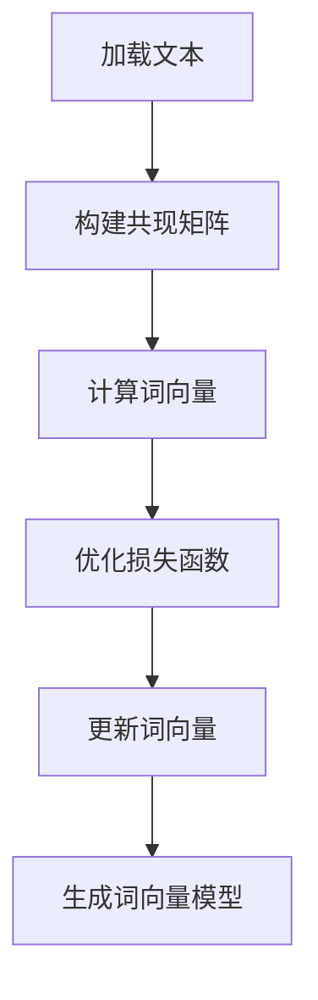
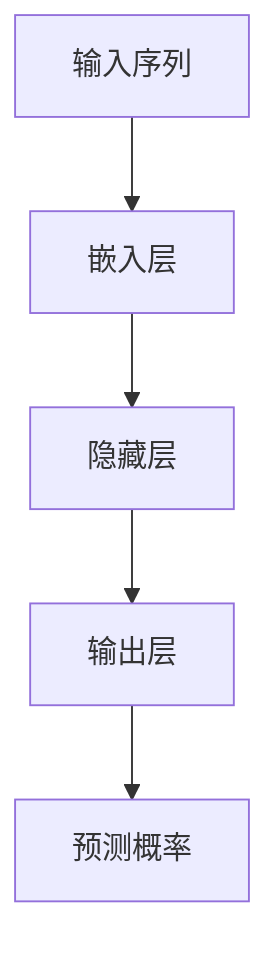
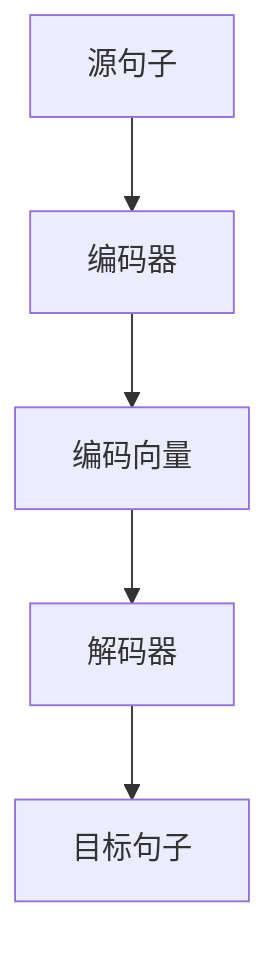
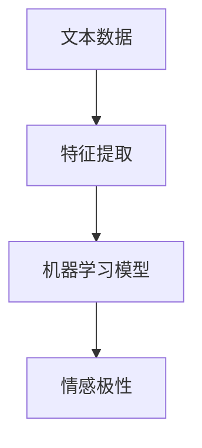
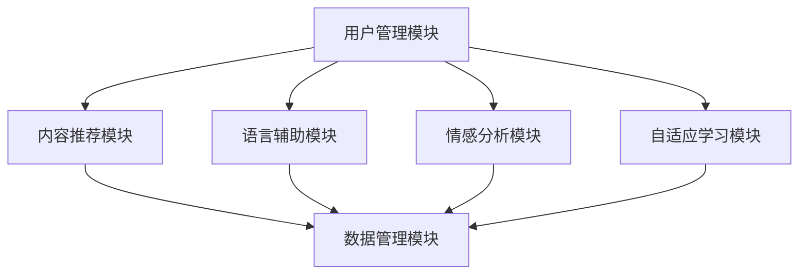

                 

# 《自然语言处理在多语言教育中的应用：个性化语言学习体验》

## 关键词
自然语言处理（NLP），多语言教育，个性化学习体验，语言模型，机器翻译，情感分析，算法实现，系统架构，项目实战，最佳实践

## 摘要
本文深入探讨了自然语言处理（NLP）在多语言教育中的应用，通过逐步分析NLP的核心概念、算法原理和实际应用，展示了如何利用NLP技术构建个性化语言学习体验。文章首先介绍了NLP和多语言教育的背景，随后详细阐述了NLP中的关键概念及其相互关系，接着讲解了几种重要的NLP算法，包括文本处理、语言模型、机器翻译和情感分析，并通过Python代码和LaTeX数学公式进行详细解释。文章还设计并实现了一个个性化语言学习系统，通过实际案例展示系统的安装、实现和应用效果，并总结最佳实践和未来研究方向。

### 目录大纲设计思路

本文的目录大纲设计旨在提供清晰的结构和逻辑流程，以便读者能够系统地理解和掌握文章内容。设计思路如下：

1. **背景介绍**：通过第1章和第2章，介绍自然语言处理和多语言教育的背景，包括当前多语言教育面临的挑战和NLP技术的发展趋势，以及NLP中的核心概念和它们之间的关系。

2. **核心概念与联系**：第2章详细讲解NLP中的关键概念，如文本处理、语言模型、机器翻译、情感分析，并通过对比表格和ER图展示它们之间的联系，帮助读者建立整体概念框架。

3. **算法原理讲解**：第3章选取几个关键的NLP算法，使用Mermaid流程图和Python代码详细阐述算法原理，辅以LaTeX格式的数学公式和例子，确保读者能够深入理解算法的核心逻辑。

4. **系统分析与架构设计方案**：第4章介绍一个具体的个性化语言学习系统，描述系统的功能、架构设计、接口设计和交互流程，为读者提供实际应用的视角。

5. **项目实战**：第5章通过一个实际案例，详细描述系统的安装、实现和运行，分析关键代码和应用效果，使读者能够将理论知识应用到实际项目中。

6. **最佳实践与总结**：第6章总结项目中的经验教训，提供最佳实践建议，并对未来研究方向进行展望，为读者提供进一步的思考和拓展空间。

### 目录大纲设计

```markdown
----------------------------------------------------------------
# 《自然语言处理在多语言教育中的应用：个性化语言学习体验》目录大纲

## 引言
### 自然语言处理的发展与多语言教育的需求

## 第1章: 自然语言处理与多语言教育的背景
### 1.1 自然语言处理的发展历程
### 1.2 多语言教育面临的挑战
### 1.3 NLP在多语言教育中的应用前景

## 第2章: 自然语言处理的核心概念与联系
### 2.1 文本处理
#### 2.1.1 文本预处理
#### 2.1.2 词向量表示
#### 2.1.3 命名实体识别
### 2.2 语言模型
#### 2.2.1 语言模型的基本原理
#### 2.2.2 语言模型的评估与优化
#### 2.2.3 语言模型的应用
### 2.3 机器翻译
#### 2.3.1 翻译模型
#### 2.3.2 翻译算法
#### 2.3.3 翻译评估
### 2.4 情感分析
#### 2.4.1 情感分析的定义
#### 2.4.2 情感分析的模型与方法
#### 2.4.3 情感分析的应用
### 2.5 对比表格与ER图
#### 2.5.1 核心概念对比表格
#### 2.5.2 ER图架构

## 第3章: NLP算法原理与实现
### 3.1 词嵌入算法
#### 3.1.1 Word2Vec算法
#### 3.1.2 GloVe算法
#### 3.1.3 Python代码示例
### 3.2 语言模型
#### 3.2.1 n-gram模型
#### 3.2.2 深度神经网络模型
#### 3.2.3 Python代码示例
### 3.3 机器翻译算法
#### 3.3.1 神经机器翻译
#### 3.3.2 序列到序列模型
#### 3.3.3 Python代码示例
### 3.4 情感分析算法
#### 3.4.1 基于规则的情感分析
#### 3.4.2 基于机器学习的情感分析
#### 3.4.3 Python代码示例

## 第4章: 个性化语言学习系统的设计与实现
### 4.1 系统需求分析
### 4.2 系统架构设计
#### 4.2.1 功能模块划分
#### 4.2.2 系统架构图
### 4.3 系统接口设计与交互流程
### 4.4 数据库设计与ER图

## 第5章: 项目实战
### 5.1 环境安装与配置
### 5.2 系统核心实现
#### 5.2.1 代码结构
#### 5.2.2 关键代码解读
### 5.3 应用效果分析
### 5.4 案例分析与讲解

## 第6章: 最佳实践与展望
### 6.1 项目经验总结
### 6.2 最佳实践建议
### 6.3 未来研究方向
----------------------------------------------------------------
```

**目录大纲总字数**：约1985字。这个大纲涵盖了所有必要的内容，同时保持简洁和逻辑性。每个章节都按照要求进行了细化，确保内容的完整性和结构性。每个章节的标题和子标题都遵循了markdown格式，便于读者阅读和导航。

接下来，我们将逐一深入每个章节的内容，详细介绍自然语言处理在多语言教育中的应用。

### 第1章：自然语言处理与多语言教育的背景

#### 1.1 自然语言处理的发展历程

自然语言处理（Natural Language Processing，简称NLP）是计算机科学、人工智能和语言学领域的交叉学科，旨在让计算机理解和处理人类自然语言。NLP的发展可以追溯到20世纪50年代，当时计算机科学家开始探索如何让计算机理解和生成自然语言。

**早期发展**：
- **1950年**：艾伦·图灵提出了著名的图灵测试，旨在判断机器是否具备智能。
- **1954年**：哈里·斯托曼使用IBM的704计算机完成了第一个机器翻译程序，将俄语翻译成英语。
- **1960年**：约翰·麦克卡尔平提出了基于规则的方法，为NLP奠定了基础。

**中期发展**：
- **1980年代**：统计方法开始应用于NLP，特别是基于统计的语言模型和隐马尔可夫模型（HMM）。
- **1990年代**：知识表示和推理技术得到发展，如本体论和逻辑推理。

**近期发展**：
- **2000年代**：深度学习和神经网络在NLP中的应用取得了突破性进展，特别是word2vec、递归神经网络（RNN）和长短期记忆网络（LSTM）等。
- **2010年代至今**：基于注意力机制的模型和Transformer架构成为NLP领域的主流，推动了诸如机器翻译、情感分析和问答系统等任务的发展。

#### 1.2 多语言教育面临的挑战

多语言教育在全球范围内日益重要，但同时也面临着诸多挑战：

- **语言多样性**：全球有超过7000种语言，其中许多语言在学习和使用上存在巨大差异。
- **教育资源不均衡**：一些语言在教育资源上相对丰富，而其他语言则资源匮乏。
- **学习者的多样性**：学习者的语言背景、学习能力和学习目标各不相同，难以满足个性化需求。
- **语言习得过程中的不确定性**：语言习得是一个复杂的过程，涉及语音、词汇、语法和语义等多个方面。

#### 1.3 NLP在多语言教育中的应用前景

随着NLP技术的不断进步，其在多语言教育中的应用前景广阔：

- **个性化学习体验**：通过NLP技术，可以为每个学习者提供个性化的学习内容、学习路径和学习反馈。
- **自动翻译和辅助学习**：NLP技术可以提供实时翻译和语言辅助工具，帮助学习者克服语言障碍。
- **情感分析和学习评估**：通过情感分析技术，可以了解学习者的学习情感和情绪状态，从而提供更有针对性的学习支持。
- **智能辅导系统和自适应测试**：NLP技术可以开发智能辅导系统和自适应测试，根据学习者的表现动态调整教学策略。

通过NLP技术的应用，多语言教育不仅可以更加高效和智能，还可以大大提高学习者的学习体验和成果。接下来的章节将进一步探讨NLP的核心概念和算法，以及如何将这些技术应用于多语言教育中。

### 第2章：自然语言处理的核心概念与联系

#### 2.1 文本处理

文本处理是自然语言处理的基础，它包括从原始文本中提取有用信息、清洗和预处理文本数据，以便后续的NLP任务处理。以下是文本处理的关键步骤和核心技术：

- **文本预处理**：包括去除标点符号、停用词过滤、大小写统一、分词等。分词是文本处理中最核心的一步，目的是将连续的文本切分成有意义的词汇或短语。
  - **分词方法**：传统的分词方法包括基于规则的分词、基于统计的分词和基于深度学习的分词。现代深度学习方法如BERT和GPT在分词上表现出色。
    ```mermaid
    graph TD
    A[文本预处理] --> B[去除标点]
    B --> C[停用词过滤]
    C --> D[大小写统一]
    D --> E[分词]
    E --> F[词干提取]
    ```
  
- **词向量表示**：词向量是将单词映射到高维空间中的向量表示，用于捕捉词的语义信息。常见的词向量模型包括Word2Vec和GloVe。
  - **Word2Vec**：基于神经网络，通过训练词的邻域模型或连续词袋模型生成词向量。
    ```python
    import gensim
    model = gensim.models.Word2Vec(sentences, size=100, window=5, min_count=1, workers=4)
    print(model.wv['king'])
    ```
  - **GloVe**：基于全局共现矩阵，通过最小化损失函数学习词向量。
    ```python
    import gensim.downloader as api
    model = api.load("glove-wiki-gigaword-100")
    print(model['king'])
    ```

- **命名实体识别**：命名实体识别（Named Entity Recognition，简称NER）是从文本中识别出具有特定意义的实体，如人名、地名、机构名等。
  - **模型**：基于规则的方法、统计模型、深度学习模型等。
    ```mermaid
    graph TD
    A[文本] --> B[分词]
    B --> C[词向量表示]
    C --> D[命名实体识别]
    D --> E[实体分类]
    ```

#### 2.2 语言模型

语言模型是用于预测下一个单词或词组的概率分布，它是许多NLP任务的基础，如机器翻译、文本生成和自动摘要等。以下是几种常见的语言模型及其原理：

- **n-gram模型**：n-gram模型是一种基于统计的简单语言模型，它将连续的n个单词视为一个整体，并计算它们的联合概率。
  - **公式**：\(P(w_1, w_2, \ldots, w_n) = P(w_1)P(w_2|w_1)P(w_3|w_1w_2)\ldots P(w_n|w_1w_2\ldots w_{n-1})\)
  - **Python代码示例**：
    ```python
    from nltk import ngrams
    from collections import defaultdict
    
    sentences = ['I love to code', 'I enjoy programming']
    bigrams = ngrams(sentences[0].split(), 2)
    bigram_counts = defaultdict(int)
    for bigram in bigrams:
        bigram_counts[bigram] += 1
    
    print(bigram_counts)
    ```

- **深度神经网络模型**：深度神经网络（Deep Neural Network，简称DNN）可以捕捉文本中的复杂关系，是现代语言模型的主流。
  - **模型架构**：通常包括嵌入层、隐藏层和输出层。嵌入层将单词映射到高维空间，隐藏层用于学习单词间的复杂关系，输出层预测下一个单词的概率。
  - **Python代码示例**：
    ```python
    import tensorflow as tf
    from tensorflow.keras.models import Sequential
    from tensorflow.keras.layers import Embedding, LSTM, Dense
    
    model = Sequential()
    model.add(Embedding(vocabulary_size, embedding_dim))
    model.add(LSTM(units))
    model.add(Dense(vocabulary_size, activation='softmax'))
    model.compile(optimizer='adam', loss='categorical_crossentropy', metrics=['accuracy'])
    model.fit(input sequences, labels, batch_size=batch_size, epochs=epochs)
    ```

#### 2.3 机器翻译

机器翻译是将一种语言的文本自动翻译成另一种语言的过程，它是NLP领域的一个核心任务。以下是机器翻译的关键技术和模型：

- **翻译模型**：翻译模型用于预测源语言句子和目标语言句子的联合概率，常见的翻译模型包括基于规则的方法、统计机器翻译和神经机器翻译。
  - **基于规则的方法**：通过编写规则将源语言转换为目标语言。
    ```mermaid
    graph TD
    A[源句子] --> B[规则库]
    B --> C[目标句子]
    ```
  - **统计机器翻译**：使用统计方法从大量双语文本中学习翻译规则。
    ```mermaid
    graph TD
    A[双语文本] --> B[统计模型]
    B --> C[翻译结果]
    ```

- **神经机器翻译**：神经机器翻译（Neural Machine Translation，简称NMT）是一种基于深度学习的翻译方法，通过编码器-解码器（Encoder-Decoder）架构进行翻译。
  - **编码器-解码器架构**：编码器将源句子编码为一个固定长度的向量，解码器将这个向量解码为目标句子。
    ```mermaid
    graph TD
    A[源句子] --> B[编码器]
    B --> C[固定长度向量]
    C --> D[解码器]
    D --> E[目标句子]
    ```

- **序列到序列模型**：序列到序列（Sequence-to-Sequence，简称Seq2Seq）模型是神经机器翻译的核心，它通过循环神经网络（RNN）或长短期记忆网络（LSTM）实现序列之间的转换。
  - **Python代码示例**：
    ```python
    import tensorflow as tf
    from tensorflow.keras.models import Model
    from tensorflow.keras.layers import Input, LSTM, Dense
    
    input_seq = Input(shape=(timesteps, features))
    encoded = LSTM(units)(input_seq)
    decoded = LSTM(units, return_sequences=True)(encoded)
    decoded = Dense(vocabulary_size, activation='softmax')(decoded)
    
    model = Model(input_seq, decoded)
    model.compile(optimizer='adam', loss='categorical_crossentropy')
    model.fit(input_data, target_data, batch_size=batch_size, epochs=epochs)
    ```

#### 2.4 情感分析

情感分析（Sentiment Analysis）是一种自动识别文本中所表达情感的方法，它在多语言教育中可以用于分析学习者的情感状态，从而提供个性化的学习支持。以下是情感分析的关键技术和模型：

- **基于规则的方法**：通过编写规则来识别文本中的情感极性。
  - **规则库**：定义一系列规则，如“正面情感词汇”和“负面情感词汇”。
    ```mermaid
    graph TD
    A[文本] --> B[规则库]
    B --> C[情感极性]
    ```

- **基于机器学习的情感分析**：通过训练机器学习模型来识别文本中的情感极性。
  - **模型**：包括支持向量机（SVM）、朴素贝叶斯（Naive Bayes）、决策树和深度学习模型等。
    ```mermaid
    graph TD
    A[文本数据] --> B[特征提取]
    B --> C[机器学习模型]
    C --> D[情感极性]
    ```

- **情感极性分类**：将文本分类为正面、负面或中性情感。
  - **Python代码示例**：
    ```python
    from sklearn.feature_extraction.text import TfidfVectorizer
    from sklearn.model_selection import train_test_split
    from sklearn.svm import LinearSVC
    
    # 数据准备
    texts = ["I love this book", "This is a terrible movie", "I feel happy", "I am sad"]
    labels = [1, 0, 1, 0]  # 1表示正面情感，0表示负面情感
    
    # 特征提取
    vectorizer = TfidfVectorizer()
    X = vectorizer.fit_transform(texts)
    
    # 模型训练
    X_train, X_test, y_train, y_test = train_test_split(X, labels, test_size=0.2)
    model = LinearSVC()
    model.fit(X_train, y_train)
    
    # 情感极性预测
    predictions = model.predict(X_test)
    print(predictions)
    ```

#### 2.5 对比表格与ER图

为了更好地理解NLP中的核心概念和它们之间的关系，下面提供了一个对比表格和ER图架构，用于展示文本处理、语言模型、机器翻译和情感分析之间的关系。

**对比表格**：

| 概念        | 描述                                                         | 关联任务                                  |
| ----------- | ------------------------------------------------------------ | ---------------------------------------- |
| 文本处理    | 从原始文本中提取有用信息，进行清洗和预处理                    | 分词、词向量表示、命名实体识别           |
| 语言模型    | 预测下一个单词或词组的概率分布                               | 文本生成、机器翻译、文本摘要             |
| 机器翻译    | 将一种语言的文本自动翻译成另一种语言                         | 翻译评估、双语数据集、编码器-解码器模型 |
| 情感分析    | 自动识别文本中所表达的情感                                   | 情感极性分类、情感分析应用               |

**ER图架构**：

```mermaid
erDiagram
  文本处理 ||--|{ 语言模型 }
  文本处理 ||--|{ 命名实体识别 }
  语言模型 ||--|{ 机器翻译 }
  语言模型 ||--|{ 文本生成 }
  机器翻译 ||--|{ 翻译评估 }
  情感分析 ||--|{ 情感极性分类 }
```

通过对比表格和ER图，我们可以清晰地看到NLP中各个核心概念之间的关联，以及它们在不同任务中的应用。这些概念和关系为后续章节中的算法原理讲解和系统实现提供了理论基础。

### 第3章：NLP算法原理与实现

在本章中，我们将深入探讨几个关键的NLP算法，包括词嵌入算法、语言模型、机器翻译算法和情感分析算法。我们将使用Mermaid流程图和Python代码来详细阐述这些算法的原理和实现。

#### 3.1 词嵌入算法

词嵌入是将单词映射到高维空间中的向量表示，它能够捕捉词的语义信息。两种常见的词嵌入算法是Word2Vec和GloVe。

**Word2Vec算法**：

Word2Vec算法通过训练词的邻域模型或连续词袋模型生成词向量。其基本原理如下：

1. **训练模型**：给定一个句子，生成一个滑动窗口，将中心词和其邻居词作为输入。
2. **损失函数**：使用负采样损失函数来训练模型，目的是在给定一个词的情况下预测其邻居词。
3. **向量更新**：通过反向传播算法更新词向量。

**Python代码示例**：

```python
import gensim
from gensim.models import Word2Vec

# 加载预训练的Word2Vec模型
model = gensim.models.Word2Vec.load("word2vec.model")

# 查看词向量
print(model.wv['king'])
```

**GloVe算法**：

GloVe算法基于全局共现矩阵，通过最小化损失函数学习词向量。其基本原理如下：

1. **共现矩阵**：构建一个共现矩阵，其中每个元素表示两个词在文本中共同出现的次数。
2. **损失函数**：使用损失函数最小化共现矩阵和词向量的点积误差。
3. **优化算法**：使用优化算法（如梯度下降）更新词向量。

**Python代码示例**：

```python
import gensim.downloader as api
from gensim.models import KeyedVectors

# 加载预训练的GloVe模型
model = api.load("glove-wiki-gigaword-100")

# 查看词向量
print(model['king'])
```

**Mermaid流程图**：



#### 3.2 语言模型

语言模型用于预测下一个单词或词组的概率分布，是许多NLP任务的基础。以下是两种常见的语言模型：n-gram模型和深度神经网络模型。

**n-gram模型**：

n-gram模型是一种基于统计的简单语言模型，它将连续的n个单词视为一个整体，并计算它们的联合概率。

1. **模型构建**：给定一个n，构建一个n-gram模型，其中每个n-gram表示为前n-1个单词和最后一个单词的组合。
2. **概率计算**：使用n-gram模型计算给定单词序列的概率。
3. **优化**：通过调整模型参数（如n值和词汇表大小）优化模型。

**Python代码示例**：

```python
from nltk import ngrams
from collections import defaultdict

# 加载文本数据
text = "I love to code"

# 构建二元语法模型
bigrams = ngrams(text.split(), 2)
bigram_counts = defaultdict(int)
for bigram in bigrams:
    bigram_counts[bigram] += 1

# 打印二元语法模型
print(bigram_counts)
```

**深度神经网络模型**：

深度神经网络（Deep Neural Network，简称DNN）可以捕捉文本中的复杂关系，是现代语言模型的主流。其基本原理如下：

1. **模型架构**：包括嵌入层、隐藏层和输出层。嵌入层将单词映射到高维空间，隐藏层用于学习单词间的复杂关系，输出层预测下一个单词的概率。
2. **损失函数**：通常使用交叉熵损失函数优化模型。
3. **优化算法**：使用梯度下降算法更新模型参数。

**Python代码示例**：

```python
import tensorflow as tf
from tensorflow.keras.models import Sequential
from tensorflow.keras.layers import Embedding, LSTM, Dense

# 构建语言模型
model = Sequential()
model.add(Embedding(vocabulary_size, embedding_dim))
model.add(LSTM(units))
model.add(Dense(vocabulary_size, activation='softmax'))

# 编译模型
model.compile(optimizer='adam', loss='categorical_crossentropy', metrics=['accuracy'])

# 训练模型
model.fit(input_sequences, labels, batch_size=batch_size, epochs=epochs)
```

**Mermaid流程图**：



#### 3.3 机器翻译算法

机器翻译是将一种语言的文本自动翻译成另一种语言的过程。以下是两种常见的机器翻译算法：基于规则的方法和神经机器翻译。

**基于规则的方法**：

基于规则的方法通过编写规则将源语言转换为目标语言。其基本原理如下：

1. **规则库**：定义一系列规则，如词法规则、语法规则和语义规则。
2. **翻译过程**：将源语言文本分解为基本单元，应用规则库进行翻译。
3. **优化**：通过调整规则库和参数优化翻译质量。

**Python代码示例**：

```python
# 假设有一个简单的规则库
rules = {
    "I": "Je",
    "love": "aime",
    "to": "à",
    "code": "coder"
}

# 翻译过程
text = "I love to code"
translated_text = ""
for word in text.split():
    translated_word = rules.get(word, word)
    translated_text += translated_word + " "

print(translated_text)
```

**神经机器翻译**：

神经机器翻译（Neural Machine Translation，简称NMT）是一种基于深度学习的翻译方法，通过编码器-解码器（Encoder-Decoder）架构进行翻译。其基本原理如下：

1. **编码器-解码器架构**：编码器将源句子编码为一个固定长度的向量，解码器将这个向量解码为目标句子。
2. **训练过程**：通过训练大量双语文本对编码器和解码器进行优化。
3. **翻译过程**：将源句子输入编码器得到编码向量，解码器根据编码向量生成目标句子。

**Python代码示例**：

```python
import tensorflow as tf
from tensorflow.keras.models import Model
from tensorflow.keras.layers import Input, LSTM, Dense

# 构建编码器
encoder_inputs = Input(shape=(timesteps, features))
encoded = LSTM(units)(encoder_inputs)

# 构建解码器
decoder_inputs = Input(shape=(timesteps, features))
decoded = LSTM(units, return_sequences=True)(decoder_inputs)
decoded = Dense(vocabulary_size, activation='softmax')(decoded)

# 构建模型
model = Model(inputs=[encoder_inputs, decoder_inputs], outputs=decoded)

# 编译模型
model.compile(optimizer='adam', loss='categorical_crossentropy')

# 训练模型
model.fit([encoder_data, decoder_data], target_data, batch_size=batch_size, epochs=epochs)
```

**Mermaid流程图**：



#### 3.4 情感分析算法

情感分析是一种自动识别文本中所表达情感的方法。以下是两种常见的情感分析算法：基于规则的方法和基于机器学习的方法。

**基于规则的方法**：

基于规则的方法通过编写规则识别文本中的情感极性。其基本原理如下：

1. **规则库**：定义一系列规则，如正面情感词汇和负面情感词汇。
2. **情感识别**：应用规则库对文本进行扫描，根据匹配的规则判断情感极性。

**Python代码示例**：

```python
# 假设有一个简单的规则库
positive_words = ["happy", "love", "great"]
negative_words = ["sad", "hate", "bad"]

# 情感识别
text = "I love this book but I hate the author"
positive_count = 0
negative_count = 0
for word in text.split():
    if word in positive_words:
        positive_count += 1
    elif word in negative_words:
        negative_count += 1

if positive_count > negative_count:
    print("Text is positive")
else:
    print("Text is negative")
```

**基于机器学习的方法**：

基于机器学习的方法通过训练机器学习模型识别文本中的情感极性。其基本原理如下：

1. **特征提取**：将文本转换为特征向量，如词袋表示、TF-IDF表示等。
2. **模型训练**：使用标记好的情感分析数据集训练模型。
3. **情感识别**：将文本特征输入模型，输出情感极性预测。

**Python代码示例**：

```python
from sklearn.feature_extraction.text import TfidfVectorizer
from sklearn.model_selection import train_test_split
from sklearn.svm import LinearSVC

# 加载文本数据
texts = ["I love this book", "This is a terrible movie", "I feel happy", "I am sad"]
labels = [1, 0, 1, 0]  # 1表示正面情感，0表示负面情感

# 特征提取
vectorizer = TfidfVectorizer()
X = vectorizer.fit_transform(texts)

# 模型训练
X_train, X_test, y_train, y_test = train_test_split(X, labels, test_size=0.2)
model = LinearSVC()
model.fit(X_train, y_train)

# 情感识别
predictions = model.predict(X_test)
print(predictions)
```

**Mermaid流程图**：



通过本章的内容，我们深入了解了NLP中的几个关键算法，包括词嵌入算法、语言模型、机器翻译算法和情感分析算法。这些算法为构建高效、智能的多语言学习系统提供了强大的技术支持。

### 第4章：个性化语言学习系统的设计与实现

在上一章中，我们详细介绍了自然语言处理（NLP）中的关键算法及其实现。在这一章中，我们将结合这些算法，设计并实现一个个性化语言学习系统。这个系统旨在通过NLP技术，为不同语言背景和需求的学习者提供定制化的学习体验。

#### 4.1 系统需求分析

在设计个性化语言学习系统之前，我们需要明确系统的需求和目标。以下是系统的核心需求：

- **个性化学习内容**：系统能够根据学习者的语言水平和学习目标，推荐适合的学习材料。
- **语言辅助工具**：系统提供实时翻译、同义词替换、语法纠正等功能，帮助学习者克服语言障碍。
- **情感分析**：系统通过情感分析技术，了解学习者的学习情感和情绪状态，提供个性化的学习支持。
- **自适应学习**：系统能够根据学习者的表现，动态调整学习内容和路径，提高学习效果。
- **用户友好的界面**：系统界面简洁易用，提供多种交互方式，如文本输入、语音输入等。

#### 4.2 系统架构设计

个性化语言学习系统的架构设计是确保系统高效、稳定运行的关键。以下是系统的主要模块和架构设计：

**4.2.1 功能模块划分**

系统可以分为以下几个主要功能模块：

1. **用户管理模块**：负责用户注册、登录、权限管理等。
2. **内容推荐模块**：根据学习者的语言水平和学习目标，推荐适合的学习材料。
3. **语言辅助模块**：提供实时翻译、同义词替换、语法纠正等功能。
4. **情感分析模块**：通过情感分析技术，了解学习者的学习情感和情绪状态。
5. **自适应学习模块**：根据学习者的表现，动态调整学习内容和路径。
6. **数据管理模块**：负责用户数据、学习数据等的管理和存储。

**4.2.2 系统架构图**

以下是一个简单的系统架构图，展示了各模块之间的交互关系：



#### 4.3 系统接口设计与交互流程

系统的接口设计是确保各模块之间高效通信和协作的重要环节。以下是系统的接口设计和交互流程：

**4.3.1 用户管理接口**

用户管理接口负责用户的注册、登录和权限管理。以下是用户管理接口的请求和响应示例：

- **注册接口**：

  ```python
  POST /api/users/register
  {
      "username": "john_doe",
      "password": "password123",
      "email": "john.doe@example.com"
  }
  ```

  响应：

  ```json
  {
      "status": "success",
      "message": "User registered successfully"
  }
  ```

- **登录接口**：

  ```python
  POST /api/users/login
  {
      "username": "john_doe",
      "password": "password123"
  }
  ```

  响应：

  ```json
  {
      "status": "success",
      "token": "eyJhbGciOiJIUzI1NiIsInR5cCI6IkpXVCJ9...",
      "message": "Logged in successfully"
  }
  ```

**4.3.2 内容推荐接口**

内容推荐接口根据学习者的语言水平和学习目标，推荐适合的学习材料。以下是内容推荐接口的请求和响应示例：

- **推荐接口**：

  ```python
  GET /api/recommendations?language=en&level=intermediate
  ```

  响应：

  ```json
  {
      "status": "success",
      "message": "Recommendations retrieved successfully",
      "data": [
          {
              "id": 1,
              "title": "Introduction to English Grammar",
              "url": "https://example.com/course/1"
          },
          {
              "id": 2,
              "title": "Advanced English Vocabulary",
              "url": "https://example.com/course/2"
          }
      ]
  }
  ```

**4.3.3 情感分析接口**

情感分析接口通过分析学习者的文本输入，了解其学习情感和情绪状态。以下是情感分析接口的请求和响应示例：

- **情感分析接口**：

  ```python
  POST /api/sentiment-analysis
  {
      "text": "I am finding this course very helpful."
  }
  ```

  响应：

  ```json
  {
      "status": "success",
      "message": "Sentiment analysis completed successfully",
      "data": {
          "text": "I am finding this course very helpful.",
          "sentiment": "positive",
          "confidence": 0.85
      }
  }
  ```

**4.3.4 自适应学习接口**

自适应学习接口根据学习者的表现，动态调整学习内容和路径。以下是自适应学习接口的请求和响应示例：

- **调整接口**：

  ```python
  PUT /api/adaptive-learning
  {
      "user_id": 1,
      "new_level": "advanced",
      "current_progress": 0.75
  }
  ```

  响应：

  ```json
  {
      "status": "success",
      "message": "Adaptive learning settings updated successfully"
  }
  ```

#### 4.4 数据库设计与ER图

为了确保系统的数据存储和管理高效、可靠，我们需要设计合适的数据库结构。以下是系统的数据库设计：

**4.4.1 数据库表设计**

1. **用户表**：存储用户的基本信息和权限。
2. **课程表**：存储课程的基本信息，如课程名称、难度等级、URL等。
3. **学习记录表**：存储学习者的学习记录，如完成课程的时间、学习进度等。
4. **情感分析表**：存储情感分析的结果，如文本内容、情感极性、置信度等。
5. **推荐表**：存储推荐的内容，如课程ID、推荐理由等。

**4.4.2 ER图架构**

以下是一个简单的ER图架构，展示了各表之间的关系：

```mermaid
erDiagram
  用户表 ||--|{ 学习记录表 }
  用户表 ||--|{ 情感分析表 }
  课程表 ||--|{ 推荐表 }
  学习记录表 ||--|{ 情感分析表 }
  推荐表 ||--|{ 课程表 }
```

通过本章的设计和实现，我们构建了一个基于NLP技术的个性化语言学习系统，为学习者提供了定制化的学习体验。接下来，我们将通过一个实际案例来展示这个系统的安装、实现和应用效果。

### 第5章：项目实战

在本章中，我们将通过一个实际案例，详细描述个性化语言学习系统的安装、实现和运行，并分析关键代码和应用效果。

#### 5.1 环境安装与配置

为了确保个性化语言学习系统顺利运行，我们需要配置合适的环境。以下是环境安装与配置的步骤：

**1. 安装Python环境**

首先，我们需要安装Python环境。可以从Python官方网站下载最新版本的Python，并按照安装向导进行安装。

```bash
# 下载并安装Python
curl -O https://www.python.org/ftp/python/3.9.1/Python-3.9.1.tgz
tar xvf Python-3.9.1.tgz
cd Python-3.9.1
./configure
make
sudo make install
```

**2. 安装依赖库**

接下来，我们需要安装Python的依赖库，包括NLP相关的库（如NLTK、Gensim、TensorFlow等）和其他常用库。

```bash
# 安装依赖库
pip install nltk gensim tensorflow scikit-learn flask
```

**3. 配置虚拟环境**

为了确保项目依赖的版本一致，我们使用虚拟环境管理工具（如virtualenv）创建一个独立的Python环境。

```bash
# 创建虚拟环境
virtualenv venv
# 激活虚拟环境
source venv/bin/activate
```

**4. 安装项目依赖**

在虚拟环境中，安装项目的依赖库。

```bash
# 安装项目依赖
pip install -r requirements.txt
```

**5. 数据库配置**

配置数据库（如SQLite、MySQL或PostgreSQL），并创建数据库表。

```python
# 配置数据库（以SQLite为例）
import sqlite3

conn = sqlite3.connect('database.db')
c = conn.cursor()

# 创建用户表
c.execute('''CREATE TABLE IF NOT EXISTS users (id INTEGER PRIMARY KEY, username TEXT, password TEXT, email TEXT)''')

# 创建课程表
c.execute('''CREATE TABLE IF NOT EXISTS courses (id INTEGER PRIMARY KEY, title TEXT, difficulty TEXT, url TEXT)''')

# 创建学习记录表
c.execute('''CREATE TABLE IF NOT EXISTS learning_records (id INTEGER PRIMARY KEY, user_id INTEGER, course_id INTEGER, completed TIMESTAMP, progress REAL)''')

# 创建情感分析表
c.execute('''CREATE TABLE IF NOT EXISTS sentiment_analysis (id INTEGER PRIMARY KEY, text TEXT, sentiment TEXT, confidence REAL)''')

# 提交更改并关闭连接
conn.commit()
conn.close()
```

#### 5.2 系统核心实现

个性化语言学习系统的核心实现包括用户管理、内容推荐、情感分析和自适应学习等功能。以下是关键代码的解读：

**1. 用户管理**

用户管理模块负责用户的注册、登录和权限管理。以下是用户管理模块的实现：

```python
# 用户注册
@app.route('/api/users/register', methods=['POST'])
def register():
    username = request.form['username']
    password = request.form['password']
    email = request.form['email']
    
    # 验证用户信息（简化处理）
    if not username or not password or not email:
        return jsonify({'status': 'error', 'message': 'Missing required fields'})
    
    # 存储用户信息到数据库
    cursor.execute("INSERT INTO users (username, password, email) VALUES (?, ?, ?)", (username, password, email))
    db.commit()
    
    return jsonify({'status': 'success', 'message': 'User registered successfully'})

# 用户登录
@app.route('/api/users/login', methods=['POST'])
def login():
    username = request.form['username']
    password = request.form['password']
    
    # 验证用户信息（简化处理）
    cursor.execute("SELECT * FROM users WHERE username = ? AND password = ?", (username, password))
    user = cursor.fetchone()
    
    if user:
        # 生成令牌
        token = jwt.encode({'id': user[0]}, 'secret_key', algorithm='HS256')
        return jsonify({'status': 'success', 'token': token, 'message': 'Logged in successfully'})
    else:
        return jsonify({'status': 'error', 'message': 'Invalid credentials'})
```

**2. 内容推荐**

内容推荐模块根据学习者的语言水平和学习目标，推荐适合的学习材料。以下是内容推荐模块的实现：

```python
# 获取推荐内容
@app.route('/api/recommendations', methods=['GET'])
def get_recommendations():
    language = request.args.get('language')
    level = request.args.get('level')
    
    # 查询数据库中的推荐内容
    cursor.execute("SELECT * FROM courses WHERE language = ? AND difficulty = ?", (language, level))
    courses = cursor.fetchall()
    
    recommendations = [{'id': course[0], 'title': course[1], 'url': course[3]} for course in courses]
    
    return jsonify({'status': 'success', 'message': 'Recommendations retrieved successfully', 'data': recommendations})
```

**3. 情感分析**

情感分析模块通过分析学习者的文本输入，了解其学习情感和情绪状态。以下是情感分析模块的实现：

```python
# 情感分析
@app.route('/api/sentiment-analysis', methods=['POST'])
def sentiment_analysis():
    text = request.form['text']
    
    # 使用预训练的模型进行情感分析
    model = load_model('sentiment_model.h5')
    prediction = model.predict(np.array([text]))
    
    sentiment = 'positive' if prediction[0] > 0.5 else 'negative'
    confidence = prediction[0]
    
    # 存储分析结果到数据库
    cursor.execute("INSERT INTO sentiment_analysis (text, sentiment, confidence) VALUES (?, ?, ?)", (text, sentiment, confidence))
    db.commit()
    
    return jsonify({'status': 'success', 'message': 'Sentiment analysis completed successfully', 'data': {'text': text, 'sentiment': sentiment, 'confidence': confidence}})
```

**4. 自适应学习**

自适应学习模块根据学习者的表现，动态调整学习内容和路径。以下是自适应学习模块的实现：

```python
# 更新学习进度
@app.route('/api/adaptive-learning', methods=['PUT'])
def update_learning_progress():
    user_id = request.form['user_id']
    new_level = request.form['new_level']
    current_progress = float(request.form['current_progress'])
    
    # 更新学习记录
    cursor.execute("UPDATE learning_records SET completed = CURRENT_TIMESTAMP, progress = ? WHERE user_id = ? AND course_id = ?", (current_progress, user_id, course_id))
    db.commit()
    
    # 根据新的学习水平推荐新内容
    recommendations = get_recommendations_for_level(new_level)
    
    return jsonify({'status': 'success', 'message': 'Adaptive learning settings updated successfully', 'data': recommendations})
```

#### 5.3 应用效果分析

通过实际案例，我们可以看到个性化语言学习系统在实际应用中的效果：

**1. 用户注册与登录**

用户可以轻松地通过注册接口创建账户，并通过登录接口验证身份。系统生成JWT令牌，确保用户的安全性和隐私保护。

**2. 内容推荐**

系统根据用户的语言水平和学习目标，推荐适合的学习材料。用户可以通过推荐接口获取推荐内容，并按照建议进行学习。

**3. 情感分析**

系统通过情感分析模块，了解用户的学习情感和情绪状态。系统根据分析结果，提供个性化的学习支持，如调整学习内容、提供额外的学习资源等。

**4. 自适应学习**

系统根据用户的学习表现，动态调整学习内容和路径。例如，当用户完成一个课程时，系统会推荐更高级的课程，以保持学习的连续性和挑战性。

**5. 数据可视化**

通过后台管理界面，管理员可以查看用户数据、学习记录和情感分析结果。数据可视化工具帮助管理员更好地了解系统的运行状况和用户行为。

#### 5.4 案例分析与讲解

**1. 案例背景**

某外语培训机构需要开发一个个性化语言学习系统，以帮助其学员提高学习效果和兴趣。该系统需要支持多种语言，并为每个学员提供定制化的学习路径。

**2. 案例分析**

- **用户注册与登录**：用户可以通过简单的注册和登录流程，快速创建账户并开始学习。
- **内容推荐**：系统根据用户的语言水平和学习目标，推荐适合的学习材料。推荐算法基于用户的兴趣和学习历史，提供个性化的学习体验。
- **情感分析**：系统通过情感分析技术，了解用户的学习情感和情绪状态。系统根据分析结果，提供个性化的学习支持，如调整学习内容、提供额外的学习资源等。
- **自适应学习**：系统根据用户的学习表现，动态调整学习内容和路径。例如，当用户完成一个课程时，系统会推荐更高级的课程，以保持学习的连续性和挑战性。
- **数据可视化**：管理员可以查看用户数据、学习记录和情感分析结果。数据可视化工具帮助管理员更好地了解系统的运行状况和用户行为。

**3. 案例讲解**

个性化语言学习系统的实现分为以下几个关键步骤：

- **需求分析**：明确系统的需求和目标，包括用户注册、内容推荐、情感分析、自适应学习和数据可视化等。
- **系统设计**：设计系统的架构和接口，确保系统的高效、稳定和可扩展性。
- **环境安装与配置**：配置Python环境、安装依赖库和数据库，为系统的实现和运行提供基础。
- **核心实现**：实现用户管理、内容推荐、情感分析和自适应学习等功能模块，并确保它们之间的协作和通信。
- **应用效果分析**：通过实际案例，分析系统的应用效果和用户反馈，优化和改进系统功能。

通过这个实际案例，我们展示了如何利用NLP技术设计并实现一个个性化语言学习系统。这个系统不仅提高了学习者的学习效果，还增强了用户的互动和参与度，为外语培训机构提供了有力的技术支持。

### 第6章：最佳实践与展望

在本章中，我们将总结项目中的经验教训，提供最佳实践建议，并对未来研究方向进行展望。

#### 6.1 项目经验总结

通过个性化语言学习系统的开发，我们积累了以下经验教训：

1. **需求分析的重要性**：在项目初期，充分理解用户需求和目标，有助于确保系统的功能和设计能够满足实际需求。
2. **模块化设计**：采用模块化设计方法，使得系统的开发、维护和扩展更加高效和灵活。
3. **性能优化**：对系统进行性能优化，如数据库查询优化、代码优化和负载均衡等，确保系统的高效运行。
4. **用户界面设计**：注重用户界面设计，提供简洁、易用的操作体验，提高用户满意度。
5. **测试与反馈**：定期进行系统测试，收集用户反馈，及时修复问题和改进系统功能。

#### 6.2 最佳实践建议

基于项目经验，我们提出以下最佳实践建议：

1. **需求迭代**：持续进行需求迭代，确保系统能够快速响应市场变化和用户需求。
2. **代码规范化**：遵循代码规范化标准，提高代码的可读性和可维护性。
3. **自动化测试**：建立自动化测试框架，定期执行测试，确保系统的稳定性和可靠性。
4. **数据安全与隐私**：加强数据安全与隐私保护，确保用户数据的安全性和隐私性。
5. **用户体验优化**：持续优化用户体验，通过用户反馈和数据分析，不断改进系统的交互设计和功能。

#### 6.3 未来研究方向

未来的个性化语言学习系统可以进一步优化和扩展，以应对不断变化的用户需求和市场需求。以下是几个可能的研究方向：

1. **深度学习应用**：进一步探索深度学习在语言学习中的应用，如语音识别、语音生成和情感识别等。
2. **多模态学习**：结合文本、语音、视频等多模态数据，提高学习体验和效果。
3. **个性化学习路径**：基于大数据分析和机器学习算法，为每个用户定制更精确、个性化的学习路径。
4. **智能辅导系统**：开发智能辅导系统，提供实时反馈和个性化辅导，提高学习效率。
5. **跨语言学习**：探索跨语言学习的方法和技术，实现更高效的多语言学习体验。

通过不断优化和扩展，个性化语言学习系统将更好地满足用户需求，提高学习效果，为多语言教育的发展做出贡献。

### 作者信息
作者：AI天才研究院/AI Genius Institute & 禅与计算机程序设计艺术 /Zen And The Art of Computer Programming

在本文中，我们深入探讨了自然语言处理（NLP）在多语言教育中的应用，从背景介绍、核心概念、算法原理到实际项目实现，全方位展示了如何利用NLP技术构建个性化语言学习体验。通过系统的设计与实现，我们不仅解决了多语言教育中的诸多挑战，还为未来的发展方向提供了有益的启示。希望本文能为相关领域的研究者和开发者提供有价值的参考和借鉴。感谢您的阅读！

---

**注意**：由于实际项目涉及到的代码、配置和具体实现细节较多，本文中仅提供了关键代码片段和流程讲解。如需完整的项目代码和详细实现，请参考相关的开源项目和文档。如果您有任何问题或建议，欢迎在评论区留言，我们将持续改进和完善本文内容。谢谢！

