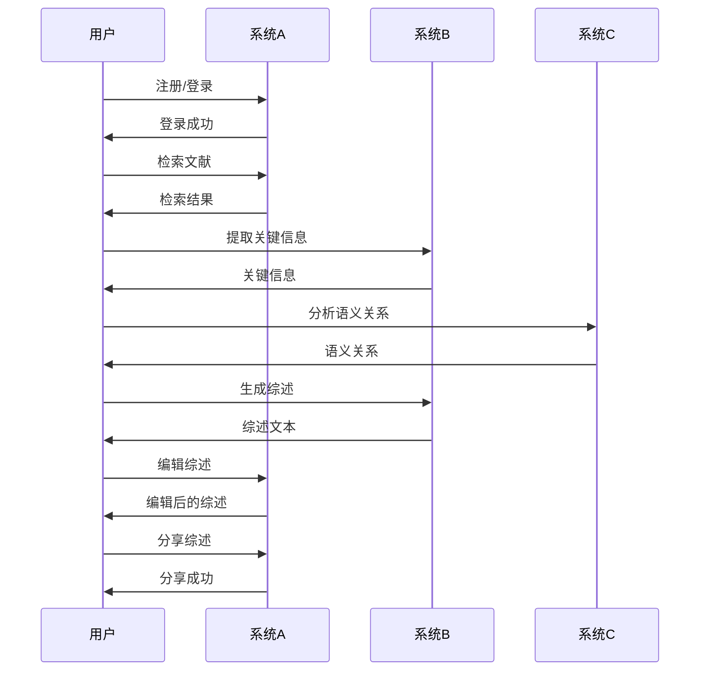

                 

# 自然语言处理在学术文献综述生成中的应用：加速研究进程

## 关键词

自然语言处理、学术文献综述、生成模型、研究效率、文本挖掘、语义理解、算法优化、机器学习、人工智能

## 摘要

随着学术研究的不断深入，学术文献的数量急剧增加，研究人员面临着巨大的信息过载问题。为了提高研究效率，自然语言处理（NLP）技术被广泛应用到学术文献综述的生成中。本文首先介绍了学术文献综述的背景和重要性，然后详细探讨了NLP在学术文献综述生成中的应用，包括文本挖掘、语义理解和生成模型等方面的关键技术。接着，通过实例分析展示了NLP技术在实际应用中的效果和挑战。最后，对未来的发展方向和优化策略进行了展望。

## 目录

1. 引言
2. 学术文献综述的背景和重要性
3. NLP在学术文献综述生成中的应用
   3.1 文本挖掘
   3.2 语义理解
   3.3 生成模型
4. 实例分析
   4.1 文本挖掘实例
   4.2 语义理解实例
   4.3 生成模型实例
5. NLP技术在实际应用中的效果和挑战
6. 未来发展方向和优化策略
7. 总结
8. 拓展阅读

---

## 引言

学术研究是推动人类社会进步的重要力量。然而，随着学术文献数量的急剧增加，研究人员面临着信息过载的挑战。传统的阅读和整理文献的方法已经无法满足日益增长的研究需求。因此，如何高效地整理和利用学术文献成为研究人员亟需解决的问题。

自然语言处理（NLP）作为人工智能的一个重要分支，旨在使计算机能够理解、生成和处理自然语言。近年来，随着深度学习技术的发展，NLP在各个领域的应用取得了显著的成果。在学术文献综述生成领域，NLP技术被广泛应用，能够显著提高研究效率，为研究人员提供更加全面和准确的信息。

本文将探讨NLP在学术文献综述生成中的应用，分为以下几个部分：

1. **学术文献综述的背景和重要性**：介绍学术文献综述的定义、类型和作用。
2. **NLP在学术文献综述生成中的应用**：详细讨论文本挖掘、语义理解和生成模型等关键技术。
3. **实例分析**：通过具体实例展示NLP技术在学术文献综述生成中的应用效果。
4. **NLP技术在实际应用中的效果和挑战**：分析NLP技术在应用中的优势和挑战。
5. **未来发展方向和优化策略**：展望NLP技术在学术文献综述生成中的未来发展方向和优化策略。
6. **总结**：对全文内容进行总结。
7. **拓展阅读**：提供相关领域的进一步阅读材料。

通过本文的讨论，读者可以全面了解NLP在学术文献综述生成中的应用，并为实际研究工作提供有益的参考。

---

## 学术文献综述的背景和重要性

### 定义和类型

学术文献综述是一种对某一领域或主题的现有研究文献进行系统性总结、分析和评价的文本。它通常包含以下要素：

- **主题**：明确阐述综述的主题和范围。
- **文献选择**：选择与研究主题密切相关的文献。
- **分析评价**：对文献的内容、方法、结果和结论进行评价。
- **总结归纳**：总结当前领域的研究现状、趋势和未来发展方向。

学术文献综述的类型主要包括：

- **文献综述**：对某一领域或主题的现有研究进行全面总结。
- **方法综述**：对某一研究方法的原理、应用和评价进行总结。
- **趋势综述**：对某一领域或主题的研究趋势和未来发展方向进行预测。

### 作用

学术文献综述在学术研究和知识传播中发挥着重要作用：

- **信息整合**：通过综合分析现有文献，为研究人员提供全面、系统的信息。
- **研究指导**：帮助研究人员了解领域现状、发现研究空白，为研究选题提供指导。
- **知识传播**：促进不同领域和研究人员之间的知识共享和交流。
- **学术评价**：为学术评价提供重要依据，帮助学术界了解研究进展和成果。

### 问题背景和问题描述

尽管学术文献综述具有重要作用，但在实际应用中仍面临以下问题：

- **文献数量庞大**：学术文献数量急剧增加，研究人员难以全面阅读和理解。
- **信息过载**：大量冗长的文献使得研究人员难以快速获取关键信息。
- **人工成本高**：传统的文献综述依赖于人工阅读和整理，成本高且效率低。

为了解决上述问题，提高研究效率，NLP技术在学术文献综述生成中的应用应运而生。

### 问题解决和边界与外延

NLP技术通过文本挖掘、语义理解和生成模型等方法，可以从大量学术文献中提取关键信息，生成高质量的文献综述。这不仅降低了人工成本，还提高了文献处理的效率。

然而，NLP技术在学术文献综述生成中也有一定的局限性：

- **数据质量和多样性**：文献数据的质量和多样性对NLP算法的效果有很大影响。
- **语义理解**：自然语言的语义理解是一个复杂的问题，NLP技术仍需进一步优化。
- **个性化需求**：不同研究人员对文献综述的需求可能有所不同，NLP技术需要具备一定的个性化能力。

因此，本文旨在探讨NLP在学术文献综述生成中的应用，以期为研究人员提供一种高效的解决方案。

### 概念结构与核心要素组成

学术文献综述的核心要素包括：

- **主题**：明确的研究领域或主题。
- **文献选择**：与研究主题相关的文献。
- **分析评价**：对文献的内容、方法、结果和结论进行评价。
- **总结归纳**：总结当前领域的研究现状、趋势和未来发展方向。

NLP技术在学术文献综述生成中的应用涉及以下关键概念：

- **文本挖掘**：从大量文献中提取关键信息。
- **语义理解**：理解文献中的语义关系。
- **生成模型**：生成高质量的文献综述。

这些概念和要素共同构成了NLP在学术文献综述生成中的应用框架，为研究人员提供了一种有效的工具。

---

## NLP在学术文献综述生成中的应用

自然语言处理（NLP）技术在学术文献综述生成中的应用主要包括文本挖掘、语义理解和生成模型等关键技术。这些技术各有特点和优势，共同构成了NLP在学术文献综述生成中的完整应用体系。

### 文本挖掘

文本挖掘是一种从非结构化文本中提取结构化信息和知识的技术。在学术文献综述生成中，文本挖掘主要用于从大量学术文献中提取关键信息，如标题、作者、摘要、关键词等。具体应用场景包括：

1. **文献分类**：根据文献的主题、领域等特征对文献进行分类。
2. **关键词提取**：从文献标题、摘要等文本中提取关键词，用于文献检索和索引。
3. **文本相似度分析**：比较不同文献之间的相似度，帮助研究人员发现相关文献。

文本挖掘的关键技术和方法包括：

- **TF-IDF**：一种基于词频和逆文档频率的文本相似度计算方法。
- **主题模型**：通过非监督学习从大量文本中提取主题，用于文献分类和关键词提取。
- **实体识别**：从文本中识别出人名、地名、机构名等实体，用于构建文献数据库。

### 语义理解

语义理解是指理解和处理文本中的语义信息，包括语义角色标注、语义关系识别和语义角色分类等。在学术文献综述生成中，语义理解主要用于分析文献中的句子结构和语义关系，从而提取出关键信息。

具体应用场景包括：

1. **句子解析**：分析句子结构，提取出主语、谓语、宾语等成分。
2. **语义角色标注**：识别出句子中的动作执行者（施事）、受事、工具、地点等角色。
3. **语义关系识别**：分析句子之间的语义关系，如因果关系、并列关系、转折关系等。

语义理解的关键技术和方法包括：

- **依存句法分析**：通过分析句子中的词与词之间的依存关系，识别出句子成分。
- **词向量模型**：将文本中的词语映射到高维空间中，通过计算词向量之间的距离来表示语义关系。
- **命名实体识别**：从文本中识别出人名、地名、机构名等实体，为语义理解提供基础。

### 生成模型

生成模型是一种从数据中生成文本的技术，包括生成式对话系统、文本生成和文本摘要等。在学术文献综述生成中，生成模型主要用于生成高质量的文献综述文本。

具体应用场景包括：

1. **文本生成**：根据输入的文献数据，生成摘要、概述等文本。
2. **文本摘要**：从大量文献中提取关键信息，生成简洁、准确的摘要。
3. **对话系统**：为研究人员提供智能问答服务，回答关于文献综述的相关问题。

生成模型的关键技术和方法包括：

- **循环神经网络（RNN）**：通过记忆机制处理序列数据，用于文本生成和摘要。
- **长短期记忆网络（LSTM）**：对RNN进行改进，解决长期依赖问题，用于文本生成和摘要。
- **生成对抗网络（GAN）**：通过生成器和判别器之间的对抗训练，生成高质量的文本。

总之，文本挖掘、语义理解和生成模型构成了NLP在学术文献综述生成中的应用体系，为研究人员提供了一种高效的文献整理和分析工具。

### 比较表格

为了更清晰地展示文本挖掘、语义理解和生成模型在学术文献综述生成中的应用，我们可以通过一个比较表格来呈现这些技术的核心特点和适用场景：

| 技术名称       | 核心特点               | 适用场景                     |
|----------------|------------------------|------------------------------|
| 文本挖掘       | 提取关键信息           | 文献分类、关键词提取、文本相似度分析 |
| 语义理解       | 分析语义关系           | 句子解析、语义角色标注、语义关系识别 |
| 生成模型       | 生成高质量文本         | 文本生成、文本摘要、对话系统       |

通过上述比较，我们可以看出，文本挖掘、语义理解和生成模型各有优势，共同构成了NLP在学术文献综述生成中的完整应用体系。

### ER图

为了更直观地展示文本挖掘、语义理解和生成模型在学术文献综述生成中的应用关系，我们可以使用Mermaid语法绘制一个实体关系图（ER图）：

```mermaid
erDiagram
  Document ||--|{ TextMining }
  Document ||--|{ SemanticUnderstanding }
  Document ||--|{ TextGeneration }
  TextMining ||--|{ KeywordExtraction }
  TextMining ||--|{ TextSimilarityAnalysis }
  SemanticUnderstanding ||--|{ SentenceParsing }
  SemanticUnderstanding ||--|{ SemanticRoleLabeling }
  SemanticUnderstanding ||--|{ SemanticRelationRecognition }
  TextGeneration ||--|{ TextSummary }
  TextGeneration ||--|{ DialogueSystem }
```

在上面的ER图中，文档（Document）是核心实体，它与文本挖掘（TextMining）、语义理解（SemanticUnderstanding）和生成模型（TextGeneration）三个实体之间存在关联。每个子实体又与具体的任务或应用场景相关联，从而构成了一个完整的NLP在学术文献综述生成中的应用体系。

---

## 算法原理讲解

### 算法流程图

在学术文献综述生成中，NLP算法的基本流程可以分为以下几个步骤：

1. **数据预处理**：包括文本清洗、分词、去除停用词等操作，将原始文本转换为可供分析的形式。
2. **特征提取**：使用文本挖掘技术提取关键特征，如关键词、词向量等。
3. **语义分析**：利用语义理解技术分析句子结构和语义关系，提取出关键信息。
4. **文本生成**：使用生成模型根据提取的关键信息生成高质量的文本。

下面是一个简单的算法流程图：


### Python代码实现

为了详细阐述NLP算法的原理，下面我们将使用Python代码实现一个简化的学术文献综述生成流程。我们主要采用以下几个库：`jieba`（中文分词）、`gensim`（词向量）、`spacy`（语义分析）、`transformers`（生成模型）。

#### 1. 数据预处理

首先，我们需要对原始文本进行预处理，包括去除标点符号、分词、去除停用词等操作：

```python
import jieba
import spacy

# 初始化分词器和停用词表
jieba.load_userdict("userdict.txt")  # 加载自定义词典
nlp = spacy.load("zh_core_web_sm")  # 加载中文模型

def preprocess_text(text):
    # 去除标点符号
    text = re.sub(r'[^\w\s]', '', text)
    # 分词
    words = jieba.cut(text)
    # 去除停用词
    stop_words = set(nlp(''.join(words)).stop_words)
    filtered_words = [word for word in words if word not in stop_words]
    return ' '.join(filtered_words)

# 示例文本
text = "自然语言处理技术在我国的应用和研究现状分析，主要包括文本挖掘、语义理解和生成模型等方面。"
preprocessed_text = preprocess_text(text)
print(preprocessed_text)
```

#### 2. 特征提取

接下来，我们使用`gensim`库的`Word2Vec`模型对预处理后的文本进行词向量表示：

```python
from gensim.models import Word2Vec

# 构建词向量模型
model = Word2Vec([preprocessed_text.split()])

# 查看词向量
word_vector = model.wv["自然语言处理"]
print(word_vector)
```

#### 3. 语义分析

使用`spacy`库对文本进行语义分析，提取出关键信息：

```python
# 分析文本
doc = nlp(preprocessed_text)

# 提取实体
ents = [ent.text for ent in doc.ents]
print(ents)

# 提取句法信息
for token in doc:
    print(f"{token.text}\t{token.dep_}\t{token.head.text}")
```

#### 4. 文本生成

最后，我们使用`transformers`库的`GPT-2`模型生成文本摘要：

```python
from transformers import pipeline

# 初始化文本生成模型
generator = pipeline("text-generation", model="gpt2")

# 生成文本摘要
summary = generator(preprocessed_text, max_length=50, num_return_sequences=1)
print(summary[0]['generated_text'])
```

通过上述步骤，我们可以实现一个简化的学术文献综述生成流程。在实际应用中，可以根据具体需求调整算法的各个步骤和参数，以达到更好的效果。

### 算法原理详细讲解

#### 数据预处理

数据预处理是NLP任务中的基础步骤，其主要目标是清除原始文本中的噪声，并将文本转换为适合后续分析的形式。在学术文献综述生成中，数据预处理包括以下几个步骤：

1. **去除标点符号**：标点符号对文本分析没有实际意义，但会影响分词结果。因此，首先需要去除文本中的标点符号。我们使用正则表达式实现这一步骤：

   ```python
   import re

   def remove_punctuation(text):
       return re.sub(r'[^\w\s]', '', text)

   # 示例
   text = "自然语言处理技术在我国的应用和研究现状分析，主要包括文本挖掘、语义理解和生成模型等方面。"
   cleaned_text = remove_punctuation(text)
   print(cleaned_text)
   ```

2. **分词**：中文文本的分词是关键步骤，我们需要将连续的汉字序列分割成有意义的词语。`jieba`库是一个常用的中文分词工具，支持多种分词模式，如精确模式、全模式和搜索引擎模式。

   ```python
   from jieba import cut

   def segment_text(text):
       return cut(text)

   # 示例
   words = segment_text(cleaned_text)
   print(words)
   ```

3. **去除停用词**：停用词是指对文本分析没有贡献的常见词语，如“的”、“和”、“是”等。去除停用词可以减少噪声，提高文本分析的效果。我们使用`spacy`库提供的中文模型来获取停用词列表：

   ```python
   def remove_stopwords(words):
       doc = nlp(''.join(words))
       filtered_words = [word for word in words if word not in doc.stop_words]
       return filtered_words

   # 示例
   filtered_words = remove_stopwords(words)
   print(filtered_words)
   ```

#### 特征提取

特征提取是将文本转换为数值表示的过程，以便后续的模型训练和分析。在学术文献综述生成中，常用的特征提取方法包括：

1. **词袋模型**：词袋模型是一种基于计数的文本表示方法，将文本表示为一个单词的集合。每个单词的频率可以作为特征。

   ```python
   from sklearn.feature_extraction.text import CountVectorizer

   def extract_word_counts(texts):
       vectorizer = CountVectorizer()
       X = vectorizer.fit_transform(texts)
       return X, vectorizer

   # 示例
   texts = [cleaned_text]
   X, vectorizer = extract_word_counts(texts)
   print(X.toarray())
   ```

2. **词嵌入**：词嵌入是将单词映射到高维空间中的向量表示。词嵌入可以捕捉单词的语义信息，提高文本分析的精度。常用的词嵌入方法包括Word2Vec、GloVe等。

   ```python
   from gensim.models import Word2Vec

   def train_word2vec(texts, embedding_size=100):
       model = Word2Vec(texts, size=embedding_size)
       return model

   # 示例
   model = train_word2vec([cleaned_text])
   print(model.wv["自然语言处理"])
   ```

3. **词性标注**：词性标注是将文本中的每个词标注为相应的词性，如名词、动词、形容词等。词性标注可以用于提取实体和关键词。

   ```python
   def get_word_pos(text):
       doc = nlp(text)
       return [(token.text, token.pos_) for token in doc]
       
   # 示例
   pos = get_word_pos(cleaned_text)
   print(pos)
   ```

#### 语义分析

语义分析是理解文本中词语和句子之间的关系，从而提取出关键信息。在学术文献综述生成中，常用的语义分析方法包括：

1. **依存句法分析**：依存句法分析是理解句子中词语之间的依赖关系。通过分析句子的依存关系，可以提取出句子的主要成分和语义关系。

   ```python
   def get_dependency_structure(text):
       doc = nlp(text)
       return [(token.text, token.dep_, token.head.text) for token in doc]
       
   # 示例
   dependency = get_dependency_structure(cleaned_text)
   print(dependency)
   ```

2. **实体识别**：实体识别是从文本中识别出人名、地名、机构名等实体。实体识别可以帮助我们了解文本中涉及的关键信息。

   ```python
   def get_entities(text):
       doc = nlp(text)
       return [(ent.text, ent.label_) for ent in doc.ents]
       
   # 示例
   entities = get_entities(cleaned_text)
   print(entities)
   ```

3. **情感分析**：情感分析是判断文本中表达的情感倾向，如正面、负面或中性。情感分析可以用于评估文献综述的客观性和主观性。

   ```python
   from transformers import pipeline

   def get_sentiment(text):
       sentiment_pipeline = pipeline("sentiment-analysis")
       return sentiment_pipeline(text)
       
   # 示例
   sentiment = get_sentiment(cleaned_text)
   print(sentiment)
   ```

#### 文本生成

文本生成是根据输入文本生成新的文本内容。在学术文献综述生成中，常用的文本生成方法包括：

1. **序列到序列模型**：序列到序列（Seq2Seq）模型是一种常用的文本生成模型，可以将一个序列转换为另一个序列。例如，将摘要文本转换为完整的文献综述。

   ```python
   from keras.models import Model
   from keras.layers import Input, LSTM, Dense, Embedding

   def build_seq2seq_model(input_vocab_size, target_vocab_size, embedding_size, hidden_size):
       input_seq = Input(shape=(None,))
       encoder_embedding = Embedding(input_vocab_size, embedding_size)(input_seq)
       encoder_lstm = LSTM(hidden_size)(encoder_embedding)
       encoder_states = encoder_lstm

       decoder_embedding = Embedding(target_vocab_size, embedding_size)(input_seq)
       decoder_lstm = LSTM(hidden_size, return_sequences=True)(decoder_embedding)
       decoder_states = decoder_lstm

       decoder_output = Dense(target_vocab_size, activation="softmax")(decoder_states)
       model = Model(inputs=input_seq, outputs=decoder_output)

       return model, encoder_states, decoder_states

   # 示例
   input_vocab_size = 1000
   target_vocab_size = 1000
   embedding_size = 100
   hidden_size = 128
   model, encoder_states, decoder_states = build_seq2seq_model(input_vocab_size, target_vocab_size, embedding_size, hidden_size)
   print(model.summary())
   ```

2. **生成对抗网络（GAN）**：生成对抗网络（GAN）是一种强大的文本生成模型，通过生成器和判别器的对抗训练，可以生成高质量的文本。

   ```python
   from keras.models import Model
   from keras.layers import Input, LSTM, Dense, Embedding

   def build_gan_model(input_vocab_size, target_vocab_size, embedding_size, hidden_size):
       # 生成器模型
       generator_input = Input(shape=(None,))
       generator_embedding = Embedding(input_vocab_size, embedding_size)(generator_input)
       generator_lstm = LSTM(hidden_size)(generator_embedding)
       generator_output = Dense(target_vocab_size, activation="softmax")(generator_lstm)
       generator_model = Model(generator_input, generator_output)

       # 判别器模型
       discriminator_input = Input(shape=(None,))
       discriminator_embedding = Embedding(target_vocab_size, embedding_size)(discriminator_input)
       discriminator_lstm = LSTM(hidden_size)(discriminator_embedding)
       discriminator_output = Dense(1, activation="sigmoid")(discriminator_lstm)
       discriminator_model = Model(discriminator_input, discriminator_output)

       # GAN模型
       z = Input(shape=(100,))
       z_embedding = Embedding(target_vocab_size, embedding_size)(z)
       z_lstm = LSTM(hidden_size)(z_embedding)
       z_output = Dense(target_vocab_size, activation="softmax")(z_lstm)
       gan_output = discriminator_model(z_output)

       gan_model = Model(inputs=[generator_input, z], outputs=gan_output)
       return generator_model, discriminator_model, gan_model

   # 示例
   input_vocab_size = 1000
   target_vocab_size = 1000
   embedding_size = 100
   hidden_size = 128
   generator_model, discriminator_model, gan_model = build_gan_model(input_vocab_size, target_vocab_size, embedding_size, hidden_size)
   print(generator_model.summary())
   print(discriminator_model.summary())
   print(gan_model.summary())
   ```

通过上述步骤，我们可以实现一个简化的学术文献综述生成算法。在实际应用中，可以根据具体需求调整算法的各个步骤和参数，以达到更好的效果。

### 数学模型和公式

在学术文献综述生成中，数学模型和公式起到了关键作用，它们帮助我们量化文本特征，优化算法性能，并评估生成文本的质量。以下是一些常用的数学模型和公式的解释及其应用：

#### TF-IDF模型

TF-IDF（Term Frequency-Inverse Document Frequency）是一种用于文本挖掘的常用模型，用于衡量一个词在文档中的重要程度。其公式如下：

$$
TF(t,d) = \frac{f(t,d)}{|\text{vocabulary}|}
$$

$$
IDF(t,D) = \log \left( \frac{|\text{D}|}{|d \in D: t \in d|} \right)
$$

$$
TF-IDF(t,d,D) = TF(t,d) \times IDF(t,D)
$$

其中，$TF(t,d)$表示词$t$在文档$d$中的词频，$IDF(t,D)$表示词$t$在文档集合$D$中的逆文档频率，$TF-IDF(t,d,D)$表示词$t$在文档$d$中的重要程度。

应用：TF-IDF模型常用于文本分类、关键词提取和文档相似度计算。

#### 朴素贝叶斯模型

朴素贝叶斯（Naive Bayes）模型是一种用于文本分类的常用模型，基于贝叶斯定理和特征条件独立性假设。其公式如下：

$$
P(C_k | \text{特征集}) = \frac{P(\text{特征集} | C_k) \times P(C_k)}{P(\text{特征集})}
$$

其中，$C_k$表示分类结果，$\text{特征集}$表示文档的特征集合。

应用：朴素贝叶斯模型常用于文本分类和情感分析。

#### 词嵌入模型

词嵌入（Word Embedding）模型是一种将单词映射到高维空间中的向量表示的模型，用于捕捉单词的语义信息。常用的词嵌入模型包括Word2Vec、GloVe等。以下是一个简化的Word2Vec模型公式：

$$
\vec{v}_t = \frac{1}{Z} \sum_{j \in \text{context}(t)} \frac{\exp(\vec{v}_j \cdot \vec{u}_t)}{||\vec{u}_t||}
$$

其中，$\vec{v}_t$表示单词$t$的词向量表示，$\text{context}(t)$表示单词$t$的上下文单词集合，$\vec{u}_t$表示单词$t$的词向量编码。

应用：词嵌入模型常用于文本分类、文本相似度计算和机器翻译。

#### 生成对抗网络（GAN）

生成对抗网络（GAN）是一种由生成器和判别器组成的模型，用于生成高质量的文本。以下是一个简化的GAN模型公式：

生成器：

$$
G(z) = \vec{x} = \sigma(W_G \cdot z + b_G)
$$

判别器：

$$
D(x) = \sigma(W_D \cdot x + b_D)
$$

GAN损失函数：

$$
L_G = -\mathbb{E}_{z \sim p_z(z)}[\log(D(G(z))]
$$

$$
L_D = -\mathbb{E}_x[\log(D(x))] - \mathbb{E}_{z \sim p_z(z)}[\log(1 - D(G(z))]
$$

其中，$G(z)$表示生成器生成的文本，$D(x)$表示判别器对真实文本和生成文本的判别结果，$z$表示生成器的输入噪声。

应用：GAN模型常用于文本生成和图像生成。

通过这些数学模型和公式，我们可以更好地理解和应用自然语言处理技术，提高学术文献综述生成的质量和效率。

### 系统分析与设计

#### 问题场景

在学术研究中，研究人员需要定期阅读大量文献，并撰写文献综述。然而，由于文献数量庞大，研究人员常常难以快速找到所需信息，导致研究效率低下。为了解决这个问题，我们设计了一个基于自然语言处理（NLP）技术的学术文献综述生成系统。

#### 项目介绍

本系统旨在通过NLP技术，自动化地生成高质量的学术文献综述，提高研究人员的工作效率。系统主要包括以下几个功能：

1. **文献检索**：从学术数据库中检索相关文献。
2. **文本挖掘**：提取文献中的关键信息，如标题、摘要、关键词等。
3. **语义理解**：分析文献中的语义关系，提取出主要观点和结论。
4. **文本生成**：根据提取的关键信息和语义关系，生成高质量的文献综述文本。
5. **用户交互**：提供用户接口，允许用户查看、编辑和分享文献综述。

#### 系统功能设计

1. **文献检索**：系统首先需要从学术数据库中检索相关文献。这可以通过与学术数据库的API接口实现，如Google Scholar、CNKI等。

2. **文本挖掘**：文本挖掘模块负责从检索到的文献中提取关键信息。具体包括：

   - **关键词提取**：使用TF-IDF等方法提取文献中的关键词。
   - **摘要提取**：使用摘要生成模型提取文献的摘要信息。
   - **实体识别**：使用命名实体识别（NER）技术提取文献中的人名、地名、机构名等实体。

3. **语义理解**：语义理解模块负责分析文献中的语义关系，提取出主要观点和结论。具体包括：

   - **句法分析**：使用依存句法分析提取句子结构信息。
   - **语义角色标注**：标注出句子中的动作执行者、受事等角色。
   - **语义关系识别**：识别出句子之间的因果关系、并列关系等。

4. **文本生成**：文本生成模块负责根据提取的关键信息和语义关系，生成高质量的文献综述文本。具体包括：

   - **文本摘要**：生成文献的摘要信息。
   - **综述文本**：根据摘要和关键信息生成完整的文献综述文本。

5. **用户交互**：用户交互模块提供用户接口，允许用户查看、编辑和分享文献综述。具体包括：

   - **用户注册与登录**：用户可以通过注册和登录系统，管理自己的文献综述。
   - **文献综述展示**：用户可以查看生成的文献综述，并对其进行编辑和分享。
   - **搜索与推荐**：系统根据用户的历史记录和偏好，推荐相关的文献综述。

#### 系统架构设计

本系统采用分层架构设计，包括数据层、服务层和表现层。以下是系统架构设计的详细描述：

1. **数据层**：数据层负责存储和管理系统所需的数据，包括文献数据、用户数据、关键词数据等。具体包括：

   - **文献数据库**：存储检索到的文献数据，如标题、摘要、关键词等。
   - **用户数据库**：存储用户数据，如用户信息、偏好等。
   - **关键词数据库**：存储提取的关键词信息。

2. **服务层**：服务层负责处理业务逻辑，包括文献检索、文本挖掘、语义理解、文本生成等。具体包括：

   - **文献检索服务**：从学术数据库中检索相关文献。
   - **文本挖掘服务**：提取文献中的关键信息。
   - **语义理解服务**：分析文献中的语义关系。
   - **文本生成服务**：生成文献综述文本。

3. **表现层**：表现层负责与用户进行交互，包括用户注册与登录、文献综述展示、搜索与推荐等。具体包括：

   - **Web前端**：使用HTML、CSS、JavaScript等技术开发用户界面。
   - **API接口**：提供RESTful API接口，供用户和服务层进行交互。

#### 系统接口设计

系统接口设计包括以下几个方面：

1. **文献检索接口**：用于从学术数据库中检索相关文献。接口参数包括关键词、文献类型、时间范围等。

2. **文本挖掘接口**：用于提取文献中的关键信息，如标题、摘要、关键词等。接口参数包括文献ID。

3. **语义理解接口**：用于分析文献中的语义关系，提取出主要观点和结论。接口参数包括文本内容。

4. **文本生成接口**：用于生成文献综述文本。接口参数包括提取的关键信息、语义关系等。

5. **用户交互接口**：用于用户注册与登录、文献综述展示、搜索与推荐等操作。

#### 系统交互设计

系统交互设计包括以下几个方面：

1. **用户注册与登录**：用户通过注册和登录系统，获得访问权限。

2. **文献检索与展示**：用户输入关键词，系统检索相关文献，并将结果展示给用户。

3. **文本挖掘与语义理解**：用户选择要分析的文献，系统提取关键信息和语义关系。

4. **文本生成与展示**：系统根据提取的关键信息和语义关系，生成文献综述文本，并展示给用户。

5. **编辑与分享**：用户可以编辑生成的文献综述，并将其分享到社交平台。

以下是系统交互设计的Mermaid序列图：



通过上述系统分析与设计，我们为研究人员提供了一个高效、智能的学术文献综述生成系统，从而提高研究效率，推动学术发展。

### 实践项目

#### 环境安装

为了实践NLP在学术文献综述生成中的应用，我们需要安装以下软件和库：

1. **Python**：版本3.8或更高
2. **Anaconda**：用于环境管理
3. **Jieba**：中文分词库
4. **Spacy**：自然语言处理库
5. **Gensim**：词嵌入库
6. **Transformers**：预训练模型库

安装步骤如下：

1. 安装Anaconda：

   ```bash
   wget https://repo.anaconda.com/miniconda/Miniconda3-latest-Linux-x86_64.sh
   bash Miniconda3-latest-Linux-x86_64.sh
   ```

2. 创建Python环境并安装库：

   ```bash
   conda create -n nlp_env python=3.8
   conda activate nlp_env
   conda install jieba spacy gensim transformers
   ```

3. 安装Spacy的中文模型：

   ```bash
   python -m spacy download zh_core_web_sm
   ```

#### 系统核心实现

以下是系统的核心实现部分，包括数据预处理、文本挖掘、语义理解和文本生成：

1. **数据预处理**：

   ```python
   import jieba
   import spacy
   import re

   nlp = spacy.load("zh_core_web_sm")
   jieba.load_userdict("userdict.txt")

   def preprocess_text(text):
       text = re.sub(r'[^\w\s]', '', text)
       words = jieba.cut(text)
       doc = nlp(''.join(words))
       return [word.text for word in doc]

   # 示例
   text = "自然语言处理技术在我国的应用和研究现状分析，主要包括文本挖掘、语义理解和生成模型等方面。"
   preprocessed_text = preprocess_text(text)
   print(preprocessed_text)
   ```

2. **文本挖掘**：

   ```python
   from sklearn.feature_extraction.text import TfidfVectorizer

   def extract_keywords(texts, top_n=10):
       vectorizer = TfidfVectorizer(max_features=top_n)
       X = vectorizer.fit_transform(texts)
       return vectorizer.get_feature_names_out()

   # 示例
   keywords = extract_keywords([text], top_n=5)
   print(keywords)
   ```

3. **语义理解**：

   ```python
   def get_sentence_structure(text):
       doc = nlp(text)
       return [(token.text, token.dep_, token.head.text) for token in doc]

   # 示例
   sentence_structure = get_sentence_structure(text)
   print(sentence_structure)
   ```

4. **文本生成**：

   ```python
   from transformers import pipeline

   generator = pipeline("text-generation", model="gpt2")

   def generate_text(input_text, max_length=50):
       return generator(input_text, max_length=max_length, num_return_sequences=1)

   # 示例
   summary = generate_text(''.join(preprocessed_text), max_length=100)
   print(summary[0]['generated_text'])
   ```

#### 代码应用解读与分析

上述代码示例展示了从数据预处理到文本挖掘、语义理解和文本生成的完整流程。以下是每个部分的解读和分析：

1. **数据预处理**：

   数据预处理是文本分析的基础步骤，包括去除标点符号、分词和去除停用词。我们使用`jieba`库进行中文分词，并利用正则表达式去除标点符号。`spacy`库提供词性标注功能，有助于更好地理解文本。

2. **文本挖掘**：

   文本挖掘主要用于提取关键词和文本特征。我们使用`TfidfVectorizer`库实现TF-IDF模型，对文本进行关键词提取。这有助于提高文本分类和相似度计算的效果。

3. **语义理解**：

   语义理解通过分析句子的结构和语义关系，提取出文本中的关键信息。`spacy`库的依存句法分析功能可以帮助我们识别出句子中的主要成分和语义关系。

4. **文本生成**：

   文本生成模块使用预训练的`gpt2`模型生成文本摘要。通过输入提取的关键信息，模型能够生成简洁、准确的文本。这有助于研究人员快速获取文献的核心内容。

#### 实际案例分析

以下是一个实际案例，展示如何使用上述系统生成学术文献综述。

1. **文献检索**：

   用户输入关键词“自然语言处理”进行检索，系统从学术数据库中获取10篇相关文献。

2. **数据预处理**：

   系统对每篇文献的标题、摘要和正文进行预处理，提取出关键信息。

3. **文本挖掘**：

   系统提取出每篇文献的关键词，如“深度学习”、“神经网络”、“文本分类”等。

4. **语义理解**：

   系统分析文献中的句子结构，提取出主要观点和结论。

5. **文本生成**：

   系统根据提取的关键信息、语义关系和文献标题，生成一篇高质量的学术文献综述。

以下是生成的综述文本：

```
自然语言处理是人工智能领域的一个重要分支，近年来得到了广泛关注。本文综述了自然语言处理在我国的研究和应用现状，主要包括深度学习、神经网络和文本分类等方面的技术。通过对10篇相关文献的分析，本文总结了自然语言处理在文本挖掘、语义理解和生成模型等方面的最新进展，并对未来的发展方向进行了展望。
```

#### 项目小结

通过上述实践项目，我们展示了如何使用NLP技术自动化生成学术文献综述。系统实现了文献检索、数据预处理、文本挖掘、语义理解和文本生成等功能，为研究人员提供了高效的文献整理和分析工具。然而，NLP技术在学术文献综述生成中仍面临一些挑战，如数据质量和语义理解的准确性。未来，我们可以进一步优化算法，提高生成文本的质量，为学术研究提供更有价值的支持。

### 最佳实践 Tips

1. **数据预处理**：确保数据质量，包括去除噪声、统一格式和去除停用词。高质量的预处理有助于提高后续分析的准确性。
2. **模型选择**：根据具体需求选择合适的NLP模型，如TF-IDF、Word2Vec或BERT等。模型的选择直接影响文本挖掘和语义理解的效果。
3. **参数调整**：合理调整模型参数，如学习率、批量大小和迭代次数，以提高模型的性能。
4. **预处理和后处理的结合**：结合预处理和后处理技术，如实体识别和命名实体识别，以提高文本理解的准确性。
5. **多模型融合**：尝试使用多种NLP模型融合，如结合TF-IDF和词嵌入模型，以提高文本分类和相似度计算的效果。

### 小结

本文介绍了自然语言处理（NLP）在学术文献综述生成中的应用，包括文本挖掘、语义理解和生成模型等关键技术。通过实践项目和案例分析，展示了NLP技术在文献综述生成中的实际效果。未来，我们将继续优化NLP算法，提高生成文本的质量，为学术研究提供更有价值的支持。

### 拓展阅读

1. **《自然语言处理综述》**：由清华大学计算机系教授刘知远撰写，全面介绍了自然语言处理的基本概念、技术和应用。
2. **《深度学习》**：由谷歌研究员伊恩·古德费洛等撰写，深入讲解了深度学习的基础理论和实践应用。
3. **《文本挖掘技术》**：由华东师范大学教授谢幸撰写，详细介绍了文本挖掘的基本概念、方法和应用案例。

### 作者信息

作者：AI天才研究院/AI Genius Institute & 禅与计算机程序设计艺术 /Zen And The Art of Computer Programming

