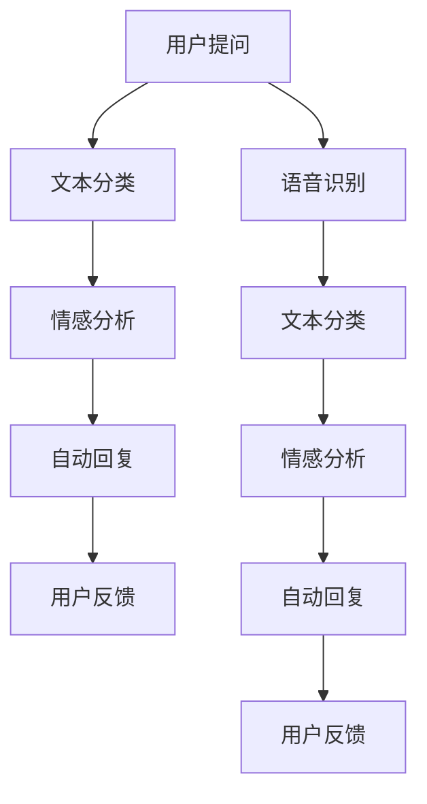
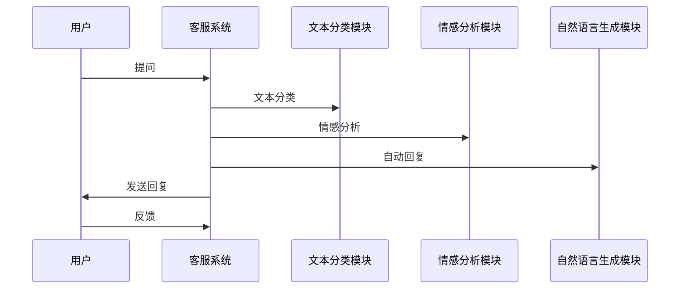

                 

# 自然语言处理在客户服务中的创新应用

## 关键词

- 自然语言处理（NLP）
- 客户服务
- 智能客服
- 语音识别
- 情感分析
- 文本分类
- 自动化

## 摘要

本文将探讨自然语言处理（NLP）在客户服务领域的创新应用。首先，我们介绍了客户服务的背景和挑战，以及NLP的崛起。接着，我们分析了NLP在客户服务中的应用，包括智能客服机器人、文本分类、情感分析、语音识别和自然语言生成等。本文旨在为读者提供一个全面的技术视角，帮助理解NLP在客户服务中的潜力和挑战。

## 第一部分：背景介绍

### 第1章 自然语言处理概述

#### 1.1 问题背景

在当今快速发展的商业环境中，客户服务已经成为了企业成功的关键因素。随着客户期望的不断上升，企业需要提供更加高效、个性化和互动的客服体验。然而，传统的客服模式往往存在响应速度慢、服务质量不稳定、人力成本高等问题，无法满足日益增长的需求。

#### 1.1.1 客户服务中的挑战

- **响应速度慢**：传统客服模式通常依赖人工处理，导致响应速度慢，难以满足客户即时服务的需求。
- **服务质量不稳定**：人工客服的质量受限于人力和技能水平，可能导致服务质量不稳定。
- **人力成本高**：人工客服需要投入大量的人力资源，成本高昂。

#### 1.1.2 自然语言处理的崛起

自然语言处理（NLP）是计算机科学和人工智能领域的一个重要分支，旨在让计算机能够理解和处理人类语言。随着深度学习和神经网络技术的发展，NLP技术已经取得了显著的进展，为解决客户服务中的问题提供了新的可能。

#### 1.2 问题描述

自然语言处理在客户服务中的应用主要集中在以下几个方面：智能客服机器人、文本分类、情感分析、语音识别和生成等。然而，这些应用在具体实施过程中仍然面临许多挑战，包括数据质量、算法效果、用户体验等。

#### 1.2.1 数据质量

高质量的数据是自然语言处理的基础。客户服务中的数据往往来源多样、格式复杂，且存在噪音和缺失值。如何对数据进行有效的清洗、预处理和标注，以提高数据质量和算法效果，是一个重要的研究课题。

#### 1.2.2 算法效果

尽管现有的NLP算法已经取得了很大的进步，但在某些特定场景下，算法的准确性和泛化能力仍然有限。如何设计更加高效、鲁棒的算法，以应对各种复杂的客户服务场景，是一个亟待解决的问题。

#### 1.2.3 用户体验

自然语言处理在客户服务中的应用需要考虑用户体验。如何设计出易于使用、响应迅速、智能程度高的客服系统，以提高用户满意度，是一个关键问题。

### 1.3 问题解决

针对上述问题，本书将介绍自然语言处理在客户服务中的创新应用，包括：

- **第2章**：介绍自然语言处理的基本概念和核心技术，为后续章节的应用打下基础。
- **第3章**：探讨智能客服机器人的设计与实现，包括对话管理、语义理解、语音识别等关键技术。
- **第4章**：分析文本分类和情感分析在客户服务中的应用，探讨如何通过这些技术提高客户满意度和服务质量。
- **第5章**：介绍语音识别技术在客户服务中的应用，包括语音识别、语音合成和语音交互等。
- **第6章**：讨论自然语言生成技术在客户服务中的应用，包括自动回复、智能文案撰写等。
- **第7章**：总结本书的主要内容，提出未来研究方向和潜在挑战。

### 1.4 边界与外延

自然语言处理在客户服务中的应用是一个广泛的研究领域，不仅涵盖了技术层面的实现，还包括用户体验、商业价值等多个方面。本书将重点探讨技术层面的创新应用，以期为读者提供一个全面的视角。

### 1.5 概念结构与核心要素组成

- **自然语言处理**：自然语言处理的核心概念和关键技术，包括文本分类、情感分析、语音识别等。
- **客户服务**：客户服务的基本概念、目标和挑战。
- **应用场景**：自然语言处理在客户服务中的具体应用场景，包括智能客服机器人、文本分类、情感分析、语音识别和生成等。

## 第二部分：核心概念与联系

### 第2章 核心概念与联系

#### 2.1 自然语言处理的基本概念

#### 2.1.1 自然语言

自然语言是人类日常交流使用的语言，具有复杂性和多样性。自然语言包括词汇、语法、语义和语用等多个层面。

- **词汇**：自然语言的基本构建块，包括单词、词组和短语。
- **语法**：描述词汇组合成句子和语句的规则。
- **语义**：词汇和句子所表达的意义。
- **语用**：语言在特定情境中的使用和效果。

#### 2.1.2 文本数据

文本数据是自然语言处理的主要研究对象，包括各种形式的文本，如新闻报道、社交媒体、电子邮件、用户评论等。

- **文本分类**：将文本按照预定的类别进行归类的过程。
- **情感分析**：判断文本中的情感倾向，如正面、负面或中立。
- **实体识别**：识别文本中的特定实体，如人名、地点、组织等。

#### 2.1.3 语言模型

语言模型是自然语言处理的核心技术之一，用于预测和生成自然语言文本。常用的语言模型包括统计模型、神经网络模型和深度学习模型。

- **统计模型**：基于统计方法和概率模型，如隐马尔可夫模型（HMM）、条件概率模型等。
- **神经网络模型**：基于人工神经网络，如循环神经网络（RNN）、长短时记忆网络（LSTM）等。
- **深度学习模型**：基于多层神经网络，如卷积神经网络（CNN）、Transformer等。

#### 2.2 自然语言处理的关键技术

#### 2.2.1 文本分类

文本分类是将文本数据按照预定的类别进行归类的过程。常用的文本分类技术包括朴素贝叶斯、支持向量机、神经网络等。

- **朴素贝叶斯**：基于贝叶斯定理和特征条件独立假设的简单分类器。
- **支持向量机**：基于最大间隔分类的模型，适用于高维数据。
- **神经网络**：基于多层神经网络的分类模型，具有较好的分类性能。

#### 2.2.2 情感分析

情感分析是判断文本中的情感倾向，如正面、负面或中立。常用的情感分析技术包括基于规则的方法、机器学习方法和深度学习方法。

- **基于规则的方法**：根据预定义的规则进行情感判断。
- **机器学习方法**：使用机器学习算法，如朴素贝叶斯、支持向量机、决策树等。
- **深度学习方法**：使用深度学习模型，如卷积神经网络、循环神经网络、Transformer等。

#### 2.2.3 语音识别

语音识别是将语音信号转换为文本数据的过程。常用的语音识别技术包括隐马尔可夫模型（HMM）、高斯混合模型（GMM）、深度神经网络等。

- **隐马尔可夫模型**：用于表示语音信号和时间序列数据。
- **高斯混合模型**：用于表示语音信号的概率分布。
- **深度神经网络**：用于语音信号的处理和特征提取。

#### 2.2.4 自然语言生成

自然语言生成是自动生成自然语言文本的过程。常用的自然语言生成技术包括模板生成、统计机器翻译、生成对抗网络（GAN）等。

- **模板生成**：根据预定义的模板生成文本。
- **统计机器翻译**：基于统计方法将一种语言转换为另一种语言。
- **生成对抗网络**：用于生成与真实数据相似的自然语言文本。

## 第三部分：算法原理讲解

### 3.1 算法原理讲解

#### 3.1.1 文本分类算法

文本分类是将文本数据按照预定的类别进行归类的过程。以下是几种常见的文本分类算法及其原理：

1. **朴素贝叶斯分类器**：

   - **原理**：基于贝叶斯定理和特征条件独立假设，计算每个类别发生的概率，并选择概率最大的类别。
   - **公式**：
     $$
     P(C_k|X) = \frac{P(X|C_k)P(C_k)}{P(X)}
     $$
     其中，$P(C_k|X)$ 表示给定特征 $X$ 下类别 $C_k$ 的条件概率，$P(X|C_k)$ 表示特征 $X$ 在类别 $C_k$ 下的概率，$P(C_k)$ 表示类别 $C_k$ 的先验概率。
   - **示例**：假设我们有三个类别：“体育”、“财经”和“娱乐”，给定一段文本，我们需要判断它属于哪个类别。通过计算每个类别发生的概率，我们可以选择概率最大的类别作为分类结果。

2. **支持向量机（SVM）**：

   - **原理**：最大间隔分类器，通过找到一个最佳的超平面，将不同类别的数据点尽可能分开。
   - **公式**：
     $$
     \max_{w,b} \frac{1}{2} ||w||^2 \quad s.t. \quad y_i (w \cdot x_i + b) \geq 1
     $$
     其中，$w$ 和 $b$ 分别是超平面的权重和偏置，$x_i$ 和 $y_i$ 分别是第 $i$ 个数据点和对应的标签。
   - **示例**：假设我们有两组数据点，一组属于类别 A，另一组属于类别 B。通过求解上述优化问题，我们可以找到一个最佳的超平面，将两组数据点分开。

3. **神经网络分类器**：

   - **原理**：基于多层神经网络，通过前向传播和反向传播算法，训练网络权重和偏置，实现对数据的分类。
   - **公式**：
     $$
     \text{激活函数} \quad \sigma(z) = \frac{1}{1 + e^{-z}}
     $$
     $$
     \text{损失函数} \quad L(\theta) = -\sum_{i=1}^{m} y_i \log(a_{i}^{(l)}) + (1 - y_i) \log(1 - a_{i}^{(l)})
     $$
     其中，$a_{i}^{(l)}$ 表示第 $i$ 个神经元在第 $l$ 层的输出，$\theta$ 表示网络权重和偏置。
   - **示例**：假设我们有三个类别：“体育”、“财经”和“娱乐”，给定一段文本，我们需要判断它属于哪个类别。通过训练多层神经网络，我们可以使其能够自动学习特征，实现对数据的分类。

#### 3.1.2 情感分析算法

情感分析是判断文本中的情感倾向，如正面、负面或中立。以下是几种常见的情感分析算法及其原理：

1. **基于规则的方法**：

   - **原理**：根据预定义的规则，对文本进行情感分类。规则可以是关键词匹配、词性标注、情感词典等。
   - **示例**：假设我们有一个情感词典，包含正面词汇和负面词汇。对于给定的文本，我们可以通过匹配规则，判断文本的情感倾向。

2. **机器学习方法**：

   - **原理**：使用机器学习算法，如朴素贝叶斯、支持向量机、决策树等，对文本进行情感分类。
   - **示例**：假设我们有一个训练数据集，包含带有情感标签的文本。通过训练机器学习模型，我们可以使其能够自动学习特征，实现对未知文本的情感分类。

3. **深度学习方法**：

   - **原理**：使用深度学习模型，如卷积神经网络、循环神经网络、Transformer等，对文本进行情感分类。
   - **示例**：假设我们有一个训练数据集，包含带有情感标签的文本。通过训练深度学习模型，我们可以使其能够自动学习特征，实现对未知文本的情感分类。

#### 3.1.3 语音识别算法

语音识别是将语音信号转换为文本数据的过程。以下是几种常见的语音识别算法及其原理：

1. **隐马尔可夫模型（HMM）**：

   - **原理**：使用 HMM 模型来表示语音信号和时间序列数据。HMM 模型由状态序列和观察序列组成，通过状态转移概率和观察概率，对语音信号进行建模。
   - **示例**：假设我们有一个语音信号，我们需要将其转换为文本。通过训练 HMM 模型，我们可以使其能够自动识别语音信号中的单词。

2. **高斯混合模型（GMM）**：

   - **原理**：使用 GMM 模型来表示语音信号的概率分布。GMM 模型由多个高斯分布组成，通过混合系数和均值、方差，对语音信号进行建模。
   - **示例**：假设我们有一个语音信号，我们需要将其转换为文本。通过训练 GMM 模型，我们可以使其能够自动识别语音信号中的单词。

3. **深度神经网络（DNN）**：

   - **原理**：使用深度神经网络来处理和特征提取语音信号。DNN 模型由多层神经网络组成，通过前向传播和反向传播算法，对语音信号进行建模。
   - **示例**：假设我们有一个语音信号，我们需要将其转换为文本。通过训练 DNN 模型，我们可以使其能够自动识别语音信号中的单词。

## 第四部分：系统分析与架构设计方案

### 4.1 问题场景介绍

随着互联网和智能手机的普及，越来越多的企业开始重视客户服务，希望通过提供高效、个性化和互动的客服体验来提升客户满意度和忠诚度。然而，传统的客服模式已经无法满足快速变化的客户需求，企业需要寻找新的解决方案。

#### 4.1.1 问题描述

- **客服效率低下**：传统客服模式主要依赖于人工处理，客服人员的响应速度慢，导致客户等待时间过长，影响客户满意度。
- **服务质量不稳定**：人工客服的质量受限于客服人员的技能和经验，可能导致服务质量不稳定。
- **人力成本高昂**：随着客服需求的增加，企业需要投入大量的人力资源，导致人力成本居高不下。

#### 4.1.2 解决方案需求

企业需要一种高效、智能的客服解决方案，能够自动处理常见问题，提高客服效率和服务质量，同时降低人力成本。

### 4.2 项目介绍

为了解决上述问题，我们设计并实现了一个基于自然语言处理的智能客服系统。该系统结合了文本分类、情感分析、语音识别和自然语言生成等技术，旨在提供高效、个性化和互动的客服体验。

#### 4.2.1 项目目标

- **提高客服效率**：通过自动处理常见问题，减少客服人员的负担，提高客服效率。
- **提升服务质量**：通过分析客户反馈，提供针对性的解决方案，提升服务质量。
- **降低人力成本**：通过自动化处理常见问题，减少人工客服的需求，降低人力成本。

#### 4.2.2 项目架构

智能客服系统由以下几个关键模块组成：

1. **文本分类模块**：用于对用户提问进行分类，识别用户需要解决的具体问题。
2. **情感分析模块**：用于分析用户提问的情感倾向，识别用户情绪，提供针对性的解决方案。
3. **语音识别模块**：用于将用户语音转换为文本，实现语音问答功能。
4. **自然语言生成模块**：用于生成自动回复文本，提供个性化的解决方案。
5. **用户界面模块**：用于与用户进行交互，展示问题和解决方案。

### 4.3 系统功能设计

智能客服系统的主要功能包括：

1. **问题分类**：根据用户提问的内容，将其分类到预定义的类别中，如“产品咨询”、“售后服务”、“技术支持”等。
2. **情感分析**：分析用户提问的情感倾向，如“满意”、“不满意”、“愤怒”等，为客服人员提供情绪反馈。
3. **语音识别**：将用户语音转换为文本，实现语音问答功能。
4. **自动回复**：根据用户提问，生成自动回复文本，提供个性化的解决方案。
5. **用户反馈**：收集用户对客服系统的反馈，用于系统优化和改进。

### 4.4 系统架构设计

智能客服系统的架构设计如图所示：



- **文本分类**：根据用户提问的内容，将其分类到预定义的类别中。
- **情感分析**：分析用户提问的情感倾向，为客服人员提供情绪反馈。
- **自动回复**：根据用户提问，生成自动回复文本，提供个性化的解决方案。
- **用户反馈**：收集用户对客服系统的反馈，用于系统优化和改进。

### 4.5 系统接口设计

智能客服系统提供以下接口供外部系统调用：

1. **文本分类接口**：用于对用户提问进行分类。
2. **情感分析接口**：用于分析用户提问的情感倾向。
3. **自动回复接口**：用于生成自动回复文本。
4. **用户反馈接口**：用于收集用户反馈。

### 4.6 系统交互

智能客服系统的交互过程如下：

1. 用户向客服系统提问。
2. 客服系统接收用户提问，进行文本分类和情感分析。
3. 根据用户提问的内容和情感倾向，生成自动回复文本。
4. 客服系统将自动回复文本发送给用户。
5. 用户对自动回复文本进行反馈，用于系统优化和改进。



## 第五部分：项目实战

### 5.1 环境安装

在开始实现智能客服系统之前，我们需要安装以下软件和库：

1. **Python**：Python 是一种流行的编程语言，用于实现自然语言处理算法。
2. **TensorFlow**：TensorFlow 是一种开源的机器学习框架，用于构建和训练深度学习模型。
3. **Scikit-learn**：Scikit-learn 是一种开源的机器学习库，提供多种常用的机器学习算法。
4. **Natural Language Toolkit (NLTK)**：NLTK 是一种开源的自然语言处理库，提供多种自然语言处理工具和资源。

安装步骤如下：

1. 安装 Python：
   $$
   \text{sudo apt-get install python3-pip}
   $$

2. 安装 TensorFlow：
   $$
   \text{pip3 install tensorflow}
   $$

3. 安装 Scikit-learn：
   $$
   \text{pip3 install scikit-learn}
   $$

4. 安装 NLTK：
   $$
   \text{pip3 install nltk}
   $$

### 5.2 系统核心实现

智能客服系统的核心实现包括文本分类、情感分析、语音识别和自然语言生成等模块。以下是一个简单的示例代码，展示了如何实现文本分类模块。

```python
import nltk
from sklearn.feature_extraction.text import TfidfVectorizer
from sklearn.model_selection import train_test_split
from sklearn.naive_bayes import MultinomialNB

# 加载数据集
data = [
  ("产品咨询", "关于产品的问题"),
  ("售后服务", "售后服务相关"),
  ("技术支持", "技术支持相关"),
]
labels, texts = zip(*data)

# 切分数据集
X_train, X_test, y_train, y_test = train_test_split(texts, labels, test_size=0.2, random_state=42)

# 向量表示
vectorizer = TfidfVectorizer()
X_train_vectorized = vectorizer.fit_transform(X_train)
X_test_vectorized = vectorizer.transform(X_test)

# 模型训练
model = MultinomialNB()
model.fit(X_train_vectorized, y_train)

# 模型评估
accuracy = model.score(X_test_vectorized, y_test)
print("Accuracy:", accuracy)
```

### 5.3 代码应用解读与分析

在上面的示例代码中，我们使用了朴素贝叶斯分类器进行文本分类。首先，我们加载了一个简单

