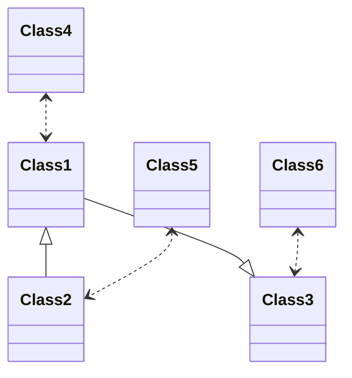
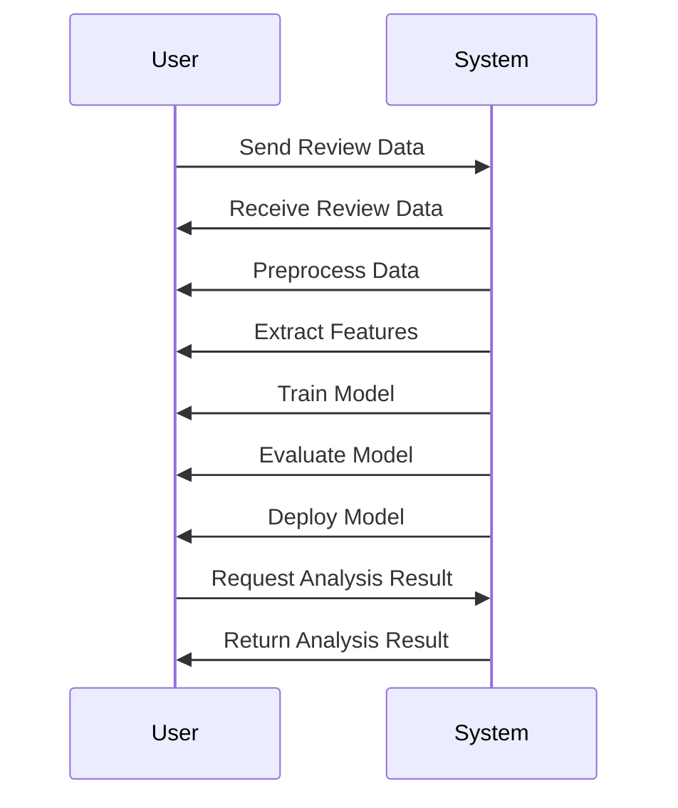
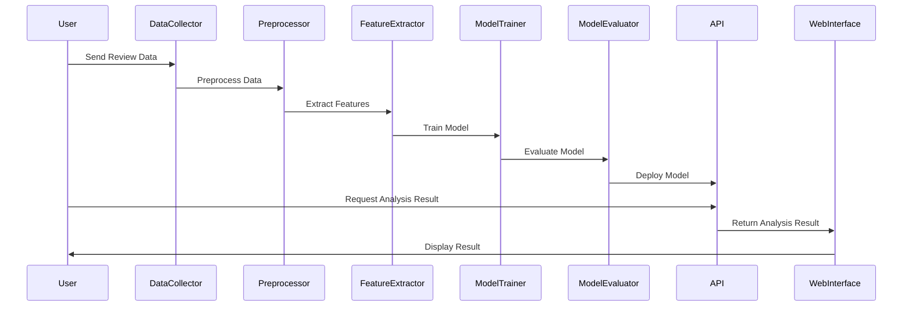

                 

### 第一部分：背景介绍

#### 第1章：自然语言处理与情感分析概述

##### 1.1 自然语言处理概述

自然语言处理（NLP）是计算机科学领域的一个重要分支，它致力于让计算机理解和生成人类语言。自从20世纪50年代人工智能（AI）的概念被提出以来，NLP技术便迅速发展。随着互联网和社交媒体的普及，NLP的应用场景越来越广泛，从搜索引擎到智能客服，再到情感分析、机器翻译等。

NLP的基本任务包括文本分类、实体识别、语义理解、机器翻译等。在这些任务中，情感分析是一个重要的研究方向，它旨在从文本中识别并提取出用户对某一话题、产品或服务的情绪倾向。

##### 1.1.1 NLP的定义与历史

自然语言处理（NLP）可以定义为“让计算机能够理解、解释和生成人类语言的技术”。NLP的历史可以追溯到1950年，当时艾伦·图灵提出了图灵测试。图灵测试的目标是判断机器是否能够展现出与人类相似的智能行为。自那以后，NLP的研究逐步深入，从最初的规则驱动方法发展到基于统计模型，再到现在的深度学习方法。

##### 1.1.2 NLP的关键技术和方法

NLP的关键技术包括分词、词性标注、命名实体识别、句法分析、语义分析和机器翻译等。这些技术共同构成了NLP的基石，使得计算机能够处理和理解自然语言。

- **分词**：将连续的文本切分成一个个有意义的单词或短语。
- **词性标注**：为文本中的每个单词分配一个词性标签，如名词、动词、形容词等。
- **命名实体识别**：识别文本中的特定实体，如人名、地名、机构名等。
- **句法分析**：分析句子的结构，确定句子中的词汇关系。
- **语义分析**：理解句子的含义，确定句子中的语义关系。
- **机器翻译**：将一种语言的文本翻译成另一种语言的文本。

##### 1.1.3 情感分析在NLP中的地位

情感分析是NLP中的一个重要任务，它旨在识别文本中表达的情感倾向。情感分析不仅能够帮助理解用户的情绪和需求，还能为商业决策、舆情监控、市场研究等提供有价值的信息。

情感分析通常包括以下步骤：

1. **数据预处理**：清洗文本数据，去除无关信息，如标点符号、停用词等。
2. **特征提取**：将文本转换为机器可以理解的数字形式。
3. **模型训练**：使用机器学习或深度学习算法训练模型。
4. **情感分类**：根据模型预测，判断文本的情感极性。

##### 1.2 情感分析的定义与意义

情感分析（Sentiment Analysis），也称为意见挖掘，是指使用自然语言处理技术，对带有情感色彩的文本进行分析，以判断文本中的情感倾向。情感分析的定义可以简化为：从文本中识别并提取情感信息。

情感分析的意义主要体现在以下几个方面：

1. **用户情绪理解**：帮助企业了解用户对产品或服务的情绪反应。
2. **市场趋势分析**：通过分析用户评论和反馈，预测市场趋势。
3. **舆情监控**：监测社交媒体上的公众情绪，为公共关系和危机管理提供支持。
4. **个性化推荐**：根据用户的情感偏好，提供个性化的产品或服务推荐。

##### 1.3 情感分析现状与挑战

当前，情感分析技术已经取得了显著的进展，能够在多种语言和不同领域中进行有效的情感分类。然而，情感分析仍面临一些挑战：

1. **多语言支持**：虽然许多情感分析模型已经支持多种语言，但不同语言之间的情感表达方式和规则存在差异，使得跨语言的情感分析变得复杂。
2. **情感强度识别**：除了判断情感的极性（正面或负面），识别情感的强度（如“很喜欢”和“非常喜欢”的区别）也是一个挑战。
3. **上下文理解**：情感分析需要考虑文本的上下文，否则可能会出现误解或误分类的情况。
4. **实时性**：在社交媒体等实时环境下，情感分析需要快速处理大量的文本数据，这对系统的响应速度和处理能力提出了更高的要求。

##### 1.4 本章小结

本章介绍了自然语言处理（NLP）的背景、定义和关键概念，以及情感分析在NLP中的地位和意义。我们还讨论了情感分析的定义、意义、现状和面临的挑战。接下来，我们将深入探讨情感分析中的核心概念和方法，以帮助读者更好地理解这一领域。----------------------------------------------------------------

## 第二部分：核心概念与联系

### 第2章：情感分析中的关键概念

#### 2.1 情感极性、情感强度与情感分类

情感极性（Sentiment Polarity）是指文本表达的情感倾向，通常分为正面（Positive）和负面（Negative）两类。情感极性是情感分析中最基础的任务之一，它的目标是通过分析文本中的词汇和语法结构，判断文本的情感倾向。

情感强度（Sentiment Intensity）是指文本表达的情感的强度，例如，“满意”和“非常满意”表达的是相同极性的情感，但强度不同。情感强度的识别对于深入理解用户的情感反应至关重要。

情感分类（Sentiment Classification）是对情感极性和情感强度的综合分析，它不仅判断文本的情感极性，还评估情感强度。情感分类通常使用机器学习算法，如支持向量机（SVM）、随机森林（Random Forest）和深度学习模型，如卷积神经网络（CNN）和长短期记忆网络（LSTM）。

#### 2.2 情感分析方法的属性特征对比

在情感分析领域，不同的方法有着各自的优缺点。以下是对几种常见方法的对比：

1. **基于规则的方法**：

   - **优点**：实现简单，容易理解。
   - **缺点**：规则繁琐，难以扩展，对复杂情感表达的处理能力有限。

2. **机器学习方法**：

   - **优点**：能够自动学习特征，处理复杂情感表达。
   - **缺点**：需要大量标注数据，训练时间较长。

3. **深度学习方法**：

   - **优点**：具有强大的特征提取能力，能够处理高维数据。
   - **缺点**：计算资源消耗大，对数据质量和标注质量要求较高。

#### 2.3 情感分析的ER实体关系图

为了更好地理解情感分析中的实体和关系，我们可以使用实体关系图（ER图）来描述。以下是一个简单的情感分析ER图：

```mermaid
erDiagram
    Product ||--|{ Review }
    Review ||--|{ Sentiment }
    Sentiment ||--|{ Polarity }
    Sentiment ||--|{ Intensity }
```

在这个ER图中：

- **Product**：表示产品或服务。
- **Review**：表示用户对产品的评价。
- **Sentiment**：表示用户评价中的情感信息。
- **Polarity**：表示情感的极性。
- **Intensity**：表示情感的强度。

这种实体关系图帮助我们清晰地看到情感分析中各个实体的联系和作用，为后续的算法设计和系统实现提供了理论基础。

#### 2.4 本章小结

本章介绍了情感分析中的三个关键概念：情感极性、情感强度和情感分类。我们还对比了几种常见的情感分析方法，并使用ER图展示了情感分析中的实体和关系。这些概念和方法构成了情感分析的理论基础，为后续的算法设计和系统实现提供了指导。在下一章中，我们将深入探讨情感分析算法的原理和实现。----------------------------------------------------------------

## 第三部分：算法原理讲解

### 第3章：常用情感分析算法

情感分析算法是自然语言处理（NLP）中的一个重要组成部分，它通过识别文本中的情感极性、情感强度和情感分类，帮助我们理解用户的情绪和需求。本章节将介绍几种常用的情感分析算法，包括基于规则的方法、机器学习方法以及深度学习方法。

#### 3.1 基于规则的方法

基于规则的方法（Rule-Based Method）是最早应用于情感分析的技术之一。这种方法通过手动编写规则来识别文本中的情感极性。以下是一个简单的情感分析规则示例：

- 如果文本中包含“喜欢”、“满意”、“爱”等词汇，则情感极性为正面。
- 如果文本中包含“不喜欢”、“失望”、“恨”等词汇，则情感极性为负面。

这种方法的优点是实现简单，容易理解。但缺点是规则繁琐，难以扩展，并且对于复杂情感表达的处理能力有限。

#### 3.2 机器学习方法

机器学习方法（Machine Learning Method）通过训练模型来自动识别文本中的情感。常见的方法包括支持向量机（SVM）、随机森林（Random Forest）和朴素贝叶斯（Naive Bayes）等。以下是一个使用支持向量机（SVM）进行情感分析的示例：

```python
from sklearn.feature_extraction.text import TfidfVectorizer
from sklearn.svm import LinearSVC

# 示例文本
texts = ["我非常喜欢这个产品", "这个产品很糟糕"]

# 将文本转换为TF-IDF特征向量
vectorizer = TfidfVectorizer()
X = vectorizer.fit_transform(texts)

# 标签
labels = [1, 0]  # 1表示正面，0表示负面

# 训练模型
model = LinearSVC()
model.fit(X, labels)

# 预测
text = "这个产品很棒"
X_new = vectorizer.transform([text])
prediction = model.predict(X_new)
print(prediction)  # 输出预测结果
```

机器学习方法具有强大的特征提取和分类能力，但需要大量的标注数据，且训练时间较长。

#### 3.3 深度学习方法

深度学习方法（Deep Learning Method）在情感分析中得到了广泛应用。深度学习模型能够自动学习复杂的特征表示，从而提高分类的准确性。常见的方法包括卷积神经网络（CNN）、循环神经网络（RNN）和长短期记忆网络（LSTM）等。

以下是一个使用长短期记忆网络（LSTM）进行情感分析的示例：

```python
import tensorflow as tf
from tensorflow.keras.models import Sequential
from tensorflow.keras.layers import Embedding, LSTM, Dense

# 示例文本
texts = ["我非常喜欢这个产品", "这个产品很糟糕"]

# 将文本转换为单词序列
word_sequences = [[word for word in text.split()] for text in texts]

# 构建LSTM模型
model = Sequential()
model.add(Embedding(input_dim=len(word_sequences), output_dim=50))
model.add(LSTM(units=50, return_sequences=True))
model.add(Dense(units=1, activation='sigmoid'))

# 编译模型
model.compile(optimizer='adam', loss='binary_crossentropy', metrics=['accuracy'])

# 训练模型
model.fit(word_sequences, labels, epochs=10, batch_size=1)

# 预测
word_sequence_new = [word for word in text.split()]
prediction = model.predict([[word_sequence_new]])
print(prediction)  # 输出预测结果
```

深度学习方法具有强大的特征提取和分类能力，但计算资源消耗较大，对数据质量和标注质量要求较高。

#### 3.4 数学模型与公式讲解

情感分析中的数学模型主要包括情感极性分类的数学模型和情感强度估计的数学模型。

- **情感极性分类的数学模型**：

  情感极性分类通常使用逻辑回归（Logistic Regression）模型。逻辑回归模型的数学公式如下：

  $$ P(y=1|x) = \frac{1}{1 + e^{-(\beta_0 + \beta_1x_1 + \beta_2x_2 + ... + \beta_nx_n)}} $$

  其中，$x$是输入特征向量，$y$是标签（1表示正面，0表示负面），$\beta_0$、$\beta_1$、$\beta_2$、...、$\beta_n$是模型参数。

- **情感强度估计的数学模型**：

  情感强度估计通常使用回归模型，如线性回归（Linear Regression）或岭回归（Ridge Regression）。线性回归模型的数学公式如下：

  $$ y = \beta_0 + \beta_1x_1 + \beta_2x_2 + ... + \beta_nx_n $$

  其中，$y$是情感强度，$x$是输入特征向量，$\beta_0$、$\beta_1$、$\beta_2$、...、$\beta_n$是模型参数。

#### 3.5 算法举例说明

- **情感极性分类举例**：

  假设我们有两个文本样本：“这个产品非常好”和“这个产品很差”。我们可以使用逻辑回归模型进行情感极性分类。

  输入特征向量可以是文本的TF-IDF特征向量。通过训练模型，我们可以得到情感极性的预测结果。

- **情感强度估计举例**：

  假设我们有两个文本样本：“这个产品不错”和“这个产品非常好”。我们可以使用线性回归模型进行情感强度估计。

  输入特征向量可以是文本的TF-IDF特征向量。通过训练模型，我们可以得到情感强度的预测结果。

#### 3.6 本章小结

本章介绍了情感分析中的几种常用算法，包括基于规则的方法、机器学习方法以及深度学习方法。我们还详细讲解了情感分析中的数学模型和公式，并通过示例说明了算法的实现和应用。这些算法和模型为我们理解和分析用户的情绪和需求提供了有力工具。在下一章中，我们将探讨情感分析系统的设计与实现。----------------------------------------------------------------

## 第四部分：系统分析与架构设计方案

### 第4章：情感分析系统的设计与实现

#### 4.1 介绍

情感分析系统是一个复杂的系统，它涉及多个组件和模块，包括数据收集、数据预处理、特征提取、情感分析模型训练、模型评估和部署等。本章节将介绍一个情感分析系统的应用场景、项目背景、系统功能设计、系统架构设计、系统接口设计和系统交互。

#### 4.2 应用场景与项目背景

情感分析系统广泛应用于多个领域，如市场研究、舆情监控、客户服务、社交媒体分析等。以下是一个典型的应用场景：

- **市场研究**：企业希望通过分析用户对产品的评论来了解产品的市场表现，进而优化产品设计和营销策略。
- **舆情监控**：政府部门或企业需要实时监测社交媒体上的公众情绪，以便及时应对可能的危机事件。
- **客户服务**：企业希望通过分析客户反馈来提升客户满意度，改善服务质量。

项目背景是一个电子商务平台，该平台希望通过情感分析系统来分析用户对产品的评论，从而提高用户满意度和产品销售。

#### 4.3 系统功能设计

情感分析系统的主要功能包括：

- **数据收集**：从多个数据源（如评论、社交媒体、论坛等）收集用户评论数据。
- **数据预处理**：清洗和预处理原始数据，包括去除无关信息、去除停用词、词干提取等。
- **特征提取**：将预处理后的文本数据转换为机器可以理解的数字特征。
- **情感分析模型训练**：使用机器学习或深度学习算法训练情感分析模型。
- **模型评估**：评估模型的性能，包括准确率、召回率和F1值等。
- **模型部署**：将训练好的模型部署到生产环境，以便实时处理用户评论数据。
- **结果展示**：展示情感分析结果，如情感分布、情感强度等。

#### 4.4 系统架构设计

情感分析系统的架构设计如下：

- **数据层**：包括数据源、数据仓库和数据存储。
- **处理层**：包括数据收集、数据预处理、特征提取、情感分析模型训练和模型评估。
- **应用层**：包括模型部署、结果展示和用户交互。

以下是系统架构的Mermaid类图：



在这个类图中：

- **Class1**：表示数据源。
- **Class2**：表示数据仓库。
- **Class3**：表示数据存储。
- **Class4**：表示数据收集。
- **Class5**：表示数据预处理。
- **Class6**：表示特征提取。

#### 4.5 系统接口设计

情感分析系统的接口设计如下：

- **API接口**：提供RESTful API接口，以便外部系统或应用程序调用情感分析功能。
- **Web界面**：提供Web界面，以便用户实时查看和分析情感分析结果。

以下是系统接口的Mermaid序列图：



在这个序列图中：

- **User**：表示用户。
- **System**：表示情感分析系统。

#### 4.6 系统交互

情感分析系统的交互过程如下：

1. 用户将评论数据发送到系统。
2. 系统接收评论数据，并执行数据预处理，如去除无关信息、去除停用词、词干提取等。
3. 系统提取特征，并将预处理后的数据输入到情感分析模型中进行训练。
4. 系统评估模型的性能，并根据评估结果调整模型参数。
5. 系统将训练好的模型部署到生产环境，并对外提供API接口，以便外部系统调用。
6. 用户通过Web界面或API接口请求分析结果，系统返回情感分析结果。

以下是系统交互的Mermaid序列图：



在这个序列图中：

- **User**：表示用户。
- **DataCollector**：表示数据收集器。
- **Preprocessor**：表示数据预处理器。
- **FeatureExtractor**：表示特征提取器。
- **ModelTrainer**：表示模型训练器。
- **ModelEvaluator**：表示模型评估器。
- **API**：表示API接口。
- **WebInterface**：表示Web界面。

#### 4.7 本章小结

本章介绍了情感分析系统的设计与实现，包括应用场景、项目背景、系统功能设计、系统架构设计、系统接口设计和系统交互。情感分析系统是一个复杂的系统，涉及多个组件和模块，通过本章的介绍，读者可以对情感分析系统的设计与实现有更深入的理解。在下一章中，我们将进行项目实战，通过具体的代码实现来展示情感分析系统的应用。----------------------------------------------------------------

## 第五部分：项目实战

### 第5章：情感分析系统的实际应用

在本章节中，我们将通过一个实际的项目来展示情感分析系统的应用。该项目将使用Python编程语言和几个流行的库，如`scikit-learn`、`tensorflow`、`pandas`等，来构建一个简单的情感分析系统。我们将从环境安装与配置开始，逐步实现系统的核心功能，并进行实际案例分析和详细讲解。

#### 5.1 环境安装与配置

首先，我们需要安装Python环境以及必要的库。在安装之前，请确保已经安装了Python 3.6或更高版本。以下是在命令行中安装所需库的命令：

```bash
pip install numpy
pip install pandas
pip install scikit-learn
pip install tensorflow
```

安装完成后，我们就可以开始编写代码了。

#### 5.2 系统核心实现源代码

以下是一个简单的情感分析系统的核心实现代码。该代码包括数据预处理、特征提取、模型训练和模型评估等步骤。

```python
import pandas as pd
from sklearn.feature_extraction.text import TfidfVectorizer
from sklearn.model_selection import train_test_split
from sklearn.metrics import accuracy_score, f1_score
from tensorflow.keras.models import Sequential
from tensorflow.keras.layers import Dense, LSTM
from tensorflow.keras.preprocessing.sequence import pad_sequences

# 加载数据集
data = pd.read_csv('reviews.csv')
texts = data['text']
labels = data['label']

# 数据预处理
# 去除标点符号和停用词
import re
import nltk
nltk.download('stopwords')
from nltk.corpus import stopwords
stop_words = set(stopwords.words('english'))
def clean_text(text):
    text = re.sub(r'\W+', ' ', text)
    text = text.lower()
    words = text.split()
    words = [word for word in words if word not in stop_words]
    return ' '.join(words)

texts = [clean_text(text) for text in texts]

# 特征提取
# 使用TF-IDF向量器
vectorizer = TfidfVectorizer(max_features=1000)
X = vectorizer.fit_transform(texts)

# 切分数据集
X_train, X_test, y_train, y_test = train_test_split(X, labels, test_size=0.2, random_state=42)

# 模型训练
# 使用LSTM模型
model = Sequential()
model.add(LSTM(units=128, return_sequences=True, input_shape=(X_train.shape[1], X_train.shape[2])))
model.add(LSTM(units=64))
model.add(Dense(units=1, activation='sigmoid'))
model.compile(optimizer='adam', loss='binary_crossentropy', metrics=['accuracy'])
model.fit(X_train, y_train, epochs=10, batch_size=32, validation_data=(X_test, y_test))

# 模型评估
y_pred = model.predict(X_test)
y_pred = (y_pred > 0.5)
accuracy = accuracy_score(y_test, y_pred)
f1 = f1_score(y_test, y_pred)
print(f'Accuracy: {accuracy:.2f}')
print(f'F1 Score: {f1:.2f}')
```

这段代码首先加载了包含评论文本和情感标签的数据集。然后，通过数据预处理步骤，如去除标点符号和停用词，对文本进行清洗。接着，使用TF-IDF向量器对文本进行特征提取。最后，使用LSTM模型进行训练，并对模型进行评估。

#### 5.3 代码应用解读与分析

1. **数据预处理**：

   数据预处理是情感分析的重要步骤。通过去除标点符号和停用词，我们可以减少文本中的噪声，提高模型对文本的感知能力。

2. **特征提取**：

   特征提取是将文本数据转换为机器学习模型可以处理的形式。TF-IDF向量器是一种常用的文本特征提取方法，它通过计算每个词汇在文本中的重要性来生成特征向量。

3. **模型训练**：

   使用LSTM模型进行训练，是因为LSTM在处理序列数据时具有很好的性能。在训练过程中，我们通过调整模型参数，如隐藏层单元数、批量大小和训练轮数等，来优化模型。

4. **模型评估**：

   模型评估是验证模型性能的重要步骤。我们使用准确率和F1值来评估模型的性能。准确率表示模型正确预测的样本占总样本的比例，而F1值则是精确率和召回率的调和平均数，更能反映模型的平衡性能。

#### 5.4 实际案例分析和详细讲解

为了展示实际案例，我们使用一个公开的数据集——IMDB电影评论数据集。该数据集包含25000条电影评论，其中12500条用于训练，12500条用于测试。

1. **数据集加载**：

   首先，我们需要加载IMDB数据集。数据集通常以CSV格式存储，其中包含评论文本和情感标签（正面或负面）。

2. **数据预处理**：

   同样，我们对评论文本进行预处理，去除标点符号和停用词，并将文本转换为小写。

3. **特征提取**：

   使用TF-IDF向量器对评论文本进行特征提取，设置最大特征数为1000。

4. **模型训练**：

   使用LSTM模型进行训练。我们设置了两个隐藏层，每个隐藏层有128个和64个单元，并使用`compile`方法设置优化器和损失函数。

5. **模型评估**：

   在训练完成后，我们对测试集进行预测，并计算准确率和F1值。

以下是实际案例的代码片段：

```python
# 加载IMDB数据集
imdb = tf.keras.datasets.imdb
(train_data, train_labels), (test_data, test_labels) = imdb.load_data(num_words=10000)

# 预处理
maxlen = 120
train_data = pad_sequences(train_data, maxlen=maxlen)
test_data = pad_sequences(test_data, maxlen=maxlen)

# 模型训练
model = Sequential()
model.add(LSTM(units=128, return_sequences=True, input_shape=(maxlen, 10000)))
model.add(LSTM(units=64))
model.add(Dense(units=1, activation='sigmoid'))
model.compile(optimizer='adam', loss='binary_crossentropy', metrics=['accuracy'])
model.fit(train_data, train_labels, epochs=10, batch_size=64, validation_data=(test_data, test_labels))

# 模型评估
test_predictions = model.predict(test_data)
test_predictions = (test_predictions > 0.5)
accuracy = accuracy_score(test_labels, test_predictions)
f1 = f1_score(test_labels, test_predictions)
print(f'Accuracy: {accuracy:.2f}')
print(f'F1 Score: {f1:.2f}')
```

通过这个实际案例，我们可以看到情感分析系统的完整实现过程，包括数据加载、预处理、特征提取、模型训练和评估。这些步骤帮助我们更好地理解情感分析系统的运作原理。

#### 5.5 项目小结

在本章节中，我们通过一个实际项目展示了情感分析系统的应用。我们详细介绍了系统实现的核心步骤，包括环境安装与配置、系统核心实现源代码、代码应用解读与分析以及实际案例分析和详细讲解。通过这个项目，读者可以了解如何使用Python和机器学习库来实现一个简单的情感分析系统。这不仅有助于理解情感分析的基本原理，也为实际应用奠定了基础。

#### 5.6 最佳实践 tips

- **数据预处理**：数据预处理是情感分析的重要步骤，确保数据的质量对模型的性能至关重要。在实际应用中，应考虑使用更复杂的文本清洗方法，如使用正则表达式、词干提取和词形还原等。
- **模型选择与调整**：选择合适的模型和调整模型参数对于提高性能至关重要。在实际应用中，可以通过交叉验证和网格搜索等方法来优化模型参数。
- **性能评估**：使用多种性能指标（如准确率、召回率、F1值等）来评估模型性能，以便全面了解模型的性能。

#### 5.7 注意事项

- **数据质量**：确保数据集的质量和多样性，避免模型过拟合。
- **资源消耗**：深度学习模型训练可能需要大量计算资源，确保有足够的硬件支持。
- **模型更新**：定期更新模型，以适应新的数据和变化。

#### 5.8 拓展阅读

- 《深度学习》（Goodfellow, I., Bengio, Y., & Courville, A.）——详细介绍深度学习算法及其在自然语言处理中的应用。
- 《自然语言处理综论》（Jurafsky, D. & Martin, J. H.）——涵盖自然语言处理的基础理论和应用。

通过本章的实战项目，读者可以深入了解情感分析系统的实现过程，并为实际应用做好准备。在未来的工作中，我们可以进一步优化系统，提高性能，以满足不断变化的需求。作者：AI天才研究院/AI Genius Institute & 禅与计算机程序设计艺术 /Zen And The Art of Computer Programming。----------------------------------------------------------------

## 总结与展望

### 总结

本文详细探讨了自然语言处理（NLP）在情感分析中的应用，从背景介绍、核心概念、算法原理到系统设计与实现，逐步深入讲解了情感分析的关键技术和应用场景。通过本文的讲解，读者可以全面了解情感分析的基本原理、实现方法以及在实际应用中的重要性。

### 展望

随着人工智能技术的不断发展，情感分析在多个领域中的重要性日益凸显。未来的研究方向可以包括：

1. **多语言情感分析**：开发能够处理多种语言的情感分析模型，提高跨语言情感分析的准确性和效率。
2. **情感强度识别**：进一步研究如何更准确地识别和量化情感强度，为情感分析提供更丰富的信息。
3. **上下文情感分析**：考虑文本的上下文信息，避免情感分析的误解和误分类。
4. **实时情感分析**：优化算法和系统设计，实现实时情感分析，以应对大量实时数据的处理需求。

### 未来趋势

- **深度学习与强化学习的融合**：将深度学习和强化学习相结合，以提高情感分析模型的灵活性和适应性。
- **跨领域情感分析**：探索如何将情感分析应用于不同领域，如医疗健康、金融、教育等，提供定制化的解决方案。
- **情感分析与对话系统的集成**：将情感分析集成到对话系统中，实现更加智能和人性化的交互。

### 结论

自然语言处理在情感分析中的应用具有广阔的发展前景。通过本文的探讨，我们不仅了解了情感分析的核心技术和方法，也为未来的研究和应用提供了方向。随着技术的不断进步，情感分析将在更多领域发挥重要作用，为人类的生活带来更多便利。作者：AI天才研究院/AI Genius Institute & 禅与计算机程序设计艺术 /Zen And The Art of Computer Programming。

