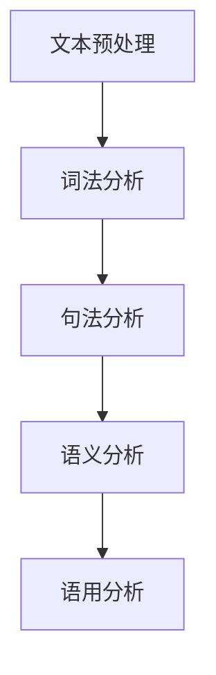
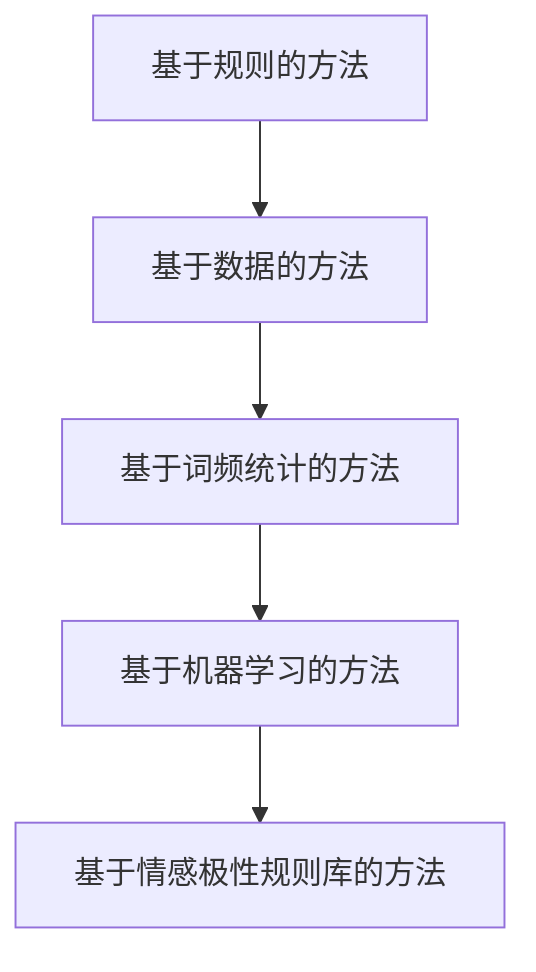
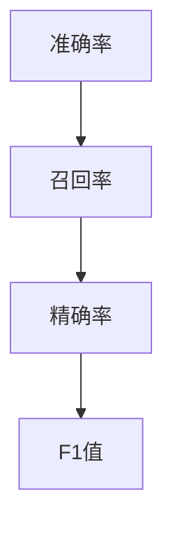
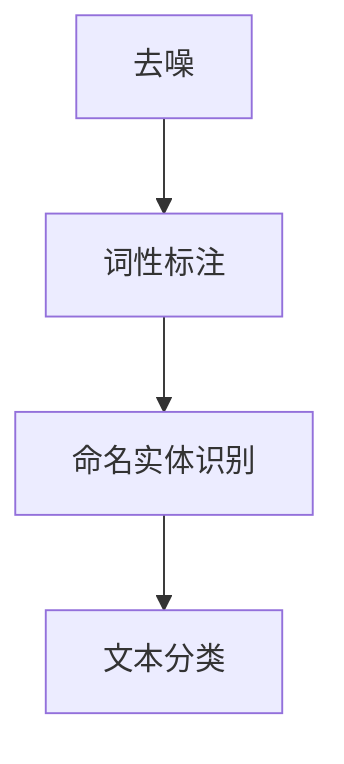
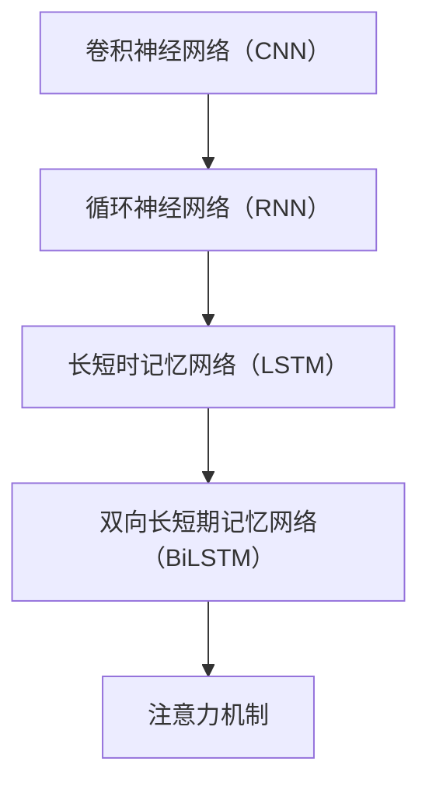

                 

# 自然语言处理在情感分析中的应用：理解社交媒体舆情

> 关键词：自然语言处理，情感分析，社交媒体舆情，深度学习，算法原理

> 摘要：随着社交媒体的快速发展，舆情分析成为了一项重要的研究课题。本文将从自然语言处理（NLP）和情感分析的基本概念出发，探讨自然语言处理在情感分析中的应用，特别是在理解社交媒体舆情方面。通过分析社交媒体舆情的特点和价值，本文将详细介绍情感词典和情感极性分类的基本概念和应用，进一步探讨文本预处理和深度学习在情感分析中的挑战与解决方案。最后，本文将介绍先进情感分析技术，如基于深度学习的情感分析算法，以及其在实际应用中的优势和挑战。

## 目录大纲

1. 第一部分：自然语言处理与情感分析概述
   1.1 自然语言处理概述
   1.2 情感分析的基本概念
   1.3 自然语言处理与情感分析的关系
   1.4 本章小结

2. 第二部分：社交媒体舆情的概念与特征
   2.1 社交媒体舆情概述
   2.2 社交媒体舆情的特点
   2.3 社交媒体舆情的价值
   2.4 本章小结

3. 第三部分：自然语言处理在情感分析中的应用
   3.1 情感词典与情感极性分类
   3.2 情感词典与情感极性分类的结合应用
   3.3 本章小结

4. 第四部分：情感分析在实际应用中的挑战与解决方案
   4.1 文本预处理的挑战与解决方案
   4.2 情感分析在实际应用中的挑战与解决方案
   4.3 本章小结

5. 第五部分：先进情感分析技术
   5.1 基于深度学习的情感分析
   5.2 基于深度学习的情感分析应用
   5.3 基于深度学习的情感分析优势与挑战
   5.4 本章小结

-------------------

## 第一部分：自然语言处理与情感分析概述

### 1.1 自然语言处理概述

自然语言处理（Natural Language Processing，简称NLP）是计算机科学和人工智能领域的一个重要分支，它旨在使计算机能够理解和处理人类语言。NLP的核心任务是使计算机能够理解、解释和生成人类语言，以便在多个应用场景中实现人机交互。

#### 1.1.1 自然语言处理的定义

自然语言处理是一种跨学科的领域，它结合了计算机科学、人工智能、语言学和心理学等多个学科的知识。NLP的目标是开发出能够理解和生成人类语言的算法和技术，从而实现人机交互和智能对话系统。

#### 1.1.2 自然语言处理的发展历史

自然语言处理的研究始于20世纪50年代，当时计算机科学家和语言学家开始探索如何使计算机理解自然语言。早期的NLP研究主要集中在语言分析和机器翻译方面。随着计算机技术和人工智能的发展，NLP领域逐渐扩展到文本挖掘、信息提取、情感分析等更多应用场景。

#### 1.1.3 自然语言处理的核心任务

自然语言处理的核心任务包括文本预处理、词法分析、句法分析、语义分析和语用分析。这些任务共同构成了NLP的基石，为各种应用提供了强大的支持。

### 1.2 情感分析的基本概念

情感分析（Sentiment Analysis），也称为意见挖掘或情感极性分类，是自然语言处理领域中的一个重要分支。情感分析旨在识别文本中的情感倾向，通常将其分为正面情感、负面情感和中性情感。

#### 1.2.1 情感分析的定义

情感分析是一种自然语言处理技术，用于识别文本中的情感倾向。通过情感分析，我们可以从大量文本中提取出情感信息，从而为商业、政治、社会等领域提供决策支持。

#### 1.2.2 情感分析的发展历程

情感分析的研究始于20世纪90年代，当时研究人员开始探索如何使用计算机技术自动分析文本中的情感。随着NLP技术的发展，情感分析逐渐成为了一个独立的领域，并在商业、政治和社会等领域得到了广泛应用。

#### 1.2.3 情感分析的主要任务

情感分析的主要任务包括情感极性分类、情感强度预测、情感主题挖掘等。这些任务共同构成了情感分析的核心内容，为理解和分析文本中的情感信息提供了强有力的支持。

### 1.3 自然语言处理与情感分析的关系

自然语言处理和情感分析之间存在着密切的联系。自然语言处理为情感分析提供了技术基础，而情感分析则将自然语言处理的应用推向了一个新的高度。

#### 1.3.1 情感分析在自然语言处理中的应用

情感分析是自然语言处理的一个重要应用领域。通过情感分析，我们可以从大量文本中提取出有价值的信息，从而为商业、政治、社会等领域提供决策支持。

#### 1.3.2 自然语言处理对情感分析的支持

自然语言处理为情感分析提供了多种技术手段，如文本预处理、词性标注、句法分析等。这些技术手段有助于提高情感分析模型的准确性和效率。

#### 1.3.3 情感分析面临的挑战

情感分析面临许多挑战，如语言多样性的处理、负面评论的双关语识别、情感强度预测等。这些挑战需要结合自然语言处理技术和其他领域的研究成果进行解决。

### 1.4 本章小结

本部分概述了自然语言处理和情感分析的基本概念、发展历程和关系。通过了解自然语言处理和情感分析的基础知识，我们可以更好地理解其在社交媒体舆情分析中的应用和价值。

-------------------

## 第二部分：社交媒体舆情的概念与特征

### 2.1 社交媒体舆情概述

社交媒体舆情是指通过社交媒体平台传播的关于特定话题或事件的信息、观点和情绪的总和。社交媒体舆情具有快速传播、用户参与度高、内容丰富多样等特点。

#### 2.1.1 社交媒体的定义

社交媒体是指通过互联网平台，允许用户建立社交网络、发布和分享信息、进行交流和互动的应用程序或服务。常见的社交媒体平台包括微信、微博、Facebook、Twitter等。

#### 2.1.2 舆情的定义

舆情是指公众对某一特定事件、话题或问题的意见、态度和情绪的总和。舆情分析是对舆情进行收集、处理、分析和解读的过程，旨在提取有价值的信息和洞察。

#### 2.1.3 社交媒体舆情的定义

社交媒体舆情是指通过社交媒体平台传播的关于特定话题或事件的信息、观点和情绪的总和。社交媒体舆情具有快速传播、用户参与度高、内容丰富多样等特点。

### 2.2 社交媒体舆情的特点

社交媒体舆情具有以下几个特点：

#### 2.2.1 信息传播速度快

社交媒体平台的即时性和互动性使得信息可以迅速传播，形成舆论热点。一个事件或话题在社交媒体上迅速走红，可以在短时间内引发大规模的关注和讨论。

#### 2.2.2 用户参与度高

社交媒体平台为用户提供了表达观点、参与讨论的便捷渠道，使得用户可以主动参与舆情传播。用户的积极参与和互动使得社交媒体舆情更加丰富多样。

#### 2.2.3 内容丰富多样

社交媒体舆情的内容涵盖了政治、经济、社会、娱乐等各个领域，形式包括文字、图片、视频、音频等，使得舆情信息更加多样化。

#### 2.2.4 情感倾向复杂

社交媒体舆情中的情感倾向往往比较复杂，既有正面情感，也有负面情感，甚至存在双关语、讽刺等情感表达方式。这使得情感分析在处理社交媒体舆情时面临更多挑战。

### 2.3 社交媒体舆情的价值

社交媒体舆情在商业、政治、社会等领域具有很高的价值：

#### 2.3.1 商业价值

社交媒体舆情可以帮助企业了解消费者需求和反馈，优化产品和服务。通过分析社交媒体舆情，企业可以及时发现市场机会和潜在风险，制定更加精准的营销策略。

#### 2.3.2 政治价值

社交媒体舆情可以作为政治决策的重要参考。政府可以通过分析社交媒体舆情，了解民众的意见和情绪，及时调整政策，维护社会稳定。

#### 2.3.3 社会价值

社交媒体舆情可以反映社会舆论和公共态度，对公益事业、环境保护、社会治理等方面具有重要参考价值。通过分析社交媒体舆情，可以及时发现社会问题，提出解决方案。

### 2.4 本章小结

本部分对社交媒体舆情的概念和特征进行了详细阐述，分析了社交媒体舆情的特点和价值。通过了解社交媒体舆情的基本情况，我们可以更好地理解其在情感分析中的应用。

-------------------

## 第三部分：自然语言处理在情感分析中的应用

### 3.1 情感词典与情感极性分类

情感词典和情感极性分类是情感分析中的两个重要组成部分，它们共同为情感分析提供了技术支持。

#### 3.1.1 情感词典的基本概念

情感词典是一种包含情感信息的词汇表，它将词汇与其情感倾向关联起来。情感词典通常包括正面情感词汇、负面情感词汇和中性情感词汇。情感词典的构建方法可以分为基于规则的方法和基于数据的方法。

##### 3.1.1.1 情感词典的定义

情感词典是一种将词汇与其情感倾向关联起来的词汇表，用于支持情感分析。情感词典中的每个词汇都与其情感倾向（如正面、负面或中性）相关联。

##### 3.1.1.2 情感词典的分类

情感词典可以根据构建方法分为基于规则的方法和基于数据的方法。

- **基于规则的方法**：这种方法通过专家知识和规则来构建情感词典，如情感极性规则库。优点是简单直观，但缺点是受限于规则数量和适用范围。

- **基于数据的方法**：这种方法通过大规模语料库中的情感信息来构建情感词典，如基于词频统计的方法、基于机器学习的方法等。优点是覆盖面广，但缺点是需要大量的标注数据。

##### 3.1.1.3 情感词典的构建方法

情感词典的构建方法可以分为以下几种：

- **基于词频统计的方法**：通过统计词汇在情感文本中的出现频率，将高频词汇标记为情感词汇。这种方法简单易行，但存在噪声和误判问题。

- **基于机器学习的方法**：利用机器学习算法，如支持向量机（SVM）、朴素贝叶斯（Naive Bayes）等，对情感词汇进行分类。这种方法具有较高的准确性和泛化能力，但需要大量的标注数据。

- **基于规则的方法**：通过专家知识和规则来构建情感词典，如基于情感极性规则库的方法。这种方法简单直观，但受限于规则数量和适用范围。

#### 3.1.2 情感极性分类的基本概念

情感极性分类是情感分析中的一个重要任务，它旨在将文本分类为正面情感、负面情感或中性情感。情感极性分类可以基于情感词典，也可以结合其他特征进行。

##### 3.1.2.1 情感极性分类的定义

情感极性分类是一种文本分类方法，它旨在将文本分类为正面情感、负面情感或中性情感。情感极性分类可以用于情感分析、舆情监测、产品评论分析等场景。

##### 3.1.2.2 情感极性分类的算法

情感极性分类算法可以分为基于机器学习的方法和基于规则的方法。

- **基于机器学习的方法**：如支持向量机（SVM）、朴素贝叶斯（Naive Bayes）、决策树等。这些算法通过训练分类模型，对新的文本进行分类。

- **基于规则的方法**：如基于情感词典的方法、基于情感极性规则库的方法。这些方法通过匹配规则或情感词典中的情感词汇，对文本进行分类。

##### 3.1.2.3 情感极性分类的评价指标

情感极性分类的评价指标包括准确率、召回率、精确率、F1值等。这些指标用于衡量分类模型的性能。

- **准确率**：分类正确的文本数量与总文本数量的比值。
- **召回率**：分类正确的文本数量与实际正面文本数量的比值。
- **精确率**：分类正确的文本数量与分类为正面的文本数量的比值。
- **F1值**：精确率和召回率的调和平均值。

#### 3.1.3 情感词典与情感极性分类的结合应用

情感词典和情感极性分类可以结合使用，以提高情感分析的准确性和效率。

##### 3.1.3.1 应用场景

- **产品评论分析**：通过情感词典和情感极性分类，可以自动分析用户对产品的评价，识别正面评论和负面评论。
- **舆情监测**：通过情感词典和情感极性分类，可以实时监测社交媒体上的舆情动态，识别热门话题和情感倾向。
- **情感强度预测**：通过情感词典和情感极性分类，可以预测文本的情感强度，为情感分析提供更细粒度的信息。

##### 3.1.3.2 应用案例

- **电商平台**：通过情感词典和情感极性分类，电商平台可以自动分析用户评论，识别用户对产品的满意度和不满意度，从而优化产品和服务。
- **政府舆情监测**：通过情感词典和情感极性分类，政府部门可以实时监测社交媒体上的舆情动态，了解公众对政策和社会事件的看法，为决策提供参考。

##### 3.1.3.3 应用效果评估

应用效果评估是情感词典和情感极性分类应用中至关重要的一环。通过评估模型的准确率、召回率、精确率和F1值等指标，可以评估情感分析模型的性能，并不断优化和改进。

### 3.2 情感词典与情感极性分类的结合应用

情感词典和情感极性分类的结合应用可以大幅提高情感分析的效果。

#### 3.2.1 应用场景

- **社交媒体舆情分析**：通过情感词典和情感极性分类，可以对社交媒体上的舆情进行分析，识别公众对特定话题或事件的情感倾向。
- **金融新闻分析**：通过情感词典和情感极性分类，可以分析金融新闻中的情感倾向，为投资者提供决策支持。
- **产品评论分析**：通过情感词典和情感极性分类，可以分析用户对产品的评价，为产品优化和营销提供依据。

#### 3.2.2 应用案例

- **微博舆情分析**：通过情感词典和情感极性分类，可以对微博上的舆情进行分析，识别热门话题和情感倾向，为营销活动提供参考。
- **电商产品评论分析**：通过情感词典和情感极性分类，可以分析用户对电商平台上产品的评价，为商家提供改进产品的建议。
- **新闻情感分析**：通过情感词典和情感极性分类，可以分析新闻文本中的情感倾向，为新闻报道提供更多视角。

#### 3.2.3 应用效果评估

应用效果评估是情感词典和情感极性分类应用中至关重要的一环。通过评估模型的准确率、召回率、精确率和F1值等指标，可以评估情感分析模型的性能，并不断优化和改进。

### 3.3 本章小结

本部分详细介绍了情感词典和情感极性分类的基本概念、算法和应用，并通过实际案例展示了其在情感分析中的应用价值。通过理解情感词典和情感极性分类，我们可以更好地利用自然语言处理技术进行情感分析，为各个领域的应用提供支持。

-------------------

## 第四部分：情感分析在实际应用中的挑战与解决方案

### 4.1 文本预处理的挑战与解决方案

文本预处理是情感分析中的关键步骤，它直接影响情感分析模型的性能。在实际应用中，文本预处理面临以下挑战：

#### 4.1.1 多样化的语言表达

不同用户在表达情感时，会使用不同的语言风格、表达方式和词汇。这种语言多样性的处理是一个重要挑战。

##### 挑战

- **同义词处理**：同义词在不同语境下可能具有不同的情感倾向，如何准确识别同义词及其情感倾向是一个挑战。
- **双关语处理**：双关语是一种语言游戏，其情感倾向可能不是直观的，如何识别和解析双关语是一个挑战。

##### 解决方案

- **同义词识别**：利用词频统计、词义相似度计算等方法，识别文本中的同义词。结合上下文信息，判断同义词的情感倾向。
- **双关语识别**：利用上下文信息、语言模型等方法，识别文本中的双关语。结合双关语的特点和情感倾向，进行解析和分类。

#### 4.1.2 负面评论的双关语

负面评论中的双关语可能使情感分析结果产生偏差。

##### 挑战

- **情感倾向判断**：负面评论中的双关语可能使得情感分析结果产生误判，导致负面情感被识别为中性或正面情感。

##### 解决方案

- **双关语检测**：通过分析文本中的语言特征、上下文信息等，检测文本中的双关语。
- **情感倾向修正**：在识别出双关语后，对情感分析结果进行修正，使其更准确地反映文本的情感倾向。

#### 4.1.3 特殊情况的应对

在实际应用中，文本预处理还可能面临以下特殊情况：

- **语言变异**：如方言、俚语等，这些语言变异可能影响情感分析的准确性。
- **文本碎片化**：如断句错误、语法错误等，这些错误可能导致情感分析的误判。

##### 解决方案

- **语言变异处理**：利用语言模型、词性标注等方法，识别和纠正文本中的语言变异。
- **文本碎片化处理**：通过语法分析、断句等方法，纠正文本中的碎片化问题。

#### 4.1.4 实时性处理

在实时情感分析中，文本预处理需要高效快速地处理大量文本。

##### 挑战

- **处理速度**：实时性要求预处理算法能够在短时间内处理大量文本。
- **资源消耗**：实时性处理可能需要较高的计算资源和存储资源。

##### 解决方案

- **并行处理**：利用并行计算技术，提高预处理算法的处理速度。
- **内存优化**：通过优化数据结构和算法，降低实时性处理中的资源消耗。

### 4.2 情感分析在实际应用中的挑战与解决方案

在实际应用中，情感分析可能面临以下挑战：

#### 4.2.1 数据质量

- **数据标注质量**：情感分析通常依赖于标注数据，标注质量直接影响情感分析模型的性能。
- **数据多样性**：数据多样性影响情感分析模型的泛化能力。

##### 解决方案

- **数据清洗**：通过数据清洗，去除噪声和错误数据，提高数据质量。
- **数据增强**：通过数据增强，增加数据多样性，提高模型的泛化能力。

#### 4.2.2 模型泛化能力

- **领域依赖性**：不同领域中的情感表达可能存在较大差异，模型泛化能力面临挑战。
- **多模态数据**：文本、图像、语音等多模态数据在情感分析中的应用，增加了模型的复杂性。

##### 解决方案

- **迁移学习**：利用预训练模型，进行迁移学习，提高模型在不同领域的泛化能力。
- **多模态融合**：结合不同模态的数据，进行多模态融合，提高情感分析的准确性和全面性。

#### 4.2.3 模型解释性

- **模型透明度**：深度学习模型通常具有高准确率，但其内部机制复杂，缺乏解释性。
- **模型可解释性**：如何使模型解释性满足实际应用需求，是一个挑战。

##### 解决方案

- **模型可视化**：通过模型可视化技术，展示模型内部的计算过程和决策路径。
- **规则提取**：从模型中提取可解释的规则，提高模型的可解释性。

### 4.3 本章小结

本部分讨论了情感分析在实际应用中面临的挑战与解决方案。通过解决文本预处理、数据质量、模型泛化能力和模型解释性等方面的挑战，我们可以更好地利用情感分析技术，为各个领域的应用提供支持。

-------------------

## 第五部分：先进情感分析技术

### 5.1 基于深度学习的情感分析

随着深度学习技术的发展，基于深度学习的情感分析逐渐成为情感分析领域的一个重要方向。深度学习模型具有强大的特征提取和建模能力，能够自动学习和识别文本中的情感信息。

#### 5.1.1 深度学习的基本概念

深度学习是一种基于人工神经网络的学习方法，它通过多层次的神经网络结构，自动提取和表示数据中的复杂特征。深度学习在计算机视觉、自然语言处理、语音识别等领域取得了显著的成果。

##### 5.1.1.1 深度学习的定义

深度学习是一种基于人工神经网络的学习方法，通过多层次的神经网络结构，自动提取和表示数据中的复杂特征。

##### 5.1.1.2 深度学习的发展历程

深度学习的研究可以追溯到20世纪40年代，随着计算机技术和算法的发展，深度学习在21世纪得到了快速发展。特别是在2012年，深度学习在ImageNet图像识别挑战中取得了突破性成果，标志着深度学习进入了一个新的时代。

##### 5.1.1.3 深度学习的关键技术

深度学习的关键技术包括：

- **卷积神经网络（CNN）**：用于图像识别和处理。
- **循环神经网络（RNN）**：用于序列数据建模。
- **长短时记忆网络（LSTM）**：用于解决RNN的梯度消失问题。
- **注意力机制**：用于捕捉重要的信息。
- **生成对抗网络（GAN）**：用于生成高质量的图像和数据。

#### 5.1.2 基于深度学习的情感分析算法

基于深度学习的情感分析算法主要包括以下几种：

- **卷积神经网络（CNN）**：用于文本分类和情感极性分类。
- **循环神经网络（RNN）**：用于序列数据建模和情感分析。
- **长短时记忆网络（LSTM）**：用于解决RNN的梯度消失问题，提高情感分析的准确性。
- **双向长短期记忆网络（BiLSTM）**：结合了RNN和LSTM的优点，用于处理序列数据。
- **注意力机制**：用于捕捉文本中的重要信息，提高情感分析的效果。

#### 5.1.3 基于深度学习的情感分析应用

基于深度学习的情感分析在多个领域得到了广泛应用：

- **社交媒体舆情分析**：通过情感分析，可以识别社交媒体上的情感倾向，为舆情监测和决策提供支持。
- **产品评论分析**：通过情感分析，可以分析用户对产品的评价，为产品优化和营销提供依据。
- **金融新闻分析**：通过情感分析，可以分析金融新闻中的情感倾向，为投资者提供决策支持。

#### 5.1.4 基于深度学习的情感分析优势与挑战

基于深度学习的情感分析具有以下优势：

- **强大的特征提取能力**：深度学习模型能够自动提取文本中的复杂特征，提高情感分析的准确性。
- **良好的泛化能力**：深度学习模型能够处理多种类型的数据和任务，具有良好的泛化能力。
- **高效的处理速度**：深度学习模型可以在短时间内处理大量文本，提高情感分析的应用效率。

但同时也面临以下挑战：

- **数据依赖性**：深度学习模型需要大量的标注数据，数据的质量直接影响模型的性能。
- **模型解释性**：深度学习模型的内部机制复杂，缺乏解释性，难以理解模型的具体决策过程。
- **计算资源消耗**：深度学习模型通常需要较高的计算资源和存储资源。

#### 5.1.5 基于深度学习的情感分析案例

以下是一个基于深度学习的情感分析案例：

- **项目介绍**：该项目旨在通过情感分析，分析社交媒体上的舆情动态，为营销活动提供支持。
- **系统功能设计**：系统包括数据采集、数据预处理、情感分析、结果展示等模块。
- **系统架构设计**：系统采用深度学习模型进行情感分析，结合大数据技术和云计算平台，实现高效的处理和存储。
- **系统接口设计和系统交互**：系统提供API接口，方便其他系统进行集成和调用。

### 5.2 基于深度学习的情感分析应用

基于深度学习的情感分析在多个领域得到了广泛应用，以下是一些具体的应用案例：

#### 5.2.1 社交媒体舆情分析

- **应用场景**：通过对社交媒体上的文本进行情感分析，可以识别公众对特定话题或事件的情感倾向。
- **案例分析**：通过分析微博、微信等社交媒体平台上的舆情数据，可以了解公众对某个事件的看法和态度，为舆情监测和决策提供支持。

#### 5.2.2 产品评论分析

- **应用场景**：通过对用户评论进行情感分析，可以了解用户对产品的满意度和不满意度。
- **案例分析**：通过分析电商平台上用户对产品的评论，可以识别出产品的优缺点，为产品优化和营销提供依据。

#### 5.2.3 金融新闻分析

- **应用场景**：通过对金融新闻进行情感分析，可以分析金融市场的情绪变化。
- **案例分析**：通过分析金融新闻中的情感倾向，可以预测股票市场的走势，为投资者提供决策支持。

### 5.3 基于深度学习的情感分析优势与挑战

基于深度学习的情感分析具有以下优势：

- **强大的特征提取能力**：深度学习模型能够自动提取文本中的复杂特征，提高情感分析的准确性。
- **良好的泛化能力**：深度学习模型能够处理多种类型的数据和任务，具有良好的泛化能力。
- **高效的处理速度**：深度学习模型可以在短时间内处理大量文本，提高情感分析的应用效率。

但同时也面临以下挑战：

- **数据依赖性**：深度学习模型需要大量的标注数据，数据的质量直接影响模型的性能。
- **模型解释性**：深度学习模型的内部机制复杂，缺乏解释性，难以理解模型的具体决策过程。
- **计算资源消耗**：深度学习模型通常需要较高的计算资源和存储资源。

### 5.4 本章小结

本部分介绍了基于深度学习的情感分析技术，分析了其优势与挑战。通过了解基于深度学习的情感分析，我们可以更好地利用这一先进技术，为各个领域的应用提供支持。

-------------------

## 总结

自然语言处理和情感分析在现代社会中扮演着越来越重要的角色。随着社交媒体的快速发展，舆情分析成为了一个重要的研究课题。本文从自然语言处理和情感分析的基本概念出发，探讨了自然语言处理在情感分析中的应用，特别是在理解社交媒体舆情方面。通过分析社交媒体舆情的特点和价值，本文详细介绍了情感词典和情感极性分类的基本概念和应用。同时，本文还探讨了文本预处理和深度学习在情感分析中的挑战与解决方案，以及基于深度学习的情感分析算法和实际应用。最后，本文总结了自然语言处理和情感分析的优势与挑战，为未来的研究和发展提供了启示。

## 作者信息

作者：AI天才研究院/AI Genius Institute & 禅与计算机程序设计艺术 /Zen And The Art of Computer Programming

-------------------

## 最佳实践 Tips

1. **数据质量**：确保数据质量是进行情感分析的关键。在收集数据时，要进行数据清洗，去除噪声和错误数据。
2. **特征提取**：选择合适的特征提取方法，可以显著提高情感分析的准确性。例如，可以使用词袋模型、TF-IDF等方法。
3. **模型评估**：使用多种评价指标，如准确率、召回率、精确率和F1值，对模型进行评估，以便选择最佳模型。
4. **实时性**：针对实时情感分析的需求，可以采用并行处理、内存优化等技术，提高处理速度。
5. **模型解释性**：提高模型的可解释性，有助于理解模型的具体决策过程，从而改进模型和算法。

-------------------

## 拓展阅读

1. **《自然语言处理综述》**：本文对自然语言处理的基本概念、发展历程和核心任务进行了详细阐述，有助于读者全面了解自然语言处理。
2. **《情感分析技术与应用》**：本文详细介绍了情感分析的基本概念、算法和应用，为读者提供了丰富的案例和实践经验。
3. **《深度学习在情感分析中的应用》**：本文探讨了深度学习在情感分析中的应用，分析了深度学习算法的优势与挑战，为读者提供了深入了解的机会。

-------------------

## 附录

### 1. 自然语言处理核心任务

### 2. 情感词典分类

### 3. 情感分析评价指标

### 4. 文本预处理方法

### 5. 基于深度学习的情感分析算法

