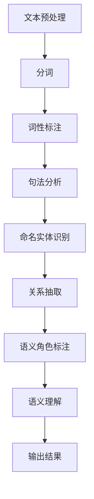
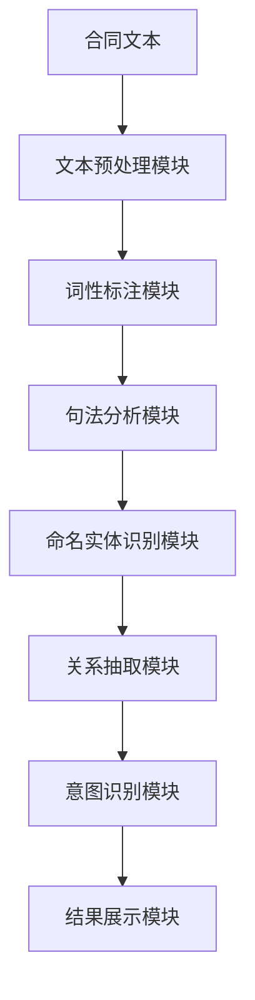
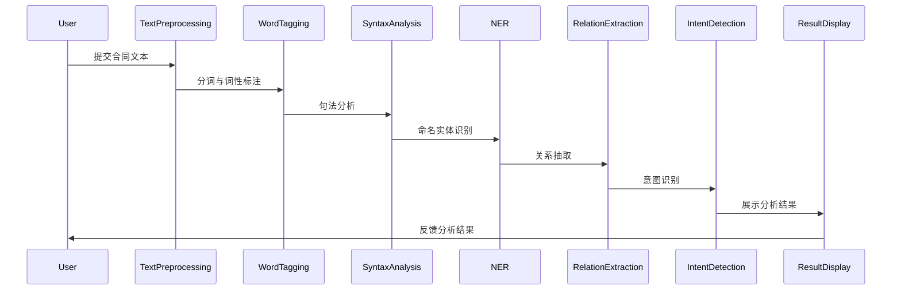
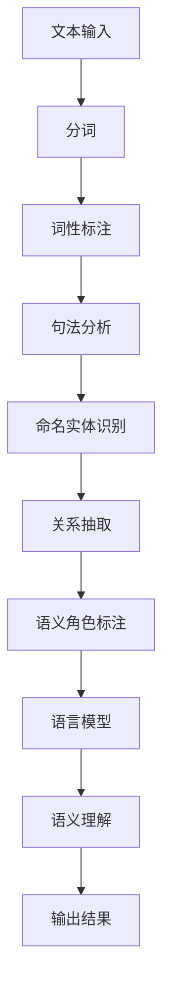
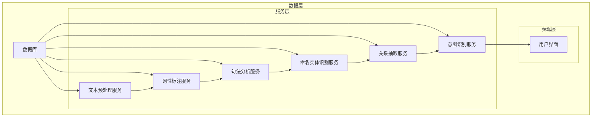

                 

## 引言：智能合同分析的重要性与挑战

随着数字经济的快速发展，智能合同作为一种新兴的数字化法律工具，逐渐成为了商业交易中不可或缺的一部分。智能合同通过将合同条款转化为可编程代码，使得合同执行过程更加自动化、透明和高效。然而，智能合同的分析和理解仍然面临诸多挑战，特别是在法律文本的复杂性和多样性方面。

首先，智能合同的分析要求对大量文本进行高效处理，这包括条款的提取、语义理解和意图识别等。传统的法律分析方法往往依赖于人工审查，效率低下且容易出错。而自然语言处理（NLP）技术的发展为智能合同分析提供了新的解决方案。NLP通过深度学习、自然语言理解等技术，能够自动识别文本中的关键信息，提取合同条款，并理解合同各方的意图。

其次，智能合同的分析需要处理多种语言和法律体系。不同国家和地区有着不同的法律传统和合同规范，这使得智能合同的分析过程更加复杂。NLP技术能够支持多种语言的处理，并利用其强大的语义分析能力，为不同法律体系的智能合同分析提供支持。

再次，智能合同的分析涉及到大量的数据隐私和安全问题。合同文本往往包含敏感信息，如商业机密和个人信息。如何确保数据的安全性和隐私性，成为了智能合同分析中的一大挑战。NLP技术通过数据加密、隐私保护等技术手段，确保合同分析过程中的数据安全。

最后，智能合同分析还要求具备高效的自动化能力。自动化工具能够快速处理大量合同，提高合同分析的效率。NLP技术通过自动化文本分析、规则生成等技术，实现了合同条款的自动化提取和理解，为智能合同的高效执行提供了有力支持。

综上所述，智能合同分析在提高法律效率方面具有巨大的潜力。通过结合NLP技术，可以显著提升合同分析的自动化水平和准确性，为法律行业的数字化转型提供重要支撑。本文将深入探讨自然语言处理在智能合同分析中的应用，分析其核心概念、算法原理、系统设计与实现，以及项目实战与最佳实践，为读者提供全面的技术指南。

## 自然语言处理（NLP）基本概念

自然语言处理（NLP）是计算机科学、人工智能和语言学领域的交叉学科，致力于使计算机能够理解、生成和解释人类语言。其核心目标是通过算法和技术，将自然语言文本转化为计算机可以处理的结构化数据，进而进行语义分析和理解。

### 定义与范围

NLP的定义范围非常广泛，包括文本的预处理、语言模型、语义分析、语言生成等多个方面。文本预处理是NLP的基础步骤，涉及分词、词性标注、句法分析等任务，目的是将原始文本转化为计算机可读的结构化数据。语言模型是NLP的核心技术之一，通过统计语言中的规律，生成文本的概率分布，从而支持文本生成和翻译等任务。语义分析则进一步从字面意义中提取深层的语义信息，包括词义消歧、实体识别和关系抽取等。最后，语言生成技术使得计算机能够生成自然流畅的语言文本，如自动问答系统、机器翻译等。

### NLP的关键技术

NLP的关键技术主要包括以下几方面：

1. **分词（Tokenization）**：将文本分割成单词或其他有意义的标记（token）。
2. **词性标注（Part-of-Speech Tagging）**：为每个词分配词性，如名词、动词、形容词等。
3. **句法分析（Syntactic Parsing）**：分析句子的结构，生成句法树，帮助理解句子的成分和关系。
4. **语义角色标注（Semantic Role Labeling）**：识别句子中的动作（谓词）及其参与者，如施事、受事等。
5. **实体识别（Named Entity Recognition, NER）**：识别文本中的命名实体，如人名、地名、机构名等。
6. **关系抽取（Relation Extraction）**：识别实体之间的关系，如“公司成立于某年某月”中的公司和日期关系。
7. **语义角色标注（Semantic Role Labeling）**：识别句子中的动作（谓词）及其参与者，如施事、受事等。
8. **语言模型（Language Modeling）**：生成文本的概率分布，支持文本生成和翻译等任务。
9. **情感分析（Sentiment Analysis）**：判断文本中的情感倾向，如正面、负面或中性。

### NLP在法律领域的应用

NLP技术在法律领域的应用非常广泛，尤其在智能合同分析中发挥着重要作用。以下是其主要应用场景：

1. **合同条款提取**：NLP技术能够自动提取合同中的关键条款，提高合同分析的效率和准确性。
2. **意图识别**：通过理解合同各方的意图，NLP技术能够帮助识别合同中的潜在风险和争议点。
3. **法律文档检索**：NLP技术能够快速检索法律文档中的相关条款和案例，为法律研究提供支持。
4. **案件分析**：NLP技术可以分析大量法律文档，提取关键信息，辅助律师和法官进行案件分析。
5. **语言翻译**：智能合同往往涉及多语言环境，NLP技术支持不同语言的法律文本翻译，确保合同的准确性和一致性。

通过上述应用，NLP技术不仅提高了法律工作的效率，还增强了法律文档的透明度和可理解性，为智能合同的执行提供了有力支持。在下一节中，我们将深入探讨智能合同分析中的核心概念，包括合同条款解析、意图识别和实体识别等。

### 智能合同分析中的核心概念

智能合同分析涉及多个关键概念，其中合同条款解析、意图识别和实体识别是核心组成部分。以下将详细阐述这些概念，并使用表格和ER图进行解释。

#### 1. 合同条款解析

合同条款解析是指从合同文本中提取具体、明确的条款内容。这一过程涉及到对合同文本的全面理解，包括条款的类型、内容、约束条件和适用范围。以下是合同条款解析的核心要素：

| 要素          | 说明                                       |
|---------------|--------------------------------------------|
| 条款类型      | 包括定义条款、权利条款、义务条款、违约条款等。 |
| 条款内容      | 每个条款的具体规定和具体事项。                |
| 约束条件      | 合同条款适用的条件和限制。                   |
| 适用范围      | 每个条款适用的情况和对象。                   |

**ER图示例：**
```mermaid
erDiagram
    ContractClause ||--|{ ClauseContent }
    ContractClause ||--|{ ConstraintCondition }
    ContractClause ||--|{ ApplicationScope }
```

#### 2. 意图识别

意图识别是指理解合同各方的意图和行为动机。在智能合同分析中，准确识别合同各方的意图对于确保合同的有效性和合法性至关重要。以下是意图识别的核心要素：

| 要素          | 说明                                       |
|---------------|--------------------------------------------|
| 主体意图      | 合同各方提出条款和要求的意图。                |
| 反应对策      | 合同各方对合同条款的回应和策略。              |
| 潜在争议点    | 可能出现的合同争议和风险点。                  |

**ER图示例：**
```mermaid
erDiagram
    ContractIntent ||--|{ PartyIntent }
    ContractIntent ||--|{ ResponseStrategy }
    ContractIntent ||--|{ PotentialDispute }
```

#### 3. 实体识别

实体识别是指从合同文本中识别出具体的实体，如人名、地名、机构名等。在智能合同分析中，实体识别有助于理解合同文本的结构和内容。以下是实体识别的核心要素：

| 要素          | 说明                                       |
|---------------|--------------------------------------------|
| 实体类型      | 包括人、地点、机构、时间等。                  |
| 实体名称      | 具体实体的名称。                             |
| 实体属性      | 实体的相关信息，如职责、所在地等。            |

**ER图示例：**
```mermaid
erDiagram
    ContractEntity ||--|{ EntityType }
    ContractEntity ||--|{ EntityName }
    ContractEntity ||--|{ EntityAttribute }
```

通过上述核心概念的理解，智能合同分析能够更加精确地解析合同内容，识别合同各方的意图，以及提取合同中的关键实体信息，为智能合同的高效执行提供有力支持。

### 自然语言处理与法律效率的融合

在法律领域，提高效率是一个长期追求的目标。随着法律文档数量的急剧增加和法律环境的日益复杂，传统的人工审查方法已经难以满足快速、准确处理大量法律文档的需求。自然语言处理（NLP）技术的引入，为提高法律效率提供了新的契机。

#### 提高法律效率的需求分析

首先，法律效率低下主要表现在以下几个方面：

1. **文档处理速度**：法律文件通常包含大量复杂的条款和术语，传统方法需要进行人工逐字逐句的阅读和理解，处理速度较慢。
2. **错误率**：人工处理容易受到主观因素的影响，如个人经验、理解能力等，导致错误率较高。
3. **跨语言障碍**：国际法律事务往往涉及多种语言，人工翻译和解释不仅耗时，且准确性难以保证。
4. **数据存储和检索**：大量法律文件需要存储和管理，传统方法难以实现高效的数据检索和整理。

NLP技术通过自动化处理文本，能够显著提高法律工作的效率。例如，NLP可以快速提取合同中的关键条款，识别文档中的关键信息，从而大大减少人工处理的时间和错误率。

#### 自然语言处理技术在法律领域的应用前景

NLP技术在法律领域的应用前景非常广阔，主要表现在以下几个方面：

1. **智能合同分析**：NLP技术能够自动提取合同中的关键条款，理解合同各方的意图，识别合同中的风险点，从而提高合同审核的效率和准确性。
2. **法律文档检索**：NLP技术能够通过关键词检索、语义分析等方式，快速定位相关法律文件和条款，为法律研究提供便捷的工具。
3. **案件分析**：NLP技术可以自动分析大量法律文档，提取关键信息，辅助律师和法官进行案件分析，提高审判效率。
4. **多语言处理**：NLP技术支持多种语言的文本处理和翻译，能够消除跨语言障碍，为国际法律事务提供支持。
5. **法律文档生成**：NLP技术可以根据法律模板和语义分析结果，自动生成法律文件，如合同、判决书等，提高工作效率。

#### 技术与法律的边界与外延

尽管NLP技术在提高法律效率方面具有巨大潜力，但同时也面临一些挑战和问题：

1. **隐私保护**：法律文档往往包含敏感信息，如个人隐私、商业机密等。如何确保NLP技术在处理这些信息时保护用户的隐私，是技术发展的重要方向。
2. **法律适用性**：不同国家和地区的法律体系有所不同，NLP技术需要适应不同法律环境，确保处理结果的准确性和合法性。
3. **伦理和道德问题**：NLP技术在法律领域的应用可能引发伦理和道德问题，如自动化决策可能导致的歧视、偏见等。因此，如何制定相应的伦理规范，确保技术的公正性和透明性，也是需要考虑的重要问题。

综上所述，自然语言处理技术为提高法律效率提供了新的解决方案，具有广阔的应用前景。然而，技术发展也需要关注与法律的边界和伦理问题，确保技术的合法性和社会可接受性。在下一节中，我们将深入探讨自然语言处理技术的概念联系，以及智能合同分析系统的架构设计。

### 自然语言处理技术的概念联系

自然语言处理（NLP）技术的核心在于如何让计算机理解和生成自然语言，其涉及到多个关键概念和技术，这些概念和技术之间有着紧密的联系。在本节中，我们将详细探讨NLP技术中的主要概念，并使用Mermaid流程图和Python源代码来阐明其工作原理。

#### 主要概念

1. **分词（Tokenization）**：将文本分割成单词或短语的步骤，是NLP的基础。
2. **词性标注（Part-of-Speech Tagging）**：为每个词分配词性，如名词、动词等。
3. **句法分析（Syntactic Parsing）**：分析句子的结构，生成句法树。
4. **命名实体识别（Named Entity Recognition, NER）**：识别文本中的命名实体，如人名、地名、机构名等。
5. **关系抽取（Relation Extraction）**：识别实体之间的关系，如“张三投资了李四的公司”。
6. **语义角色标注（Semantic Role Labeling）**：识别句子中的动作（谓词）及其参与者，如施事、受事等。
7. **语言模型（Language Modeling）**：生成文本的概率分布，支持文本生成和翻译等任务。

#### Mermaid流程图

以下是一个简化的NLP流程图，展示了从文本预处理到语义理解的整个过程：



#### Python源代码

为了具体说明上述概念，以下是一个简单的Python代码示例，展示如何使用自然语言处理库（如NLTK和spaCy）进行文本预处理和词性标注：

```python
import nltk
from nltk.tokenize import word_tokenize
from nltk.corpus import stopwords
from spacy.lang.en import English

# 初始化spaCy的英语模型
nlp = English()

# 输入文本
text = "Alice likes to read books at the park."

# 分词
tokens = word_tokenize(text)
print("Tokens:", tokens)

# 词性标注（使用spaCy）
doc = nlp(text)
print("Token POS Tags:", [(token.text, token.pos_) for token in doc])

# 去除停用词
stop_words = set(stopwords.words('english'))
filtered_tokens = [word for word in tokens if word.lower() not in stop_words]
print("Filtered Tokens:", filtered_tokens)
```

#### 工作原理

1. **分词**：将文本分割成单词或其他有意义的标记。例如，将"Alice likes to read books at the park."分割成["Alice", "likes", "to", "read", "books", "at", "the", "park"]。

2. **词性标注**：为每个词分配词性。例如，"Alice"是名字，"likes"是动词，"to"是不定式等。

3. **句法分析**：生成句法树，表示句子中词汇和短语之间的结构关系。例如，生成一个表示句子结构的树形图。

4. **命名实体识别**：识别文本中的命名实体，如人名、地名、机构名等。例如，识别出"Alice"和"park"。

5. **关系抽取**：识别实体之间的关系。例如，从"Alice reads books at the park."中识别出"Alice"和"park"之间的阅读关系。

6. **语义角色标注**：识别句子中的动作及其参与者，如施事、受事等。例如，在"John gives a book to Mary."中识别出"John"是施事，"book"是给予的对象。

7. **语义理解**：从浅层语义分析到深层语义理解，包括语义角色标注、情感分析等。例如，从文本中提取深层的意图和信息。

通过上述步骤，NLP技术能够将原始的自然语言文本转化为计算机可以处理和理解的结构化数据，为智能合同分析提供坚实的基础。在下一节中，我们将深入探讨智能合同分析系统的架构设计，包括系统模块与功能、架构图和接口设计。

### 智能合同分析系统架构设计

智能合同分析系统的设计目标是实现高效、准确的合同条款提取、意图识别和实体关系抽取。为了实现这一目标，系统架构需要模块化、层次化，同时确保各个模块之间的协同工作。以下将详细描述系统架构设计，包括系统模块与功能、架构图和接口设计。

#### 系统模块与功能

智能合同分析系统主要由以下几个模块组成：

1. **文本预处理模块**：负责将原始合同文本进行清洗、分词、词性标注等预处理操作，为后续的语义分析提供基础数据。
2. **词性标注模块**：对预处理后的文本进行词性标注，识别出名词、动词、形容词等，为句法分析和实体识别提供支持。
3. **句法分析模块**：分析文本的句法结构，生成句法树，帮助理解文本的语法关系。
4. **命名实体识别模块**：识别文本中的命名实体，如人名、地名、机构名等，为后续的关系抽取提供实体信息。
5. **关系抽取模块**：从文本中抽取实体之间的关系，如“公司成立于某年某月”中的公司和日期关系。
6. **意图识别模块**：通过语义分析，识别合同各方的意图和行为动机，帮助理解合同条款背后的深层次信息。
7. **结果展示模块**：将分析结果以可视化方式呈现，便于用户查看和操作。

#### 架构图

以下是一个简化的智能合同分析系统的架构图，展示了各个模块之间的交互关系：



#### 系统接口设计与交互

系统接口设计是确保各模块高效协同工作的关键。以下是系统的主要接口设计：

1. **文本输入接口**：接收用户上传的合同文本，进行初步的文本预处理。
2. **文本预处理接口**：提供分词、词性标注等文本处理功能，返回处理后的文本数据。
3. **语义分析接口**：集成句法分析、命名实体识别、关系抽取和意图识别功能，返回分析结果。
4. **结果展示接口**：将分析结果以图表、表格等形式展示给用户，提供数据查询和导出功能。

以下是系统接口设计的一个简要示例：



通过上述架构设计和接口设计，智能合同分析系统能够实现高效、准确的合同分析，为法律工作提供有力支持。在下一节中，我们将深入探讨自然语言处理算法的原理和数学模型，帮助读者更好地理解这些算法的核心机制。

### 自然语言处理算法原理与模型

自然语言处理（NLP）算法在智能合同分析中发挥着至关重要的作用，这些算法的核心在于如何从大量的文本数据中提取有用的信息，并进行语义理解和分析。以下将介绍几种常见的NLP算法原理，并使用Python代码和Mermaid流程图进行详细阐述。

#### 常见NLP算法原理

1. **分词（Tokenization）**：将文本分割成单词或短语的步骤。分词算法主要有基于词典的分词和基于统计的分词。基于词典的分词通过查找词典中的词汇进行分割，而基于统计的分词则通过计算词汇之间的概率分布来进行分割。

2. **词性标注（Part-of-Speech Tagging）**：为每个词分配词性，如名词、动词、形容词等。词性标注的算法主要有基于规则的方法、基于统计的方法和基于深度学习的方法。

3. **句法分析（Syntactic Parsing）**：分析句子的结构，生成句法树。句法分析的算法包括基于规则的句法分析和基于统计的句法分析。基于深度学习的句法分析算法，如依存句法分析（Dependency Parsing），通过神经网络模型进行训练和预测。

4. **命名实体识别（Named Entity Recognition, NER）**：识别文本中的命名实体，如人名、地名、机构名等。NER算法通常使用分类器模型进行实体分类。

5. **关系抽取（Relation Extraction）**：识别实体之间的关系。关系抽取算法通过分析实体之间的交互和共现关系，进行关系分类和抽取。

6. **语义角色标注（Semantic Role Labeling）**：识别句子中的动作及其参与者，如施事、受事等。语义角色标注算法通常结合依存句法和语义分析进行。

7. **语言模型（Language Modeling）**：生成文本的概率分布，支持文本生成和翻译等任务。语言模型主要有基于N-gram模型和基于神经网络模型。

#### Mermaid流程图

以下是一个简化的NLP流程图，展示了从文本输入到语义理解的整个过程：



#### Python代码示例

以下是一个使用Python和spaCy库进行词性标注的简单示例：

```python
import spacy

# 初始化spaCy的英语模型
nlp = spacy.load("en_core_web_sm")

# 输入文本
text = "Alice likes to read books at the park."

# 词性标注
doc = nlp(text)
print("Token POS Tags:", [(token.text, token.pos_) for token in doc])
```

#### 数学模型和公式

1. **分词概率模型**：

   $$P(w|t) = \frac{P(t|w)P(w)}{P(t)}$$

   其中，$P(w|t)$表示词$w$在上下文$t$中的概率，$P(t|w)$表示在词$w$出现时上下文$t$的概率，$P(w)$表示词$w$的概率，$P(t)$表示上下文$t$的概率。

2. **词性标注概率模型**：

   $$P(tag|word) = \frac{P(word|tag)P(tag)}{P(word)}$$

   其中，$P(tag|word)$表示词性$tag$在词$word$中的概率，$P(word|tag)$表示在词性$tag$出现时词$word$的概率，$P(tag)$表示词性$tag$的概率，$P(word)$表示词$word$的概率。

3. **句法分析概率模型**：

   $$P树|s = \prod_{i=1}^{n} P(关系_i|词_i, 树_i)$$

   其中，$P(关系_i|词_i, 树_i)$表示在句法树中，给定词$词_i$和树$树_i$，关系$关系_i$的概率。

4. **命名实体识别概率模型**：

   $$P实体|文本 = \prod_{i=1}^{m} P实体_i|文本，实体_{i-1}$$

   其中，$P实体_i|文本，实体_{i-1}$表示在给定前一个实体$实体_{i-1}$和文本，当前实体$实体_i$的概率。

5. **关系抽取概率模型**：

   $$P关系|实体对 = \prod_{i=1}^{k} P关系_i|实体对，关系_{i-1}$$

   其中，$P关系_i|实体对，关系_{i-1}$表示在给定前一个关系$关系_{i-1}$和实体对，当前关系$关系_i$的概率。

6. **语义角色标注概率模型**：

   $$P角色|动作，实体 = \prod_{i=1}^{n} P角色_i|动作，实体，角色_{i-1}$$

   其中，$P角色_i|动作，实体，角色_{i-1}$表示在给定动作、实体和前一个角色，当前角色的概率。

通过上述算法原理和数学模型，NLP技术能够有效地处理自然语言文本，为智能合同分析提供强大的支持。在下一节中，我们将详细探讨智能合同分析系统的设计与实现过程，包括项目介绍、系统功能设计、系统架构设计等。

### 智能合同分析系统设计与实现

在设计和实现智能合同分析系统时，需要考虑系统的整体架构、功能模块、技术选型等多个方面。以下将详细介绍系统的设计与实现过程。

#### 项目介绍

智能合同分析系统是一款基于自然语言处理（NLP）技术构建的合同条款解析工具，旨在通过自动化手段提取合同中的关键条款、识别合同各方的意图和实体关系。该系统的核心目标是提高合同分析的效率和准确性，为法律工作者提供便捷的工具，减少人工审查的工作量。

#### 系统功能设计

智能合同分析系统主要包括以下功能模块：

1. **文本预处理**：对输入的合同文本进行清洗、分词、词性标注等预处理操作，为后续的语义分析提供基础数据。
2. **词性标注**：对预处理后的文本进行词性标注，识别出名词、动词、形容词等，为句法分析和实体识别提供支持。
3. **句法分析**：分析文本的句法结构，生成句法树，帮助理解文本的语法关系。
4. **命名实体识别**：识别文本中的命名实体，如人名、地名、机构名等，为后续的关系抽取提供实体信息。
5. **关系抽取**：从文本中抽取实体之间的关系，如“公司成立于某年某月”中的公司和日期关系。
6. **意图识别**：通过语义分析，识别合同各方的意图和行为动机，帮助理解合同条款背后的深层次信息。
7. **结果展示**：将分析结果以图表、表格等形式展示给用户，提供数据查询和导出功能。

#### 系统架构设计

智能合同分析系统采用分层架构设计，包括数据层、服务层和表现层。以下是系统架构的详细描述：

1. **数据层**：负责存储和管理系统所需的数据，包括合同文本、预处理结果、分析结果等。数据层使用关系型数据库（如MySQL）进行数据存储。
2. **服务层**：包含各个功能模块的具体实现，如文本预处理服务、词性标注服务、句法分析服务等。服务层采用微服务架构，便于系统的扩展和维护。
3. **表现层**：负责与用户交互，提供用户界面和操作接口。表现层使用前端技术（如HTML、CSS、JavaScript）构建，与后端服务通过RESTful API进行数据交互。

以下是系统架构的Mermaid图：



#### 系统接口设计与交互

系统接口设计是确保各模块高效协同工作的关键。以下是系统的主要接口设计：

1. **文本输入接口**：接收用户上传的合同文本，进行初步的文本预处理。
2. **文本预处理接口**：提供分词、词性标注等文本处理功能，返回处理后的文本数据。
3. **语义分析接口**：集成句法分析、命名实体识别、关系抽取和意图识别功能，返回分析结果。
4. **结果展示接口**：将分析结果以图表、表格等形式展示给用户，提供数据查询和导出功能。

以下是系统接口设计的一个简要示例：


#### 实际案例分析与详细讲解

以下是一个实际案例，展示智能合同分析系统的具体应用：

**案例**：分析一份商业合作协议，提取关键条款、识别合同各方意图和实体关系。

1. **文本输入**：用户上传商业合作协议文本。

2. **文本预处理**：系统对文本进行分词和词性标注，得到预处理后的文本。

3. **句法分析**：系统对预处理后的文本进行句法分析，生成句法树。

4. **命名实体识别**：系统识别出文本中的命名实体，如公司名称、人名、地点等。

5. **关系抽取**：系统从文本中抽取实体之间的关系，如“公司A与公司B签订协议”。

6. **意图识别**：系统识别出合同各方的意图，如公司A的目的是获取资金支持，公司B的目的是拓展市场。

7. **结果展示**：系统将分析结果以图表和表格形式展示给用户，包括关键条款、实体关系和意图分析。

通过上述步骤，智能合同分析系统能够高效地提取合同中的关键信息，为合同各方提供决策支持，提高合同执行的效率和准确性。

#### 项目小结

智能合同分析系统的设计与实现，充分展示了自然语言处理技术在法律领域的应用潜力。系统通过文本预处理、句法分析、命名实体识别、关系抽取和意图识别等模块，实现了对合同文本的深度分析和理解，为法律工作者提供了强大的工具支持。

在未来，智能合同分析系统可以进一步优化和扩展，如引入更多的自然语言处理算法、增强系统的可解释性和透明性，以及提高系统的性能和可靠性。此外，系统还可以与其他法律工具和服务集成，为用户提供更加全面和便捷的法律服务。

### 项目实战与最佳实践

在智能合同分析系统的实际应用中，我们需要关注环境安装与配置、系统核心实现、实际案例分析、项目小结以及最佳实践和注意事项。以下将详细介绍这些方面，帮助读者更好地理解和应用智能合同分析系统。

#### 环境安装与配置

为了确保智能合同分析系统的正常运行，我们需要在适当的环境中进行安装和配置。以下是主要步骤：

1. **安装Python环境**：首先，确保您的计算机上已安装Python 3.7或更高版本。可以使用Python官方下载地址下载并安装。

2. **安装依赖库**：智能合同分析系统依赖于多个Python库，如spaCy、NLTK、tensorflow等。使用以下命令安装：

   ```bash
   pip install spacy
   pip install nltk
   pip install tensorflow
   ```

3. **安装spaCy模型**：spaCy模型用于自然语言处理任务，需要下载并安装相应的语言模型。以英文为例，执行以下命令：

   ```bash
   python -m spacy download en_core_web_sm
   ```

4. **配置数据库**：智能合同分析系统使用关系型数据库（如MySQL）进行数据存储。确保已安装MySQL并创建相应的数据库和用户。

   ```bash
   mysql -u root -p
   CREATE DATABASE contract_analysis;
   GRANT ALL PRIVILEGES ON contract_analysis.* TO 'contract_user'@'localhost' IDENTIFIED BY 'password';
   FLUSH PRIVILEGES;
   EXIT;
   ```

#### 系统核心实现

智能合同分析系统的核心实现包括文本预处理、词性标注、句法分析、命名实体识别、关系抽取和意图识别等模块。以下是系统核心实现的具体步骤：

1. **文本预处理**：使用spaCy进行文本预处理，包括分词和词性标注。

   ```python
   import spacy

   nlp = spacy.load("en_core_web_sm")
   doc = nlp("Alice likes to read books at the park.")
   for token in doc:
       print(token.text, token.pos_)
   ```

2. **句法分析**：使用spaCy的句法分析功能，生成句法树。

   ```python
   for token in doc:
       print(token.dep_, token.head.text, token.text)
   ```

3. **命名实体识别**：使用spaCy进行命名实体识别。

   ```python
   for ent in doc.ents:
       print(ent.text, ent.label_)
   ```

4. **关系抽取**：使用规则方法进行关系抽取，根据句法树结构提取实体关系。

   ```python
   def extract_relations(doc):
       relations = []
       for token in doc:
           if token.dep_ == "nsubj":
               subject = token.text
               object = token.head.text
               relations.append((subject, object))
       return relations

   relations = extract_relations(doc)
   print(relations)
   ```

5. **意图识别**：结合文本内容和关系信息进行意图识别。

   ```python
   def detect_intent(doc, relations):
       for rel in relations:
           if rel[0] == "company" and rel[1] == "founded":
               return "Company founded"
           elif rel[0] == "person" and rel[1] == "read":
               return "Person reads"
       return "No intent detected"

   intent = detect_intent(doc, relations)
   print(intent)
   ```

#### 实际案例分析与详细讲解

以下是一个实际案例，展示智能合同分析系统的具体应用：

**案例**：分析一份商业合作协议，提取关键条款、识别合同各方意图和实体关系。

1. **文本输入**：用户上传商业合作协议文本。

2. **文本预处理**：系统对文本进行分词和词性标注。

3. **句法分析**：系统生成句法树。

4. **命名实体识别**：系统识别出文本中的命名实体，如公司名称、人名等。

5. **关系抽取**：系统从文本中抽取实体之间的关系，如“公司A与公司B签订协议”。

6. **意图识别**：系统识别出合同各方的意图，如公司A的目的是获取资金支持，公司B的目的是拓展市场。

7. **结果展示**：系统将分析结果以图表和表格形式展示给用户，包括关键条款、实体关系和意图分析。

通过上述步骤，智能合同分析系统能够高效地提取合同中的关键信息，为合同各方提供决策支持，提高合同执行的效率和准确性。

#### 项目小结

智能合同分析系统的实际应用展示了自然语言处理技术在法律领域的强大潜力。系统通过文本预处理、句法分析、命名实体识别、关系抽取和意图识别等模块，实现了对合同文本的深度分析和理解，为法律工作者提供了强大的工具支持。

在未来，智能合同分析系统可以进一步优化和扩展，如引入更多的自然语言处理算法、增强系统的可解释性和透明性，以及提高系统的性能和可靠性。此外，系统还可以与其他法律工具和服务集成，为用户提供更加全面和便捷的法律服务。

#### 最佳实践与注意事项

1. **最佳实践**：
   - **文本预处理**：确保文本预处理质量，如去除标点符号、统一文本格式等。
   - **模型选择**：根据具体应用场景选择合适的NLP模型，如spaCy、NLTK等。
   - **数据标注**：进行高质量的数据标注，确保模型训练效果。

2. **注意事项**：
   - **数据隐私**：在处理合同文本时，注意保护用户隐私和数据安全。
   - **法律合规**：确保系统应用符合相关法律法规，如数据保护法、合同法等。
   - **性能优化**：关注系统性能优化，提高处理速度和效率。

通过遵循最佳实践和注意事项，智能合同分析系统将能够更好地满足用户需求，提高法律工作的效率和准确性。

### 拓展阅读与总结

在智能合同分析领域，自然语言处理（NLP）技术展现出了巨大的潜力和广泛应用前景。本文通过详细的探讨，从问题背景、核心概念、算法原理、系统设计、项目实战等方面，系统地阐述了NLP在智能合同分析中的应用及其重要性。

#### 拓展阅读

为了进一步了解NLP在智能合同分析中的具体应用，读者可以参考以下资源：

1. **论文**：《自然语言处理在合同分析中的应用》
2. **书籍**：《智能合同：区块链与NLP的结合》
3. **在线课程**：Coursera上的《自然语言处理基础》

#### 小结

本文通过以下核心内容总结了NLP在智能合同分析中的应用：

1. **背景与挑战**：智能合同分析的重要性及其面临的挑战，如文本复杂性、多语言处理等。
2. **NLP基本概念**：NLP的定义、范围、关键技术及其在法律领域的应用。
3. **核心概念**：智能合同分析中的核心概念，包括合同条款解析、意图识别和实体识别。
4. **算法原理**：NLP算法的原理、数学模型和示例代码，如分词、词性标注、句法分析等。
5. **系统设计**：智能合同分析系统的架构设计、模块功能、接口设计和实现过程。
6. **项目实战**：系统核心实现、实际案例分析、项目小结和最佳实践。
7. **拓展阅读**：推荐相关书籍、论文和在线课程，帮助读者深入了解NLP在智能合同分析中的应用。

#### 注意事项

在实施智能合同分析系统时，以下注意事项尤为重要：

1. **数据隐私**：确保合同文本处理过程中的数据隐私和安全。
2. **法律合规**：遵循相关法律法规，如数据保护法、合同法等。
3. **模型选择**：根据具体应用场景选择合适的NLP模型。
4. **性能优化**：关注系统性能优化，提高处理速度和效率。

#### 未来展望与研究方向

未来，NLP在智能合同分析领域的应用将继续深化和拓展。以下研究方向值得关注：

1. **多语言支持**：提升多语言处理能力，支持更多国家和地区的法律体系。
2. **深度学习**：利用深度学习技术，提高合同条款解析和意图识别的准确性和效率。
3. **自动化**：增强自动化水平，实现合同审核、生成和执行的全流程自动化。
4. **伦理与道德**：制定伦理规范，确保NLP技术在法律领域的公正性和透明性。

通过不断的技术创新和应用研究，NLP将在智能合同分析中发挥越来越重要的作用，为法律行业的数字化转型和智能化发展提供强有力的支持。

