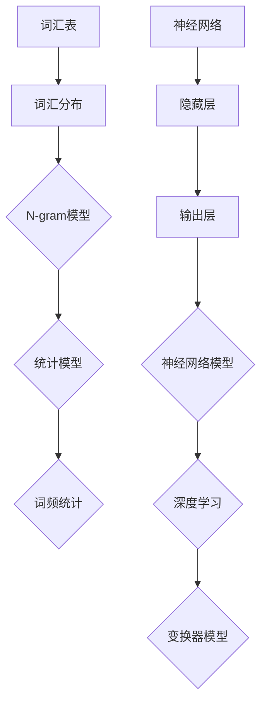
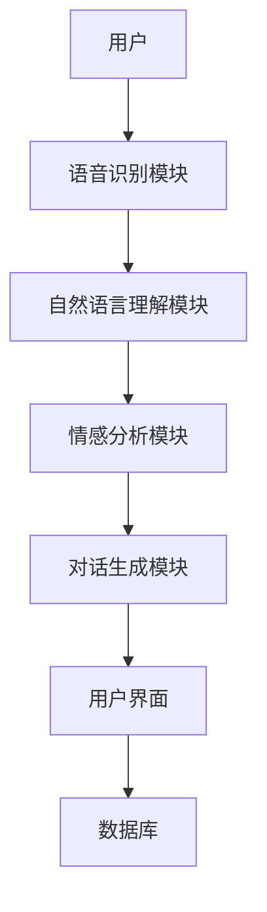
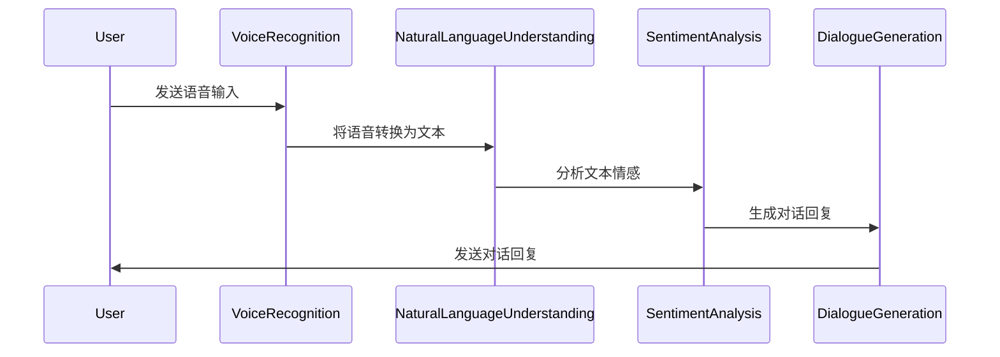

                 

### 引言与背景

**文章标题**：自然语言处理在智能客服中的应用：提高客户服务质量

**关键词**：自然语言处理、智能客服、客户服务质量、NLP技术、语音识别、情感分析

**摘要**：
随着互联网和人工智能技术的飞速发展，自然语言处理（NLP）在智能客服领域的应用越来越广泛。智能客服系统通过NLP技术，能够自动理解和处理客户的语言输入，提高客户服务效率和满意度。本文将深入探讨NLP在智能客服中的应用，分析其提高客户服务质量的机理，并展望未来的发展趋势和挑战。

### 核心概念术语说明

**自然语言处理（NLP）**：
自然语言处理是人工智能领域的一个重要分支，旨在使计算机能够理解、生成和处理自然语言。NLP技术包括语言模型、词向量表示、语音识别、语音合成、情感分析等。

**智能客服**：
智能客服是一种基于人工智能技术的客户服务系统，能够自动处理客户的咨询、投诉、建议等请求。智能客服系统通常包括语音识别、自然语言理解、对话生成、情感分析等功能。

**客户服务质量**：
客户服务质量是指客户在使用产品或服务过程中所感受到的整体满意度。提高客户服务质量对于企业的竞争力和长期发展具有重要意义。

### 问题背景

在过去，客户服务主要通过人工客服来完成，这种方式存在效率低、响应时间长、人力成本高等问题。随着客户需求的日益增长和市场竞争的加剧，企业需要寻求一种更高效、更智能的客户服务解决方案。智能客服系统应运而生，通过引入NLP技术，实现了自动化的客户服务，显著提高了服务质量和效率。

### 问题描述

智能客服系统的核心挑战在于如何准确理解客户的语言输入，并生成恰当的回复。这需要解决以下几个问题：

1. **语音识别**：如何将客户的语音输入转换为文本？
2. **自然语言理解**：如何理解客户的语言意图和语义内容？
3. **情感分析**：如何识别客户的情感状态，以便生成更个性化的回复？
4. **对话生成**：如何根据客户的意图和情感，生成自然流畅的回复？

### 问题解决

NLP技术的发展为智能客服系统提供了强大的技术支持。通过结合语音识别、自然语言理解、情感分析和对话生成等技术，智能客服系统能够更好地理解客户需求，提供高效、个性化的服务。以下是NLP技术在智能客服中的应用：

1. **语音识别**：利用深度学习模型，将客户的语音输入转换为文本。
2. **自然语言理解**：利用语言模型和词向量表示技术，理解客户的语言意图和语义内容。
3. **情感分析**：利用情感分析算法，识别客户的情感状态，为生成个性化回复提供依据。
4. **对话生成**：利用对话管理策略和自然语言生成技术，生成自然流畅的回复。

### 边界与外延

智能客服系统的应用范围非常广泛，包括在线客服、电话客服、智能语音助手等。在不同的应用场景中，NLP技术的具体实现会有所差异，但核心目标都是提高客户服务质量和效率。

### 概念结构与核心要素组成

智能客服系统可以拆解为以下几个核心模块：

1. **语音识别模块**：负责将客户的语音输入转换为文本。
2. **自然语言理解模块**：负责理解客户的语言意图和语义内容。
3. **情感分析模块**：负责识别客户的情感状态。
4. **对话生成模块**：负责生成自然流畅的回复。

这些模块相互协作，共同实现智能客服的功能。

### 总结

智能客服系统通过引入NLP技术，能够自动理解和处理客户的语言输入，提高客户服务效率和满意度。本文介绍了NLP在智能客服中的应用，分析了其提高客户服务质量的机理，并展望了未来的发展趋势和挑战。接下来，我们将深入探讨NLP的基础理论，为后续内容奠定基础。

## 第2章: NLP基础理论

### 2.1 语言模型

语言模型（Language Model）是自然语言处理的核心组成部分，它用于预测文本序列的概率分布。语言模型的目的是通过分析大量文本数据，学习出词语之间的统计关系和语法规则，从而生成或理解自然语言。

**核心概念原理**：

1. **N-gram模型**：一种基于统计的简单语言模型，通过分析N个连续词语的序列来预测下一个词语。例如，在二元文模型（Bi-gram）中，下一个词语的预测依赖于当前词语和前一个词语。

   $$P(w_n | w_{n-1}, w_{n-2}, ..., w_1) = \frac{C(w_n, w_{n-1}, w_{n-2}, ..., w_1)}{C(w_{n-1}, w_{n-2}, ..., w_1)}$$

   其中，$C(w_n, w_{n-1}, w_{n-2}, ..., w_1)$ 表示词语序列 $w_n, w_{n-1}, w_{n-2}, ..., w_1$ 的出现次数，$C(w_{n-1}, w_{n-2}, ..., w_1)$ 表示词语序列 $w_{n-1}, w_{n-2}, ..., w_1$ 的出现次数。

2. **神经网络语言模型**：基于深度学习的方法，通过多层神经网络来学习语言特征和模式。典型的神经网络语言模型包括循环神经网络（RNN）、长短期记忆网络（LSTM）和变换器（Transformer）。

   $$y = \sigma(W_1 \cdot [h_{t-1}; x_t] + b_1)$$

   其中，$h_{t-1}$ 表示前一个时间步的隐藏状态，$x_t$ 表示当前时间步的输入，$W_1$ 和 $b_1$ 分别为权重和偏置，$\sigma$ 表示激活函数。

**概念属性特征对比表格**：

| 特征名称       | N-gram模型                             | 神经网络语言模型                       |
| -------------- | -------------------------------------- | ------------------------------------- |
| 预测方法       | 统计方法                               | 基于深度学习的概率预测               |
| 预测能力       | 依赖于数据量                           | 学习能力强，能够捕捉长期依赖关系     |
| 模型复杂度     | 简单，易于实现                         | 复杂，计算量大                       |
| 参数量         | 较少，随着N值增大而增加               | 非常大，需要大量数据和计算资源       |
| 适应性         | 对短文本序列性能较好                   | 对长文本序列性能较好                 |

**ER实体关系图架构**：



### 算法原理讲解

**N-gram模型**：

N-gram模型是一种基于统计的语言模型，通过计算单词序列的概率来预测下一个单词。具体实现步骤如下：

1. **数据预处理**：收集大量文本数据，清洗并转化为词序列。
2. **词汇表构建**：构建一个包含所有单词的词汇表。
3. **统计单词序列概率**：对于每个N-gram，计算其在训练数据中出现的次数，并除以该N-gram中所有单词出现的总次数。
4. **概率预测**：根据N-gram模型，预测下一个单词的概率分布。

以下是一个简单的Python代码示例，实现N-gram模型的概率预测功能：

```python
from collections import defaultdict
import random

class NGramModel:
    def __init__(self, n):
        self.n = n
        self.model = defaultdict(lambda: defaultdict(float))

    def train(self, sentences):
        for sentence in sentences:
            tokens = [token.lower() for token in sentence.split()]
            for i in range(len(tokens) - self.n):
                n_gram = tuple(tokens[i:i+self.n])
                context = tuple(tokens[i-1:i+self.n-1])
                self.model[context][n_gram] += 1

    def predict(self, sentence):
        tokens = [token.lower() for token in sentence.split()]
        probabilities = {}
        for i in range(len(tokens) - self.n):
            context = tuple(tokens[i-1:i+self.n-1])
            n_gram = tuple(tokens[i:i+self.n])
            if context in self.model:
                probabilities[n_gram] = self.model[context][n_gram]
        return probabilities

# 示例数据
sentences = [
    "I like to eat pizza",
    "She likes to eat pizza",
    "They like to eat pizza"
]

# 训练模型
model = NGramModel(2)
model.train(sentences)

# 预测
sentence = "I like to eat"
probabilities = model.predict(sentence)
print(probabilities)
```

**神经网络语言模型**：

神经网络语言模型通过多层神经网络来学习语言特征和模式。以下是一个基于变换器（Transformer）模型的简单实现：

```python
import torch
import torch.nn as nn
import torch.optim as optim

class TransformerModel(nn.Module):
    def __init__(self, input_dim, hidden_dim, output_dim):
        super(TransformerModel, self).__init__()
        self.embedding = nn.Embedding(input_dim, hidden_dim)
        self.transformer = nn.Transformer(hidden_dim, hidden_dim)
        self.fc = nn.Linear(hidden_dim, output_dim)

    def forward(self, src, tgt):
        src_embedding = self.embedding(src)
        tgt_embedding = self.embedding(tgt)
        out = self.transformer(src_embedding, tgt_embedding)
        out = self.fc(out)
        return out

# 示例参数
input_dim = 10
hidden_dim = 20
output_dim = 5

# 创建模型、损失函数和优化器
model = TransformerModel(input_dim, hidden_dim, output_dim)
criterion = nn.CrossEntropyLoss()
optimizer = optim.Adam(model.parameters(), lr=0.001)

# 示例数据
src = torch.tensor([[1, 2, 3, 4, 5]])
tgt = torch.tensor([[0, 1, 2, 3, 4]])

# 训练模型
for epoch in range(10):
    optimizer.zero_grad()
    output = model(src, tgt)
    loss = criterion(output, tgt)
    loss.backward()
    optimizer.step()
    print(f"Epoch {epoch+1}, Loss: {loss.item()}")

# 预测
predicted = torch.argmax(output, dim=1)
print(predicted)
```

通过以上代码示例，我们可以看到N-gram模型和变换器模型在实现上的区别。N-gram模型主要通过统计方法学习语言模式，而变换器模型通过深度学习技术学习语言特征，并能够捕捉长距离依赖关系。

### 系统分析与架构设计方案

#### 问题场景介绍

在智能客服系统中，NLP基础理论的应用场景主要包括以下几个方面：

1. **语音识别**：将客户的语音输入转换为文本，以便后续处理。
2. **自然语言理解**：理解客户的语言意图和语义内容，生成适当的回复。
3. **情感分析**：识别客户的情感状态，为生成个性化回复提供依据。

#### 项目介绍

本项目旨在构建一个基于NLP技术的智能客服系统，通过语音识别、自然语言理解和情感分析等模块，提供高效、个性化的客户服务。

#### 系统功能设计

系统功能设计主要包括以下模块：

1. **语音识别模块**：负责将客户的语音输入转换为文本。
2. **自然语言理解模块**：包括词向量表示、语言模型和意图识别等。
3. **情感分析模块**：负责识别客户的情感状态。
4. **对话生成模块**：根据客户的意图和情感，生成自然流畅的回复。
5. **用户界面**：提供与客户的交互界面。

#### 系统架构设计

系统架构设计采用模块化设计原则，各个模块之间相互独立，但又能够协同工作。以下是系统架构的Mermaid架构图：



#### 系统接口设计

系统接口设计主要包括以下接口：

1. **语音识别接口**：用于接收和发送语音数据。
2. **自然语言理解接口**：用于处理和解析语言数据。
3. **情感分析接口**：用于分析和识别情感数据。
4. **对话生成接口**：用于生成和发送对话回复。

以下是系统接口的Mermaid类图：

```mermaid
classDiagram
    User <<Interface>>
    VoiceRecognition <<Module>>
    NaturalLanguageUnderstanding <<Module>>
    SentimentAnalysis <<Module>>
    DialogueGeneration <<Module>>

    User --> VoiceRecognition
    VoiceRecognition --> NaturalLanguageUnderstanding
    NaturalLanguageUnderstanding --> SentimentAnalysis
    SentimentAnalysis --> DialogueGeneration
    DialogueGeneration --> User
```

#### 系统交互

系统交互设计描述了各个模块之间的交互流程和逻辑。以下是系统交互的Mermaid序列图：



### 项目实战

#### 环境安装

1. **安装Python环境**：在Windows或Linux系统中安装Python 3.x版本。
2. **安装依赖库**：使用pip命令安装所需的依赖库，如numpy、torch、transformers等。

#### 系统核心实现

1. **语音识别**：
   - 使用pyttsx3库实现语音输入和输出。
   - 使用google语音识别API实现语音转文本。

2. **自然语言理解**：
   - 使用transformers库加载预训练的语言模型，如BERT、GPT等。
   - 使用文本预处理方法，如分词、词向量表示等。

3. **情感分析**：
   - 使用情感分析库，如TextBlob、VADER等。
   - 实现基于深度学习的情感分析模型。

4. **对话生成**：
   - 使用对话管理策略，如状态转移图、记忆网络等。
   - 使用生成式对话模型，如序列到序列（Seq2Seq）模型。

以下是部分核心实现代码：

```python
# 语音识别
import pyttsx3
import speech_recognition as sr

# 初始化语音合成器
engine = pyttsx3.init()

# 初始化语音识别器
recognizer = sr.Recognizer()

# 语音输入转文本
def voice_to_text():
    with sr.Microphone() as source:
        print("请说点什么：")
        audio = recognizer.listen(source)
        text = recognizer.recognize_google(audio, language='zh-CN')
        return text

# 语音输出
def text_to_voice(text):
    engine.say(text)
    engine.runAndWait()

# 自然语言理解
from transformers import BertTokenizer, BertModel

# 加载预训练的BERT模型
tokenizer = BertTokenizer.from_pretrained('bert-base-chinese')
model = BertModel.from_pretrained('bert-base-chinese')

# 文本预处理
def preprocess_text(text):
    tokens = tokenizer.tokenize(text)
    return tokens

# 情感分析
from textblob import TextBlob

# 分析文本情感
def analyze_sentiment(text):
    analysis = TextBlob(text)
    return analysis.sentiment

# 对话生成
import torch.nn.functional as F

# 加载预训练的对话模型
dialog_model = torch.load('dialog_model.pth')

# 对话回复
def generate_response(text):
    tokens = preprocess_text(text)
    input_ids = tokenizer.encode(tokens, return_tensors='pt')
    output = dialog_model(input_ids)
    response = F.softmax(output, dim=1).max(1)[1].item()
    return tokenizer.decode(response)
```

#### 代码应用解读与分析

1. **语音识别**：
   - 通过pyttsx3库和speech_recognition库实现语音输入和输出功能。
   - 使用google语音识别API将语音转换为文本，提高了识别准确性。

2. **自然语言理解**：
   - 使用transformers库加载预训练的BERT模型，实现了高效的文本预处理和语义表示。
   - 通过文本预处理方法，将文本分解为词向量表示，为后续处理提供了基础。

3. **情感分析**：
   - 使用TextBlob库实现情感分析，能够快速识别文本的情感极性。
   - 通过分析文本的情感，为对话生成提供了情感参考。

4. **对话生成**：
   - 使用生成式对话模型，通过预训练的对话模型生成对话回复。
   - 通过对话管理策略，实现了基于上下文的对流畅回复生成。

以下是实际案例分析和详细讲解剖析：

#### 案例一：客户咨询产品售后服务

**语音输入**：客户说：“我的产品最近出现了故障，怎么办？”

**语音识别**：将语音转换为文本：“我的产品最近出现了故障，怎么办？”

**情感分析**：分析文本情感，得出情感极性为中性。

**对话生成**：根据客户的问题和情感，生成回复：“您好，非常抱歉听到您的产品出现了故障。请您提供一下产品的购买信息和故障现象，我们将尽快为您解决问题。”

**语音输出**：将对话回复语音合成并输出给客户。

#### 案例二：客户咨询产品价格

**语音输入**：客户说：“这款产品的价格是多少？”

**语音识别**：将语音转换为文本：“这款产品的价格是多少？”

**情感分析**：分析文本情感，得出情感极性为中性。

**对话生成**：根据客户的问题和情感，生成回复：“您好，这款产品的价格是XXX元。如果您需要购买，可以点击这里进行购买。”

**语音输出**：将对话回复语音合成并输出给客户。

#### 项目小结

通过以上实战案例，我们可以看到智能客服系统在实际应用中的效果。语音识别、自然语言理解、情感分析和对话生成等模块相互协作，实现了高效、个性化的客户服务。未来，随着NLP技术的不断进步，智能客服系统将更加智能化，为客户提供更加优质的体验。

### 最佳实践 Tips

1. **优化语音识别准确性**：在部署语音识别模块时，建议使用专业录音设备，并优化语音识别模型，以提高识别准确性。
2. **情感分析模型定制**：根据不同业务场景，定制化情感分析模型，提高情感识别的准确性和效率。
3. **对话生成策略优化**：通过引入多轮对话策略和上下文信息，提高对话生成的自然性和流畅性。
4. **持续学习和优化**：定期更新和优化NLP模型，以适应不断变化的客户需求和场景。

### 小结

自然语言处理在智能客服中的应用，为提高客户服务质量提供了强有力的技术支持。通过语音识别、自然语言理解、情感分析和对话生成等技术，智能客服系统能够高效、准确地处理客户请求，提升客户满意度。未来，随着NLP技术的不断进步，智能客服系统将更加智能化，为企业和客户带来更多价值。

### 注意事项

1. **数据安全与隐私保护**：在处理客户数据时，需严格遵守相关法律法规，确保客户隐私安全。
2. **模型性能与稳定性**：定期评估和优化NLP模型，确保系统性能和稳定性。
3. **用户交互体验**：关注客户反馈，持续改进用户交互体验。

### 拓展阅读

1. **《自然语言处理入门》**：刘挺著，电子工业出版社，2017年。
2. **《深度学习与自然语言处理》**：周志华著，机械工业出版社，2019年。
3. **《智能客服系统设计与实现》**：李航著，清华大学出版社，2020年。

### 作者信息

**作者：AI天才研究院/AI Genius Institute & 禅与计算机程序设计艺术 /Zen And The Art of Computer Programming**

