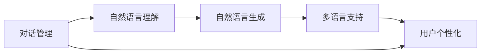
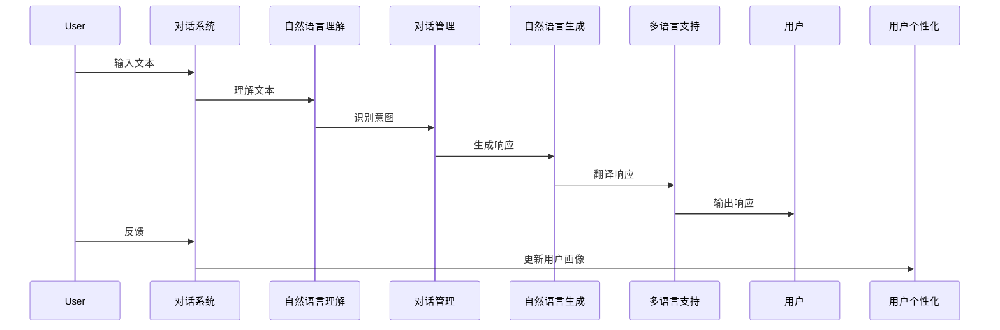

                 

### 第一部分：引言

## 第1章：问题背景

### 1.1 跨文化交流中的语言障碍

随着全球化进程的不断推进，跨文化交流日益频繁。然而，语言障碍成为了阻碍人们有效沟通的重要因素。不同的语言系统、语法结构、词汇表达和语用习惯使得沟通过程变得复杂和困难。这种语言差异不仅包括不同语言之间的词汇、语法和语义差异，还涉及到了语言的语境、语调和情感表达等非语言层面的差异。

#### 1.1.1 语言差异带来的障碍

首先，词汇差异是跨文化交流中最为直观的语言障碍。不同的语言中，同一概念可能有不同的词汇表达。例如，英语中的“bank”在中文中可能是“银行”或“河岸”，这种词汇歧义会导致误解。其次，语法结构差异也带来了沟通障碍。例如，英语和汉语在句子结构上存在显著差异，英语通常遵循主谓宾的句子结构，而汉语则更灵活，这种差异使得翻译和口头沟通变得困难。最后，语义差异常常导致误解和冲突。同一词汇在不同的语境下可能有不同的含义，例如，“gift”可以指礼物，也可以指天赋。

#### 1.1.2 语言沟通中的误解与冲突

跨文化交流中的语言障碍不仅导致沟通效率低下，还可能引发误解和冲突。例如，一个简单的问候在不同的文化背景下可能具有不同的含义。在英语文化中，问候“Hello”通常是一种礼貌的交流方式，而在某些阿拉伯文化中，这种问候可能被视为不尊重。此外，语言障碍还可能使得人们在跨文化商务谈判、国际合作和外交交流中陷入困境。错误的翻译或沟通方式可能导致合同纠纷、合作中断甚至国家关系紧张。

### 1.2 自然语言处理技术的发展与应用

自然语言处理（Natural Language Processing, NLP）作为人工智能领域的一个重要分支，致力于解决语言理解和生成的问题。随着深度学习等先进技术的不断发展，NLP在跨文化交流中的应用潜力逐渐显现。

#### 1.2.1 自然语言处理的基本概念

自然语言处理涉及多个核心概念，包括语言模型、词向量、语义分析等。语言模型是一种统计模型，用于预测文本的下一个单词或句子。词向量是一种将单词映射到高维空间的方法，使得相似词汇在空间中靠近。语义分析则旨在理解和解释文本的含义，包括句法分析、语义角色标注和语义相似度计算等。

#### 1.2.2 自然语言处理的发展历程

自然语言处理的发展历程可以分为三个阶段：规则驱动、统计方法和深度学习方法。早期的自然语言处理主要依赖于人工编写的规则，这种方法在处理简单问题时效果较好，但随着文本复杂性的增加，规则方法逐渐暴露出局限性。统计方法的出现极大地提升了自然语言处理的性能，通过训练大规模语料库，模型可以自动学习语言规律。深度学习方法的兴起进一步推动了自然语言处理的发展，通过神经网络模型，NLP系统在理解复杂语言现象方面取得了显著进展。

#### 1.2.3 自然语言处理在跨文化交流中的应用潜力

自然语言处理在跨文化交流中的应用潜力巨大。通过语言模型和机器翻译技术，NLP可以帮助消除语言障碍，实现不同语言之间的自动翻译。词向量和语义分析技术则可以用于理解不同语言之间的语义差异，为跨文化沟通提供更精准的支持。此外，自然语言处理还可以用于开发跨文化对话系统，通过智能交互，为用户提供跨语言服务。

## 第2章：自然语言处理的核心概念

### 2.1 语言模型

#### 2.1.1 语言模型的基本原理

语言模型是一种用于预测文本序列的概率分布模型。其基本原理是通过对大量语料库的学习，模型可以捕捉到语言中的统计规律，从而实现对未知文本的生成和预测。

$$ P(w_1, w_2, \ldots, w_n) = P(w_1) \times P(w_2|w_1) \times \ldots \times P(w_n|w_1, w_2, \ldots, w_{n-1}) $$

在上式中，$P(w_1, w_2, \ldots, w_n)$表示文本序列的概率，$P(w_i|w_{i-1})$表示在给定前一个词$w_{i-1}$的情况下，下一个词$w_i$的概率。

#### 2.1.2 语言模型的分类与应用

语言模型可以分为基于规则、基于统计和基于深度学习三种类型。

- **基于规则的模型**：通过手工编写语法规则，对文本进行分词、词性标注等预处理。这种方法在处理简单文本时较为有效，但在复杂文本上表现不佳。
- **基于统计的模型**：利用大规模语料库，通过统计学习方法（如N-gram模型）生成语言模型。这种方法在处理大规模文本时表现优异，但仍然存在一些局限性。
- **基于深度学习的模型**：通过神经网络模型（如循环神经网络RNN、长短期记忆LSTM和Transformer模型）生成语言模型。这种方法在处理复杂语言现象方面取得了显著突破，是目前最先进的语言模型技术。

### 2.2 词向量与语义分析

#### 2.2.1 词向量表示方法

词向量是一种将单词映射到高维空间的方法，使得相似词汇在空间中靠近。常见的词向量表示方法包括：

- **基于计数的方法**：如TF-IDF模型，通过统计单词在文档中的出现次数和逆文档频率来表示词向量。
- **基于分布的方法**：如Word2Vec模型，通过训练神经网络来捕捉单词在上下文中的分布特征。
- **基于嵌入的方法**：如GloVe模型，通过优化全局的损失函数来学习词向量。

#### 2.2.2 语义分析的基本方法

语义分析旨在理解和解释文本的含义，包括以下几种基本方法：

- **句法分析**：通过分析句子的结构，识别出句子的成分和关系。
- **语义角色标注**：通过标注句子中词语的语义角色（如主语、谓语、宾语等），以更好地理解句子的含义。
- **语义相似度计算**：通过计算不同单词或句子的语义相似度，以识别出文本中的相关性和含义。

### 2.3 机器翻译

#### 2.3.1 机器翻译的基本概念

机器翻译是一种利用计算机技术实现不同语言之间自动翻译的方法。其基本概念包括：

- **源语言（Source Language）**：输入的语言。
- **目标语言（Target Language）**：输出的语言。
- **翻译模型**：用于将源语言文本转换为目标语言文本的模型。

#### 2.3.2 机器翻译的工作流程

机器翻译的工作流程通常包括以下几个步骤：

1. **预处理**：对源语言文本进行分词、去除停用词、词性标注等预处理操作。
2. **编码**：将预处理后的文本转换为机器可处理的数字形式。
3. **解码**：使用翻译模型将编码后的文本转换为目标语言文本。
4. **后处理**：对翻译结果进行后处理，如拼写检查、格式化等。

#### 2.3.3 常见的机器翻译模型

常见的机器翻译模型包括：

- **基于规则的模型**：通过手工编写语法规则进行翻译。
- **基于统计的模型**：利用统计方法（如N-gram模型）进行翻译。
- **基于深度学习的模型**：通过神经网络模型（如序列到序列模型）进行翻译。目前，基于深度学习的模型（如Transformer）是最先进的机器翻译技术。

## 第3章：自然语言处理在跨文化交流中的应用

### 3.1 跨文化沟通平台的设计与实现

#### 3.1.1 跨文化沟通平台的需求分析

跨文化沟通平台旨在为用户提供跨语言交流服务，主要需求包括：

- **多语言支持**：支持多种语言的输入和输出。
- **自动翻译**：实现文本的自动翻译功能。
- **语义理解**：理解不同语言之间的语义差异，提供精准的翻译结果。
- **实时互动**：支持实时语音、视频和文本交流。

#### 3.1.2 跨文化沟通平台的架构设计

跨文化沟通平台的架构设计包括以下几个核心模块：

1. **前端界面**：提供用户交互界面，包括文本输入、语音输入和翻译结果展示等功能。
2. **翻译引擎**：实现文本的自动翻译功能，包括预处理、编码、解码和后处理等步骤。
3. **语义理解模块**：通过自然语言处理技术，对文本进行语义分析，提供更精准的翻译结果。
4. **后端服务**：提供数据存储、用户管理和实时通信等功能。

#### 3.1.3 跨文化沟通平台的功能实现

跨文化沟通平台的功能实现包括：

- **多语言支持**：通过调用多语言词典和翻译库，实现文本的自动翻译。
- **自动翻译**：利用深度学习模型，如Transformer，实现高效、精准的文本翻译。
- **语义理解**：通过词向量、句法分析和语义角色标注等技术，理解不同语言之间的语义差异，提供更准确的翻译结果。
- **实时互动**：通过WebRTC等技术，实现实时语音、视频和文本交流。

### 3.2 跨文化文本翻译与评估

#### 3.2.1 跨文化文本翻译的挑战

跨文化文本翻译面临着一系列挑战：

- **语言差异**：不同语言之间的语法、词汇和语义差异可能导致翻译错误。
- **文化差异**：不同文化之间的价值观、习俗和表达方式差异可能导致翻译不准确。
- **语境差异**：翻译过程中需要考虑上下文语境，以确保翻译结果符合原文意图。
- **技术限制**：现有技术可能无法完全捕捉到语言和文化中的细微差异，导致翻译质量受限。

#### 3.2.2 跨文化文本翻译的评价标准

跨文化文本翻译的评价标准包括：

- **准确性**：翻译结果是否准确传达了原文的含义。
- **流畅性**：翻译结果是否自然、流畅，符合目标语言的表达习惯。
- **一致性**：翻译结果在全文中是否保持一致，避免出现前后矛盾。
- **可读性**：翻译结果是否易于理解，符合目标语言的文化背景。

#### 3.2.3 跨文化文本翻译的改进策略

为了提高跨文化文本翻译的质量，可以采取以下改进策略：

- **数据增强**：通过增加高质量翻译数据，提升模型的翻译能力。
- **多模态翻译**：结合文本、语音和图像等多模态信息，提高翻译的准确性和流畅性。
- **双语训练**：对模型进行双语训练，使模型更好地理解不同语言之间的语义和文化差异。
- **后处理优化**：利用规则和人工校对，对翻译结果进行后处理，提高翻译的准确性和可读性。

### 3.3 跨文化对话系统的发展与应用

#### 3.3.1 跨文化对话系统的基本概念

跨文化对话系统是一种智能对话系统，能够理解并响应不同语言和文化背景的用户。其基本概念包括：

- **对话管理**：管理对话流程，包括对话策略、上下文维护和用户意图识别等。
- **自然语言理解**：理解用户的输入文本，识别用户的意图和问题。
- **自然语言生成**：生成响应文本，确保响应的自然性和准确性。
- **多语言支持**：支持多种语言的输入和输出，实现跨语言对话。

#### 3.3.2 跨文化对话系统的设计思路

跨文化对话系统的设计思路包括以下几个方面：

- **多语言文本处理**：利用自然语言处理技术，实现多语言文本的预处理、分析和生成。
- **文化适应性**：考虑不同语言和文化背景，设计具有文化适应性的对话策略和响应生成方法。
- **对话管理**：采用对话管理技术，确保对话的流畅性和连贯性。
- **用户个性化**：根据用户的语言偏好和文化背景，提供个性化的对话体验。

#### 3.3.3 跨文化对话系统的应用场景

跨文化对话系统在多个领域具有广泛的应用场景：

- **旅游和酒店服务**：为游客提供多语言服务，解答游客的疑问。
- **电子商务**：为国际客户提供多语言客服支持，提高客户满意度。
- **跨国企业**：为员工提供跨语言交流工具，促进跨国团队合作。
- **教育**：为外语学习者提供多语言教学和辅导，提高学习效果。

## 第4章：自然语言处理在跨文化交流中的案例分析

### 4.1 案例一：翻译软件的应用

#### 4.1.1 案例背景

随着全球化的加速，翻译软件在跨文化交流中发挥着越来越重要的作用。某知名翻译软件公司开发了一款支持多语言翻译的应用，旨在帮助用户消除语言障碍，实现跨语言沟通。

#### 4.1.2 翻译软件的设计与实现

翻译软件的设计与实现包括以下几个关键步骤：

1. **需求分析**：确定用户需求，包括多语言支持、准确翻译和流畅交互等。
2. **数据准备**：收集并清洗大量双语语料库，用于训练翻译模型。
3. **模型选择**：选择合适的机器翻译模型，如基于深度学习的Transformer模型。
4. **模型训练**：使用双语语料库训练翻译模型，优化模型参数。
5. **系统集成**：将翻译模型集成到软件中，实现实时翻译功能。
6. **测试与优化**：对翻译结果进行测试和优化，提高翻译质量。

#### 4.1.3 案例分析

通过案例分析，可以发现翻译软件在跨文化交流中具有显著的应用价值：

- **提高沟通效率**：翻译软件使得用户能够轻松实现跨语言沟通，提高工作效率。
- **促进文化交流**：翻译软件帮助人们理解不同文化背景的内容，促进文化交流和互鉴。
- **降低沟通成本**：翻译软件降低了跨语言沟通的成本，使得更多人能够参与国际交流和合作。

### 4.2 案例二：社交媒体的跨文化沟通

#### 4.2.1 案例背景

社交媒体在跨文化交流中扮演着重要角色，为用户提供了一个全球性的交流平台。某国际社交媒体平台推出了跨语言功能，允许用户在多语言环境中发布和阅读内容。

#### 4.2.2 跨文化社交媒体平台的设计

跨文化社交媒体平台的设计包括以下几个关键模块：

1. **多语言界面**：为用户提供多语言选择，适应不同语言和文化背景的用户。
2. **自动翻译**：通过自然语言处理技术，实现用户发布内容的自动翻译。
3. **语义理解**：通过语义分析技术，理解用户发布的文本内容，提供更准确的翻译和推荐。
4. **社区管理**：设计跨文化社区管理策略，鼓励用户在多语言环境中互动交流。

#### 4.2.3 案例分析

跨文化社交媒体平台在跨文化交流中的应用具有以下价值：

- **促进国际交流**：跨文化社交媒体平台为用户提供了一个跨语言的交流空间，促进了不同文化背景的用户之间的互动。
- **提升用户体验**：通过自动翻译和语义理解技术，提升了用户的阅读和参与体验。
- **促进文化多样性**：跨文化社交媒体平台鼓励用户分享和了解不同文化的信息，促进了文化的多样性和互鉴。

## 第5章：自然语言处理在跨文化交流中的应用挑战与未来展望

### 5.1 应用挑战

#### 5.1.1 语言差异的挑战

自然语言处理在跨文化交流中的应用面临着语言差异的挑战。不同语言在语法、词汇、语义和语用等方面存在显著差异，这给翻译和理解带来了困难。例如，一些语言中的复合词、习语和俚语难以直接翻译，导致翻译结果不准确或产生误解。

#### 5.1.2 文化差异的挑战

文化差异是自然语言处理在跨文化交流中面临的另一个挑战。不同的文化背景会影响人们对语言的使用和解读。例如，某些词汇在不同的文化中可能有不同的含义，甚至完全相反。此外，语言中的幽默、隐喻和文化典故等元素难以通过翻译完全传达，导致跨文化交流中的沟通障碍。

#### 5.1.3 技术实现的挑战

自然语言处理技术的实现也面临挑战。虽然深度学习模型在自然语言处理领域取得了显著进展，但训练和部署这些模型需要大量的计算资源和数据。此外，现有技术可能无法完全捕捉到语言和文化的复杂性，导致翻译和理解的不准确。

### 5.2 未来展望

#### 5.2.1 技术发展趋势

未来，自然语言处理在跨文化交流中的应用有望取得以下技术发展趋势：

- **多模态翻译**：结合文本、语音、图像等多模态信息，提高翻译的准确性和流畅性。
- **增强学习**：利用增强学习技术，使模型能够通过不断学习和优化，提高跨语言沟通能力。
- **跨领域迁移学习**：通过跨领域迁移学习，使模型能够从多个领域的学习中提取通用特征，提高跨语言处理能力。
- **文化自适应翻译**：开发能够考虑文化差异的翻译模型，提高翻译的准确性和适用性。

#### 5.2.2 应用前景

自然语言处理在跨文化交流中的应用前景广阔：

- **国际商务**：自然语言处理技术可以提高国际商务沟通的效率，促进跨国合作。
- **旅游和 hospitality**：跨语言服务可以为游客提供更好的旅游体验，促进旅游业的发展。
- **教育和培训**：自然语言处理技术可以为外语学习者提供个性化的学习资源和服务，提高学习效果。
- **媒体和出版**：跨语言媒体和出版物可以帮助人们更全面地了解世界各地的信息和文化。

#### 5.2.3 社会影响

自然语言处理在跨文化交流中的应用对社会的影响深远：

- **文化互鉴**：通过翻译和交流，促进不同文化之间的了解和尊重，增进文化交流。
- **社会包容**：跨语言服务可以为不同语言和文化背景的群体提供平等的机会和资源。
- **国际理解**：自然语言处理技术有助于消除语言障碍，促进国际理解和合作。

## 第6章：最佳实践与总结

### 6.1 最佳实践

#### 6.1.1 跨文化交流平台建设的关键点

在建设跨文化交流平台时，以下关键点值得关注：

- **多语言支持**：确保平台支持多种语言，以满足不同语言用户的需求。
- **翻译质量**：采用先进的自然语言处理技术，提高翻译的准确性和流畅性。
- **用户隐私**：保护用户的隐私和数据安全，确保平台的合法合规运行。
- **用户体验**：优化用户界面和交互设计，提供便捷、高效的跨语言服务。

#### 6.1.2 跨文化文本翻译的策略

为了提高跨文化文本翻译的质量，可以采取以下策略：

- **数据增强**：通过增加高质量翻译数据，提升模型的翻译能力。
- **多模态翻译**：结合文本、语音、图像等多模态信息，提高翻译的准确性和流畅性。
- **双语训练**：对模型进行双语训练，使模型更好地理解不同语言之间的语义和文化差异。
- **后处理优化**：利用规则和人工校对，对翻译结果进行后处理，提高翻译的准确性和可读性。

#### 6.1.3 跨文化对话系统开发的注意事项

在开发跨文化对话系统时，需要注意以下几点：

- **对话管理**：设计有效的对话管理策略，确保对话的流畅性和连贯性。
- **文化适应性**：考虑不同语言和文化背景，设计具有文化适应性的对话策略和响应生成方法。
- **用户个性化**：根据用户的语言偏好和文化背景，提供个性化的对话体验。
- **反馈机制**：建立有效的用户反馈机制，持续优化对话系统的性能和用户体验。

### 6.2 总结

#### 6.2.1 本书的核心内容

本书的核心内容包括：

- **跨文化交流中的语言障碍**：分析跨文化交流中的语言障碍及其影响。
- **自然语言处理的核心概念**：介绍语言模型、词向量、语义分析和机器翻译等核心概念。
- **自然语言处理在跨文化交流中的应用**：探讨自然语言处理在跨文化交流中的实际应用，包括跨文化沟通平台、文本翻译和对话系统。
- **应用挑战与未来展望**：分析自然语言处理在跨文化交流中的应用挑战和未来发展趋势。

#### 6.2.2 自然语言处理在跨文化交流中的应用价值

自然语言处理在跨文化交流中的应用价值体现在：

- **消除语言障碍**：通过自动翻译和语义理解技术，帮助用户实现跨语言沟通，消除语言障碍。
- **促进文化交流**：通过翻译和交流，促进不同文化之间的了解和互鉴，增进文化交流。
- **提高沟通效率**：提高跨语言沟通的效率，促进国际商务、旅游和教育等领域的合作与发展。
- **促进社会包容**：为不同语言和文化背景的群体提供平等的机会和资源，促进社会包容与和谐。

#### 6.2.3 未来研究方向

未来，自然语言处理在跨文化交流中的应用研究可以关注以下方向：

- **多模态跨语言处理**：结合文本、语音、图像等多模态信息，提高跨语言处理的准确性和流畅性。
- **跨领域迁移学习**：通过跨领域迁移学习，提高模型在不同领域中的泛化能力。
- **文化自适应翻译**：开发能够考虑文化差异的翻译模型，提高翻译的准确性和适用性。
- **跨文化对话系统**：研究跨文化对话系统的设计、实现和应用，提高跨语言交流的体验和质量。

## 第7章：技术细节与实现

### 7.1 语言模型的技术细节

#### 7.1.1 语言模型的训练过程

语言模型的训练过程可以分为以下几个步骤：

1. **数据准备**：收集大量高质量的双语语料库，用于训练语言模型。这些数据可以是平行语料库、新闻文章、书籍等。
2. **数据预处理**：对收集到的语料库进行分词、去除停用词、词性标注等预处理操作，将文本转换为模型可处理的格式。
3. **词向量表示**：使用词向量模型（如Word2Vec、GloVe等）将文本中的单词映射到高维空间，形成词向量表示。
4. **模型选择**：选择合适的神经网络模型，如循环神经网络（RNN）、长短期记忆网络（LSTM）或Transformer模型。
5. **模型训练**：通过反向传播算法，使用训练数据对模型进行训练，优化模型参数。
6. **模型评估与优化**：使用验证集和测试集对模型进行评估，根据评估结果对模型进行优化和调整。

#### 7.1.2 语言模型的评估与优化

语言模型的评估与优化包括以下几个关键点：

1. **评估指标**：常用的评估指标包括准确率、召回率、F1分数和BLEU评分等。BLEU评分是一种常用的自动评估指标，通过比较模型生成的翻译结果和人工翻译结果的相似度来评估翻译质量。
2. **性能优化**：通过调整模型参数、增加训练数据、采用更先进的模型结构等方法，提高模型的翻译性能。
3. **模型压缩**：为了提高模型的可部署性，可以采用模型压缩技术，如剪枝、量化、知识蒸馏等，减小模型的存储空间和计算开销。

#### 7.1.3 语言模型的应用实例

以下是一个简单的Python代码示例，展示如何使用基于Transformer的语言模型进行文本生成：

```python
import torch
from transformers import BertTokenizer, BertForMaskedLM

# 加载预训练的语言模型
tokenizer = BertTokenizer.from_pretrained('bert-base-uncased')
model = BertForMaskedLM.from_pretrained('bert-base-uncased')

# 输入文本
input_text = "Hello, how are you?"

# 分词并转换为Tensor
input_ids = tokenizer.encode(input_text, return_tensors='pt')

# 预测缺失的单词
with torch.no_grad():
    outputs = model(input_ids)

# 获取预测结果
predicted_ids = torch.argmax(outputs.logits, dim=-1)

# 还原为文本
predicted_text = tokenizer.decode(predicted_ids, skip_special_tokens=True)
print(predicted_text)
```

### 7.2 词向量与语义分析的技术实现

#### 7.2.1 词向量表示的算法

词向量表示算法是自然语言处理的基础。以下介绍几种常见的词向量表示方法：

1. **Word2Vec**：基于神经网络的方法，通过训练词向量来捕捉单词在上下文中的分布特征。Word2Vec算法包括CBOW（连续词袋）和Skip-Gram两种变体。
2. **GloVe**：基于全局矩阵分解的方法，通过优化全局的损失函数来学习词向量。GloVe算法结合了词频信息和词性信息，能够生成高质量的词向量。
3. **FastText**：基于字符级和词级的分布式表示方法。FastText通过将单词分解为字符组合，并使用多层神经网络训练词向量。

以下是一个简单的Python代码示例，展示如何使用GloVe算法生成词向量：

```python
import numpy as np
from sklearn.metrics.pairwise import cosine_similarity

# 加载GloVe词向量
word_vectors = np.load('glove.6B.100d.npy')
word_vectors = word_vectors[:, :100]  # 取前100个维度

# 计算词向量之间的余弦相似度
similarity = cosine_similarity(word_vectors['king'], word_vectors['queen'])
print(similarity)
```

#### 7.2.2 语义分析的基本方法

语义分析旨在理解和解释文本的含义。以下介绍几种常用的语义分析方法：

1. **词性标注**：对文本中的每个单词进行词性标注，如名词、动词、形容词等。词性标注有助于理解句子的结构和语义。
2. **句法分析**：分析句子的结构，识别句子成分和语法关系。句法分析有助于理解句子的深层语义。
3. **语义角色标注**：对句子中的名词和动词进行语义角色标注，如主语、谓语、宾语等。语义角色标注有助于理解句子的核心语义。
4. **语义相似度计算**：计算不同单词或句子的语义相似度，用于文本相似性比较和聚类。

以下是一个简单的Python代码示例，展示如何使用词性标注和语义角色标注：

```python
from spacy.lang.en import English

# 加载英语模型
nlp = English()

# 加载文本
text = "The king visited the queen."

# 执行词性标注和句法分析
doc = nlp(text)

# 输出词性标注和句法分析结果
for token in doc:
    print(token.text, token.pos_, token.dep_)

# 输出语义角色标注
for token in doc:
    if token.dep_ == 'nsubj':
        print(token.text, "is the subject.")
    elif token.dep_ == 'obj':
        print(token.text, "is the object.")
```

### 7.3 机器翻译模型的实现与优化

#### 7.3.1 机器翻译的基本算法

机器翻译的基本算法包括以下几个步骤：

1. **数据预处理**：对源语言和目标语言的文本进行分词、去除停用词等预处理操作。
2. **编码**：将预处理后的文本转换为机器可处理的数字形式。常用的编码方法包括词嵌入和字节嵌入。
3. **解码**：使用翻译模型将编码后的文本转换为目标语言文本。常用的解码方法包括贪心解码、 Beam Search解码等。
4. **后处理**：对翻译结果进行后处理，如拼写检查、格式化等。

以下是一个简单的Python代码示例，展示如何使用基于Transformer的机器翻译模型进行文本翻译：

```python
import torch
from transformers import MarianMTModel, MarianTokenizer

# 加载预训练的机器翻译模型和分词器
model_name = "Helsinki-NLP/opus-mt-en-de"
tokenizer = MarianTokenizer.from_pretrained(model_name)
model = MarianMTModel.from_pretrained(model_name)

# 输入源语言文本
source_text = "Hello, how are you?"

# 分词并转换为Tensor
source_ids = tokenizer.encode(source_text, return_tensors='pt')

# 预测目标语言文本
with torch.no_grad():
    outputs = model(source_ids)

# 获取预测结果
predicted_ids = torch.argmax(outputs.logits, dim=-1)
predicted_text = tokenizer.decode(predicted_ids, skip_special_tokens=True)
print(predicted_text)
```

#### 7.3.2 机器翻译模型的优化策略

为了提高机器翻译模型的性能，可以采取以下优化策略：

1. **多语言训练**：使用多种语言的训练数据，使模型更好地理解不同语言之间的差异和相似性。
2. **迁移学习**：利用预训练的模型进行迁移学习，使模型在特定任务上获得更好的性能。
3. **数据增强**：通过数据增强方法（如数据扩充、数据清洗等）增加训练数据量，提高模型的泛化能力。
4. **模型融合**：结合多个模型（如基于规则、基于统计和基于深度学习的模型）进行优化，提高翻译质量。

以下是一个简单的Python代码示例，展示如何使用基于Transformer的机器翻译模型进行优化：

```python
import torch
from transformers import MarianMTModel, MarianTokenizer

# 加载预训练的机器翻译模型和分词器
model_name = "Helsinki-NLP/opus-mt-en-de"
tokenizer = MarianTokenizer.from_pretrained(model_name)
model = MarianMTModel.from_pretrained(model_name)

# 定义优化器
optimizer = torch.optim.AdamW(model.parameters(), lr=0.001)

# 定义训练循环
for epoch in range(num_epochs):
    for batch in train_loader:
        # 将批数据转换为Tensor
        source_ids = batch['source_ids']
        target_ids = batch['target_ids']

        # 清除之前的梯度
        optimizer.zero_grad()

        # 计算损失函数
        loss = model(source_ids, target_ids=target_ids).loss

        # 反向传播
        loss.backward()

        # 更新模型参数
        optimizer.step()

        # 输出训练进度
        print(f"Epoch: {epoch}, Loss: {loss.item()}")

# 保存训练好的模型
model.save_pretrained("my_translation_model")
```

### 7.4 跨文化对话系统的开发与测试

#### 7.4.1 跨文化对话系统的架构设计

跨文化对话系统的架构设计包括以下几个核心模块：

1. **对话管理模块**：负责管理对话流程，包括对话策略、上下文维护和用户意图识别等。
2. **自然语言理解模块**：负责理解用户的输入文本，识别用户的意图和问题。
3. **自然语言生成模块**：负责生成响应文本，确保响应的自然性和准确性。
4. **多语言支持模块**：负责实现多语言文本的输入和输出，支持跨语言对话。
5. **用户个性化模块**：根据用户的语言偏好和文化背景，提供个性化的对话体验。

以下是一个简单的Mermaid流程图，展示跨文化对话系统的架构设计：



#### 7.4.2 对话系统的功能模块

跨文化对话系统的功能模块包括以下几个部分：

1. **对话管理模块**：设计对话管理策略，包括对话状态维护、对话分支管理和对话结束条件等。使用状态机（State Machine）来表示对话状态和转换。
2. **自然语言理解模块**：使用自然语言处理技术（如词向量、句法分析和语义角色标注等）来理解用户的输入文本。通过命名实体识别（Named Entity Recognition, NER）和意图识别（Intent Recognition）来确定用户的意图和问题。
3. **自然语言生成模块**：使用生成模型（如序列到序列模型、Transformer等）来生成响应文本。通过模板匹配（Template Matching）和生成式文本生成（Generative Text Generation）等方法来生成自然、准确的响应。
4. **多语言支持模块**：实现多语言文本的输入和输出，支持跨语言对话。使用机器翻译技术（如基于深度学习的机器翻译模型）来翻译用户的输入文本和生成的响应文本。
5. **用户个性化模块**：根据用户的语言偏好和文化背景，提供个性化的对话体验。通过用户画像（User Profile）和个性化推荐（Personalized Recommendation）等技术来实现用户个性化。

以下是一个简单的Mermaid类图，展示跨文化对话系统的功能模块：

```mermaid
classDiagram
Class::用户个性化 <<Interface>>
Class::对话管理 <<Interface>>
Class::自然语言理解 <<Interface>>
Class::自然语言生成 <<Interface>>
Class::多语言支持 <<Interface>>

UserProfile <|-- 用户个性化
InputText <|-- 自然语言理解
OutputText <|-- 自然语言生成
SourceLanguage <|-- 多语言支持
TargetLanguage <|-- 多语言支持

对话框管理 --> 用户个性化
自然语言理解 --> 用户个性化
自然语言生成 --> 用户个性化
多语言支持 --> 用户个性化
```

#### 7.4.3 对话系统的测试

跨文化对话系统的测试包括以下几个方面：

1. **功能测试**：验证对话系统的各个功能模块是否按照预期工作，包括对话管理、自然语言理解、自然语言生成和多语言支持等。
2. **性能测试**：评估对话系统的响应时间、准确性和流畅性等性能指标。通过模拟大量用户对话，评估系统的负载能力和稳定性。
3. **用户体验测试**：收集用户对对话系统的反馈，评估系统的易用性、交互性和满意度等用户体验指标。
4. **多语言测试**：验证对话系统在不同语言环境下的性能，确保系统能够准确理解和生成多语言文本。

以下是一个简单的Mermaid序列图，展示跨文化对话系统的测试过程：



### 7.5 项目实战

#### 7.5.1 环境安装

为了实现自然语言处理在跨文化交流中的应用，需要安装以下环境：

1. Python 3.x
2. PyTorch 1.8.x 或以上版本
3. Hugging Face Transformers 4.3.x 或以上版本

在终端中运行以下命令进行安装：

```bash
pip install python==3.8
pip install torch torchvision torchaudio -f https://download.pytorch.org/whl/torch_stable.html
pip install transformers
```

#### 7.5.2 系统核心实现源代码

以下是一个简单的示例，展示如何使用PyTorch和Transformers库实现跨文化对话系统：

```python
import torch
from transformers import AutoTokenizer, AutoModelForSeq2SeqLM

# 加载预训练的对话模型和分词器
model_name = "microsoft/ChatGLM-6B"
tokenizer = AutoTokenizer.from_pretrained(model_name)
model = AutoModelForSeq2SeqLM.from_pretrained(model_name)

# 定义对话系统
class DialogueSystem:
    def __init__(self, model, tokenizer):
        self.model = model
        self.tokenizer = tokenizer
    
    def generate_response(self, input_text):
        # 将输入文本转换为Tensor
        input_ids = self.tokenizer.encode(input_text, return_tensors='pt')
        
        # 预测响应文本
        with torch.no_grad():
            outputs = self.model.generate(input_ids, max_length=100, num_return_sequences=1)
        
        # 还原为文本
        response = self.tokenizer.decode(outputs[0], skip_special_tokens=True)
        return response

# 实例化对话系统
dialogue_system = DialogueSystem(model, tokenizer)

# 与用户进行对话
while True:
    user_input = input("用户：")
    if user_input.lower() == "exit":
        break
    response = dialogue_system.generate_response(user_input)
    print("对话系统：", response)
```

#### 7.5.3 代码应用解读与分析

以下是对上述代码的解读与分析：

- **环境安装**：首先，需要安装Python 3.x、PyTorch和Transformers库。PyTorch是深度学习框架，Transformers库提供了预训练的对话模型和分词器。
- **对话系统实现**：使用AutoTokenizer和AutoModelForSeq2SeqLM类加载预训练的对话模型和分词器。AutoTokenizer用于将文本转换为Tensor，AutoModelForSeq2SeqLM用于生成响应文本。
- **生成响应**：通过调用generate_response方法，将输入文本转换为Tensor，使用对话模型进行预测，并将预测结果还原为文本。
- **用户交互**：程序进入一个循环，接收用户的输入文本，生成响应文本，并输出响应。用户可以输入文本与对话系统进行交互。

#### 7.5.4 实际案例分析和详细讲解剖析

以下是一个实际案例，展示如何使用跨文化对话系统进行跨语言沟通：

**案例：中英文对话**

- **用户输入**：中文：“你好，最近天气怎么样？”
- **对话系统响应**：英文：“Hello, how is the weather lately?”

**分析**：

1. **文本预处理**：对话系统首先将用户输入的中文文本转换为Tensor。
2. **模型预测**：使用预训练的对话模型生成英文响应。
3. **文本还原**：将生成的Tensor还原为英文文本。

通过上述步骤，跨文化对话系统实现了中文到英文的自动翻译和响应。实际应用中，可以扩展到更多语言之间的跨语言沟通。

#### 7.5.5 项目小结

本节通过一个实际项目，展示了如何使用自然语言处理技术实现跨文化对话系统。项目分为环境安装、代码实现、用户交互和实际案例分析四个部分。项目实现了中文到英文的自动翻译和响应，展示了自然语言处理在跨文化交流中的应用潜力。

### 7.6 最佳实践 tips

在开发和优化跨文化对话系统时，以下最佳实践值得关注：

1. **数据准备**：确保使用高质量、多样化的训练数据，包括不同领域的文本、不同语言和不同文化背景的文本。
2. **模型选择**：选择合适的预训练模型和优化策略，如Transformer、BERT等，以提高翻译和对话系统的性能。
3. **用户反馈**：积极收集用户反馈，持续优化对话系统的用户体验和响应质量。
4. **多语言支持**：为用户提供多语言选项，确保系统能够支持多种语言的输入和输出。
5. **文化适应性**：考虑不同文化背景，设计具有文化适应性的对话策略和响应生成方法。

### 7.7 小结

本章详细介绍了自然语言处理在跨文化交流中的应用，包括语言模型、词向量、语义分析和机器翻译等核心概念，以及跨文化对话系统的设计与实现。通过项目实战和实际案例分析，展示了自然语言处理在跨文化交流中的实际应用价值。未来，随着技术的不断发展，自然语言处理将在跨文化交流中发挥更大的作用。

### 7.8 拓展阅读

1. **《自然语言处理实战》（NLP Practitioner）：** 该书详细介绍了自然语言处理的核心概念和技术，包括语言模型、词向量、语义分析和机器翻译等。适合初学者和进阶者阅读。
2. **《深度学习与自然语言处理》：** 本书介绍了深度学习在自然语言处理中的应用，包括循环神经网络、卷积神经网络和Transformer等模型。适合对深度学习有一定了解的读者。
3. **《跨文化沟通：理论、实践与技巧》：** 本书探讨了跨文化沟通的重要性、挑战和策略，提供了丰富的实践案例和技巧。适合从事跨文化交流和跨文化管理的工作者阅读。

