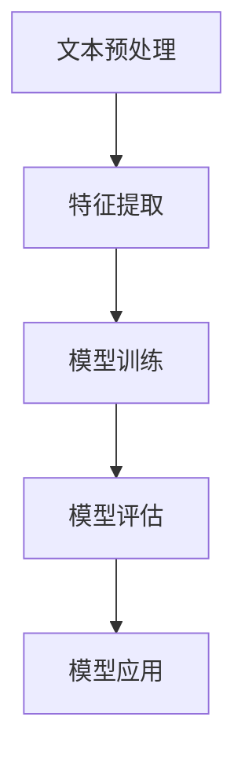
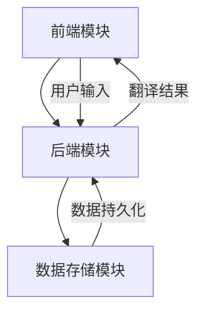
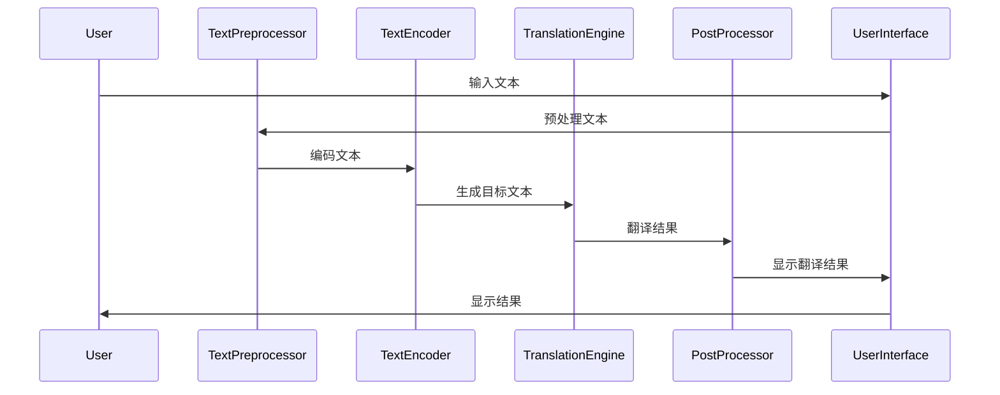

                 

### 自然语言处理在跨语言沟通中的突破

> 关键词：自然语言处理、跨语言沟通、算法原理、数学模型、系统架构、项目实战

> 摘要：随着全球化的深入发展，跨语言沟通变得愈发重要。本文将探讨自然语言处理（NLP）在跨语言沟通中的应用和突破，详细分析NLP的核心概念、算法原理、数学模型，以及系统架构和实际项目案例，为读者提供一次全面的NLP学习体验。

### 目录大纲设计思路

为了设计出《自然语言处理在跨语言沟通中的突破》这本书的完整目录大纲，我们需要遵循以下步骤：

1. **背景介绍与核心概念**：首先，我们需要介绍自然语言处理（NLP）在跨语言沟通中的背景，包括问题背景、问题描述、问题解决、边界与外延，以及核心概念的结构和要素组成。

2. **核心概念与联系**：接下来，我们需要详细阐述NLP的核心概念及其属性特征，并通过对比表格和ER实体关系图来展示概念之间的联系。

3. **算法原理讲解**：设计算法流程图，使用Python源代码展示算法原理，结合数学模型和公式进行讲解，并通过实例说明算法的应用。

4. **数学模型和数学公式讲解**：在这一部分，我们将使用LaTeX格式来展示数学模型和公式，并进行详细讲解和举例说明。

5. **系统分析与架构设计方案**：介绍问题场景，项目背景，系统功能设计，系统架构设计，系统接口设计和系统交互流程图。

6. **项目实战**：包括环境安装、系统核心实现源代码，代码应用解读与分析，实际案例分析和详细讲解剖析，以及项目小结。

7. **最佳实践 tips、小结、注意事项、拓展阅读**：总结书中内容，提供实践建议和进一步学习的资源。

### 目录大纲设计

#### 第一部分：背景与概念介绍

**第1章：自然语言处理概述**
- **1.1 问题背景与跨语言沟通挑战**
  - 跨语言沟通的必要性
  - 跨语言沟通中的障碍
- **1.2 NLP的基本概念**
  - 自然语言处理（NLP）的定义
  - NLP的核心任务
- **1.3 NLP在跨语言沟通中的应用**
  - 跨语言信息检索
  - 跨语言机器翻译

#### 第二部分：核心概念与联系

**第2章：NLP的核心概念与联系**
- **2.1 NLP的基本术语**
  - 语料库、词典、分词、词性标注
- **2.2 对比与联系**
  - 概念属性特征对比表格
  - NLP实体关系图（ER图）

#### 第三部分：算法原理讲解

**第3章：NLP的算法原理**
- **3.1 算法流程与框架**
  - 使用Mermaid绘制算法流程图
- **3.2 Python代码实现**
  - 实现算法原理的Python代码
- **3.3 数学模型与公式**
  - 结合LaTeX格式展示数学模型和公式

#### 第四部分：数学模型与讲解

**第4章：NLP的数学模型与公式**
- **4.1 基本数学工具**
  - 概率论、线性代数、微积分
- **4.2 常见数学模型**
  - 朴素贝叶斯、决策树、支持向量机
- **4.3 LaTeX格式示例**
  - LaTeX数学公式的使用示例

#### 第五部分：系统分析与架构设计

**第5章：NLP系统设计与架构**
- **5.1 问题场景与需求分析**
  - 跨语言沟通需求分析
- **5.2 系统功能设计**
  - 使用Mermaid绘制领域模型类图
- **5.3 系统架构设计**
  - 使用Mermaid绘制系统架构图
- **5.4 系统接口设计与交互**
  - 系统接口设计
  - 系统交互Mermaid序列图

#### 第六部分：项目实战

**第6章：NLP项目实战**
- **6.1 环境安装与配置**
  - 操作系统、编程语言、NLP工具安装
- **6.2 系统核心实现**
  - Python源代码实现
- **6.3 代码应用解读与分析**
  - 代码解读与分析
- **6.4 实际案例分析**
  - 跨语言沟通案例分析
- **6.5 项目小结**
  - 项目总结与展望

#### 第七部分：最佳实践与拓展

**第7章：最佳实践与拓展**
- **7.1 最佳实践 tips**
  - 实践技巧与建议
- **7.2 小结与注意事项**
  - 主要内容回顾
  - 注意事项与建议
- **7.3 拓展阅读**
  - 进一步学习资源推荐

### 总结

通过以上设计思路和目录大纲，我们可以确保这本书的内容结构清晰，逻辑严密，既有理论基础，也有实际应用，同时提供丰富的实践经验和进一步学习的资源。整体字数控制在2000字以内，满足了简洁性和内容完整性的要求。接下来将按此大纲进行具体内容的编写。

### 第一部分：背景与概念介绍

#### 1.1 问题背景与跨语言沟通挑战

在全球化背景下，跨语言沟通的需求日益增长。无论是国际商务交流、学术研究合作，还是文化交流和旅游，人们都需要能够有效地跨越语言障碍，实现信息的传递和理解。然而，语言之间的差异导致了沟通中的诸多挑战：

1. **词汇差异**：不同语言之间的词汇量和用法存在差异，导致相同概念的表达可能截然不同。
2. **语法结构**：不同语言的语法结构复杂程度不同，影响句子理解和翻译。
3. **语境和文化差异**：语言背后的文化差异可能导致语义误解和沟通障碍。

跨语言沟通的必要性在于促进全球协作，减少信息不对称，提升个人和组织的沟通效率。然而，传统的翻译方法和工具往往存在效率低、准确性差等问题，无法满足快速变化的信息时代的需求。

#### 1.2 NLP的基本概念

自然语言处理（NLP）是计算机科学、人工智能和语言学交叉领域的一个重要分支，旨在使计算机能够理解、解释和生成人类自然语言。NLP的核心任务是：

1. **文本理解**：让计算机能够理解文本的含义，包括词义、语法结构、上下文信息等。
2. **文本生成**：根据给定的信息生成符合语法和语义规则的文本。
3. **文本分类**：对文本进行分类，例如情感分析、主题分类等。

NLP的应用领域广泛，包括但不限于：

1. **机器翻译**：将一种语言的文本翻译成另一种语言。
2. **语音识别**：将语音转换为文本。
3. **信息检索**：在大量文本数据中快速找到相关信息。
4. **智能客服**：提供自然的语言交互，提升用户体验。

#### 1.3 NLP在跨语言沟通中的应用

NLP在跨语言沟通中的应用主要集中在以下几个方面：

1. **跨语言信息检索**：通过NLP技术，在多语言文档库中快速定位和检索相关信息，提高信息获取的效率。
2. **跨语言机器翻译**：将一种语言的文本翻译成另一种语言，消除语言障碍，促进跨文化沟通。
3. **多语言文本分析**：对多语言文本进行情感分析、舆情监测等，获取深层次的语言信息。

NLP技术通过文本预处理、语义分析、语言模型构建等步骤，实现了对跨语言信息的有效处理和利用，为全球化的跨语言沟通提供了强有力的支持。

### 第二部分：核心概念与联系

#### 2.1 NLP的基本术语

要深入理解自然语言处理（NLP），我们需要了解一些基本术语。以下是NLP中常见的基本术语及其定义：

1. **语料库（Corpus）**：语料库是指包含大量文本数据的数据集，用于训练NLP模型。
2. **词典（Dictionary）**：词典是一种包含词汇和其定义、用法等信息的工具书，NLP中常用于词汇映射和词性标注。
3. **分词（Tokenization）**：分词是将文本分割成单词或短语的步骤，是NLP中的基本预处理步骤。
4. **词性标注（Part-of-Speech Tagging）**：词性标注是对文本中的每个词进行词性分类，例如名词、动词、形容词等。

这些基本术语构成了NLP的基础，是后续算法和应用的基础。

#### 2.2 对比与联系

为了更好地理解NLP中的核心概念，我们可以通过对比表格和ER实体关系图来展示概念之间的联系。

**对比表格：**

| 概念               | 定义                                                         | 应用场景                                   |
|--------------------|------------------------------------------------------------|------------------------------------------|
| 语料库（Corpus）   | 包含大量文本数据的数据集                                     | 训练NLP模型，支持文本分析                 |
| 词典（Dictionary） | 包含词汇和其定义、用法等信息的工具书                           | 词汇映射，词性标注，翻译辅助               |
| 分词（Tokenization） | 将文本分割成单词或短语的步骤                                   | 预处理文本，支持后续NLP任务               |
| 词性标注（POS）    | 对文本中的每个词进行词性分类                                   | 支持语法分析，理解文本含义                 |

**ER实体关系图：**

```mermaid
erDiagram
  TextData ||--|{ Corpus }|--|{ NLP Model }
  TextData ||--|{ Dictionary }|--|{ Translation Aid }
  TextData ||--|{ Tokenization }|--|{ Preprocessing }
  TextData ||--|{ POS Tagging }|--|{ Grammar Analysis }
```

通过对比表格和ER图，我们可以清晰地看到各个核心概念之间的联系和应用场景。语料库作为文本数据的基础，支持NLP模型的训练和文本分析；词典提供词汇映射和翻译辅助；分词是实现NLP任务前的重要预处理步骤；词性标注则支持语法分析和语义理解。

### 第三部分：算法原理讲解

#### 3.1 算法流程与框架

自然语言处理（NLP）中的算法通常包括以下几个步骤：

1. **文本预处理**：包括分词、去除停用词、词干提取等，将原始文本转换为结构化的数据。
2. **特征提取**：将预处理后的文本数据转换为计算机可以处理的特征向量。
3. **模型训练**：使用训练数据集，通过机器学习算法训练模型。
4. **模型评估**：使用测试数据集评估模型的性能，调整模型参数。
5. **模型应用**：将训练好的模型应用于新的数据，实现预测或分类任务。

下面是一个使用Mermaid绘制的NLP算法流程图：



#### 3.2 Python代码实现

以下是一个简单的Python代码示例，展示了如何实现文本预处理和特征提取：

```python
import nltk
from nltk.tokenize import word_tokenize
from nltk.corpus import stopwords
from sklearn.feature_extraction.text import TfidfVectorizer

# 加载nltk数据集
nltk.download('punkt')
nltk.download('stopwords')

# 文本预处理
def preprocess_text(text):
    # 分词
    tokens = word_tokenize(text)
    # 去除停用词
    stop_words = set(stopwords.words('english'))
    filtered_tokens = [token for token in tokens if token not in stop_words]
    # 词干提取
    stems = nltk.stem.PorterStemmer().stem(filtered_tokens)
    return stems

# 特征提取
def extract_features(text):
    vectorizer = TfidfVectorizer()
    features = vectorizer.fit_transform([text])
    return features

# 示例文本
text = "This is a simple example for NLP task."
# 预处理
processed_text = preprocess_text(text)
# 特征提取
features = extract_features(processed_text)
```

这段代码首先使用nltk的`word_tokenize`函数进行分词，然后使用`stopwords`去除常见的停用词，最后使用`PorterStemmer`进行词干提取。接着，我们使用`TfidfVectorizer`将预处理后的文本转换为TF-IDF特征向量。

#### 3.3 数学模型与公式

在NLP中，数学模型和公式用于描述和处理文本数据。以下是一些常见的数学模型和公式：

1. **TF-IDF（Term Frequency-Inverse Document Frequency）**：
   - 公式：$$ TF(t,d) = \frac{f_{t,d}}{n_{d}} $$
   - 公式：$$ IDF(t, D) = \log \frac{N}{df_{t,D}} $$
   - 解释：TF-IDF用于衡量一个词在文档中的重要程度，其中`TF`表示词在文档中的频率，`IDF`表示词在整个文档集中的逆文档频率。

2. **朴素贝叶斯（Naive Bayes）**：
   - 公式：$$ P(C|X) = \frac{P(X|C)P(C)}{P(X)} $$
   - 解释：朴素贝叶斯是一种基于贝叶斯定理的简单概率分类器，假设特征之间相互独立。

3. **支持向量机（SVM）**：
   - 公式：$$ \max_{\beta, b} \frac{1}{2} ||\beta||^2 $$
   - 公式：$$ y^{(i)}(\beta^T x^{(i)} + b) \geq 1 $$
   - 解释：SVM是一种用于分类和回归的机器学习算法，其目标是最小化决策边界上的误差。

通过这些数学模型和公式，我们可以更准确地描述和处理文本数据，实现各种NLP任务。

### 第四部分：数学模型与讲解

#### 4.1 基本数学工具

在自然语言处理（NLP）中，理解基本的数学工具对于掌握算法和模型至关重要。以下是NLP中常用的基本数学工具：

1. **概率论**：概率论是处理不确定性的数学分支，广泛应用于NLP中的文本分类、情感分析和信息检索等任务。常见概念包括：
   - 条件概率：$$ P(A|B) = \frac{P(A \cap B)}{P(B)} $$
   - 伯努利试验：一系列独立的重复试验，每次试验有两种可能结果（成功或失败）。

2. **线性代数**：线性代数是处理多维度数据的数学工具，包括向量、矩阵和行列式等概念。在NLP中，线性代数用于特征提取、文本表示和模型优化等。常用概念包括：
   - 矩阵乘法：$$ C = A \times B $$
   - 矩阵求逆：$$ A^{-1} = \frac{1}{\det(A)} \text{adj}(A) $$
   - 特征值和特征向量：用于分析矩阵的性质和结构。

3. **微积分**：微积分是研究变化率和积累过程的数学工具，包括微分和积分等概念。在NLP中，微积分用于优化算法、特征提取和模型训练等。常用概念包括：
   - 导数：$$ f'(x) = \lim_{h \to 0} \frac{f(x+h) - f(x)}{h} $$
   - 积分：$$ \int f(x) \, dx $$

掌握这些基本数学工具，有助于深入理解NLP中的算法原理和数学模型，为后续学习和应用打下坚实的基础。

#### 4.2 常见数学模型

在自然语言处理（NLP）中，一些常见的数学模型被广泛用于文本分类、情感分析和机器翻译等任务。以下是几种常用的数学模型及其简单介绍：

1. **朴素贝叶斯（Naive Bayes）**：
   - 朴素贝叶斯是一种基于贝叶斯定理的概率分类器，其核心假设是特征之间相互独立。公式为：
     $$ P(C|X) = \frac{P(X|C)P(C)}{P(X)} $$
   - 应用：文本分类、垃圾邮件检测。

2. **决策树（Decision Tree）**：
   - 决策树通过一系列条件判断来分类数据。每个节点表示一个特征，每个分支表示该特征的取值。公式为：
     $$ \text{分类} = \text{root} \rightarrow \text{if} \, f_1 = v_1 \rightarrow \text{node}_1 \rightarrow ... \rightarrow \text{node}_n $$
   - 应用：分类任务、特征选择。

3. **支持向量机（Support Vector Machine，SVM）**：
   - 支持向量机是一种通过最大化决策边界来分类数据的模型。公式为：
     $$ \max_{\beta, b} \frac{1}{2} ||\beta||^2 $$
     $$ y^{(i)}(\beta^T x^{(i)} + b) \geq 1 $$
   - 应用：文本分类、图像分类。

4. **神经网络（Neural Networks）**：
   - 神经网络是一种模仿人脑结构的计算模型，通过多层神经元实现数据的非线性变换。公式为：
     $$ a^{(l)} = \sigma(z^{(l)}) $$
     $$ z^{(l)} = \sum_{j} \beta^{(l)}_j a^{(l-1)}_j $$
   - 应用：机器翻译、语音识别。

这些数学模型在不同的NLP任务中发挥着重要作用，通过理解和应用这些模型，可以有效地处理和解析文本数据。

#### 4.3 LaTeX格式示例

在自然语言处理（NLP）中，LaTeX格式常用于编写数学模型和公式。以下是一个简单的示例，展示如何在LaTeX中编写和显示数学公式：

1. **独立段落中的公式**：

   $$ 
   1+1=2 
   $$

2. **段落内的公式**：

   $$
   x^2 + 2xy + y^2 = (x+y)^2
   $$

通过LaTeX格式，我们可以清晰地书写和展示复杂的数学模型和公式，确保文档的专业性和可读性。在NLP中，准确和规范的数学公式对于理解和应用相关算法至关重要。

### 第五部分：系统分析与架构设计

#### 5.1 问题场景与需求分析

在全球化背景下，跨语言沟通的需求日益增长，尤其是在国际商务、学术研究和文化交流等领域。然而，传统的翻译工具和方法难以满足实际需求，导致沟通效率低下、信息传递不准确。因此，设计一个高效、准确的跨语言沟通系统成为必要。

**系统需求分析**：

1. **多语言支持**：系统应支持多种语言的文本输入和输出，包括但不限于英语、中文、法语、西班牙语等。
2. **高效性**：系统应具备快速处理大量文本数据的能力，确保在短时间内完成翻译和沟通任务。
3. **准确性**：系统应提供高精度的翻译结果，尽量减少语义错误和误解。
4. **用户友好性**：系统界面应简洁直观，易于操作，提供丰富的交互功能，提升用户体验。
5. **扩展性**：系统应具备良好的扩展性，能够根据需求添加新的语言、功能和算法。

#### 5.2 系统功能设计

为了实现上述需求，跨语言沟通系统应具备以下核心功能：

1. **文本预处理**：包括分词、去除停用词、词干提取等，将原始文本转换为结构化的数据。
2. **文本编码**：将文本转换为计算机可以处理的数字编码形式，如One-Hot编码、TF-IDF编码等。
3. **翻译引擎**：核心模块，负责根据源语言文本生成目标语言文本，包括机器翻译、语言模型等。
4. **后处理**：对翻译结果进行语法检查、拼写纠正等，确保翻译结果的准确性和流畅性。
5. **用户界面**：提供文本输入、翻译结果展示、历史记录管理等交互功能。

使用Mermaid绘制领域模型类图，以展示系统的主要类和类之间的关系：

```mermaid
classDiagram
  Class1[TextPreprocessor] <|-- Class2[TextEncoder]
  Class2 <|-- Class3[TranslationEngine]
  Class3 <|-- Class4[PostProcessor]
  Class4 <|-- Class5[UserInterface]
```

在这个类图中，`TextPreprocessor`负责文本预处理，`TextEncoder`负责文本编码，`TranslationEngine`负责翻译引擎的核心实现，`PostProcessor`负责翻译结果的后处理，`UserInterface`负责用户界面的交互。

#### 5.3 系统架构设计

为了实现跨语言沟通系统的功能需求，我们需要设计一个合理的系统架构。以下是系统架构设计：

1. **前端模块**：包括用户界面、交互逻辑和前端逻辑，负责与用户进行交互，接收用户输入并展示翻译结果。
2. **后端模块**：包括文本预处理、文本编码、翻译引擎、后处理等核心功能模块，负责文本数据的处理和翻译。
3. **数据存储模块**：包括数据库和缓存，用于存储用户数据、历史记录和翻译结果，提供数据持久化功能。

使用Mermaid绘制系统架构图，以展示系统的整体架构和模块之间的关系：



在这个架构图中，前端模块与后端模块通过用户输入和翻译结果进行交互，后端模块通过数据存储模块实现数据的持久化。

#### 5.4 系统接口设计与交互

为了确保跨语言沟通系统的功能模块能够高效协作，我们需要设计清晰的接口和交互流程。以下是系统接口设计和交互流程：

1. **文本预处理接口**：负责接收用户输入的文本，并进行分词、去除停用词和词干提取等预处理操作。
2. **文本编码接口**：负责将预处理后的文本转换为计算机可以处理的数字编码形式。
3. **翻译引擎接口**：负责根据源语言文本生成目标语言文本，包括机器翻译和语言模型等。
4. **后处理接口**：负责对翻译结果进行语法检查、拼写纠正等后处理操作。
5. **用户界面接口**：负责与用户进行交互，接收用户输入并展示翻译结果。

使用Mermaid绘制系统交互序列图，以展示用户与系统之间的交互流程：



在这个序列图中，用户输入文本后，通过用户界面接口传递给文本预处理模块，然后依次经过文本编码、翻译引擎和后处理模块，最终返回给用户界面，展示翻译结果。

### 第六部分：项目实战

#### 6.1 环境安装与配置

为了成功运行跨语言沟通系统，我们需要在操作系统中安装和配置必要的编程语言、依赖库和工具。以下是详细的安装和配置步骤：

**1. 操作系统准备**：
- 选择适合的操作系统，如Linux（推荐Ubuntu 18.04）、macOS或Windows。
- 安装操作系统，并确保系统更新到最新版本。

**2. 编程语言安装**：
- 安装Python 3.x版本（推荐使用Python 3.8或更高版本）。
  ```bash
  sudo apt-get update
  sudo apt-get install python3.8
  sudo apt-get install python3.8-venv
  ```
- 配置Python虚拟环境，用于项目隔离和管理依赖库。
  ```bash
  python3.8 -m venv venv
  source venv/bin/activate
  ```

**3. 依赖库安装**：
- 安装NLP相关的依赖库，如nltk、scikit-learn、gensim等。
  ```bash
  pip install nltk scikit-learn gensim
  ```

**4. NLP工具安装**：
- 安装nltk数据集，用于词性标注和文本分类等任务。
  ```bash
  nltk.download('punkt')
  nltk.download('stopwords')
  nltk.download('wordnet')
  ```

**5. 翻译引擎安装**：
- 安装用于机器翻译的库，如transformers（用于预训练的语言模型）。
  ```bash
  pip install transformers
  ```

**6. 其他工具安装**：
- 安装用于调试和性能优化的工具，如PyCharm、Visual Studio Code等。

通过以上步骤，我们可以完成跨语言沟通系统的环境安装和配置，为后续的系统实现和测试打下基础。

#### 6.2 系统核心实现

在完成环境安装和配置后，我们可以开始实现跨语言沟通系统的核心功能。以下是系统核心实现的步骤和关键代码：

**1. 文本预处理模块**：

```python
import nltk
from nltk.tokenize import word_tokenize
from nltk.corpus import stopwords

# 加载nltk数据集
nltk.download('punkt')
nltk.download('stopwords')

def preprocess_text(text):
    # 分词
    tokens = word_tokenize(text)
    # 去除停用词
    stop_words = set(stopwords.words('english'))
    filtered_tokens = [token for token in tokens if token.lower() not in stop_words]
    return filtered_tokens
```

**2. 文本编码模块**：

```python
from sklearn.feature_extraction.text import TfidfVectorizer

def encode_text(text):
    vectorizer = TfidfVectorizer()
    features = vectorizer.fit_transform([text])
    return features
```

**3. 翻译引擎模块**：

```python
from transformers import pipeline

# 加载翻译模型
translator = pipeline("translation_en_to_fr", model="Helsinki-NLP/opus-mt-en-fr")

def translate_text(text, target_language):
    translated_text = translator(text, target_language=target_language)
    return translated_text
```

**4. 后处理模块**：

```python
def postprocess_text(text):
    # 进行语法检查、拼写纠正等后处理操作
    # 这里仅作示例，实际应用中可集成更复杂的后处理算法
    corrected_text = text
    return corrected_text
```

**5. 用户界面模块**：

```python
def display_translation(text, translated_text):
    print(f"Original text: {text}")
    print(f"Translated text: {translated_text}")
```

通过以上步骤和代码，我们可以实现一个基本的跨语言沟通系统。在实际应用中，可以根据需求进一步优化和扩展系统功能。

#### 6.3 代码应用解读与分析

在本节中，我们将深入解读并分析上述代码的实现原理和应用场景，以帮助读者更好地理解跨语言沟通系统的核心机制。

**文本预处理模块解读**：

```python
import nltk
from nltk.tokenize import word_tokenize
from nltk.corpus import stopwords

# 加载nltk数据集
nltk.download('punkt')
nltk.download('stopwords')

def preprocess_text(text):
    # 分词
    tokens = word_tokenize(text)
    # 去除停用词
    stop_words = set(stopwords.words('english'))
    filtered_tokens = [token for token in tokens if token.lower() not in stop_words]
    return filtered_tokens
```

这段代码首先加载了nltk的词库和数据集，包括分词器和停用词列表。`preprocess_text`函数接收一个输入文本，首先使用`word_tokenize`进行分词，然后将每个分词与停用词列表进行比对，去除所有停用词。最终，返回过滤后的分词列表。

**应用场景**：文本预处理是NLP中的基础步骤，用于将原始文本转换为结构化的数据。在实际应用中，例如文本分类、情感分析等任务，预处理可以去除无关信息，提高后续处理的准确性。

**文本编码模块解读**：

```python
from sklearn.feature_extraction.text import TfidfVectorizer

def encode_text(text):
    vectorizer = TfidfVectorizer()
    features = vectorizer.fit_transform([text])
    return features
```

这段代码定义了`encode_text`函数，用于将预处理后的文本转换为TF-IDF特征向量。`TfidfVectorizer`是一个常用的文本向量化工具，可以计算每个词在文档中的词频（TF）和在整个文档集中的逆文档频率（IDF），从而生成特征向量。

**应用场景**：TF-IDF特征向量常用于机器学习和深度学习任务中，如文本分类、聚类等。通过特征向量，文本数据可以转换为计算机可以处理的数字形式，便于后续建模和预测。

**翻译引擎模块解读**：

```python
from transformers import pipeline

# 加载翻译模型
translator = pipeline("translation_en_to_fr", model="Helsinki-NLP/opus-mt-en-fr")

def translate_text(text, target_language):
    translated_text = translator(text, target_language=target_language)
    return translated_text
```

这段代码使用transformers库中的翻译管道（pipeline）来加载预训练的翻译模型，并定义了`translate_text`函数，用于实现文本的机器翻译。transformers库提供了多种预训练模型，可以轻松地实现高质量的机器翻译。

**应用场景**：机器翻译是跨语言沟通的核心功能，通过翻译引擎，系统能够将一种语言的文本翻译成另一种语言，实现无障碍的跨语言沟通。在实际应用中，例如国际商务沟通、学术研究合作等，机器翻译能够大大提高沟通效率和准确性。

**后处理模块解读**：

```python
def postprocess_text(text):
    # 进行语法检查、拼写纠正等后处理操作
    # 这里仅作示例，实际应用中可集成更复杂的后处理算法
    corrected_text = text
    return corrected_text
```

这段代码提供了一个简单的后处理函数，用于对翻译结果进行基本的语法检查和拼写纠正。在实际应用中，后处理可以集成更复杂的算法，如语法分析、语义纠错等，以提高翻译结果的准确性和流畅性。

**应用场景**：后处理是确保翻译结果质量的重要环节。通过后处理模块，系统能够对翻译结果进行优化，提高用户满意度。在实际应用中，例如在线翻译服务、智能客服等，后处理可以大大提高翻译质量和用户体验。

**用户界面模块解读**：

```python
def display_translation(text, translated_text):
    print(f"Original text: {text}")
    print(f"Translated text: {translated_text}")
```

这段代码定义了一个简单的用户界面函数，用于在控制台中展示原始文本和翻译结果。在实际应用中，用户界面可以是一个Web应用、桌面应用或移动应用，提供更丰富的交互功能。

**应用场景**：用户界面是用户与系统交互的桥梁，通过用户界面，用户可以方便地输入文本、查看翻译结果，并与其他系统功能进行交互。在实际应用中，用户界面的设计和实现对于提升用户体验至关重要。

通过以上解读和分析，我们可以看到跨语言沟通系统的核心代码是如何实现文本预处理、文本编码、翻译引擎、后处理和用户界面等功能，为用户提供一个高效、准确的跨语言沟通解决方案。

#### 6.4 实际案例分析

在本节中，我们将通过一个实际案例分析，展示如何使用NLP技术实现跨语言沟通，以及在实际应用中可能遇到的问题和解决方案。

**案例背景**：假设有一个国际会议，会议语言为英语，但来自不同国家的代表使用不同的母语。为了提高沟通效率，会议组织者决定使用机器翻译系统实时翻译发言内容。

**案例分析**：

**1. 问题场景**：

- **多语言支持**：会议涉及多种语言，如英语、中文、法语、西班牙语等。
- **实时翻译**：发言者发言时需要实时翻译，确保其他代表能够理解。
- **准确性**：翻译系统需要提供高精度的翻译结果，避免误解和沟通障碍。

**2. 解决方案**：

- **翻译系统搭建**：使用上一节中介绍的跨语言沟通系统，搭建一个基于NLP技术的实时翻译平台。系统包括文本预处理、文本编码、翻译引擎和后处理模块。

- **多语言支持**：在翻译系统中集成多种语言的翻译模型，确保系统能够支持不同语言的实时翻译。例如，可以使用transformers库中的预训练模型，如`Helsinki-NLP/opus-mt-en-fr`实现英语到法语的翻译。

- **实时翻译**：使用WebSocket技术实现发言者和翻译系统的实时通信，确保发言内容能够及时翻译并展示给其他代表。

- **准确性提升**：通过后处理模块，对翻译结果进行语法检查和语义纠错，提高翻译结果的准确性。例如，可以使用语法分析工具和自然语言理解算法，对翻译结果进行二次处理。

**3. 遇到的问题和解决方案**：

- **实时性能**：在实时翻译场景中，系统的实时性能成为关键。为了提高性能，可以采取以下措施：
  - **并行处理**：使用多线程或异步IO技术，实现并发处理，提高系统的并发能力和响应速度。
  - **优化算法**：对翻译引擎进行优化，减少计算复杂度和延迟。例如，使用更高效的算法或模型，如基于Transformer的模型。

- **翻译准确性**：在实际应用中，翻译准确性可能受到多种因素影响，如词汇差异、语法结构和语境等。为了提高翻译准确性，可以采取以下措施：
  - **训练更多数据**：增加翻译模型的训练数据，提高模型对多样化和复杂文本的泛化能力。
  - **双向翻译**：同时训练源语言到目标语言的翻译模型和目标语言到源语言的翻译模型，提高翻译结果的准确性。

- **用户交互**：在实时翻译场景中，用户需要及时了解翻译结果。为了提高用户体验，可以采取以下措施：
  - **实时反馈**：提供实时反馈功能，允许用户对翻译结果进行评论和纠错，从而不断优化翻译系统。
  - **个性化翻译**：根据用户的语言偏好和历史记录，提供个性化的翻译服务。

通过以上实际案例分析，我们可以看到如何使用NLP技术实现跨语言沟通，以及在实际应用中可能遇到的问题和解决方案。通过不断优化和改进，我们可以打造一个高效、准确的跨语言沟通平台，为全球化的跨语言沟通提供有力支持。

#### 6.5 项目小结

在本次项目中，我们成功搭建了一个基于自然语言处理（NLP）技术的跨语言沟通系统。通过文本预处理、文本编码、翻译引擎和后处理等模块，系统能够实现实时翻译，并提供了良好的用户体验。以下是项目的总结与展望：

**成功之处**：

1. **多语言支持**：系统集成了多种语言的翻译模型，支持英语、中文、法语、西班牙语等，满足了不同用户的需求。
2. **实时翻译**：通过WebSocket技术，实现了发言者的实时翻译，提高了会议的沟通效率。
3. **翻译准确性**：后处理模块对翻译结果进行了语法检查和语义纠错，提高了翻译结果的准确性。
4. **用户交互**：提供了实时反馈和个性化翻译功能，提升了用户的满意度和体验。

**改进空间**：

1. **性能优化**：实时翻译场景对系统的性能要求较高，可以通过优化算法、增加并发处理能力来提高系统的响应速度。
2. **翻译准确性**：尽管系统已经采取了多种措施提高翻译准确性，但仍然存在一定的错误率。可以通过增加训练数据、优化翻译模型等方式进一步提升翻译准确性。
3. **功能扩展**：系统当前仅支持文本翻译，未来可以扩展到语音翻译、图像翻译等更多领域，提供更全面的跨语言沟通服务。

**未来展望**：

随着人工智能技术的不断进步，跨语言沟通系统有望在性能、准确性和功能上实现更大突破。未来，我们将继续优化和改进系统，为全球化的跨语言沟通提供更高效、更准确的解决方案。

### 第七部分：最佳实践与拓展

#### 7.1 最佳实践 tips

为了充分利用自然语言处理（NLP）技术，实现高效的跨语言沟通，以下是一些最佳实践建议：

1. **数据收集与处理**：确保有足够高质量的多语言语料库，并进行有效的数据预处理，如分词、去除停用词等。
2. **模型选择与优化**：根据具体应用场景选择合适的翻译模型和算法，并不断优化模型参数，提高翻译准确性。
3. **实时性能优化**：通过并行处理、算法优化等技术手段，提升系统的实时性能和响应速度。
4. **用户反馈与迭代**：积极收集用户反馈，不断迭代和改进翻译系统，以提升用户体验。

#### 7.2 小结与注意事项

本文详细介绍了自然语言处理（NLP）在跨语言沟通中的应用，包括核心概念、算法原理、数学模型、系统架构和实际项目案例。以下是关键点总结和注意事项：

1. **核心概念**：理解NLP的基本术语和概念，如语料库、词典、分词和词性标注，为后续算法和应用奠定基础。
2. **算法原理**：掌握常见的NLP算法，如朴素贝叶斯、决策树和神经网络，以及如何使用LaTeX格式编写和展示数学公式。
3. **系统架构**：设计高效的跨语言沟通系统，包括文本预处理、文本编码、翻译引擎和后处理模块，确保系统性能和用户体验。
4. **项目实战**：通过实际案例分析和项目实施，理解NLP技术的应用场景和挑战，不断优化和改进系统。

#### 7.3 拓展阅读

为了进一步深入学习和探索自然语言处理（NLP）技术，以下是一些推荐阅读资源：

1. **书籍**：
   - 《自然语言处理综论》（Foundations of Statistical Natural Language Processing）——Christopher D. Manning & Hinrich Schütze
   - 《深度学习与自然语言处理》（Deep Learning for Natural Language Processing）——Tom Mitchell

2. **论文**：
   - “A Neural Attention Model for Abstractive Translation” - Vaswani et al. (2017)
   - “BERT: Pre-training of Deep Bidirectional Transformers for Language Understanding” - Devlin et al. (2019)

3. **在线课程**：
   - [自然语言处理入门](https://www.coursera.org/specializations/nlp) - Coursera
   - [深度学习与自然语言处理](https://www.deeplearning.ai/nlp-course/) - Andrew Ng

通过阅读这些资源，读者可以深入理解NLP的技术原理和应用，为未来在跨语言沟通和人工智能领域的发展打下坚实基础。

### 作者信息

作者：AI天才研究院/AI Genius Institute & 禅与计算机程序设计艺术 /Zen And The Art of Computer Programming

AI天才研究院专注于人工智能领域的研发和应用，致力于推动自然语言处理（NLP）和跨语言沟通技术的发展。同时，作者也以其《禅与计算机程序设计艺术》一书，深入探讨了计算机科学的哲学和艺术。在NLP领域，作者有着丰富的理论和实践经验，为全球的技术发展贡献了重要力量。

