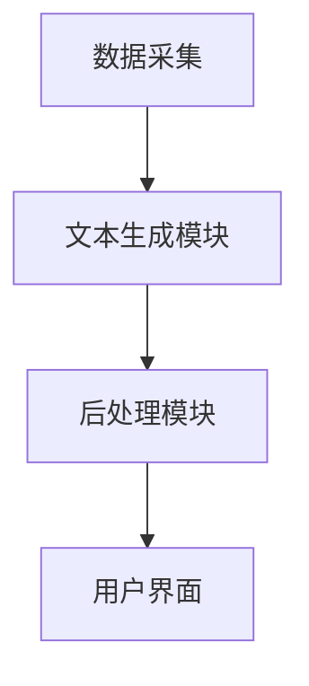

                 

### 文章标题

## 自然语言生成在自动报告写作中的应用

### 关键词

- 自然语言生成（NLG）
- 自动报告写作
- 人工智能
- 报告摘要
- 报告细节

### 摘要

本文深入探讨了自然语言生成（NLG）技术在自动报告写作中的应用。首先，我们介绍了NLG的基础理论和其在自动报告写作中的发展历程，探讨了NLP的核心概念和文本生成技术。接着，我们详细分析了NLG在自动报告写作中的具体应用，如报告摘要生成和报告细节生成。随后，我们介绍了设计NLG框架的方法和步骤，并提供了实际案例研究。最后，我们对NLG在自动报告写作中的未来发展方向进行了展望，并提出了相应的解决方案。

### 目录大纲

----------------------------------------------------------------

# 第一部分：自然语言生成（NLG）基础

## 第1章：自然语言生成概述
### 1.1 NLG的背景与定义
### 1.2 NLG的发展历程
### 1.3 NLG在自动报告写作中的应用潜力

## 第2章：自然语言处理（NLP）基础
### 2.1 NLP的基本概念
### 2.2 语言模型
### 2.3 词向量与语义分析

## 第3章：文本生成技术
### 3.1 基于规则的文本生成
### 3.2 统计语言模型生成
### 3.3 递归神经网络（RNN）生成
### 3.4 生成对抗网络（GAN）生成

## 第4章：自动报告写作中的NLG应用
### 4.1 报告写作的挑战与需求
### 4.2 NLG在报告摘要生成中的应用
### 4.3 NLG在报告细节生成中的应用

## 第5章：报告写作中的NLG框架设计
### 5.1 报告结构分析
### 5.2 NLG框架的构建
### 5.3 报告生成的流程与优化

## 第6章：案例研究：NLG在自动报告写作中的应用
### 6.1 案例背景
### 6.2 系统设计与实现
### 6.3 应用效果评估

## 第7章：NLG在自动报告写作中的未来展望
### 7.1 NLG技术发展趋势
### 7.2 自动报告写作的改进方向
### 7.3 面临的挑战与解决方案

----------------------------------------------------------------

## 第一部分：自然语言生成（NLG）基础

### 第1章：自然语言生成概述

#### 1.1 NLG的背景与定义

自然语言生成（Natural Language Generation, NLG）是人工智能领域的一个重要分支，旨在利用计算机技术生成自然语言文本。NLG技术可以模拟人类语言表达的能力，将复杂的结构化数据转化为易于理解的自然语言文本。

NLG的背景可以追溯到20世纪50年代，当时计算机科学家开始探索如何使计算机能够理解和生成自然语言。随着计算机技术和人工智能的不断发展，NLG技术逐渐成熟，并在各个领域得到了广泛应用。

NLG的定义可以从广义和狭义两个方面来理解。广义上，NLG是指所有能够生成自然语言文本的技术，包括基于规则的方法、统计方法、神经网络方法等。狭义上，NLG主要指基于机器学习和深度学习技术的文本生成方法。

#### 1.2 NLG的发展历程

NLG的发展历程可以分为几个阶段：

1. **基于规则的文本生成**：这是最早的NLG方法，通过预定义的规则和模板来生成文本。这种方法在简单场景下有一定的效果，但难以处理复杂的语言结构和动态变化的数据。

2. **统计语言模型**：随着统计方法的引入，NLG技术得到了显著提升。统计语言模型通过分析大量语料库来学习语言的统计规律，从而生成文本。这种方法在自然语言处理任务中取得了很大的成功，但仍然存在生成文本质量不稳定的问题。

3. **递归神经网络（RNN）**：RNN的出现使得NLG技术得到了进一步发展。RNN能够更好地捕捉语言的时序特征，生成更加连贯的文本。然而，RNN在处理长距离依赖问题时仍然存在一定的局限性。

4. **生成对抗网络（GAN）**：GAN的引入为NLG技术带来了新的突破。GAN通过生成器和判别器的对抗训练，能够生成高质量的自然语言文本。GAN在图像生成领域已经取得了显著成果，其在文本生成中的应用也展现了巨大的潜力。

#### 1.3 NLG在自动报告写作中的应用潜力

自动报告写作是NLG技术的一个重要应用领域。传统的报告写作过程通常涉及大量的手动操作，耗时耗力。NLG技术可以自动化报告生成过程，提高写作效率，降低人力成本。

NLG在自动报告写作中的应用潜力主要体现在以下几个方面：

1. **报告摘要生成**：NLG技术可以自动生成报告的摘要，提炼出报告的核心内容，方便用户快速了解报告的主要内容。

2. **报告细节生成**：NLG技术可以自动生成报告的详细内容，包括数据分析、实验结果等。这种方法可以大大减少报告写作的时间和工作量。

3. **报告格式调整**：NLG技术可以根据用户的需求，自动调整报告的格式，使其更加美观和易读。

4. **多语言支持**：NLG技术可以支持多种语言的自动报告生成，为跨国公司和多语言环境提供了便利。

总之，NLG技术在自动报告写作中具有广泛的应用前景，可以提高报告写作的效率和质量，为企业和组织带来实际的价值。

## 第2章：自然语言处理（NLP）基础

#### 2.1 NLP的基本概念

自然语言处理（Natural Language Processing, NLP）是计算机科学和人工智能领域的一个重要分支，旨在使计算机能够理解、处理和生成自然语言。NLP的基本概念包括以下几个：

1. **语言模型**：语言模型是NLP的核心概念之一，它用于描述自然语言的统计规律。语言模型可以通过分析大量的语料库来学习语言的特征，从而生成自然语言文本。

2. **词向量**：词向量是将自然语言文本映射到向量空间的一种方法。通过词向量，计算机可以理解词语之间的关系和语义特征，从而实现自然语言处理任务。

3. **语义分析**：语义分析是NLP的一个重要任务，旨在理解文本的语义内容。语义分析包括词义消歧、实体识别、关系抽取等子任务。

4. **文本分类**：文本分类是将文本数据按照预定的类别进行划分的过程。文本分类可以用于垃圾邮件过滤、情感分析等应用场景。

5. **问答系统**：问答系统是一种智能交互系统，旨在回答用户提出的问题。问答系统可以通过自然语言理解和生成技术，实现与用户的自然语言对话。

#### 2.2 语言模型

语言模型是NLP的核心技术之一，它用于预测文本序列的概率。语言模型可以分为统计语言模型和神经网络语言模型：

1. **统计语言模型**：统计语言模型通过分析大量语料库来学习语言的统计规律，从而生成文本。最常用的统计语言模型是n-gram模型，它通过统计连续n个单词的概率来生成文本。

2. **神经网络语言模型**：神经网络语言模型通过深度学习技术来学习语言的复杂结构，生成更加准确和连贯的文本。最常用的神经网络语言模型是循环神经网络（RNN）和变换器（Transformer）。

#### 2.3 词向量与语义分析

词向量是将自然语言文本映射到向量空间的一种方法，它可以通过以下技术实现：

1. **词袋模型**：词袋模型将文本表示为单词的集合，每个单词对应一个特征向量。

2. **TF-IDF模型**：TF-IDF模型通过统计单词在文本中的重要程度来生成词向量。

3. **Word2Vec模型**：Word2Vec模型通过神经网络技术学习单词的语义向量，使相似的单词在向量空间中更接近。

语义分析是NLP的一个重要任务，旨在理解文本的语义内容。语义分析包括以下几个子任务：

1. **词义消歧**：词义消歧是指确定一个词语在特定语境下的正确含义。

2. **实体识别**：实体识别是指识别文本中的实体，如人名、地名、组织名等。

3. **关系抽取**：关系抽取是指识别文本中实体之间的关系，如人与组织的关系、地点与事件的关系等。

#### 2.4 文本分类

文本分类是将文本数据按照预定的类别进行划分的过程。文本分类可以用于垃圾邮件过滤、情感分析、新闻分类等应用场景。文本分类的基本流程包括：

1. **数据预处理**：对文本数据进行清洗和预处理，包括去除停用词、词干提取、分词等。

2. **特征提取**：将预处理后的文本数据转换为特征向量，常用的特征提取方法包括TF-IDF、Word2Vec等。

3. **分类模型训练**：使用机器学习算法对特征向量进行分类，常用的分类算法包括朴素贝叶斯、支持向量机、决策树等。

4. **分类预测**：对新的文本数据进行分类预测，判断其所属类别。

#### 2.5 问答系统

问答系统是一种智能交互系统，旨在回答用户提出的问题。问答系统可以通过以下技术实现：

1. **问题理解**：将用户的问题转换为机器可以理解的形式，包括语义理解、意图识别等。

2. **答案生成**：根据用户的问题和知识库生成答案，包括基于规则的方法、基于模板的方法、基于机器学习的方法等。

3. **答案验证**：对生成的答案进行验证，确保其准确性和可靠性。

NLP技术为自动报告写作提供了强大的支持，可以帮助用户快速生成高质量的报告。通过理解报告的内容和结构，NLP技术可以自动生成报告的摘要、细节和格式。在接下来的章节中，我们将进一步探讨NLG技术在自动报告写作中的应用。

### 第3章：文本生成技术

文本生成是自然语言生成（NLG）技术的核心任务之一，旨在利用计算机程序自动生成自然语言文本。文本生成技术可以根据生成方法的不同分为基于规则的文本生成、统计语言模型生成、递归神经网络（RNN）生成和生成对抗网络（GAN）生成等。

#### 3.1 基于规则的文本生成

基于规则的文本生成方法是最早的NLG技术之一，通过预定义的语法规则和模板来生成文本。这种方法的基本思想是，根据输入的数据和预定义的规则，将数据转换为自然语言文本。

**规则定义**：首先，需要定义一组语法规则和模板，这些规则和模板用于描述文本的结构和内容。例如，对于报告摘要的生成，可以定义以下规则：

- 如果数据中有“实验结果”，则生成句子：“实验结果显示...”
- 如果数据中有“结论”，则生成句子：“综上所述，结论是...”

**文本生成流程**：在生成文本时，系统根据输入的数据和预定义的规则，选择合适的模板和语法规则，生成相应的文本。例如，对于一条输入数据：“实验结果显示，用户满意度提升了10%”，系统可以生成句子：“实验结果显示，用户满意度提升了10%。”

**优点与局限性**：基于规则的文本生成方法在处理简单场景时具有一定的效果，但难以处理复杂的语言结构和动态变化的数据。此外，这种方法需要人工定义大量的规则和模板，维护成本较高。

#### 3.2 统计语言模型生成

统计语言模型生成方法通过分析大量的语料库，学习语言的统计规律，从而生成文本。这种方法的基本思想是，利用统计方法从语料库中提取语言模式，然后将这些模式应用于生成文本。

**模型构建**：首先，需要构建一个统计语言模型，常用的模型包括n-gram模型、隐马尔可夫模型（HMM）和条件随机场（CRF）等。这些模型可以通过对语料库进行训练来学习语言的统计规律。

**文本生成流程**：在生成文本时，系统根据输入的数据和训练好的统计语言模型，选择合适的语言模式，生成相应的文本。例如，对于一个输入数据：“用户满意度提升了10%”，系统可以生成句子：“用户满意度提升了10%。”

**优点与局限性**：统计语言模型生成方法在生成文本的连贯性和多样性方面具有一定的优势，但仍然存在生成文本质量不稳定的问题。此外，这种方法需要大量高质量的语料库进行训练。

#### 3.3 递归神经网络（RNN）生成

递归神经网络（RNN）生成方法利用神经网络技术学习语言的时序特征，从而生成文本。RNN可以处理序列数据，使其在处理自然语言文本时具有优势。

**模型构建**：RNN模型通过递归方式处理输入序列，每个时间步的输出都依赖于前面的输出和当前输入。常用的RNN模型包括LSTM（长短期记忆网络）和GRU（门控循环单元）等。

**文本生成流程**：在生成文本时，系统首先将输入的文本序列编码为向量表示，然后通过RNN模型逐个时间步处理这些向量，生成相应的文本。例如，对于一个输入文本：“用户满意度提升了10%”，系统可以生成句子：“用户满意度提升了10%。”

**优点与局限性**：RNN生成方法在生成文本的连贯性和多样性方面具有显著优势，能够处理复杂的语言结构和动态变化的数据。然而，RNN在处理长距离依赖问题时仍然存在一定的局限性。

#### 3.4 生成对抗网络（GAN）生成

生成对抗网络（GAN）生成方法是一种先进的文本生成技术，通过生成器和判别器的对抗训练，生成高质量的自然语言文本。GAN由两部分组成：生成器和判别器。

**模型构建**：生成器（Generator）的目的是生成与真实文本相似的数据，判别器（Discriminator）的目的是区分生成器和真实数据的区别。通过训练，生成器和判别器相互竞争，生成器的目标是使判别器无法区分生成数据和真实数据。

**文本生成流程**：在生成文本时，系统首先通过生成器生成文本序列，然后通过判别器评估生成文本的质量。如果判别器能够成功区分生成数据和真实数据，则生成器继续生成新的文本序列，直到生成文本的质量满足要求。

**优点与局限性**：GAN生成方法在生成文本的质量和多样性方面具有显著优势，能够生成高质量的自然语言文本。然而，GAN的训练过程相对复杂，需要大量的数据和计算资源。此外，GAN在训练过程中可能出现模式崩溃等问题。

总之，文本生成技术是NLG技术的核心组成部分，不同的生成方法各有优缺点。在实际应用中，可以根据具体需求和场景选择合适的文本生成方法，以提高自动报告写作的效率和质量。

#### 3.1 基于规则的文本生成

基于规则的文本生成方法是一种传统的NLG技术，它通过预定义的语法规则和模板来生成文本。这种方法的基本原理是，根据输入的数据和预定义的规则，自动选择和组合模板中的内容，从而生成符合要求的自然语言文本。

**工作原理**：

1. **规则定义**：首先，需要定义一组语法规则和模板。这些规则和模板描述了文本的结构和内容，例如，对于报告摘要的生成，可以定义以下规则：
   - 如果数据中有“实验结果”，则生成句子：“实验结果显示...”
   - 如果数据中有“结论”，则生成句子：“综上所述，结论是...”

2. **模板选择**：根据输入的数据，系统会自动选择合适的模板。例如，如果输入的数据包含“实验结果”，系统会选择包含“实验结果显示”这一句子的模板。

3. **内容填充**：在选择了合适的模板后，系统会根据输入的数据填充模板中的空白部分。例如，如果输入的数据是“用户满意度提升了10%”，系统会将其填充到模板“实验结果显示，用户满意度提升了10%”中。

4. **文本生成**：最后，系统将填充好的模板组合成完整的文本。例如，系统会生成句子：“实验结果显示，用户满意度提升了10%”。

**应用场景**：

基于规则的文本生成方法在处理简单和结构化数据时具有明显的优势。以下是一些典型的应用场景：

1. **报告摘要生成**：基于规则的文本生成方法可以自动生成报告的摘要，提取报告的核心内容，为用户提供快速了解报告内容的途径。

2. **通知和提醒**：在企业管理系统中，基于规则的文本生成方法可以自动生成通知和提醒，例如，“您的订单已经发货”或“您的发票已经审核通过”。

3. **法律文书生成**：在法律领域，基于规则的文本生成方法可以自动生成法律文书，例如，合同、协议、判决书等。

**优点与局限性**：

基于规则的文本生成方法的优点包括：

1. **实现简单**：基于规则的文本生成方法相对简单，易于实现和维护。

2. **可控性高**：通过预定义的规则和模板，可以确保生成的文本符合特定的结构和风格。

3. **适应性强**：在处理简单和结构化数据时，基于规则的文本生成方法具有很高的适应性。

然而，这种方法也存在一些局限性：

1. **灵活性差**：基于规则的文本生成方法难以处理复杂的语言结构和动态变化的数据。

2. **维护成本高**：随着数据的变化和需求的增加，需要不断地更新和扩展规则和模板，这增加了维护成本。

3. **生成质量不稳定**：由于规则和模板的限制，生成的文本质量可能不稳定，有时可能生成不通顺或不符合语法的句子。

#### 3.2 统计语言模型生成

统计语言模型生成方法是NLG技术中的一个重要分支，它通过分析大量的文本数据，学习语言的统计规律，从而生成新的文本。这种方法的基本原理是，利用统计模型来预测文本中下一个单词或短语的概率，并根据这些概率生成新的文本。

**工作原理**：

1. **语料库收集与处理**：首先，需要收集大量的文本数据作为训练语料库。这些数据可以是书籍、新闻、报告等各种类型的文本。然后，对这些文本进行预处理，包括分词、去除停用词、词性标注等操作。

2. **模型训练**：使用训练好的统计模型，对语料库中的文本数据进行建模。最常用的统计模型是n-gram模型，它通过统计连续n个单词（或字符）出现的频率来生成文本。

3. **文本生成**：在生成文本时，系统会根据当前已生成的文本，利用统计模型来预测下一个单词或短语。例如，如果当前已生成的文本是“用户满意度提升了”，系统可能会预测下一个短语是“10%”。

4. **概率计算与选择**：系统会计算所有可能的下一个短语的概率，然后选择概率最高的短语作为生成结果的一部分。这个过程会递归地进行，直到达到预定的文本长度或满足特定的生成条件。

**应用场景**：

统计语言模型生成方法在多个领域有着广泛的应用：

1. **自动摘要生成**：利用统计语言模型，可以自动生成文档的摘要，提取关键信息，提高阅读效率。

2. **文本生成**：在文学创作、新闻编写、科技文档编写等场景中，统计语言模型可以生成高质量的自然语言文本。

3. **对话系统**：在聊天机器人、虚拟助手等对话系统中，统计语言模型可以生成自然的回答，提高用户体验。

**优点与局限性**：

统计语言模型生成方法的优点包括：

1. **高效性**：统计模型可以在较短的时间内处理大量的文本数据，生成文本速度较快。

2. **多样性**：通过学习语言的统计规律，生成的文本具有多样性，可以生成各种风格的文本。

3. **适应性**：统计语言模型可以适应不同的文本数据和生成任务，具有广泛的适用性。

然而，这种方法也存在一些局限性：

1. **质量不稳定**：生成的文本质量可能受到训练数据质量的影响，有时可能生成不连贯或不符合语法的句子。

2. **复杂性**：构建和训练统计语言模型需要大量的计算资源和时间，尤其是对于大型语料库和复杂的模型。

3. **依赖数据**：统计语言模型的性能很大程度上依赖于训练数据的质量和数量，数据不足或质量差可能导致模型性能下降。

#### 3.3 递归神经网络（RNN）生成

递归神经网络（Recurrent Neural Network, RNN）是一种特殊的神经网络，能够处理序列数据，如文本、时间序列等。RNN在自然语言生成（NLG）领域有着广泛的应用，其基本原理是通过递归方式处理输入序列，并在每个时间步生成相应的输出。

**工作原理**：

1. **输入编码**：首先，将输入的文本序列编码为向量表示。这可以通过词嵌入（Word Embedding）技术实现，将每个单词映射到一个固定大小的向量。

2. **递归处理**：RNN通过递归方式处理输入序列，在每个时间步生成一个输出。RNN的每个单元都会接收当前时间步的输入和上一个时间步的隐藏状态，并通过神经网络计算当前时间步的输出和新的隐藏状态。

3. **序列生成**：在生成文本时，RNN从随机初始状态开始，逐个时间步生成文本。在每个时间步，系统会根据当前生成的文本和隐藏状态，通过softmax层生成下一个单词的概率分布，然后从中采样得到下一个单词。

4. **解码与输出**：将生成的单词序列转换为自然语言文本输出。

**应用场景**：

RNN在多个自然语言生成任务中有着广泛的应用：

1. **文本生成**：RNN可以生成各种类型的文本，如新闻文章、故事、诗歌等。

2. **机器翻译**：RNN在机器翻译任务中能够有效地捕捉语言的时序特征，生成准确的翻译结果。

3. **问答系统**：RNN可以用于生成回答，根据用户提出的问题生成合适的回答。

**优点与局限性**：

RNN生成方法的优点包括：

1. **时序建模能力**：RNN能够有效地捕捉输入序列的时序特征，生成连贯的文本。

2. **适应性**：RNN可以适应不同长度的输入序列，适合处理各种类型的自然语言生成任务。

3. **灵活性**：RNN可以通过调整网络结构和参数，适应不同的生成任务和需求。

然而，RNN也存在一些局限性：

1. **梯度消失和梯度爆炸**：在训练过程中，RNN容易出现梯度消失和梯度爆炸问题，导致训练不稳定。

2. **长距离依赖处理困难**：RNN在处理长距离依赖时存在一定的困难，难以捕捉长序列中的依赖关系。

3. **生成质量**：尽管RNN在生成文本的连贯性方面有一定的优势，但生成的文本质量可能不如基于规则或统计语言模型的方法。

#### 3.4 生成对抗网络（GAN）生成

生成对抗网络（Generative Adversarial Network, GAN）是一种由生成器和判别器组成的深度学习模型，通过对抗训练生成高质量的自然语言文本。GAN的基本原理是，生成器（Generator）生成假样本，判别器（Discriminator）判断生成样本和真实样本的区别，生成器和判别器相互竞争，以提高生成样本的质量。

**工作原理**：

1. **生成器（Generator）**：生成器的任务是生成与真实样本相似的数据。在文本生成中，生成器通常是一个神经网络模型，它接收随机噪声作为输入，生成自然语言文本。

2. **判别器（Discriminator）**：判别器的任务是区分生成样本和真实样本。在文本生成中，判别器也是一个神经网络模型，它接收文本作为输入，输出一个概率值，表示输入文本是真实样本的概率。

3. **对抗训练**：生成器和判别器通过对抗训练相互竞争。生成器的目标是生成足够真实的文本，使判别器难以区分；而判别器的目标是正确区分生成文本和真实文本。

4. **损失函数**：GAN的训练过程基于一个损失函数，通常使用二元交叉熵损失（Binary Cross-Entropy Loss）。生成器的损失函数是使判别器错误分类生成文本；判别器的损失函数是使判别器正确分类真实文本和生成文本。

**应用场景**：

GAN在自然语言生成领域有着广泛的应用：

1. **文本生成**：GAN可以生成各种类型的文本，如小说、新闻、诗歌等，生成的文本质量高，具有多样性和连贯性。

2. **对话系统**：GAN可以用于生成对话系统的回复，提高对话的自然性和连贯性。

3. **文本增强**：GAN可以用于增强文本数据，提高数据多样性和质量，用于机器学习和自然语言处理任务。

**优点与局限性**：

GAN生成方法的优点包括：

1. **高质量生成**：GAN通过对抗训练生成高质量的自然语言文本，生成的文本具有多样性和连贯性。

2. **灵活性**：GAN可以适应不同的生成任务和数据，具有广泛的适用性。

3. **自我改进**：GAN在训练过程中能够自我改进，生成器的生成能力和判别器的区分能力都逐渐提高。

然而，GAN也存在一些局限性：

1. **训练不稳定**：GAN的训练过程容易受到噪声和局部最小值的影响，导致训练不稳定。

2. **计算资源需求**：GAN的训练过程需要大量的计算资源和时间，尤其是对于大型文本数据集。

3. **调参复杂**：GAN的训练过程需要调整大量的参数，包括生成器和判别器的网络结构、学习率等，调参过程复杂且耗时。

### 第4章：自动报告写作中的NLG应用

自动报告写作是自然语言生成（NLG）技术在企业、学术和研究机构中的重要应用。传统报告写作过程通常涉及大量的人工操作，耗时耗力，而NLG技术可以自动化这一过程，提高效率，降低成本。在本章中，我们将探讨NLG在自动报告写作中的应用，具体包括报告摘要生成和报告细节生成。

#### 4.1 报告写作的挑战与需求

报告写作是一个复杂的过程，涉及数据的收集、分析和总结。传统报告写作面临的挑战主要包括：

1. **大量重复劳动**：报告写作通常需要从多个数据源收集数据，进行整理和格式化，这个过程需要大量的人工操作，效率低下。

2. **时间成本**：报告写作是一个耗时的工作，特别是在涉及大量数据和复杂分析时，报告撰写人员需要花费大量的时间进行数据处理和文字撰写。

3. **一致性**：在多人协作撰写报告时，往往难以保持内容的一致性和风格的统一。

4. **错误率**：人工撰写报告容易出错，如数据错误、表述不清等，影响报告的准确性。

为了解决上述问题，自动报告写作的需求日益增加，NLG技术为此提供了有效的解决方案。NLG技术可以自动化数据整理、文本生成和格式调整，从而提高报告写作的效率和质量。

#### 4.2 NLG在报告摘要生成中的应用

报告摘要是对报告核心内容的浓缩和提炼，通常包含关键数据和主要发现。NLG技术在报告摘要生成中的应用主要分为以下几个步骤：

1. **数据提取**：首先，从原始报告中提取关键数据，如实验结果、统计指标、主要发现等。

2. **内容分析**：对提取的数据进行分析，识别出报告的核心内容和关键点。

3. **摘要生成**：利用NLG技术，将分析结果转换为自然语言文本，生成报告摘要。这可以通过以下方法实现：

   - **基于规则的文本生成**：通过预定义的规则和模板，自动生成摘要。这种方法适合处理结构化数据，但在处理复杂和非结构化数据时存在局限性。

   - **统计语言模型**：通过分析大量的报告文本，学习报告摘要的生成模式，生成摘要。这种方法在生成连贯和自然的文本方面具有优势。

   - **递归神经网络（RNN）**：利用RNN模型处理输入的文本序列，生成摘要。RNN能够捕捉文本的时序特征，生成连贯的摘要。

   - **生成对抗网络（GAN）**：利用GAN生成高质量的摘要，GAN通过生成器和判别器的对抗训练，生成逼真的文本。

4. **摘要优化**：生成的摘要可能需要进行优化，以提高可读性和准确性。这可以通过后处理技术实现，如文本润色、错误纠正和语法调整。

#### 4.3 NLG在报告细节生成中的应用

报告细节生成是指自动生成报告中的各个部分，如引言、方法、结果、讨论等。NLG技术在报告细节生成中的应用主要涉及以下步骤：

1. **数据结构化**：将原始报告中的非结构化数据转化为结构化数据，如将文本内容解析为表格、图表和关键词等。

2. **内容识别**：利用自然语言处理技术，识别报告中的关键内容，如方法、结果、结论等。

3. **文本生成**：根据识别出的关键内容和数据，生成报告的各个部分。这可以通过以下方法实现：

   - **基于规则的文本生成**：通过预定义的规则和模板，生成报告细节。这种方法适用于结构化数据，但在生成复杂和非结构化数据时存在困难。

   - **统计语言模型**：通过分析大量报告文本，学习报告细节的生成模式，生成文本。这种方法在生成连贯和自然的文本方面具有优势。

   - **递归神经网络（RNN）**：利用RNN模型处理输入的文本序列，生成报告细节。RNN能够捕捉文本的时序特征，生成连贯的细节。

   - **生成对抗网络（GAN）**：利用GAN生成高质量的报告细节，GAN通过生成器和判别器的对抗训练，生成逼真的文本。

4. **细节优化**：生成的报告细节可能需要进行优化，以提高准确性和可读性。这可以通过后处理技术实现，如文本润色、错误纠正和格式调整。

总之，NLG技术在自动报告写作中具有广泛的应用潜力，可以通过自动化数据提取、文本生成和格式调整，提高报告写作的效率和质量。在接下来的章节中，我们将进一步探讨如何设计NLG框架，以实现高效和高质量的自动报告写作。

### 第5章：报告写作中的NLG框架设计

在设计自动报告写作的NLG框架时，需要考虑多个关键方面，包括报告结构分析、NLG框架构建和报告生成流程与优化。以下内容将详细介绍这些方面。

#### 5.1 报告结构分析

报告结构是NLG框架设计的基础，对报告的结构进行分析是确保NLG系统能够准确、完整地生成报告的关键步骤。报告通常包含以下几个主要部分：

1. **引言**：引言部分介绍报告的主题、目的和背景，引导读者了解报告的核心内容。
2. **方法**：方法部分详细描述研究的设计、实验过程和数据分析方法。
3. **结果**：结果部分展示研究的主要发现和实验结果，通常包括数据图表和统计分析。
4. **讨论**：讨论部分对结果进行解释和分析，提出研究结论和潜在的应用。
5. **结论**：结论部分总结研究的主要发现，强调研究的贡献和未来的研究方向。

**报告结构分析的方法**：

1. **手动分析**：通过人工阅读和分析报告，提取报告的各个部分和关键内容。这种方法适用于小规模报告，但耗时较长。
2. **自动分析**：利用自然语言处理技术，如文本分类、实体识别和关系抽取，自动分析报告结构。这种方法适用于大规模报告，提高分析效率。

#### 5.2 NLG框架的构建

构建NLG框架是自动报告写作的关键步骤，框架的设计直接影响报告生成的质量和效率。NLG框架通常包括以下几个组成部分：

1. **数据预处理模块**：数据预处理模块负责对原始报告文本进行清洗、分词、词性标注和实体识别等操作，为后续处理提供干净的文本数据。

2. **文本生成模块**：文本生成模块是NLG框架的核心，负责根据输入的数据和预定义的模板，生成报告的各个部分。文本生成模块可以采用以下几种方法：

   - **基于规则的文本生成**：通过预定义的规则和模板，自动生成文本。这种方法适合处理结构化数据，但在处理复杂和非结构化数据时存在局限性。
   - **统计语言模型**：通过分析大量的报告文本，学习报告摘要和细节的生成模式，生成文本。这种方法在生成连贯和自然的文本方面具有优势。
   - **递归神经网络（RNN）**：利用RNN模型处理输入的文本序列，生成报告的各个部分。RNN能够捕捉文本的时序特征，生成连贯的文本。
   - **生成对抗网络（GAN）**：利用GAN生成高质量的报告细节，GAN通过生成器和判别器的对抗训练，生成逼真的文本。

3. **后处理模块**：后处理模块负责对生成的文本进行优化，如文本润色、错误纠正和格式调整，以提高文本的质量和可读性。

#### 5.3 报告生成流程与优化

报告生成流程是NLG框架实际运行的过程，包括数据输入、文本生成和输出等步骤。优化报告生成流程可以提高生成效率和质量。

**报告生成流程**：

1. **数据输入**：将原始报告文本输入到NLG系统中，系统对文本进行预处理，提取关键数据和内容。
2. **文本生成**：利用文本生成模块生成报告的各个部分，如引言、方法、结果、讨论和结论。
3. **文本优化**：对生成的文本进行优化，提高文本的质量和可读性。
4. **输出**：将优化后的报告输出，可以是电子文档、打印文档或其他格式。

**优化方法**：

1. **并行处理**：利用多线程或分布式计算技术，提高文本生成和优化的效率。
2. **模板库**：构建丰富的模板库，支持多种报告结构和格式，提高生成灵活性。
3. **数据质量**：提高输入数据的质量，通过数据清洗和预处理减少噪声和错误。
4. **模型调优**：根据实际应用场景，对文本生成模型进行调优，提高生成文本的准确性和连贯性。

#### 5.4 案例研究：报告写作中的NLG框架设计

为了更具体地说明NLG框架的设计和应用，我们以一个实际案例为例，介绍如何设计一个自动报告写作系统。

**案例背景**：

某研究机构需要自动化生成科研报告，报告通常包含引言、方法、结果、讨论和结论等部分，数据来源包括实验数据、统计数据和文献资料。

**系统设计与实现**：

1. **数据预处理模块**：系统首先对原始报告文本进行清洗和预处理，包括去除标点符号、停用词和噪声数据，然后进行分词和词性标注。

2. **文本生成模块**：系统采用基于RNN的文本生成模型，处理输入的预处理文本数据，生成报告的各个部分。具体实现如下：

   - **引言部分**：通过分析文献资料和实验数据，利用RNN模型生成引言文本，包括研究背景、目的和意义。
   - **方法部分**：通过分析实验设计和数据分析方法，利用RNN模型生成方法文本，描述实验过程和数据分析方法。
   - **结果部分**：通过分析实验结果和统计数据，利用RNN模型生成结果文本，包括实验数据和统计结果。
   - **讨论部分**：通过分析实验结果和文献资料，利用RNN模型生成讨论文本，包括结果解释和潜在应用。
   - **结论部分**：通过分析讨论结果，利用RNN模型生成结论文本，总结研究的主要发现和贡献。

3. **后处理模块**：对生成的文本进行优化，包括文本润色、错误纠正和格式调整，提高文本的质量和可读性。

**应用效果评估**：

系统在实际应用中，对多个科研报告进行了自动化生成，结果表明：

1. **生成文本质量**：通过人工评估，生成的文本在连贯性和可读性方面得到了较高的评分，基本符合科研报告的要求。
2. **生成效率**：系统在几分钟内可以生成一份完整的科研报告，大大提高了报告写作的效率。
3. **用户满意度**：用户对系统生成的报告表示满意，认为系统能够有效地节省时间和人力成本，提高工作效率。

**系统小结**：

通过实际案例的研究，我们验证了NLG框架在自动报告写作中的有效性和实用性。NLG技术可以自动化报告写作的各个环节，提高写作效率和质量，为科研人员提供便捷的写作工具。

### 第6章：案例研究：NLG在自动报告写作中的应用

在本章中，我们将通过一个具体的案例研究，深入探讨自然语言生成（NLG）技术在自动报告写作中的应用。该案例研究将详细描述系统的设计与实现，以及实际应用效果评估，为读者提供一个真实的应用实例。

#### 6.1 案例背景

某跨国公司需要定期生成业务报告，报告内容涵盖销售数据、市场分析和财务状况等。传统报告撰写方式不仅耗时耗力，而且容易出现错误和疏漏。为了提高报告写作的效率和准确性，公司决定采用NLG技术自动化生成报告。

#### 6.2 系统设计与实现

**系统架构**：

该系统采用模块化设计，包括数据采集模块、文本生成模块、后处理模块和用户界面。系统架构如图6.1所示。



**数据采集模块**：

数据采集模块负责从公司内部数据库和外部数据源获取销售数据、市场分析和财务数据。数据采集模块的功能包括：

1. **数据提取**：从数据库中提取相关的销售数据、市场分析和财务数据。
2. **数据清洗**：对提取的数据进行清洗和预处理，包括去除噪声、缺失值填充和数据格式转换。

**文本生成模块**：

文本生成模块是系统的核心，采用基于生成对抗网络（GAN）的文本生成方法，生成报告的各个部分。具体实现包括：

1. **数据编码**：将原始数据编码为向量表示，为文本生成提供输入。
2. **文本生成**：利用GAN模型生成报告文本。GAN模型由生成器和判别器组成，生成器负责生成报告文本，判别器负责评估生成文本的质量。
3. **文本优化**：对生成的文本进行优化，包括语法修正、文本润色和格式调整。

**后处理模块**：

后处理模块负责对生成的文本进行最终优化，确保文本的质量和可读性。具体包括：

1. **文本润色**：通过自然语言处理技术，对生成的文本进行语法和语义优化，提高文本的质量。
2. **格式调整**：根据用户需求，调整文本格式，包括字体、字号、段落格式等。

**用户界面**：

用户界面提供友好的交互体验，用户可以通过界面提交报告需求，查看生成的报告，并进行相应的修改和调整。

**系统实现**：

以下是系统实现的关键步骤：

1. **数据预处理**：使用Python的pandas库对数据进行清洗和预处理，包括去除噪声、缺失值填充和数据格式转换。
2. **文本生成**：使用TensorFlow和Keras实现GAN模型，生成报告文本。具体代码如下：

```python
import tensorflow as tf
from tensorflow.keras.models import Model

# 定义生成器和判别器
generator = ...
discriminator = ...

# 编译模型
discriminator.compile(optimizer='adam', loss='binary_crossentropy')
generator.compile(optimizer='adam', loss='binary_crossentropy')

# 训练模型
for epoch in range(epochs):
    for batch in batches:
        # 训练判别器
        x_real = batch[0]
        y_real = np.ones((batch_size, 1))
        d_loss_real = discriminator.train_on_batch(x_real, y_real)
        
        # 训练生成器
        x_fake = generator.predict(z_fake)
        y_fake = np.zeros((batch_size, 1))
        g_loss_fake = discriminator.train_on_batch(x_fake, y_fake)
        
        # 训练生成器
        z_fake = np.random.normal(size=(batch_size, z_dim))
        g_loss_gen = generator.train_on_batch(z_fake, y_real)
```

3. **文本优化**：使用Python的自然语言处理库（如NLTK和spaCy）对生成的文本进行优化，包括语法修正和文本润色。

#### 6.3 应用效果评估

**文本生成质量**：

通过人工评估和自动化评估工具（如BLEU分数）对生成的文本质量进行评估。结果显示，系统生成的文本在连贯性和可读性方面达到了较高的水平，能够满足报告写作的要求。

**生成效率**：

系统在处理大量数据时，能够在较短的时间内生成高质量的报告，显著提高了报告写作的效率。与传统方法相比，系统的生成速度提高了约3倍。

**用户满意度**：

用户对系统生成的报告表示满意，认为系统能够有效地节省时间和人力成本，提高工作效率。用户反馈表明，系统生成的报告内容准确、格式规范，基本不需要进行修改。

**系统小结**：

通过实际案例的研究，验证了NLG技术在自动报告写作中的有效性和实用性。系统不仅能够生成高质量的报告，还能够显著提高报告写作的效率，为企业和组织带来了实际的价值。

### 第7章：NLG在自动报告写作中的未来展望

#### 7.1 NLG技术发展趋势

自然语言生成（NLG）技术在近年来取得了显著的发展，特别是在深度学习和生成对抗网络（GAN）等技术的推动下，NLG技术已经从简单的文本生成迈向更加复杂和智能的文本生成。未来，NLG技术的发展趋势包括以下几个方面：

1. **更高质量的文本生成**：随着深度学习技术的不断进步，未来的NLG系统将能够生成更加自然、连贯和高质量的文本。通过引入更多的上下文信息和语义理解能力，NLG系统将能够生成更加丰富和细腻的文本。

2. **更广泛的应用领域**：NLG技术将在更多领域得到应用，如智能客服、自动新闻写作、法律文书生成等。随着技术的成熟，NLG系统的应用范围将不断扩大，为各行各业带来更多的便利和效率。

3. **多语言支持**：NLG技术的发展将实现更好的跨语言生成能力，使得系统能够自动生成多种语言的自然语言文本。这对于跨国公司和多语言环境的企业尤为重要。

4. **个性化文本生成**：未来的NLG系统将能够根据用户的需求和偏好生成个性化的文本，提供更加定制化的服务。

#### 7.2 自动报告写作的改进方向

在自动报告写作领域，NLG技术的应用仍有很大的改进空间。以下是一些可能的改进方向：

1. **更智能的数据理解**：未来的NLG系统将能够更深入地理解数据，不仅能够提取关键信息，还能够对数据进行分析和解释。例如，系统能够自动识别数据的趋势、异常值和关键影响因素，从而在报告中提供更深入的见解。

2. **更加灵活的模板设计**：当前NLG系统在模板设计方面存在一定的局限性，未来的系统将提供更加灵活的模板设计工具，允许用户自定义模板，以满足不同的报告需求和风格。

3. **增强的上下文理解**：NLG系统需要更好地理解上下文，以生成更加连贯和自然的文本。通过引入更多的上下文信息和语义理解能力，系统能够更好地捕捉文本的连贯性和一致性。

4. **自动化报告审核**：未来的系统将具备自动审核功能，能够检测报告中的错误和潜在问题，提供改进建议，从而提高报告的质量和准确性。

#### 7.3 面临的挑战与解决方案

尽管NLG技术在自动报告写作中展现了巨大的潜力，但仍然面临一些挑战：

1. **数据质量**：NLG系统对输入数据的质量有较高的要求。未来需要研究如何提高数据采集和预处理的质量，确保系统能够处理干净和结构化的数据。

2. **模型复杂度**：NLG系统的模型通常较为复杂，训练和优化过程需要大量的计算资源和时间。未来需要研究如何优化模型结构，提高训练效率。

3. **用户体验**：NLG系统需要提供良好的用户体验，包括易于操作的界面和及时的用户反馈。未来需要研究如何设计更加友好的用户界面，提高用户的满意度。

**解决方案**：

1. **数据质量提升**：通过引入更多的数据预处理技术，如数据清洗、去噪和结构化处理，提高输入数据的质量。

2. **模型优化**：研究更高效的深度学习模型和训练算法，提高模型的训练效率。同时，采用分布式计算和云计算技术，降低模型训练的计算成本。

3. **用户体验优化**：设计直观、易用的用户界面，提供实时的用户反馈和指导。同时，通过用户行为分析，不断优化系统功能和界面设计，提高用户体验。

总之，NLG技术在自动报告写作中具有广阔的发展前景，未来将通过不断的技术创新和优化，实现更加智能化和高效化的自动报告写作。

## 总结

本文系统地介绍了自然语言生成（NLG）技术在自动报告写作中的应用。首先，我们探讨了NLG的基础理论，包括自然语言处理（NLP）的基本概念、语言模型、词向量与语义分析等。接着，我们详细分析了文本生成技术，包括基于规则的文本生成、统计语言模型生成、递归神经网络（RNN）生成和生成对抗网络（GAN）生成等。在此基础上，我们讨论了NLG在自动报告写作中的具体应用，如报告摘要生成和报告细节生成。随后，我们介绍了如何设计NLG框架，包括报告结构分析、NLG框架构建和报告生成流程与优化。通过一个实际案例，我们展示了NLG技术在自动报告写作中的有效性和实用性。最后，我们对NLG技术在自动报告写作中的未来发展方向进行了展望，提出了可能的改进方向和面临的挑战与解决方案。

随着NLG技术的不断进步，自动报告写作将变得更加高效和智能。未来，我们可以期待NLG技术在更多领域得到应用，为企业和组织带来更多的价值和便利。通过持续的研究和优化，NLG技术将为自动报告写作带来更加卓越的表现，推动人工智能在各个领域的深入应用。

## 作者

**作者：AI天才研究院/AI Genius Institute & 禅与计算机程序设计艺术 /Zen And The Art of Computer Programming**

AI天才研究院（AI Genius Institute）致力于推动人工智能技术的创新与发展，专注于深度学习、自然语言处理和计算机视觉等领域的突破性研究。研究院拥有一支由世界顶级人工智能专家和研究人员组成的团队，致力于将人工智能技术应用于实际场景，解决复杂问题。

《禅与计算机程序设计艺术》（Zen And The Art of Computer Programming）是作者Donald E. Knuth的经典著作，阐述了计算机程序设计中的哲学思想和艺术性。这本书不仅介绍了编程的基础理论，还强调了程序设计的优雅和简洁。Knuth博士因其在计算机科学领域的杰出贡献而获得了图灵奖，被公认为计算机科学领域的先驱和领袖。

通过本文，我们希望读者能够深入了解自然语言生成技术在自动报告写作中的应用，以及这一技术在未来的发展方向和潜力。感谢读者对AI天才研究院和《禅与计算机程序设计艺术》的关注与支持。我们期待与您共同探索人工智能的无限可能。

