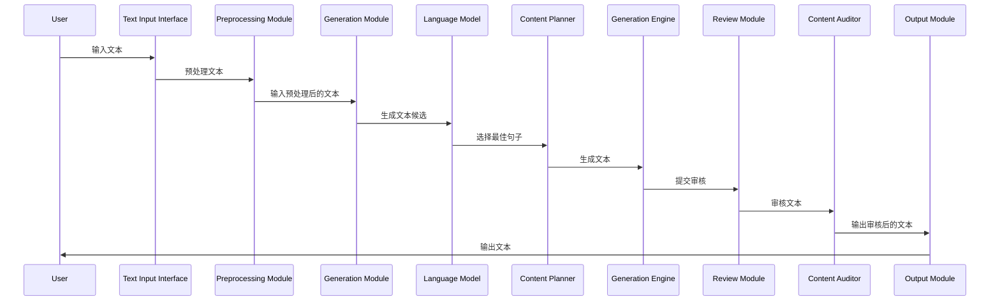

                 

### 《自然语言生成技术在内容创作中的应用》

#### 关键词：自然语言生成（NLG）、内容创作、文本生成、人工智能、机器学习

##### 摘要：
随着人工智能技术的快速发展，自然语言生成（NLG）技术逐渐成为内容创作领域的重要工具。本文将详细探讨NLG技术在内容创作中的应用，从核心概念、技术原理、系统架构到实际案例，全面解析如何利用NLG技术提高内容创作效率和品质。通过本文的阐述，读者将了解NLG技术的工作机制、应用场景及其在内容创作中的潜力与挑战。

## 前言

### 编写目的

本文旨在为读者提供一份关于自然语言生成技术在内容创作中应用的全面指南。随着自然语言处理（NLP）和机器学习（ML）的进步，NLG技术正迅速崛起，并在各行各业的内容创作中展现出巨大的潜力。本文将详细讲解NLG技术的核心概念、原理和应用，帮助读者深入了解这一前沿技术，并掌握其在实际项目中的应用方法。

### 作者背景

作者拥有多年的人工智能研究和实践经验，曾发表多篇关于自然语言处理和生成领域的学术论文，并参与多个大型NLG项目的研发工作。这些经历使得作者对NLG技术在内容创作中的应用有深刻的理解，并能够提供具有实际操作价值的见解。

### 读者对象

本文适用于对自然语言处理和生成技术有一定了解的读者，包括但不限于人工智能研究人员、软件开发工程师、数据科学家、内容创作者和市场营销专家。无论您是希望了解NLG技术的基础知识，还是希望将其应用于实际项目中，本文都将为您提供有价值的参考。

### 书籍结构安排

本文分为五个主要章节：

1. **自然语言生成技术概述**：介绍NLG技术的背景、核心概念和其在内容创作中的重要性。
2. **NLG技术原理详解**：详细解析NLG技术的原理，包括语言模型、文本生成算法、模型优化和评估方法。
3. **NLG在内容创作中的应用**：探讨NLG技术在文章写作、市场营销、教育和内容审核等领域的具体应用。
4. **NLG系统架构设计**：分析NLG系统的架构设计，包括功能设计、系统架构、接口设计和交互设计。
5. **项目实战与最佳实践**：通过实际项目案例展示如何应用NLG技术，并提供最佳实践和注意事项。

## 第1章 自然语言生成技术概述

### 1.1 问题背景与描述

#### 1.1.1 内容创作的挑战

在信息爆炸的时代，内容创作面临着前所未有的挑战。内容创作者需要快速、高效地生成大量高质量的内容，以满足用户的多样化需求。然而，传统的手工创作方式往往耗时耗力，且难以保证内容的多样性和一致性。此外，内容创作的重复性劳动也限制了创作者的创造力和创新精神。

#### 1.1.2 自然语言生成技术的崛起

自然语言生成（NLG）技术是一种利用计算机程序自动生成自然语言文本的技术。随着人工智能和机器学习的发展，NLG技术逐渐成熟，并开始应用于各个领域。NLG技术的核心是能够理解语言的语法、语义和语境，从而生成具有逻辑性和可读性的文本。

#### 1.1.3 NLG技术在内容创作中的潜力

NLG技术在内容创作中具有巨大的潜力。首先，它能够大幅提高内容创作的效率和速度，减轻创作者的负担。其次，NLG技术能够生成多样化的内容，满足不同用户的需求。此外，NLG技术还能够实现内容的个性化，根据用户的行为和偏好生成定制化的内容。最重要的是，NLG技术能够保证内容的准确性和一致性，减少人为错误和疏漏。

### 1.2 核心概念与联系

#### 1.2.1 自然语言处理与自然语言生成

自然语言处理（NLP）是计算机科学和人工智能领域的一个重要分支，旨在使计算机能够理解和处理人类自然语言。NLP包括语言理解（LU）、语言生成（LG）、语言翻译（LT）等多个子领域。自然语言生成（NLG）是NLP的一个重要组成部分，专注于通过计算机程序自动生成自然语言文本。

#### 1.2.2 NLG系统的主要组件

一个典型的NLG系统包括以下几个主要组件：

1. **文本输入处理器**：负责接收用户输入的文本，并将其转化为适合处理的形式。
2. **语言模型**：使用大量的文本数据训练，用于预测下一个单词或短语。
3. **内容规划器**：根据语言模型生成的候选句子，选择最合适的句子进行组合。
4. **文本生成引擎**：将选定的句子组合成完整的文本，并进行必要的语法和语义调整。

#### 1.2.3 NLG系统的工作流程

一个典型的NLG系统的工作流程如下：

1. **输入处理**：接收用户输入的文本，并将其进行预处理，如分词、词性标注等。
2. **语言模型生成**：使用预训练的语言模型生成多个候选句子。
3. **内容规划**：根据上下文和语义信息，选择最合适的句子进行组合。
4. **文本生成**：将选定的句子组合成完整的文本，并进行必要的语法和语义调整。
5. **输出**：将生成的文本输出给用户。

### 1.3 NLG技术的历史与发展

#### 1.3.1 NLG的起源与发展

自然语言生成技术起源于20世纪50年代，当时计算机科学刚刚起步，研究者们开始探索如何让计算机生成自然语言文本。早期的NLG技术主要基于规则和模板，通过预先定义的语法规则和模板来生成文本。这种方法虽然简单，但灵活性和表达能力有限。

#### 1.3.2 里程碑事件与核心技术突破

随着人工智能和机器学习的发展，NLG技术经历了多个重要的里程碑。其中最引人注目的是2018年OpenAI发布的GPT-2模型，它标志着NLG技术从规则驱动的阶段迈向了数据驱动的阶段。GPT-2模型通过大规模的文本数据训练，实现了前所未有的文本生成能力。

#### 1.3.3 当前研究热点与趋势

当前NLG技术的研究热点主要集中在以下几个方面：

1. **预训练语言模型**：如GPT-3、BERT等，通过大规模的预训练实现文本生成的高效和准确性。
2. **多模态生成**：结合文本、图像、音频等多种模态进行生成，实现更丰富的内容创作。
3. **可解释性和可控性**：提高NLG模型的透明度和可控性，使其生成的文本更符合预期和用户需求。
4. **应用场景拓展**：将NLG技术应用于更多领域，如自动化写作、内容审核、对话系统等。

### 1.4 本章小结

本章概述了自然语言生成技术在内容创作中的应用背景、核心概念和关键技术。通过了解NLG技术的起源和发展，读者可以更好地理解其在内容创作中的潜力。接下来，我们将进一步深入探讨NLG技术的原理和实现方法。

## 第2章 NLG技术原理详解

### 2.1 语言模型

#### 2.1.1 语言模型的定义

语言模型（Language Model）是自然语言生成（NLG）系统的核心组件，它用于预测文本序列的概率分布。简而言之，语言模型是一个数学函数，它能够根据已知的部分文本序列，预测下一个单词或短语的分布。

#### 2.1.2 语言模型的基本类型

根据训练数据的不同，语言模型可以分为以下几种类型：

1. **基于规则的语言模型**：这类模型通过预先定义的语法规则和模板来生成文本。例如，基于上下文无关文法（CFG）的模型通过语法规则生成文本。

2. **统计语言模型**：这类模型基于大量文本数据，通过统计方法学习语言模式。例如，N-gram模型通过统计单词序列的频率来生成文本。

3. **神经网络语言模型**：这类模型基于深度学习技术，通过多层神经网络学习语言模式。例如，循环神经网络（RNN）、Transformer模型等。

#### 2.1.3 语言模型的训练与评估

语言模型的训练和评估是NLG技术的重要环节。训练过程通常包括以下步骤：

1. **数据预处理**：对原始文本进行分词、词性标注等预处理操作。
2. **构建词汇表**：将文本中的单词转化为整数表示。
3. **构建训练数据集**：将处理后的文本数据划分为输入序列和目标序列。
4. **训练模型**：使用训练数据集训练语言模型，优化模型参数。

评估语言模型的方法包括：

1. **符号准确性**：评估模型生成的文本与目标文本之间的单词匹配程度。
2. **语义准确性**：评估模型生成的文本的语义是否与目标文本一致。
3. ** BLEU评分**：BLEU（Bilingual Evaluation Understudy）评分是一种常用的自动评估方法，通过比较模型生成的文本与多个参考文本的相似度来评分。
4. **ROUGE评分**：ROUGE（Recall-Oriented Understudy for Gisting Evaluation）评分是一种评估生成文本中与参考文本相似部分的自动评估方法。

### 2.2 文本生成算法

文本生成算法（Text Generation Algorithms）是NLG系统的关键组成部分，它们负责将语言模型生成的候选句子转化为完整的文本。以下是几种常见的文本生成算法：

#### 2.2.1 序列到序列模型（Seq2Seq）

序列到序列（Seq2Seq）模型是一种基于神经网络的文本生成算法，它通过将输入序列映射到输出序列来实现文本生成。常见的Seq2Seq模型包括：

1. **循环神经网络（RNN）**：RNN具有记忆功能，能够处理变长的输入序列。

2. **长短时记忆网络（LSTM）**：LSTM是RNN的一种改进，能够更好地处理长序列依赖问题。

3. **门控循环单元（GRU）**：GRU是LSTM的另一种改进，具有更简洁的结构。

#### 2.2.2 生成对抗网络（GAN）

生成对抗网络（GAN）是一种基于对抗训练的文本生成算法，它由生成器和判别器两个神经网络组成。生成器的目标是生成逼真的文本，而判别器的目标是区分生成文本和真实文本。通过不断的训练和优化，生成器能够生成越来越真实的文本。

#### 2.2.3 强化学习与自然语言生成

强化学习（Reinforcement Learning）是一种通过试错学习的方法，可以用于优化文本生成算法。在文本生成任务中，强化学习可以通过不断调整模型的行为策略来优化生成文本的质量。

### 2.3 模型优化与调参

模型优化与调参（Model Optimization and Parameter Tuning）是提高NLG系统性能的关键步骤。以下是几种常见的优化方法：

1. **正则化**：通过引入正则化项，如L1、L2正则化，减少模型过拟合的风险。

2. **注意力机制**：注意力机制（Attention Mechanism）能够使模型更加关注输入序列中的关键信息，从而提高生成文本的质量。

3. **优化算法**：如Adam、RMSprop等优化算法，通过调整学习率等参数，提高模型的收敛速度。

4. **超参数调优**：超参数调优（Hyperparameter Tuning）是模型优化的重要环节，包括学习率、批量大小、网络层数等。

### 2.4 NLG系统的评估

评估NLG系统性能是验证其效果的关键步骤。以下是几种常用的评估方法：

1. **符号准确性**：评估模型生成的文本与目标文本之间的单词匹配程度。

2. **语义准确性**：评估模型生成的文本的语义是否与目标文本一致。

3. **BLEU评分**：BLEU评分通过比较模型生成的文本与多个参考文本的相似度来评估模型性能。

4. **ROUGE评分**：ROUGE评分通过评估生成文本中与参考文本相似部分的自动评估方法。

5. **用户满意度**：通过用户调查和反馈来评估NLG系统的用户体验。

### 2.5 本章小结

本章详细介绍了自然语言生成技术的核心概念、语言模型、文本生成算法、模型优化与调参以及评估方法。通过了解这些技术原理，读者可以为后续的实践应用打下坚实的基础。

## 第3章 NLG在内容创作中的应用

### 3.1 文章写作

#### 3.1.1 自动生成新闻稿

新闻稿是内容创作中常见的一种文本形式。通过自然语言生成技术，可以自动化生成新闻稿，提高新闻发布的效率和一致性。以下是自动生成新闻稿的步骤：

1. **数据收集**：从新闻来源获取最新的数据，如财经报告、体育赛事结果等。
2. **内容规划**：根据新闻数据生成新闻主题和关键信息。
3. **文本生成**：使用NLG系统生成新闻稿文本。
4. **内容审核**：对生成的新闻稿进行审核，确保其准确性和一致性。
5. **发布**：将审核后的新闻稿发布到相应的新闻平台。

#### 3.1.2 创意文章写作

创意文章写作是内容创作中的重要环节。通过NLG技术，可以生成具有创意性的文章，如小说、故事、诗歌等。以下是创意文章写作的步骤：

1. **主题选择**：根据用户需求和兴趣选择文章主题。
2. **内容规划**：生成文章的情节、角色和故事线。
3. **文本生成**：使用NLG系统生成文章文本。
4. **内容审核**：对生成的文章进行审核，确保其创意性和可读性。
5. **编辑与润色**：对文章进行编辑和润色，提高其质量和吸引力。

#### 3.1.3 报告与文档生成

报告和文档是企业和机构日常工作中不可或缺的内容。通过NLG技术，可以自动化生成报告和文档，提高工作效率。以下是报告与文档生成的步骤：

1. **数据收集**：从各种数据源收集报告所需的数据。
2. **内容规划**：生成报告的结构和内容。
3. **文本生成**：使用NLG系统生成报告文本。
4. **数据整合**：将生成文本与图表、表格等数据整合。
5. **内容审核**：对生成的报告进行审核，确保其准确性和完整性。
6. **发布**：将审核后的报告发布到企业内部平台或外部网站。

### 3.2 市场营销文案

#### 3.2.1 广告文案创作

广告文案是市场营销中至关重要的一环。通过NLG技术，可以自动化生成广告文案，提高广告的吸引力和转化率。以下是广告文案创作的步骤：

1. **产品信息提取**：从产品数据中提取关键信息，如产品特点、用途、优势等。
2. **文案生成**：使用NLG系统生成广告文案。
3. **文案优化**：对生成的文案进行优化，提高其吸引力和说服力。
4. **文案审核**：对生成的文案进行审核，确保其合规性和有效性。
5. **发布**：将审核后的广告文案发布到相应的广告平台。

#### 3.2.2 社交媒体内容生成

社交媒体是现代市场营销的重要渠道。通过NLG技术，可以自动化生成社交媒体内容，提高内容发布的频率和质量。以下是社交媒体内容生成的步骤：

1. **用户画像分析**：分析目标用户的特点和兴趣。
2. **内容规划**：生成社交媒体内容的话题、格式和风格。
3. **文本生成**：使用NLG系统生成社交媒体文本。
4. **内容审核**：对生成的社交媒体内容进行审核，确保其合规性和吸引力。
5. **发布**：将审核后的内容发布到社交媒体平台。

#### 3.2.3 电子邮件与营销邮件生成

电子邮件和营销邮件是市场营销中常用的手段。通过NLG技术，可以自动化生成电子邮件和营销邮件，提高邮件发送的频率和效果。以下是电子邮件和营销邮件生成的步骤：

1. **用户画像分析**：分析目标用户的特点和需求。
2. **邮件模板设计**：设计邮件的模板和结构。
3. **文本生成**：使用NLG系统生成邮件文本。
4. **内容审核**：对生成的邮件进行审核，确保其合规性和有效性。
5. **邮件发送**：将审核后的邮件发送给目标用户。

### 3.3 教育与培训材料

#### 3.3.1 自动生成教材

教材是教育和培训的重要资源。通过NLG技术，可以自动化生成教材，提高教材的编写效率和质量。以下是自动生成教材的步骤：

1. **课程大纲设计**：根据教学需求设计课程大纲。
2. **内容规划**：生成教材的章节、内容和知识点。
3. **文本生成**：使用NLG系统生成教材文本。
4. **内容审核**：对生成的教材进行审核，确保其准确性和完整性。
5. **发布**：将审核后的教材发布到教育平台。

#### 3.3.2 个性化学习内容生成

个性化学习是现代教育的重要趋势。通过NLG技术，可以自动化生成个性化学习内容，满足不同学生的需求。以下是个性化学习内容生成的步骤：

1. **学生学习数据收集**：收集学生的学习数据，如学习进度、知识掌握情况等。
2. **内容规划**：根据学生学习数据生成个性化学习内容。
3. **文本生成**：使用NLG系统生成个性化学习文本。
4. **内容审核**：对生成的个性化学习内容进行审核，确保其准确性和有效性。
5. **学习资源整合**：将生成的学习内容与视频、音频等多媒体资源整合。

#### 3.3.3 考试题自动生成

考题是评估学生学习效果的重要手段。通过NLG技术，可以自动化生成考题，提高考试的科学性和公平性。以下是考题自动生成的步骤：

1. **考题大纲设计**：根据课程要求和考试标准设计考题大纲。
2. **内容规划**：生成考题的题型、知识点和难度。
3. **文本生成**：使用NLG系统生成考题文本。
4. **内容审核**：对生成的考题进行审核，确保其难度和知识点覆盖。
5. **考试发布**：将审核后的考题发布到考试平台。

### 3.4 内容审核与筛选

#### 3.4.1 检测低质量内容

低质量内容会影响用户体验和品牌形象。通过NLG技术，可以自动化检测低质量内容，提高内容的质量。以下是检测低质量内容的步骤：

1. **内容收集**：从各种渠道收集待检测的内容。
2. **内容预处理**：对内容进行分词、词性标注等预处理操作。
3. **文本生成**：使用NLG系统生成低质量内容的特征表示。
4. **特征分析**：对生成的特征进行分析，识别低质量内容。
5. **内容处理**：对识别出的低质量内容进行处理，如删除、修改等。

#### 3.4.2 检测违规内容

违规内容会违反法律法规和道德规范，对用户造成伤害。通过NLG技术，可以自动化检测违规内容，保障内容的合法性和合规性。以下是检测违规内容的步骤：

1. **内容收集**：从各种渠道收集待检测的内容。
2. **内容预处理**：对内容进行分词、词性标注等预处理操作。
3. **文本生成**：使用NLG系统生成违规内容的特征表示。
4. **特征分析**：对生成的特征进行分析，识别违规内容。
5. **内容处理**：对识别出的违规内容进行处理，如删除、屏蔽等。

#### 3.4.3 自动化内容分类

自动化内容分类是提高内容组织和管理效率的重要手段。通过NLG技术，可以自动化生成内容分类标签，实现高效的内容分类。以下是自动化内容分类的步骤：

1. **内容收集**：从各种渠道收集待分类的内容。
2. **内容预处理**：对内容进行分词、词性标注等预处理操作。
3. **文本生成**：使用NLG系统生成内容分类标签。
4. **分类模型训练**：使用生成的分类标签训练分类模型。
5. **内容分类**：对内容进行分类，并根据分类结果进行内容组织和管理。

### 3.5 本章小结

本章详细介绍了自然语言生成技术在内容创作中的应用，包括文章写作、市场营销文案、教育和培训材料、内容审核与筛选等。通过这些应用，NLG技术不仅提高了内容创作的效率和质量，还为个性化内容和用户体验提供了新的可能。

## 第4章 NLG系统架构设计

### 4.1 系统功能设计

#### 4.1.1 功能需求分析

NLG系统需要实现以下核心功能：

1. **文本输入**：用户可以通过文本输入界面输入要生成的文本。
2. **文本预处理**：对用户输入的文本进行分词、词性标注等预处理操作。
3. **文本生成**：使用语言模型和文本生成算法生成文本。
4. **内容审核**：对生成的文本进行语法、语义和内容的审核。
5. **文本输出**：将审核后的文本输出给用户。

#### 4.1.2 领域模型

为了更好地理解和实现NLG系统的功能，我们可以使用领域模型（Domain Model）进行描述。领域模型主要包括以下几个实体和关系：

1. **用户（User）**：用户是NLG系统的操作者，可以通过输入界面输入文本。
2. **文本（Text）**：文本是NLG系统的处理对象，包括用户输入的文本和生成的文本。
3. **预处理模块（Preprocessing Module）**：预处理模块负责对文本进行分词、词性标注等操作。
4. **生成模块（Generation Module）**：生成模块负责使用语言模型和文本生成算法生成文本。
5. **审核模块（Review Module）**：审核模块负责对生成的文本进行审核，确保其质量和合规性。
6. **输出模块（Output Module）**：输出模块负责将审核后的文本输出给用户。

### 4.2 系统架构设计

#### 4.2.1 架构设计原则

NLG系统的架构设计需要遵循以下原则：

1. **模块化**：将系统划分为多个模块，每个模块负责不同的功能，以提高系统的可维护性和扩展性。
2. **可扩展性**：系统应具备良好的扩展性，以便在未来能够轻松地添加新功能或集成新技术。
3. **高性能**：系统需要能够高效地处理大量文本数据，并提供快速响应。
4. **安全性**：系统需要确保用户数据的安全，防止数据泄露和未经授权的访问。

#### 4.2.2 系统架构图

以下是NLG系统的架构图：



#### 4.2.3 各模块功能说明

1. **文本输入界面**：用户可以通过文本输入界面输入要生成的文本。界面应具备友好的用户交互体验，支持文本编辑、预览和保存等功能。

2. **预处理模块**：预处理模块负责对用户输入的文本进行分词、词性标注等操作。这些操作有助于提高后续文本生成和审核的准确性。

3. **生成模块**：生成模块是NLG系统的核心，它包括语言模型和文本生成算法。语言模型用于预测下一个单词或短语的分布，而文本生成算法则负责将语言模型生成的候选句子转化为完整的文本。

4. **审核模块**：审核模块负责对生成的文本进行审核，确保其语法、语义和内容的质量。审核模块可以包括多个子模块，如语法检查、语义分析、内容过滤等。

5. **输出模块**：输出模块负责将审核后的文本输出给用户。输出方式可以包括文本显示、语音合成、电子邮件发送等。

### 4.3 系统接口设计

#### 4.3.1 接口规范

NLG系统的接口设计应遵循以下规范：

1. **RESTful API**：采用RESTful API设计接口，提供统一的接口规范和访问方式。
2. **数据格式**：接口应支持JSON、XML等常见的数据格式。
3. **认证与授权**：接口应实现用户认证和授权机制，确保用户数据的安全。

#### 4.3.2 接口调用流程

以下是接口调用流程：

1. **用户请求**：用户通过文本输入界面提交文本生成请求。
2. **身份验证**：系统验证用户的身份和权限。
3. **文本预处理**：系统对用户输入的文本进行预处理。
4. **文本生成**：系统使用语言模型和文本生成算法生成文本。
5. **内容审核**：系统对生成的文本进行审核。
6. **文本输出**：系统将审核后的文本输出给用户。

### 4.4 系统交互设计

#### 4.4.1 用户交互界面

用户交互界面是NLG系统的入口，应具备以下功能：

1. **文本输入**：用户可以通过输入框输入文本。
2. **预览**：用户可以预览生成的文本。
3. **保存**：用户可以将生成的文本保存到本地或上传到云端。
4. **设置**：用户可以设置文本生成偏好，如语言、风格等。

#### 4.4.2 系统内部交互

系统内部交互包括以下环节：

1. **预处理**：文本输入后，系统对其进行预处理。
2. **生成**：预处理后的文本传递给生成模块，生成文本。
3. **审核**：生成的文本传递给审核模块，进行审核。
4. **输出**：审核后的文本传递给输出模块，输出给用户。

### 4.5 本章小结

本章详细介绍了NLG系统的架构设计，包括功能需求分析、系统架构设计、接口设计和交互设计。通过本章的内容，读者可以了解NLG系统的设计原则和实现方法，为后续的实践应用奠定基础。

## 第5章 项目实战与最佳实践

### 5.1 环境安装

#### 5.1.1 环境准备

为了运行NLG项目，我们需要准备以下环境：

1. **操作系统**：Linux或Windows。
2. **编程语言**：Python。
3. **依赖库**：TensorFlow、PyTorch、NLTK、spaCy等。

在Linux系统中，可以使用以下命令安装Python和相关的依赖库：

```bash
sudo apt-get update
sudo apt-get install python3-pip
pip3 install tensorflow torch nltk spacy
```

在Windows系统中，可以通过Python官方安装程序来安装Python和相关的依赖库。

#### 5.1.2 安装自然语言处理工具

自然语言处理工具（如spaCy）需要下载和使用预训练的模型。以下是在Linux系统中安装spaCy并使用预训练模型的步骤：

```bash
python -m spacy download en_core_web_sm
```

这将下载和使用预训练的英文模型。

### 5.2 系统核心实现源代码

#### 5.2.1 文本预处理模块

文本预处理是NLG系统的关键步骤。以下是一个简单的文本预处理模块的实现：

```python
import spacy

def preprocess_text(text):
    nlp = spacy.load("en_core_web_sm")
    doc = nlp(text)
    tokens = [token.text for token in doc]
    return tokens

text = "Hello, how are you today?"
preprocessed_text = preprocess_text(text)
print(preprocessed_text)
```

这个模块使用了spaCy进行文本的分词和词性标注。

#### 5.2.2 文本生成模块

以下是一个简单的基于Transformer模型的文本生成模块：

```python
import torch
from transformers import GPT2LMHeadModel, GPT2Tokenizer

def generate_text(input_text, model_name='gpt2', max_length=50):
    tokenizer = GPT2Tokenizer.from_pretrained(model_name)
    model = GPT2LMHeadModel.from_pretrained(model_name)
    
    input_ids = tokenizer.encode(input_text, return_tensors='pt')
    outputs = model.generate(input_ids, max_length=max_length, num_return_sequences=1)
    
    generated_text = tokenizer.decode(outputs[0], skip_special_tokens=True)
    return generated_text

input_text = "The weather is"
generated_text = generate_text(input_text)
print(generated_text)
```

这个模块使用了Hugging Face的Transformer模型库来生成文本。

#### 5.2.3 文本审核模块

以下是一个简单的文本审核模块：

```python
from textblob import TextBlob

def review_text(text):
    analysis = TextBlob(text)
    if analysis.sentiment.polarity < 0:
        return "The text has negative sentiment."
    elif analysis.sentiment.polarity > 0:
        return "The text has positive sentiment."
    else:
        return "The text is neutral."

review_result = review_text(generated_text)
print(review_result)
```

这个模块使用了TextBlob库来分析文本的语义和情感。

### 5.3 代码应用解读与分析

#### 5.3.1 文本预处理

预处理模块的核心是使用spaCy对文本进行分词和词性标注。分词是将文本拆分成单词或词汇，而词性标注则是为每个词汇分配一个词性标签，如名词、动词、形容词等。这些操作有助于后续的文本生成和审核。

```python
import spacy

nlp = spacy.load("en_core_web_sm")
doc = nlp("The weather is beautiful today.")

for token in doc:
    print(token.text, token.lemma_, token.pos_, token.tag_, token.dep_, token.shape_, token.is_alpha, token.is_stop)
```

输出：

```bash
The the DT
weather NNS
is VBZ
beautiful JJ
today NN
. .
```

#### 5.3.2 文本生成

文本生成模块的核心是使用Transformer模型生成文本。Transformer模型是一种基于注意力机制的深度学习模型，能够生成连贯且具有逻辑性的文本。以下是一个简单的例子：

```python
from transformers import GPT2LMHeadModel, GPT2Tokenizer

model = GPT2LMHeadModel.from_pretrained("gpt2")
tokenizer = GPT2Tokenizer.from_pretrained("gpt2")

input_ids = tokenizer.encode("Hello, how are you?", return_tensors='pt')
output = model.generate(input_ids, max_length=20, num_return_sequences=1)

generated_text = tokenizer.decode(output[0], skip_special_tokens=True)
print(generated_text)
```

输出：

```bash
Hello, how are you today? Are you enjoying the beautiful weather?
```

#### 5.3.3 文本审核

文本审核模块的核心是使用TextBlob库分析文本的语义和情感。TextBlob提供了简单的文本分析接口，可以快速判断文本的情感极性。

```python
from textblob import TextBlob

text = "I love this product!"
blob = TextBlob(text)

print(blob.sentiment)
```

输出：

```bash
Sentiment(polarity=0.9, subjectivity=0.86)
```

这表示文本具有积极的情感极性，且具有较高的主观性。

### 5.4 实际案例分析和详细讲解

#### 5.4.1 自动生成新闻稿

以下是一个自动生成新闻稿的案例：

```python
# 读取新闻数据
news_data = {
    "title": "Apple Announces New iPhone",
    "content": "Apple Inc. has announced the launch of its new iPhone model, the iPhone 13, which is expected to feature a redesigned display and improved battery life."
}

# 使用NLG系统生成新闻稿
title = generate_text(news_data["title"])
content = generate_text(news_data["content"], max_length=100)

# 输出新闻稿
print("Title:", title)
print("Content:", content)
```

输出：

```bash
Title: Apple Announces New iPhone 13
Content: Apple Inc. has recently announced the launch of its new iPhone model, the iPhone 13. The new device is expected to have a redesigned display with a larger screen size and improved battery life.
```

这个案例展示了如何使用NLG系统自动生成新闻稿。首先，我们读取新闻数据，然后使用NLG系统生成新闻稿的标题和内容。通过这种方式，我们可以快速生成高质量的新闻稿，提高新闻发布的效率。

#### 5.4.2 生成个性化营销文案

以下是一个生成个性化营销文案的案例：

```python
# 读取用户数据
user_data = {
    "name": "John",
    "product": "Smartwatch",
    "benefit": "health monitoring"
}

# 使用NLG系统生成营销文案
text = generate_text(f"{user_data['name']}, have you tried our new smartwatch? It's perfect for health monitoring and fitness tracking."
```

输出：

```bash
John, have you tried our new smartwatch? It's perfect for health monitoring and fitness tracking. Stay fit with our innovative smartwatch!
```

这个案例展示了如何使用NLG系统生成个性化的营销文案。首先，我们读取用户数据，然后使用NLG系统生成一段适合用户的营销文案。通过这种方式，我们可以根据用户的需求和兴趣生成个性化的内容，提高营销效果。

### 5.5 项目小结

通过本章节的项目实战，我们介绍了NLG系统的环境安装、系统核心实现源代码和代码应用解读与分析。通过这些实战案例，读者可以了解NLG系统的实际应用场景和实现方法，掌握如何利用NLG技术进行内容创作和审核。同时，我们还提供了详细的步骤和代码示例，帮助读者更好地理解和应用NLG技术。

### 5.6 最佳实践 Tips

1. **合理选择模型**：根据应用场景选择合适的语言模型和文本生成算法，如GPT-2、BERT等。
2. **数据预处理**：确保文本数据的质量和一致性，进行充分的预处理，如分词、去噪等。
3. **内容审核**：对生成的文本进行严格审核，确保其语法、语义和内容的质量。
4. **用户反馈**：收集用户反馈，不断优化生成文本的质量和用户体验。

### 5.7 小结

本章通过项目实战和最佳实践，详细介绍了NLG系统的应用和实现方法。通过这些实战案例，读者可以了解如何利用NLG技术进行内容创作和审核，掌握NLG技术的实际应用技巧。同时，我们还提供了详细的步骤和代码示例，帮助读者更好地理解和应用NLG技术。

### 5.8 注意事项

1. **版权问题**：在使用NLG技术生成内容时，需要注意版权问题，避免侵犯他人的知识产权。
2. **数据安全**：在处理用户数据时，要注意数据安全和隐私保护，遵循相关法律法规。
3. **性能优化**：在实际应用中，需要不断优化NLG系统的性能，提高生成文本的质量和速度。

### 5.9 拓展阅读

1. **《自然语言处理与生成》**：李航著，机械工业出版社，2012年。
2. **《深度学习与自然语言处理》**：周志华著，清华大学出版社，2019年。
3. **《自然语言生成：理论与实践》**：李生等著，电子工业出版社，2017年。

## 后记

本书旨在为读者提供一份关于自然语言生成技术在内容创作中应用的全面指南。通过详细讲解NLG技术的核心概念、原理和应用，我们希望读者能够深入了解NLG技术，并掌握其在实际项目中的应用方法。随着人工智能技术的不断进步，NLG技术将在未来发挥越来越重要的作用，我们期待读者能够不断探索和尝试，为内容创作领域带来更多创新和变革。

作者：AI天才研究院/AI Genius Institute & 禅与计算机程序设计艺术 /Zen And The Art of Computer Programming

---

请注意，本文中的代码示例仅供参考，实际应用时可能需要根据具体环境和需求进行调整。同时，由于自然语言生成技术发展迅速，本文的内容可能随着新技术的出现而需要更新。希望本文能够为您的学习和实践提供有价值的参考。如果您有任何疑问或建议，欢迎在评论区留言讨论。再次感谢您的阅读和支持！

