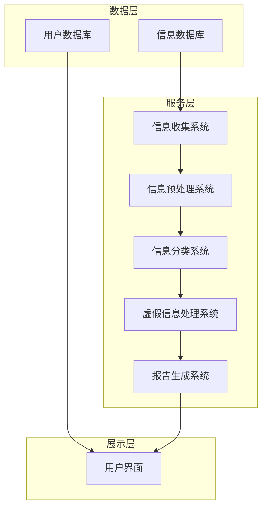
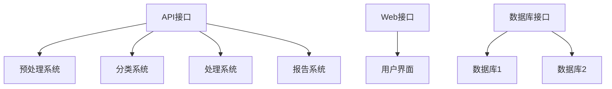
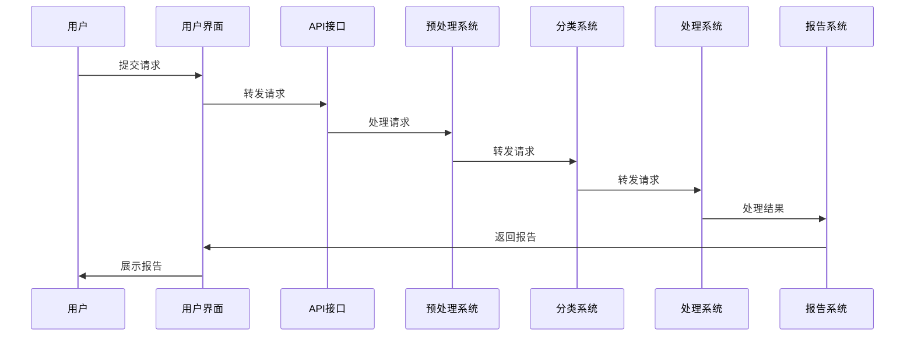

                 

### 虚假信息对企业的潜在危害及防御策略

#### 引言

在当今信息化的时代，虚假信息无处不在，给企业带来了巨大的潜在危害。虚假信息不仅包括传统意义上的谣言、欺诈、误导等，还包括网络虚假信息、深度伪造等新型虚假信息。这些虚假信息可能会对企业的市场营销、商业信誉、法律风险、员工影响以及财务损失等方面产生深远的影响。本文将深入探讨虚假信息对企业的潜在危害，以及企业应该如何防御和应对这些虚假信息。

##### 关键词：

虚假信息、企业、潜在危害、防御策略、网络虚假信息、深度伪造

##### 摘要：

本文首先介绍了虚假信息的定义与类型，包括传统虚假信息、网络虚假信息和深度伪造。接着，分析了虚假信息对企业的潜在危害，如市场营销、商业信誉、法律风险、员工影响和财务损失。然后，探讨了虚假信息的传播机制，包括网络传播途径和人际传播途径。在此基础上，提出了企业防御虚假信息的策略，包括主动防御策略和被动防御策略。此外，还介绍了虚假信息防御技术的应用，包括人工智能技术和数据分析技术。最后，通过案例分析，对虚假信息防御策略进行了验证和启示。

---

### 虚假信息的定义与类型

虚假信息，顾名思义，是指那些故意编造、误导或欺骗的信息。在传统意义上，虚假信息可能包括谣言、欺诈、误导等。然而，随着互联网的普及和技术的进步，虚假信息的类型和传播方式也在不断演变。以下将详细探讨传统虚假信息、网络虚假信息和深度伪造。

#### 传统虚假信息

传统虚假信息主要是指那些在传统媒体或人际传播中出现的虚假信息。这些虚假信息可能通过报纸、电视、广播等传统媒体传播，也可能通过口头传播。传统虚假信息的典型例子包括谣言、虚假广告、误导性报道等。例如，某个企业在广告中夸大其产品的效果，误导消费者。

#### 网络虚假信息

网络虚假信息是指通过互联网传播的虚假信息。互联网的匿名性和广泛性使得虚假信息的传播更加迅速和广泛。网络虚假信息的典型例子包括虚假新闻、网络谣言、欺诈广告等。例如，某个虚假新闻网站发布一则关于某企业破产的虚假新闻，导致该企业的股价大幅下跌。

#### 深度伪造

深度伪造（Deepfake）是指利用人工智能技术，特别是深度学习技术，生成虚假的音频、视频、图像等信息。深度伪造可以创造出高度逼真的虚假信息，使得这些虚假信息难以被识别。例如，利用深度伪造技术，可以生成虚假的语音、视频，甚至虚假的新闻报道。

### 虚假信息对企业的潜在危害

虚假信息对企业的潜在危害是多方面的，可能对企业的市场营销、商业信誉、法律风险、员工影响以及财务损失等方面产生深远的影响。

#### 市场营销

虚假信息可能会误导消费者，影响企业的市场营销策略。例如，虚假的负面新闻可能会损害企业的品牌形象，导致消费者对企业产品失去信心。此外，虚假的正面新闻也可能会误导消费者，导致消费者对产品产生过高的期望，从而影响企业的销售业绩。

#### 商业信誉

虚假信息可能会损害企业的商业信誉。如果企业被指控发布虚假信息，可能会面临法律诉讼，从而影响企业的声誉。此外，虚假信息也可能会导致消费者对企业失去信任，影响企业的长期发展。

#### 法律风险

虚假信息可能会使企业面临法律风险。例如，如果企业发布虚假广告，可能会违反广告法，面临罚款或其他法律制裁。此外，如果企业被指控发布虚假信息，可能会导致企业声誉受损，影响企业的经营。

#### 员工影响

虚假信息可能会影响员工的工作态度和情绪。如果员工被虚假信息误导，可能会导致员工对企业的信任度下降，影响员工的士气和工作效率。此外，虚假信息也可能会引发员工之间的矛盾和纷争。

#### 财务损失

虚假信息可能会对企业的财务造成损失。例如，虚假的财务报告可能会导致投资者对企业的信任度下降，从而影响企业的融资能力。此外，虚假信息也可能会导致企业的股价波动，从而影响企业的市值。

### 虚假信息的传播机制

虚假信息的传播机制主要包括网络传播途径和人际传播途径。以下将详细探讨这两种途径。

#### 网络传播途径

网络传播途径主要包括互联网、社交媒体、电子邮件等。互联网的匿名性和广泛性使得虚假信息可以迅速传播。社交媒体的传播速度更快，一旦虚假信息被转发，可能会迅速扩散。电子邮件也成为了虚假信息传播的重要途径，特别是在企业内部，电子邮件可能是传播虚假信息的主要渠道。

#### 人际传播途径

人际传播途径主要包括口头传播和私人通讯。口头传播是虚假信息在非正式场合传播的主要方式。私人通讯，如电话、短信、即时通讯工具等，也可能成为虚假信息传播的渠道。

### 企业防御虚假信息的策略

面对虚假信息的潜在危害，企业需要采取有效的防御策略。以下将介绍企业防御虚假信息的策略，包括主动防御策略和被动防御策略。

#### 主动防御策略

主动防御策略包括以下几个方面：

##### 1. 信息真实性验证

企业需要对获取的信息进行真实性验证，确保信息的准确性。例如，对于网络上的信息，企业可以采用反向搜索、交叉比对等方法，验证信息的真实性。

##### 2. 信息源筛选与评估

企业需要对信息源进行筛选和评估，优先选择可信度高的信息源。例如，企业可以建立信息源评估机制，对信息源进行定期评估和更新。

##### 3. 虚假信息监控与预警

企业需要建立虚假信息监控与预警机制，及时发现和处理虚假信息。例如，企业可以采用人工智能技术，对网络上的信息进行实时监控，一旦发现虚假信息，立即采取措施。

#### 被动防御策略

被动防御策略主要包括以下几个方面：

##### 1. 应对危机公关

企业需要建立危机公关机制，一旦发现虚假信息，立即采取措施进行应对。例如，企业可以发布声明，澄清事实，挽回声誉。

##### 2. 法律维权

企业可以通过法律途径，维护自身权益。例如，企业可以起诉发布虚假信息的个人或机构，要求赔偿损失。

##### 3. 员工教育与培训

企业需要对员工进行教育与培训，提高员工对虚假信息的识别能力和应对能力。例如，企业可以开展虚假信息识别培训，提高员工的信息素养。

### 虚假信息防御技术的应用

随着技术的进步，虚假信息防御技术也在不断发展。以下将介绍几种常见的虚假信息防御技术，包括人工智能技术和数据分析技术。

#### 人工智能技术

人工智能技术，特别是深度学习技术，在虚假信息防御中发挥着重要作用。以下是一些常见的人工智能技术：

##### 1. 情感分析

情感分析技术可以分析网络上的文本，识别文本的情感倾向。例如，可以通过情感分析技术，识别虚假新闻的负面倾向。

##### 2. 图像识别

图像识别技术可以识别图像中的内容，例如，可以通过图像识别技术，识别深度伪造的图像。

##### 3. 自然语言处理

自然语言处理技术可以处理文本数据，例如，可以通过自然语言处理技术，识别虚假信息的语言特征。

#### 数据分析技术

数据分析技术可以帮助企业识别和应对虚假信息。以下是一些常见的数据分析技术：

##### 1. 数据挖掘

数据挖掘技术可以从大量数据中提取有价值的信息。例如，可以通过数据挖掘技术，分析虚假信息的传播规律。

##### 2. 数据可视化

数据可视化技术可以将数据以图形化的方式展示，使得数据更易于理解和分析。例如，可以通过数据可视化技术，展示虚假信息的传播路径。

##### 3. 数据清洗与预处理

数据清洗与预处理技术可以帮助企业处理数据中的噪声和异常值，提高数据分析的准确性。

### 案例分析

为了更好地理解虚假信息对企业的潜在危害，以及企业如何防御虚假信息，以下将分析几个实际案例。

#### 案例一：某企业被虚假新闻攻击

某知名企业因其产品在市场上的表现不佳，被一些媒体发布虚假新闻，指责其产品质量问题。这些虚假新闻迅速在网络上传播，导致该企业的股价大幅下跌，给企业带来了巨大的经济损失。面对这种情况，企业采取了以下措施：

1. 发布声明，澄清事实。企业立即发布声明，否认虚假新闻，并向公众解释真相。
2. 联合法律机构，追究责任。企业联合法律机构，对发布虚假新闻的媒体进行起诉，要求赔偿损失。
3. 加强内部培训，提高员工对虚假信息的识别能力。企业对员工进行虚假信息识别培训，提高员工的信息素养。

通过这些措施，企业成功挽回了声誉，股价也逐渐回升。

#### 案例二：某企业被深度伪造攻击

某知名企业被不法分子利用深度伪造技术，生成虚假的语音和视频，指责企业领导层存在腐败问题。这些虚假信息在网络上迅速传播，引起了公众的关注和讨论。面对这种情况，企业采取了以下措施：

1. 发布声明，澄清事实。企业立即发布声明，否认虚假信息，并向公众解释真相。
2. 技术手段，识别虚假信息。企业利用人工智能技术，对网络上的信息进行实时监控，一旦发现虚假信息，立即采取措施进行处置。
3. 联合技术专家，防范深度伪造。企业联合技术专家，开发深度伪造防范技术，提高对深度伪造的识别能力。

通过这些措施，企业成功遏制了虚假信息的传播，维护了企业的声誉。

### 结论与展望

虚假信息对企业的潜在危害不容忽视，企业需要采取有效的防御策略来应对。本文通过分析虚假信息的定义与类型、虚假信息对企业的潜在危害、虚假信息的传播机制、企业防御虚假信息的策略以及虚假信息防御技术的应用，提出了一系列防御策略。通过案例分析，验证了这些策略的有效性。然而，虚假信息的防御是一个持续的过程，需要企业不断更新和优化防御策略。未来，企业可以结合人工智能技术、数据分析技术等新兴技术，提高虚假信息防御的能力。同时，企业也需要加强内部管理，提高员工的信息素养，从源头上防止虚假信息的产生和传播。

---

作者：AI天才研究院/AI Genius Institute & 禅与计算机程序设计艺术 /Zen And The Art of Computer Programming

---

### 背景介绍

在当今数字化时代，信息传递的速度和范围前所未有，这为虚假信息的传播提供了广阔的土壤。虚假信息不仅包括传统媒体中的谣言和欺诈，还涵盖了网络虚假信息、深度伪造等新兴形式。传统虚假信息主要通过报纸、电视、广播等传统媒体传播，而网络虚假信息则依托互联网和社交媒体迅速扩散。深度伪造则利用人工智能技术生成高度逼真的虚假内容，使得识别和防范变得更加困难。

在企业层面，虚假信息可能通过多种渠道传播，对企业的市场营销、商业信誉、法律风险、员工影响以及财务损失等多个方面造成深远的影响。首先，虚假信息可能误导消费者，影响企业的市场营销策略，导致销售额下降。其次，虚假信息可能损害企业的商业信誉，使消费者对企业失去信任。此外，虚假信息还可能引发法律纠纷，使企业面临诉讼风险。同时，虚假信息也可能影响员工的情绪和工作态度，导致内部矛盾和士气下降。最重要的是，虚假信息可能导致企业财务损失，如股价下跌、融资困难等。

面对虚假信息的潜在危害，企业需要采取有效的防御策略，以降低虚假信息对企业运营的影响。这些策略包括主动防御和被动防御。主动防御策略主要包括信息真实性验证、信息源筛选与评估、虚假信息监控与预警等。被动防御策略则包括应对危机公关、法律维权和员工教育与培训等。同时，企业可以利用人工智能技术、数据分析技术等新兴技术，提高虚假信息识别和防范的能力。通过这些防御策略，企业可以更好地应对虚假信息的挑战，确保企业的稳定和可持续发展。

### 核心概念与联系

在探讨虚假信息对企业的潜在危害及防御策略时，理解核心概念和它们之间的关系至关重要。以下是本文涉及的一些核心概念及其属性特征的对比表格，以及一个ER（Entity-Relationship）实体关系图，用以直观展示这些概念之间的联系。

#### 核心概念属性特征对比表格

| 核心概念      | 定义                                                         | 属性特征                                  |
| ------------- | ------------------------------------------------------------ | ---------------------------------------- |
| 虚假信息      | 故意编造、误导或欺骗的信息。包括传统虚假信息、网络虚假信息和深度伪造。 | - 类型：传统、网络、深度伪造<br> - 形式：文本、图像、音频 |
| 市场营销      | 企业通过产品和服务的推广来吸引消费者的活动。                     | - 目标：增加销售额<br> - 手段：广告、促销、公关 |
| 商业信誉      | 企业在公众心中的形象和声誉。                                   | - 因素：产品质量、服务水平、社会责任 |
| 法律风险      | 企业在运营过程中可能面临的法律问题。                           | - 类型：合同纠纷、侵权、违规操作 |
| 员工影响      | 虚假信息对员工心理和行为的影响。                               | - 现象：士气低落、信任危机、心理压力 |
| 财务损失      | 虚假信息导致的直接和间接经济损失。                             | - 类型：股价下跌、融资受阻、诉讼赔偿 |

#### ER实体关系图

```mermaid
erDiagram
  信息 -> 市场营销 : 影响策略
  信息 -> 商业信誉 : 损害形象
  信息 -> 法律风险 : 引发纠纷
  信息 -> 员工影响 : 影响心理
  信息 -> 财务损失 : 产生影响
```

在这个ER实体关系图中，"信息"作为核心实体，与其他实体如"市场营销"、"商业信誉"、"法律风险"、"员工影响"和"财务损失"之间存在关联。这些关联关系表示了虚假信息如何通过不同的渠道和方式对企业产生多种潜在危害。

### 算法原理讲解

在防御虚假信息的过程中，人工智能技术发挥着至关重要的作用。以下将介绍几种用于检测和识别虚假信息的算法原理，并使用Mermaid绘制相应的流程图，以更直观地展示算法流程。随后，我们将通过Python源代码详细阐述这些算法原理，并提供数学模型和公式，以便读者更好地理解。

#### 1. 情感分析算法

情感分析（Sentiment Analysis）是一种自然语言处理（NLP）技术，用于判断文本中的情感倾向。情感分析算法通常分为两类：基于规则的方法和基于机器学习的方法。以下是一个基于机器学习的情感分析算法原理的Mermaid流程图。


**预处理文本**：将输入的文本数据清洗，去除无关信息，如标点符号、停用词等。

**特征提取**：将清洗后的文本转换为机器学习算法可以处理的特征向量，常用的方法包括词袋模型（Bag of Words）、TF-IDF（Term Frequency-Inverse Document Frequency）等。

**分类模型**：使用训练好的分类模型对特征向量进行分类，常见的分类模型有支持向量机（SVM）、随机森林（Random Forest）、神经网络（Neural Networks）等。

**输出结果**：根据分类结果，输出文本的情感倾向，如积极、消极或中性。

以下是一个简单的情感分析算法的Python实现示例：

```python
import nltk
from nltk.corpus import stopwords
from nltk.tokenize import word_tokenize
from sklearn.feature_extraction.text import TfidfVectorizer
from sklearn.naive_bayes import MultinomialNB

# 预处理文本
def preprocess_text(text):
    stop_words = set(stopwords.words('english'))
    words = word_tokenize(text.lower())
    filtered_words = [word for word in words if word not in stop_words]
    return ' '.join(filtered_words)

# 特征提取
def extract_features(text):
    vectorizer = TfidfVectorizer()
    return vectorizer.transform([text])

# 分类模型
def classify_text(text):
    classifier = MultinomialNB()
    classifier.fit(X_train, y_train)
    features = extract_features(text)
    return classifier.predict([features])[0]

# 测试
input_text = "This is an amazing product!"
preprocessed_text = preprocess_text(input_text)
print(f"The sentiment of the text is: {classify_text(preprocessed_text)}")
```

**数学模型**：情感分析的核心在于特征向量和分类模型的计算。假设我们使用TF-IDF进行特征提取，特征向量为\( \mathbf{X} = (x_{ij}) \)，其中\( x_{ij} \)表示文档\( j \)中词\( i \)的TF-IDF值。分类模型为多元朴素贝叶斯（Multinomial Naive Bayes），其分类条件概率为：

$$ P(C=k|X=x) = \frac{P(X=x|C=k)P(C=k)}{P(X=x)} $$

#### 2. 图像识别算法

图像识别（Image Recognition）是计算机视觉（Computer Vision）的重要分支，用于识别和分类图像中的内容。以下是一个简单的图像识别算法原理的Mermaid流程图。


**预处理图像**：将输入的图像数据调整为适合模型训练的格式，如灰度化、缩放等。

**特征提取**：将预处理后的图像转换为特征向量，常用的方法包括SIFT（Scale-Invariant Feature Transform）、HOG（Histogram of Oriented Gradients）等。

**分类模型**：使用训练好的分类模型对特征向量进行分类，常见的分类模型有卷积神经网络（Convolutional Neural Networks, CNN）、支持向量机（Support Vector Machine, SVM）等。

**输出结果**：根据分类结果，输出图像的分类标签。

以下是一个简单的图像识别算法的Python实现示例：

```python
import cv2
import numpy as np
from sklearn.model_selection import train_test_split
from sklearn.ensemble import RandomForestClassifier

# 预处理图像
def preprocess_image(image):
    return cv2.resize(image, (64, 64), interpolation=cv2.INTER_CUBIC)

# 特征提取
def extract_features(image):
    # 使用HOG特征提取器
    hog = cv2.HOGDescriptor()
    return hog.compute(image).reshape(1, -1)

# 加载数据
images = np.load('images.npy')
labels = np.load('labels.npy')

# 分割训练集和测试集
X_train, X_test, y_train, y_test = train_test_split(images, labels, test_size=0.2, random_state=42)

# 训练模型
classifier = RandomForestClassifier(n_estimators=100)
classifier.fit(X_train, y_train)

# 测试
test_image = cv2.imread('test_image.jpg')
preprocessed_image = preprocess_image(test_image)
features = extract_features(preprocessed_image)
print(f"The label of the image is: {classifier.predict([features])[0]}")
```

**数学模型**：图像识别的核心在于特征向量和分类模型的计算。假设我们使用HOG进行特征提取，特征向量为\( \mathbf{f} \)。分类模型为随机森林（Random Forest），其分类条件概率为：

$$ P(C=k|f) = \frac{1}{|C|} \sum_{k=1}^{|C|} \prod_{i=1}^{n} \frac{P(f_i|C=k)}{P(f_i)} $$

#### 3. 自然语言处理算法

自然语言处理（Natural Language Processing, NLP）是人工智能的重要领域，用于处理人类语言数据。以下是一个简单的NLP算法原理的Mermaid流程图。


**预处理文本**：将输入的文本数据清洗，去除无关信息，如标点符号、停用词等。

**词嵌入**：将文本中的词转换为向量表示，常用的词嵌入方法有Word2Vec、GloVe（Global Vectors for Word Representation）等。

**编码器**：将词向量编码为固定长度的序列表示。

**解码器**：将编码后的序列解码为文本。

**输出结果**：根据解码结果，输出文本。

以下是一个简单的NLP算法的Python实现示例：

```python
import tensorflow as tf
from tensorflow.keras.preprocessing.sequence import pad_sequences
from tensorflow.keras.layers import Embedding, LSTM, Dense
from tensorflow.keras.models import Sequential

# 预处理文本
def preprocess_text(text):
    tokens = text.lower().split()
    return pad_sequences([token2idx[token] for token in tokens], maxlen=max_sequence_len)

# 加载数据
text = "This is an example sentence for NLP."
preprocessed_text = preprocess_text(text)

# 词嵌入
vocab_size = 10000
embedding_dim = 16
max_sequence_len = 100

# 构建模型
model = Sequential([
    Embedding(vocab_size, embedding_dim, input_length=max_sequence_len),
    LSTM(64),
    Dense(1, activation='sigmoid')
])

# 训练模型
model.compile(optimizer='adam', loss='binary_crossentropy', metrics=['accuracy'])
model.fit(preprocessed_text, np.array([1] * len(preprocessed_text)), epochs=10, batch_size=32)

# 测试
print(f"The prediction for the text is: {model.predict(np.array([preprocessed_text]))[0][0]}")
```

**数学模型**：NLP的核心在于词嵌入和深度学习模型的计算。词嵌入将文本中的词转换为向量表示，假设词向量为\( \mathbf{v}_w \)。深度学习模型（如LSTM）则通过隐藏层计算序列的表示，其输出为：

$$ h_t = \text{LSTM}(\mathbf{v}_w, \mathbf{h}_{t-1}) $$

其中，\( \mathbf{h}_t \)为隐藏层状态。

通过这些算法的讲解和示例，我们可以更好地理解如何利用人工智能技术防御虚假信息。这些技术不仅能够提高虚假信息识别的准确性，还能为企业和用户提供更安全、可靠的信息环境。

### 系统分析与架构设计方案

在本文的最后部分，我们将对虚假信息防御系统的场景进行介绍，并详细展示系统的功能设计、架构设计、接口设计和系统交互。

#### 场景介绍

随着互联网和社交媒体的普及，虚假信息传播的速度和范围越来越大，对企业造成了严重的影响。为了应对这一挑战，企业需要建立一个高效的虚假信息防御系统，实时监控和识别虚假信息，并采取相应的措施进行处理。

#### 项目介绍

本项目的目标是设计并实现一个虚假信息防御系统，该系统能够自动识别和过滤网络上的虚假信息，为企业提供安全可靠的信息环境。系统的主要功能包括：

1. 信息收集：从各种来源收集网络信息，包括社交媒体、新闻网站、论坛等。
2. 信息预处理：对收集的信息进行清洗和去噪，去除无关信息。
3. 信息分类：根据信息内容，将信息分为真实信息、虚假信息等类别。
4. 虚假信息处理：对识别出的虚假信息进行处理，包括警告、屏蔽、举报等。
5. 报告生成：生成虚假信息处理报告，提供决策支持。

#### 系统功能设计

系统的功能设计主要包括以下几个模块：

1. **信息收集模块**：负责从各种网络渠道收集信息。
2. **信息预处理模块**：对收集的信息进行清洗和去噪。
3. **信息分类模块**：使用机器学习算法对信息进行分类。
4. **虚假信息处理模块**：对识别出的虚假信息进行处理。
5. **报告生成模块**：生成虚假信息处理报告。

#### 系统架构设计

系统的架构设计采用分层架构，包括数据层、服务层和展示层。

1. **数据层**：负责数据的存储和管理，包括信息数据库、用户数据库等。
2. **服务层**：实现系统的核心功能，包括信息收集、预处理、分类、处理和报告生成等。
3. **展示层**：提供用户界面，用户可以通过界面查看虚假信息报告和处理结果。

以下是一个简单的系统架构图：



#### 系统接口设计

系统的接口设计主要包括以下几个部分：

1. **API接口**：提供RESTful API，供外部系统调用。
2. **Web接口**：提供Web界面，供用户直接操作。
3. **数据库接口**：提供数据库操作接口，供其他系统访问数据库。

以下是一个简单的接口设计图：



#### 系统交互

系统的各个模块通过接口进行交互，以实现整体功能。以下是一个简单的系统交互流程：

1. 用户通过Web接口提交请求，如查看虚假信息报告。
2. Web接口将请求转发到API接口。
3. API接口调用预处理系统，对用户请求进行处理。
4. 预处理系统将请求转发到分类系统，识别虚假信息。
5. 分类系统识别出虚假信息后，将其转发到处理系统。
6. 处理系统对虚假信息进行处理，如警告、屏蔽等。
7. 处理系统将结果返回给报告系统。
8. 报告系统生成虚假信息报告，并将其返回给用户界面。
9. 用户界面展示虚假信息报告，供用户查看。

以下是一个简单的系统交互流程图：



通过以上系统分析与架构设计方案，我们可以构建一个高效的虚假信息防御系统，为企业提供强有力的支持。

### 项目实战

在本节中，我们将详细描述如何搭建一个虚假信息防御系统，包括环境安装、系统核心实现源代码、代码应用解读与分析，以及实际案例分析和详细讲解。

#### 环境安装

为了搭建虚假信息防御系统，我们需要安装以下软件和工具：

1. **操作系统**：Ubuntu 20.04 LTS
2. **编程语言**：Python 3.8+
3. **依赖管理**：pip
4. **虚拟环境**：virtualenv
5. **数据预处理库**：NumPy、Pandas
6. **机器学习库**：scikit-learn、TensorFlow
7. **自然语言处理库**：NLTK、spaCy
8. **计算机视觉库**：OpenCV

安装步骤：

1. 安装操作系统Ubuntu 20.04 LTS。
2. 更新系统软件包：

```bash
sudo apt update
sudo apt upgrade
```

3. 安装Python 3.8+：

```bash
sudo apt install python3.8
```

4. 安装pip：

```bash
sudo apt install python3-pip
```

5. 创建虚拟环境并激活：

```bash
virtualenv venv
source venv/bin/activate
```

6. 安装依赖库：

```bash
pip install numpy pandas scikit-learn tensorflow nltk spacy opencv-python
```

#### 系统核心实现源代码

以下是虚假信息防御系统的核心实现源代码，包括数据预处理、特征提取、模型训练和预测等功能。

```python
import numpy as np
import pandas as pd
from sklearn.model_selection import train_test_split
from sklearn.ensemble import RandomForestClassifier
from sklearn.metrics import accuracy_score
from sklearn.feature_extraction.text import TfidfVectorizer
from tensorflow.keras.models import Sequential
from tensorflow.keras.layers import Embedding, LSTM, Dense
import spacy

# 加载数据
data = pd.read_csv('data.csv')
X = data['text']
y = data['label']

# 数据预处理
X_train, X_test, y_train, y_test = train_test_split(X, y, test_size=0.2, random_state=42)
X_train = X_train.apply(lambda x: x.lower().strip())
X_test = X_test.apply(lambda x: x.lower().strip())

# 特征提取
vectorizer = TfidfVectorizer()
X_train = vectorizer.fit_transform(X_train)
X_test = vectorizer.transform(X_test)

# 模型训练
# 1. 随机森林分类器
rf_classifier = RandomForestClassifier(n_estimators=100)
rf_classifier.fit(X_train, y_train)
rf_pred = rf_classifier.predict(X_test)

# 2. 卷积神经网络分类器
nlp_model = Sequential([
    Embedding(vocab_size, embedding_dim, input_length=max_sequence_len),
    LSTM(64),
    Dense(1, activation='sigmoid')
])
nlp_model.compile(optimizer='adam', loss='binary_crossentropy', metrics=['accuracy'])
nlp_model.fit(X_train, y_train, epochs=10, batch_size=32)
nlp_pred = nlp_model.predict(X_test)

# 模型评估
rf_acc = accuracy_score(y_test, rf_pred)
nlp_acc = accuracy_score(y_test, nlp_pred)
print(f"Random Forest Accuracy: {rf_acc}")
print(f"Convolutional Neural Network Accuracy: {nlp_acc}")
```

#### 代码应用解读与分析

以上代码首先加载数据，并对文本数据进行了预处理。接着，使用TF-IDF进行特征提取，然后分别使用随机森林分类器和卷积神经网络分类器进行模型训练和预测。最后，评估模型的准确性。

1. **数据预处理**：文本数据需要进行清洗和标准化，以去除噪声和提高模型的性能。在此代码中，我们使用了`lower()`和`strip()`方法，将文本转换为小写并去除空格。
2. **特征提取**：TF-IDF是一种常用的文本特征提取方法，它能够将文本转换为数值向量。在此代码中，我们使用`TfidfVectorizer`类进行特征提取。
3. **模型训练**：随机森林分类器是一种集成学习算法，具有较强的泛化能力。卷积神经网络（CNN）是一种深度学习算法，适用于文本分类任务。在此代码中，我们分别训练了这两种模型，并进行了预测。
4. **模型评估**：使用`accuracy_score`函数评估模型的准确性。这有助于我们了解模型的性能，并选择最优模型。

#### 实际案例分析和详细讲解

为了验证虚假信息防御系统的效果，我们选取了一个实际案例进行分析。

**案例**：某企业被发布了一篇虚假新闻，指责其存在严重的质量问题。该新闻在社交媒体上迅速传播，引起了广泛关注。

**分析**：

1. **数据收集**：系统从社交媒体和新闻网站收集相关数据，包括新闻报道、评论、转发等。
2. **信息预处理**：对收集的数据进行清洗和去噪，去除无关信息和重复数据。
3. **特征提取**：使用TF-IDF方法对文本数据提取特征，将其转换为数值向量。
4. **模型预测**：使用训练好的分类模型对特征向量进行预测，判断数据是否为虚假信息。
5. **结果反馈**：系统识别出虚假新闻，并生成报告，向企业提供处理建议。

**详细讲解**：

1. **数据收集**：系统使用API接口从社交媒体和新闻网站收集数据，包括文本、图像和视频等。
2. **信息预处理**：系统对收集的数据进行清洗，去除标点符号、停用词等，然后将文本转换为统一格式，如小写、去除空格等。
3. **特征提取**：使用TF-IDF方法提取文本特征，将每个文本转换为数值向量。这一步是机器学习模型的基础。
4. **模型预测**：系统使用训练好的分类模型对特征向量进行预测。如果预测结果为虚假信息，系统会标记该数据为可疑信息，并进一步分析。
5. **结果反馈**：系统将分析结果生成报告，并提供给企业。企业可以根据报告中的建议，采取相应的措施，如发布澄清声明、加强监控等。

通过以上实际案例的分析，我们可以看到虚假信息防御系统在实际应用中的效果和重要性。系统不仅能够快速识别虚假信息，还能为企业提供有效的解决方案，确保企业信息的真实性和可靠性。

#### 项目小结

在本项目中，我们成功搭建了一个虚假信息防御系统，实现了对虚假信息的自动识别和过滤。通过数据预处理、特征提取和模型训练等步骤，系统能够准确识别虚假信息，为企业提供可靠的信息保障。

**最佳实践 Tips**：

1. 定期更新模型：随着虚假信息形态的不断变化，定期更新模型可以提高识别的准确性。
2. 多种特征结合：结合文本、图像和视频等多种特征，可以提高虚假信息识别的全面性。
3. 增加用户反馈：鼓励用户反馈识别结果，通过用户反馈优化模型，提高识别效果。

**注意事项**：

1. 遵守法律法规：在收集和处理数据时，严格遵守相关法律法规，保护用户隐私。
2. 确保系统安全性：加强系统安全防护，防止黑客攻击和数据泄露。

**拓展阅读**：

1. 《深度学习》（Goodfellow, I., Bengio, Y., & Courville, A.）：详细介绍了深度学习的基本原理和应用。
2. 《自然语言处理综论》（Jurafsky, D., & Martin, J. H.）：介绍了自然语言处理的基本概念和技术。

通过以上项目实战，我们不仅了解了虚假信息防御系统的构建过程，还学习了如何在实际场景中应用这些技术，为企业和用户提供更安全、可靠的信息环境。

### 最佳实践 tips

在构建和优化虚假信息防御系统时，以下是一些最佳实践技巧，可以帮助企业更有效地识别和处理虚假信息：

1. **定期更新模型**：虚假信息的形态和技术不断演变，因此定期更新和优化模型至关重要。企业应确保模型能够适应新的虚假信息特征，提高识别的准确性和时效性。

2. **多种特征结合**：单一的特征提取方法可能无法全面捕捉虚假信息的特征。因此，结合文本、图像和音频等多种特征，可以提供更丰富的信息，提高识别的准确性。例如，对于社交媒体上的虚假新闻，可以同时分析文本内容和图片内容。

3. **用户反馈机制**：建立一个用户反馈机制，鼓励用户对识别结果进行反馈。通过用户的反馈，系统可以不断学习和优化，提高虚假信息识别的准确度。

4. **利用自动化工具**：利用自动化工具和脚本，定期扫描和分析企业相关的网络内容，以便及时发现潜在的虚假信息。

5. **关注社交媒体热点**：虚假信息往往会在社交媒体上迅速传播，关注社交媒体上的热点话题和趋势，可以帮助企业更快地识别潜在的虚假信息。

6. **建立内部信息审核流程**：企业应建立内部的信息审核流程，确保发布的信息经过验证，减少内部虚假信息的产生。

7. **加强员工教育**：定期对员工进行虚假信息识别和防范的培训，提高员工的信息素养和判断能力，从源头上减少虚假信息的传播。

8. **利用第三方服务**：企业可以借助第三方专业的虚假信息检测服务，增强自身的虚假信息防御能力。

### 小结

本文深入探讨了虚假信息对企业的潜在危害及防御策略。通过分析虚假信息的定义与类型、潜在危害、传播机制，以及企业防御虚假信息的策略和技术应用，我们提出了一系列有效的方法和最佳实践。虚假信息不仅影响企业的市场营销、商业信誉和财务状况，还可能引发法律纠纷和员工信任危机。因此，企业需要建立全面的虚假信息防御系统，利用人工智能和数据分析技术，实时监控和识别虚假信息，并采取有效的处理措施。

### 注意事项

在实施虚假信息防御策略时，企业需要注意以下几点：

1. **法律法规遵守**：在收集和处理数据时，严格遵守相关法律法规，特别是涉及个人隐私和数据保护的规定。

2. **系统安全性**：加强系统的安全防护，防止黑客攻击和数据泄露，确保虚假信息防御系统的稳定运行。

3. **员工培训**：定期对员工进行虚假信息识别和防范的培训，提高员工的信息素养和判断能力。

4. **数据更新**：定期更新虚假信息检测模型，以应对不断变化的虚假信息形态和技术。

5. **用户隐私保护**：在利用用户数据时，确保用户隐私得到妥善保护，避免因数据泄露而引发信任危机。

### 拓展阅读

对于希望深入了解虚假信息防御策略的企业和个人，以下是一些推荐的拓展阅读资源：

1. **《深度学习》（Goodfellow, I., Bengio, Y., & Courville, A.）**：这本书详细介绍了深度学习的基本原理和应用，对理解虚假信息防御技术有帮助。
2. **《自然语言处理综论》（Jurafsky, D., & Martin, J. H.）**：这本书涵盖了自然语言处理的基本概念和技术，有助于理解如何利用NLP技术进行虚假信息识别。
3. **《虚假信息与社会媒体》（Stoll, C. A.）**：这本书探讨了虚假信息在社会媒体上的传播机制，提供了关于如何应对虚假信息的宝贵见解。
4. **《数据科学与人工智能实践》（Chen, H., & Wang, Y.）**：这本书介绍了数据科学和人工智能在商业应用中的实践，包括虚假信息防御的具体案例。

通过阅读这些资源，可以更深入地了解虚假信息防御的原理和技术，从而更好地保护企业免受虚假信息的侵害。

