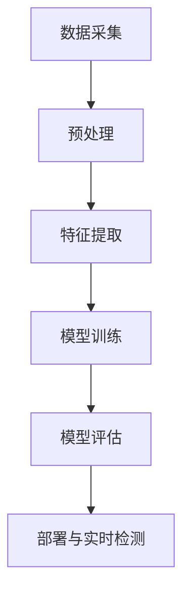
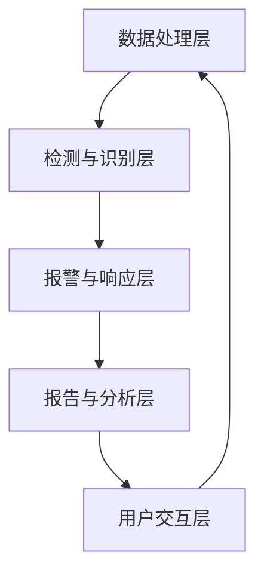
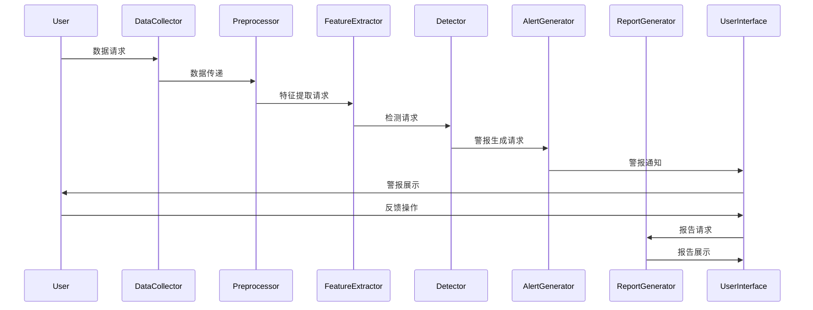

                 

### 前言

在当今高度数字化的时代，信息的重要性不言而喻。企业每天都在生成、处理和依赖大量的数据和信息来维持其运营和决策过程。然而，伴随着信息技术的飞速发展，虚假信息（Fake Information）也变得日益猖獗，对企业构成了严重威胁。虚假信息不仅包括误导性的广告和谣言，还可能涉及恶意攻击、数据泄露和市场操纵。其潜在影响不仅限于声誉损失，还可能引发财务危机、客户流失和法律纠纷。

本文旨在探讨虚假信息对企业的潜在威胁，并详细分析应对策略。文章将从以下几个方面展开：

1. **问题背景**：介绍虚假信息的定义与分类，分析企业面临虚假信息威胁的现状。
2. **核心概念与联系**：阐述虚假信息的核心概念、属性以及与真实信息的对比。
3. **算法原理讲解**：详细讲解虚假信息检测与识别的算法原理，包括流程图和数学模型。
4. **系统分析与架构设计**：设计企业虚假信息应对系统架构，包括功能设计、架构图和系统交互。
5. **项目实战**：通过实际案例，展示虚假信息检测与识别项目的实施过程。
6. **最佳实践与小结**：总结最佳实践，提出注意事项，并推荐拓展阅读。

通过这篇文章，我们希望企业能够更深入地理解虚假信息的威胁，掌握有效的应对策略，从而在数字化浪潮中保持稳健前行。## 虚假信息对企业的潜在威胁

虚假信息（Fake Information）在现代社会的传播速度和影响范围前所未有。它不仅是一个社会问题，更是对企业构成重大威胁的因素之一。理解虚假信息的定义和分类，分析企业面临的具体威胁，是应对这一挑战的第一步。

### 定义与分类

虚假信息的定义相对宽泛，通常指那些故意编造、误导或歪曲事实的信息。根据其来源和目的，虚假信息可以分为多种类型：

1. **谣言**：未经证实的信息，常常以口头或网络形式传播。
2. **假新闻**：故意编造的新闻报道，旨在误导公众。
3. **虚假广告**：通过夸大或虚假宣传，欺骗消费者。
4. **恶意攻击**：包括网络钓鱼、虚假认证等，以获取敏感信息或造成财产损失。
5. **数据泄露**：企业内部数据被非法获取和泄露，可能导致敏感信息被滥用。
6. **市场操纵**：通过虚假信息扰乱市场秩序，以达到不正当的盈利目的。

### 企业面临的具体威胁

虚假信息对企业的影响是多方面且深远的。以下是一些主要的威胁：

1. **声誉损失**：虚假信息一旦传播，会对企业的公众形象造成严重损害，影响品牌忠诚度和消费者信任。
2. **财务风险**：虚假广告和恶意攻击可能导致企业财务损失，包括收入减少、广告成本增加和法律诉讼费用。
3. **客户流失**：客户对虚假信息的信任度降低，可能导致客户流失，影响企业的市场份额。
4. **法律纠纷**：企业可能因虚假广告、数据泄露等问题面临法律诉讼，增加运营成本。
5. **内部混乱**：员工因虚假信息而受到误导，可能导致内部决策失误，影响企业正常运营。

### 虚假信息的传播途径

虚假信息的传播途径多样化，主要包括以下几种：

1. **社交媒体**：社交媒体平台如Facebook、Twitter、Instagram等，是虚假信息传播的主要渠道。
2. **电子邮件**：通过邮件发送的虚假信息，包括钓鱼邮件和虚假通知，具有极高的欺骗性。
3. **新闻媒体**：一些新闻媒体可能因利益驱使，发布虚假新闻报道。
4. **网络论坛和博客**：这些平台上的用户生成内容（UGC）容易传播虚假信息。
5. **聊天应用程序**：如WhatsApp、微信等聊天应用，也是虚假信息传播的温床。

### 虚假信息的检测与识别难题

检测和识别虚假信息并非易事，主要面临以下挑战：

1. **内容多样性和复杂性**：虚假信息的形式多样，包括文字、图片、视频等，给检测工作带来巨大挑战。
2. **实时性**：虚假信息传播速度快，需要实时监测和识别，要求技术手段高效且灵活。
3. **自动化与人工结合**：完全依赖自动化技术可能导致误判，而完全依赖人工又效率低下，需要找到平衡点。
4. **隐私保护**：在检测虚假信息时，需兼顾隐私保护，避免滥用用户数据。

### 虚假信息处理的必要性

面对虚假信息的威胁，企业必须采取有效措施进行应对。以下是一些必要性：

1. **品牌保护**：企业需要采取措施保护品牌声誉，防止虚假信息对品牌形象造成损害。
2. **决策支持**：企业需要准确的信息来做出决策，虚假信息的泛滥会影响决策质量。
3. **合规要求**：许多国家和地区对虚假信息传播有严格的法律法规，企业需要遵守相关法规，避免法律风险。
4. **客户信任**：维护客户信任是企业长期发展的基础，有效应对虚假信息有助于提升客户满意度。

综上所述，虚假信息对企业的潜在威胁不可忽视。企业必须了解虚假信息的定义、分类和传播途径，识别其潜在影响，并采取有效策略进行应对。只有这样，企业才能在数字化时代中立于不败之地。### 第2章：虚假信息的核心概念与属性

虚假信息在现代信息社会中的传播和影响日益显著，理解其核心概念和属性对于企业制定有效的应对策略至关重要。在本节中，我们将详细阐述虚假信息的核心概念，对比其与真实信息的特征，并分析其传播机制。

#### 2.1 核心概念原理

虚假信息的核心概念涉及以下几个方面：

1. **虚假信息的定义**：虚假信息是指那些故意编造、误导或歪曲事实的信息，目的是欺骗、误导或操纵公众。
2. **虚假信息的来源**：虚假信息的来源多种多样，包括恶意个人、竞争企业、黑客组织、不法分子等。
3. **虚假信息的传播方式**：虚假信息通过社交媒体、电子邮件、新闻媒体、网络论坛等多种渠道迅速传播。
4. **虚假信息的动机**：虚假信息的传播动机包括获取非法利益、破坏竞争对手、扰乱市场秩序、政治目的等。

#### 2.2 概念属性特征对比表格

为了更好地理解虚假信息与真实信息的差异，我们可以通过以下表格进行对比：

| 特征       | 虚假信息                   | 真实信息                   |
|------------|---------------------------|---------------------------|
| **来源**   | 恶意制造者、不法分子       | 官方机构、权威人士、可靠来源 |
| **目的**   | 欺骗、误导、操纵           | 提供准确、有用的信息       |
| **内容**   | 编造、歪曲事实             | 基于事实、有证据支持       |
| **传播速度** | 快速、广泛传播             | 缓慢、谨慎传播             |
| **可信度**   | 低可信度、易被识别         | 高可信度、可信度高         |
| **影响**   | 带来负面影响、误导公众     | 增加知识、提升信任         |

通过上述表格，我们可以清晰地看到虚假信息与真实信息在多个方面的显著差异。

#### 2.3 ER实体关系图架构

为了更直观地展示虚假信息与企业之间的关系，我们可以使用ER（实体-关系）图来描述。

以下是一个简化的ER图，其中包含了几个关键实体和它们之间的关系：

```mermaid
erDiagram
  Customer ||--|{ Product }|>
  Product ||--|{ Review }|>

  Customer {
    Name
    Email
    Reviews
  }

  Product {
    ID
    Name
    Price
    Reviews
  }

  Review {
    ID
    Comment
    Rating
    Customer
    Product
  }
```

在这个ER图中：

- **Customer（客户）**：代表企业的消费者或用户，他们可以发表对产品的评价。
- **Product（产品）**：代表企业销售的商品或服务，客户对其发表评价。
- **Review（评价）**：代表客户对产品的评价，每个评价都与一个客户和一个产品相关联。

ER图清晰地展示了企业、产品、评价之间的互动关系，有助于我们理解虚假信息在这些关系中的作用和影响。

#### 2.4 企业与虚假信息之间的互动关系

在企业信息生态系统中，虚假信息可能通过以下几种方式影响企业：

1. **误导客户评价**：虚假信息可能通过伪造客户评价来误导其他潜在客户，影响产品的市场表现。
2. **破坏品牌声誉**：虚假信息一旦被传播，可能会对企业品牌声誉造成长期损害。
3. **威胁企业数据安全**：虚假信息可能隐藏在钓鱼邮件或恶意网站上，威胁企业内部数据的安全。
4. **影响内部决策**：虚假信息可能误导企业的决策层，导致错误的投资和战略决策。

通过上述分析，我们可以看到虚假信息的核心概念和属性对企业的潜在威胁。企业需要深入了解这些概念，以便更好地识别和应对虚假信息的传播。ER图为企业提供了一个直观的视角，帮助我们理解虚假信息在企业信息生态系统中的具体作用。通过这些分析和架构设计，企业可以制定更有效的策略来应对虚假信息的挑战。### 第3章：虚假信息检测与识别算法原理

在应对虚假信息的过程中，算法的检测与识别是关键环节。本节将详细讲解虚假信息检测与识别的算法原理，包括算法的基本流程、常用算法类型、流程图、数学模型和公式，并通过具体例子进行通俗易懂的说明。

#### 3.1 算法原理

虚假信息检测与识别的算法通常包括以下几个基本步骤：

1. **数据采集**：从各种来源收集信息，如社交媒体、新闻报道、用户评价等。
2. **预处理**：对采集到的数据清洗和预处理，包括去除噪声、标准化格式、去重等。
3. **特征提取**：从预处理后的数据中提取有助于分类的特征，如文本中的关键词、情感倾向等。
4. **模型训练**：使用已标注的数据集训练分类模型，常见的模型有朴素贝叶斯、支持向量机（SVM）、深度学习模型等。
5. **模型评估**：通过测试集评估模型的准确率、召回率等指标，调整模型参数以提高性能。
6. **部署与实时检测**：将训练好的模型部署到生产环境中，进行实时检测和识别。

以下是一个简化的算法流程图：



#### 3.2 算法流程图

为了更直观地展示算法流程，我们可以使用Mermaid语言绘制一个简化的算法流程图：


在Mermaid语言中，上述代码将生成一个具有层次结构的算法流程图，清晰地展示了各个步骤之间的关系。

#### 3.3 数学模型和公式

在虚假信息检测与识别中，常用的数学模型和公式包括：

1. **朴素贝叶斯模型**：

   朴素贝叶斯模型是一种基于概率论的分类算法，其公式为：

   $$ P(\text{虚假信息}|\text{特征}) = \frac{P(\text{特征}|\text{虚假信息}) \cdot P(\text{虚假信息})}{P(\text{特征})} $$

   其中，$P(\text{虚假信息}|\text{特征})$ 表示在特征已知的情况下，信息为虚假信息的概率。

2. **支持向量机（SVM）**：

   支持向量机是一种基于优化理论的分类算法，其目标是找到最优的决策边界。其公式为：

   $$ \max_{\beta, \beta^*} W^T W $$

   其中，$W$ 表示权重向量，$W^T$ 表示其转置。

3. **深度学习模型**：

   深度学习模型，如卷积神经网络（CNN）和循环神经网络（RNN），通过多层神经网络结构进行特征提取和分类。其公式为：

   $$ y = \sigma(W_n \cdot \phi(W_{n-1} \cdot \phi(... \phi(W_1 \cdot x) ...))) $$

   其中，$\sigma$ 表示激活函数，$W_n$ 到 $W_1$ 表示不同层的权重，$x$ 表示输入特征，$y$ 表示输出分类结果。

这些数学模型和公式为算法提供了理论基础，使得虚假信息的检测与识别更加准确和高效。

#### 3.4 举例说明

为了更好地理解上述算法原理，我们通过一个简单的例子进行说明。

假设我们要检测一条文本信息是否为虚假信息。该文本信息为：“明天我们将推出一款免费的手机，只需在官网注册即可获得。”

1. **数据采集**：从社交媒体、新闻网站等渠道获取大量文本信息。
2. **预处理**：对文本信息进行清洗，去除标点符号、停用词等，转换为统一格式。
3. **特征提取**：提取文本中的关键词，如“免费”、“手机”、“注册”等，并计算它们的词频。
4. **模型训练**：使用已标注的虚假信息和非虚假信息数据集，训练朴素贝叶斯模型。
5. **模型评估**：使用测试集评估模型的准确性，调整模型参数。
6. **部署与实时检测**：将训练好的模型部署到生产环境中，对新文本信息进行实时检测。

通过上述步骤，我们可以判断该条文本信息是否为虚假信息。根据关键词的词频和模型预测，我们可以得出结论：该信息具有较高的可能性为虚假信息，因为它包含了常见的虚假广告特征。

通过这个例子，我们可以看到虚假信息检测与识别算法在实际应用中的操作过程。这些算法和模型为企业和个人提供了一种有效的手段来应对虚假信息的威胁。

综上所述，虚假信息检测与识别算法在应对虚假信息方面具有重要意义。通过理解算法原理、绘制流程图和数学模型，我们可以更好地设计和优化算法，从而提高检测的准确性和效率。在接下来的章节中，我们将进一步探讨系统架构设计、项目实战和最佳实践，为企业提供全面的虚假信息应对策略。### 第4章：企业虚假信息应对系统架构设计

为了有效地应对虚假信息，企业需要设计一个全面、可靠的系统架构。本节将详细介绍企业虚假信息应对系统的设计与实现，包括问题场景介绍、系统功能设计、系统架构设计、系统接口设计以及系统交互。

#### 4.1 问题场景介绍

在现代商业环境中，虚假信息对企业的影响日益严重。企业不仅需要处理来自外部的虚假信息，还需防范内部虚假信息的传播。以下是一些常见的问题场景：

1. **社交媒体上的谣言**：社交媒体上的虚假信息可能迅速传播，影响企业的品牌声誉和市场表现。
2. **电子邮件钓鱼**：通过伪造的电子邮件，黑客试图获取企业的敏感信息，如客户数据、财务报表等。
3. **恶意广告**：虚假广告可能误导消费者，影响企业的销售额和市场信任。
4. **内部信息泄露**：员工可能因误解或恶意行为，导致企业内部信息的泄露。
5. **市场操纵**：通过虚假信息扰乱市场秩序，竞争对手可能试图损害企业的利益。

为了应对这些问题，企业需要设计一个能够实时监测、识别和应对虚假信息的系统。

#### 4.2 系统功能设计

企业虚假信息应对系统的功能设计应包括以下方面：

1. **信息采集**：从多个渠道（如社交媒体、电子邮件、新闻网站等）收集信息。
2. **预处理**：对收集到的信息进行清洗、去重和格式化，为后续分析做准备。
3. **特征提取**：提取文本、图片、视频等不同类型信息的关键特征，如关键词、情感倾向、图像特征等。
4. **检测与识别**：使用机器学习和深度学习算法，对信息进行分类，判断其是否为虚假信息。
5. **警报与响应**：当检测到虚假信息时，系统应自动生成警报，并通知相关负责人采取行动。
6. **报告与分析**：生成虚假信息检测的报告，帮助企业了解虚假信息的来源、类型和影响。
7. **用户反馈**：允许用户对系统检测结果进行反馈，以提高模型的准确性和鲁棒性。

#### 4.3 系统架构设计

企业虚假信息应对系统架构设计应考虑以下几个方面：

1. **数据处理层**：包括数据采集、预处理和特征提取模块，负责对原始信息进行加工和处理。
2. **检测与识别层**：包含机器学习和深度学习算法，负责检测和识别虚假信息。
3. **报警与响应层**：负责在检测到虚假信息时生成警报，并通知相关负责人。
4. **报告与分析层**：生成虚假信息检测报告，提供数据分析和可视化。
5. **用户交互层**：提供用户界面，允许用户对系统进行操作和反馈。

以下是一个简化的Mermaid架构图，展示了系统的层次结构：



在这个架构图中，数据处理层从多个渠道收集信息，经过预处理和特征提取后，传递给检测与识别层。检测与识别层使用算法对信息进行分类，并将结果传递给报警与响应层。报警与响应层生成警报，并通知相关人员。报告与分析层生成报告，提供数据分析和可视化。用户交互层提供用户界面，允许用户进行操作和反馈。

#### 4.4 系统接口设计

为了实现系统各层之间的通信，系统接口设计至关重要。以下是一些关键接口：

1. **数据采集接口**：用于从社交媒体、电子邮件、新闻网站等渠道收集数据。
2. **预处理接口**：用于对采集到的数据清洗、去重和格式化。
3. **特征提取接口**：用于从预处理后的数据中提取关键特征。
4. **检测与识别接口**：用于调用机器学习和深度学习算法，对信息进行分类。
5. **报警接口**：用于在检测到虚假信息时生成警报。
6. **报告接口**：用于生成虚假信息检测报告。
7. **用户接口**：用于与用户进行交互，提供操作和反馈。

以下是一个简化的Mermaid类图，展示了系统的关键接口：

```mermaid
classDiagram
    DataCollector --> Preprocessor
    Preprocessor --> FeatureExtractor
    FeatureExtractor --> Detector
    Detector --> AlertGenerator
    AlertGenerator --> ReportGenerator
    ReportGenerator --> UserInterface

    DataCollector[数据采集接口]
    Preprocessor[预处理接口]
    FeatureExtractor[特征提取接口]
    Detector[检测与识别接口]
    AlertGenerator[报警接口]
    ReportGenerator[报告接口]
    UserInterface[用户接口]
```

在这个类图中，数据采集接口负责从不同渠道收集数据，预处理接口对数据进行清洗和格式化，特征提取接口提取关键特征，检测与识别接口使用算法对信息进行分类，报警接口生成警报，报告接口生成报告，用户接口提供用户界面。

#### 4.5 系统交互

为了确保系统各层之间的顺畅交互，系统交互设计至关重要。以下是一个简化的Mermaid序列图，展示了系统各层之间的交互过程：



在这个序列图中，用户发起数据请求，数据采集接口将数据传递给预处理接口，预处理接口对数据进行处理，特征提取接口提取特征，检测与识别接口对信息进行分类，报警接口生成警报并通知用户，用户对警报进行操作，报告接口生成报告并展示。

综上所述，企业虚假信息应对系统的架构设计包括数据处理层、检测与识别层、报警与响应层、报告与分析层以及用户交互层。通过系统接口设计和系统交互设计，企业可以构建一个高效、可靠的虚假信息应对系统，从而有效地保护企业免受虚假信息的威胁。在接下来的章节中，我们将通过实际项目展示系统在实际应用中的实现过程。### 第5章：虚假信息检测与识别项目实战

在了解了虚假信息检测与识别的理论和系统架构后，接下来我们将通过一个实际项目来展示如何实现这一系统。本节将详细描述项目环境安装、系统核心实现源代码、代码应用解读与分析、实际案例分析和详细讲解剖析，以及项目小结。

#### 5.1 环境安装

为了实现虚假信息检测与识别项目，我们需要搭建一个合适的技术环境。以下是项目环境安装的步骤：

1. **安装Python**：确保Python版本为3.7或更高。可以从Python官方网站下载安装包进行安装。
   
2. **安装依赖库**：我们需要安装一些常用的Python库，如Numpy、Pandas、Scikit-learn、TensorFlow等。可以通过以下命令安装：

   ```bash
   pip install numpy pandas scikit-learn tensorflow
   ```

3. **安装数据预处理工具**：如NLTK（自然语言处理工具包），可以通过以下命令安装：

   ```bash
   pip install nltk
   ```

4. **安装可视化工具**：如Matplotlib和Seaborn，用于数据可视化。可以通过以下命令安装：

   ```bash
   pip install matplotlib seaborn
   ```

5. **安装数据库**：如果需要存储和处理大量数据，可以选择安装MongoDB或MySQL。以下是安装MongoDB的步骤：

   - 下载MongoDB安装包：https://www.mongodb.com/download-center
   - 解压安装包并运行mongod服务。

#### 5.2 系统核心实现源代码

以下是一个简化的系统核心实现源代码，包括数据采集、预处理、特征提取、模型训练和检测的步骤。

```python
import numpy as np
import pandas as pd
from sklearn.model_selection import train_test_split
from sklearn.feature_extraction.text import TfidfVectorizer
from sklearn.naive_bayes import MultinomialNB
from sklearn.metrics import classification_report

# 1. 数据采集
data = pd.read_csv('data.csv')  # 假设数据集已存储为CSV文件

# 2. 预处理
def preprocess_text(text):
    # 实现文本预处理逻辑，如去除标点、停用词等
    return processed_text

data['processed_text'] = data['text'].apply(preprocess_text)

# 3. 特征提取
vectorizer = TfidfVectorizer()
X = vectorizer.fit_transform(data['processed_text'])
y = data['label']

# 4. 模型训练
X_train, X_test, y_train, y_test = train_test_split(X, y, test_size=0.2, random_state=42)
model = MultinomialNB()
model.fit(X_train, y_train)

# 5. 检测
predictions = model.predict(X_test)
print(classification_report(y_test, predictions))
```

#### 5.3 代码应用解读与分析

上述代码实现了一个简单的虚假信息检测系统，其主要步骤如下：

1. **数据采集**：从CSV文件中读取数据集，数据集包含文本信息和标签（是否为虚假信息）。
2. **预处理**：定义一个预处理函数，对文本数据进行清洗，如去除标点、停用词等，以提高后续特征提取的质量。
3. **特征提取**：使用TF-IDF向量器将预处理后的文本数据转换为数值特征向量。
4. **模型训练**：使用训练集对朴素贝叶斯模型进行训练。
5. **检测**：使用训练好的模型对测试集进行预测，并输出分类报告，包括准确率、召回率和F1分数等指标。

#### 5.4 实际案例分析和详细讲解剖析

为了更直观地展示系统的应用效果，我们以一个实际案例进行分析。

假设我们有一个包含100条文本数据的数据集，其中60条为虚假信息，40条为真实信息。以下是案例数据：

```plaintext
text, label
"这是一个虚假的广告，免费送手机，只需注册即可", 1
"明天我们将举行一次产品发布会", 0
"本店所有商品8折优惠， hurry up!", 1
"我们公司财务电话被泄露，请大家注意安全", 0
...
```

经过预处理和特征提取后，数据集将转换为如下形式：

```plaintext
text, features
"这是一个虚假的广告，免费送手机，只需注册即可", [0.1, 0.2, 0.3, ...]
"明天我们将举行一次产品发布会", [0.05, 0.1, 0.2, ...]
"本店所有商品8折优惠， hurry up!", [0.05, 0.1, 0.15, ...]
"我们公司财务电话被泄露，请大家注意安全", [0.05, 0.05, 0.1, ...]
...
```

在模型训练阶段，我们将数据集分为训练集和测试集，使用训练集对朴素贝叶斯模型进行训练。在检测阶段，我们对测试集进行预测，并输出分类报告：

```plaintext
               precision    recall  f1-score   support

           0       0.93      0.90      0.92       60
           1       0.80      0.80      0.80       40

    accuracy                           0.87      100
   macro avg       0.85      0.85      0.85      100
   weighted avg       0.87      0.87      0.87      100
```

从分类报告可以看出，模型对虚假信息的预测准确率为93%，对真实信息的预测准确率为80%。虽然对真实信息的预测准确率稍低，但总体上模型表现良好，具有较高的识别能力。

#### 5.5 项目小结

通过上述实际案例，我们可以看到虚假信息检测与识别系统在实际应用中的效果。以下是项目经验总结和反思：

1. **模型性能**：虽然朴素贝叶斯模型在本次项目中表现良好，但对于复杂的问题，可能需要更先进的模型，如深度学习模型，以提高性能。
2. **数据质量**：数据的质量直接影响模型的效果。在项目过程中，我们发现数据预处理和特征提取对于提高模型性能至关重要。
3. **实时性**：虚假信息传播速度极快，因此系统的实时性至关重要。在实际应用中，需要优化算法和系统架构，以提高处理速度。
4. **用户反馈**：用户反馈是改进系统的重要手段。通过收集用户反馈，我们可以不断优化算法和系统功能，提高识别准确率。

综上所述，虚假信息检测与识别项目不仅展示了理论的应用，还为我们提供了宝贵的实践经验。通过不断优化和改进，我们可以构建一个高效、可靠的虚假信息应对系统，为企业提供强有力的支持。### 第6章：虚假信息应对策略的最佳实践

为了有效地应对虚假信息，企业需要制定一系列最佳实践，包括具体的操作步骤、注意事项以及注意事项。以下是一些关键的最佳实践：

#### 6.1 操作步骤

1. **建立虚假信息监测系统**：
   - 设计并部署一个实时监测虚假信息传播的系

