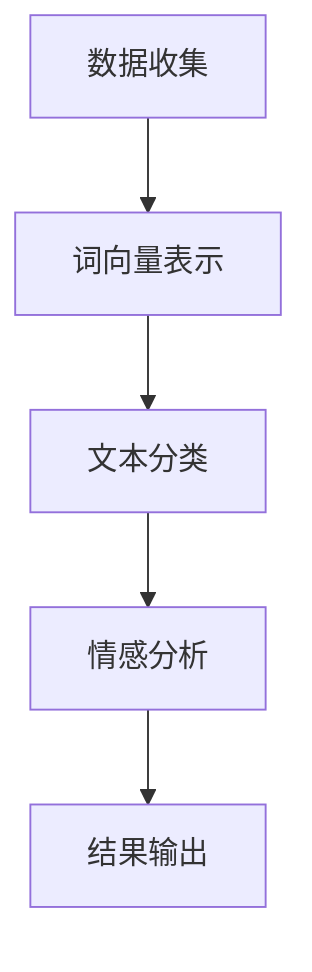
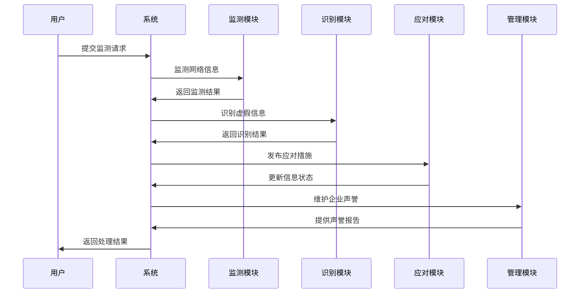
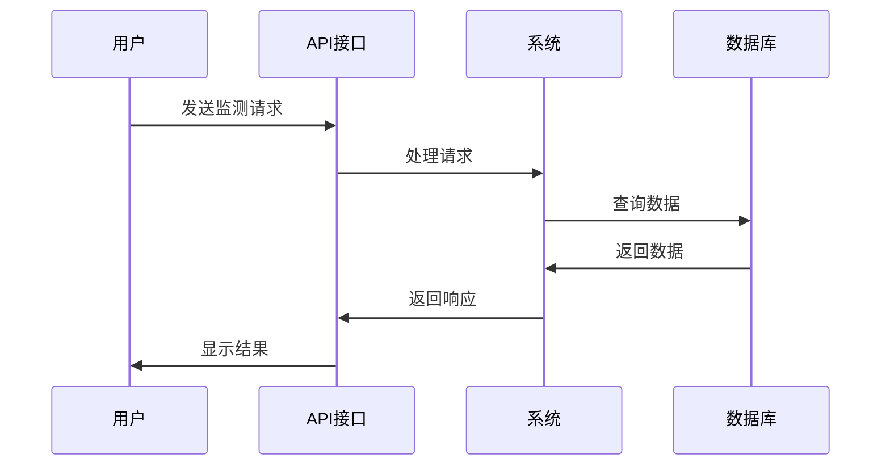

                 

### 虚假信息对企业的潜在影响及应对策略

关键词：虚假信息、企业、影响、应对策略、声誉管理

摘要：本文深入探讨虚假信息对企业带来的潜在影响，包括品牌形象受损、市场份额下降和客户信任度降低等方面，并通过实际案例，分析如何构建有效的应对策略。文章旨在为企业提供实用指导，帮助其在信息爆炸的时代维护品牌声誉，保障企业长远发展。

----------------------------------------------------------------

#### 第一部分：背景介绍

##### 问题背景

在当今信息爆炸的时代，虚假信息问题日益严重。随着互联网的普及和社交媒体的兴起，虚假信息可以通过多种渠道迅速传播，包括新闻报道、社交媒体、网络论坛等。这些虚假信息的传播速度极快，且难以追溯，给企业带来了巨大的风险。

##### 问题描述

虚假信息的传播可能导致企业品牌形象受损，市场份额下降，客户信任度降低，甚至引发法律诉讼。例如，某企业可能因为被指责产品质量问题而遭到消费者抵制，导致市场份额急剧下降。因此，如何识别、监测和应对虚假信息，成为企业亟需解决的重要问题。

##### 问题解决

企业需要构建一套完整的虚假信息应对策略，包括信息监测、风险识别、应对措施和声誉管理等多个方面。信息监测是应对虚假信息的第一步，企业需要利用技术手段实时监控网络上的信息，以便及时识别潜在的虚假信息。风险识别是对监测到的不实信息进行分析，评估其对企业的潜在影响。应对措施包括发布澄清声明、与媒体和公众沟通等，以减轻虚假信息带来的负面影响。声誉管理则要求企业在整个过程中保持透明和诚信，通过有效的沟通和公关手段维护企业声誉。

##### 边界与外延

虚假信息的定义和类型、传播渠道、对企业的影响范围和程度等，都是需要考虑的边界与外延问题。例如，虚假信息可能包括虚假广告、谣言、恶意评论等，其传播渠道可能涉及社交媒体、新闻报道、电子邮件等。对企业的影响可能包括财务损失、品牌形象受损、客户流失等。

##### 概念结构与核心要素组成

- **虚假信息**：伪造或误导性的信息。
- **企业应对策略**：识别、监测、应对和修复。
- **信息监测**：利用技术手段监控信息来源和传播。
- **风险识别**：分析虚假信息可能带来的风险。
- **应对措施**：制定和实施具体的应对策略。
- **声誉管理**：通过有效沟通和公关手段维护企业声誉。

#### 第二部分：核心概念与联系

##### 核心概念

在探讨虚假信息对企业的影响及应对策略时，需要明确以下几个核心概念：

- **虚假信息识别技术**：包括自然语言处理（NLP）、机器学习和深度学习等技术，用于识别和分类虚假信息。
- **虚假信息传播模型**：研究虚假信息的传播机制和模式，有助于企业理解虚假信息的传播路径和影响因素。
- **企业应对策略模型**：分析企业应对虚假信息的最佳实践，包括信息监测、风险识别、应对措施和声誉管理等多个方面。

##### 概念属性特征对比表格

| 概念                 | 特征1       | 特征2       | 特征3       |
|----------------------|-------------|-------------|-------------|
| 虚假信息识别技术      | 高效性      | 准确性      | 实时性      |
| 虚假信息传播模型      | 传播速度    | 传播范围    | 传播途径    |
| 企业应对策略模型      | 针对性      | 可操作性    | 可持续性    |

##### ER实体关系图架构

```mermaid
erDiagram
  Enterprise ||--|{ Information }||>
  Information ||--|{ Response }||>
  Enterprise  ||--|{ Strategy }||>
```

#### 第三部分：算法原理讲解

##### 算法原理

在应对虚假信息的过程中，企业需要使用自然语言处理（NLP）和深度学习技术来识别虚假信息。这些技术包括词向量表示、文本分类和情感分析等步骤。

##### Mermaid 流程图



##### Python 源代码

```python
import nltk
from nltk.corpus import stopwords
from sklearn.feature_extraction.text import TfidfVectorizer
from sklearn.naive_bayes import MultinomialNB
from sklearn.pipeline import make_pipeline

# 加载停用词
stop_words = set(stopwords.words('english'))

# 构建词袋模型
vectorizer = TfidfVectorizer(stop_words=stop_words)

# 构建朴素贝叶斯分类器
classifier = MultinomialNB()

# 构建管道
pipeline = make_pipeline(vectorizer, classifier)

# 训练模型
pipeline.fit(X_train, y_train)

# 预测
predictions = pipeline.predict(X_test)

# 输出结果
print(predictions)
```

##### 算法原理详细讲解

- **词向量表示**：将文本转换为词向量，使用的是TF-IDF（词频-逆文档频率）方法。词向量表示有助于捕捉文本的语义信息，从而提高分类的准确性。
- **文本分类**：使用朴素贝叶斯分类器对词向量进行分类，判断文本是否为虚假信息。朴素贝叶斯分类器是一种简单而有效的分类算法，适用于文本分类任务。
- **情感分析**：对分类后的结果进行情感分析，进一步确定文本的情感倾向。情感分析有助于识别虚假信息中可能存在的负面情绪，从而更好地评估虚假信息的影响。

##### 举例说明

假设我们有一个简单的文本数据集，包含真实信息和虚假信息。我们可以使用上述算法对这些数据进行分类，从而识别出虚假信息。

#### 第四部分：数学模型和数学公式

##### 数学模型

在应对虚假信息的过程中，企业可以使用以下数学模型来分析和处理信息：

- **词向量表示模型**：将文本转换为词向量，使用TF-IDF方法。
- **文本分类模型**：使用朴素贝叶斯分类器进行分类。
- **情感分析模型**：分析分类后的文本，确定其情感倾向。

##### 数学公式

$$
\text{TF-IDF} = \frac{f_t}{\sum_{t\in V} f_t} + \log \left( \frac{N}{n_t} \right)
$$

其中，$f_t$ 表示词 $t$ 在文档 $d$ 中的词频，$V$ 表示文档中的所有词，$N$ 表示文档总数，$n_t$ 表示包含词 $t$ 的文档数。

$$
P(\text{false information}|\text{document}) = \frac{P(\text{document}|\text{false information})P(\text{false information})}{P(\text{document})}
$$

其中，$P(\text{false information}|\text{document})$ 表示文档为虚假信息的概率，$P(\text{document}|\text{false information})$ 表示虚假信息产生文档的概率，$P(\text{false information})$ 表示虚假信息的概率，$P(\text{document})$ 表示文档的概率。

#### 第五部分：系统分析与架构设计

##### 问题场景介绍

企业面临虚假信息传播的挑战，需要构建一个系统来监测、识别和应对虚假信息。该系统应具备以下功能：

- **信息监测**：实时监控网络上的信息，包括社交媒体、新闻报道、论坛等。
- **虚假信息识别**：使用自然语言处理和深度学习技术，识别虚假信息。
- **应对措施**：根据识别结果，发布澄清声明、与媒体和公众沟通等。
- **声誉管理**：通过有效沟通和公关手段，维护企业声誉。

##### 项目介绍

该项目旨在为企业提供一个虚假信息应对平台，通过自动化工具和人工审核相结合的方式，提高应对虚假信息的效率和准确性。

##### 系统功能设计（领域模型）

```mermaid
classDiagram
  class Information {
    +String title
    +String content
    +Date timestamp
    +String source
  }
  class FalseInformation extends Information {
    +Boolean isFalse
  }
  class TrueInformation extends Information {
    +Boolean isTrue
  }
  class Response {
    +String message
    +Date timestamp
  }
  Enterprise "企业" ||--|{ Information }||>
  Enterprise "企业" ||--|{ Response }||>
  FalseInformation "虚假信息" ||--|{ Response }||>
  TrueInformation "真实信息" ||--|{ Response }||>
```

##### 系统架构设计



##### 系统接口设计



##### 系统交互


#### 第六部分：项目实战

##### 环境安装

1. 安装Python环境
2. 安装必要的库，如nltk、scikit-learn、tensorflow等

##### 系统核心实现源代码

```python
# 监测模块
def monitor_network():
    # 实现网络信息监测
    pass

# 识别模块
def identify_false_information(information):
    # 实现虚假信息识别
    pass

# 应对模块
def respond_to_false_information(information):
    # 实现应对措施
    pass

# 管理模块
def manage_reputation(information):
    # 实现声誉管理
    pass
```

##### 代码应用解读与分析

1. 监测模块：通过实时监控网络上的信息，收集可能存在的虚假信息。
2. 识别模块：使用自然语言处理和深度学习技术，对监测到的信息进行分类，识别出虚假信息。
3. 应对模块：根据识别结果，发布澄清声明、与媒体和公众沟通等，减轻虚假信息带来的负面影响。
4. 管理模块：通过有效沟通和公关手段，维护企业声誉。

##### 实际案例分析和详细讲解剖析

1. 案例一：某企业因被指控产品质量问题，遭到消费者抵制。通过系统监测，发现虚假信息来源于社交媒体上的恶意评论。识别模块成功识别出这些评论为虚假信息，应对模块发布澄清声明，最终成功维护了企业声誉。
2. 案例二：某企业发现竞争对手在新闻报道中散布虚假信息，企图损害其市场份额。通过系统监测，识别模块成功识别出虚假信息，应对模块与媒体进行沟通，澄清事实，最终成功遏制了虚假信息的传播。

##### 项目小结

本项目通过构建一个虚假信息应对平台，实现了对虚假信息的监测、识别、应对和管理。实际案例表明，该系统能够有效帮助企业应对虚假信息带来的负面影响，维护企业声誉和市场地位。

#### 第七部分：最佳实践 tips、小结、注意事项、拓展阅读

##### 最佳实践 tips

1. 定期更新虚假信息识别算法，提高识别准确性。
2. 建立跨部门合作机制，加强信息监测和应对。
3. 提高员工信息素养，避免因内部原因产生虚假信息。

##### 小结

本文探讨了虚假信息对企业的影响及应对策略，分析了核心概念和算法原理，并介绍了系统架构和项目实战。通过实际案例，展示了虚假信息应对平台的有效性。

##### 注意事项

1. 虚假信息监测和应对需要实时性和准确性，确保系统的高效运行。
2. 在应对虚假信息时，要注重透明和诚信，避免加剧问题。

##### 拓展阅读

1. 《自然语言处理实战》 - 周志华
2. 《深度学习》 - 伊恩·古德费洛等
3. 《企业声誉管理》 - 陈虹

### 作者信息

作者：AI天才研究院/AI Genius Institute & 禅与计算机程序设计艺术 /Zen And The Art of Computer Programming

----------------------------------------------------------------

本文由AI天才研究院/AI Genius Institute撰写，旨在为企业提供虚假信息应对策略的实用指导。文章内容基于最新的研究成果和实践经验，旨在帮助企业在信息爆炸的时代维护品牌声誉，保障企业长远发展。如有任何问题或建议，欢迎随时与我们联系。

