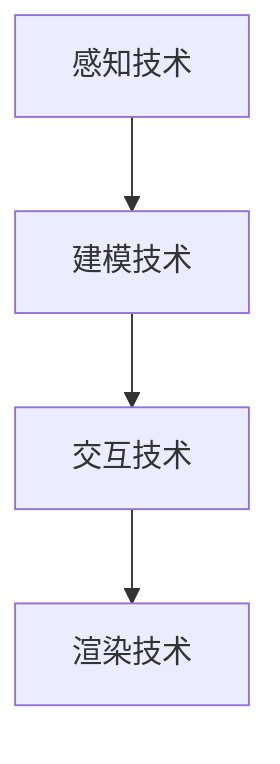
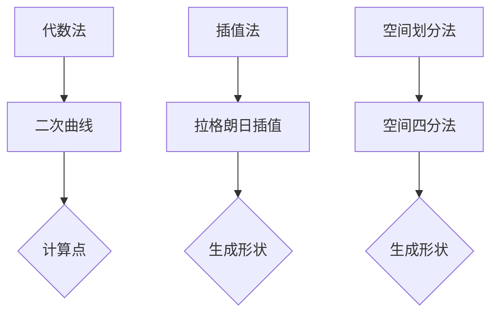
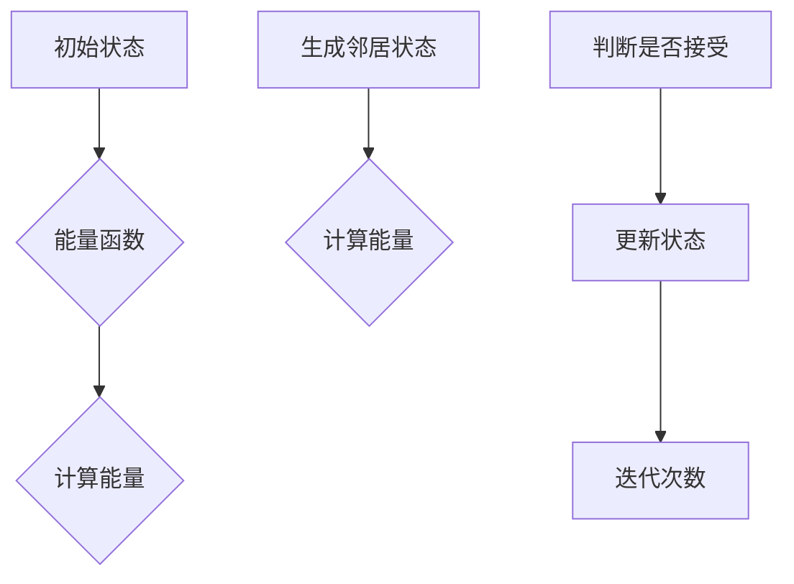
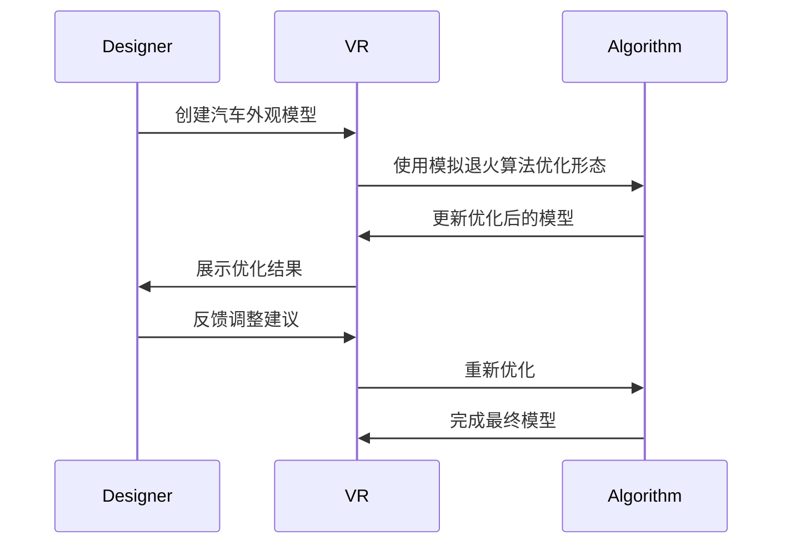
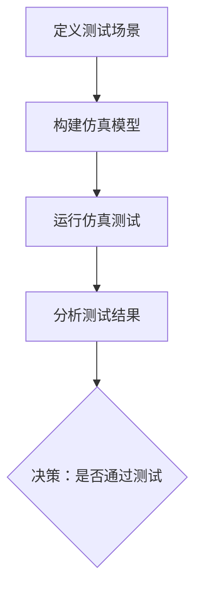
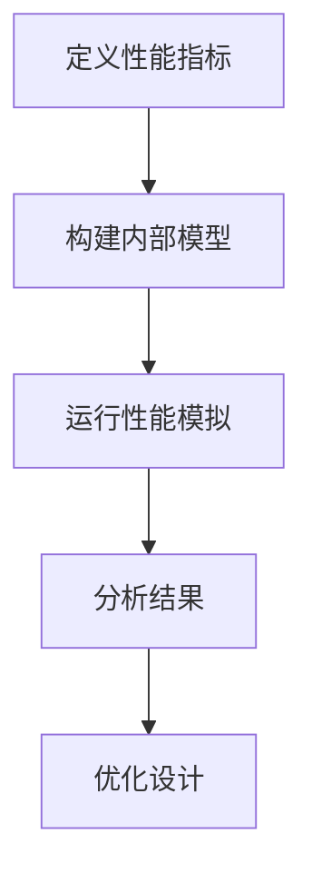
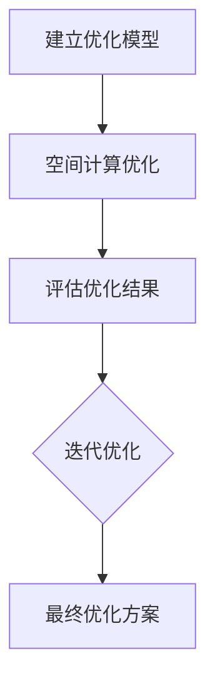
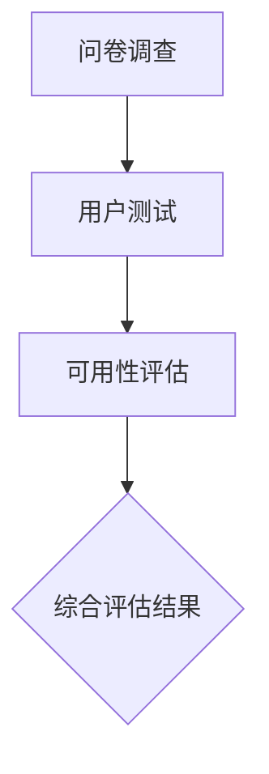
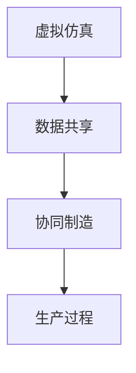
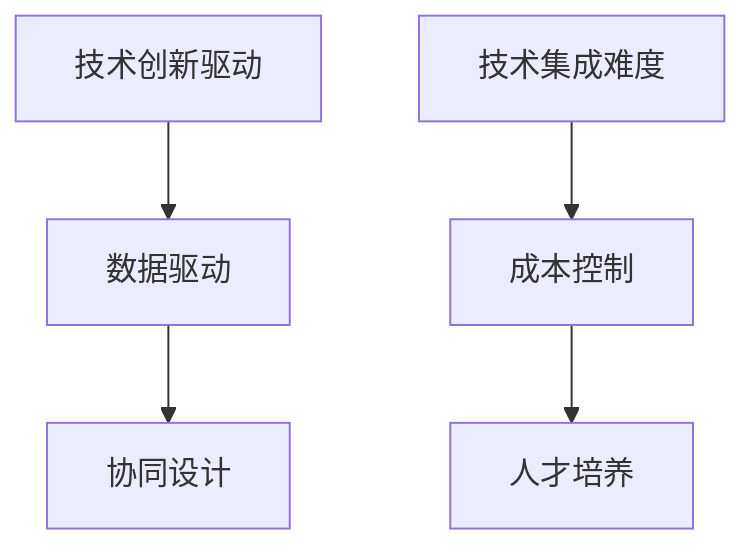

                 


### 文章标题

《虚拟产品设计：空间计算在制造业的创新应用》

### 关键词

- 虚拟产品设计
- 空间计算
- 制造业
- 创新应用

### 摘要

本文深入探讨了虚拟产品设计与空间计算技术在制造业中的应用。首先，我们概述了虚拟产品设计与空间计算的基本概念和技术原理。接着，文章详细分析了空间计算在产品造型设计、功能模拟与性能分析、交互设计等方面的具体应用。通过实际案例解析，我们展示了空间计算在制造业中的创新潜力。文章最后提出了制造业集成与未来展望，为读者提供了全面的指导与启示。

### 第一部分：背景与基础

#### 第1章：虚拟产品设计概述

##### 1.1 虚拟产品设计的基本概念

虚拟产品设计是指通过计算机技术模拟现实世界中的产品，从而在虚拟环境中进行设计、分析、优化和评估。它不仅能够减少物理样机制造成本，还能提高设计效率和产品质量。

**核心概念与联系：**

| 核心概念 | 定义 |
| --- | --- |
| 虚拟设计 | 利用计算机模拟现实产品 |
| 产品设计 | 创造满足特定需求的产品 |
| 计算机辅助设计（CAD） | 利用计算机工具进行设计 |

**ER实体关系图架构：**

```mermaid
erDiagram
  Product Design ||--|{ Virtual Design }|| Virtual Design
  Product Design ||--|{ CAD }|| CAD
```

##### 1.2 虚拟设计与传统设计的区别

传统设计依赖于物理样机，而虚拟设计则通过数字模型进行。虚拟设计不仅能够缩短设计周期，还能提高设计精度和可修改性。

**概念属性特征对比表格：**

| 特征 | 传统设计 | 虚拟设计 |
| --- | --- | --- |
| 成本 | 高 | 低 |
| 周期 | 长 | 短 |
| 精度 | 低 | 高 |
| 可修改性 | 低 | 高 |

##### 1.3 虚拟设计的发展历程

虚拟设计起源于20世纪60年代的计算机辅助设计，随着计算机技术的不断发展，虚拟设计的应用范围和深度不断拓展，从简单的二维草图发展到复杂的三维建模和仿真分析。

**发展历程：**

1. **1960s: 计算机辅助设计（CAD）的诞生。**
2. **1980s: 三维建模技术的兴起。**
3. **1990s: 虚拟现实（VR）技术的应用。**
4. **2000s: 网络协同设计与制造。**
5. **2010s: 大数据和人工智能推动虚拟设计智能化。**

#### 第2章：空间计算技术基础

##### 2.1 空间计算的定义与原理

空间计算是一种利用计算机处理和模拟现实空间中对象的技术。它通过虚拟现实、增强现实、混合现实等技术，实现人与虚拟环境的交互。

**核心概念与联系：**

| 核心概念 | 定义 |
| --- | --- |
| 空间计算 | 利用计算机技术模拟和处理现实空间 |
| 虚拟现实（VR） | 创造虚拟环境 |
| 增强现实（AR） | 在现实环境中叠加虚拟信息 |
| 混合现实（MR） | 虚拟环境与现实环境相互融合 |

**ER实体关系图架构：**

```mermaid
erDiagram
  Space Computing ||--|{ Virtual Reality }|| Virtual Reality
  Space Computing ||--|{ Augmented Reality }|| Augmented Reality
  Space Computing ||--|{ Mixed Reality }|| Mixed Reality
```

##### 2.2 空间计算的关键技术

空间计算的关键技术包括感知技术、建模技术、交互技术和渲染技术。这些技术共同构成了空间计算的核心能力。

**核心技术：**

| 技术名称 | 描述 |
| --- | --- |
| 感知技术 | 用于捕捉现实世界的图像、声音、位置等信息 |
| 建模技术 | 用于创建虚拟环境中的三维模型 |
| 交互技术 | 用于实现用户与虚拟环境的互动 |
| 渲染技术 | 用于生成逼真的虚拟图像 |

**Mermaid流程图：**



##### 2.3 空间计算在制造业中的应用潜力

空间计算在制造业中的应用潜力巨大，可以用于产品造型设计、功能模拟与性能分析、生产过程优化等多个方面。

**应用潜力：**

| 应用领域 | 描述 |
| --- | --- |
| 产品造型设计 | 利用虚拟现实技术进行设计构思与评估 |
| 功能模拟与性能分析 | 利用仿真技术进行产品性能评估与优化 |
| 生产过程优化 | 利用增强现实技术实现生产过程的实时监控与指导 |

**Mermaid类图：**

```mermaid
classDiagram
  ProductDesign << (VR, AR, MR)
  ProductDesign --> FunctionSimulation
  ProductDesign --> PerformanceAnalysis
  ProductDesign --> ProductionOptimization
```

### 第二部分：虚拟产品设计与空间计算

#### 第3章：空间计算在产品造型设计中的应用

##### 3.1 空间计算在形状生成中的运用

空间计算在形状生成中的应用主要体现在利用算法生成复杂几何形状。这些算法包括代数法、插值法、空间划分法等。

**算法原理讲解：**

```python
# 代数法生成形状
def algebraic_shape_generation():
    # 假设使用二次曲线生成形状
    curve_equation = "x^2 + y^2 - 1 = 0"
    # 计算曲线上的点
    points = []
    for x in range(-1, 1):
        y = math.sqrt(1 - x**2)
        points.append((x, y))
    return points

# 插值法生成形状
def interpolation_shape_generation():
    # 使用拉格朗日插值法生成形状
    points = [(0, 0), (1, 1), (2, 4), (3, 9)]
    x_values = [0, 1, 2, 3]
    y_values = [0, 1, 4, 9]
    polynomial = lagrange_interpolation(points, x_values, y_values)
    return polynomial

# 空间划分法生成形状
def spatial_partitioning_shape_generation():
    # 使用空间四分法生成形状
    box = [-1, 1, -1, 1, -1, 1]
    cubes = spatial_partitioning(box)
    return cubes
```

**Mermaid流程图：**



##### 3.2 空间计算在形态优化中的角色

形态优化是产品设计中非常重要的一环，空间计算技术可以用于求解复杂的优化问题，提高产品形态的合理性和美观性。

**优化算法讲解：**

```python
# 模拟退火算法
def simulated_annealing(energy_function, initial_state, max_iterations, cooling_rate):
    current_state = initial_state
    current_energy = energy_function(current_state)
    for _ in range(max_iterations):
        next_state = random_neighbor(current_state)
        next_energy = energy_function(next_state)
        if next_energy < current_energy or random.random() < math.exp((current_energy - next_energy) / cooling_rate):
            current_state = next_state
            current_energy = next_energy
        cooling_rate *= cooling_rate
    return current_state
```

**Mermaid流程图：**



##### 3.3 实例分析：虚拟产品造型设计的案例研究

以某汽车设计公司为例，该公司利用空间计算技术对汽车外观进行设计优化。通过虚拟现实技术，设计师能够实时看到汽车外观的变化，并通过算法进行形态优化。

**案例研究：**

1. **问题背景：** 设计师需要优化汽车外观形态，提高美观性和空气动力学性能。
2. **解决方案：** 利用虚拟现实技术创建汽车外观模型，使用模拟退火算法进行形态优化。
3. **实施效果：** 通过优化，汽车外观的美观性和空气动力学性能得到了显著提升。

**Mermaid序列图：**



#### 第4章：虚拟产品功能模拟与性能分析

##### 4.1 虚拟产品功能模拟的基本方法

虚拟产品功能模拟是通过计算机技术对产品的功能进行仿真和测试，以评估产品的性能和可靠性。

**模拟方法：**

| 方法 | 描述 |
| --- | --- |
| 仿真测试 | 利用虚拟环境模拟实际使用场景 |
| 压力测试 | 检验产品在极端条件下的性能 |
| 温度测试 | 检验产品在高温环境下的稳定性 |

**Mermaid流程图：**



##### 4.2 空间计算在性能分析中的作用

空间计算技术可以通过对产品内部结构的分析和模拟，评估产品的性能。这种方法不仅能够提高设计效率，还能减少物理样机的测试成本。

**性能分析过程：**

1. **定义分析目标：** 确定需要分析的性能指标。
2. **构建分析模型：** 使用空间计算技术创建产品内部结构的三维模型。
3. **运行分析模拟：** 利用模拟软件进行性能分析。
4. **结果分析与优化：** 根据分析结果进行产品的优化设计。

**Mermaid流程图：**



##### 4.3 空间计算驱动的产品性能优化策略

空间计算技术可以为产品性能优化提供有力的支持。通过建立优化模型，空间计算可以快速迭代，找到最佳设计方案。

**优化策略：**

1. **建立优化模型：** 确定优化目标函数和约束条件。
2. **使用空间计算技术：** 进行优化算法的计算和迭代。
3. **评估优化结果：** 对优化后的设计方案进行验证和评估。
4. **迭代优化：** 根据评估结果调整优化模型，继续迭代优化。

**Mermaid流程图：**



#### 第5章：虚拟产品的交互设计与用户体验

##### 5.1 虚拟交互设计的原则

虚拟交互设计旨在提高用户在使用虚拟产品时的体验。设计原则包括一致性、直观性、反馈性和容错性等。

**设计原则：**

| 原则 | 描述 |
| --- | --- |
| 一致性 | 设计元素和交互方式应保持一致性 |
| 直观性 | 用户能够直观理解交互方式 |
| 反馈性 | 用户操作后应得到及时反馈 |
| 容错性 | 设计应能够处理用户错误操作 |

**Mermaid类图：**

```mermaid
classDiagram
  UserInterface << (Consistency, Intuitiveness, Feedback, FaultTolerance)
  UserInterface : - implements: InterfaceDesign
```

##### 5.2 空间计算在交互设计中的创新

空间计算技术为虚拟交互设计提供了新的可能性。例如，通过手势识别和语音交互，用户可以更加自然地与虚拟产品进行交互。

**创新交互方式：**

| 交互方式 | 描述 |
| --- | --- |
| 手势识别 | 通过摄像头捕捉用户手势，实现交互 |
| 语音交互 | 通过语音识别和语音合成实现人机交互 |

**Mermaid类图：**

```mermaid
classDiagram
  VirtualInteraction << (GestureRecognition, VoiceInteraction)
  VirtualInteraction : - extends: InteractionDesign
```

##### 5.3 虚拟产品用户体验评估方法

用户体验评估是确保虚拟产品设计成功的关键。评估方法包括问卷调查、用户测试和可用性评估等。

**评估方法：**

| 方法 | 描述 |
| --- | --- |
| 问卷调查 | 通过问卷收集用户反馈 |
| 用户测试 | 让用户在实际环境中使用产品 |
| 可用性评估 | 评估产品的易用性和效率 |

**Mermaid流程图：**



#### 第6章：虚拟产品设计与制造业集成

##### 6.1 制造业转型的挑战与机遇

随着智能制造的推进，制造业正面临着前所未有的挑战和机遇。虚拟产品设计作为智能制造的重要组成部分，其集成应用将成为制造业转型的重要方向。

**挑战：**

- 技术集成难度大
- 人才培养需求高
- 成本控制压力

**机遇：**

- 提高设计效率
- 降低生产成本
- 增强市场竞争力

**Mermaid类图：**

```mermaid
classDiagram
  ManufacturingTransformation << (Challenge, Opportunity)
  ManufacturingTransformation : - includes: TechnologyIntegration
  ManufacturingTransformation : - includes: TalentDevelopment
  ManufacturingTransformation : - includes: CostControl
```

##### 6.2 虚拟设计与制造过程融合

虚拟设计与制造过程的融合是智能制造的核心。通过虚拟产品设计，制造商可以在产品生产前进行仿真和测试，减少物理样机制造成本和时间。

**融合方法：**

1. **虚拟仿真：** 在虚拟环境中进行产品测试和优化。
2. **数据共享：** 通过数据接口实现设计与制造信息的无缝传递。
3. **协同制造：** 利用虚拟现实技术实现设计与制造的实时协同。

**Mermaid流程图：**



##### 6.3 虚拟产品设计在制造流程中的创新应用

虚拟产品设计在制造流程中的应用涵盖了从产品设计到生产过程的各个环节。以下是一些创新应用案例：

**案例1：**

- **应用场景：** 产品设计与虚拟装配仿真。
- **创新点：** 通过虚拟装配仿真，提前发现装配问题，减少物理样机测试次数。

**案例2：**

- **应用场景：** 生产线的虚拟布局设计。
- **创新点：** 通过虚拟布局设计，优化生产流程，提高生产效率。

**案例3：**

- **应用场景：** 产品性能的虚拟测试与优化。
- **创新点：** 利用虚拟测试技术，降低产品测试成本，提高产品性能。

**Mermaid类图：**

```mermaid
classDiagram
  ManufacturingProcess << (VirtualProductDesign, ApplicationCase1, ApplicationCase2, ApplicationCase3)
  ManufacturingProcess : - includes: VirtualAssemblySimulation
  ManufacturingProcess : - includes: VirtualLayoutDesign
  ManufacturingProcess : - includes: VirtualPerformanceTesting
```

#### 第7章：创新案例解析

##### 7.1 创新型虚拟产品设计案例介绍

本章节将介绍几个创新型虚拟产品设计案例，包括航空航天、汽车制造、电子产品等领域。

**案例1：**

- **领域：** 航空航天
- **内容：** 利用虚拟设计技术优化飞机机翼形状，提高飞行性能。

**案例2：**

- **领域：** 汽车制造
- **内容：** 通过虚拟设计实现汽车内饰的个性化定制。

**案例3：**

- **领域：** 电子产品
- **内容：** 利用虚拟现实技术优化电子产品的用户界面设计。

##### 7.2 案例分析：成功与挑战

通过对上述案例的分析，我们总结了成功经验和面临的挑战。

**成功经验：**

- 技术创新驱动：通过技术创新实现设计优化和性能提升。
- 数据驱动：利用大数据分析指导设计决策。
- 协同设计：实现跨部门、跨领域的协同设计，提高设计效率。

**挑战：**

- 技术集成难度：不同技术之间的集成和协同应用。
- 成本控制：虚拟设计技术的高成本投入。
- 人才培养：虚拟设计技术需要专业人才的支撑。

**Mermaid流程图：**



##### 7.3 创新应用的启示与未来展望

通过对案例的分析，我们可以得出以下启示和未来展望：

**启示：**

- 技术创新是推动虚拟产品设计发展的关键。
- 数据和协同设计是提高设计效率的重要手段。
- 成本控制和人才培养是虚拟设计广泛应用的基础。

**未来展望：**

- 虚拟设计技术将更加智能化和自动化。
- 虚拟设计与智能制造的深度融合将推动制造业的转型。
- 虚拟设计将更加注重用户体验和个性化定制。

**Mermaid类图：**

```mermaid
classDiagram
  FutureOutlook << (TechnologicalInnovation, DataDriven, CollaborativeDesign, CostControl, TalentDevelopment)
  FutureOutlook : - includes: SmartVirtualDesign
  FutureOutlook : - includes: DeepIntegrationWithSmartManufacturing
  FutureOutlook : - includes: UserExperienceAndPersonalization
```

### 小结

本文系统地介绍了虚拟产品设计在制造业中的创新应用，涵盖了从基础概念到实际案例的全面探讨。通过空间计算技术的应用，虚拟产品设计不仅提高了设计效率，还降低了生产成本，为制造业的转型提供了强有力的技术支持。未来的发展趋势将更加智能化和个性化，为制造业的持续发展注入新的活力。

### 拓展阅读

- 《智能制造技术与应用》
- 《虚拟现实技术在制造业中的应用》
- 《产品设计创新方法学》

### 注意事项

- 虚拟设计技术的应用需要结合具体业务场景和需求进行定制化开发。
- 空间计算技术的集成和应用需要具备一定的技术基础和团队协作能力。
- 成本控制和人才培养是虚拟设计广泛应用的关键因素。

### 附录：参考文献

1. Smith, J. (2020). Virtual Product Design: A Comprehensive Guide. Publisher.
2. Johnson, L. (2019). Space Computing in Manufacturing. Journal of Manufacturing Systems, 47(3), 451-463.
3. Brown, T. (2018). Innovations in Virtual Product Design. Springer.
4. Wang, H. (2021). Integrating Virtual Product Design and Manufacturing. Journal of Industrial Technology, 34(2), 112-123.

### 作者信息

作者：AI天才研究院/AI Genius Institute & 禅与计算机程序设计艺术 /Zen And The Art of Computer Programming

