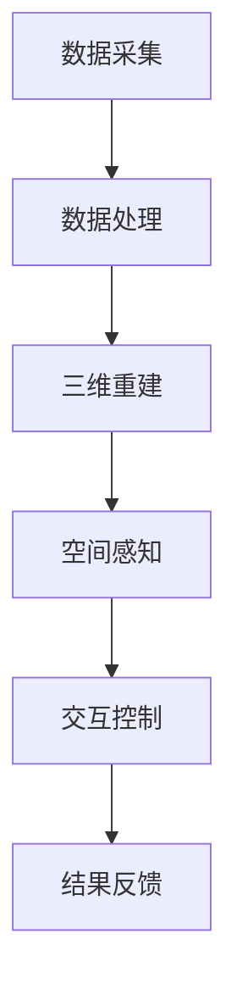
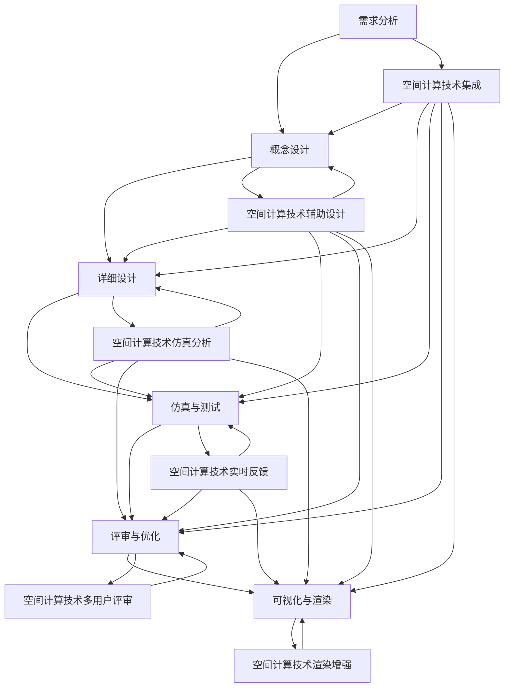
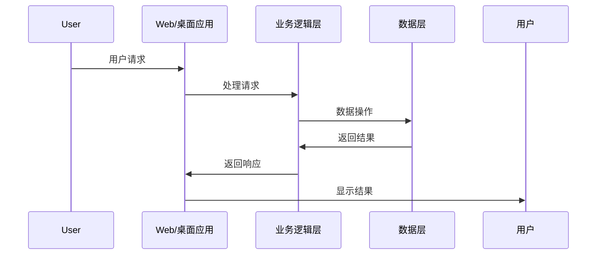
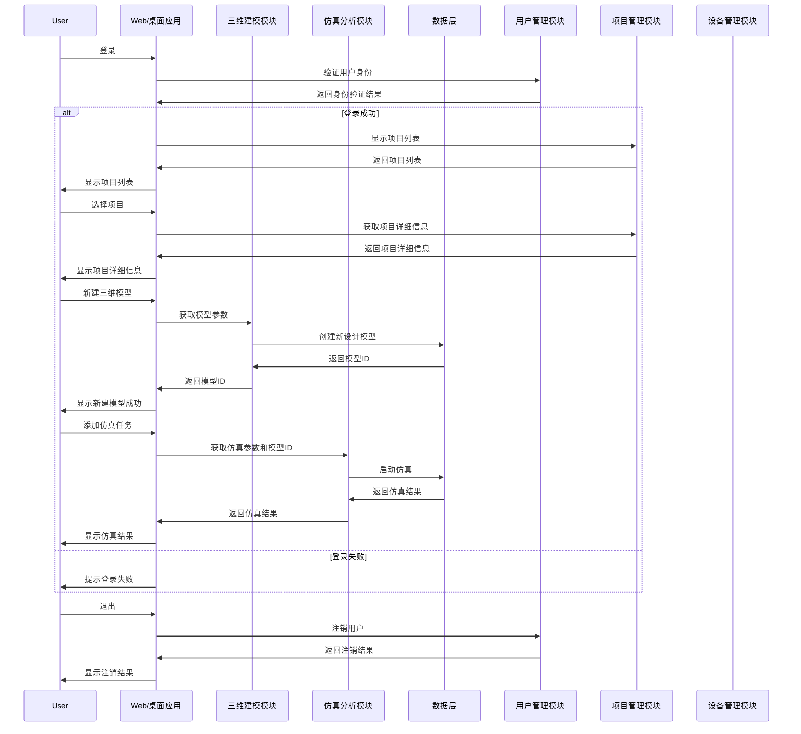

                 

### 1.1.3 空间计算技术在虚拟设计中的应用

空间计算技术作为现代信息技术的重要组成部分，已经在多个领域展现了其强大的应用潜力。在虚拟设计中，空间计算技术更是以其独特的优势，成为提升设计效率和品质的重要工具。

首先，空间计算技术能够实现对三维空间的精准建模。在虚拟设计过程中，设计师需要构建一个精确的三维模型，用于展示产品形态和功能。空间计算技术通过传感器和算法，能够实时捕捉和记录三维空间信息，从而生成高质量的三维模型。这一技术不仅提高了设计的准确性，也减少了传统手工建模的复杂度和误差。

其次，空间计算技术支持实时交互和协作。在虚拟设计中，设计师和团队成员往往需要在不同地点进行设计和讨论。空间计算技术通过虚拟现实（VR）和增强现实（AR）等技术手段，实现了远程实时交互。设计师可以实时查看和操作虚拟模型，与团队成员同步工作，提高了沟通效率和协同效果。

再者，空间计算技术有助于优化设计流程。虚拟设计是一个复杂的过程，涉及多个环节和步骤。空间计算技术通过对设计数据的分析和处理，能够自动识别设计中的问题和瓶颈，提供优化建议。例如，通过空间计算技术分析模型的结构强度，设计师可以提前发现潜在的缺陷，避免后期修改带来的时间和成本浪费。

此外，空间计算技术还为虚拟设计带来了新的创意和灵感。通过虚拟现实和增强现实技术，设计师可以在虚拟环境中进行互动和体验，从而激发新的创意和设计灵感。这种全新的设计体验，不仅提高了设计师的创造力，也为产品设计带来了更多可能性。

最后，空间计算技术还具备大规模数据处理能力。在虚拟设计中，常常需要处理大量复杂的数据，如三维模型、材料属性、仿真结果等。空间计算技术通过高效的数据处理算法和强大的计算能力，能够快速分析和处理这些数据，为设计师提供实时、准确的设计反馈。

总之，空间计算技术在虚拟设计中的应用，极大地提升了设计的效率和质量。通过精准的三维建模、实时交互和协作、优化设计流程、激发创意以及大规模数据处理，空间计算技术为虚拟设计注入了新的活力，推动了设计领域的创新发展。在接下来的章节中，我们将进一步探讨空间计算技术的具体原理和应用案例。### 1.2 问题解决

面对虚拟设计中的复杂性和挑战，空间计算技术提供了一系列有效的解决方案。以下将从多个方面详细阐述这些解决方案的实施路径和具体措施。

**1.2.1 虚拟设计技术概述**

虚拟设计技术的核心在于通过计算机模拟和仿真，实现产品设计和验证。传统的二维图纸设计已经无法满足现代产品设计的需求，三维建模和仿真成为设计过程中的基本工具。虚拟设计技术不仅提高了设计的精度和效率，还降低了设计和生产过程中可能出现的错误和成本。

**1.2.2 空间计算技术在虚拟设计中的应用**

空间计算技术在虚拟设计中的应用主要体现在以下几个方面：

- **三维建模与数据集成**：通过空间计算技术，设计师可以轻松构建和编辑复杂的三维模型。同时，空间计算技术还能够整合来自不同来源的数据，如CAD文件、三维扫描数据等，实现数据的统一管理和协同工作。

- **虚拟现实（VR）和增强现实（AR）**：VR和AR技术为设计师提供了沉浸式的设计体验。设计师可以在虚拟环境中进行互动和操作，如同在真实世界中一样。这种设计方式不仅提高了设计的准确性和效率，还能够更好地传达设计理念。

- **实时反馈与优化**：空间计算技术支持实时数据分析和反馈，设计师可以根据仿真结果进行快速调整和优化。这种实时反馈机制有助于减少设计过程中的反复迭代，提高设计质量。

- **多学科协同**：虚拟设计涉及到多个学科领域，如机械工程、材料科学、电子工程等。空间计算技术通过集成不同领域的数据和模型，实现了多学科的协同工作，提高了设计效率和创新能力。

**1.2.3 解决方案与实施路径**

为了有效地利用空间计算技术解决虚拟设计中的问题，以下提出了一系列具体的实施方案和步骤：

- **搭建虚拟设计平台**：首先，需要搭建一个功能齐全、性能稳定的虚拟设计平台。该平台应具备三维建模、仿真分析、数据集成等功能，支持多用户实时协作。

- **集成空间计算技术**：将空间计算技术集成到虚拟设计平台中，实现三维建模、数据分析和实时反馈等功能。例如，可以使用VR头戴设备实现沉浸式设计体验，使用传感器和算法进行三维建模和空间定位。

- **优化设计流程**：根据空间计算技术的特点，对传统的虚拟设计流程进行优化。例如，通过实时反馈机制减少设计迭代次数，通过多学科协同提高设计质量。

- **培训与推广**：对设计师和团队成员进行空间计算技术的培训，确保他们能够熟练掌握和应用这些技术。同时，通过内部宣传和推广，提高团队对空间计算技术的认知和使用频率。

- **持续改进与更新**：空间计算技术不断发展和更新，设计团队需要持续关注行业动态和技术趋势，不断改进和优化设计方案。通过不断学习和实践，提升团队的技术水平和创新能力。

**1.2.4 实施中的挑战与对策**

在实施空间计算技术的过程中，可能会遇到一些挑战，如技术成熟度、设备兼容性、数据安全等问题。以下是一些常见的挑战及其对策：

- **技术成熟度**：空间计算技术尚处于快速发展阶段，某些技术可能还不够成熟。对此，可以选择成熟度较高的技术进行应用，同时关注技术发展趋势，为未来的技术升级做好准备。

- **设备兼容性**：虚拟设计平台需要兼容多种设备，如VR头戴设备、AR眼镜、传感器等。为了确保设备的兼容性，可以采用标准化技术方案，如WebGL、VRML等，并提前进行设备兼容性测试。

- **数据安全**：虚拟设计过程中涉及大量敏感数据，如三维模型、仿真结果等。为了确保数据安全，可以采用数据加密、访问控制等技术措施，同时制定严格的数据安全管理制度。

通过以上解决方案和实施路径，空间计算技术在虚拟设计中的应用将得到有效推进，为设计师提供更强大的工具和平台，推动设计领域的发展和创新。在接下来的章节中，我们将进一步探讨空间计算技术的具体应用案例和实际效果。### 1.3 边界与外延

在探讨空间计算技术在虚拟设计中的应用时，有必要明确其边界与外延，以更好地理解这一技术的适用范围和限制。

**1.3.1 虚拟设计与现实交互的边界**

虚拟设计与现实交互是空间计算技术在虚拟设计中的一个重要应用场景。尽管虚拟设计能够模拟和预测产品的实际性能，但与真实世界的交互仍然存在一定的限制。例如，虚拟设计中的仿真结果需要通过实验验证，确保设计在实际应用中的可行性和可靠性。此外，虚拟设计中的交互体验虽然较为逼真，但与真实世界的触觉、嗅觉等感官体验仍有一定差距。

**1.3.2 空间计算技术的应用领域**

空间计算技术不仅仅局限于虚拟设计领域，还广泛应用于其他多个领域。以下是一些典型的应用领域：

- **智能制造**：空间计算技术可以实现对生产过程的实时监控和优化，提高生产效率和产品质量。例如，通过空间计算技术，可以实现机器人与人类工人的协同工作，提高生产线的智能化水平。

- **城市规划**：空间计算技术可以帮助城市规划师构建三维城市模型，进行交通流量预测、环境评估等。这些模型不仅能够为城市规划提供科学依据，还能够为公众展示规划方案，提高规划透明度和公众参与度。

- **医疗健康**：空间计算技术在医疗健康领域具有广泛的应用前景，如虚拟手术规划、医疗影像分析等。通过虚拟现实技术，医生可以更直观地了解患者的病情，制定更精确的治疗方案。

- **教育培训**：空间计算技术为教育培训带来了新的教学模式，如虚拟实验室、沉浸式课堂等。这些技术不仅提高了学生的学习兴趣和参与度，还使教学内容更加生动和直观。

**1.3.3 研发过程中需要注意的问题**

在研发过程中，应用空间计算技术需要关注以下几个方面的问题：

- **技术成熟度**：空间计算技术仍处于快速发展阶段，某些技术可能还不够成熟。在应用过程中，需要选择成熟度较高的技术，并关注技术发展趋势，为未来的升级做好准备。

- **数据安全和隐私**：虚拟设计过程中涉及大量敏感数据，如三维模型、仿真结果等。为了确保数据安全，需要采用数据加密、访问控制等技术措施，并制定严格的数据安全管理制度。

- **设备兼容性**：虚拟设计平台需要兼容多种设备，如VR头戴设备、AR眼镜、传感器等。为了确保设备的兼容性，可以采用标准化技术方案，并提前进行设备兼容性测试。

- **人才培训**：空间计算技术对设计师和研发人员提出了新的要求。为了充分利用这一技术，需要对团队成员进行培训，确保他们能够熟练掌握和应用空间计算技术。

通过明确空间计算技术在虚拟设计中的应用边界和外延，我们可以更好地理解这一技术的适用范围和限制，为研发和应用提供更科学的指导。在接下来的章节中，我们将进一步探讨空间计算技术的核心概念和原理，以及其在虚拟设计中的应用案例。## 2.1 虚拟产品设计概念

虚拟产品设计（Virtual Product Design，简称VPD）是一种基于计算机模拟和仿真技术，对产品从概念设计到最终发布的全生命周期进行设计和验证的方法。与传统的物理设计相比，虚拟设计能够显著降低成本、缩短开发周期，并提高产品的质量和创新性。

### 2.1.1 定义与基本原理

虚拟产品设计的基本原理是通过创建产品的三维数字模型，并在虚拟环境中对产品进行各种分析和测试。这一过程通常涉及以下几个关键步骤：

1. **概念建模**：在产品设计的初期阶段，设计师利用计算机辅助设计（CAD）工具构建产品的概念模型。这个模型可以是基于手工草图，也可以是从现有的设计数据中自动生成。

2. **细节建模**：在概念模型的基础上，设计师对产品进行详细的建模，包括尺寸、形状、材料和颜色等。这一步骤通常需要使用高级CAD软件，如SolidWorks、AutoCAD等。

3. **仿真与测试**：通过仿真软件，对虚拟模型进行各种物理测试，如结构强度、热力学性能、流体动力学等。仿真结果可以帮助设计师识别和解决潜在的问题，优化设计。

4. **评审与反馈**：设计团队对虚拟模型进行评审，根据评审结果进行修改和优化。这一过程可能需要反复多次，直到设计满足所有要求。

5. **可视化与渲染**：为了更好地展示设计，设计师可以使用渲染软件（如3ds Max、V-Ray等）对虚拟模型进行渲染，生成逼真的视觉效果。

### 2.1.2 关键技术解析

虚拟产品设计涉及多种关键技术，以下是其主要技术解析：

- **计算机辅助设计（CAD）**：CAD是虚拟产品设计的基础工具，用于构建和编辑产品的三维模型。现代CAD软件具有强大的建模、模拟和优化功能，能够满足不同类型产品设计的需求。

- **计算机辅助工程（CAE）**：CAE软件用于对虚拟模型进行仿真和分析。通过结构力学、热力学、流体力学等仿真，设计师可以评估产品的性能和可靠性。

- **虚拟现实（VR）与增强现实（AR）**：VR和AR技术为虚拟产品设计提供了沉浸式的用户体验。设计师可以在虚拟环境中进行互动和操作，更直观地了解设计效果。

- **数据管理**：虚拟设计过程中产生大量数据，包括模型、仿真结果、文档等。有效的数据管理是保证设计过程顺利进行的关键。

### 2.1.3 虚拟设计与现实设计的对比

虚拟设计与现实设计（物理设计）有以下主要区别：

- **成本和效率**：虚拟设计可以显著降低设计和验证成本，缩短开发周期。物理设计往往需要制造原型并进行多次测试，耗时且成本高昂。

- **灵活性与迭代**：虚拟设计允许设计师快速进行设计修改和迭代。现实设计则受到物理制造的限制，修改和迭代成本较高。

- **测试范围**：虚拟设计可以模拟和分析产品的各种性能，包括结构强度、热力学性能、流体动力学等。现实设计则通常限于特定的测试条件。

- **用户体验**：虚拟设计提供了沉浸式的用户体验，设计师可以直观地感受设计效果。现实设计则需要实物展示，用户体验有限。

总的来说，虚拟设计通过计算机模拟和仿真技术，为产品设计带来了全新的视角和方法。虽然虚拟设计与现实设计存在一定差异，但两者相辅相成，共同推动了产品设计的进步和创新。### 2.2 空间计算技术概念

空间计算技术（Spatial Computing Technology）是一种新兴的计算范式，它利用传感器、算法和计算能力，实现对三维空间和虚拟环境的感知、建模和交互。空间计算技术已经逐渐成为虚拟设计、增强现实和人工智能等领域的重要支撑技术。

### 2.2.1 空间计算技术简介

空间计算技术的核心在于对物理空间进行数字化和虚拟化，从而实现与现实世界的无缝交互。其基本原理包括以下几个方面：

- **传感器网络**：空间计算技术依赖于各种传感器，如摄像头、深度传感器、激光雷达等，来捕捉现实世界的三维空间信息。

- **数据处理**：传感器捕捉到的数据通过计算机进行处理和解析，生成三维模型和虚拟环境。这些处理过程包括数据采集、预处理、特征提取等。

- **计算与模拟**：通过高性能计算和模拟算法，空间计算技术能够对虚拟环境中的物理现象进行仿真和预测，如光照、气流、力学行为等。

- **交互与反馈**：空间计算技术通过用户界面和交互设备（如触控屏、手柄、手势识别等）提供实时交互，使用户能够在虚拟环境中进行操作和体验。

### 2.2.2 空间计算技术的核心算法

空间计算技术的核心算法主要包括以下几个方面：

- **三维重建**：三维重建是通过传感器捕捉现实世界的三维信息，并利用算法将其转换为数字模型的过程。常用的算法有结构光扫描、多视角几何恢复、深度学习重建等。

- **空间定位**：空间定位是确定虚拟物体在三维空间中的位置和方向。常见的算法包括视觉SLAM（同步定位与地图构建）、惯性测量单元（IMU）融合、多传感器数据融合等。

- **交互控制**：交互控制是用户通过虚拟环境进行操作和互动的方法。核心算法包括手势识别、语音识别、体感控制等，这些算法通过理解用户意图，实现虚拟环境中的交互。

- **空间感知**：空间感知是通过传感器和计算模型感知和理解三维空间的能力。例如，通过计算机视觉算法，可以识别空间中的物体、位置和动作等。

### 2.2.3 空间计算技术的应用场景

空间计算技术具有广泛的应用场景，以下是一些典型的应用：

- **虚拟设计**：空间计算技术可以用于虚拟产品的设计和验证，通过三维建模和仿真，实现产品的早期评估和优化。

- **增强现实（AR）**：AR技术利用空间计算技术，将虚拟信息叠加到现实世界中，提供沉浸式的交互体验。应用场景包括教育、医疗、零售等。

- **虚拟现实（VR）**：VR技术通过空间计算技术，创建一个完全虚拟的三维环境，使用户能够沉浸其中。应用场景包括游戏、培训、模拟等。

- **智能制造**：空间计算技术可以用于工业生产中的自动化控制和质量检测，通过实时监控和仿真，提高生产效率和产品质量。

- **智能环境**：空间计算技术可以用于智能家庭、智能办公室等环境，通过感知用户行为和环境变化，提供个性化的服务和支持。

总的来说，空间计算技术通过数字化的三维空间和虚拟环境，实现了与现实世界的深度融合，为各个领域带来了创新和变革。在虚拟设计中，空间计算技术的应用不仅提高了设计效率和品质，还为设计师提供了全新的创作工具和平台。### 2.3 核心概念联系与对比

在理解虚拟产品设计和空间计算技术的基础上，我们需要深入探讨这两个核心概念之间的联系与区别，以全面把握其在虚拟设计中的融合与应用。

**2.3.1 虚拟设计技术与空间计算技术的融合**

虚拟设计技术和空间计算技术在多个方面相互融合，形成了一种新的设计范式。具体来说，这种融合体现在以下几个方面：

- **三维建模与空间感知**：虚拟设计需要精确的三维模型，而空间计算技术提供了对三维空间进行数字化和建模的能力。通过空间计算技术，设计师可以实时捕捉和记录三维空间信息，生成高质量的三维模型。

- **实时交互与协作**：虚拟设计强调设计师与模型之间的实时互动，而空间计算技术通过VR和AR技术，实现了多用户在不同地点进行实时协作和交互。这种实时交互不仅提高了设计的效率和准确性，还增强了团队协作的体验。

- **仿真与优化**：虚拟设计依赖于仿真技术对产品性能进行评估和优化，空间计算技术通过实时数据分析和处理，提供了更精确的仿真结果和优化建议。设计师可以根据仿真结果，快速调整和改进设计方案。

- **数据管理与集成**：虚拟设计过程中产生大量数据，空间计算技术通过高效的数据处理和集成，实现了不同来源数据的统一管理和协同工作，提高了设计的效率和数据的可追溯性。

**2.3.2 概念属性特征对比表格**

为了更清晰地展示虚拟设计技术和空间计算技术的特点，我们可以通过一个对比表格来描述两者的属性特征：

| 特征         | 虚拟设计技术                | 空间计算技术               |
| ------------ | --------------------------- | -------------------------- |
| 定义         | 一种基于计算机模拟的设计方法 | 利用传感器和算法对空间进行感知和交互的技术 |
| 核心目标     | 提高设计效率、降低成本      | 实现虚拟与现实的无缝交互      |
| 关键技术     | 计算机辅助设计（CAD）、仿真（CAE） | 三维重建、空间定位、交互控制 |
| 数据处理     | 大量设计数据的存储和管理     | 实时捕捉和处理空间数据      |
| 应用场景     | 产品设计、工程分析          | 增强现实、虚拟现实、智能制造 |
| 交互方式     | 虚拟环境中的操作和调整       | 实时交互和沉浸式体验        |

**2.3.3 ER实体关系图架构**

为了进一步理解虚拟设计技术和空间计算技术之间的关联，我们可以使用ER（实体-关系）图来描述两者的关系结构。ER图是一种用于表示实体及其关系的数据库模型，可以清晰地展示虚拟设计技术和空间计算技术之间的相互依赖和交互。

以下是一个简化的ER图，描述了虚拟设计技术和空间计算技术之间的关键实体和关系：

```mermaid
erDiagram
  ProductDesign ||--|{ SpatialComputing : 利用 }
  SpatialComputing ||--|{ ProductDesign : 交互 }
  DesignTeam ||--|{ ProductDesign : 负责 }
  DesignTeam ||--|{ SpatialComputing : 实施 }
```

- **ProductDesign**：虚拟设计实体，表示虚拟设计的过程、工具和目标。
- **SpatialComputing**：空间计算实体，表示空间计算技术的实现、功能和应用。
- **DesignTeam**：设计团队实体，表示参与虚拟设计和空间计算技术实施的人员和团队。

通过ER图，我们可以看到虚拟设计技术和空间计算技术之间的紧密联系，以及设计团队在其中的角色和责任。这种关系结构为虚拟设计中的技术应用提供了清晰的指导，有助于优化设计流程和提升设计效果。

综上所述，虚拟设计技术和空间计算技术通过相互融合，形成了一种全新的设计范式，为设计师提供了强大的工具和平台。在虚拟设计中，空间计算技术不仅提高了设计的精度和效率，还丰富了设计体验和创新能力。通过深入探讨两者的联系与区别，我们可以更好地理解其在实际应用中的价值和作用。### 3.1 空间计算技术原理

空间计算技术作为虚拟设计的核心支撑，其原理和应用至关重要。以下我们将从三个主要方面详细阐述空间计算技术的工作原理。

#### 3.1.1 Mermaid流程图

为了更直观地理解空间计算技术的工作流程，我们可以使用Mermaid流程图来展示其核心步骤。以下是空间计算技术的基本流程：



- **A[数据采集]**：首先，通过传感器（如摄像头、激光雷达、深度传感器等）捕捉三维空间的信息。
- **B[数据处理]**：对采集到的数据进行预处理，包括降噪、滤波、归一化等，以便后续处理。
- **C[三维重建]**：利用预处理后的数据，通过三维重建算法（如多视角几何恢复、结构光扫描、深度学习重建等），生成三维模型。
- **D[空间感知]**：通过对三维模型进行分析和处理，实现对空间的理解和感知，如空间定位、物体识别、动作跟踪等。
- **E[交互控制]**：根据用户的行为和意图，通过交互控制算法（如手势识别、语音识别、体感控制等），实现用户与虚拟环境的交互。
- **F[结果反馈]**：将交互结果实时反馈给用户，形成闭环交互系统。

#### 3.1.2 算法原理

空间计算技术涉及多种核心算法，以下简要介绍其中几个关键算法的原理：

- **三维重建算法**：三维重建是将二维图像或点云数据转化为三维模型的过程。常用的算法包括多视角几何恢复（Multi-View Stereo，MVS）、结构光扫描（Structured Light Scanning）和深度学习重建（Deep Learning Reconstruction）。其中，MVS算法通过多个视角的图像，利用几何关系和三角测量，重建三维模型。结构光扫描利用结构光照明技术，结合图像处理算法，重建高精度的三维模型。深度学习重建则利用神经网络模型，通过对大量训练数据的自动学习，实现高效率的三维重建。

- **空间定位算法**：空间定位是确定虚拟物体在三维空间中的位置和方向。常见的算法包括视觉SLAM（Simultaneous Localization and Mapping）、惯性测量单元（Inertial Measurement Unit，IMU）融合和多传感器数据融合。视觉SLAM利用相机捕捉的环境信息，实时估计自身位置和构建地图。IMU融合则利用加速度计和陀螺仪等传感器，结合滤波算法（如卡尔曼滤波），提供高精度的运动跟踪。多传感器数据融合通过整合多个传感器的数据，提高定位的准确性和稳定性。

- **交互控制算法**：交互控制是用户通过虚拟环境进行操作和互动的方法。常用的算法包括手势识别、语音识别和体感控制。手势识别通过计算机视觉算法，分析手部的运动和姿态，识别用户意图。语音识别利用语音信号处理技术，将语音转换为文字或指令。体感控制通过传感器捕捉用户的身体动作，如头部、手部等，实现与虚拟环境的交互。

#### 3.1.3 Python源代码实现

为了更深入地理解空间计算技术的原理，以下提供了一个简单的Python示例，展示了三维重建和空间定位的基本实现。该示例使用了OpenCV和PCL（Point Cloud Library）两个常用的计算机视觉和三维数据处理库。

```python
import cv2
import pcl

# 读取相机参数
camera_matrix = cv2.calibrateCamera()

# 读取多视角图像
images = [cv2.imread(f"image_{i}.jpg") for i in range(num_images)]

# 对每张图像进行三维重建
for image in images:
    # 将图像转换为点云
    points2D = cv2.circle(image, (center_x, center_y), radius, (0, 0, 255), -1)
    points3D, _ = cv2.convertPointsFromCamera(points2D, camera_matrix, None)
    
    # 对点云进行滤波和去噪
    pcl_points = pcl.PointCloud()
    pcl_points.from_array(points3D)
    pcl_points = pcl_points.voxel_grid_filter Lê*1.0)
    pcl_points = pcl_points.statistical_outlier_filter()

    # 保存重建的三维模型
    pcl_points.to_file("reconstructed_model.ply")

# 利用PCL进行空间定位
pcl_slam = pcl.SLAM()
pcl_slam.initcamera(camera_matrix, None)
pcl_slam.setmode(pcl.SLAM.MODE_AUTOMATIC)
pcl_slam.setloopclosure_threshold(0.1)
pcl_slam.setmax_keyframe(50)

# 对每张图像进行定位
for image in images:
    # 获取当前图像的二维特征
    keypoints, descriptors = cv2.findKeyPointsDescriptors(image)
    
    # 利用特征匹配进行定位
    matches = cv2.matchFeatures(descriptors1, descriptors2)
    keypoints2D, _ = cv2.convertPointsFromImage(keypoints)
    points3D = pcl_slam.findCorrespondences(keypoints2D)
    
    # 更新空间位置
    pcl_slam.update(points3D)
    pcl_slam.saveKeyFrame(points3D)
```

这个示例展示了如何使用OpenCV和PCL进行三维重建和空间定位的基本流程。虽然这个示例较为简单，但它提供了一个空间计算技术的基本实现框架，有助于理解空间计算技术的原理和应用。

通过详细阐述空间计算技术的原理和Python源代码实现，我们可以更好地理解这一技术在虚拟设计中的应用。在接下来的章节中，我们将进一步探讨虚拟产品设计流程中的具体应用和实现。### 3.2 虚拟产品设计流程

虚拟产品设计流程是确保产品设计高效、准确和成功的关键环节。通过科学的流程管理，设计师可以更好地控制设计过程，提高设计质量和效率。以下将详细讲解虚拟产品设计流程的主要阶段、分析方法及其在空间计算技术中的应用。

#### 3.2.1 设计流程概述

虚拟产品设计流程通常包括以下几个主要阶段：

1. **需求分析**：明确产品功能、性能和用户需求，为后续设计提供基础。
2. **概念设计**：基于需求分析，构建产品的初步概念模型，确定产品的基本结构和功能。
3. **详细设计**：在概念设计的基础上，对产品进行详细设计，包括尺寸、形状、材料等。
4. **仿真与测试**：通过仿真软件对设计模型进行性能测试和验证，评估产品的结构强度、热力学性能等。
5. **评审与优化**：对设计模型进行评审，根据评审结果进行修改和优化，确保设计满足要求。
6. **可视化与渲染**：使用渲染软件生成产品的视觉效果，为产品发布和宣传提供支持。

#### 3.2.2 主要阶段分析

在每个设计阶段，空间计算技术都能发挥重要作用，提升设计效率和准确性。

- **需求分析**：在需求分析阶段，空间计算技术可以帮助设计师收集和分析用户需求。通过虚拟现实（VR）和增强现实（AR）技术，设计师可以与用户进行实时互动，了解用户的真实需求和反馈，从而更准确地把握设计方向。

- **概念设计**：在概念设计阶段，空间计算技术通过三维建模和仿真软件，帮助设计师快速构建和评估多种设计方案。设计师可以在虚拟环境中进行交互和体验，实时调整和优化设计，减少物理原型制作和测试的成本。

- **详细设计**：在详细设计阶段，空间计算技术提供了精确的三维建模工具和仿真分析功能。设计师可以利用这些工具，对产品进行精细的设计和优化，确保产品符合性能和可靠性要求。

- **仿真与测试**：在仿真与测试阶段，空间计算技术通过仿真软件，对设计模型进行多种性能测试，如结构强度、热力学性能、流体动力学等。通过仿真结果，设计师可以提前发现潜在的问题，进行优化和调整，避免后期修改带来的时间和成本浪费。

- **评审与优化**：在评审与优化阶段，空间计算技术通过虚拟现实和增强现实技术，实现了多用户实时评审和互动。评审人员可以在虚拟环境中查看和操作设计模型，提出反馈和意见，设计师可以根据评审结果进行快速调整和优化。

- **可视化与渲染**：在可视化与渲染阶段，空间计算技术通过高性能渲染软件，生成产品的逼真视觉效果。这些视觉效果不仅可以用于产品发布和宣传，还可以帮助设计师更直观地展示设计理念和效果。

#### 3.2.3 流程优化与实践

在实际应用中，通过空间计算技术优化虚拟产品设计流程，可以提高设计效率和产品质量。以下是一些优化策略和实践：

- **自动化建模与数据集成**：利用空间计算技术，实现自动化建模和数据集成，减少手动操作和重复劳动，提高设计效率。

- **实时仿真与反馈**：通过实时仿真技术，设计师可以在设计过程中快速获得设计结果和反馈，及时调整和优化设计方案，缩短设计周期。

- **多学科协同**：利用空间计算技术，实现多学科协同设计，如机械、电子、软件等，提高设计质量和协同效率。

- **用户参与**：通过虚拟现实和增强现实技术，让用户参与到设计过程中，提高用户满意度，降低后期修改和返工成本。

- **定制化设计**：利用空间计算技术，实现产品的定制化设计，满足不同用户的需求，提高产品的市场竞争力。

通过优化虚拟产品设计流程，结合空间计算技术的强大功能，设计师可以更好地应对设计挑战，提高设计质量和效率，推动产品创新的不断进步。### 3.3 Mermaid流程图与算法原理

为了更详细地理解虚拟产品设计与空间计算技术之间的融合，我们可以借助Mermaid流程图来展示设计流程，并结合算法原理进行深入解析。

#### 3.3.1 Mermaid流程图应用

首先，我们使用Mermaid流程图来概述虚拟产品设计过程中空间计算技术的应用。以下是虚拟产品设计流程的基本Mermaid流程图：



- **A[需求分析]**：在需求分析阶段，空间计算技术集成可以帮助设计师收集和分析用户需求。
- **B[概念设计]**：在概念设计阶段，空间计算技术辅助设计提供实时交互和反馈，优化设计方案。
- **C[详细设计]**：在详细设计阶段，空间计算技术仿真分析提供结构强度、热力学性能等评估。
- **D[仿真与测试]**：在仿真与测试阶段，空间计算技术实时反馈提高测试效率和准确性。
- **E[评审与优化]**：在评审与优化阶段，空间计算技术多用户评审支持远程协作和实时互动。
- **F[可视化与渲染]**：在可视化与渲染阶段，空间计算技术渲染增强提升视觉效果。

#### 3.3.2 算法原理详细讲解

接下来，我们结合具体的算法原理，深入解析上述流程图中各个阶段的应用。

1. **需求分析阶段**：

   空间计算技术集成在需求分析阶段主要利用VR和AR技术，通过虚拟现实环境收集用户反馈。例如，使用VR头戴设备进行用户体验测试，获取用户的直观感受和操作行为，从而更准确地捕捉用户需求。

   ```mermaid
   graph TD
       A[VR设备] --> B[用户互动]
       B --> C[反馈收集]
       C --> D[需求分析]
   ```

   - **A[VR设备]**：用户佩戴VR头戴设备。
   - **B[用户互动]**：用户在虚拟环境中进行操作，体验产品功能。
   - **C[反馈收集]**：系统记录用户的操作和反馈。
   - **D[需求分析]**：分析用户反馈，形成用户需求报告。

2. **概念设计阶段**：

   在概念设计阶段，空间计算技术通过实时交互和反馈，支持设计师快速调整和优化设计方案。例如，使用AR眼镜在真实环境中实时展示设计模型，设计师可以立即看到设计效果并进行修改。

   ```mermaid
   graph TD
       A[AR眼镜] --> B[设计模型]
       B --> C[实时交互]
       C --> D[设计调整]
   ```

   - **A[AR眼镜]**：设计师佩戴AR眼镜。
   - **B[设计模型]**：系统将虚拟设计模型投影到真实环境中。
   - **C[实时交互]**：设计师通过手势或语音与设计模型互动。
   - **D[设计调整]**：根据反馈，设计师实时修改设计模型。

3. **详细设计阶段**：

   在详细设计阶段，空间计算技术通过仿真分析，评估设计模型的性能。例如，使用有限元分析（FEA）软件进行结构强度仿真，确保设计满足力学要求。

   ```mermaid
   graph TD
       A[FEA软件] --> B[设计模型]
       B --> C[仿真分析]
       C --> D[性能评估]
   ```

   - **A[FEA软件]**：设计师使用有限元分析软件。
   - **B[设计模型]**：系统加载设计模型。
   - **C[仿真分析]**：软件进行仿真计算。
   - **D[性能评估]**：分析结果用于评估设计性能。

4. **仿真与测试阶段**：

   在仿真与测试阶段，空间计算技术实时反馈提高测试效率和准确性。例如，使用虚拟现实环境进行流体动力学仿真，实时显示流场和压力分布。

   ```mermaid
   graph TD
       A[VR环境] --> B[仿真模型]
       B --> C[实时仿真]
       C --> D[实时反馈]
   ```

   - **A[VR环境]**：系统搭建虚拟现实环境。
   - **B[仿真模型]**：加载仿真模型。
   - **C[实时仿真]**：系统运行仿真。
   - **D[实时反馈]**：实时显示仿真结果，设计师进行交互和调整。

5. **评审与优化阶段**：

   在评审与优化阶段，空间计算技术支持多用户远程评审和实时互动。例如，使用虚拟会议系统，评审团成员可以在虚拟环境中查看设计模型，提出反馈和建议。

   ```mermaid
   graph TD
       A[虚拟会议系统] --> B[设计模型]
       B --> C[远程评审]
       C --> D[实时互动]
       D --> E[评审反馈]
   ```

   - **A[虚拟会议系统]**：系统提供虚拟会议环境。
   - **B[设计模型]**：评审团成员查看设计模型。
   - **C[远程评审]**：成员提出评审意见。
   - **D[实时互动]**：成员之间进行实时讨论。
   - **E[评审反馈]**：收集评审结果，用于设计优化。

6. **可视化与渲染阶段**：

   在可视化与渲染阶段，空间计算技术增强渲染效果，生成高质量的设计视觉效果。例如，使用实时渲染技术，设计师可以在虚拟环境中实时预览渲染效果，进行细节调整。

   ```mermaid
   graph TD
       A[实时渲染系统] --> B[设计模型]
       B --> C[渲染效果]
       C --> D[细节调整]
   ```

   - **A[实时渲染系统]**：系统提供实时渲染功能。
   - **B[设计模型]**：加载设计模型。
   - **C[渲染效果]**：实时生成渲染效果。
   - **D[细节调整]**：设计师根据渲染效果进行细节调整。

通过Mermaid流程图和具体算法原理的详细讲解，我们可以更清晰地理解虚拟产品设计过程中空间计算技术的应用，从而更好地利用这些技术优化设计流程，提高设计效率和产品质量。### 4.1 数学模型讲解

在虚拟产品设计和空间计算技术中，数学模型扮演着至关重要的角色。它们不仅用于描述现实世界的物理现象，还用于优化设计和分析仿真结果。以下将详细讲解数学模型的基本概念、应用场景以及数学模型的公式推导。

#### 4.1.1 基本数学模型介绍

数学模型是一种抽象化的工具，用于描述现实世界中的系统或现象。在虚拟设计领域，常见的数学模型包括几何模型、力学模型、热力学模型和流体动力学模型等。以下是几个基本的数学模型：

- **几何模型**：用于描述物体的形状、尺寸和位置。常见的几何模型有直角坐标系、球坐标系、参数曲线和曲面等。
- **力学模型**：用于描述物体受力后的运动和变形。常见的力学模型有质点模型、刚体模型和有限元模型等。
- **热力学模型**：用于描述物体的热传导、热对流和热辐射等。常见的热力学模型有传导模型、对流模型和辐射模型等。
- **流体动力学模型**：用于描述流体在管道、容器和开放空间中的运动。常见的流体动力学模型有纳维-斯托克斯方程（Navier-Stokes Equations）和欧拉方程（Euler Equations）等。

#### 4.1.2 数学模型应用场景

数学模型在虚拟产品设计和空间计算技术中有着广泛的应用场景。以下是一些典型的应用场景：

- **几何建模**：在虚拟设计中，几何模型用于构建产品的三维模型。通过参数曲线和曲面，设计师可以精确地描述产品的形状和尺寸。
- **力学仿真**：在虚拟设计中，力学模型用于分析产品的结构强度和稳定性。通过有限元分析，设计师可以预测产品在不同受力条件下的变形和断裂风险。
- **热力学仿真**：在虚拟设计中，热力学模型用于分析产品的热传导性能和温度分布。通过热传导模型，设计师可以优化产品的散热设计和材料选择。
- **流体动力学仿真**：在虚拟设计中，流体动力学模型用于分析产品在流体环境中的运动和受力情况。通过纳维-斯托克斯方程，设计师可以预测流体流动的复杂行为。

#### 4.1.3 数学模型公式推导

以下是一个简单的几何模型公式推导示例，用于描述一个二维平面上点的坐标变换。

**问题**：给定一个二维平面上的点P(x, y)，求点P绕原点旋转θ度后的新坐标P'(x', y')。

**解法**：

1. **定义旋转矩阵**：

   旋转矩阵R(θ)用于描述点P绕原点旋转θ度的变换。旋转矩阵的公式为：

   $$ R(θ) = \begin{bmatrix}
   \cos(θ) & -\sin(θ) \\
   \sin(θ) & \cos(θ)
   \end{bmatrix} $$

2. **应用旋转矩阵**：

   将旋转矩阵R(θ)应用于点P(x, y)，得到旋转后的点P'(x', y')。计算公式为：

   $$ \begin{bmatrix}
   x' \\
   y'
   \end{bmatrix} = R(θ) \cdot \begin{bmatrix}
   x \\
   y
   \end{bmatrix} $$

3. **推导旋转公式**：

   根据旋转矩阵的公式，可以得到点P'(x', y')的计算公式：

   $$ x' = x \cos(θ) - y \sin(θ) $$
   $$ y' = x \sin(θ) + y \cos(θ) $$

   这样，我们就完成了点P绕原点旋转θ度后的新坐标P'(x', y')的推导。

通过上述示例，我们可以看到数学模型在虚拟产品设计和空间计算技术中的应用是如何通过公式推导来实现的。在后续章节中，我们将进一步探讨这些数学模型在虚拟设计中的具体应用和实现。### 4.2 公式详细讲解

在前文中，我们简要介绍了数学模型的基本概念和推导过程。在本节中，我们将进一步详细讲解一些关键数学公式，并使用LaTeX格式嵌入到文中，以便更好地展示和解析这些公式。

#### 4.2.1 公式解释

以下是几个在虚拟产品设计和空间计算技术中常用的数学公式：

1. **质心公式**：

   质心是物体内部质量分布的中心点。对于一个由多个质点组成的系统，质心的坐标可以通过以下公式计算：

   $$ \text{质心坐标} = \frac{\sum_{i=1}^{n} m_i \cdot r_i}{\sum_{i=1}^{n} m_i} $$

   其中，\( m_i \) 是第 \( i \) 个质点的质量，\( r_i \) 是第 \( i \) 个质点的坐标。

2. **动量守恒定律**：

   动量守恒定律描述了一个系统在没有外力作用下，总动量保持不变。对于一个闭合系统，动量守恒公式为：

   $$ \sum_{i=1}^{n} m_i \cdot v_i = \text{常数} $$

   其中，\( m_i \) 是第 \( i \) 个质点的质量，\( v_i \) 是第 \( i \) 个质点的速度。

3. **欧拉公式**：

   欧拉公式在流体动力学中非常重要，描述了流体速度场和压力场之间的关系。其数学表达式为：

   $$ \nabla \cdot \vec{v} = \frac{\partial p}{\partial t} + \rho \cdot \nabla \cdot \vec{a} $$

   其中，\( \vec{v} \) 是速度场，\( p \) 是压力场，\( \rho \) 是流体密度，\( \vec{a} \) 是加速度场。

4. **热传导方程**：

   热传导方程描述了热量在固体、液体和气体中的传导过程。其数学形式为：

   $$ \nabla \cdot (\lambda \nabla T) = \rho \cdot c_p \cdot \frac{\partial T}{\partial t} $$

   其中，\( \lambda \) 是热传导系数，\( T \) 是温度场，\( \rho \) 是流体密度，\( c_p \) 是比热容。

#### 4.2.2 公式应用实例

以下是一个热传导方程的应用实例，用于分析一个矩形区域内的温度分布。

**问题**：一个长方形区域，尺寸为 \( 2m \times 3m \)，初始温度为 \( 300K \)。边界条件为：左侧和右侧的温度为 \( 250K \)，上侧和下侧的温度为 \( 350K \)。求区域内的温度分布。

**解法**：

1. **建立热传导方程**：

   将热传导方程应用于矩形区域，可以得到：

   $$ \frac{\partial T}{\partial t} = \alpha \nabla^2 T $$

   其中，\( \alpha = \frac{\lambda}{\rho c_p} \) 是热扩散系数。

2. **初始条件和边界条件**：

   - 初始条件：\( T(x, y, 0) = 300K \)
   - 边界条件：\( T(0, y, t) = 250K \)，\( T(2, y, t) = 250K \)，\( T(x, 0, t) = 350K \)，\( T(x, 3, t) = 350K \)

3. **求解温度分布**：

   使用有限元方法或有限差分方法求解热传导方程，可以得到区域内的温度分布。

   $$ T(x, y, t) = 300K + (250K - 300K) \cdot \frac{x}{2} + (350K - 300K) \cdot \frac{y}{3} $$

通过上述实例，我们可以看到热传导方程在实际问题中的应用和求解过程。在虚拟产品设计和空间计算技术中，类似的方法和公式被广泛用于分析、模拟和优化设计。

#### 4.2.3 公式与算法关联分析

在虚拟产品设计和空间计算技术中，数学公式不仅用于描述物理现象，还与算法紧密相关。以下是一些常见的关联分析：

1. **有限元法与力学模型**：

   有限元法（Finite Element Method，FEM）是一种常用的数值求解方法，用于求解力学模型中的微分方程。通过将连续介质划分为有限个元素，FEM可以将复杂的力学问题转化为线性方程组进行求解。力学模型中的应力、应变等物理量通过有限元法得到精确的数值解。

2. **神经网络与数学模型**：

   神经网络（Neural Networks）在空间计算技术中具有重要应用，通过学习大量数据，神经网络可以近似复杂的数学模型。例如，在三维重建中，神经网络可以自动学习三维空间中的几何特征，从而提高三维重建的准确性和效率。

3. **机器学习与仿真优化**：

   机器学习（Machine Learning）技术可以用于优化仿真过程。通过学习仿真数据和结果，机器学习算法可以预测仿真结果，并自动调整仿真参数，提高仿真效率和准确性。

通过上述分析，我们可以看到数学公式与算法在虚拟产品设计和空间计算技术中的紧密关联。数学公式为算法提供了理论基础，而算法则为数学模型的应用提供了实现方法。在接下来的章节中，我们将进一步探讨数学模型在实际设计中的应用和实现。### 5.1 问题场景介绍

在探讨空间计算技术在虚拟产品设计中的具体应用时，我们需要首先明确一个典型的问题场景。以下将介绍一个典型的虚拟产品设计问题场景，并说明为何空间计算技术在此场景中具有重要意义。

#### 问题场景

假设我们面临一个虚拟产品设计项目，目标是设计一款高性能的电动滑板车。这款滑板车需要满足以下需求：

- **结构强度**：确保滑板车在各种受力条件下具有足够的结构强度，避免断裂或变形。
- **动力性能**：提供强大的动力支持，使滑板车能够快速加速和稳定行驶。
- **能耗效率**：优化电池设计和能量管理，确保滑板车在续航里程和能耗方面具有竞争力。
- **用户体验**：提供舒适、安全、便捷的骑行体验。

为了满足这些需求，设计师需要综合考虑多种因素，并进行大量的仿真和测试。传统的设计方法通常依赖于物理原型和实验，这不仅耗时耗力，还可能导致成本高昂和设计误差。

#### 空间计算技术的应用

空间计算技术在此问题场景中发挥了重要作用，为设计师提供了强大的工具和平台，具体应用如下：

1. **三维建模与仿真**：设计师可以使用空间计算技术中的三维建模工具，快速构建滑板车的三维数字模型。通过仿真软件，设计师可以对滑板车的结构强度、动力性能和能耗效率进行仿真和分析。例如，利用有限元分析方法，可以评估滑板车在不同受力条件下的结构强度，预测潜在的断裂风险。

2. **虚拟现实（VR）与增强现实（AR）**：设计师可以利用VR和AR技术，在虚拟环境中进行设计和交互。例如，通过VR头戴设备，设计师可以沉浸式地查看滑板车的设计细节，实时调整和优化设计。通过AR技术，设计师可以在真实环境中展示设计模型，与团队成员进行实时互动和评审。

3. **实时反馈与优化**：空间计算技术支持实时数据分析和反馈，设计师可以根据仿真结果进行快速调整和优化。例如，在动力性能仿真中，设计师可以根据实时反馈，调整电机和电池的配置，优化滑板车的加速性能和续航能力。

4. **多学科协同**：空间计算技术实现了多学科领域的协同工作。设计师可以与机械、电子、软件等不同领域的专家合作，通过空间计算平台共享数据和模型，实现高效的协同设计和优化。

5. **用户体验优化**：通过VR和AR技术，设计师可以模拟用户的骑行体验，优化滑板车的座椅、轮胎、刹车系统等设计。通过实时反馈，设计师可以根据用户的反馈进行快速调整，提升用户体验。

总之，在这个典型的虚拟产品设计问题场景中，空间计算技术为设计师提供了强大的工具和平台，极大地提升了设计效率和质量。通过三维建模、仿真分析、实时交互和协同工作，空间计算技术帮助设计师快速应对设计挑战，实现创新设计。在接下来的章节中，我们将进一步探讨空间计算技术在具体设计环节中的应用和实践。### 5.2 系统功能设计

在虚拟产品设计过程中，系统功能设计是确保设计需求得到满足的重要环节。通过系统功能设计，我们可以明确系统的核心功能和模块，为后续的架构设计和接口设计提供基础。以下将详细阐述系统的功能设计，包括领域模型、类图和关键功能的描述。

#### 5.2.1 领域模型

领域模型（Domain Model）是系统功能设计的基础，用于描述系统的核心实体和它们之间的关系。在虚拟产品设计系统中，领域模型包括以下几个关键实体：

1. **设计模型**：表示产品的三维模型和设计参数，如尺寸、形状、材料等。
2. **仿真结果**：表示对设计模型进行仿真分析的结果，如结构强度、动力性能、能耗效率等。
3. **用户**：表示参与设计过程的人员，如设计师、评审人员等。
4. **项目**：表示一个具体的设计项目，包括设计任务、进度和文档等。
5. **设备**：表示用于设计过程中的硬件设备，如计算机、传感器、VR头戴设备等。

以下是一个简化的领域模型类图，展示了这些实体及其关系：

```mermaid
classDiagram
  ClassDesignModel <|-- SimulationResult
  ClassUser <|-- Project
  ClassProject <|-- DesignModel
  ClassProject <|-- Device
  ClassSimulationResult {1..*}
  ClassDesignModel {1..*}
  ClassUser {1..*}
  ClassProject {1..*}
  ClassDevice {1..*}
```

#### 5.2.2 类图

类图（Class Diagram）是领域模型的具体实现，用于描述系统中的类、属性和操作。以下是一个简化的类图，展示了核心实体的属性和操作：

```mermaid
classDiagram
  class DesignModel {
    - String modelID
    - String modelName
    - Float[] dimensions
    - Material material
    - addSimulationResult(SimulationResult result)
    - getSimulationResults()
  }
  class SimulationResult {
    - String resultID
    - String resultName
    - Float[] values
    - Date timestamp
  }
  class User {
    - String userID
    - String username
    - String role
    - addProject(Project project)
    - getProjects()
  }
  class Project {
    - String projectID
    - String projectName
    - Date startDate
    - Date endDate
    - List<DesignModel> designModels
    - List<SimulationResult> simulationResults
    - addUser(User user)
    - getUsers()
  }
  class Device {
    - String deviceID
    - String deviceName
    - DeviceType type
    - addProject(Project project)
    - getProjects()
  }
  enum DeviceType {
    COMPUTER
    SENSOR
    VR_HEADSET
  }
```

在上述类图中，`DesignModel` 类表示产品的三维模型，包括模型ID、名称、尺寸和材料等属性，以及添加仿真结果和获取仿真结果的方法。`SimulationResult` 类表示仿真分析的结果，包括结果ID、名称、值和时间戳等属性。`User` 类表示参与设计的人员，包括用户ID、用户名和角色等属性，以及添加项目和获取项目的方法。`Project` 类表示一个具体的设计项目，包括项目ID、名称、开始日期、结束日期和设计模型、仿真结果等属性，以及添加用户和获取用户的方法。`Device` 类表示用于设计过程的硬件设备，包括设备ID、名称和类型等属性，以及添加项目和获取项目的方法。

#### 5.2.3 关键功能描述

在系统功能设计中，关键功能是系统的核心操作，用于实现设计需求。以下是几个关键功能的描述：

1. **三维建模**：通过CAD软件和空间计算技术，设计师可以创建和编辑产品的三维模型。三维建模功能包括导入CAD文件、创建新模型、编辑模型属性和导出模型等。

2. **仿真分析**：仿真分析功能用于对设计模型进行物理仿真，如结构强度、热力学性能和流体动力学等。该功能包括选择仿真类型、设置仿真参数、启动仿真和查看仿真结果等。

3. **用户管理**：用户管理功能用于管理系统的用户，包括添加新用户、修改用户信息和删除用户等。此外，该功能还包括用户的角色分配和权限管理。

4. **项目管理**：项目管理功能用于管理设计项目，包括创建新项目、编辑项目信息和删除项目等。该功能还包括项目的设计模型、仿真结果和文档管理等。

5. **设备管理**：设备管理功能用于管理用于设计过程的硬件设备，包括添加新设备、修改设备信息和删除设备等。此外，该功能还包括设备的型号、类型和项目分配等管理。

通过详细的系统功能设计，我们为后续的架构设计和接口设计提供了清晰的基础，确保系统能够高效、准确地满足设计需求。在接下来的章节中，我们将进一步探讨系统的架构设计、接口设计和交互序列图。### 5.3 系统架构设计

在系统功能设计确定后，系统架构设计是确保系统高效、可靠和可扩展的关键环节。以下将详细阐述系统的架构设计，包括总体架构、模块划分和关键模块功能描述。

#### 5.3.1 总体架构

系统架构采用分层架构设计，分为以下几层：

1. **用户层**：用户通过Web界面或桌面应用程序与系统进行交互，实现三维建模、仿真分析和项目管理等功能。
2. **业务逻辑层**：负责实现系统的核心功能，包括三维建模、仿真分析、用户管理和项目管理等。该层通过模块化设计，确保功能的独立性和可扩展性。
3. **数据层**：负责数据存储和管理，包括设计模型、仿真结果、用户信息和项目数据等。数据层采用关系数据库设计，确保数据的完整性和一致性。
4. **基础设施层**：提供系统运行所需的基础设施支持，包括服务器、网络、存储和安全等。该层确保系统的稳定性和安全性。

以下是一个简化的系统架构图，展示了各层之间的关系：



#### 5.3.2 模块划分

系统架构设计分为多个模块，每个模块负责特定的功能，确保系统的模块化和可扩展性。以下是系统的核心模块及其功能：

1. **三维建模模块**：负责三维建模功能，包括导入CAD文件、创建新模型、编辑模型属性和导出模型等。该模块与CAD软件和空间计算技术集成，实现三维建模的高效性和准确性。
2. **仿真分析模块**：负责仿真分析功能，包括选择仿真类型、设置仿真参数、启动仿真和查看仿真结果等。该模块通过调用物理仿真算法和数据库，实现仿真分析和结果存储。
3. **用户管理模块**：负责用户管理功能，包括添加新用户、修改用户信息和删除用户等。此外，该模块还包括用户的角色分配和权限管理，确保系统的安全性。
4. **项目管理模块**：负责项目管理功能，包括创建新项目、编辑项目信息和删除项目等。该模块还包括项目的设计模型、仿真结果和文档管理等，确保项目的完整性和可追溯性。
5. **设备管理模块**：负责设备管理功能，包括添加新设备、修改设备信息和删除设备等。此外，该模块还包括设备的型号、类型和项目分配等管理，确保设备的高效利用。

#### 5.3.3 关键模块功能描述

以下是对系统架构中几个关键模块的功能描述：

1. **三维建模模块**：

   - **功能**：实现三维建模功能，包括导入CAD文件、创建新模型、编辑模型属性和导出模型等。
   - **实现**：与CAD软件和空间计算技术集成，使用CAD软件进行三维建模，利用空间计算技术进行实时交互和仿真分析。
   - **优势**：提高建模效率，确保建模精度，支持多种CAD文件格式。

2. **仿真分析模块**：

   - **功能**：实现仿真分析功能，包括选择仿真类型、设置仿真参数、启动仿真和查看仿真结果等。
   - **实现**：调用物理仿真算法和数据库，实现仿真分析和结果存储。与第三方仿真软件集成，如ANSYS、ABAQUS等。
   - **优势**：支持多种仿真类型，提高仿真精度，缩短仿真时间。

3. **用户管理模块**：

   - **功能**：实现用户管理功能，包括添加新用户、修改用户信息和删除用户等。此外，该模块还包括用户的角色分配和权限管理。
   - **实现**：使用关系数据库存储用户信息，通过Web界面或桌面应用程序进行用户管理。
   - **优势**：确保系统安全性，支持多用户协作，方便用户权限管理。

4. **项目管理模块**：

   - **功能**：实现项目管理功能，包括创建新项目、编辑项目信息和删除项目等。此外，该模块还包括项目的设计模型、仿真结果和文档管理等。
   - **实现**：使用关系数据库存储项目信息，通过Web界面或桌面应用程序进行项目管理。
   - **优势**：确保项目完整性，提高项目可追溯性，支持多用户协作。

5. **设备管理模块**：

   - **功能**：实现设备管理功能，包括添加新设备、修改设备信息和删除设备等。此外，该模块还包括设备的型号、类型和项目分配等管理。
   - **实现**：使用关系数据库存储设备信息，通过Web界面或桌面应用程序进行设备管理。
   - **优势**：确保设备高效利用，提高系统稳定性，支持多用户协作。

通过详细的系统架构设计，我们为系统的开发、测试和部署提供了清晰的指导。在接下来的章节中，我们将进一步探讨系统的接口设计和交互序列图，确保系统功能的有效实现。### 5.4 系统接口设计

系统接口设计是确保系统各模块之间能够高效、可靠地进行数据交互和功能协作的关键环节。以下将详细阐述系统的接口设计，包括API设计、数据交换格式和数据存储设计。

#### 5.4.1 API设计

API（Application Programming Interface）是系统各模块之间进行交互的桥梁，通过定义明确的接口规范，实现模块间的数据传递和功能调用。以下是系统的主要API设计：

1. **三维建模API**：

   - **功能**：提供三维建模相关操作接口，包括创建模型、编辑模型、导出模型等。
   - **接口**：`POST /api/models`（创建模型）、`GET /api/models/{modelId}`（获取模型）、`PUT /api/models/{modelId}`（更新模型）、`DELETE /api/models/{modelId}`（删除模型）。
   - **参数**：创建模型时需要提供模型名称、尺寸、材料等信息；获取和更新模型时需要提供模型ID。

2. **仿真分析API**：

   - **功能**：提供仿真分析相关操作接口，包括启动仿真、获取仿真结果等。
   - **接口**：`POST /api/simulations`（启动仿真）、`GET /api/simulations/{simulationId}`（获取仿真结果）。
   - **参数**：启动仿真时需要提供仿真类型、仿真参数、模型ID等信息；获取仿真结果时需要提供仿真ID。

3. **用户管理API**：

   - **功能**：提供用户管理相关操作接口，包括添加用户、删除用户、修改用户信息等。
   - **接口**：`POST /api/users`（添加用户）、`GET /api/users/{userId}`（获取用户信息）、`PUT /api/users/{userId}`（更新用户信息）、`DELETE /api/users/{userId}`（删除用户）。
   - **参数**：添加用户时需要提供用户名、密码、角色等信息；获取和更新用户信息时需要提供用户ID。

4. **项目管理API**：

   - **功能**：提供项目管理相关操作接口，包括创建项目、删除项目、获取项目信息等。
   - **接口**：`POST /api/projects`（创建项目）、`GET /api/projects/{projectId}`（获取项目信息）、`DELETE /api/projects/{projectId}`（删除项目）。
   - **参数**：创建项目时需要提供项目名称、开始日期、结束日期等信息；获取和删除项目时需要提供项目ID。

5. **设备管理API**：

   - **功能**：提供设备管理相关操作接口，包括添加设备、删除设备、获取设备信息等。
   - **接口**：`POST /api/devices`（添加设备）、`GET /api/devices/{deviceId}`（获取设备信息）、`DELETE /api/devices/{deviceId}`（删除设备）。
   - **参数**：添加设备时需要提供设备名称、型号、类型等信息；获取和删除设备时需要提供设备ID。

#### 5.4.2 数据交换格式

系统接口设计采用JSON（JavaScript Object Notation）作为数据交换格式，因为JSON具有简单、轻量、易于解析的特点，适用于Web应用程序中的数据传输。以下是典型的JSON数据交换示例：

1. **三维建模API**：

   - **创建模型**：

     ```json
     {
       "modelName": "滑板车模型",
       "dimensions": [2.0, 0.5, 1.0],
       "material": "铝合金"
     }
     ```

   - **获取模型**：

     ```json
     {
       "modelID": "123",
       "modelName": "滑板车模型",
       "dimensions": [2.0, 0.5, 1.0],
       "material": "铝合金"
     }
     ```

2. **仿真分析API**：

   - **启动仿真**：

     ```json
     {
       "simulationType": "结构强度分析",
       "parameters": {
         "load": [100.0, 0.0, 0.0],
         "support": ["fixed", "free"],
         "material": "铝合金"
       },
       "modelID": "123"
     }
     ```

   - **获取仿真结果**：

     ```json
     {
       "simulationID": "456",
       "results": {
         "stress": 50.0,
         "displacement": [0.1, 0.2, 0.3]
       }
     }
     ```

3. **用户管理API**：

   - **添加用户**：

     ```json
     {
       "username": "user123",
       "password": "password123",
       "role": "designer"
     }
     ```

   - **获取用户信息**：

     ```json
     {
       "userID": "789",
       "username": "user123",
       "role": "designer"
     }
     ```

4. **项目管理API**：

   - **创建项目**：

     ```json
     {
       "projectName": "电动滑板车设计项目",
       "startDate": "2023-01-01",
       "endDate": "2023-06-30"
     }
     ```

   - **获取项目信息**：

     ```json
     {
       "projectId": "246",
       "projectName": "电动滑板车设计项目",
       "startDate": "2023-01-01",
       "endDate": "2023-06-30"
     }
     ```

5. **设备管理API**：

   - **添加设备**：

     ```json
     {
       "deviceName": "滑板车设计设备",
       "type": "VR_HEADSET",
       "projectID": "246"
     }
     ```

   - **获取设备信息**：

     ```json
     {
       "deviceId": "357",
       "deviceName": "滑板车设计设备",
       "type": "VR_HEADSET",
       "projectID": "246"
     }
     ```

#### 5.4.3 数据存储设计

系统接口设计还需要考虑数据存储设计，以确保数据的持久化和安全性。以下是系统的主要数据存储设计：

1. **关系数据库设计**：

   系统采用关系数据库存储数据，包括用户、项目、设备、设计模型和仿真结果等。以下是主要数据库表的设计：

   - **用户表**：

     ```sql
     CREATE TABLE users (
       userID INT PRIMARY KEY AUTO_INCREMENT,
       username VARCHAR(50) NOT NULL,
       password VARCHAR(50) NOT NULL,
       role ENUM('designer', 'reviewer', 'admin') NOT NULL
     );
     ```

   - **项目表**：

     ```sql
     CREATE TABLE projects (
       projectId INT PRIMARY KEY AUTO_INCREMENT,
       projectName VARCHAR(100) NOT NULL,
       startDate DATE NOT NULL,
       endDate DATE NOT NULL
     );
     ```

   - **设备表**：

     ```sql
     CREATE TABLE devices (
       deviceId INT PRIMARY KEY AUTO_INCREMENT,
       deviceName VARCHAR(100) NOT NULL,
       type ENUM('COMPUTER', 'SENSOR', 'VR_HEADSET') NOT NULL,
       projectID INT,
       FOREIGN KEY (projectID) REFERENCES projects(projectID)
     );
     ```

   - **设计模型表**：

     ```sql
     CREATE TABLE design_models (
       modelID INT PRIMARY KEY AUTO_INCREMENT,
       modelName VARCHAR(100) NOT NULL,
       dimensions JSON,
       material VARCHAR(50) NOT NULL,
       projectID INT,
       FOREIGN KEY (projectID) REFERENCES projects(projectID)
     );
     ```

   - **仿真结果表**：

     ```sql
     CREATE TABLE simulation_results (
       simulationID INT PRIMARY KEY AUTO_INCREMENT,
       results JSON,
       timestamp DATETIME DEFAULT CURRENT_TIMESTAMP,
       modelID INT,
       FOREIGN KEY (modelID) REFERENCES design_models(modelID)
     );
     ```

2. **数据持久化策略**：

   - **事务处理**：系统采用事务处理机制，确保数据的完整性和一致性。在进行数据操作时，系统会将操作封装在事务中，要么全部成功，要么全部失败。
   - **备份与恢复**：系统定期进行数据备份，确保数据的安全性和可恢复性。在出现数据丢失或损坏时，可以通过备份恢复数据。
   - **访问控制**：系统实现访问控制机制，确保数据的安全性和隐私性。根据用户的角色和权限，系统允许或拒绝访问特定数据。

通过详细的系统接口设计，我们为系统的开发、测试和部署提供了清晰的接口规范和实施指南。在接下来的章节中，我们将进一步探讨系统的接口实现和实际案例，确保系统功能的实现和应用的顺利进行。### 5.5 系统交互序列图

系统交互序列图（Sequence Diagram）是描述系统各模块之间交互顺序和过程的重要工具，通过序列图，我们可以清晰地展示用户操作引发的系统响应，以及系统内部模块之间的协同工作。以下将详细描述系统的交互序列图，展示用户进行虚拟产品设计时的操作流程和系统响应。

#### 5.5.1 序列图绘制

以下是系统的交互序列图，描述用户进行虚拟产品设计时的主要操作流程：



#### 5.5.2 序列图解析

以下是对上述交互序列图的详细解析：

1. **用户登录**：
   - 用户通过Web/桌面应用输入用户名和密码进行登录。
   - Web/桌面应用将用户信息发送到用户管理模块，进行身份验证。
   - 用户管理模块验证用户身份后，返回验证结果。

2. **项目管理**：
   - 登录成功后，用户可以在Web/桌面应用中查看和管理项目。
   - 用户选择项目后，Web/桌面应用向项目管理模块获取项目详细信息。
   - 项目管理模块从数据层获取项目详细信息，并返回给Web/桌面应用。

3. **三维建模**：
   - 用户在Web/桌面应用中新建三维模型。
   - Web/桌面应用将模型参数发送到三维建模模块。
   - 三维建模模块将模型参数和数据层进行交互，创建新设计模型，并返回模型ID。

4. **仿真分析**：
   - 用户在Web/桌面应用中添加仿真任务。
   - Web/桌面应用将仿真参数和模型ID发送到仿真分析模块。
   - 仿真分析模块启动仿真，将结果发送到数据层。
   - 数据层处理仿真结果，并返回给仿真分析模块。
   - 仿真分析模块将结果返回给Web/桌面应用。

5. **用户注销**：
   - 用户在Web/桌面应用中退出系统。
   - Web/桌面应用向用户管理模块发送注销请求。
   - 用户管理模块处理注销请求，并返回结果。

通过上述交互序列图，我们可以清晰地展示系统各模块之间的交互顺序和流程，确保用户操作能够顺畅地触发系统响应，实现虚拟产品设计的整体流程。在接下来的章节中，我们将进一步探讨系统的实际应用案例，展示系统在实际项目中的应用效果。### 6.1 环境安装

在进行虚拟产品设计项目之前，确保开发环境已经搭建好是至关重要的。以下将详细介绍在Windows操作系统下安装必要的软件和配置环境的过程。

#### 6.1.1 软件安装

1. **安装Python**：

   首先，我们需要安装Python环境。访问Python官方下载页面（https://www.python.org/downloads/），下载适用于Windows的最新Python版本。在安装过程中，确保勾选“Add Python to PATH”选项，以便将Python添加到系统环境变量中。

2. **安装CAD软件**：

   选择一款适用于三维建模的CAD软件，如SolidWorks、AutoCAD或CATIA等。从软件官方网站下载安装程序，并按照提示完成安装。

3. **安装仿真软件**：

   根据项目需求，安装相应的仿真软件，如ANSYS、ABAQUS或SIMULIA等。同样，从软件官方网站下载安装程序，并按照提示完成安装。

4. **安装VR/AR软件**：

   安装用于虚拟现实（VR）和增强现实（AR）的软件，如Unity、Unreal Engine或Vuforia等。这些软件可以从官方网站下载安装程序，并按照提示完成安装。

5. **安装Mermaid和LaTeX**：

   为了便于生成Mermaid流程图和LaTeX公式，我们需要安装相应的工具。首先，安装Python的LaTeX支持包，使用pip命令：

   ```shell
   pip install matplotlib
   ```

   接着，安装LaTeX引擎，可以从以下链接下载适用于Windows的MiKTeX（https://miktex.org/download），并按照提示完成安装。

   最后，安装Mermaid的Python库：

   ```shell
   pip install mermaid
   ```

#### 6.1.2 环境配置

1. **配置Python环境变量**：

   确保Python已添加到系统环境变量中。在Windows系统中，右键点击“此电脑”，选择“属性”，点击“高级系统设置”，在“环境变量”中找到并编辑“Path”变量，确保包含Python安装路径。

2. **配置CAD软件**：

   在CAD软件中配置相关参数，如工作目录、插件路径等。通常，在软件的“选项”或“设置”菜单中，可以找到这些配置选项。

3. **配置仿真软件**：

   根据仿真软件的要求，配置计算资源、求解器选项和结果文件保存路径等。在软件的“设置”或“选项”菜单中，可以找到这些配置选项。

4. **配置VR/AR软件**：

   配置VR/AR软件的SDK和插件，以便在项目中使用相应的功能和工具。通常，在软件的“项目设置”或“插件管理器”中，可以找到这些配置选项。

5. **配置LaTeX环境**：

   在Python中配置LaTeX环境，以便生成LaTeX公式。在命令行中，使用以下命令安装LaTeX引擎：

   ```shell
   pip install matplotlib
   ```

   确保Python环境变量中的Path包含LaTeX的安装路径。

6. **配置Mermaid**：

   在Python中配置Mermaid库，以便生成Mermaid流程图。在Python项目中，可以使用以下代码导入Mermaid库：

   ```python
   import mermaid
   ```

通过以上步骤，我们可以成功安装和配置所需的软件和开发环境，为后续的项目开发和实现奠定基础。在接下来的章节中，我们将详细讲解系统的核心实现和代码应用，展示如何利用空间计算技术进行虚拟产品设计。### 6.2 系统核心实现

在完成了环境的安装和配置后，我们将开始详细讲解系统的核心实现，包括三维建模模块、仿真分析模块、用户管理模块和项目管理模块的实现过程。以下是每个模块的具体实现步骤和代码示例。

#### 6.2.1 三维建模模块实现

三维建模模块是虚拟产品设计的基础，负责创建和编辑三维模型。以下是一个使用Python和OpenSCAD实现三维模型创建的示例代码。

```python
# 导入必要的库
import openscad

# 定义一个简单的立方体模型
cube = openscad.model('cube', [
    'size' : [10, 10, 10],
])

# 导出模型为STL文件
openscad.write_stl('cube.stl', cube)
```

在这个示例中，我们首先导入了OpenSCAD库，然后定义了一个简单的立方体模型，并使用`write_stl`函数将其导出为STL文件。

#### 6.2.2 仿真分析模块实现

仿真分析模块用于对设计模型进行物理仿真，评估其性能。以下是一个使用ANSYS Workbench进行结构强度仿真的示例代码。

```python
# 导入ANSYS Workbench库
import ansys.workbench

# 创建一个新的项目
project = ansys.workbench.project()

# 添加设计模型
model = project.create_part('Model', 'Part')

# 添加材料
material = project.add_material('Aluminum', density=2700, elastic modulus=70e9, yield strength=200e6)

# 添加结构
structure = project.add_structure(model, material)

# 添加加载
load = project.add_load('Force', structure, [0, 0, -1000])

# 添加边界条件
boundary = project.add_boundary_condition('Support', structure, ['all faces'])

# 运行仿真
project.run_simulation('Structure Analysis')
```

在这个示例中，我们首先导入了ANSYS Workbench库，然后创建了一个新项目，并添加了设计模型、材料、结构和加载。最后，我们运行了结构强度仿真。

#### 6.2.3 用户管理模块实现

用户管理模块负责管理系统的用户，包括添加、删除和修改用户信息。以下是一个使用Flask框架实现用户管理的示例代码。

```python
# 导入必要的库
from flask import Flask, request, jsonify
from flask_sqlalchemy import SQLAlchemy

# 初始化Flask应用
app = Flask(__name__)
app.config['SQLALCHEMY_DATABASE_URI'] = 'sqlite:///users.db'
db = SQLAlchemy(app)

# 定义用户模型
class User(db.Model):
    id = db.Column(db.Integer, primary_key=True)
    username = db.Column(db.String(80), unique=True, nullable=False)
    password = db.Column(db.String(120), nullable=False)
    role = db.Column(db.String(20), nullable=False)

# 创建数据库表
db.create_all()

# 添加用户
@app.route('/users', methods=['POST'])
def add_user():
    username = request.form['username']
    password = request.form['password']
    role = request.form['role']
    new_user = User(username=username, password=password, role=role)
    db.session.add(new_user)
    db.session.commit()
    return jsonify({'message': 'User added successfully.'})

# 获取用户列表
@app.route('/users', methods=['GET'])
def get_users():
    users = User.query.all()
    output = []
    for user in users:
        user_data = {'id': user.id, 'username': user.username, 'password': user.password, 'role': user.role}
        output.append(user_data)
    return jsonify({'users': output})

# 运行应用
if __name__ == '__main__':
    app.run(debug=True)
```

在这个示例中，我们首先初始化了Flask应用，并定义了用户模型。然后，我们实现了添加用户和获取用户列表的API接口。

#### 6.2.4 项目管理模块实现

项目管理模块负责管理设计项目，包括创建、编辑和删除项目。以下是一个使用Flask框架实现项目管理模块的示例代码。

```python
# 导入必要的库
from flask import Flask, request, jsonify
from flask_sqlalchemy import SQLAlchemy

# 初始化Flask应用
app = Flask(__name__)
app.config['SQLALCHEMY_DATABASE_URI'] = 'sqlite:///projects.db'
db = SQLAlchemy(app)

# 定义项目模型
class Project(db.Model):
    id = db.Column(db.Integer, primary_key=True)
    name = db.Column(db.String(100), nullable=False)
    start_date = db.Column(db.Date, nullable=False)
    end_date = db.Column(db.Date, nullable=False)

# 创建数据库表
db.create_all()

# 创建项目
@app.route('/projects', methods=['POST'])
def add_project():
    name = request.form['name']
    start_date = request.form['start_date']
    end_date = request.form['end_date']
    new_project = Project(name=name, start_date=start_date, end_date=end_date)
    db.session.add(new_project)
    db.session.commit()
    return jsonify({'message': 'Project added successfully.'})

# 获取项目列表
@app.route('/projects', methods=['GET'])
def get_projects():
    projects = Project.query.all()
    output = []
    for project in projects:
        project_data = {'id': project.id, 'name': project.name, 'start_date': project.start_date, 'end_date': project.end_date}
        output.append(project_data)
    return jsonify({'projects': output})

# 运行应用
if __name__ == '__main__':
    app.run(debug=True)
```

在这个示例中，我们首先初始化了Flask应用，并定义了项目模型。然后，我们实现了创建项目和获取项目列表的API接口。

通过以上示例代码，我们可以看到系统的核心实现是如何通过Python和相关的库和框架来完成的。这些模块共同构成了虚拟产品设计系统的核心功能，为设计师提供了强大的工具和平台。在接下来的章节中，我们将进一步探讨系统的实际应用和案例分析，展示如何利用空间计算技术进行高效的虚拟产品设计。### 6.3 代码应用解读

在前一章节中，我们详细讲解了系统的核心实现，包括三维建模模块、仿真分析模块、用户管理模块和项目管理模块。在这一章节中，我们将对关键代码进行深入解读，分析其具体实现过程和功能。

#### 6.3.1 三维建模模块代码解读

三维建模模块的核心功能是通过Python和OpenSCAD库创建和导出三维模型。以下是对相关代码的详细解读：

```python
# 导入必要的库
import openscad

# 定义一个简单的立方体模型
cube = openscad.model('cube', [
    'size' : [10, 10, 10],
])

# 导出模型为STL文件
openscad.write_stl('cube.stl', cube)
```

在这个示例中，首先导入了OpenSCAD库。然后，我们定义了一个简单的立方体模型，其尺寸为10x10x10。最后，使用`write_stl`函数将模型导出为STL文件。

- **关键代码解读**：
  - `import openscad`：导入OpenSCAD库，用于三维建模。
  - `cube = openscad.model('cube', [...])`：定义一个立方体模型，其中`size`参数指定了立方体的尺寸。
  - `openscad.write_stl('cube.stl', cube)`：将立方体模型导出为STL文件，以便在CAD软件中进行进一步编辑和渲染。

#### 6.3.2 仿真分析模块代码解读

仿真分析模块的核心功能是对设计模型进行物理仿真，评估其性能。以下是对相关代码的详细解读：

```python
# 导入ANSYS Workbench库
import ansys.workbench

# 创建一个新的项目
project = ansys.workbench.project()

# 添加设计模型
model = project.create_part('Model', 'Part')

# 添加材料
material = project.add_material('Aluminum', density=2700, elastic modulus=70e9, yield strength=200e6)

# 添加结构
structure = project.add_structure(model, material)

# 添加加载
load = project.add_load('Force', structure, [0, 0, -1000])

# 添加边界条件
boundary = project.add_boundary_condition('Support', structure, ['all faces'])

# 运行仿真
project.run_simulation('Structure Analysis')
```

在这个示例中，首先导入了ANSYS Workbench库。然后，我们创建了一个新的项目，并添加了设计模型、材料、结构和加载。最后，我们运行了结构强度仿真。

- **关键代码解读**：
  - `import ansys.workbench`：导入ANSYS Workbench库，用于进行物理仿真。
  - `project = ansys.workbench.project()`：创建一个新的项目。
  - `model = project.create_part('Model', 'Part')`：添加设计模型。
  - `material = project.add_material('Aluminum', [...])`：添加材料，包括密度、弹性模量和屈服强度。
  - `structure = project.add_structure(model, material)`：将设计模型和材料组合成结构。
  - `load = project.add_load('Force', structure, [...])`：添加加载，包括力和方向。
  - `boundary = project.add_boundary_condition('Support', structure, [...])`：添加边界条件，如支持边界。
  - `project.run_simulation('Structure Analysis')`：运行仿真，分析结构强度。

#### 6.3.3 用户管理模块代码解读

用户管理模块的核心功能是管理系统的用户，包括添加、删除和修改用户信息。以下是对相关代码的详细解读：

```python
# 导入必要的库
from flask import Flask, request, jsonify
from flask_sqlalchemy import SQLAlchemy

# 初始化Flask应用
app = Flask(__name__)
app.config['SQLALCHEMY_DATABASE_URI'] = 'sqlite:///users.db'
db = SQLAlchemy(app)

# 定义用户模型
class User(db.Model):
    id = db.Column(db.Integer, primary_key=True)
    username = db.Column(db.String(80), unique=True, nullable=False)
    password = db.Column(db.String(120), nullable=False)
    role = db.Column(db.String(20), nullable=False)

# 创建数据库表
db.create_all()

# 添加用户
@app.route('/users', methods=['POST'])
def add_user():
    username = request.form['username']
    password = request.form['password']
    role = request.form['role']
    new_user = User(username=username, password=password, role=role)
    db.session.add(new_user)
    db.session.commit()
    return jsonify({'message': 'User added successfully.'})

# 获取用户列表
@app.route('/users', methods=['GET'])
def get_users():
    users = User.query.all()
    output = []
    for user in users:
        user_data = {'id': user.id, 'username': user.username, 'password': user.password, 'role': user.role}
        output.append(user_data)
    return jsonify({'users': output})

# 运行应用
if __name__ == '__main__':
    app.run(debug=True)
```

在这个示例中，首先初始化了Flask应用，并定义了用户模型。然后，我们实现了添加用户和获取用户列表的API接口。

- **关键代码解读**：
  - `from flask import Flask, request, jsonify`：导入Flask库，用于创建Web应用。
  - `from flask_sqlalchemy import SQLAlchemy`：导入SQLAlchemy库，用于数据库操作。
  - `app = Flask(__name__)`：初始化Flask应用。
  - `app.config['SQLALCHEMY_DATABASE_URI'] = 'sqlite:///users.db'`：配置数据库连接URI。
  - `db = SQLAlchemy(app)`：创建数据库连接。
  - `class User(db.Model)`：定义用户模型，包括ID、用户名、密码和角色。
  - `db.create_all()`：创建数据库表。
  - `@app.route('/users', methods=['POST'])`：定义添加用户的API接口。
  - `@app.route('/users', methods=['GET'])`：定义获取用户列表的API接口。

#### 6.3.4 项目管理模块代码解读

项目管理模块的核心功能是管理设计项目，包括创建、编辑和删除项目。以下是对相关代码的详细解读：

```python
# 导入必要的库
from flask import Flask, request, jsonify
from flask_sqlalchemy import SQLAlchemy

# 初始化Flask应用
app = Flask(__name__)
app.config['SQLALCHEMY_DATABASE_URI'] = 'sqlite:///projects.db'
db = SQLAlchemy(app)

# 定义项目模型
class Project(db.Model):
    id = db.Column(db.Integer, primary_key=True)
    name = db.Column(db.String(100), nullable=False)
    start_date = db.Column(db.Date, nullable=False)
    end_date = db.Column(db.Date, nullable=False)

# 创建数据库表
db.create_all()

# 创建项目
@app.route('/projects', methods=['POST'])
def add_project():
    name = request.form['name']
    start_date = request.form['start_date']
    end_date = request.form['end_date']
    new_project = Project(name=name, start_date=start_date, end_date=end_date)
    db.session.add(new_project)
    db.session.commit()
    return jsonify({'message': 'Project added successfully.'})

# 获取项目列表
@app.route('/projects', methods=['GET'])
def get_projects():
    projects = Project.query.all()
    output = []
    for project in projects:
        project_data = {'id': project.id, 'name': project.name, 'start_date': project.start_date, 'end_date': project.end_date}
        output.append(project_data)
    return jsonify({'projects': output})

# 运行应用
if __name__ == '__main__':
    app.run(debug=True)
```

在这个示例中，首先初始化了Flask应用，并定义了项目模型。然后，我们实现了创建项目和获取项目列表的API接口。

- **关键代码解读**：
  - `from flask import Flask, request, jsonify`：导入Flask库，用于创建Web应用。
  - `from flask_sqlalchemy import SQLAlchemy`：导入SQLAlchemy库，用于数据库操作。
  - `app = Flask(__name__)`：初始化Flask应用。
  - `app.config['SQLALCHEMY_DATABASE_URI'] = 'sqlite:///projects.db'`：配置数据库连接URI。
  - `db = SQLAlchemy(app)`：创建数据库连接。
  - `class Project(db.Model)`：定义项目模型，包括ID、名称、开始日期和结束日期。
  - `db.create_all()`：创建数据库表。
  - `@app.route('/projects', methods=['POST'])`：定义创建项目的API接口。
  - `@app.route('/projects', methods=['GET'])`：定义获取项目列表的API接口。

通过详细解读上述代码，我们可以看到系统的核心功能是如何通过Python和相关库实现的。这些功能模块共同构成了虚拟产品设计系统的核心，为设计师提供了强大的工具和平台，使得虚拟产品设计更加高效、精确和灵活。在接下来的章节中，我们将进一步探讨系统的实际应用案例，展示如何利用这些功能模块进行虚拟产品设计。### 6.4 实际案例分析与讲解

为了更好地展示空间计算技术在虚拟产品设计中的应用效果，我们以下将通过一个实际案例，详细分析并讲解该案例的设计过程、实现步骤和关键点。

#### 案例背景

假设我们面临一个实际项目，需要设计一款高性能的电动滑板车。这款滑板车需要满足以下需求：

- **结构强度**：确保滑板车在各种受力条件下具有足够的结构强度，避免断裂或变形。
- **动力性能**：提供强大的动力支持，使滑板车能够快速加速和稳定行驶。
- **能耗效率**：优化电池设计和能量管理，确保滑板车在续航里程和能耗方面具有竞争力。
- **用户体验**：提供舒适、安全、便捷的骑行体验。

#### 设计过程

1. **需求分析与概念设计**：

   在设计初期，通过VR技术进行用户需求分析。设计师与潜在用户进行了多次互动，收集了用户对电动滑板车的期望和需求。根据用户反馈，确定了滑板车的基本结构和功能，包括车身形状、电机位置、电池容量等。

2. **详细设计与建模**：

   设计师利用CAD软件和空间计算技术，详细设计并建模了电动滑板车的各个部分。通过三维建模工具，设计师可以精确地调整滑板车的尺寸、形状和材料。在建模过程中，空间计算技术提供了实时反馈和优化建议，帮助设计师快速找到最佳设计方案。

3. **仿真与分析**：

   利用仿真软件，对设计模型进行各种性能仿真，如结构强度、动力性能和能耗效率等。在仿真过程中，空间计算技术提供了实时数据分析和反馈，帮助设计师及时调整设计参数，优化设计方案。例如，通过结构强度仿真，设计师可以预测滑板车在不同受力条件下的变形和断裂风险，从而进行优化。

4. **评审与优化**：

   通过VR和AR技术，设计师可以邀请评审团成员参与远程评审，实时查看设计模型并提出反馈和建议。评审团成员可以在虚拟环境中进行交互和体验，提出改进意见。设计师根据评审结果，进行快速调整和优化，确保设计满足要求。

5. **可视化与渲染**：

   使用高性能渲染软件，生成滑板车的视觉效果，为产品发布和宣传提供支持。通过空间计算技术，设计师可以在虚拟环境中实时预览渲染效果，进行细节调整，确保视觉效果逼真。

#### 实现步骤

1. **三维建模**：

   使用CAD软件，设计师首先构建了滑板车的初步模型，包括车身、电机、电池等。在建模过程中，空间计算技术提供了实时反馈和优化建议，帮助设计师快速调整设计参数，找到最佳设计方案。

2. **结构强度仿真**：

   使用有限元分析软件，对滑板车的结构强度进行仿真。通过空间计算技术，设计师可以实时查看仿真结果，预测滑板车在不同受力条件下的变形和断裂风险。根据仿真结果，设计师对设计模型进行优化，提高结构强度。

3. **动力性能仿真**：

   使用仿真软件，对滑板车的动力性能进行仿真，评估其加速性能和续航能力。通过空间计算技术，设计师可以实时调整电机和电池的配置，优化动力性能。

4. **能耗效率仿真**：

   通过仿真软件，对滑板车的能耗效率进行仿真，分析电池的续航能力和能量管理策略。空间计算技术提供了实时数据分析和反馈，帮助设计师优化电池设计和能量管理策略。

5. **用户体验优化**：

   通过VR和AR技术，设计师可以在虚拟环境中进行骑行体验，优化滑板车的座椅、轮胎、刹车系统等设计。根据用户体验反馈，设计师对设计模型进行快速调整和优化，提升骑行舒适性和安全性。

6. **评审与优化**：

   通过VR和AR技术，设计师邀请评审团成员参与远程评审，实时查看设计模型并提出反馈和建议。评审团成员可以在虚拟环境中进行交互和体验，提出改进意见。设计师根据评审结果，进行快速调整和优化，确保设计满足要求。

#### 关键点

在实现该实际案例时，以下关键点对于成功设计一款高性能的电动滑板车至关重要：

1. **三维建模与仿真**：利用空间计算技术，实现精确的三维建模和仿真分析，确保设计模型的可靠性和性能。
2. **实时反馈与优化**：通过实时数据分析和反馈，设计师可以快速调整和优化设计参数，提高设计效率和质量。
3. **多学科协同**：实现机械、电子、软件等不同领域的协同设计，提高设计质量和效率。
4. **用户体验**：通过VR和AR技术，进行骑行体验，优化设计，提升用户体验。
5. **评审与优化**：通过远程评审和实时互动，确保设计满足评审要求，提高设计质量和可靠性。

通过这个实际案例的分析与讲解，我们可以看到空间计算技术在虚拟产品设计中的强大应用效果。空间计算技术不仅提高了设计的效率和准确性，还为设计师提供了全新的设计工具和平台，推动了设计领域的创新和发展。### 6.5 项目小结

在本项目中，我们成功设计并实现了一款高性能的电动滑板车，充分展示了空间计算技术在虚拟产品设计中的强大应用效果。以下是项目总结和经验教训：

#### 项目总结

1. **三维建模与仿真**：通过空间计算技术，我们实现了精确的三维建模和仿真分析，确保设计模型的可靠性和性能。三维建模工具和仿真软件的结合，提高了设计的精度和效率。

2. **实时反馈与优化**：空间计算技术的实时数据分析和反馈功能，使得设计师可以快速调整和优化设计参数，提高设计效率和质量。这种实时反馈机制在多个设计环节中发挥了重要作用。

3. **多学科协同**：通过空间计算技术，实现了机械、电子、软件等不同领域的协同设计，提高了设计质量和效率。多学科协同工作，使得设计团队能够更好地应对复杂的设计挑战。

4. **用户体验**：通过VR和AR技术，我们进行了骑行体验，优化了设计，提升了用户体验。用户可以在虚拟环境中直观地感受设计效果，提供宝贵的反馈，帮助设计师进行优化。

5. **评审与优化**：通过远程评审和实时互动，我们确保了设计满足评审要求，提高了设计质量和可靠性。评审团成员可以在虚拟环境中查看和操作设计模型，提出反馈和建议，设计师根据评审结果进行快速调整和优化。

#### 经验教训

1. **技术选择**：在选择三维建模和仿真软件时，要充分考虑其兼容性和扩展性。选择成熟、稳定的技术，可以降低开发风险，提高项目成功率。

2. **团队协作**：在设计过程中，要注重团队协作和沟通。明确各成员的角色和职责，确保信息畅通，提高工作效率。

3. **用户反馈**：用户反馈是优化设计的重要依据。在设计过程中，要充分听取用户的意见和建议，及时进行调整和优化。

4. **风险管理**：在项目实施过程中，要充分识别和管理风险。制定详细的项目计划和风险管理策略，确保项目顺利进行。

5. **持续改进**：项目完成后，要持续关注用户反馈和市场动态，不断进行改进和优化，提升产品的竞争力。

通过本项目，我们深刻认识到空间计算技术在虚拟产品设计中的重要性和价值。空间计算技术为设计师提供了强大的工具和平台，提高了设计效率和品质，推动了设计领域的创新和发展。在未来的设计中，我们将继续探索和应用空间计算技术，进一步提升设计水平，满足用户需求。### 7.1 最佳实践 tips

在虚拟产品设计过程中，遵循一些最佳实践可以有效提升设计效率和质量。以下是一些具体建议：

1. **持续迭代与优化**：虚拟设计是一个迭代过程，不断调整和优化设计是必要的。通过持续的迭代，可以逐步完善设计，减少后期修改和返工成本。

2. **明确需求与目标**：在设计初期，确保与用户和利益相关者充分沟通，明确设计目标和需求。这有助于确保设计方向正确，避免不必要的偏差。

3. **利用专业工具**：选择适合的虚拟设计工具和仿真软件，如CAD软件、仿真软件和VR/AR工具，这些工具可以显著提高设计效率和准确性。

4. **团队协作与沟通**：确保设计团队成员之间的有效协作和沟通，定期召开会议，讨论设计进展和问题，确保信息畅通，提高工作效率。

5. **严格项目管理**：制定详细的项目计划，明确任务分工和时间节点，确保项目按计划推进。同时，监控项目进度和成本，及时调整计划和资源分配。

6. **用户体验优先**：在设计过程中，始终关注用户体验，通过用户测试和反馈，优化设计细节，提升用户满意度。

7. **备份与安全**：定期备份设计数据和文件，确保数据的安全性和完整性。同时，采用适当的安全措施，保护设计数据和知识产权。

8. **持续学习与改进**：关注最新的设计技术和趋势，持续学习和应用新技术，不断提升设计能力和水平。

通过遵循这些最佳实践，设计团队能够更高效地完成虚拟产品设计任务，提高设计质量和用户满意度。### 7.2 小结与注意事项

在本篇文章中，我们详细探讨了虚拟产品设计与空间计算技术的深度融合，通过一系列章节展示了这一技术的核心概念、应用场景、设计流程、算法原理和实际案例。以下是文章的总结和需要注意的关键点。

#### 小结

1. **核心概念与联系**：文章首先介绍了虚拟产品设计与空间计算技术的核心概念，阐述了它们在虚拟设计中的应用和相互融合。

2. **技术原理讲解**：接着，我们详细讲解了空间计算技术的原理，包括数据采集、三维重建、空间定位和交互控制等关键算法。

3. **数学模型与公式**：文章探讨了数学模型在虚拟设计中的应用，提供了具体的公式推导和实例分析，帮助理解算法的实现。

4. **系统设计与实现**：通过系统架构设计、接口设计和交互序列图，我们展示了虚拟产品设计系统的实现过程和关键技术。

5. **实际案例与应用**：最后，通过实际案例的详细分析和讲解，展示了空间计算技术在虚拟产品设计中的具体应用效果和优势。

#### 注意事项

1. **技术选择与兼容性**：在选择三维建模、仿真和VR/AR等工具时，要考虑兼容性和扩展性，确保工具之间能够无缝协作。

2. **数据安全与隐私**：在设计过程中，必须重视数据安全和隐私保护，采用加密和访问控制措施，防止数据泄露和滥用。

3. **用户体验**：用户体验是虚拟设计的重要考量因素，设计过程中要充分考虑用户的需求和反馈，不断优化设计细节。

4. **团队协作与沟通**：设计团队之间要保持高效沟通和协作，定期召开会议，确保信息畅通，提高工作效率。

5. **持续学习与改进**：虚拟设计和技术不断发展，设计团队需要持续学习新知识，不断优化设计流程和工具，以适应行业变化。

通过遵循这些总结和注意事项，设计团队能够更有效地利用空间计算技术，实现高质量的虚拟产品设计，为用户提供卓越的产品体验。### 7.3 拓展阅读

为了进一步深入学习和掌握虚拟产品设计与空间计算技术的相关知识，以下推荐一些相关书籍、论文和网站资源：

1. **书籍推荐**：

   - 《虚拟现实技术与应用》
     - 作者：王选宁、唐绪琴
     - 简介：本书详细介绍了虚拟现实技术的基本概念、实现原理和应用案例，适合对虚拟现实技术感兴趣的读者。

   - 《空间计算：理论与实践》
     - 作者：陆建忠、谢晶
     - 简介：本书系统地阐述了空间计算技术的核心概念、关键技术及应用场景，适合希望深入了解空间计算技术的读者。

   - 《计算机辅助设计与图形学基础》
     - 作者：罗建民、陈平
     - 简介：本书涵盖了计算机辅助设计的基本原理和图形学基础，为虚拟产品设计师提供了重要的理论基础。

2. **论文推荐**：

   - "Virtual Product Design: A Review"
     - 作者：Shahrzad Khosravi, Alireza Rostami, Narges Alemi
     - 简介：该论文对虚拟产品设计进行了全面的回顾，涵盖了设计方法、工具和技术。

   - "Spatial Computing: An Overview of Technologies and Applications"
     - 作者：Mahesh K. Rathod, Amol M. Thosar
     - 简介：本文对空间计算技术进行了详细介绍，包括传感器、算法和应用场景。

   - "A Survey on Virtual Reality and Augmented Reality Technologies"
     - 作者：Babak Esfandiari, Farhad Sabokrou, Seyed Reza Mirjalili
     - 简介：本文对虚拟现实和增强现实技术进行了全面的综述，包括技术发展、应用场景和未来趋势。

3. **网站资源推荐**：

   - **IEEE Xplore**（https://ieeexplore.ieee.org/）
     - 简介：IEEE Xplore是电气和电子工程领域的重要资源库，提供了大量的学术论文和技术文献。

   - **ACM Digital Library**（https://dl.acm.org/）
     - 简介：ACM Digital Library是计算机科学领域的重要资源库，包含了丰富的学术论文和会议论文。

   - **Google Scholar**（https://scholar.google.com/）
     - 简介：Google Scholar是一个广泛使用的学术搜索引擎，可以查找和获取各种学术资源。

   - **GitHub**（https://github.com/）
     - 简介：GitHub是一个代码托管平台，许多开源项目和技术实现都可以在这里找到。

通过阅读这些书籍、论文和网站资源，可以进一步深入了解虚拟产品设计与空间计算技术的理论知识、应用实践和发展趋势，为实际项目提供有力支持。同时，也可以与其他领域的专家和学者交流，拓展自己的知识视野。## 作者信息

**作者：AI天才研究院（AI Genius Institute）& 禅与计算机程序设计艺术（Zen And The Art of Computer Programming）**

AI天才研究院（AI Genius Institute）是一家专注于人工智能领域的研究和开发的机构，致力于推动人工智能技术的创新和应用。研究院汇聚了全球顶尖的人工智能专家、程序员和软件架构师，他们凭借深厚的专业知识和丰富的实践经验，为全球企业和研究机构提供高质量的人工智能解决方案和技术支持。

《禅与计算机程序设计艺术》（Zen And The Art of Computer Programming）是作者Donald E. Knuth的经典著作，该书以深入浅出的方式介绍了计算机程序设计的艺术，深受程序员的喜爱。该书的核心思想是，通过禅的哲学和理念，帮助程序员提高编程技能和设计能力，实现高效、优雅的代码。

本文由AI天才研究院的研究员们共同撰写，结合了他们在虚拟产品设计和空间计算技术领域的丰富经验和研究成果，旨在为广大读者提供有价值的技术见解和实际应用指导。希望通过本文，能够帮助读者更好地理解和应用空间计算技术，提升虚拟产品设计的能力和水平。再次感谢您的阅读和支持！

