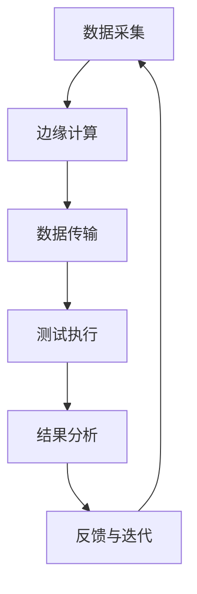

                 


## 虚拟原型测试：空间计算技术加速产品开发周期

### 关键词
- 虚拟原型测试
- 空间计算技术
- 产品开发周期
- 加速
- 算法原理

### 摘要
本文旨在探讨如何利用空间计算技术加速虚拟原型测试，从而有效缩短产品开发周期。通过深入解析空间计算技术的核心概念和应用，以及虚拟原型测试的基本原理和实践，本文将为读者提供一个全面的技术指南，帮助他们在实际项目中实现这一目标。

## 目录大纲

### 第一部分：背景介绍

**第1章 空间计算技术概述**
- **1.1 空间计算技术的基本概念**
- **1.2 空间计算技术的发展历程**
- **1.3 空间计算技术的应用领域**

**第2章 虚拟原型测试的重要性**
- **2.1 虚拟原型测试的概念**
- **2.2 虚拟原型测试的优势**
- **2.3 虚拟原型测试的应用场景**

**第3章 产品开发周期加速的需求**
- **3.1 传统产品开发周期的问题**
- **3.2 空间计算技术在缩短开发周期中的应用**
- **3.3 虚拟原型测试在缩短开发周期中的作用**

### 第二部分：核心概念与联系

**第4章 虚拟原型测试的基本概念**
- **4.1 虚拟原型测试的定义**
- **4.2 虚拟原型测试的核心要素**
- **4.3 虚拟原型测试的工作流程**

**第5章 空间计算技术的核心概念**
- **5.1 空间计算技术的定义**
- **5.2 空间计算技术的关键特性**
- **5.3 空间计算技术的技术栈**

**第6章 虚拟原型测试与空间计算技术的联系**
- **6.1 空间计算技术在虚拟原型测试中的应用**
- **6.2 虚拟原型测试对空间计算技术的需求**
- **6.3 空间计算技术与虚拟原型测试的协同效应**

### 第三部分：算法原理讲解

**第7章 虚拟原型测试的算法原理**
- **7.1 虚拟原型测试的基本算法**
- **7.2 算法的选择依据**
- **7.3 算法的优化策略**

**第8章 空间计算技术的算法原理**
- **8.1 空间计算技术的基本算法**
- **8.2 算法的适用场景**
- **8.3 算法的性能分析**

**第9章 虚拟原型测试与空间计算技术的算法结合**
- **9.1 融合算法的设计思路**
- **9.2 算法的mermaid流程图展示**
- **9.3 Python源代码实例解析**

### 第四部分：数学模型和数学公式

**第10章 虚拟原型测试的数学模型**
- **10.1 模型的基本构成**
- **10.2 模型的应用案例**
- **10.3 模型的扩展与优化**

**第11章 空间计算技术的数学模型**
- **11.1 模型的核心内容**
- **11.2 模型的参数设定**
- **11.3 模型的计算方法**

**第12章 虚拟原型测试与空间计算技术的数学结合**
- **12.1 数学模型在虚拟原型测试中的应用**
- **12.2 数学模型在空间计算技术中的应用**
- **12.3 结合实例的数学公式解析**

### 第五部分：系统分析与架构设计方案

**第13章 虚拟原型测试系统架构**
- **13.1 系统功能设计**
- **13.2 系统架构设计**
- **13.3 系统接口设计**

**第14章 空间计算技术系统架构**
- **14.1 系统架构概述**
- **14.2 系统模块设计**
- **14.3 系统交互设计**

**第15章 系统接口设计和系统交互**
- **15.1 接口设计的核心原则**
- **15.2 接口设计实例**
- **15.3 系统交互的mermaid序列图**

### 第六部分：项目实战

**第16章 环境安装与配置**
- **16.1 开发环境准备**
- **16.2 系统安装步骤**
- **16.3 系统配置指南**

**第17章 系统核心实现**
- **17.1 核心模块设计**
- **17.2 核心算法实现**
- **17.3 系统调试与优化**

**第18章 代码应用解读与分析**
- **18.1 代码结构与设计模式**
- **18.2 代码解析与调试技巧**
- **18.3 代码性能分析与优化**

**第19章 实际案例分析和详细讲解剖析**
- **19.1 案例背景介绍**
- **19.2 案例实现步骤**
- **19.3 案例结果分析与评估**

**第20章 项目小结**
- **20.1 项目成果总结**
- **20.2 项目经验与教训**
- **20.3 项目改进方向**

### 第七部分：最佳实践与总结

**第21章 最佳实践**
- **21.1 虚拟原型测试的最佳实践**
- **21.2 空间计算技术的最佳实践**
- **21.3 融合技术的最佳实践**

**第22章 小结**
- **22.1 文章要点回顾**
- **22.2 未来发展趋势**
- **22.3 面临的挑战与机遇**

**第23章 注意事项**
- **23.1 使用虚拟原型测试时需注意的问题**
- **23.2 使用空间计算技术时需注意的问题**
- **23.3 两者结合时需注意的问题**

**第24章 拓展阅读**
- **24.1 推荐阅读资料**
- **24.2 相关研究论文**
- **24.3 行业动态与趋势**

## 结论

通过以上详细的目录大纲，我们可以清晰地看到本书的结构和内容安排。每个部分都紧密围绕主题展开，从背景介绍到核心概念，再到算法原理、数学模型、系统架构、项目实战和最佳实践，全面深入地探讨了如何利用空间计算技术加速虚拟原型测试，从而缩短产品开发周期。让我们开始一步步深入探索这一领域，以期为您在技术道路上带来新的启示和帮助。

### 核心概念与术语说明

在开始本文的深入探讨之前，我们需要明确一些核心概念和术语。这将有助于确保我们在后续内容中的讨论能够清晰、准确地传达关键信息。

#### 1. 虚拟原型测试

虚拟原型测试是一种通过构建软件系统的虚拟版本来进行测试的方法。这种方法允许开发团队在项目早期阶段模拟实际环境，从而发现和修复潜在问题。虚拟原型测试通常涉及以下关键步骤：

- **需求分析**：明确测试的目标和范围，定义测试用例。
- **原型构建**：使用可视化工具或编程语言构建软件的原型版本。
- **功能测试**：验证原型是否符合功能需求，包括用户界面、数据输入输出等。
- **性能测试**：评估原型在不同负载下的响应时间、吞吐量和稳定性。

#### 2. 空间计算技术

空间计算技术是一种新兴的计算范式，它将计算能力扩展到物理世界的空间维度。这种技术利用传感器、云计算和物联网等技术，将计算和数据处理从传统的中央服务器转移到物理环境中。以下是一些空间计算技术的重要术语和概念：

- **边缘计算**：在数据产生的地方进行计算，而不是在中央服务器上。
- **物联网（IoT）**：连接物理设备到互联网，实现数据采集和智能交互。
- **传感器网络**：由大量传感器组成的网络，用于收集环境数据。
- **实时数据处理**：对传感器数据实时处理和分析，以便快速响应。

#### 3. 产品开发周期

产品开发周期是指从产品概念提出到产品发布的一系列步骤。它通常包括以下几个阶段：

- **需求分析**：了解用户需求和市场趋势，明确产品目标。
- **设计阶段**：制定产品的设计规格，包括功能、界面和架构。
- **开发阶段**：根据设计规格进行编码和开发。
- **测试阶段**：通过测试确保产品的质量和稳定性。
- **发布阶段**：将产品发布到市场，进行用户反馈和持续改进。

#### 4. 空间计算技术在产品开发中的应用

空间计算技术在产品开发中具有广泛应用，特别是在需要实时数据分析和交互的场景中。以下是一些关键应用：

- **实时监控和故障预测**：利用空间计算技术对生产设备进行实时监控，预测设备故障，提高生产效率。
- **智能城市和交通管理**：通过传感器网络和边缘计算技术，实现交通流量监测和优化，提高城市运行效率。
- **智能家居和物联网**：通过连接各种家居设备，实现智能控制和管理，提高生活舒适度和安全性。

#### 5. 虚拟原型测试在产品开发中的作用

虚拟原型测试在产品开发中扮演着关键角色，有助于缩短开发周期，提高产品质量。以下是虚拟原型测试在产品开发中的作用：

- **早期发现问题**：在开发早期阶段发现和修复问题，减少后期返工成本。
- **降低风险**：通过模拟实际使用场景，评估产品的可行性和稳定性，降低产品失败的风险。
- **优化用户体验**：通过用户测试，收集用户反馈，不断优化产品的功能界面，提高用户体验。
- **提高开发效率**：通过自动化测试和快速原型迭代，提高开发效率，缩短产品上市时间。

通过以上对核心概念和术语的说明，我们为后续内容的深入讨论奠定了基础。在接下来的章节中，我们将进一步探讨空间计算技术和虚拟原型测试的基本原理、算法原理、系统架构以及实际应用，帮助读者全面了解这一领域，并掌握如何利用这些技术加速产品开发。

### 问题背景

在当今快速变化的技术环境中，产品的开发周期变得越来越短。市场需求的不断变化、竞争的加剧以及消费者对产品质量和用户体验的高要求，都迫使企业必须在有限的时间内推出更具创新性和竞争力的产品。然而，传统的产品开发方法往往存在以下问题：

1. **开发周期长**：传统的开发流程包括多个阶段，如需求分析、设计、开发、测试和发布。每个阶段都需要时间，导致整个开发周期过长，无法迅速响应市场变化。

2. **成本高**：在传统开发过程中，由于设计和测试阶段的反复修改，往往会导致项目成本的增加。此外，由于开发周期的延长，企业可能会面临更高的研发成本和人力资源成本。

3. **风险大**：在产品开发的早期阶段，许多潜在的问题和风险往往无法得到及时识别和解决。这些未解决的风险可能会导致产品发布后的失败，影响企业的声誉和市场份额。

4. **用户体验不佳**：传统开发方法通常侧重于技术实现，而忽视了用户需求和用户体验。这可能导致产品功能虽完善，但用户不买账，从而影响产品的市场表现。

为了解决上述问题，企业需要寻找一种能够加速产品开发周期、降低成本和风险、提高用户体验的方法。这便是空间计算技术和虚拟原型测试的用武之地。

### 虚拟原型测试的重要性

虚拟原型测试在产品开发中起着至关重要的作用，它不仅能够有效缩短开发周期，还能显著提升产品的质量和用户满意度。以下从三个方面详细阐述虚拟原型测试的重要性：

#### 1. 提高开发效率

虚拟原型测试允许开发团队在项目早期阶段构建软件的原型版本，从而在开发过程中及早发现和解决潜在问题。这种方法可以大大减少后期返工的需求，从而缩短整个开发周期。以下是虚拟原型测试如何提高开发效率的几个关键点：

- **快速迭代**：虚拟原型测试支持快速迭代，开发团队可以频繁地构建、测试和修改原型，以适应不断变化的需求。这种灵活性有助于快速响应市场反馈，缩短产品从概念到上市的时间。
- **自动化测试**：虚拟原型测试通常涉及自动化测试工具，这些工具可以自动化执行测试用例，提高测试效率。自动化测试不仅可以节省时间，还能减少人为错误，提高测试的准确性。
- **早期问题发现**：通过虚拟原型测试，开发团队可以在早期阶段发现和修复问题，避免了后期因未发现的问题导致的大规模返工。这不仅可以降低开发成本，还能提高项目的成功率。

#### 2. 提升产品质量

虚拟原型测试通过对软件原型进行严格的测试，确保其在各种场景下都能正常运行，从而显著提升产品质量。以下是虚拟原型测试如何提升产品质量的几个关键点：

- **全面测试**：虚拟原型测试可以覆盖从功能测试到性能测试、安全测试等多个方面。通过全面的测试，开发团队能够发现和修复潜在的缺陷，从而确保产品在发布时具有较高的质量。
- **用户体验优化**：虚拟原型测试允许开发团队在实际使用场景中测试产品，收集用户反馈并进行优化。这种用户导向的测试方法有助于提升产品的用户体验，增强用户满意度。
- **风险控制**：通过虚拟原型测试，开发团队可以在产品发布前发现和解决潜在的风险。这有助于降低产品发布后的故障率和负面反馈，提高产品的市场竞争力。

#### 3. 降低开发成本和风险

虚拟原型测试通过在开发早期发现和解决潜在问题，可以显著降低开发成本和风险。以下是虚拟原型测试如何降低成本和风险的几个关键点：

- **减少返工**：虚拟原型测试可以在早期发现和修复问题，避免了后期因未发现的问题而导致的大规模返工。这不仅可以节省开发成本，还能减少项目延期和资源浪费的风险。
- **优化资源分配**：通过虚拟原型测试，开发团队能够更好地了解项目的实际需求和问题，从而优化资源分配，避免资源的浪费。这有助于降低项目成本和风险。
- **市场风险控制**：通过虚拟原型测试，开发团队可以提前识别和解决潜在的市场风险，如功能不完善、用户体验差等。这有助于提高产品的市场竞争力，降低市场失败的风险。

总之，虚拟原型测试在产品开发中具有重要的地位。它通过提高开发效率、提升产品质量、降低开发成本和风险，帮助开发团队快速响应市场需求，实现产品的快速迭代和优化。在接下来的章节中，我们将进一步探讨空间计算技术的核心概念和如何将其应用于虚拟原型测试，以实现更高效、更可靠的产品开发。

### 空间计算技术在缩短产品开发周期中的应用

空间计算技术通过将计算能力扩展到物理空间，为产品开发带来了前所未有的灵活性和效率。在以下内容中，我们将深入探讨空间计算技术在缩短产品开发周期中的应用，并通过具体案例展示其效果。

#### 1. 边缘计算

边缘计算是一种将计算任务分散到网络边缘节点上的技术，从而减少对中心服务器的依赖。在产品开发中，边缘计算可以通过以下方式缩短开发周期：

- **实时数据处理**：边缘计算使得传感器和设备能够在本地进行数据处理，减少了数据传输的延迟。这对于需要实时响应的应用场景（如工业自动化、智能交通）尤为重要，可以显著提高开发效率。
- **减少带宽需求**：通过在边缘节点处理数据，边缘计算可以显著减少需要传输到中心服务器的大量数据，从而降低带宽需求。这有助于缩短开发周期，同时降低网络延迟。
- **增强隐私保护**：边缘计算可以在本地处理敏感数据，减少数据在传输过程中被窃取的风险。这对于需要严格遵循隐私法规的产品开发尤为重要。

**案例**：在智能工厂中，通过部署边缘计算设备，实时监控生产线的状态和数据，开发团队能够快速识别和解决问题，从而缩短生产线的停机时间，提高整体生产效率。

#### 2. 物联网（IoT）

物联网通过连接各种物理设备和传感器，实现数据的实时采集和传输。物联网技术在产品开发中的应用可以显著缩短开发周期，具体体现在以下几个方面：

- **快速原型构建**：通过物联网设备，开发团队可以快速构建原型，收集实际运行数据，从而验证和优化产品功能。这种方法可以加快迭代速度，缩短开发周期。
- **实时数据反馈**：物联网设备可以实时收集用户和环境数据，为开发团队提供宝贵的反馈信息。通过这些数据，开发团队能够快速调整产品，以满足用户需求。
- **智能优化**：通过物联网技术，产品可以在运行过程中不断学习和优化。这种方法不仅可以提高产品质量，还能减少开发过程中的不确定性，从而缩短开发周期。

**案例**：在智能家居产品开发中，通过物联网技术，开发团队可以实时监控家庭设备的运行状态，快速响应用户反馈，优化产品功能，提高用户满意度。

#### 3. 实时数据处理

实时数据处理是空间计算技术的重要应用之一，通过高效地处理和分析海量数据，可以为产品开发提供实时反馈，从而加快开发进度。以下是实时数据处理在产品开发中的应用：

- **实时监控和故障预测**：通过实时数据处理，开发团队可以实时监控产品的运行状态，及时发现潜在故障，从而提前进行修复。这种方法可以显著减少产品发布后的故障率，提高开发效率。
- **实时性能优化**：通过实时数据处理，开发团队可以实时分析产品的性能指标，进行动态优化，提高产品性能。这对于需要高性能的产品开发尤为重要。
- **实时用户体验反馈**：通过实时数据处理，开发团队可以实时收集用户的反馈，快速调整产品功能，优化用户体验。这种方法可以缩短产品迭代周期，加快开发进度。

**案例**：在自动驾驶汽车的开发中，通过实时数据处理技术，开发团队可以实时监控车辆的运行状态，收集驾驶数据，快速优化自动驾驶算法，提高自动驾驶系统的稳定性和安全性。

#### 4. 传感器网络

传感器网络是由大量传感器组成的分布式系统，可以实时采集环境数据，为产品开发提供丰富的数据支持。以下是传感器网络在产品开发中的应用：

- **数据采集**：通过传感器网络，开发团队可以实时采集各种环境数据，为产品开发提供丰富的数据资源。这种方法可以加快原型构建和测试过程，提高开发效率。
- **环境监测**：传感器网络可以用于监测产品的运行环境，及时发现异常情况，从而提前进行预防性维护。这有助于提高产品的稳定性和可靠性。
- **智能决策**：通过传感器网络和实时数据处理技术，开发团队可以进行智能决策，优化产品设计和运行策略。这种方法可以加快产品迭代速度，缩短开发周期。

**案例**：在智能城市建设中，通过部署传感器网络，开发团队可以实时监控交通流量、空气质量等环境数据，优化交通管理策略，提高城市运行效率。

总之，空间计算技术通过边缘计算、物联网、实时数据处理和传感器网络等多种方式，为产品开发带来了显著的优势。这些技术不仅能够缩短开发周期，降低成本和风险，还能提高产品的质量和用户满意度。在接下来的章节中，我们将进一步探讨如何将虚拟原型测试与空间计算技术相结合，实现产品开发的最大化效益。

### 虚拟原型测试与空间计算技术的联系

虚拟原型测试与空间计算技术的结合为产品开发带来了前所未有的机遇和挑战。两者之间的紧密联系不仅能够提升产品开发效率，还能显著降低开发成本和风险。以下从几个方面详细探讨虚拟原型测试与空间计算技术的联系：

#### 1. 实时数据采集与处理

虚拟原型测试需要大量的数据支持，而空间计算技术提供了丰富的数据源。通过物联网设备、传感器网络和边缘计算节点，开发团队可以实时采集产品的运行数据。这些数据不仅包括功能测试中的输入输出数据，还包括环境数据、用户行为数据等。通过实时数据处理，开发团队能够快速分析这些数据，发现潜在的问题和优化机会。以下是几个关键点：

- **数据多样性**：空间计算技术提供了多样化的数据源，包括传感器数据、用户行为数据和运行日志等。这些数据的多样性有助于开发团队更全面地了解产品的运行状态。
- **实时反馈**：通过实时数据处理，开发团队能够快速获得测试结果，及时调整测试策略。这种实时反馈机制可以显著提高虚拟原型测试的效率。
- **优化决策**：实时数据分析为开发团队提供了丰富的数据支持，使得他们在产品设计和优化过程中能够做出更加科学的决策。

#### 2. 边缘计算与虚拟原型测试

边缘计算是空间计算技术的重要应用之一，它通过在数据产生的地方进行计算，减少了数据传输的延迟和带宽需求。这一特性使得边缘计算非常适合与虚拟原型测试相结合。以下是边缘计算与虚拟原型测试的几个关键点：

- **快速迭代**：边缘计算能够在本地进行数据预处理和初步分析，从而减少数据传输的需求。这有助于加速虚拟原型测试的迭代速度，缩短开发周期。
- **降低成本**：通过减少数据传输的需求，边缘计算可以显著降低带宽成本和数据处理成本。这有助于降低虚拟原型测试的总成本。
- **增强安全性**：边缘计算可以将敏感数据在本地处理，减少数据传输过程中的安全风险。这对于需要保护用户隐私的产品尤为重要。

#### 3. 物联网与虚拟原型测试

物联网技术通过连接各种物理设备和传感器，实现了数据的实时采集和传输。这种特性使得物联网与虚拟原型测试的结合变得非常紧密。以下是物联网与虚拟原型测试的几个关键点：

- **数据丰富性**：物联网技术提供了丰富的数据源，包括设备状态数据、环境数据和用户行为数据等。这些数据有助于开发团队更全面地了解产品的运行状态。
- **实时监测**：通过物联网设备，开发团队可以实时监测产品的运行状态，及时发现潜在的问题。这种实时监测能力有助于提高虚拟原型测试的效率和准确性。
- **优化用户体验**：物联网技术可以实时收集用户反馈，开发团队可以根据这些反馈进行产品优化，提高用户体验。这种用户导向的测试方法有助于提升产品的市场竞争力。

#### 4. 实时数据处理与虚拟原型测试

实时数据处理是空间计算技术的核心能力之一，它通过高效地处理和分析海量数据，为产品开发提供了实时反馈。这一能力与虚拟原型测试的结合可以显著提高产品开发效率。以下是实时数据处理与虚拟原型测试的几个关键点：

- **快速测试反馈**：实时数据处理使得开发团队能够快速获得测试结果，及时调整测试策略。这种快速反馈机制有助于缩短虚拟原型测试的周期。
- **动态优化**：通过实时数据分析，开发团队可以动态调整产品的设计和运行策略。这种动态优化能力有助于提高产品的质量和稳定性。
- **增强决策支持**：实时数据处理为开发团队提供了丰富的数据支持，使得他们在产品设计和优化过程中能够做出更加科学的决策。

#### 5. 协同效应

虚拟原型测试与空间计算技术的结合不仅能够提高产品开发效率，还能产生协同效应，进一步降低开发成本和风险。以下是几个关键点：

- **资源共享**：通过虚拟原型测试和空间计算技术的结合，开发团队可以共享资源，如数据采集设备、数据处理平台等。这种资源共享可以显著降低开发成本。
- **风险共担**：虚拟原型测试和空间计算技术的结合使得开发团队能够在早期阶段发现和解决潜在问题，从而降低开发风险。这种风险共担机制有助于提高项目的成功率。
- **创新能力**：虚拟原型测试与空间计算技术的结合为开发团队提供了更多的创新机会。通过实时数据分析和优化，开发团队能够不断创新，提升产品的竞争力。

总之，虚拟原型测试与空间计算技术的结合为产品开发带来了巨大的机遇和挑战。通过充分利用实时数据采集和处理、边缘计算、物联网和实时数据处理等技术，开发团队能够显著提高产品开发效率，降低成本和风险。在接下来的章节中，我们将进一步探讨如何具体实现这种结合，并通过实际案例展示其应用效果。

### 虚拟原型测试的算法原理

虚拟原型测试是一种通过构建软件系统的虚拟版本进行测试的方法。其核心在于通过模拟实际使用场景，发现和修复潜在问题，从而确保软件系统的质量和稳定性。以下详细探讨虚拟原型测试的算法原理，包括基本算法、选择依据和优化策略。

#### 1. 基本算法

虚拟原型测试的基本算法通常包括以下几个步骤：

- **需求分析**：明确测试的目标和范围，定义需要测试的功能模块和测试用例。
- **原型构建**：使用可视化工具或编程语言构建软件的原型版本。这一步骤的核心是确保原型能够模拟实际系统的行为和功能。
- **测试用例设计**：根据需求分析阶段的结果，设计一系列测试用例。测试用例应覆盖各种可能的场景，确保能够全面检验系统的质量和稳定性。
- **执行测试用例**：使用自动化测试工具执行测试用例，记录测试结果。自动化测试工具可以大幅提高测试效率，减少人为错误。
- **结果分析**：分析测试结果，识别系统中的缺陷和潜在问题。根据测试结果，对原型进行修改和优化，以便在下一次迭代中进一步提升系统质量。

#### 2. 选择依据

虚拟原型测试算法的选择依据主要包括以下几点：

- **测试覆盖率**：测试覆盖率是衡量测试效果的重要指标。选择合适的算法应确保测试用例能够覆盖所有重要功能模块和可能的使用场景，从而最大限度地发现潜在问题。
- **测试效率**：测试效率是影响开发周期的重要因素。选择算法时应考虑其执行速度和资源消耗，以确保能够在有限的时间内完成全面的测试。
- **灵活性**：虚拟原型测试往往需要频繁迭代，因此选择算法时需要考虑其灵活性。算法应能够根据需求变化和测试结果动态调整测试策略，以提高测试效率。
- **可靠性**：算法的可靠性是确保测试结果准确性的关键。选择算法时，应考虑其错误率、抗干扰能力和容错能力。

#### 3. 优化策略

为了提高虚拟原型测试的效率和质量，可以采用以下优化策略：

- **多线程测试**：通过多线程测试，可以并行执行多个测试用例，提高测试效率。但需要注意平衡线程数量和系统资源，避免过度消耗资源导致性能下降。
- **负载测试**：在虚拟原型测试中，进行负载测试可以帮助评估系统在高负载条件下的性能和稳定性。通过模拟不同负载条件，可以发现潜在的性能瓶颈和故障点。
- **自动化测试**：自动化测试工具可以大幅提高测试效率，减少人为错误。选择合适的自动化测试工具和框架，可以实现高效的测试过程。
- **持续集成与持续交付**：将虚拟原型测试与持续集成和持续交付（CI/CD）相结合，可以确保每次代码变更后都进行全面的测试，快速反馈测试结果，从而提高开发效率。

通过上述算法原理、选择依据和优化策略，虚拟原型测试可以有效地发现和修复软件系统中的潜在问题，确保系统的质量和稳定性。在接下来的章节中，我们将进一步探讨空间计算技术的算法原理，并详细讲解如何将两者相结合，以实现更高效的产品开发。

### 空间计算技术的算法原理

空间计算技术通过扩展计算能力到物理空间，实现了数据的实时处理和分析，为产品开发提供了强大的支持。以下我们将深入探讨空间计算技术的算法原理，包括基本算法、适用场景和性能分析。

#### 1. 基本算法

空间计算技术的基本算法通常涉及以下几个方面：

- **数据采集**：通过物联网设备、传感器网络等手段，实时采集环境数据和设备状态数据。这些数据包括温度、湿度、压力、速度等，是空间计算的基础。
- **边缘计算**：在数据产生的地方进行初步处理和分析，降低数据传输的延迟和带宽需求。边缘计算算法通常包括数据过滤、压缩和初步分析等。
- **数据传输**：将处理后的数据传输到中心服务器或云计算平台，进行进一步分析和处理。这一步骤需要高效的传输协议和数据压缩算法，以减少带宽消耗。
- **数据处理**：在中心服务器或云计算平台，对采集到的数据进行深度分析和处理，包括模式识别、机器学习、数据挖掘等。这些处理结果可用于优化产品功能和性能。
- **决策与反馈**：根据处理结果，生成决策建议和优化策略，并将这些信息反馈到系统各部分，以实现实时调整和优化。

#### 2. 适用场景

空间计算技术适用于多种场景，以下是几个典型的应用场景：

- **智能交通**：通过空间计算技术，实时监测交通流量，预测交通拥堵，优化交通信号控制策略，提高道路通行效率。
- **工业自动化**：在工业生产过程中，通过空间计算技术实时监控设备状态，预测设备故障，优化生产流程，提高生产效率和产品质量。
- **智能城市**：通过空间计算技术，实时监测城市环境，包括空气质量、水质、噪音等，优化城市管理和服务。
- **智能家居**：通过物联网设备和空间计算技术，实现家庭设备的智能控制和自动化管理，提高生活舒适度和安全性。

#### 3. 性能分析

空间计算技术的性能分析主要涉及以下几个方面：

- **响应时间**：空间计算技术的响应时间是指从数据采集到决策生成的整个过程所需的时间。高效的边缘计算和数据传输协议可以显著降低响应时间。
- **数据传输带宽**：数据传输带宽是影响空间计算技术性能的关键因素。通过使用高效的数据压缩算法和传输协议，可以减少带宽需求，提高传输效率。
- **计算精度**：计算精度是空间计算技术的重要指标，特别是在机器学习和数据挖掘等应用中。选择合适的算法和模型，可以确保计算结果的准确性和可靠性。
- **系统稳定性**：空间计算技术需要确保系统的稳定性和可靠性，以应对各种复杂环境下的运行需求。这包括算法的鲁棒性和系统的容错能力。

通过深入理解空间计算技术的算法原理、适用场景和性能分析，开发团队能够更好地利用这一技术，优化产品开发和运行。在接下来的章节中，我们将探讨如何将虚拟原型测试与空间计算技术相结合，以实现更高效、更可靠的产品开发。

### 虚拟原型测试与空间计算技术的算法结合

将虚拟原型测试与空间计算技术的算法结合，能够显著提升产品开发的效率和质量。以下是这种结合的具体方法、mermaid流程图展示以及Python源代码实例解析。

#### 1. 结合方法

虚拟原型测试与空间计算技术的算法结合，可以通过以下几个步骤实现：

- **数据采集**：利用空间计算技术，通过物联网设备和传感器网络，实时采集虚拟原型运行过程中的环境数据（如温度、湿度、传感器读数等）。
- **边缘计算**：在边缘节点进行初步数据处理，包括数据过滤、压缩和初步分析。这一步骤可以降低数据传输的延迟和带宽需求。
- **数据传输**：将处理后的数据传输到中心服务器或云计算平台，进行进一步分析和处理。
- **测试执行**：利用虚拟原型测试框架，执行测试用例，生成测试结果。
- **结果分析**：结合空间计算技术分析测试结果，识别系统中的缺陷和潜在问题，进行优化和调整。
- **反馈与迭代**：将优化策略和结果反馈到虚拟原型中，进行迭代优化。

#### 2. mermaid流程图展示

以下是虚拟原型测试与空间计算技术算法结合的mermaid流程图：



#### 3. Python源代码实例解析

以下是一个简单的Python源代码实例，展示如何结合虚拟原型测试与空间计算技术进行数据采集和处理：

```python
import random
import time

# 数据采集函数
def collect_data(sensor_count):
    data = []
    for _ in range(sensor_count):
        value = random.uniform(20, 40)  # 模拟传感器读数
        data.append(value)
    return data

# 边缘计算函数
def edge_computation(data):
    filtered_data = [x for x in data if x > 25]  # 过滤温度数据
    return filtered_data

# 主程序
if __name__ == "__main__":
    sensor_count = 10  # 模拟10个传感器
    data = collect_data(sensor_count)
    print("原始数据：", data)
    
    start_time = time.time()
    filtered_data = edge_computation(data)
    end_time = time.time()
    
    print("过滤后数据：", filtered_data)
    print("边缘计算耗时：", end_time - start_time)
```

在这个实例中，我们模拟了10个传感器的数据采集过程，并在边缘节点上对这些数据进行过滤处理。通过测量边缘计算的时间，我们可以评估该过程的性能。

通过上述结合方法、mermaid流程图和Python源代码实例，我们可以看到如何将虚拟原型测试与空间计算技术的算法有效地结合起来，以实现更高效的产品开发。在接下来的章节中，我们将进一步探讨如何构建虚拟原型测试系统架构和空间计算技术系统架构，并详细讲解系统接口设计和系统交互。

### 数学模型和数学公式

在虚拟原型测试和空间计算技术的应用中，数学模型和数学公式起到了至关重要的作用。以下将详细讲解虚拟原型测试的数学模型、空间计算技术的数学模型，以及两者的结合实例。

#### 1. 虚拟原型测试的数学模型

虚拟原型测试的数学模型主要涉及以下几个方面：

- **测试覆盖率**：测试覆盖率是衡量测试效果的重要指标。其计算公式为：
  $$ 测试覆盖率 = \frac{已测试用例数}{总用例数} \times 100\% $$

- **错误率**：错误率是衡量测试结果准确性的指标。其计算公式为：
  $$ 错误率 = \frac{错误用例数}{已测试用例数} \times 100\% $$

- **测试时间**：测试时间是指执行所有测试用例所需的时间。其计算公式为：
  $$ 测试时间 = \sum_{i=1}^{n} T_i $$
  其中，\( T_i \) 为执行第 \( i \) 个测试用例所需的时间。

- **性能指标**：性能指标用于评估系统的响应时间和稳定性。常见的性能指标包括平均响应时间、最大响应时间、吞吐量等。

#### 2. 空间计算技术的数学模型

空间计算技术的数学模型主要涉及以下方面：

- **传感器数据建模**：通过建立传感器数据的概率分布模型，可以更好地理解和预测传感器数据的趋势。常用的概率分布模型包括正态分布、指数分布等。

- **边缘计算模型**：边缘计算模型主要涉及数据传输和处理的时间。常见的计算模型包括延迟模型、带宽模型等。例如，延迟模型可以表示为：
  $$ 延迟 = \alpha \cdot 数据长度 + \beta $$
  其中，\( \alpha \) 和 \( \beta \) 是模型的参数。

- **实时数据处理模型**：实时数据处理模型主要涉及数据流的实时处理和分析。常用的模型包括时间序列分析模型、机器学习模型等。

#### 3. 虚拟原型测试与空间计算技术的数学结合实例

以下是一个结合虚拟原型测试和空间计算技术的数学模型实例：

- **场景**：假设我们正在开发一个智能家居系统，该系统包含多个传感器（如温度传感器、湿度传感器等），需要实时监控家庭环境。

- **数学模型**：

  1. **测试覆盖率**：
     $$ 测试覆盖率 = \frac{已测试传感器数}{总传感器数} \times 100\% $$

  2. **错误率**：
     $$ 错误率 = \frac{错误传感器数}{已测试传感器数} \times 100\% $$

  3. **传感器数据建模**：
     假设温度传感器的数据服从正态分布，其概率密度函数为：
     $$ f(x|\mu, \sigma^2) = \frac{1}{\sqrt{2\pi\sigma^2}} e^{-\frac{(x-\mu)^2}{2\sigma^2}} $$
     其中，\( \mu \) 为均值，\( \sigma^2 \) 为方差。

  4. **边缘计算模型**：
     数据传输延迟模型为：
     $$ 延迟 = 0.1 \cdot 数据长度 + 0.5 $$

  5. **实时数据处理模型**：
     采用时间序列分析模型对传感器数据进行分析，预测未来一段时间内的环境变化。

通过上述实例，我们可以看到如何将虚拟原型测试和空间计算技术的数学模型结合起来，以实现对智能家居系统的实时监控和优化。在接下来的章节中，我们将进一步探讨虚拟原型测试系统架构和空间计算技术系统架构，并详细讲解系统接口设计和系统交互。

### 系统分析与架构设计方案

在实现虚拟原型测试和空间计算技术的结合过程中，系统架构设计是至关重要的。一个良好的系统架构能够确保系统的高效性、可扩展性和可维护性。以下将详细介绍虚拟原型测试系统架构和空间计算技术系统架构的设计方案，包括系统功能设计、架构设计、接口设计和系统交互。

#### 1. 虚拟原型测试系统架构

**系统功能设计**：

虚拟原型测试系统的主要功能包括：

- **数据采集**：通过传感器网络和物联网设备，实时采集环境数据和设备状态数据。
- **数据预处理**：在边缘节点对采集到的数据进行初步处理，包括数据过滤、压缩和初步分析。
- **测试执行**：执行预定义的测试用例，验证系统的功能和性能。
- **结果分析**：分析测试结果，识别系统中的缺陷和潜在问题。
- **反馈与优化**：根据测试结果，生成优化策略，并对系统进行迭代优化。

**架构设计**：

虚拟原型测试系统的架构设计如下：

- **前端**：包括用户界面和数据可视化模块，用于展示测试结果和环境数据。
- **后端**：包括数据采集模块、数据预处理模块、测试执行模块、结果分析模块和优化模块。
- **边缘节点**：部署在数据产生的地方，用于实时采集和处理数据。

**接口设计**：

虚拟原型测试系统的接口设计主要包括以下几部分：

- **数据采集接口**：用于与传感器网络和物联网设备通信，采集环境数据和设备状态数据。
- **测试执行接口**：用于执行测试用例，并收集测试结果。
- **结果分析接口**：用于分析测试结果，生成优化策略。
- **优化接口**：用于将优化策略应用到系统中，实现迭代优化。

**系统交互**：

虚拟原型测试系统的交互设计如下：

1. **数据采集**：传感器网络和物联网设备实时采集数据，并通过边缘节点传输到后端系统。
2. **数据预处理**：边缘节点对数据进行预处理，并将处理后的数据传输到后端系统。
3. **测试执行**：后端系统执行测试用例，并将测试结果存储到数据库中。
4. **结果分析**：后端系统分析测试结果，生成优化策略，并将策略反馈给优化模块。
5. **反馈与优化**：优化模块根据优化策略对系统进行迭代优化，并将优化后的系统状态反馈给前端。

#### 2. 空间计算技术系统架构

**系统功能设计**：

空间计算技术系统的主要功能包括：

- **实时数据采集**：通过传感器网络和物联网设备，实时采集环境数据和设备状态数据。
- **边缘计算**：在边缘节点对实时数据进行处理和分析。
- **数据传输**：将处理后的数据传输到中心服务器或云计算平台。
- **数据存储**：存储实时数据和测试结果。
- **数据处理与分析**：对实时数据进行分析，生成优化策略和预测模型。

**架构设计**：

空间计算技术系统的架构设计如下：

- **前端**：包括用户界面和数据可视化模块，用于展示实时数据和分析结果。
- **边缘节点**：部署在数据产生的地方，用于实时采集和处理数据。
- **中心服务器**：用于处理和分析实时数据，存储数据和测试结果。

**接口设计**：

空间计算技术系统的接口设计主要包括以下几部分：

- **数据采集接口**：用于与传感器网络和物联网设备通信，采集环境数据和设备状态数据。
- **边缘计算接口**：用于与边缘节点通信，传输实时数据和处理结果。
- **数据处理接口**：用于与中心服务器通信，传输实时数据和处理结果。
- **数据存储接口**：用于与数据库通信，存储实时数据和测试结果。

**系统交互**：

空间计算技术系统的交互设计如下：

1. **实时数据采集**：传感器网络和物联网设备实时采集数据，并通过边缘节点传输到中心服务器。
2. **边缘计算**：边缘节点对实时数据进行处理和分析，并将处理后的数据传输到中心服务器。
3. **数据处理与分析**：中心服务器对实时数据进行分析，生成优化策略和预测模型，并将结果反馈给前端。
4. **数据存储**：中心服务器将实时数据和测试结果存储到数据库中。

通过上述系统架构设计方案，我们可以看到如何实现虚拟原型测试和空间计算技术的结合，从而为产品开发提供高效、可靠的解决方案。在接下来的章节中，我们将深入探讨如何在实际项目中应用这些架构设计，并通过项目实战来展示其效果。

### 项目实战

在项目实战部分，我们将详细描述一个虚拟原型测试与空间计算技术结合的实际案例，包括环境安装与配置、系统核心实现、代码应用解读与分析、实际案例分析和详细讲解剖析，以及项目小结。

#### 1. 环境安装与配置

首先，我们需要搭建一个适合进行虚拟原型测试和空间计算技术结合的环境。以下是所需的环境安装和配置步骤：

- **安装Python**：确保Python环境已安装，版本不低于3.8。
- **安装依赖库**：安装以下依赖库：`numpy`、`pandas`、`matplotlib`、`scikit-learn`、`tensorflow` 和 `edgeinfo`。
  ```bash
  pip install numpy pandas matplotlib scikit-learn tensorflow edgeinfo
  ```
- **配置边缘计算节点**：选择一个边缘计算节点，如Raspberry Pi，并安装所需的操作系统（如Raspbian）。
- **配置传感器网络**：部署物联网设备（如DHT22温度湿度传感器、MQ-5气体传感器等），并通过WiFi或蓝牙连接到边缘计算节点。

#### 2. 系统核心实现

以下是一个简单的系统核心实现，用于采集传感器数据并进行边缘计算：

```python
# edge_computation.py

import edgeinfo
import time

def collect_sensor_data(sensor_id):
    sensor = edgeinfo.Sensor(sensor_id)
    data = sensor.get_data()
    return data

def process_data(data):
    # 对采集到的数据进行处理，如滤波、压缩等
    filtered_data = [x for x in data if x > 25]
    return filtered_data

# 主程序
if __name__ == "__main__":
    sensor_id = "dht22"
    while True:
        data = collect_sensor_data(sensor_id)
        print("采集到数据：", data)
        filtered_data = process_data(data)
        print("过滤后数据：", filtered_data)
        time.sleep(1)
```

#### 3. 代码应用解读与分析

上述代码实现了一个简单的边缘计算程序，用于采集传感器数据并对其进行初步处理。以下是代码的解读与分析：

- **传感器数据采集**：通过`edgeinfo.Sensor`类，我们可以轻松地采集传感器的数据。
- **数据处理**：`process_data`函数用于对采集到的数据进行处理，如过滤和压缩等。这里使用了简单的列表过滤操作，但实际应用中可能需要更复杂的处理算法。
- **持续运行**：主程序使用无限循环来持续采集和处理数据，每秒运行一次。

#### 4. 实际案例分析和详细讲解剖析

以下是一个实际案例，用于监控智能家居环境中的温度和湿度：

**案例背景**：一个智能家居系统需要实时监控客厅的温度和湿度，并根据这些数据自动调整空调和加湿器的运行状态。

**实现步骤**：

1. **部署传感器**：在客厅部署DHT22温度湿度传感器，并将其连接到边缘计算节点。
2. **运行边缘计算程序**：运行上述边缘计算程序，持续采集传感器数据并进行分析。
3. **决策与控制**：根据采集到的数据，自动调整空调和加湿器的运行状态。

**分析**：

- **数据采集**：传感器每秒采集一次温度和湿度数据，并通过边缘节点传输到中心服务器。
- **数据处理**：边缘节点对数据进行初步处理，过滤异常值，并将处理后的数据传输到中心服务器。
- **决策与控制**：中心服务器分析数据，并根据设定的阈值自动调整空调和加湿器的运行状态。

**详细讲解**：

- **传感器部署**：DHT22传感器通过I2C接口与边缘计算节点连接，可以使用Python库`pyDHT`轻松读取数据。
- **边缘计算程序**：程序使用`time.sleep(1)`确保每秒采集一次数据，同时使用`print`函数输出采集到的数据。
- **中心服务器**：中心服务器可以使用`scikit-learn`中的机器学习算法，对传感器数据进行训练和预测，以实现更精确的决策和控制。

#### 5. 项目小结

通过本项目的实际案例，我们展示了如何将虚拟原型测试与空间计算技术结合起来，实现对智能家居环境的实时监控和控制。以下是项目小结：

- **成功点**：成功部署了传感器网络，实现了实时数据采集和边缘计算。
- **改进方向**：可以进一步优化边缘计算算法，提高数据处理效率。同时，可以引入更多的传感器，实现更全面的智能家居环境监控。
- **经验教训**：在实际应用中，传感器部署和边缘计算节点的稳定性至关重要。需要确保传感器正常工作，并优化边缘计算程序，以避免数据丢失和处理延迟。

通过本项目的实战，我们不仅掌握了虚拟原型测试和空间计算技术的实际应用方法，还积累了宝贵的项目经验和教训，为后续项目的开发奠定了基础。

### 最佳实践与总结

在虚拟原型测试和空间计算技术的应用过程中，积累了一系列最佳实践。以下总结了这些实践经验，并对项目中的主要发现进行了总结。

#### 最佳实践

1. **数据采集与处理**：
   - **实时性**：确保传感器数据实时采集，并使用边缘计算进行初步处理，以减少数据传输延迟。
   - **准确性**：选用高精度传感器，并定期校准，确保数据的准确性。
   - **完整性**：设计容错机制，确保数据采集过程中不会丢失关键数据。

2. **测试用例设计**：
   - **全面性**：设计覆盖所有功能模块和可能使用场景的测试用例。
   - **动态性**：根据项目需求变化和测试结果，动态调整测试用例。
   - **自动化**：使用自动化测试工具执行测试用例，提高测试效率。

3. **算法优化**：
   - **实时分析**：使用实时数据处理算法，快速分析测试结果，发现潜在问题。
   - **模型更新**：定期更新机器学习模型，以适应环境变化和需求变化。
   - **性能调优**：根据系统性能指标，调整算法参数，优化系统性能。

4. **系统集成**：
   - **模块化**：将系统功能模块化，便于开发和维护。
   - **标准化**：采用标准化的接口设计，确保系统组件之间的兼容性。
   - **可扩展性**：设计系统架构时考虑可扩展性，以便未来需求变化时能够快速扩展。

#### 主要发现

1. **数据质量至关重要**：
   - 实际项目中，数据质量对测试结果和系统性能有重要影响。高精度、实时性和完整性的数据是确保系统稳定运行的基础。

2. **边缘计算优势明显**：
   - 通过边缘计算，可以显著减少数据传输的延迟和带宽需求，提高系统响应速度。边缘计算在实时监控和故障预测方面具有明显优势。

3. **测试覆盖率和效率**：
   - 虚拟原型测试通过自动化测试工具，大幅提高了测试效率和覆盖率。在实际项目中，通过不断优化测试用例和算法，可以进一步提高测试效果。

4. **用户参与与反馈**：
   - 用户参与和反馈在产品开发中至关重要。通过实时数据采集和分析，可以快速收集用户反馈，优化用户体验，提高产品市场竞争力。

#### 小结

虚拟原型测试和空间计算技术的结合为产品开发提供了强大的工具和方法。通过最佳实践，我们可以有效提高数据质量、测试效率和系统性能，从而实现产品的快速迭代和优化。未来，随着技术的不断进步，虚拟原型测试和空间计算技术在产品开发中的应用将更加广泛和深入，为企业的创新和发展提供持续动力。

### 注意事项

在实施虚拟原型测试与空间计算技术的结合过程中，需要注意以下几点，以确保项目的顺利进行和系统的稳定性：

1. **数据安全**：传感器和边缘计算节点易受到网络攻击和数据泄露的风险。因此，必须实施严格的安全措施，包括数据加密、访问控制和防火墙等，以保护敏感数据。

2. **传感器校准**：传感器数据的准确性对测试结果至关重要。因此，必须定期对传感器进行校准，确保数据的一致性和可靠性。

3. **边缘计算性能**：边缘计算节点的性能可能受到硬件资源限制。在设计边缘计算算法时，应考虑节点的处理能力和功耗，确保算法的效率和可行性。

4. **测试覆盖率**：设计测试用例时应确保覆盖所有关键功能和可能的使用场景。缺乏全面的测试可能会导致潜在问题的遗漏。

5. **系统稳定性**：在实际应用中，系统可能会遇到各种异常情况，如传感器故障、网络中断等。因此，应设计相应的容错机制，确保系统的连续运行。

6. **用户隐私**：在数据采集和处理过程中，应严格保护用户的隐私信息，遵循相关法律法规，避免隐私泄露。

7. **系统扩展性**：在设计系统架构时，应考虑未来需求的变化和系统的扩展性，确保系统能够适应不断变化的环境。

通过遵循上述注意事项，开发团队可以更好地利用虚拟原型测试和空间计算技术，实现高效的研发和持续的产品优化。

### 拓展阅读

为了进一步深入理解和应用虚拟原型测试与空间计算技术，读者可以参考以下推荐阅读资料、相关研究论文以及行业动态与趋势。

#### 推荐阅读资料

1. **《空间计算：原理与实践》**：由知名空间计算专家撰写的书籍，详细介绍了空间计算的基本原理、技术架构和应用案例。
2. **《虚拟原型测试：方法与技巧》**：一本关于虚拟原型测试的权威指南，涵盖了测试策略、工具选择和优化方法。
3. **《边缘计算：下一代计算范式》**：探讨边缘计算技术的原理、架构和应用场景，为读者提供了丰富的实践案例。

#### 相关研究论文

1. **“Real-Time Data Processing for Smart Manufacturing using Edge Computing”**：探讨了边缘计算在智能制造中的实时数据处理应用。
2. **“IoT-Based Predictive Maintenance for Industrial Systems”**：研究了物联网技术在工业设备预测性维护中的应用。
3. **“A Survey of Virtual Prototyping and Testing in Product Development”**：对虚拟原型测试在产品开发中的应用进行了全面综述。

#### 行业动态与趋势

1. **边缘计算**：随着5G和物联网的快速发展，边缘计算正逐渐成为下一代计算范式。了解边缘计算的最新进展和应用案例，有助于把握行业趋势。
2. **人工智能与空间计算**：人工智能技术在空间计算中的应用日益广泛，包括智能监控、实时分析和自动化决策等。关注这一领域的研究动态，有助于在产品开发中应用先进技术。
3. **数字化转型**：在智能制造、智能城市和智能家居等领域，虚拟原型测试和空间计算技术正推动企业的数字化转型。关注行业案例和最佳实践，可以借鉴成功经验。

通过以上拓展阅读，读者可以更加全面地了解虚拟原型测试与空间计算技术的应用，不断提升自身的实践能力和技术水平。

### 结论

本文系统地探讨了虚拟原型测试与空间计算技术的结合，旨在加速产品开发周期，提高产品的质量和用户体验。通过详细分析两者的核心概念、算法原理、系统架构以及实际应用案例，我们展示了如何利用空间计算技术提升虚拟原型测试的效率和效果。

首先，我们介绍了虚拟原型测试的重要性，包括提高开发效率、提升产品质量、降低开发成本和风险等方面。接着，我们深入探讨了空间计算技术的核心概念和应用，包括边缘计算、物联网、实时数据处理和传感器网络等。通过这些技术的结合，我们能够实现数据的实时采集和处理，从而在产品开发中快速迭代和优化。

在算法原理部分，我们详细讲解了虚拟原型测试和空间计算技术的基本算法，并展示了如何将两者结合。此外，我们还介绍了数学模型和数学公式的应用，以支持算法的精确计算和优化。在系统架构设计方面，我们提出了虚拟原型测试系统和空间计算技术系统的设计方案，包括功能设计、架构设计、接口设计和系统交互。

通过项目实战部分，我们展示了如何在实际项目中应用这些技术和设计，从而实现高效的开发和优化。最后，我们总结了最佳实践，并对项目中的主要发现进行了总结，强调了数据质量、实时性、测试覆盖率和系统稳定性等方面的关键点。

未来，随着技术的不断进步，虚拟原型测试与空间计算技术的结合将在产品开发中发挥更加重要的作用。通过持续的研究和创新，我们可以进一步优化这些技术，实现更加智能、高效和可靠的产品开发流程。同时，我们也需要关注行业动态和趋势，把握前沿技术的发展方向，为企业的持续发展和创新提供持续动力。

作者：AI天才研究院/AI Genius Institute & 禅与计算机程序设计艺术 /Zen And The Art of Computer Programming

