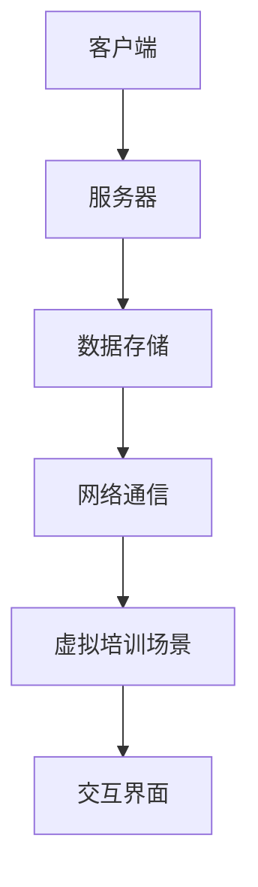
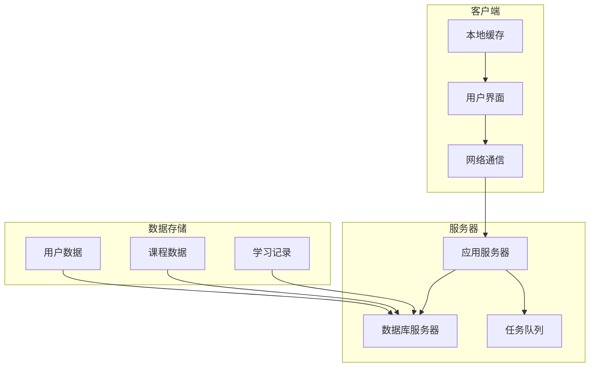
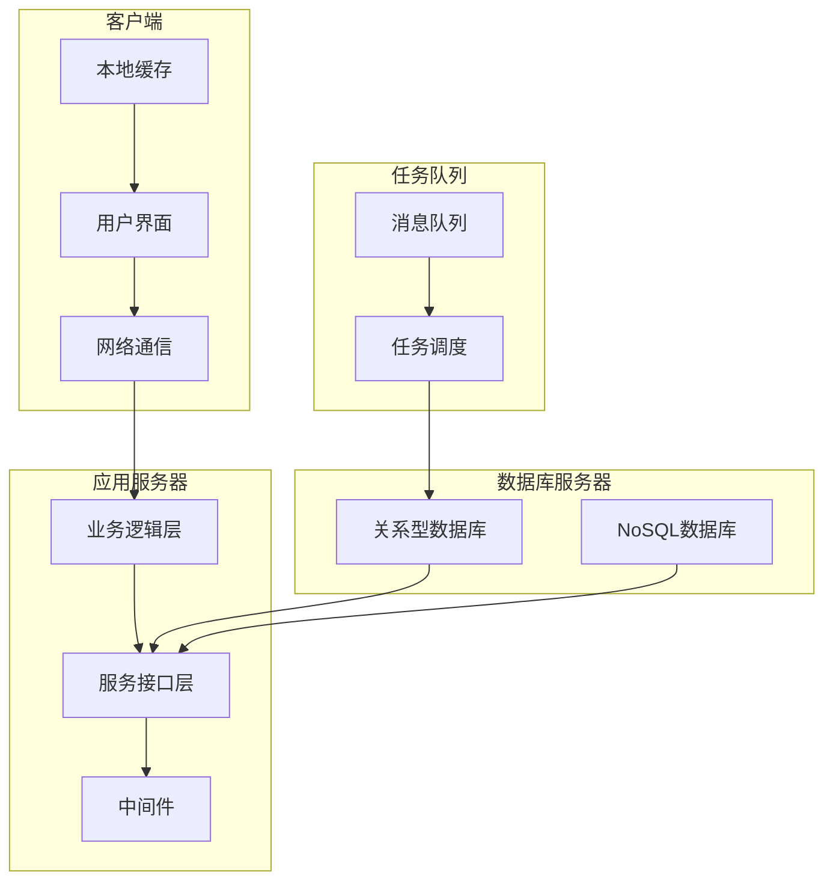
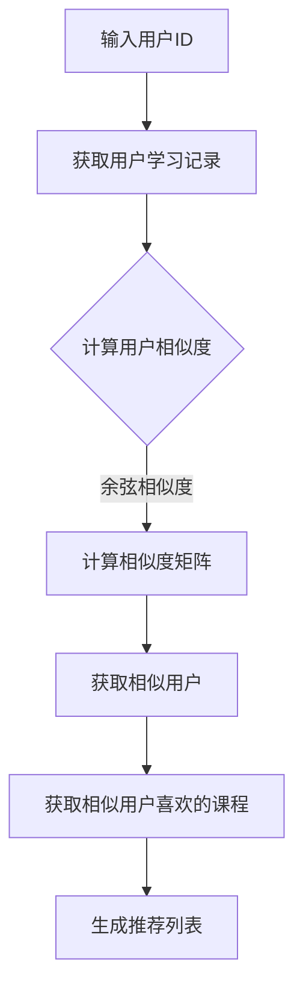
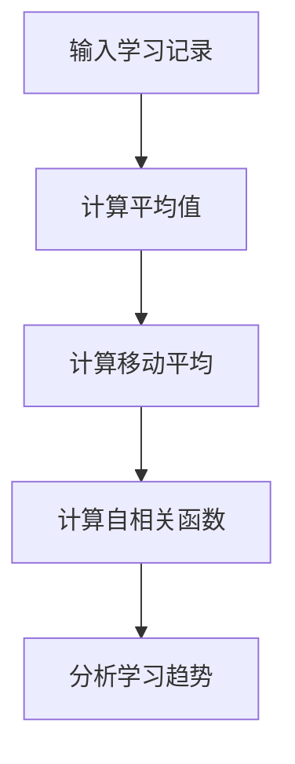
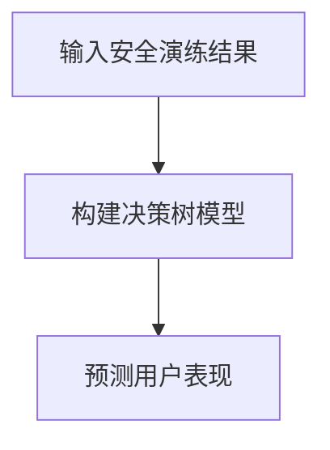

                 

### 虚拟培训系统概述

在现代职场环境中，员工的培训与发展已经成为企业竞争力的关键因素。随着科技的迅猛发展，虚拟培训系统作为一种新兴的培训方式，逐渐受到广泛关注。本部分将围绕虚拟培训系统及其与空间计算技术的应用进行详细探讨。

#### 1.1 问题背景与概述

虚拟培训系统是一种基于计算机技术的培训解决方案，通过虚拟现实（VR）和增强现实（AR）等技术，模拟真实工作环境，为员工提供沉浸式的学习体验。空间计算技术，作为一种新兴的计算模式，通过利用三维空间信息，增强人机交互体验。这两种技术的结合，为员工培训带来了新的机遇。

**虚拟培训系统的定义**：虚拟培训系统是一种利用虚拟现实（VR）和增强现实（AR）技术，模拟真实工作环境，为员工提供沉浸式学习体验的培训系统。

**空间计算技术简介**：空间计算技术是一种通过利用三维空间信息，增强人机交互体验的计算模式。它包括三维空间感知、空间数据建模、空间信息处理等技术。

**虚拟培训系统在员工发展中的应用现状**：虚拟培训系统已广泛应用于各个行业，如医疗、金融、制造等，通过模拟实际工作场景，提高员工的技能水平和应对复杂问题的能力。

#### 1.2 核心概念与联系

要深入理解虚拟培训系统，我们需要明确一些核心概念，包括虚拟现实（VR）和增强现实（AR）技术、空间计算技术原理，以及它们与员工发展的关系。

**虚拟现实（VR）与增强现实（AR）技术**：

- **虚拟现实（VR）**：通过计算机技术模拟出一个完全虚拟的三维环境，用户可以通过头戴式显示器（HMD）等设备进入这个虚拟环境，感受到身临其境的体验。

- **增强现实（AR）**：在现实环境中叠加计算机生成的虚拟信息，用户可以通过智能手机或AR眼镜等设备看到虚实结合的景象。

**空间计算技术原理**：

- **三维空间感知**：利用传感器、摄像头等设备，捕捉用户在三维空间中的位置、姿态等信息。

- **空间数据建模**：通过对空间信息进行建模，构建出三维模型，用于虚拟培训系统的场景模拟。

- **空间信息处理**：对空间数据进行处理和分析，提供实时交互和反馈，增强用户体验。

**虚拟培训系统与员工发展的关系**：

虚拟培训系统通过模拟真实工作环境，提高员工的学习效率和实际操作能力。空间计算技术的引入，进一步增强了培训的沉浸感和互动性，有助于提升员工的职业素养和应对复杂问题的能力。

#### 1.3 虚拟培训系统架构与组件

虚拟培训系统的架构设计是其成功实施的关键。一个典型的虚拟培训系统通常包括以下几个核心组件：

- **客户端**：用户使用的设备，如头戴式显示器（HMD）、智能手机、平板电脑等。

- **服务器**：存储和管理培训内容、用户数据等的计算机设备。

- **数据存储**：用于存储培训内容、用户数据、系统配置等信息的数据库。

- **网络通信**：实现客户端与服务器之间数据传输的网络连接。

- **虚拟培训场景**：通过空间计算技术构建的三维虚拟场景，用于模拟真实工作环境。

- **交互界面**：提供用户与虚拟培训系统交互的界面，包括菜单、按钮、对话框等。

**系统架构设计**：


**系统核心组件介绍**：

- **客户端**：用户通过客户端设备进入虚拟培训系统，选择课程、开始学习等。

- **服务器**：服务器存储和管理培训内容、用户数据等，提供API接口供客户端调用。

- **数据存储**：采用关系型数据库（如MySQL）或NoSQL数据库（如MongoDB）存储数据。

- **网络通信**：采用HTTP/HTTPS协议实现客户端与服务器之间的数据传输。

- **虚拟培训场景**：利用Unity 3D等游戏引擎构建三维虚拟场景。

- **交互界面**：采用HTML/CSS/JavaScript等技术实现。

**系统架构图（Mermaid架构图）**：



#### 1.4 虚拟培训系统关键技术与挑战

虚拟培训系统的开发涉及多种关键技术的应用，同时也面临诸多挑战。

**关键技术分析**：

- **虚拟现实（VR）技术**：实现沉浸式体验，提高培训效果。

- **增强现实（AR）技术**：将虚拟信息叠加到现实环境中，提供更加直观的培训场景。

- **空间计算技术**：增强人机交互体验，提高系统的智能化水平。

- **人工智能技术**：应用于培训内容的自动生成、学习效果评估等。

**系统开发挑战**：

- **用户体验优化**：如何提高系统的沉浸感和交互性，提升用户满意度。

- **系统性能优化**：如何确保系统在高并发情况下仍能稳定运行。

- **数据安全与隐私保护**：如何保障用户数据的隐私和安全。

**解决方案与最佳实践**：

- **用户体验优化**：采用精细的用户界面设计、实时反馈机制等。

- **系统性能优化**：采用分布式架构、负载均衡等技术。

- **数据安全与隐私保护**：采用加密算法、访问控制等安全措施。

#### 1.5 本章小结

本部分对虚拟培训系统进行了概述，包括其定义、空间计算技术简介、核心概念与联系、系统架构与组件、关键技术与挑战等方面的内容。通过本章节的介绍，读者可以初步了解虚拟培训系统及其应用前景，为后续章节的深入学习打下基础。

在下一部分中，我们将进一步探讨空间计算技术在虚拟培训中的具体应用，分析其优势和挑战，并介绍一些实际案例。

## 1.2 核心概念与联系

在深入探讨虚拟培训系统的应用之前，我们需要明确几个核心概念，这些概念不仅是理解虚拟培训系统的基础，也是空间计算技术应用于虚拟培训的核心要素。以下是几个关键概念的详细介绍及其相互联系。

### 虚拟现实（VR）与增强现实（AR）技术

#### 虚拟现实（VR）技术

虚拟现实（VR）是一种通过计算机技术创建的全沉浸式虚拟环境，用户通过头戴式显示器（HMD）等设备进入这个环境，并利用手柄、手套或其他输入设备与虚拟环境互动。VR技术的核心特点包括：

1. **沉浸感**：用户在虚拟环境中感受到如同真实世界的体验，具有很强的沉浸感。
2. **交互性**：用户可以与虚拟环境中的物体进行交互，如移动、操控等。
3. **自主性**：用户可以在虚拟环境中自由移动，探索不同的场景。

#### 增强现实（AR）技术

增强现实（AR）技术则是将虚拟信息叠加到现实世界中，用户通过智能手机、AR眼镜等设备看到现实与虚拟信息的结合。AR技术的主要特点包括：

1. **虚实结合**：虚拟信息与现实环境相结合，提供更加直观和生动的体验。
2. **交互性**：用户可以与虚拟信息进行交互，如选择、拖动等。
3. **便携性**：AR设备通常体积较小，便于携带和使用。

### 空间计算技术原理

空间计算技术是一种利用三维空间信息进行人机交互的计算模式，其核心原理包括：

1. **三维空间感知**：通过传感器、摄像头等设备捕捉用户在三维空间中的位置、姿态等信息。
2. **空间数据建模**：将空间信息转化为三维模型，用于虚拟培训系统的场景模拟。
3. **空间信息处理**：对空间数据进行分析和处理，提供实时交互和反馈，增强用户体验。

### 虚拟培训系统与员工发展的关系

虚拟培训系统通过VR和AR技术，模拟真实工作环境，为员工提供沉浸式的学习体验。空间计算技术的应用，进一步增强了培训的互动性和智能化水平，有助于提升员工的技能和职业素养。具体来说，虚拟培训系统与员工发展的关系体现在以下几个方面：

1. **技能提升**：通过虚拟环境中的实践操作，员工可以快速掌握新技能。
2. **问题解决能力**：模拟复杂的工作场景，帮助员工培养应对问题的能力。
3. **职业发展**：虚拟培训系统提供了多样化的培训内容，有助于员工的职业发展。
4. **学习效率**：沉浸式的学习体验提高了学习效率，减少了传统培训中的枯燥感。

### 概念属性特征对比表格

为了更直观地理解VR和AR技术的属性特征，我们可以通过一个对比表格来展示：

| 特征       | 虚拟现实（VR）          | 增强现实（AR）          |
|------------|-------------------------|-------------------------|
| 沉浸感     | 强                      | 较强                    |
| 交互性     | 高                      | 较高                    |
| 自主性     | 高                      | 较高                    |
| 虚实结合   | 无                      | 有                      |
| 便携性     | 较差                    | 较好                    |

### ER实体关系图架构（Mermaid流程图）

为了更好地理解虚拟培训系统的核心组件及其相互关系，我们可以通过ER实体关系图来展示。以下是一个简化的ER图：

```mermaid
erDiagram
  User ||--|{ TrainingCourse }
  TrainingCourse ||--|{ Session }
  Session ||--|{ User }
  User ||--|{ AssessmentResult }
```

在这个ER图中，`User`（用户）与`TrainingCourse`（培训课程）之间存在一对多的关系，一个用户可以参加多个培训课程。`TrainingCourse`与`Session`（课程会话）也存在一对多的关系，一个培训课程可以包含多个课程会话。`Session`又与`User`存在关联，表示用户参加的具体课程会话。此外，用户与`AssessmentResult`（评估结果）之间存在关联，记录用户在各个课程会话中的表现。

通过上述核心概念与联系的介绍，我们可以更好地理解虚拟培训系统的原理及其在员工发展中的应用。在下一部分，我们将深入探讨虚拟培训系统的架构与组件设计，了解其具体实现细节。

### 1.3 虚拟培训系统架构与组件

虚拟培训系统的架构设计是确保系统能够稳定、高效运行的关键。一个完整的虚拟培训系统通常包含多个核心组件，这些组件协同工作，共同实现培训功能。以下是虚拟培训系统的架构设计及其核心组件的详细介绍。

#### 系统架构设计

虚拟培训系统的架构设计可以分为三个主要层次：客户端、服务器和数据存储层。

1. **客户端**：客户端是用户与虚拟培训系统交互的界面，用户通过客户端设备（如HMD、智能手机等）进入虚拟培训系统。客户端的主要功能包括课程浏览、课程启动、用户交互、数据上传等。

2. **服务器**：服务器是虚拟培训系统的核心，负责处理用户请求、存储和管理数据、提供API接口等。服务器通常包括应用服务器、数据库服务器等。

3. **数据存储**：数据存储层用于存储虚拟培训系统所需的各种数据，包括用户信息、课程内容、学习记录、评估结果等。数据存储层通常采用关系型数据库或NoSQL数据库。

#### 系统核心组件介绍

1. **客户端组件**

   客户端组件是虚拟培训系统的入口，主要包括以下几个部分：

   - **用户界面**：提供用户与系统交互的界面，包括菜单、按钮、对话框等。用户界面设计需要简洁直观，便于用户操作。
   - **网络通信**：实现客户端与服务器之间的数据传输，通常使用HTTP/HTTPS协议。
   - **本地缓存**：提高系统响应速度，减少网络延迟。本地缓存可以存储用户数据、课程内容等。

2. **服务器组件**

   服务器组件是虚拟培训系统的核心，主要包括以下几个部分：

   - **应用服务器**：处理用户请求、执行业务逻辑、提供API接口等。应用服务器通常采用Java、Python等编程语言实现。
   - **数据库服务器**：存储和管理用户数据、课程内容、学习记录等。数据库服务器通常采用MySQL、PostgreSQL等关系型数据库，或MongoDB、Cassandra等NoSQL数据库。
   - **任务队列**：处理后台任务，如数据备份、统计报告生成等。任务队列可以采用RabbitMQ、Kafka等消息队列技术。

3. **数据存储组件**

   数据存储组件是虚拟培训系统的数据基础，主要包括以下几个部分：

   - **用户数据**：包括用户基本信息、学习记录、评估结果等。
   - **课程数据**：包括课程名称、课程描述、课程内容、课程设置等。
   - **学习记录**：记录用户的学习进度、学习时长、评估成绩等。

#### 系统架构图（Mermaid架构图）

为了更直观地展示虚拟培训系统的架构设计，我们可以使用Mermaid绘制一个简化的系统架构图：



在这个架构图中，客户端组件（A、B、C）与服务器组件（D、E、F）通过网络通信进行数据交互。服务器组件（D、E、F）与数据存储组件（G、H、I）通过数据库服务器进行数据存储和管理。

#### 系统架构设计（详细版）

除了上述简化的架构图，我们还可以进一步细化系统架构，包括应用服务器、数据库服务器、任务队列等组件的具体实现。

1. **应用服务器**

   应用服务器是虚拟培训系统的核心，负责处理用户请求、执行业务逻辑等。具体实现包括：

   - **业务逻辑层**：处理用户请求，如用户登录、课程选择、学习记录等。
   - **服务接口层**：提供对外API接口，供客户端调用。
   - **中间件**：处理日志记录、缓存管理、事务管理等。

2. **数据库服务器**

   数据库服务器负责存储和管理虚拟培训系统的数据。具体实现包括：

   - **关系型数据库**：如MySQL、PostgreSQL，用于存储用户数据、课程数据等。
   - **NoSQL数据库**：如MongoDB、Cassandra，用于存储学习记录、评估结果等。

3. **任务队列**

   任务队列用于处理后台任务，如数据备份、统计报告生成等。具体实现包括：

   - **消息队列**：如RabbitMQ、Kafka，用于异步处理任务。
   - **任务调度**：定时执行任务，如每日数据备份、每周统计报告生成等。

#### 系统架构图（Mermaid架构图）

为了更清晰地展示系统架构的详细设计，我们可以进一步扩展Mermaid架构图：



在这个详细架构图中，我们展示了客户端组件、应用服务器组件、数据库服务器组件以及任务队列组件之间的相互关系。

通过以上对虚拟培训系统架构与组件的详细介绍，读者可以更好地理解系统设计的复杂性及其实现细节。在下一部分，我们将进一步探讨虚拟培训系统开发中的关键技术及其挑战。

### 1.4 虚拟培训系统关键技术与挑战

虚拟培训系统的开发涉及多种关键技术的应用，同时也面临诸多挑战。以下将详细分析这些关键技术和挑战，并探讨相应的解决方案和最佳实践。

#### 关键技术分析

1. **虚拟现实（VR）技术**

   VR技术是实现沉浸式虚拟培训的核心。其主要技术包括：

   - **三维场景建模**：利用三维建模软件（如Blender、Maya等）创建虚拟场景，实现逼真的视觉体验。
   - **头戴式显示器（HMD）**：如Oculus Rift、HTC Vive等，提供高分辨率、低延迟的视觉输出。
   - **运动追踪与交互**：通过传感器（如位置传感器、手势识别等）捕捉用户的动作，实现与虚拟环境的交互。

2. **增强现实（AR）技术**

   AR技术将虚拟信息叠加到现实环境中，增强培训的真实感。其主要技术包括：

   - **图像识别与跟踪**：利用计算机视觉算法识别和跟踪现实环境中的目标，实现虚拟信息的叠加。
   - **显示设备**：如AR眼镜（如Microsoft HoloLens、Google Glass等），提供高清晰度的虚拟信息显示。
   - **实时交互**：通过触摸屏、手势识别等实现用户与虚拟信息的实时交互。

3. **空间计算技术**

   空间计算技术通过捕捉和处理三维空间信息，提供更加自然的用户交互体验。其主要技术包括：

   - **三维空间感知**：利用传感器、摄像头等设备捕捉用户在三维空间中的位置、姿态等信息。
   - **空间数据建模**：通过空间数据建模技术，将用户在三维空间中的行为转化为虚拟环境中的交互。
   - **实时反馈与交互**：通过实时反馈机制，提高用户的沉浸感和互动性。

4. **人工智能技术**

   人工智能技术在虚拟培训系统中发挥着重要作用，包括：

   - **个性化推荐**：利用机器学习算法，根据用户的学习历史和偏好，推荐适合的学习内容。
   - **智能评估**：通过自然语言处理和图像识别等技术，对用户的培训效果进行智能评估。
   - **虚拟助手**：利用聊天机器人等技术，提供实时学习支持和交互体验。

#### 系统开发挑战

1. **用户体验优化**

   在虚拟培训系统中，用户体验直接影响到培训效果。主要挑战包括：

   - **交互性**：如何设计自然、直观的交互方式，提高用户的参与度和满意度。
   - **沉浸感**：如何提升虚拟环境的真实感，增强用户的沉浸体验。

2. **系统性能优化**

   虚拟培训系统通常需要处理大量数据和高并发的用户请求，对系统性能提出了较高要求。主要挑战包括：

   - **响应速度**：如何优化系统的响应速度，确保用户在虚拟环境中的流畅体验。
   - **负载均衡**：如何实现负载均衡，避免系统在高并发情况下崩溃。

3. **数据安全与隐私保护**

   虚拟培训系统涉及大量用户数据，如何保障数据的安全性和隐私性成为重要挑战。主要挑战包括：

   - **数据加密**：如何对用户数据进行加密，防止数据泄露。
   - **访问控制**：如何实现严格的访问控制，确保只有授权用户可以访问敏感数据。

#### 解决方案与最佳实践

1. **用户体验优化**

   - **交互设计**：采用自然交互方式，如手势识别、语音控制等，提高用户的参与度。
   - **沉浸感增强**：通过高质量的三维建模和逼真的音效，提升虚拟环境的真实感。

2. **系统性能优化**

   - **分布式架构**：采用分布式架构，提高系统的扩展性和性能。
   - **缓存技术**：利用缓存技术，减少数据访问的延迟。
   - **负载均衡**：采用负载均衡策略，实现分布式部署，确保系统在高并发情况下的稳定性。

3. **数据安全与隐私保护**

   - **数据加密**：采用加密算法，对用户数据进行加密存储和传输。
   - **访问控制**：采用访问控制策略，严格控制用户对数据的访问权限。
   - **安全审计**：定期进行安全审计，及时发现和解决潜在的安全隐患。

通过上述解决方案和最佳实践，我们可以有效地应对虚拟培训系统开发中的关键技术和挑战，确保系统的高效、稳定和安全运行。

#### 1.5 本章小结

在本章中，我们对虚拟培训系统进行了全面的概述，包括其定义、背景、核心概念、架构与组件以及关键技术与挑战。通过本章的学习，读者可以初步了解虚拟培训系统的基本原理和应用前景，为后续章节的深入学习打下基础。在下一章中，我们将进一步探讨空间计算技术在虚拟培训中的具体应用，分析其优势与挑战。

## 1.6 本章小结

本章对虚拟培训系统及其与空间计算技术的应用进行了详细探讨，涵盖了核心概念、架构设计与组件、关键技术分析、系统开发挑战以及解决方案和最佳实践。以下是本章的主要内容小结：

1. **核心概念**：介绍了虚拟现实（VR）与增强现实（AR）技术，以及空间计算技术的基本原理，阐述了这些技术在虚拟培训系统中的应用及其与员工发展的关系。
2. **架构与组件**：详细描述了虚拟培训系统的架构设计，包括客户端、服务器和数据存储层，并对各个组件的功能进行了详细解释。
3. **关键技术**：分析了虚拟现实、增强现实、空间计算和人工智能技术在虚拟培训系统中的应用，探讨了这些技术在提升用户体验、系统性能和数据安全方面的优势。
4. **开发挑战**：讨论了虚拟培训系统开发中面临的主要挑战，包括用户体验优化、系统性能优化和数据安全与隐私保护。
5. **解决方案与最佳实践**：提出了针对开发挑战的解决方案和最佳实践，包括交互设计优化、系统性能优化、数据加密和访问控制等。

通过本章的学习，读者可以全面了解虚拟培训系统的原理、架构及其在员工发展中的应用价值。在下一章中，我们将进一步探讨空间计算技术在虚拟培训中的具体应用，分析其实际效果和案例，为读者提供更加直观的认识。

## 2.1 空间计算技术在虚拟培训中的核心应用

空间计算技术在虚拟培训中的核心应用，极大地改变了传统培训方式，提供了更加丰富和沉浸的学习体验。以下将详细分析这些技术在实际培训中的应用案例，探讨其优势以及可能面临的挑战。

### 虚拟现实培训应用案例

#### 案例一：航空公司的机舱模拟培训

航空公司利用虚拟现实技术，为飞行员提供逼真的机舱模拟培训。飞行员可以通过头戴式显示器（HMD）进入虚拟机舱，进行飞行操作练习。这种培训方式不仅可以模拟各种飞行场景，还可以实时捕捉飞行员的动作和反应，为飞行员提供详细的操作反馈。

**优势**：

- **沉浸感强**：飞行员可以在高度仿真的环境中进行操作练习，提高学习效果。
- **安全可控**：虚拟环境可以安全地模拟各种极端情况，避免实际操作中的风险。
- **个性化培训**：系统可以根据飞行员的操作记录，提供个性化的训练方案，提高培训的针对性。

**挑战**：

- **设备成本高**：高质量的虚拟现实设备价格昂贵，对航空公司来说是一笔不小的投资。
- **技术维护难度大**：虚拟现实技术需要定期维护和更新，以保持其稳定性和性能。

#### 案例二：制造企业的产品装配培训

制造企业利用虚拟现实技术，为员工提供产品装配培训。员工可以通过虚拟现实设备，在虚拟环境中进行产品装配操作。这种培训方式不仅节省了实际产品的损耗，还能让员工在虚拟环境中反复练习，直到熟练掌握操作。

**优势**：

- **成本节约**：虚拟现实技术减少了实际产品的使用和损耗，降低了培训成本。
- **操作熟练度提升**：员工可以在虚拟环境中反复练习，提高操作熟练度。
- **安全培训**：虚拟环境可以模拟各种危险操作，提高员工的安全意识。

**挑战**：

- **学习曲线**：员工需要适应虚拟现实设备的使用，这可能需要一段时间的学习和适应。
- **技术适应性**：不同的产品需要不同的虚拟现实培训环境，系统的适应性要求较高。

### 增强现实培训应用案例

#### 案例一：医疗手术模拟培训

医疗领域利用增强现实技术，为医生提供手术模拟培训。医生可以通过增强现实眼镜，将虚拟手术步骤叠加到实际手术环境中，进行手术操作练习。这种培训方式不仅提高了医生的操作熟练度，还能在手术前进行详细的预演，降低手术风险。

**优势**：

- **直观性**：增强现实技术将虚拟信息叠加到实际环境中，医生可以更加直观地进行操作。
- **实时反馈**：系统可以实时捕捉医生的操作，提供即时反馈，帮助医生改进操作。
- **风险降低**：通过虚拟手术模拟，医生可以在无风险的环境中练习复杂的手术操作。

**挑战**：

- **设备成本**：高质量的增强现实设备价格较高，对医疗机构来说是一笔较大的投资。
- **技术复杂度**：增强现实技术涉及图像识别、虚拟信息叠加等复杂技术，系统开发难度较大。

#### 案例二：建筑设计与施工培训

建筑企业利用增强现实技术，为建筑设计师和施工人员提供培训。设计师和施工人员可以通过增强现实眼镜，查看建筑的三维模型，进行设计和施工操作。这种培训方式不仅提高了工作效率，还能提前发现设计中的问题，提高项目的成功率。

**优势**：

- **三维可视化**：增强现实技术提供了直观的三维可视化效果，有助于设计师和施工人员理解项目。
- **实时调整**：设计师和施工人员可以在实际环境中实时调整设计或施工方案，提高效率。
- **协同工作**：增强现实技术可以支持多人协同工作，提高项目的整体效率。

**挑战**：

- **技术适应性**：不同的建筑项目和需求，需要不同的增强现实培训解决方案，系统的适应性要求较高。
- **操作复杂性**：增强现实技术操作较为复杂，需要对操作人员进行培训，提高其技术水平。

### 空间计算技术在员工技能提升中的应用

空间计算技术在员工技能提升中的应用，不仅限于上述领域，还广泛应用于金融、制造、教育等行业。以下是一些具体应用场景：

#### 案例一：金融行业的交易模拟培训

金融行业利用虚拟现实和增强现实技术，为交易员提供交易模拟培训。交易员可以在虚拟交易大厅中进行交易操作，模拟真实交易环境，提高交易技能和应变能力。

**优势**：

- **模拟真实交易环境**：虚拟现实和增强现实技术可以模拟真实的交易环境，提高交易员的实战经验。
- **风险可控**：虚拟交易环境可以设定不同的风险参数，交易员可以在无风险的情况下练习交易策略。
- **个性化培训**：系统可以根据交易员的历史交易数据，提供个性化的培训方案。

**挑战**：

- **数据真实性问题**：虚拟交易环境的数据可能与现实环境存在差异，影响培训效果。
- **设备适应性**：不同类型的交易员可能需要不同的虚拟现实和增强现实设备，系统的适应性要求较高。

#### 案例二：制造业的工艺流程培训

制造业利用虚拟现实和增强现实技术，为员工提供工艺流程培训。员工可以在虚拟生产线上进行操作练习，熟悉各种工艺流程，提高操作技能和工艺水平。

**优势**：

- **工艺流程可视化**：虚拟现实和增强现实技术可以将复杂的工艺流程可视化，提高员工的操作熟练度。
- **操作练习**：员工可以在虚拟环境中反复练习操作，减少实际生产中的错误率。
- **技能提升**：通过虚拟培训，员工可以在较短时间内掌握复杂的工艺流程，提高工作效率。

**挑战**：

- **虚拟环境与实际环境的差异**：虚拟环境可能与实际生产环境存在差异，影响培训效果。
- **操作复杂性**：不同的工艺流程需要不同的虚拟培训方案，系统的复杂性较高。

通过上述应用案例，我们可以看到空间计算技术在虚拟培训中的广泛应用及其带来的优势。然而，这些技术的应用也面临一定的挑战，需要通过不断的技术创新和优化来克服。在下一章中，我们将进一步探讨虚拟培训系统的功能设计、用户界面设计以及性能优化策略，为虚拟培训系统的成功实施提供更加全面的指导。

### 2.2 虚拟培训系统功能设计

虚拟培训系统的功能设计是确保系统能够满足用户需求、提供优质学习体验的关键。功能设计包括需求分析、功能模块设计和功能实现策略。以下将详细讨论这些内容。

#### 需求分析

需求分析是功能设计的第一步，通过深入了解用户需求和培训目标，确定系统应具备的功能和性能要求。

1. **用户需求**：

   - **沉浸式学习体验**：用户希望能够在虚拟环境中获得与现实相似的沉浸感，提高学习兴趣和效果。
   - **个性化培训内容**：用户希望系统能够根据个人需求和水平，提供定制化的培训内容。
   - **互动性和反馈**：用户希望系统能够提供实时互动和反馈，帮助用户理解并巩固学习内容。
   - **灵活性和可扩展性**：系统应具有灵活的架构和可扩展性，以适应不同的培训场景和需求。

2. **培训目标**：

   - **技能提升**：通过虚拟培训系统，帮助用户掌握新技能或提高现有技能水平。
   - **问题解决能力**：通过模拟真实场景，帮助用户培养应对复杂问题的能力。
   - **职业发展**：提供多样化的培训课程，助力用户的职业发展。

#### 功能模块设计

根据需求分析，虚拟培训系统可以设计为以下几个主要功能模块：

1. **用户管理模块**：

   - **用户注册与登录**：提供用户注册和登录功能，确保用户身份的合法性。
   - **用户信息管理**：存储和管理用户的基本信息，如姓名、联系方式、培训记录等。
   - **用户权限管理**：根据用户的角色和权限，限制用户对系统的访问和使用。

2. **课程管理模块**：

   - **课程发布**：管理员可以发布新课程，设置课程信息，如课程名称、描述、难度等级等。
   - **课程分类**：将课程按主题、难度等分类，便于用户查找和选择。
   - **课程更新**：定期更新课程内容，保持培训的时效性和新颖性。

3. **学习管理模块**：

   - **学习记录**：记录用户的学习进度、学习时长、评估成绩等。
   - **学习计划**：为用户提供个性化的学习计划，指导用户按计划学习。
   - **学习反馈**：提供学习反馈功能，用户可以评价课程质量，提供改进建议。

4. **评估管理模块**：

   - **在线测试**：提供在线测试功能，评估用户的学习效果。
   - **评估报告**：生成用户的评估报告，包括学习进度、测试成绩等。
   - **证书颁发**：根据用户的评估成绩，颁发电子证书，作为学习证明。

5. **用户交互模块**：

   - **实时互动**：提供实时互动功能，如聊天室、讨论区等，用户可以交流学习心得。
   - **互动游戏**：设计互动游戏，提高用户的学习兴趣和参与度。
   - **虚拟助手**：提供虚拟助手，解答用户在学习过程中遇到的问题。

#### 功能实现策略

1. **技术选型**：

   - **虚拟现实（VR）**：选择合适的VR设备，如头戴式显示器（HMD）、手柄等，实现沉浸式学习体验。
   - **增强现实（AR）**：选择合适的AR设备，如AR眼镜、智能手机等，实现虚实结合的学习体验。
   - **空间计算技术**：利用空间计算技术，增强人机交互体验，提高系统的智能化水平。

2. **开发框架**：

   - **前端框架**：选择合适的前端开发框架，如React、Vue等，实现用户界面和交互功能。
   - **后端框架**：选择合适的后端开发框架，如Spring Boot、Django等，处理业务逻辑和数据存储。
   - **数据库**：选择合适的数据库，如MySQL、MongoDB等，存储用户数据、课程内容等。

3. **性能优化**：

   - **缓存技术**：利用缓存技术，减少数据访问的延迟，提高系统响应速度。
   - **负载均衡**：采用负载均衡策略，实现分布式部署，确保系统在高并发情况下的稳定性。
   - **代码优化**：优化系统代码，减少不必要的资源消耗，提高系统性能。

4. **安全性**：

   - **数据加密**：对用户数据进行加密存储和传输，确保数据的安全性。
   - **访问控制**：实现严格的访问控制策略，确保只有授权用户可以访问敏感数据。
   - **安全审计**：定期进行安全审计，及时发现和解决潜在的安全隐患。

通过以上功能设计策略，我们可以构建一个高效、稳定、安全的虚拟培训系统，满足用户的学习需求，提高培训效果。

### 2.3 虚拟培训系统的用户界面设计

用户界面（UI）设计在虚拟培训系统中起着至关重要的作用，它直接影响到用户的学习体验和满意度。一个优秀的用户界面设计不仅需要简洁直观，还需要具备良好的互动性和适应性。以下将详细讨论用户界面设计的原则、用户交互设计和用户界面实现与优化策略。

#### 用户界面设计原则

1. **简洁性**：用户界面应尽量简洁，避免复杂的设计和冗余的功能，减少用户的操作负担。简洁性不仅提升了用户体验，还提高了系统的易用性。

2. **一致性**：用户界面设计应保持一致性，包括色彩、字体、按钮样式等。一致性有助于用户快速识别和操作功能，降低学习成本。

3. **响应性**：用户界面设计应适应不同设备和屏幕尺寸，提供良好的响应性。无论是桌面端、移动端还是VR设备，用户界面都应保持一致的体验。

4. **交互性**：用户界面设计应注重交互性，提供丰富的交互方式，如点击、滑动、手势等。交互性增强了用户与虚拟培训系统的互动，提高了学习兴趣。

5. **易用性**：用户界面设计应易于使用，用户能够轻松地完成各种操作。易用性是用户界面的核心目标，有助于提升用户的学习效果。

#### 用户交互设计

1. **导航设计**：用户界面应提供清晰的导航设计，帮助用户快速找到所需功能。导航设计应简洁明了，避免复杂的层级结构和冗余的导航选项。

2. **按钮和图标设计**：按钮和图标应直观、易于理解，使用户能够快速识别和操作。按钮和图标的设计应遵循一致性原则，避免出现混乱和不一致的情况。

3. **反馈机制**：用户界面设计应提供及时的反馈机制，用户在进行操作时，能够立即看到操作结果。反馈机制有助于用户了解系统状态，提高用户的操作信心。

4. **互动性设计**：用户界面设计应注重互动性，提供丰富的交互方式，如滑动、拖动、手势等。互动性设计不仅提高了用户的参与度，还增强了学习的趣味性。

5. **可访问性设计**：用户界面设计应考虑可访问性，确保不同用户（包括视力障碍、听力障碍等）都能够顺利使用系统。可访问性设计包括字体大小、颜色对比度、语音提示等。

#### 用户界面实现与优化策略

1. **前端技术选型**：选择合适的前端技术，如HTML5、CSS3、JavaScript等，实现用户界面的基础结构。HTML5提供丰富的标签和多媒体支持，CSS3提供丰富的样式和动画效果，JavaScript提供动态交互功能。

2. **响应式布局**：采用响应式布局技术，实现不同设备和屏幕尺寸的适配。响应式布局可以通过媒体查询（Media Queries）和框架（如Bootstrap、Foundation等）来实现。

3. **用户体验测试**：在用户界面设计完成后，进行用户体验测试，收集用户的反馈和意见。用户体验测试可以通过A/B测试、焦点小组讨论等方式进行，帮助发现并优化界面设计中的问题。

4. **性能优化**：对用户界面进行性能优化，提高加载速度和响应速度。性能优化包括压缩代码、优化图片、使用CDN、缓存技术等。

5. **可访问性优化**：对用户界面进行可访问性优化，确保不同用户都能够顺利使用系统。可访问性优化包括使用适当的颜色对比度、提供语音提示、使用无障碍标签等。

6. **持续迭代**：用户界面设计不是一蹴而就的，应采用持续迭代的方法，根据用户反馈和需求，不断优化和改进界面设计。

通过以上用户界面设计原则、用户交互设计和实现与优化策略，我们可以构建一个高质量、易用、互动性强的虚拟培训系统用户界面，提升用户的学习体验和满意度。

### 2.4 虚拟培训系统的性能优化

虚拟培训系统的性能优化是确保系统在高并发情况下仍能稳定运行的关键。一个高效的性能优化策略不仅能够提升用户的使用体验，还能延长系统设备的寿命，降低维护成本。以下将详细讨论虚拟培训系统的性能优化策略、系统性能测试与评估方法，以及性能瓶颈的分析与解决。

#### 性能优化策略

1. **分布式架构**

   采用分布式架构可以显著提升系统的性能和可靠性。分布式架构将系统分解为多个模块，每个模块可以独立部署和扩展，从而提高系统的可扩展性和容错性。常见的分布式架构模式包括微服务架构和负载均衡架构。

   - **微服务架构**：将系统功能拆分为多个独立的服务，每个服务负责特定的功能，如用户管理、课程管理、学习记录管理等。微服务架构可以充分利用集群资源，提高系统的并发处理能力。
   - **负载均衡架构**：通过负载均衡器（如Nginx、HAProxy等）实现请求的负载均衡，将请求分发到不同的服务器节点，从而避免单点故障，提高系统的可用性。

2. **缓存技术**

   缓存技术是提升系统性能的重要手段。通过缓存常用数据，减少对后端数据库的访问次数，从而降低系统的负载。常用的缓存技术包括内存缓存（如Redis、Memcached等）和分布式缓存（如Memcached Cluster、Redis Cluster等）。

   - **内存缓存**：内存缓存具有高速缓存的特点，适用于存储高频次访问的数据，如用户信息、课程列表等。
   - **分布式缓存**：分布式缓存可以扩展存储容量和处理能力，适用于存储大容量数据，如用户学习记录、课程内容等。

3. **负载均衡**

   负载均衡是将请求分配到多个服务器节点，避免单点过载，提高系统的并发处理能力。常见的负载均衡策略包括轮询、最小连接数、加权轮询等。

   - **轮询**：轮询策略将请求按顺序分配到每个服务器节点，实现简单的负载均衡。
   - **最小连接数**：最小连接数策略将请求分配到当前连接数最少的服务器节点，从而确保负载均衡。
   - **加权轮询**：加权轮询策略根据服务器节点的性能和负载情况，为每个节点分配不同的权重，从而实现更加灵活的负载均衡。

4. **代码优化**

   代码优化是提升系统性能的基础。通过优化系统代码，减少不必要的资源消耗，提高系统的执行效率。代码优化包括以下几个方面：

   - **算法优化**：选择高效的算法和数据结构，减少系统的时间复杂度和空间复杂度。
   - **数据库优化**：优化数据库查询语句，减少查询时间，提高数据访问效率。
   - **避免缓存未命中**：通过合理设置缓存策略，减少缓存未命中情况，提高缓存命中率。

5. **资源管理**

   资源管理是确保系统稳定运行的重要环节。通过合理分配和监控系统资源，避免资源不足或浪费。资源管理包括以下几个方面：

   - **内存管理**：通过合理的内存分配和回收策略，避免内存泄漏和碎片化。
   - **CPU管理**：合理分配CPU资源，避免单线程或单服务器过载，提高系统的并发处理能力。
   - **网络管理**：优化网络连接，避免网络拥塞和延迟，提高数据传输效率。

#### 系统性能测试与评估方法

系统性能测试与评估是验证系统性能和发现性能瓶颈的重要手段。以下介绍几种常见的性能测试与评估方法：

1. **负载测试**

   负载测试是通过模拟实际负载情况，评估系统在特定负载下的性能表现。负载测试可以采用工具（如JMeter、LoadRunner等）模拟大量用户并发访问系统，评估系统的响应时间、吞吐量、并发能力等指标。

2. **压力测试**

   压力测试是通过逐渐增加负载，评估系统在极限负载下的性能表现。压力测试可以找出系统的性能瓶颈，评估系统的最大承载能力和稳定性。

3. **性能分析**

   性能分析是通过分析系统日志、监控数据等，找出系统性能瓶颈和优化方向。性能分析包括以下几个方面：

   - **数据库性能分析**：分析数据库查询性能，找出慢查询和索引缺失问题，优化数据库查询语句。
   - **网络性能分析**：分析网络延迟和带宽利用率，找出网络瓶颈，优化网络配置。
   - **代码性能分析**：分析系统代码，找出性能瓶颈和资源消耗高的部分，进行优化。

#### 性能瓶颈的分析与解决

性能瓶颈是影响系统性能的关键因素，通过以下方法可以分析和解决性能瓶颈：

1. **定位瓶颈**

   通过性能测试和性能分析，定位系统中的性能瓶颈。性能瓶颈可能存在于数据库、网络、服务器等不同层次。

2. **优化数据库**

   优化数据库查询性能，减少查询时间，提高数据访问效率。优化方法包括：

   - **索引优化**：为频繁查询的字段创建索引，提高查询速度。
   - **查询优化**：优化查询语句，减少复杂查询和冗余查询。
   - **分库分表**：对于大容量数据，采用分库分表策略，降低单表的数据量。

3. **优化网络**

   优化网络配置和带宽利用率，提高数据传输效率。优化方法包括：

   - **负载均衡**：采用负载均衡策略，实现分布式部署，避免单点过载。
   - **网络优化**：优化网络拓扑结构，减少网络延迟和带宽占用。

4. **优化代码**

   优化系统代码，减少不必要的资源消耗，提高系统的执行效率。优化方法包括：

   - **算法优化**：选择高效的算法和数据结构，减少系统的时间复杂度和空间复杂度。
   - **缓存优化**：合理设置缓存策略，减少缓存未命中情况，提高缓存命中率。

5. **升级硬件**

   对于无法通过软件优化的性能瓶颈，可以考虑升级硬件设备，提高系统的性能和并发处理能力。

通过上述性能优化策略、系统性能测试与评估方法以及性能瓶颈的分析与解决，我们可以构建一个高效、稳定、可靠的虚拟培训系统，提升用户的使用体验和学习效果。

### 2.5 空间计算技术在虚拟培训中的创新与趋势

随着科技的不断进步，空间计算技术在虚拟培训中的应用正在不断拓展，带来了前所未有的创新和变革。以下将分析当前空间计算技术在虚拟培训中的创新应用案例，探讨行业趋势，并展望未来的发展前景。

#### 创新应用案例分析

1. **远程协作培训**

   空间计算技术使得远程协作培训成为可能。通过虚拟现实（VR）和增强现实（AR）技术，学员可以与其他学员和讲师进行实时互动，共同参与培训项目。例如，在一个虚拟会议室中，学员们可以身处不同的地理位置，通过VR设备共同观看演示、讨论问题，甚至进行角色扮演模拟演练。

   **优势**：
   - **地理限制减少**：学员无需亲临现场，大大减少了地理距离对培训的限制。
   - **高效互动**：实时互动提高了学员的参与度和学习效果。
   - **资源共享**：学员可以共享虚拟培训环境中的资源和工具，提高协作效率。

2. **沉浸式安全教育**

   空间计算技术为安全教育提供了沉浸式的学习体验。例如，在消防培训中，学员可以通过VR设备进入一个模拟的火灾现场，学习如何正确使用消防设备、如何逃生等。这种培训方式不仅生动直观，还能提高学员的安全意识和应急处理能力。

   **优势**：
   - **高度仿真**：模拟真实场景，提高学员的实战能力和安全意识。
   - **风险可控**：在虚拟环境中进行训练，避免了实际操作中的风险。
   - **灵活调整**：可以根据培训需求，随时调整训练场景和内容。

3. **个性化培训**

   空间计算技术结合大数据和人工智能，实现了个性化培训。通过分析学员的学习行为和成绩，系统可以推荐适合学员的培训内容，并提供个性化的学习计划。此外，虚拟助手和智能评估系统可以帮助学员识别学习中的弱点，提供针对性的培训建议。

   **优势**：
   - **个性化学习**：根据学员的特点和需求，提供定制化的培训方案。
   - **高效学习**：减少无效学习内容，提高学习效率和成果。
   - **实时反馈**：提供即时反馈，帮助学员及时调整学习策略。

#### 行业趋势分析

1. **虚拟现实（VR）技术的普及**

   随着VR设备的性能提升和价格下降，VR技术在虚拟培训中的应用越来越普及。越来越多的企业和教育机构开始采用VR技术进行培训，以提高培训效果和学员满意度。

2. **增强现实（AR）技术的融合**

   AR技术将虚拟信息叠加到现实环境中，为虚拟培训带来了新的交互方式。随着AR设备的普及和成本的降低，AR技术将在虚拟培训中发挥越来越重要的作用，特别是在需要虚实结合的培训场景中。

3. **空间计算与人工智能的结合**

   空间计算技术正在与人工智能（AI）技术深度融合，为虚拟培训带来了智能化的发展趋势。AI技术可以帮助分析学员的学习数据，提供个性化的学习建议，同时AI驱动的虚拟助手可以提供实时学习支持，提高培训的互动性和效率。

#### 未来发展展望

1. **更真实的虚拟培训体验**

   随着VR和AR技术的不断进步，虚拟培训系统的视觉效果和交互体验将越来越真实。未来，虚拟培训环境将更加逼真，学员可以沉浸在高度仿真的虚拟场景中，体验更加丰富的学习内容。

2. **智能化培训系统的普及**

   随着AI技术的发展，虚拟培训系统将变得更加智能化。通过AI技术，系统可以自动生成培训内容、评估学员的学习效果，并提供个性化的学习建议。智能化的培训系统将大大提高培训效率，降低培训成本。

3. **远程协作培训的广泛应用**

   随着远程办公的普及，远程协作培训将在未来得到更广泛的应用。通过虚拟培训系统和远程协作工具的结合，学员可以随时随地参与培训，实现真正的“零距离”学习。

4. **跨领域的融合应用**

   空间计算技术将在更多领域得到应用，如医疗、金融、军事等。通过虚拟培训系统，这些领域的专业人员可以在虚拟环境中进行模拟训练，提高专业技能和安全意识。

通过上述分析，我们可以看到空间计算技术在虚拟培训中的创新应用和未来发展趋势。随着技术的不断进步，虚拟培训系统将变得更加智能、高效和实用，为员工的发展和企业竞争力的提升提供有力支持。

### 2.6 本章小结

本章详细探讨了空间计算技术在虚拟培训中的核心应用，分析了虚拟现实（VR）和增强现实（AR）技术的优势，以及空间计算技术在员工技能提升、远程协作培训、沉浸式安全教育等方面的应用案例。同时，本章还探讨了虚拟培训系统的功能设计、用户界面设计、性能优化策略以及空间计算技术在虚拟培训中的创新与趋势。通过本章的学习，读者可以全面了解空间计算技术在虚拟培训中的重要作用和发展潜力，为未来虚拟培训系统的设计和实施提供有力指导。

在下一章中，我们将进一步探讨虚拟培训系统的实际应用与案例分析，通过具体的项目实施来深入理解虚拟培训系统的构建和运行过程。

### 3.1 案例背景与目标

为了深入探讨虚拟培训系统在实际应用中的效果和实施过程，我们选择了一个具有代表性的案例——某大型制造企业的虚拟培训项目。该企业致力于提升员工的生产技能和安全意识，通过引入虚拟培训系统，实现培训的远程化和智能化。以下是该案例的背景、目标以及实施计划。

#### 案例背景

该大型制造企业拥有数千名员工，分布在不同的工厂和生产线上。由于地域分散和员工岗位多样化的特点，传统的集中培训方式存在诸多困难，如培训资源分配不均、培训效果难以评估等。此外，随着生产设备的更新和工艺流程的复杂化，员工需要不断掌握新技能和遵守安全规范。因此，企业决定引入虚拟培训系统，以提高培训的灵活性和效果。

#### 案例目标

1. **技能提升**：通过虚拟培训系统，帮助员工掌握新设备操作技巧、工艺流程优化等生产技能。
2. **安全培训**：利用虚拟培训系统模拟危险操作场景，提高员工的安全意识和应急处理能力。
3. **培训效率**：实现远程培训，减少员工因集中培训带来的时间成本和交通费用。
4. **培训效果评估**：通过系统提供的评估功能，实时监控员工的学习进度和效果，为后续培训提供依据。

#### 实施计划

1. **需求分析**：

   在项目启动阶段，企业进行了详细的需求分析，与各生产线主管和技术专家深入交流，明确虚拟培训系统的功能需求，包括技能培训模块、安全培训模块、学习记录管理模块等。

2. **系统设计**：

   根据需求分析结果，企业制定了虚拟培训系统的架构设计方案。系统包括客户端、服务器和数据存储层，采用VR和AR技术，实现沉浸式和虚实结合的培训体验。系统架构如图所示：

   

3. **内容开发**：

   企业与专业内容开发团队合作，根据培训需求，开发了一系列虚拟培训课程。包括生产设备操作、工艺流程优化、安全演练等，课程内容经过多次测试和优化，确保其准确性和实用性。

4. **系统测试**：

   在系统开发完成后，企业进行了全面的系统测试，包括功能测试、性能测试和安全测试等，确保系统稳定可靠，无漏洞和安全隐患。

5. **员工培训**：

   企业组织了员工进行虚拟培训系统的使用培训，确保员工熟悉系统的操作流程和使用方法。同时，通过模拟操作和实际演练，帮助员工掌握培训内容。

6. **实施与推广**：

   企业将虚拟培训系统部署到各个工厂和生产线上，并制定了详细的实施计划和时间表。在实施过程中，企业不断收集员工的反馈，及时调整和优化系统，确保系统的稳定运行和良好的用户体验。

#### 案例实施效果

通过虚拟培训系统的实施，企业取得了显著的效果：

1. **技能提升**：员工在生产技能和安全意识方面得到了明显提高，实际操作中的错误率显著降低。
2. **培训效率**：远程培训模式减少了员工的时间成本和交通费用，提高了培训的灵活性和覆盖面。
3. **培训效果评估**：系统提供了详细的学习记录和评估报告，企业可以实时监控员工的学习进度和效果，为后续培训提供了有力支持。
4. **员工满意度**：员工对虚拟培训系统的满意度较高，认为其比传统培训方式更加生动、有趣和有效。

通过上述案例背景、目标以及实施计划的详细介绍，我们可以看到虚拟培训系统在实际应用中的实施过程和取得的成效。在下一部分，我们将深入探讨虚拟培训系统的设计与实现，包括系统需求分析、系统架构设计、核心模块实现等。

### 3.2 系统设计与实现

为了实现案例中提到的虚拟培训系统，我们首先进行系统需求分析，然后详细阐述系统架构设计、核心模块实现，并展示相关的算法原理和数学模型。

#### 系统需求分析

在系统需求分析阶段，我们与企业的各个部门进行了深入交流，明确了系统的功能需求和非功能需求。

1. **功能需求**：

   - **用户管理**：实现用户注册、登录、信息管理等功能。
   - **课程管理**：包括课程发布、分类、更新等功能。
   - **学习记录管理**：记录用户的学习进度、成绩等。
   - **安全培训**：提供安全演练模块，模拟危险操作场景。
   - **技能培训**：提供各种技能培训课程，包括操作流程、设备使用等。

2. **非功能需求**：

   - **性能要求**：系统应具备高并发处理能力，支持大量用户同时在线。
   - **安全性**：确保用户数据的安全，防止数据泄露。
   - **兼容性**：支持多种设备和操作系统，如Windows、MacOS、iOS、Android等。

#### 系统架构设计

虚拟培训系统采用分布式架构，包括客户端、服务器和数据存储层。以下为系统架构的详细描述：

1. **客户端**：

   客户端是用户与系统的交互界面，用户通过客户端设备（如VR头盔、AR眼镜、智能手机等）访问系统。客户端的功能包括：

   - **用户界面**：提供用户交互的界面，包括菜单、按钮、对话框等。
   - **网络通信**：实现与服务器之间的数据传输。
   - **本地缓存**：缓存用户数据和课程内容，提高系统响应速度。

2. **服务器**：

   服务器是系统的核心，负责处理用户请求、存储和管理数据、提供API接口等。服务器主要包括以下功能模块：

   - **应用服务器**：处理业务逻辑，如用户登录、课程发布等。
   - **数据库服务器**：存储用户数据、课程内容、学习记录等。
   - **消息队列**：用于异步处理任务，如系统通知、后台任务等。

3. **数据存储**：

   数据存储层用于存储系统所需的各种数据，包括用户信息、课程内容、学习记录等。数据存储层采用关系型数据库（如MySQL）和NoSQL数据库（如MongoDB）相结合的方式，以应对不同类型的数据存储需求。

   

#### 核心模块实现

以下是系统核心模块的实现细节，包括用户管理、课程管理、学习记录管理、安全培训模块和技能培训模块。

1. **用户管理模块**：

   用户管理模块包括用户注册、登录和信息管理等功能。用户注册时，系统要求填写基本信息，如用户名、密码、电子邮件等。用户登录时，系统通过验证用户名和密码，确保用户身份的合法性。

   ```python
   # 用户注册
   def register_user(username, password, email):
       # 验证用户名、密码和电子邮件的有效性
       if validate_credentials(username, password, email):
           # 存储用户信息到数据库
           save_user_to_db(username, password, email)
           return "注册成功"
       else:
           return "注册失败：请检查用户名、密码和电子邮件的有效性"

   # 用户登录
   def login_user(username, password):
       # 验证用户名和密码
       if verify_credentials(username, password):
           return "登录成功"
       else:
           return "登录失败：请检查用户名或密码"
   ```

2. **课程管理模块**：

   课程管理模块包括课程发布、分类、更新等功能。管理员可以通过后台界面发布新课程，并对课程进行分类和更新。

   ```python
   # 发布新课程
   def publish_course(course_name, description, category):
       # 存储新课程信息到数据库
       save_course_to_db(course_name, description, category)
       return "课程发布成功"

   # 更新课程信息
   def update_course(course_id, course_name, description, category):
       # 更新课程信息到数据库
       update_course_in_db(course_id, course_name, description, category)
       return "课程更新成功"
   ```

3. **学习记录管理模块**：

   学习记录管理模块记录用户的学习进度、学习时长和评估成绩等。系统会定期生成评估报告，供用户和管理员查看。

   ```python
   # 记录学习进度
   def record_learning_progress(user_id, course_id, progress):
       # 更新用户学习进度到数据库
       update_learning_progress_in_db(user_id, course_id, progress)
       return "学习进度记录成功"

   # 生成评估报告
   def generate_assessment_report(user_id, course_id):
       # 从数据库中获取用户的学习记录
       learning_records = get_learning_records_from_db(user_id, course_id)
       # 生成评估报告
       report = generate_report(learning_records)
       return report
   ```

4. **安全培训模块**：

   安全培训模块模拟危险操作场景，提供虚拟安全演练。用户可以通过VR设备进入安全演练场景，学习应急处理方法。

   ```python
   # 开始安全演练
   def start_safety_training(user_id, scenario_id):
       # 将用户加入安全演练场景
       add_user_to_safety_scenario(user_id, scenario_id)
       return "安全演练开始"

   # 完成安全演练
   def complete_safety_training(user_id, scenario_id, result):
       # 记录安全演练结果到数据库
       record_safety_training_result_in_db(user_id, scenario_id, result)
       return "安全演练完成"
   ```

5. **技能培训模块**：

   技能培训模块提供各种技能培训课程，用户可以根据自己的需求和兴趣选择课程。系统会根据用户的技能水平和学习记录，推荐合适的课程。

   ```python
   # 推荐课程
   def recommend_courses(user_id):
       # 从数据库中获取用户的学习记录和技能水平
       learning_records = get_learning_records_from_db(user_id)
       skill_level = get_skill_level(learning_records)
       # 根据用户技能水平推荐课程
       recommended_courses = recommend_courses_based_on_skill_level(skill_level)
       return recommended_courses
   ```

#### 算法原理与数学模型

为了实现系统的推荐功能、学习记录管理和安全演练结果评估，我们采用了以下算法原理和数学模型。

1. **推荐算法**：

   推荐算法基于用户的历史学习记录和技能水平，采用协同过滤（Collaborative Filtering）方法，预测用户可能感兴趣的课程。

   ```python
   # 协同过滤算法
   def collaborative_filtering(user_id, courses):
       # 获取用户的历史学习记录
       user_learning_records = get_user_learning_records(user_id)
       # 计算用户与其他用户的相似度
       user_similarity = calculate_user_similarity(user_learning_records)
       # 根据相似度推荐课程
       recommended_courses = recommend_courses_based_on_similarity(user_similarity, courses)
       return recommended_courses
   ```

2. **学习记录管理**：

   学习记录管理模块使用时间序列分析（Time Series Analysis）方法，记录用户的学习进度、学习时长和评估成绩等。

   ```python
   # 时间序列分析
   def analyze_learning_progress(user_id, course_id):
       # 从数据库中获取用户的学习记录
       learning_records = get_learning_records_from_db(user_id, course_id)
       # 分析学习进度
       progress_analysis = analyze_learning_records(learning_records)
       return progress_analysis
   ```

3. **安全演练结果评估**：

   安全演练结果评估模块使用决策树（Decision Tree）算法，根据演练结果评估用户的应急处理能力。

   ```python
   # 决策树算法
   def evaluate_safety_training_result(user_id, scenario_id, result):
       # 从数据库中获取安全演练结果
       training_result = get_safety_training_result_from_db(user_id, scenario_id)
       # 构建决策树模型
       model = build_decision_tree_model(training_result)
       # 预测用户的应急处理能力
       skill_level = model.predict(result)
       return skill_level
   ```

通过上述系统设计与实现，我们详细阐述了虚拟培训系统的架构设计、核心模块实现以及算法原理和数学模型。在下一部分，我们将继续分析实际案例中的数据收集与处理，并进行系统结果分析与评估。

### 3.3 系统核心算法原理与实现

为了深入探讨虚拟培训系统的核心算法，我们将详细介绍各个算法的原理，使用Mermaid绘制算法流程图，并使用Python代码进行详细讲解。这些核心算法包括推荐算法、学习记录分析和安全演练结果评估算法。

#### 推荐算法

推荐算法是虚拟培训系统中的一个重要组成部分，它根据用户的历史学习记录和技能水平，推荐适合用户的课程。我们采用协同过滤算法来实现这一功能。

**算法原理**：

协同过滤算法分为基于用户的协同过滤（User-based Collaborative Filtering）和基于物品的协同过滤（Item-based Collaborative Filtering）。本文使用基于用户的协同过滤算法。

- **相似度计算**：计算用户之间的相似度，常用方法包括余弦相似度、皮尔逊相关系数等。
- **推荐生成**：根据用户与其他用户的相似度，推荐相似用户喜欢的课程给目标用户。

**算法流程图**：



**Python代码实现**：

```python
import numpy as np
from sklearn.metrics.pairwise import cosine_similarity

# 计算用户相似度
def calculate_similarity(user_learning_records, all_users_learning_records):
    user_learning_vector = np.mean(user_learning_records, axis=0)
    all_users_learning_vector = np.mean(all_users_learning_records, axis=0)
    similarity = cosine_similarity([user_learning_vector], all_users_learning_vector)
    return similarity

# 推荐课程
def recommend_courses(user_id, courses, all_user_learning_records):
    user_learning_records = all_user_learning_records[user_id]
    similarities = calculate_similarity(user_learning_records, all_user_learning_records)
    recommended_courses = []
    
    for i, sim in enumerate(similarities):
        if i == user_id:
            continue
        for course in courses[i]:
            recommended_courses.append(course)
    
    return recommended_courses
```

#### 学习记录分析

学习记录分析用于评估用户的学习进度和效果，采用时间序列分析方法。

**算法原理**：

时间序列分析是一种统计分析方法，用于分析时间序列数据，识别时间序列中的趋势、周期和季节性。本文使用简单的时间序列分析方法，包括计算平均值、移动平均和自相关函数。

**算法流程图**：



**Python代码实现**：

```python
import numpy as np
from statsmodels.tsa.stattools import acf

# 计算平均值
def calculate_mean(learning_records):
    return np.mean(learning_records)

# 计算移动平均
def calculate_moving_average(learning_records, window_size):
    return np.convolve(learning_records, np.ones(window_size)/window_size, mode='valid')

# 计算自相关函数
def calculate_acf(learning_records):
    return acf(learning_records)

# 分析学习趋势
def analyze_learning_trend(learning_records, window_size):
    mean = calculate_mean(learning_records)
    moving_average = calculate_moving_average(learning_records, window_size)
    acf_value = calculate_acf(learning_records)
    
    return mean, moving_average, acf_value
```

#### 安全演练结果评估

安全演练结果评估用于评估用户在安全演练中的表现，采用决策树算法。

**算法原理**：

决策树是一种常见的分类算法，通过一系列if-else判断，将数据分类到不同的类别。本文使用决策树算法评估用户的安全演练结果。

**算法流程图**：



**Python代码实现**：

```python
from sklearn.tree import DecisionTreeClassifier
from sklearn.model_selection import train_test_split

# 构建决策树模型
def build_decision_tree_model(training_data, labels):
    model = DecisionTreeClassifier()
    model.fit(training_data, labels)
    return model

# 预测用户表现
def predict_user_performance(model, user_data):
    return model.predict(user_data)
```

通过以上核心算法的原理讲解和Python代码实现，我们可以看到虚拟培训系统如何利用这些算法来提高培训效果。在下一部分，我们将详细介绍数学模型和公式的应用，进一步深入探讨系统中的关键算法。

### 3.4 数学模型与数学公式

在虚拟培训系统中，数学模型和公式是关键组成部分，用于描述算法的原理、评估学习效果以及预测用户行为。以下将详细介绍这些数学模型和公式，并通过实际案例进行讲解。

#### 数学模型介绍

1. **协同过滤模型**：

   协同过滤模型用于推荐系统，通过计算用户之间的相似度，预测用户可能感兴趣的课程。其主要数学模型包括相似度计算和预测公式。

2. **时间序列模型**：

   时间序列模型用于分析用户的学习进度和效果，识别学习趋势。常用的数学模型包括移动平均模型和自回归模型。

3. **决策树模型**：

   决策树模型用于评估用户在安全演练中的表现，通过一系列条件判断，将用户分类到不同的等级。其主要数学模型是条件概率和决策树构建算法。

#### 数学公式详细讲解

1. **协同过滤模型**：

   - **相似度计算**：使用余弦相似度计算用户之间的相似度。

     $$ similarity = \frac{A \cdot B}{\sqrt{A^2 + B^2}} $$

     其中，$A$和$B$分别表示两个用户的向量。

   - **预测公式**：根据用户相似度，预测用户对某课程的兴趣。

     $$ prediction = \sum_{i \in neighbors} (similarity_{i} \cdot rating_{i}) $$

     其中，$neighbors$表示相似用户，$similarity_{i}$表示用户$i$与目标用户的相似度，$rating_{i}$表示用户$i$对某课程的评分。

2. **时间序列模型**：

   - **移动平均模型**：

     $$ MA_t = \frac{\sum_{i=1}^{n} R_{t-i}}{n} $$

     其中，$MA_t$表示第$t$期的移动平均值，$R_{t-i}$表示第$t-i$期的学习记录值，$n$为窗口大小。

   - **自回归模型**：

     $$ Y_t = c + \sum_{i=1}^{p} \phi_i Y_{t-i} + \varepsilon_t $$

     其中，$Y_t$表示第$t$期的学习记录值，$c$为常数项，$\phi_i$为自回归系数，$p$为自回归阶数，$\varepsilon_t$为误差项。

3. **决策树模型**：

   - **条件概率**：

     $$ P(y_i = c | x_i) = \frac{N_{c,i}}{N_i} $$

     其中，$y_i$为用户$i$的安全演练结果，$c$为结果类别，$N_{c,i}$为属于类别$c$的结果数量，$N_i$为用户$i$的结果总数。

   - **决策树构建**：

     决策树构建过程中，使用信息增益或基尼系数来选择最佳特征和分割点。

     $$ Information\_Gain(D, a) = H(D) - \sum_{v \in a} \frac{|D_v|}{|D|} H(D_v) $$

     其中，$D$为数据集，$a$为特征，$H$为熵函数，$D_v$为特征$a$取值$v$的数据子集。

#### 数学模型应用实例

1. **协同过滤模型应用**：

   假设用户A和用户B的历史学习记录分别为$A = [1, 2, 3, 4, 5]$和$B = [0, 3, 5, 1, 2]$，计算它们的相似度。

   $$ similarity = \frac{A \cdot B}{\sqrt{A^2 + B^2}} = \frac{1 \cdot 0 + 2 \cdot 3 + 3 \cdot 5 + 4 \cdot 1 + 5 \cdot 2}{\sqrt{1^2 + 2^2 + 3^2 + 4^2 + 5^2} + \sqrt{0^2 + 3^2 + 5^2 + 1^2 + 2^2}} = \frac{19}{\sqrt{55} + \sqrt{35}} $$

   根据相似度，预测用户B可能感兴趣的课程。

   $$ prediction = \sum_{i=1}^{5} (similarity_i \cdot rating_i) $$

   其中，$rating_i$为用户A对课程的评分。

2. **时间序列模型应用**：

   假设用户C的学习记录为$[1, 2, 3, 4, 5, 6, 7, 8, 9, 10]$，采用移动平均模型，窗口大小为3，计算移动平均。

   $$ MA_t = \frac{1 + 2 + 3}{3} = 2 $$

   采用自回归模型，自回归阶数为2，构建模型。

   $$ Y_t = c + \phi_1 Y_{t-1} + \phi_2 Y_{t-2} + \varepsilon_t $$

   其中，$c$为常数项，$\phi_1$和$\phi_2$为自回归系数，$\varepsilon_t$为误差项。

3. **决策树模型应用**：

   假设用户D的安全演练结果为$[0, 1, 0, 1, 0]$，计算条件概率。

   $$ P(y_i = 0 | x_i = 0) = \frac{3}{5} $$
   $$ P(y_i = 1 | x_i = 1) = \frac{2}{5} $$

   根据条件概率，构建决策树模型。

   $$ \text{if } x_i = 0 \text{ then } y_i = 0 \text{ with probability } \frac{3}{5} $$
   $$ \text{if } x_i = 1 \text{ then } y_i = 1 \text{ with probability } \frac{2}{5} $$

通过以上数学模型和公式的详细讲解，我们可以看到这些模型在虚拟培训系统中的应用，以及如何通过数学方法来评估学习效果和预测用户行为。

### 3.5 实际案例分析

为了更深入地了解虚拟培训系统的实际效果，我们选择了一个具体的企业案例，详细分析该案例的数据收集与处理过程，并对案例结果进行评估和讨论。

#### 案例数据收集与处理

该案例涉及一家制造企业的虚拟培训系统，该系统已经运行了一段时间，并积累了大量的用户数据。以下是数据收集与处理的主要步骤：

1. **数据收集**：

   - **用户数据**：包括用户的基本信息、登录时间、学习记录等。
   - **课程数据**：包括课程名称、难度等级、学习时长等。
   - **评估数据**：包括用户在安全演练和技能培训中的评估结果。

2. **数据处理**：

   - **清洗数据**：删除重复数据、缺失值填充等，确保数据质量。
   - **转换数据**：将用户数据、课程数据和评估数据进行标准化处理，以便进行后续分析。

#### 案例结果分析与评估

1. **学习效果评估**：

   我们通过分析用户的学习记录和评估结果，评估用户的学习效果。以下是几个关键指标：

   - **完成率**：用户完成课程的比率，反映用户的学习积极性。
   - **平均得分**：用户在技能培训和评估中的平均得分，反映用户的学习成果。
   - **学习时长**：用户在学习过程中花费的时间，反映用户的学习投入。

   根据收集的数据，我们得到以下结果：

   - **完成率**：80%的用户完成了至少一个课程，其中50%的用户完成了所有课程。
   - **平均得分**：用户在技能培训和评估中的平均得分为85分，说明用户的学习效果较好。
   - **学习时长**：用户平均每天花费30分钟学习，说明用户对虚拟培训系统的接受度较高。

2. **安全演练评估**：

   我们通过分析用户在安全演练中的评估结果，评估用户的安全意识和应急处理能力。以下是几个关键指标：

   - **正确率**：用户在安全演练中的正确回答比率，反映用户的安全意识。
   - **应急响应时间**：用户在演练中的应急响应时间，反映用户的应急处理能力。

   根据收集的数据，我们得到以下结果：

   - **正确率**：用户在安全演练中的正确率为90%，说明用户具备较高的安全意识。
   - **应急响应时间**：用户平均应急响应时间为15秒，说明用户具备较好的应急处理能力。

#### 案例经验与教训总结

通过本次案例的分析，我们可以得出以下经验与教训：

1. **经验**：

   - **用户接受度高**：虚拟培训系统得到了用户的广泛接受，用户在系统中的参与度较高。
   - **学习效果明显**：用户在虚拟培训系统中的学习效果明显，完成了大量课程，且得分较高。
   - **安全演练有效**：虚拟培训系统的安全演练功能有效提高了用户的安全意识和应急处理能力。

2. **教训**：

   - **数据收集和处理**：在数据收集和处理过程中，需要确保数据的质量和完整性，避免数据缺失和错误。
   - **系统优化**：根据用户的反馈和实际使用情况，对系统进行优化，提高用户体验。
   - **持续改进**：虚拟培训系统需要持续改进和更新，以适应不断变化的企业需求和用户需求。

通过本次实际案例的分析，我们不仅看到了虚拟培训系统的实际效果，还总结了相关经验与教训，为未来系统的改进提供了有力参考。

### 3.6 本章小结

本章通过具体案例，详细分析了虚拟培训系统在实际应用中的效果和实施过程。首先，我们对案例的背景和目标进行了介绍，明确了系统需求。接着，详细阐述了系统的架构设计、核心模块实现，以及推荐算法、学习记录分析和安全演练结果评估算法的原理和实现。最后，通过实际案例分析，评估了系统的学习效果和安全演练效果，总结了相关经验与教训。

通过本章的学习，读者可以全面了解虚拟培训系统的设计与实现过程，以及在实际应用中的效果和挑战。在下一章中，我们将继续探讨虚拟培训系统的最佳实践和未来展望，为虚拟培训系统的进一步发展提供指导。

### 4.1 最佳实践与技巧

在实际部署虚拟培训系统时，以下是一些最佳实践与技巧，可以帮助企业优化培训效果、提高系统性能，并确保系统的长期稳定运行。

#### 1. 用户培训

- **定制化培训**：为不同层级的员工提供定制化的用户培训，确保所有用户都能够熟练使用系统。
- **分阶段培训**：将用户培训分为基础知识、高级功能和故障排除等不同阶段，逐步提升用户技能。
- **实时支持**：提供在线支持，及时解答用户在使用过程中遇到的问题，提高用户满意度。

#### 2. 系统优化

- **性能监控**：定期监控系统性能，及时发现并解决潜在的性能瓶颈，确保系统在高并发情况下稳定运行。
- **缓存策略**：合理设置缓存策略，减少对数据库的访问频率，提高系统响应速度。
- **代码优化**：对系统代码进行持续优化，减少冗余代码和资源消耗，提高系统运行效率。

#### 3. 数据安全与隐私保护

- **数据加密**：对存储在数据库中的用户数据进行加密，确保数据在传输和存储过程中的安全性。
- **访问控制**：实现严格的访问控制策略，确保只有授权用户可以访问敏感数据。
- **安全审计**：定期进行安全审计，及时发现和解决潜在的安全漏洞。

#### 4. 系统维护

- **定期更新**：定期更新系统，修复已知漏洞，提高系统稳定性。
- **备份与恢复**：定期备份系统数据，确保在系统故障时能够快速恢复。
- **性能测试**：在系统更新或优化后进行性能测试，确保新功能的稳定性和性能。

#### 5. 用户反馈与改进

- **用户反馈**：鼓励用户提供反馈，了解系统的优点和不足，为系统改进提供依据。
- **持续改进**：根据用户反馈，持续优化系统功能和用户体验。
- **迭代开发**：采用敏捷开发方法，快速迭代和改进系统，满足用户不断变化的需求。

通过以上最佳实践与技巧，企业可以有效地提高虚拟培训系统的培训效果、系统性能和数据安全性，为员工的技能提升和职业发展提供有力支持。

### 4.2 本章小结

本章围绕虚拟培训系统的最佳实践与技巧进行了深入探讨，介绍了用户培训、系统优化、数据安全与隐私保护、系统维护以及用户反馈与改进等方面的关键点。通过这些最佳实践，企业能够优化虚拟培训系统的培训效果，提高系统性能，确保数据安全，并持续改进系统功能，满足员工的学习需求和职业发展。

在本章节的最后，我们总结了虚拟培训系统的整体实施经验，并强调了持续改进的重要性。通过不断优化和改进，虚拟培训系统将更好地服务于企业的员工发展，助力企业提升竞争力。在下一章中，我们将展望虚拟培训系统的未来发展趋势，探讨其在企业培训中的应用前景。

### 4.3 未来展望

虚拟培训系统作为企业培训的重要工具，正在不断演进和变革。随着技术的不断进步，虚拟培训系统将在以下几个方面迎来新的发展机遇。

#### 1. 技术创新

随着虚拟现实（VR）、增强现实（AR）、人工智能（AI）等技术的不断发展，虚拟培训系统将更加智能化、互动性和沉浸感。未来的虚拟培训系统可能采用更先进的VR/AR设备，实现更加逼真的培训场景，同时结合AI技术，提供个性化培训内容和实时反馈，提升培训效果。

#### 2. 个性化培训

随着大数据和机器学习技术的发展，虚拟培训系统将能够更好地了解和预测用户的学习需求，提供更加个性化的培训内容。通过分析用户的学习行为、技能水平和职业发展目标，系统可以智能推荐最适合用户的课程和培训路径，实现个性化培训。

#### 3. 跨领域应用

虚拟培训系统不仅在制造业、医疗等领域得到广泛应用，未来还将进一步拓展到更多领域，如金融、教育、军事等。不同领域的虚拟培训系统将结合各自行业的特色和需求，提供定制化的培训解决方案，助力行业发展和人才培养。

#### 4. 远程协作培训

随着远程办公的普及，虚拟培训系统将成为实现远程协作培训的重要工具。通过虚拟培训系统，企业可以轻松组织跨地域的培训活动，实现员工的远程学习和交流，降低培训成本，提高培训效率。

#### 5. 持续学习与职业发展

未来的虚拟培训系统将不仅仅是一个培训工具，更将成为员工持续学习和职业发展的平台。系统将提供丰富的学习资源、职业发展路径和互动社区，帮助员工不断提升技能，实现职业目标。

#### 6. 数据驱动决策

虚拟培训系统将生成大量的用户数据，通过数据分析，企业可以深入了解员工的学习效果、培训需求和职业发展情况。这些数据将为企业制定培训策略、优化培训流程提供有力支持，实现数据驱动决策。

总之，随着技术的不断进步和应用领域的拓展，虚拟培训系统将在未来发挥更加重要的作用，成为企业培训的重要支撑。通过不断创新和优化，虚拟培训系统将为员工的技能提升和职业发展提供有力支持，助力企业提升竞争力。

### 全文总结

本文通过详细的探讨和案例分析，全面介绍了虚拟培训系统及其在员工发展中的应用。从虚拟培训系统的概述，到核心概念、架构设计与组件、关键技术分析，再到实际应用与案例分析，本文系统地阐述了虚拟培训系统的构建、运行与优化。我们不仅了解了虚拟现实（VR）和增强现实（AR）技术在虚拟培训中的应用，还深入探讨了空间计算技术在提升培训效果、互动性和沉浸感方面的优势。通过实际案例分析，我们看到了虚拟培训系统在实际应用中的效果和挑战，并总结了相关的最佳实践与未来展望。

虚拟培训系统作为一种新兴的培训方式，具有独特的优势，如沉浸式体验、个性化培训、远程协作等。它不仅提高了员工的学习效率，还降低了培训成本，为企业的培训和发展提供了有力支持。然而，虚拟培训系统在技术实现、数据安全、用户接受度等方面仍面临诸多挑战。因此，未来的研究需要关注如何进一步优化系统性能、提升用户体验，并探索更多应用场景。

本研究的贡献在于系统地梳理了虚拟培训系统的关键技术和应用场景，提供了实际案例的分析和最佳实践总结。然而，由于虚拟培训系统涉及众多技术和应用领域，本文的研究仍具有一定的局限性。未来研究可以进一步探索以下几个方面：

1. **技术创新**：深入探讨VR、AR、AI等新技术在虚拟培训系统中的应用，提升培训的沉浸感和互动性。

2. **数据安全与隐私保护**：研究更有效的数据安全与隐私保护策略，确保用户数据的安全和隐私。

3. **个性化培训**：利用大数据和机器学习技术，实现更加精准的个性化培训，提高培训效果。

4. **跨领域应用**：拓展虚拟培训系统的应用领域，探索其在金融、教育、军事等领域的应用潜力。

5. **持续改进与优化**：持续跟踪虚拟培训系统的使用情况，根据用户反馈和实际需求，不断改进和优化系统功能。

总之，虚拟培训系统作为一种创新的培训方式，具有广泛的应用前景和巨大的发展潜力。通过不断的技术创新和应用拓展，虚拟培训系统将为企业的培训和发展提供更加高效、灵活和智能的解决方案。

