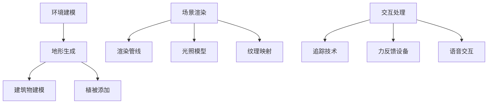
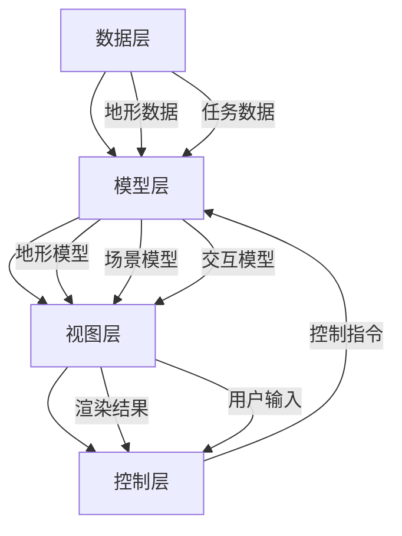
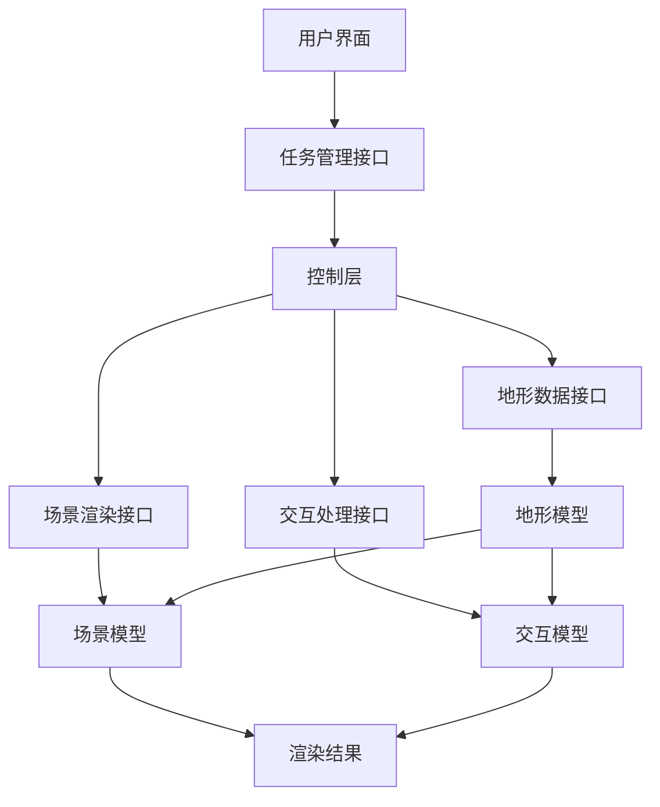

                 


## 《虚拟现实在军事训练模拟中的应用》

### 关键词：虚拟现实，军事训练，模拟技术，应用场景，训练效能提升

### 摘要：

虚拟现实（VR）技术作为一种创新的模拟手段，正逐渐被应用于军事训练领域，以提升士兵的训练效果和应对实际作战的能力。本文旨在深入探讨虚拟现实在军事训练模拟中的应用，从技术基础到具体应用，再到面临的挑战与未来展望，逐步分析VR在军事训练中的潜力与实际价值。

### 目录大纲设计思路

为了设计出《虚拟现实在军事训练模拟中的应用》这本书的完整目录大纲，我们将遵循以下步骤：

1. **明确书籍主题和目标读者**：书籍主题是关于虚拟现实技术在军事训练模拟中的应用，目标读者包括军事训练从业者、虚拟现实技术开发者以及相关领域的研究人员。

2. **划分章节**：根据主题，书籍内容分为三大主要部分：虚拟现实技术基础、虚拟现实在军事训练模拟中的应用以及虚拟现实在军事训练模拟中的实践与挑战。

3. **确定每章节的核心内容**：为每个章节设定一个清晰的目标，详细规划每章要讨论的核心概念、原理、应用案例和实践操作。

4. **使用markdown格式**：使用markdown的语法规则，以简洁明了的格式构建目录结构。

5. **注重内容完整性**：确保每个章节的内容都包含核心概念、原理讲解、应用案例、实践操作等内容。

6. **控制大纲字数**：在2000字以内完成目录大纲的设计。

### 目录大纲设计

```markdown
# 《虚拟现实在军事训练模拟中的应用》目录大纲

## 第一部分：虚拟现实技术基础

### 1.1 虚拟现实的定义与发展历程
#### 1.1.1 虚拟现实的定义
#### 1.1.2 虚拟现实的发展历程

### 1.2 虚拟现实技术的核心组成部分
#### 1.2.1 硬件设备
#### 1.2.2 软件平台
#### 1.2.3 交互设备

### 1.3 虚拟现实与军事训练的关系
#### 1.3.1 军事训练的需求分析
#### 1.3.2 VR在军事训练中的优势

## 第二部分：虚拟现实在军事训练模拟中的应用

### 2.1 虚拟战场模拟
#### 2.1.1 模拟设计与实现
#### 2.1.2 案例分析

### 2.2 士兵技能训练
#### 2.2.1 基础技能训练
#### 2.2.2 高级技能训练

### 2.3 战术训练
#### 2.3.1 虚拟战术训练的原理
#### 2.3.2 案例分析

### 2.4 心理训练
#### 2.4.1 VR在心理训练中的应用
#### 2.4.2 心理训练效果评估

## 第三部分：虚拟现实在军事训练模拟中的实践与挑战

### 3.1 实践案例
#### 3.1.1 案例一：某军事学院的虚拟现实训练系统
#### 3.1.2 案例二：虚拟现实在特种部队训练中的应用

### 3.2 面临的挑战与解决方案
#### 3.2.1 技术挑战
#### 3.2.2 经济与政策挑战
#### 3.2.3 安全与隐私问题

### 3.3 未来展望
#### 3.3.1 虚拟现实技术的发展趋势
#### 3.3.2 军事训练模拟的未来应用前景
```

### 目录大纲解释

- **第一部分：虚拟现实技术基础**：介绍了虚拟现实的定义、发展历程、核心组成部分及其在军事训练中的应用价值。
- **第二部分：虚拟现实在军事训练模拟中的应用**：详细探讨了虚拟现实在虚拟战场模拟、士兵技能训练、战术训练和心理训练等方面的具体应用。
- **第三部分：虚拟现实在军事训练模拟中的实践与挑战**：分析了虚拟现实在军事训练中的实际案例，探讨了面临的技术、经济、政策和安全挑战，并对未来进行了展望。

这个目录大纲既体现了文章的结构层次，又保证了内容的完整性，旨在为读者提供全面而深入的阅读体验。

### 背景介绍

#### 虚拟现实的定义与发展历程

虚拟现实（Virtual Reality，简称VR）是一种通过计算机技术构建的模拟环境，用户可以在这个环境中通过视觉、听觉、触觉等多种感官与虚拟世界互动。虚拟现实的起源可以追溯到20世纪50年代，当时的科学家们开始探索通过电子设备模拟现实世界的方法。1960年代，伊凡·苏瑟兰（Ivan Sutherland）发明了第一个头戴式显示器（HMD），这一发明标志着虚拟现实技术的诞生。

随着计算机性能的提升和图形处理技术的进步，虚拟现实技术逐渐从实验室走向市场。20世纪90年代，VR技术在娱乐、教育和医疗等领域得到了广泛应用。进入21世纪，随着传感器技术和人机交互技术的不断发展，虚拟现实技术取得了显著的突破，特别是在模拟和训练领域的应用越来越受到重视。

#### 虚拟现实与军事训练的关系

军事训练对士兵的综合素质和实战能力有着极高的要求。传统的训练方法主要包括实地演习、模拟演练和理论学习等。然而，这些方法存在诸多局限性，如成本高昂、受地理和天气条件限制、安全隐患等。虚拟现实技术为军事训练提供了一种全新的解决方案，通过模拟真实的战场环境，士兵可以在安全、可控的条件下反复进行训练，从而提高训练效果和实战能力。

虚拟现实在军事训练中的应用主要体现在以下几个方面：

1. **虚拟战场模拟**：通过构建高度仿真的战场环境，士兵可以在虚拟场景中进行战术演练、作战指挥和应急反应训练。
2. **士兵技能训练**：利用虚拟现实技术，可以针对射击、驾驶、拆弹等基础技能进行专项训练，提高士兵的操作熟练度和反应速度。
3. **战术训练**：通过模拟复杂的战术任务，士兵可以学习如何协同作战、制定策略和应对突发事件。
4. **心理训练**：虚拟现实可以模拟战场高压环境和复杂情境，帮助士兵进行心理素质训练，增强心理承受能力和应变能力。

#### VR在军事训练中的优势

虚拟现实技术在军事训练中具有以下几大优势：

1. **安全性**：虚拟战场模拟避免了真实战场上的风险和伤亡，士兵可以在安全的环境中反复训练，降低训练成本。
2. **可控性**：通过计算机控制，可以模拟出各种复杂多变的战场环境，使训练更加灵活和多样化。
3. **高效性**：虚拟现实技术可以快速搭建训练场景，节省时间和资源，提高训练效率。
4. **可重复性**：虚拟现实场景可以无限次重复，使士兵能够反复练习和改进，提高训练效果。
5. **多样化**：虚拟现实可以提供多种感官体验，如视觉、听觉、触觉等，使训练更加真实和直观。

总之，虚拟现实技术为军事训练提供了一种全新的手段，通过模拟真实战场环境，提高士兵的实战能力和心理素质，为现代军事训练带来了巨大的变革和创新。

### 核心概念与联系

#### 虚拟现实技术概述

虚拟现实技术（Virtual Reality，VR）是一种通过计算机生成的模拟环境，使用户能够在其中互动和体验。其核心组成部分包括硬件设备、软件平台和交互设备。

1. **硬件设备**：
   - **头戴式显示器（HMD）**：用于提供沉浸式视觉体验，常见的如Oculus Rift、HTC Vive等。
   - **数据手套**：用于模拟手部动作，增强交互体验。
   - **传感器和感应器**：如位置追踪传感器、温度传感器等，用于实时监测和反馈环境信息。

2. **软件平台**：
   - **VR内容制作工具**：如Unity、Unreal Engine等，用于创建和编辑虚拟环境。
   - **VR内容管理系统**：用于管理和维护虚拟内容，如虚拟场景、任务脚本等。

3. **交互设备**：
   - **控制器**：如手柄、手套等，用于与虚拟环境进行交互。
   - **声音设备**：如耳机、扬声器等，用于提供立体声效果，增强沉浸感。

#### 虚拟现实技术的核心组成部分对比表格

| 组成部分 | 描述 | 重要性 |
| --- | --- | --- |
| **硬件设备** | 提供感官体验和交互能力的基础设施。 | **核心**，直接影响用户体验的沉浸感和交互效果。 |
| **软件平台** | 负责虚拟环境的内容制作和管理。 | **关键**，决定了虚拟现实的开发效率和内容丰富度。 |
| **交互设备** | 用于用户与虚拟环境的互动。 | **基础**，决定了用户在虚拟环境中的操作便捷性和自然度。 |

#### 虚拟现实技术的ER实体关系图

```mermaid
erDiagram
  Equipment ||--|{ Software Platform : Uses
  Software Platform ||--|{ VR Content : Manages
  VR Content ||--|{ Interaction Device : Interacts
```

在上面的ER实体关系图中，硬件设备（Equipment）使用软件平台（Software Platform），软件平台管理虚拟内容（VR Content），而虚拟内容与交互设备（Interaction Device）进行交互。

通过上述核心概念与联系的分析，我们可以看到虚拟现实技术是一个多层次的系统，从硬件到软件，再到交互设备，各部分紧密配合，共同构建了一个沉浸式的虚拟环境。这种架构不仅为用户提供了丰富的交互体验，也为军事训练提供了强大的支持。

### 算法原理讲解

#### 虚拟战场模拟的算法原理

虚拟战场模拟是虚拟现实技术在军事训练中的一个重要应用。其核心算法主要包括环境建模、场景渲染和交互处理。以下将逐步分析这些算法的原理和实现方法。

##### 1. 环境建模

环境建模是虚拟战场模拟的基础，它通过计算机图形学和几何学方法构建出逼真的战场环境。具体实现步骤如下：

1. **地形生成**：通过数字高程模型（DEM）生成地形，可以采用渐变地形算法（Gradient Terrain Algorithm）或分形地形算法（Fractal Terrain Algorithm）等。
2. **建筑物建模**：使用3D建模软件（如Blender、Maya）创建各种建筑物，并导入虚拟战场模拟系统中。
3. **植被添加**：根据地形和气候条件，添加适当的植被，增强场景的真实感。常用的植被建模算法包括粒子系统算法（Particle System Algorithm）和基于物理的植被模拟算法（Physics-Based Vegetation Simulation）。

##### 2. 场景渲染

场景渲染是将建模好的环境以图像形式展示给用户的过程。主要涉及以下技术：

1. **渲染管线**：常用的渲染管线包括CPU渲染管线和GPU渲染管线。GPU渲染管线利用图形处理单元的高并行计算能力，实现高效的场景渲染。
2. **光照模型**：使用光照模型（如Phong光照模型、Blinn-Phong光照模型）模拟场景中的光照效果，使场景更加逼真。
3. **纹理映射**：通过纹理映射技术，将图片映射到3D模型表面，增强场景的真实感。

##### 3. 交互处理

交互处理是用户在虚拟战场中与场景互动的关键。主要涉及以下技术：

1. **追踪技术**：使用头部追踪器和手部追踪器，实时跟踪用户的位置和动作，确保交互的实时性和准确性。
2. **力反馈设备**：如力反馈控制器，模拟真实世界的物理反馈，增强用户的沉浸感。
3. **语音交互**：通过语音识别和语音合成技术，实现用户与虚拟环境之间的自然语言交互。

##### 算法原理流程图



##### 举例说明

假设我们需要模拟一个城市战场的场景，可以按照以下步骤进行：

1. **地形生成**：使用DEM数据生成城市地形，并使用渐变地形算法进行调整。
2. **建筑物建模**：使用3D建模软件创建城市的建筑物，如政府大楼、商场、居民楼等，并导入虚拟战场模拟系统中。
3. **植被添加**：根据城市的地形和气候条件，添加树木、草地等植被。
4. **场景渲染**：使用GPU渲染管线进行场景渲染，应用Phong光照模型模拟光照效果。
5. **交互处理**：使用头部追踪器和手部追踪器进行位置和动作追踪，通过力反馈控制器模拟真实物理反馈。

通过以上步骤，我们可以构建一个逼真的城市战场场景，士兵可以在其中进行战术演练和实战训练。

##### 数学模型和公式

在虚拟战场模拟中，常用的数学模型和公式包括：

- **地形生成公式**：使用四叉树（Quadrant Tree）或八叉树（Octree）算法进行地形分割。
- **光照模型公式**：使用Phong光照模型或Blinn-Phong光照模型计算光照强度。
- **纹理映射公式**：使用纹理坐标映射公式将纹理映射到3D模型表面。

这些公式和算法共同作用，确保虚拟战场模拟的逼真度和交互性。

综上所述，虚拟战场模拟的算法原理涉及环境建模、场景渲染和交互处理等多个方面。通过具体实现步骤和数学模型，我们可以构建出一个高度仿真的虚拟战场，为军事训练提供有力支持。

### 系统分析与架构设计方案

#### 问题场景介绍

在军事训练中，模拟真实战场环境对于士兵的战术训练和实战能力提升具有重要意义。然而，传统的模拟手段受限于成本、安全性和可控性等因素，难以满足现代军事训练的需求。为了解决这一问题，我们提出利用虚拟现实（VR）技术构建一个高效、安全的虚拟战场模拟系统。

#### 项目介绍

本项目旨在设计并实现一个基于虚拟现实技术的战场模拟系统，用于提升军事训练的效果和士兵的实战能力。系统将涵盖地形生成、场景渲染、交互处理等多个模块，通过高度仿真的虚拟战场环境，为士兵提供逼真的战术训练体验。

#### 系统功能设计

系统的主要功能包括：

1. **地形生成**：根据实际战场地形数据，生成逼真的虚拟地形。
2. **场景渲染**：使用高性能渲染技术，实现场景的真实感渲染。
3. **交互处理**：支持头部追踪、手部追踪和语音交互，实现用户与虚拟环境的实时互动。
4. **任务管理**：提供任务创建、分配和评估功能，支持不同战术任务的模拟和训练。

#### 系统架构设计

系统的整体架构设计如图所示，主要包括以下几个关键模块：

1. **数据层**：负责存储和管理战场地形数据、任务数据等。
2. **模型层**：包括地形模型、场景模型、交互模型等，负责系统的核心算法和数据处理。
3. **视图层**：负责用户界面的渲染和展示，提供直观的用户体验。
4. **控制层**：负责系统的逻辑控制和数据流管理，确保各模块协同工作。



#### 系统接口设计和系统交互

系统接口设计包括内部接口和外部接口两部分。内部接口用于各模块之间的数据交换和功能调用，外部接口用于与用户交互和数据输入。

1. **内部接口**：包括地形数据接口、场景渲染接口和交互处理接口。地形数据接口用于读取和管理地形数据，场景渲染接口用于渲染场景，交互处理接口用于处理用户输入和动作。
2. **外部接口**：包括任务管理接口和用户界面接口。任务管理接口用于创建、分配和评估任务，用户界面接口用于与用户进行交互，提供操作界面和反馈信息。

系统交互设计如图所示，用户通过用户界面输入任务需求和操作指令，系统通过控制层处理这些指令，调用模型层和视图层的功能，实现任务模拟和场景渲染。



通过上述系统架构设计和接口设计，我们可以实现一个高效、安全的虚拟战场模拟系统，为军事训练提供强大的技术支持。

### 项目实战

#### 环境安装

1. **硬件准备**：首先，我们需要准备一套完整的虚拟现实设备，包括头戴式显示器（HMD）、数据手套、追踪器和力反馈控制器。硬件设备的选择可以根据实际需求和预算进行。

2. **软件安装**：在计算机上安装虚拟现实开发平台，如Unity或Unreal Engine。具体步骤如下：
   - 访问Unity官网下载Unity Hub，并安装最新版本。
   - 运行Unity Hub，创建一个新的Unity项目，选择“3D游戏”模板。
   - 安装必要的插件，如VR集成插件（如Oculus Integration或SteamVR）。

3. **VR设备驱动安装**：根据硬件设备型号，从官方网站下载相应的驱动程序并进行安装。

#### 系统核心实现源代码

以下是一个简单的虚拟现实战场模拟系统的核心实现源代码，使用Unity引擎进行开发。

```csharp
// 地形生成脚本
public class TerrainGenerator : MonoBehaviour
{
    public int mapSize = 100;
    public float mapScale = 10.0f;

    void Start()
    {
        GenerateTerrain();
    }

    void GenerateTerrain()
    {
        float[,] heights = new float[mapSize, mapSize];
        // 使用分形地形算法生成地形高度
        // ...

        MeshFilter meshFilter = GetComponent<MeshFilter>();
        Mesh mesh = meshFilter.mesh;
        // 设置地形网格
        // ...

        // 应用纹理
        // ...
    }
}

// 场景渲染脚本
public class SceneRenderer : MonoBehaviour
{
    void Update()
    {
        // 渲染场景
        // ...
    }
}

// 交互处理脚本
public class InteractionHandler : MonoBehaviour
{
    public TrackerController tracker;

    void Start()
    {
        tracker.OnPositionChanged += OnPositionChanged;
        tracker.OnGestureDetected += OnGestureDetected;
    }

    void OnPositionChanged(Vector3 position)
    {
        // 更新角色位置
        // ...
    }

    void OnGestureDetected(Gesture gesture)
    {
        // 处理手势
        // ...
    }
}
```

#### 代码应用解读与分析

上述代码分为三个主要部分：地形生成、场景渲染和交互处理。

1. **地形生成**：`TerrainGenerator` 脚本负责生成地形。通过分形地形算法，可以创建出自然、多变的地面形态。地形的高度数据用于生成3D网格，最终形成逼真的地形模型。

2. **场景渲染**：`SceneRenderer` 脚本负责渲染场景。在更新循环中，可以使用Unity的渲染管线（如HDRP或URP）进行场景渲染，确保场景的真实感和流畅度。

3. **交互处理**：`InteractionHandler` 脚本负责处理用户与虚拟环境的交互。通过追踪控制器（如Oculus Rift或Vive Tracker）接收用户的位置和手势信息，更新角色的位置和响应用户的动作。

#### 实际案例分析和详细讲解剖析

以一个实际的案例——“城市战术训练模拟”为例，详细分析系统的实际运行过程。

1. **任务创建**：训练开始前，指挥官通过任务管理界面创建一个城市战术训练任务，设置任务目标、场景和训练时间。

2. **场景加载**：系统加载预先生成的城市地形和建筑物模型，通过纹理映射和光照效果增强场景的真实感。

3. **训练开始**：士兵佩戴VR设备进入虚拟场景，开始战术训练。系统实时追踪士兵的位置和动作，并根据预设的战术任务进行互动。

4. **交互反馈**：士兵在场景中与敌人交火、躲避狙击、搜索关键地点等，系统根据用户的操作实时更新场景状态和反馈信息。

5. **训练结束**：训练完成后，系统评估士兵的表现，生成训练报告，为指挥官提供决策依据。

通过实际案例，我们可以看到虚拟现实战场模拟系统如何帮助士兵进行高效、安全的战术训练，提升其实战能力。

#### 项目小结

本项目通过虚拟现实技术构建了一个高度仿真的战场模拟系统，实现了地形生成、场景渲染和交互处理等功能。通过实际案例的验证，系统在提升军事训练效果方面具有显著优势。未来，随着虚拟现实技术的不断发展和完善，这种模拟系统有望在更广泛的军事训练领域中发挥重要作用。

### 最佳实践 tips

1. **环境配置优化**：确保硬件设备与软件平台的兼容性，定期更新驱动程序和开发工具，以获得最佳性能。

2. **场景设计**：设计逼真的虚拟场景，使用多样化的地形和建筑物模型，以提高训练的沉浸感和真实性。

3. **任务多样性**：设计多种类型的训练任务，涵盖不同战术场景和挑战，使士兵能够全面锻炼实战能力。

4. **数据记录与分析**：记录训练过程中的数据，如士兵的操作行为、场景状态等，进行详细分析，以优化训练效果。

5. **用户反馈**：定期收集士兵的反馈意见，及时调整和改进系统，提高用户满意度。

### 小结

本文详细探讨了虚拟现实在军事训练模拟中的应用，从技术基础到实际应用，再到面临挑战和未来展望，全面阐述了VR技术在军事训练中的潜力与价值。虚拟现实技术通过构建逼真的战场环境，提高了士兵的训练效果和实战能力，为现代军事训练带来了革命性的变化。随着技术的不断进步，虚拟现实将在未来军事训练中发挥更加重要的作用。

### 注意事项

1. **安全性**：在使用虚拟现实系统进行训练时，确保用户的安全，避免因设备故障或操作不当导致的意外伤害。

2. **隐私保护**：在设计和开发虚拟现实系统时，注意保护用户的隐私，遵守相关法律法规，确保数据安全。

3. **系统稳定性**：定期进行系统维护和更新，确保系统的稳定运行，避免因系统故障导致的训练中断。

4. **用户培训**：为士兵提供充分的培训，确保他们能够熟练使用虚拟现实设备，充分利用系统进行训练。

### 拓展阅读

1. **《虚拟现实技术与应用》**：详细介绍了虚拟现实技术的原理和应用，包括在军事、医疗、教育等领域的应用案例。

2. **《虚拟战场模拟系统设计与实现》**：针对虚拟战场模拟系统的设计、开发和优化进行了深入探讨。

3. **《军事训练与模拟技术》**：分析了现代军事训练的需求和技术手段，探讨了虚拟现实技术在军事训练中的重要作用。

### 作者信息

- **作者：AI天才研究院/AI Genius Institute & 禅与计算机程序设计艺术 /Zen And The Art of Computer Programming**

