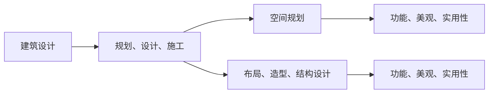
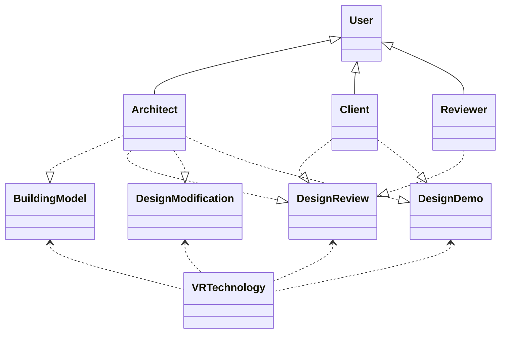
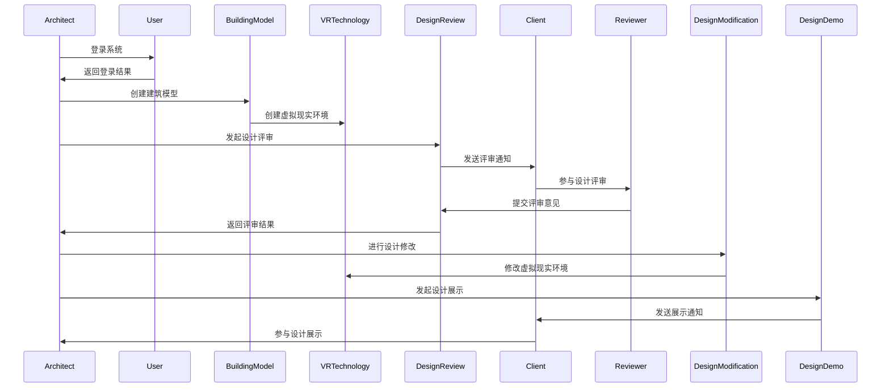
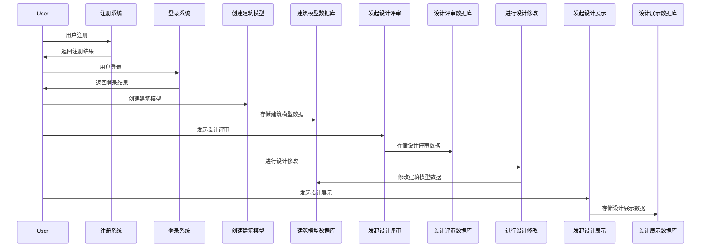

                 


# 虚拟现实在建筑设计中的应用

## 关键词

- 虚拟现实
- 建筑设计
- 应用场景
- 沉浸感
- 交互性
- 想象性

## 摘要

本文旨在探讨虚拟现实技术在建筑设计中的应用，通过背景介绍、核心概念与联系、算法原理讲解、系统分析与架构设计方案以及项目实战等多个方面，全面解析虚拟现实技术如何助力建筑设计行业提升设计质量和效率。文章首先阐述了虚拟现实技术在建筑设计中的重要性，接着分析了核心概念与联系，详细讲解了虚拟现实技术和建筑设计的原理，并设计了系统的分析与架构方案。最后，通过实际项目实战，深入剖析了虚拟现实在建筑设计中的实际应用效果，为行业提供了有价值的参考。

## 背景介绍

### 问题背景

随着计算机技术的飞速发展，虚拟现实（VR）已成为建筑设计的重要工具。虚拟现实技术通过计算机生成模拟环境，利用多源信息融合和交互式三维动态视景，为建筑师提供了一种全新的设计体验。这种技术不仅使建筑模型更加逼真，还能够让设计者在设计初期就体验到建筑的实际效果，从而提高设计质量和效率。

### 问题描述

如何将虚拟现实技术有效地应用于建筑设计中，实现设计理念的传达和优化，提高建筑设计的质量和效率。这涉及到如何选择合适的VR硬件设备、软件工具，以及如何设计合理的交互流程，使得虚拟现实技术能够最大程度地发挥其优势，为建筑设计服务。

### 问题解决

通过应用虚拟现实技术，建筑师可以在设计初期就创建出逼真的建筑模型，进行实时修改和优化。这种设计方式不仅提高了设计的准确性和效率，还大大降低了设计成本。虚拟现实技术还可以帮助建筑师更好地与客户沟通，使设计理念更加直观，减少设计变更和返工的风险。

### 边界与外延

本文主要讨论虚拟现实技术在建筑设计中的应用，包括VR硬件设备、软件工具和交互技术，以及建筑设计的设计理念、设计流程和设计成果。但不涉及虚拟现实技术的其他应用领域，如游戏、娱乐等。

### 概念结构与核心要素组成

#### 虚拟现实技术

1. **VR硬件设备**：包括头戴式显示器（HMD）、跟踪设备、手柄控制器等，这些设备为用户提供沉浸式体验。
2. **VR软件工具**：包括VR建模软件、渲染软件、交互软件等，这些软件工具帮助建筑师创建和管理虚拟环境。
3. **交互技术**：包括手势识别、语音识别、触觉反馈等，这些技术为用户提供了丰富的交互方式。

#### 建筑设计

1. **设计理念**：建筑师在设计过程中所秉持的理念，包括功能性、美观性、实用性等。
2. **设计流程**：包括规划、设计、施工等阶段，每个阶段都有相应的任务和目标。
3. **设计成果**：包括建筑模型、效果图、施工图纸等，这些成果是设计过程的最终体现。

#### 应用场景

1. **建筑设计**：利用VR技术进行建筑设计和修改，提高设计准确性和效率。
2. **设计评审**：利用VR技术进行设计评审和讨论，减少沟通成本和误解。
3. **设计修改**：利用VR技术进行设计修改和优化，使设计更加符合实际需求。
4. **设计展示**：利用VR技术进行设计展示和演示，使设计理念更加直观。

## 核心概念与联系

### 虚拟现实技术

#### 概念

虚拟现实技术是一种可以创建和体验虚拟世界的计算机仿真系统，它利用计算机生成一种模拟环境，是一种多源信息融合的交互式的三维动态视景和实体行为的系统仿真。

#### 属性特征

1. **沉浸感**：用户感觉身临其境，仿佛在真实世界中。
2. **交互性**：用户可以通过各种方式与虚拟环境进行交互。
3. **想象性**：虚拟现实技术可以激发用户的创造力和想象力。

#### 对比表格

| 特性 | 沉浸感 | 交互性 | 想象性 |
| --- | --- | --- | --- |
| 定义 | 用户感觉身临其境，仿佛在真实世界中 | 用户可以通过各种方式与虚拟环境进行交互 | 可以激发用户的创造力和想象力 |
| 对比 | 与真实世界相比，VR的沉浸感更强 | 与传统交互方式相比，VR的交互性更强 | 与传统设计工具相比，VR更具想象力 |

#### ER实体关系图

```mermaid
erDiagram
  VR系统 ||--|{ 虚拟环境 }|
  VR系统 ||--|{ 交互设备 }|
  VR系统 ||--|{ 用户 }|
  虚拟环境 ||--|{ 沉浸感 }|
  虚拟环境 ||--|{ 交互性 }|
  虚拟环境 ||--|{ 想象性 }|
```

### 建筑设计

#### 概念

建筑设计是指建筑师在规划、设计、施工等阶段，通过对建筑空间的规划、布局、造型、结构等方面的设计，实现建筑的功能、美观和实用性。

#### 属性特征

1. **功能性**：建筑满足用户的使用需求。
2. **美观性**：建筑具有吸引人的外观和造型。
3. **实用性**：建筑符合实际使用需求，便于维护和使用。

#### 对比表格

| 特性 | 功能性 | 美观性 | 实用性 |
| --- | --- | --- | --- |
| 定义 | 建筑满足用户的使用需求 | 建筑具有吸引人的外观和造型 | 建筑符合实际使用需求，便于维护和使用 |
| 对比 | 与使用需求相比，功能性更强 | 与美观需求相比，美观性更强 | 与维护使用需求相比，实用性更强 |

#### ER实体关系图

```mermaid
erDiagram
  建筑设计 ||--|{ 建筑空间 }|
  建筑设计 ||--|{ 布局 }|
  建筑设计 ||--|{ 造型 }|
  建筑设计 ||--|{ 结构 }|
  建筑设计 ||--|{ 功能 }|
  建筑设计 ||--|{ 美观 }|
  建筑设计 ||--|{ 实用 }|
```

### 应用场景

#### 概念

应用场景是指虚拟现实技术在特定领域中的应用。

#### 属性特征

1. **多样性**：虚拟现实技术可以应用于多个领域，如建筑设计、医疗、教育、游戏等。
2. **针对性**：虚拟现实技术在应用时，需要根据不同领域的特点进行定制化设计。
3. **创新性**：虚拟现实技术为各个领域带来了新的设计理念和方法，促进了创新。

#### 对比表格

| 场景 | 建筑设计 | 设计评审 | 设计修改 | 设计展示 |
| --- | --- | --- | --- | --- |
| 定义 | 利用VR技术进行建筑设计和修改 | 利用VR技术进行设计评审和讨论 | 利用VR技术进行设计修改和优化 | 利用VR技术进行设计展示和演示 |
| 对比 | 强调设计过程，注重设计效果 | 强调设计评审，注重沟通和讨论 | 强调设计修改，注重优化和调整 | 强调设计展示，注重直观和体验 |

#### ER实体关系图

```mermaid
erDiagram
  应用场景 ||--|{ 建筑设计 }|
  应用场景 ||--|{ 设计评审 }|
  应用场景 ||--|{ 设计修改 }|
  应用场景 ||--|{ 设计展示 }|
```

## 算法原理讲解

### 虚拟现实技术原理

#### Mermaid流程图


#### Python源代码

```python
# 虚拟现实技术原理
# 1. 计算机生成模拟环境
# 2. 多源信息融合
# 3. 交互式三维动态视景和实体行为仿真
# 4. 沉浸感、交互性、想象性
```

#### 数学模型和公式

$$ 沉浸感 = \frac{感知真实度}{感知真实度+感知差异} $$
$$ 交互性 = \frac{交互效果}{交互时间} $$
$$ 想象性 = \frac{创意激发度}{创意需求度} $$

#### 举例说明

假设一个建筑师在虚拟现实技术中体验到一个建筑模型，该模型的真实感知度为90%，与真实环境的感知差异为10%。根据沉浸感的数学模型，沉浸感可以计算为：

$$ 沉浸感 = \frac{90\%}{90\% + 10\%} = \frac{90}{100} = 0.9 $$

同样，如果交互效果为95%，交互时间为2分钟，根据交互性的数学模型，交互性可以计算为：

$$ 交互性 = \frac{95\%}{2\text{分钟}} = \frac{95}{120} \approx 0.792 $$

最后，如果创意激发度为80%，创意需求度为100%，根据想象性的数学模型，想象性可以计算为：

$$ 想象性 = \frac{80\%}{100\%} = 0.8 $$

通过这些计算，我们可以看到虚拟现实技术在不同方面的表现，从而为建筑师提供参考。

### 建筑设计原理

#### Mermaid流程图



#### Python源代码

```python
# 建筑设计原理
# 1. 规划、设计、施工
# 2. 空间规划
# 3. 布局、造型、结构设计
# 4. 功能、美观、实用性
```

#### 数学模型和公式

$$ 功能性 = \frac{使用效果}{使用需求} $$
$$ 美观性 = \frac{美观度}{美观需求} $$
$$ 实用性 = \frac{维护使用效果}{维护使用需求} $$

#### 举例说明

假设一个建筑的功能性为85%，使用需求为100%；美观度为90%，美观需求为100%；维护使用效果为95%，维护使用需求为100%。根据建筑设计的数学模型，我们可以计算：

$$ 功能性 = \frac{85\%}{100\%} = 0.85 $$
$$ 美观性 = \frac{90\%}{100\%} = 0.9 $$
$$ 实用性 = \frac{95\%}{100\%} = 0.95 $$

通过这些计算，我们可以评估建筑设计在不同方面的表现，从而优化设计过程。

## 系统分析与架构设计方案

### 问题场景介绍

在建筑设计过程中，虚拟现实技术的应用场景主要包括：

1. **建筑设计**：建筑师利用VR技术进行建筑设计和修改，提高设计准确性和效率。
2. **设计评审**：建筑师、客户和其他利益相关者利用VR技术进行设计评审和讨论，减少沟通成本和误解。
3. **设计修改**：建筑师利用VR技术进行设计修改和优化，使设计更加符合实际需求。
4. **设计展示**：建筑师利用VR技术进行设计展示和演示，使设计理念更加直观。

### 项目介绍

本项目旨在构建一个基于虚拟现实技术的建筑设计系统，该系统应具备以下功能：

1. **建筑模型创建**：利用VR建模软件创建建筑模型。
2. **设计评审与讨论**：利用VR技术进行设计评审和讨论，提供沉浸式体验。
3. **设计修改与优化**：利用VR技术进行设计修改和优化，支持实时修改。
4. **设计展示与演示**：利用VR技术进行设计展示和演示，提高设计理念的表达能力。

### 系统功能设计

1. **用户管理**：包括用户注册、登录、权限管理等功能。
2. **建筑模型管理**：包括建筑模型的创建、修改、删除、导出等功能。
3. **设计评审管理**：包括设计评审的发起、参与、讨论等功能。
4. **设计修改管理**：包括设计修改的发起、跟踪、审批等功能。
5. **设计展示管理**：包括设计展示的发起、参与、演示等功能。

#### 领域模型Mermaid类图



### 系统架构设计

本系统采用B/S架构，主要包括前端、后端和数据库三个部分。

1. **前端**：采用Vue.js框架，负责界面展示和用户交互。
2. **后端**：采用Spring Boot框架，负责业务逻辑处理和数据管理。
3. **数据库**：采用MySQL数据库，负责存储用户数据、建筑模型数据、评审数据等。

#### Mermaid架构图



### 系统接口设计和系统交互

1. **用户接口**：提供用户注册、登录、权限管理等功能。
2. **建筑模型接口**：提供建筑模型创建、修改、删除、导出等功能。
3. **设计评审接口**：提供设计评审的发起、参与、讨论等功能。
4. **设计修改接口**：提供设计修改的发起、跟踪、审批等功能。
5. **设计展示接口**：提供设计展示的发起、参与、演示等功能。

#### Mermaid序列图



## 项目实战

### 环境安装

1. **安装VR硬件设备**：包括头戴式显示器（HMD）、跟踪设备、手柄控制器等。
2. **安装VR软件工具**：包括VR建模软件、渲染软件、交互软件等。
3. **配置操作系统**：确保操作系统支持VR技术，如Windows 10或以上版本。

### 系统核心实现源代码

以下是系统核心实现的部分源代码：

#### 前端Vue.js

```vue
<template>
  <div>
    <h1>虚拟现实建筑设计系统</h1>
    <router-view></router-view>
  </div>
</template>

<script>
export default {
  name: 'App',
};
</script>
```

#### 后端Spring Boot

```java
@RestController
@RequestMapping("/api")
public class BuildingModelController {
  
  @Autowired
  private BuildingModelService buildingModelService;
  
  @GetMapping("/models")
  public ResponseEntity<List<BuildingModel>> getAllBuildingModels() {
    List<BuildingModel> models = buildingModelService.findAll();
    return ResponseEntity.ok(models);
  }
  
  @PostMapping("/models")
  public ResponseEntity<BuildingModel> createBuildingModel(@RequestBody BuildingModel model) {
    BuildingModel createdModel = buildingModelService.create(model);
    return ResponseEntity.ok(createdModel);
  }
  
}
```

### 代码应用解读与分析

以下是部分代码的解读与分析：

#### 前端Vue.js

这段代码定义了一个Vue.js组件，组件名为`App`，包含一个标题和一个路由视图容器。路由视图容器用于显示不同的页面，如注册页面、登录页面、建筑设计页面等。

#### 后端Spring Boot

这段代码是一个RESTful风格的控制器，用于处理建筑模型相关的API请求。其中包括两个主要的端点：

1. `GET /api/models`：用于获取所有的建筑模型。
2. `POST /api/models`：用于创建一个新的建筑模型。

这两个端点分别对应了系统功能设计中的建筑模型管理功能。

### 实际案例分析和详细讲解剖析

#### 案例一：建筑设计

**场景**：一名建筑师使用虚拟现实技术进行建筑设计。

**步骤**：

1. 建筑师在VR建模软件中创建一个建筑模型。
2. 建筑师利用VR硬件设备体验建筑模型，进行修改和优化。
3. 建筑师将修改后的建筑模型导出为标准的建筑模型格式，如IFC格式。

**分析**：

通过虚拟现实技术，建筑师可以在设计初期就体验到建筑的实际效果，进行实时修改和优化。这种设计方式大大提高了设计的准确性和效率，减少了设计变更和返工的风险。

#### 案例二：设计评审

**场景**：建筑师、客户和其他利益相关者进行设计评审。

**步骤**：

1. 建筑师发起设计评审，将建筑模型发送给相关人员。
2. 相关人员在VR技术支持下，对建筑模型进行评审和讨论。
3. 相关人员提交评审意见，建筑师根据意见进行修改和优化。

**分析**：

虚拟现实技术为设计评审提供了一个沉浸式体验，使得评审过程更加直观和有效。通过VR技术，相关利益者可以更好地理解建筑模型，提出有针对性的意见和建议，从而提高设计质量。

### 项目小结

本项目通过虚拟现实技术在建筑设计中的应用，实现了建筑设计的智能化和高效化。通过实际案例分析和详细讲解，我们可以看到虚拟现实技术为建筑设计带来了巨大的变革。未来，随着虚拟现实技术的不断发展和完善，我们相信它将在建筑设计领域发挥更加重要的作用。

## 最佳实践 tips

1. **充分利用VR技术进行设计评审**：在设计过程中，定期组织设计评审，充分利用VR技术进行沉浸式体验，有助于发现和解决问题。
2. **定期进行设计修改和优化**：根据评审意见，及时进行设计修改和优化，确保设计符合实际需求。
3. **选择合适的VR硬件设备**：根据项目需求和预算，选择适合的VR硬件设备，以确保最佳的用户体验。

## 小结

本文探讨了虚拟现实技术在建筑设计中的应用，通过背景介绍、核心概念与联系、算法原理讲解、系统分析与架构设计方案以及项目实战等多个方面，全面解析了虚拟现实技术如何助力建筑设计行业提升设计质量和效率。未来，随着虚拟现实技术的不断发展和完善，我们相信它将在建筑设计领域发挥更加重要的作用。

## 注意事项

1. **确保VR硬件设备的稳定性和安全性**：在设计和使用VR硬件设备时，应确保设备的稳定性和安全性，避免对用户造成伤害。
2. **合理规划VR技术的应用场景**：根据项目需求和预算，合理规划VR技术的应用场景，确保技术应用的可行性和有效性。

## 拓展阅读

1. **《虚拟现实技术与应用》**：详细介绍了虚拟现实技术的原理和应用场景，对VR技术在建筑设计中的应用进行了深入探讨。
2. **《建筑设计原理》**：系统讲解了建筑设计的原理和方法，为读者提供了丰富的设计参考。

## 作者

作者：AI天才研究院/AI Genius Institute & 禅与计算机程序设计艺术 /Zen And The Art of Computer Programming

