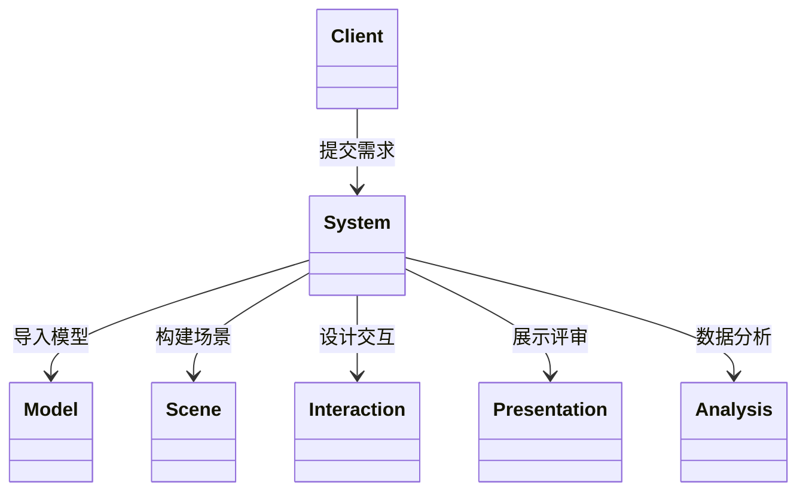
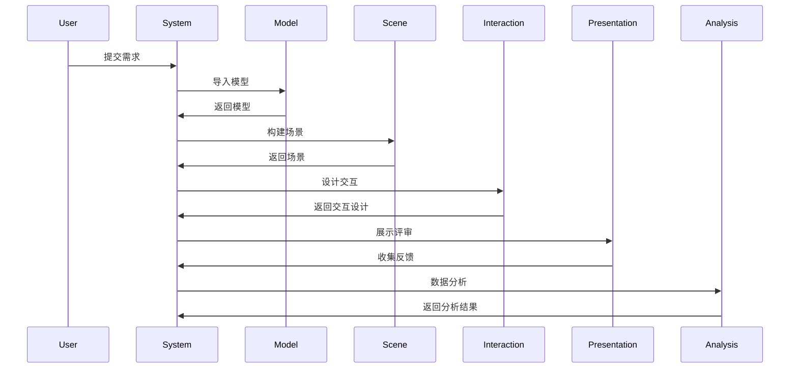

                 

# 虚拟现实在建筑设计可视化中的应用

关键词：虚拟现实、建筑设计、可视化、用户体验、交互设计

摘要：随着科技的发展，虚拟现实（VR）技术在各个领域得到广泛应用，尤其是在建筑设计可视化方面，它为设计师和客户提供了前所未有的交互体验。本文将深入探讨虚拟现实技术在建筑设计中的应用，包括其背景、核心概念、应用流程、算法原理、系统设计与架构方案、项目实战以及最佳实践与拓展阅读。

## 前言与简介

### 1.1 问题背景

虚拟现实技术起源于20世纪60年代的美国，最初应用于军事模拟和飞行训练。随着计算机技术和图形处理能力的提高，虚拟现实技术逐渐进入大众视野。在建筑设计领域，虚拟现实技术的应用始于20世纪90年代，通过三维建模软件和头戴式显示器，建筑师可以创建出逼真的虚拟建筑场景。

当前，虚拟现实技术在建筑设计中的应用已经相当成熟。它不仅可以帮助设计师更直观地展示设计方案，还能让客户在建筑完成之前就感受到未来的居住或办公环境。虚拟现实技术的优势在于其沉浸式体验，可以大大提升建筑设计的可视化效果和用户体验。

### 1.2 问题描述

建筑可视化中存在的挑战主要包括以下几个方面：

1. **复杂性的挑战**：建筑设计涉及多个方面，包括结构、外观、内部布局等，传统二维图纸难以全面展现这些复杂性。
2. **沟通的挑战**：设计师与客户、施工方之间的沟通存在信息不对称的问题，容易导致设计方案与实际需求不符。
3. **成本与效率的挑战**：传统建筑可视化手段如模型制作和渲染，成本高、时间长，难以满足快速迭代的需求。

虚拟现实技术可以有效地解决上述问题，提升建筑设计的可视化效果和用户体验。

### 1.3 问题解决

通过虚拟现实技术，设计师可以在虚拟环境中创建出建筑的三维模型，并从多个角度进行观察和交互。这不仅有助于设计师更直观地表达设计思想，还能让客户在建筑完成之前就感受到未来环境。虚拟现实技术的沉浸式体验能够极大地提升用户的参与感和满意度。

### 1.4 边界与外延

虚拟现实技术在建筑设计中的应用范围包括：

1. **方案设计阶段**：帮助设计师探索不同设计方案的可行性。
2. **沟通与展示阶段**：增强设计师与客户、施工方之间的沟通。
3. **施工阶段**：辅助施工人员理解设计意图，提高施工效率。
4. **运营与管理阶段**：为物业管理提供虚拟现实环境，提升管理效果。

### 1.5 概念结构与核心要素组成

虚拟现实技术的基本组成部分包括感知技术、交互技术和可视化技术。

1. **感知技术**：包括摄像头、传感器等设备，用于捕捉真实世界的场景。
2. **交互技术**：包括手柄、手势识别等设备，用于用户与虚拟环境的交互。
3. **可视化技术**：包括三维建模、渲染等算法，用于将虚拟环境呈现在用户面前。

## 核心概念与联系

### 2.1 虚拟现实技术原理

#### 2.1.1 概念原理

虚拟现实技术是一种通过计算机生成三维虚拟环境，使用户能够沉浸其中的技术。它通过头戴式显示器（HMD）或投影设备将虚拟环境呈现在用户眼前，通过传感器或手柄等设备实现用户的交互。

#### 2.1.2 属性特征对比表格

| 技术类型 | 特点 |
| --- | --- |
| 头戴式显示器 | 提供沉浸式体验，但重量较大 |
| 投影设备 | 视角更广，但分辨率相对较低 |
| 传感器 | 提供精确的交互控制，但可能受环境干扰 |

#### 2.1.3 ER实体关系图架构

```mermaid
erDiagram
    User ||--|{ VRSystem }|
    VRSystem ||--|{ Scene }|
    Scene ||--|{ Object }|
    Object ||--|{ Material }|
```

在上面的ER实体关系图中，用户（User）与虚拟现实系统（VRSystem）之间存在关联，虚拟现实系统与场景（Scene）相关联，场景又与物体（Object）相关联，物体与材质（Material）相关联。

## 虚拟现实技术在建筑设计中的应用

### 3.1 设计过程与流程

#### 3.1.1 设计阶段

在建筑设计过程中，虚拟现实技术可以应用于以下阶段：

1. **概念设计阶段**：通过虚拟现实技术，设计师可以快速构建出概念模型，进行方案比较。
2. **细节设计阶段**：在方案确定后，虚拟现实技术可以帮助设计师进行细节调整，如空间布局、材料选择等。
3. **评审阶段**：虚拟现实技术可以将设计方案以逼真的形式展示给客户，便于评审和反馈。

#### 3.1.2 设计流程

1. **需求分析**：明确设计目标和需求。
2. **模型构建**：使用三维建模软件构建建筑模型。
3. **虚拟环境设置**：设置虚拟现实环境，包括场景、光照、材质等。
4. **交互设计**：设计用户交互方式，如导航、操作等。
5. **展示与评审**：将设计方案以虚拟现实形式展示给客户，收集反馈并进行调整。

### 3.2 可视化效果提升

#### 3.2.1 空间感受

通过虚拟现实技术，用户可以在虚拟环境中自由行走、观察，从而更直观地感受到建筑空间。这种沉浸式体验可以大大提升空间的可视化效果。

#### 3.2.2 材质表现

虚拟现实技术可以通过高度逼真的材质渲染，展示建筑材料的真实效果。用户可以通过触摸、点击等交互方式，感受不同材质的质感和色彩。

### 3.3 用户交互体验

#### 3.3.1 交互方式

虚拟现实技术提供了多种交互方式，如手势识别、手柄操作等。这些交互方式使得用户能够更自然地与虚拟环境进行交互。

#### 3.3.2 用户反馈

通过收集和分析用户在虚拟现实环境中的反馈，设计师可以不断优化设计方案，提高用户体验。

## 算法原理讲解

### 4.1 虚拟现实渲染算法

#### 4.1.1 基本原理

虚拟现实渲染算法是将三维模型在虚拟环境中进行渲染的过程。其基本原理包括以下几个步骤：

1. **建模**：使用三维建模软件构建建筑模型。
2. **光照计算**：计算场景中的光照效果，包括光源位置、光照强度等。
3. **纹理映射**：将材质纹理映射到模型表面。
4. **渲染**：将光照和纹理应用到模型上，生成最终的图像。

#### 4.1.2 算法流程图


#### 4.1.3 数学模型与公式

虚拟现实渲染过程中，涉及到的数学模型和公式包括：

1. **透视投影矩阵**：用于将三维模型投影到二维屏幕上。公式如下：

   $$ P = \begin{bmatrix}
   A & B & C \\
   D & E & F \\
   0 & 0 & 1
   \end{bmatrix} $$

2. **反走样算法**：用于减少渲染图像的锯齿效应。公式如下：

   $$ I(x,y) = \sum_{i} w_i I_i $$

   其中，$w_i$为权重，$I_i$为每个像素的颜色值。

#### 4.1.4 举例说明

假设我们有一个简单的立方体模型，要将其渲染到一个二维屏幕上。我们可以使用以下Python代码实现透视投影矩阵的计算：

```python
import numpy as np

# 定义透视投影矩阵
P = np.array([[1, 0, 0, 0],
              [0, 1, 0, 0],
              [0, 0, 1, 0],
              [0, 0, 0, 1]])

# 定义立方体顶点坐标
vertices = np.array([[0, 0, 0],
                     [1, 0, 0],
                     [1, 1, 0],
                     [0, 1, 0],
                     [0, 0, 1],
                     [1, 0, 1],
                     [1, 1, 1],
                     [0, 1, 1]])

# 将顶点坐标投影到二维屏幕上
projection = P @ vertices

# 输出投影后的顶点坐标
print(projection)
```

运行上述代码，我们可以得到立方体在二维屏幕上的投影坐标。

## 系统分析与架构设计方案

### 5.1 问题场景介绍

在建筑设计中，虚拟现实技术的应用场景主要包括：

1. **方案评审**：设计师将设计方案通过虚拟现实技术展示给客户，进行评审和反馈。
2. **施工指导**：施工人员通过虚拟现实技术了解设计意图，确保施工符合预期。
3. **运营管理**：物业管理人员通过虚拟现实技术进行建筑管理和维护。

### 5.2 系统功能设计

虚拟现实建筑设计系统的功能设计包括：

1. **模型导入与编辑**：导入三维建模软件生成的建筑模型，并进行编辑和调整。
2. **场景构建**：设置虚拟现实场景，包括光照、材质等。
3. **交互设计**：设计用户交互方式，如导航、操作等。
4. **展示与评审**：将设计方案以虚拟现实形式展示给客户，收集反馈。
5. **数据统计与分析**：收集用户反馈数据，进行统计分析。

#### 5.2.1 领域模型



### 5.3 系统架构设计

虚拟现实建筑设计系统的架构设计包括：

1. **前端架构**：负责与用户交互，展示虚拟现实场景。
2. **后端架构**：负责处理模型导入、编辑、场景构建等任务。
3. **数据存储**：存储建筑模型、用户反馈等数据。

#### 5.3.1 系统架构

```mermaid
sequenceDiagram
    User -->|提交需求| System
    System -->|处理需求| Model
    Model -->|返回模型| System
    System -->|构建场景| Scene
    Scene -->|返回场景| System
    System -->|设计交互| Interaction
    System -->|展示评审| Presentation
    System -->|数据分析| Analysis
```

#### 5.3.2 接口设计

1. **模型导入接口**：用于导入建筑模型。
2. **场景构建接口**：用于构建虚拟现实场景。
3. **交互设计接口**：用于设计用户交互方式。
4. **展示与评审接口**：用于展示设计方案和收集用户反馈。
5. **数据分析接口**：用于收集和分析用户反馈数据。

#### 5.3.3 系统交互



## 项目实战

### 6.1 环境安装与配置

#### 6.1.1 软件与硬件环境

1. **软件环境**：
   - 三维建模软件（如SketchUp、Revit等）
   - 虚拟现实开发工具（如Unity、Unreal Engine等）
   - 编程语言（如Python、C++等）

2. **硬件环境**：
   - 头戴式显示器（如Oculus Rift、HTC Vive等）
   - 运动跟踪设备（如摄像头、传感器等）

#### 6.1.2 安装与配置步骤

1. **安装三维建模软件**：下载并安装对应的三维建模软件。
2. **导出建筑模型**：在三维建模软件中导出建筑模型。
3. **安装虚拟现实开发工具**：下载并安装虚拟现实开发工具。
4. **导入建筑模型**：在虚拟现实开发工具中导入导出的建筑模型。
5. **配置虚拟现实环境**：设置虚拟现实场景，包括光照、材质等。
6. **测试虚拟现实效果**：通过头戴式显示器和运动跟踪设备测试虚拟现实效果。

### 6.2 系统核心实现

#### 6.2.1 源代码解析

以下是一个简单的虚拟现实建筑展示系统的源代码示例：

```python
import pygame
from pygame.locals import *
from OpenGL.GL import *
from OpenGL.GLU import *

# 初始化OpenGL环境
def init_gl(width, height):
    pygame.init()
    display = pygame.display.set_mode((width, height), DOUBLEBUF | OPENGL)
    pygame.display.set_caption("Virtual Reality Building Showcase")
    gluPerspective(45, width / height, 0.1, 100.0)
    glTranslatef(0.0, 0.0, -6)

# 加载建筑模型
def load_model(model_path):
    # 使用三维建模软件加载建筑模型
    pass

# 渲染建筑模型
def render():
    glClear(GL_COLOR_BUFFER_BIT | GL_DEPTH_BUFFER_BIT)
    # 渲染建筑模型
    pygame.display.flip()

# 主循环
def main():
    width, height = 800, 600
    init_gl(width, height)
    model_path = "path/to/building.model"
    load_model(model_path)
    while True:
        for event in pygame.event.get():
            if event.type == QUIT:
                pygame.quit()
                return
        render()
        pygame.time.wait(10)

if __name__ == "__main__":
    main()
```

#### 6.2.2 应用解读

以上代码实现了一个简单的虚拟现实建筑展示系统。它首先初始化OpenGL环境，然后加载建筑模型，并通过主循环进行渲染。用户可以通过头戴式显示器和运动跟踪设备感受到建筑的沉浸式体验。

### 6.3 实际案例分析

#### 6.3.1 案例选择

我们选择一个实际案例：使用虚拟现实技术展示一个新建的商业综合体项目。该项目包括办公楼、商场和酒店，设计复杂，涉及多个方面。

#### 6.3.2 案例分析

1. **设计方案展示**：通过虚拟现实技术，设计师将设计方案以逼真的形式展示给客户，客户可以在虚拟环境中自由行走、观察，从而更好地理解设计意图。
2. **施工指导**：施工人员在虚拟环境中了解设计意图，确保施工符合预期。例如，通过虚拟现实技术，施工人员可以提前预知建筑的承重结构和材料要求，从而更好地进行施工。
3. **运营管理**：物业管理人员通过虚拟现实技术进行建筑管理和维护。例如，在发生故障时，物业管理人员可以通过虚拟现实技术快速定位故障位置，并进行相应的维修。

### 6.4 项目小结

#### 6.4.1 经验总结

通过该项目，我们总结了以下经验：

1. **虚拟现实技术可以大大提升建筑设计的可视化效果和用户体验**。
2. **虚拟现实技术在施工指导和管理中具有重要作用**。
3. **虚拟现实技术的应用需要相应的硬件和软件支持，成本较高**。

#### 6.4.2 改进建议

为进一步提高虚拟现实技术在建筑设计中的应用效果，我们提出以下改进建议：

1. **优化虚拟现实渲染算法**：提高渲染速度和图像质量。
2. **增强虚拟现实交互功能**：提供更丰富的交互方式，如手势识别、语音交互等。
3. **降低虚拟现实技术成本**：通过技术改进和规模化生产，降低虚拟现实硬件和软件的成本。

## 最佳实践与拓展阅读

### 7.1 最佳实践

#### 7.1.1 实践经验

1. **充分利用虚拟现实技术的沉浸式体验**：在建筑设计展示和评审中，充分利用虚拟现实技术的沉浸式体验，提高用户参与感和满意度。
2. **结合实际需求选择虚拟现实技术**：根据项目的实际需求，选择合适的虚拟现实技术，如三维建模软件、虚拟现实开发工具等。

#### 7.1.2 注意事项

1. **确保虚拟现实系统的稳定性**：在虚拟现实系统运行过程中，确保系统的稳定性和可靠性，避免出现卡顿、崩溃等问题。
2. **注意用户隐私保护**：在使用虚拟现实技术时，注意保护用户的隐私，避免泄露用户的个人信息。

### 7.2 拓展阅读

#### 7.2.1 相关书籍

1. 《虚拟现实技术原理与应用》
2. 《三维建模与虚拟现实》
3. 《计算机图形学原理及实践》

#### 7.2.2 学术论文

1. "Virtual Reality in Architecture: A Review"
2. "Application of Virtual Reality in Architectural Design"
3. "Enhancing Architectural Visualization with Virtual Reality"

