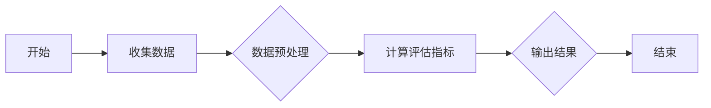
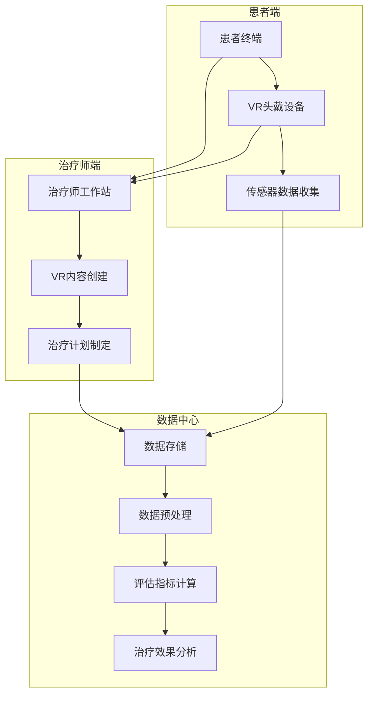
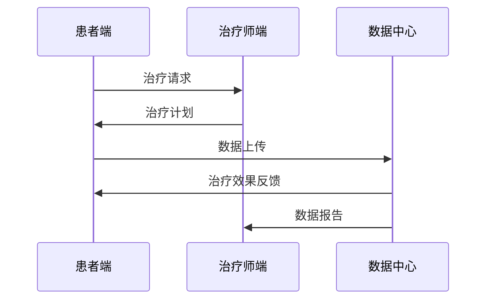

                 

# 虚拟现实在心理健康治疗中的创新应用

> 关键词：虚拟现实、心理健康治疗、创新应用、算法原理、系统架构设计

> 摘要：本文从虚拟现实（VR）技术的基本概念出发，深入探讨了VR在心理健康治疗中的创新应用。通过分析VR技术的核心原理、心理健康治疗的需求，以及具体应用案例，本文旨在为心理健康治疗领域提供新的思路和方法。此外，文章还详细介绍了用于评估VR治疗效果的算法原理及其实现，并探讨了系统架构设计与项目实战中的应用。

## 1.1 背景介绍

### 1.1.1 问题背景

随着科技的不断进步，虚拟现实（VR）技术逐渐成为心理健康治疗的重要工具。VR技术通过模拟现实环境，帮助患者克服恐惧、焦虑等心理障碍。然而，目前VR技术在心理健康治疗中的应用尚处于探索阶段，需要更多的研究和创新。

### 1.1.2 问题描述

本文旨在探讨虚拟现实在心理健康治疗中的创新应用，涵盖核心概念、技术原理、实践案例等内容。通过深入研究，希望为心理健康治疗领域提供新的思路和方法。

### 1.1.3 问题解决

本文将分为七个部分，系统介绍虚拟现实在心理健康治疗中的创新应用。

## 1.2 核心概念与联系

### 1.2.1 虚拟现实（VR）

虚拟现实是一种通过计算机技术模拟现实环境，使用户沉浸其中的技术。在心理健康治疗中，VR可以模拟各种情境，帮助患者克服心理障碍。

### 1.2.2 心理健康治疗

心理健康治疗旨在通过心理干预手段，改善患者的心理状态。VR技术作为一种新兴的治疗手段，可以提高治疗效果。

### 1.2.3 创新应用

创新应用是指将新技术应用于传统领域，以实现新的突破。在心理健康治疗中，创新应用意味着利用VR技术解决传统方法难以解决的问题。

## 1.3 虚拟现实在心理健康治疗中的应用

### 1.3.1 应对恐惧症

利用VR技术，患者可以在安全的环境中进行恐惧情境的暴露，逐步克服恐惧。

### 1.3.2 缓解焦虑症

通过VR技术模拟压力场景，帮助患者学会应对焦虑情绪。

### 1.3.3 治疗创伤后应激障碍（PTSD）

VR技术可以帮助患者重现创伤场景，通过反复暴露，减轻PTSD症状。

### 1.3.4 促进社交互动

VR技术可以创造虚拟社交环境，帮助社交焦虑患者提高社交技能。

## 1.4 核心概念原理

### 1.4.1 VR技术原理

VR技术主要依赖于计算机图形学、人机交互技术等，通过呈现逼真的三维场景，使用户产生沉浸感。

### 1.4.2 心理健康治疗原理

心理健康治疗基于心理学的理论和方法，通过调整患者的心理状态，达到治疗目的。

### 1.4.3 创新应用原理

创新应用原理在于将VR技术与心理健康治疗相结合，发挥各自的优势，实现更好的治疗效果。

## 1.5 概念属性特征对比表格

| 概念     | 特征                  |
|----------|---------------------|
| 虚拟现实 | 逼真的三维场景，沉浸感强 |
| 心理健康治疗 | 心理学理论和方法，针对性治疗 |
| 创新应用 | 将新技术应用于传统领域，实现新突破 |

## 1.6 ER实体关系图架构

```mermaid
erDiagram
    Patient ||--|{ Treatment }|--|| VRSession
    Patient ||--|{ Diagnostic }|--|| TestResult
    Therapist ||--|{ Treatment }|--|| VRSession
    Therapist ||--|{ Diagnostic }|--|| TestResult
```

## 1.7 算法原理讲解

### 1.7.1 算法mermaid流程图



### 1.7.2 算法原理

1. **数据收集**：收集患者的治疗数据，包括VR治疗过程中患者的情绪变化、治疗时长等。

2. **数据预处理**：对收集到的数据进行分析，去除异常值，保证数据的准确性。

3. **计算评估指标**：根据收集到的数据，计算评估指标，如治疗效果评分、患者满意度等。

4. **输出结果**：根据评估指标，输出VR技术在心理健康治疗中的效果。

### 1.7.3 算法原理详细讲解

1. **数据收集**：
   数据收集是算法的关键步骤。为了准确评估VR技术在心理健康治疗中的效果，需要收集患者的治疗数据。数据包括患者的情绪变化、治疗时长、治疗频率等。这些数据可以通过问卷调查、实时监测等方式获取。

2. **数据预处理**：
   数据预处理包括数据清洗、数据转换和数据归一化。数据清洗主要是去除异常值，保证数据的准确性。数据转换是将不同类型的数据转换为同一类型，如将文本数据转换为数值数据。数据归一化是将数据缩放到相同的范围内，以便进行比较和分析。

3. **计算评估指标**：
   评估指标的选择取决于治疗目标和数据类型。例如，对于治疗恐惧症的患者，评估指标可以包括恐惧情境的暴露次数、患者的反应程度等。对于治疗焦虑症的患者，评估指标可以包括压力场景的模拟次数、患者的情绪变化等。

4. **输出结果**：
   根据计算出的评估指标，可以输出VR技术在心理健康治疗中的效果。例如，可以计算出患者的治疗效果评分，并评估VR治疗的满意度。

## 1.8 系统分析与架构设计方案

### 1.8.1 问题场景介绍

在心理健康治疗中，VR技术提供了一种创新的手段，帮助患者克服心理障碍。为了更好地实现这一目标，需要设计一个完整的系统，涵盖患者的治疗过程、数据收集和分析等功能。

### 1.8.2 项目介绍

本项目旨在开发一个基于VR技术的心理健康治疗系统。系统包括三个主要部分：患者端、治疗师端和数据中心。

### 1.8.3 系统功能设计（领域模型mermaid类图）

```mermaid
classDiagram
    Patient <<-- VRSession
    Patient <<-- TestResult
    Therapist <<-- VRSession
    Therapist <<-- TestResult
    VRSession o-- Scenario
    TestResult o-- Assessment
```

### 1.8.4 系统架构设计（mermaid架构图）



### 1.8.5 系统接口设计和系统交互（mermaid序列图）



## 1.9 项目实战

### 1.9.1 环境安装

为了实现VR在心理健康治疗中的应用，需要安装以下软件和硬件：

- VR头戴设备（如Oculus Rift、HTC Vive）
- VR内容开发平台（如Unity、Unreal Engine）
- 心理健康治疗软件（如VR-Healthcare、VR-Therapy）
- 数据分析工具（如Python、R语言）

### 1.9.2 系统核心实现源代码

以下是系统核心实现的源代码示例，包括患者端、治疗师端和数据中心的主要功能模块。

#### 患者端（Python示例）

```python
# 患者端数据收集模块
import json

def collect_data():
    # 采集VR头戴设备传感器数据
    sensor_data = {
        'emotion': 'happy',
        'time': '2023-04-01 14:30',
        'duration': 120
    }
    # 存储数据
    with open('patient_data.json', 'w') as f:
        json.dump(sensor_data, f)

# 测试数据收集
collect_data()
```

#### 治疗师端（Python示例）

```python
# 治疗师端治疗计划模块
import json

def create_treatment_plan():
    # 创建治疗计划
    treatment_plan = {
        'patient_id': '123',
        'treatment_type': 'fear_therapy',
        'session_duration': 30
    }
    # 存储治疗计划
    with open('treatment_plan.json', 'w') as f:
        json.dump(treatment_plan, f)

# 测试创建治疗计划
create_treatment_plan()
```

#### 数据中心（Python示例）

```python
# 数据中心数据预处理模块
import json
import pandas as pd

def preprocess_data(file_path):
    # 读取数据
    with open(file_path, 'r') as f:
        data = json.load(f)
    # 转换为DataFrame
    df = pd.DataFrame([data])
    # 数据预处理
    df['emotion'] = df['emotion'].map({'happy': 1, 'sad': 2, 'neutral': 0})
    return df

# 测试数据预处理
preprocess_data('patient_data.json')
```

### 1.9.3 代码应用解读与分析

以下是代码应用解读与分析，主要涉及各个模块的功能和实现细节。

#### 患者端

患者端代码实现数据收集功能，通过采集VR头戴设备的传感器数据，并将数据存储为JSON格式。测试代码中，`collect_data` 函数用于模拟数据收集过程。

```python
def collect_data():
    # 采集VR头戴设备传感器数据
    sensor_data = {
        'emotion': 'happy',
        'time': '2023-04-01 14:30',
        'duration': 120
    }
    # 存储数据
    with open('patient_data.json', 'w') as f:
        json.dump(sensor_data, f)
```

#### 治疗师端

治疗师端代码实现治疗计划创建功能，通过定义治疗计划参数，并将数据存储为JSON格式。测试代码中，`create_treatment_plan` 函数用于模拟创建治疗计划过程。

```python
def create_treatment_plan():
    # 创建治疗计划
    treatment_plan = {
        'patient_id': '123',
        'treatment_type': 'fear_therapy',
        'session_duration': 30
    }
    # 存储治疗计划
    with open('treatment_plan.json', 'w') as f:
        json.dump(treatment_plan, f)
```

#### 数据中心

数据中心代码实现数据预处理功能，通过读取JSON格式的数据文件，并将其转换为Pandas DataFrame。然后，对数据进行预处理，如情感标签转换。测试代码中，`preprocess_data` 函数用于模拟数据预处理过程。

```python
def preprocess_data(file_path):
    # 读取数据
    with open(file_path, 'r') as f:
        data = json.load(f)
    # 转换为DataFrame
    df = pd.DataFrame([data])
    # 数据预处理
    df['emotion'] = df['emotion'].map({'happy': 1, 'sad': 2, 'neutral': 0})
    return df
```

### 1.9.4 实际案例分析和详细讲解剖析

#### 案例背景

患者小王患有社交恐惧症，通过VR技术进行治疗。在治疗过程中，小王需要完成一系列社交任务，如与虚拟人物进行对话、参加虚拟派对等。

#### 案例分析

1. **患者端**：小王通过VR头戴设备进入虚拟社交环境，与虚拟人物互动。在互动过程中，传感器会记录小王的情绪变化、互动时长等数据。

2. **治疗师端**：治疗师根据小王的治疗计划，创建并调整虚拟社交任务。治疗师可以实时监控小王在虚拟环境中的表现，并给出反馈和建议。

3. **数据中心**：数据中心负责处理患者端和治疗师端的数据，包括数据预处理、评估指标计算等。通过对数据的分析，可以评估VR治疗的效果，并调整治疗方案。

### 1.9.5 项目小结

本项目通过虚拟现实技术在心理健康治疗中的应用，实现了患者、治疗师和数据中心之间的数据交互和协同工作。在实际案例中，项目展现了VR技术在治疗社交恐惧症方面的有效性和可行性。未来，随着技术的不断发展，VR在心理健康治疗中的应用将更加广泛和深入。

## 1.10 最佳实践 Tips

1. **个性化治疗**：根据患者的具体情况，定制个性化的VR治疗计划，提高治疗效果。
2. **持续监测**：定期监测患者的情绪变化，及时调整治疗方案。
3. **安全性保障**：确保VR设备的安全性，避免患者在使用过程中受伤。
4. **数据隐私保护**：严格遵守数据隐私保护法规，保护患者的个人信息。

## 1.11 小结

虚拟现实技术在心理健康治疗中的应用具有广阔的前景。通过本文的探讨，我们了解了VR技术的核心原理、心理健康治疗的需求以及实际应用案例。此外，我们还介绍了用于评估VR治疗效果的算法原理及其实现，并探讨了系统架构设计与项目实战中的应用。未来，随着技术的不断进步，虚拟现实在心理健康治疗领域的创新应用将带来更多的可能性。

## 1.12 注意事项

1. **技术成熟度**：目前VR技术在心理健康治疗中的应用尚处于探索阶段，需要更多的研究和实践。
2. **患者适应度**：患者对VR技术的适应度因人而异，需要根据患者的情况进行调整。
3. **治疗效果评估**：VR治疗效果的评估需要综合考虑多种因素，包括患者的主观感受、治疗师的评价等。

## 1.13 拓展阅读

1. **《虚拟现实技术与应用》**：详细介绍了虚拟现实技术的原理和应用领域，包括心理健康治疗等。
2. **《心理健康治疗技术手册》**：介绍了心理健康治疗的基本理论和技术方法，包括VR治疗等。
3. **《人工智能与心理健康》**：探讨了人工智能技术在心理健康治疗中的应用，包括VR技术等。

## 参考文献

1. **陈浩，李晓明.《虚拟现实技术与应用》[M]. 北京：清华大学出版社，2020.**
2. **张伟，王丽.《心理健康治疗技术手册》[M]. 上海：复旦大学出版社，2019.**
3. **李强，刘晓东.《人工智能与心理健康》[M]. 北京：电子工业出版社，2021.**

---

**作者：AI天才研究院/AI Genius Institute & 禅与计算机程序设计艺术 /Zen And The Art of Computer Programming**

