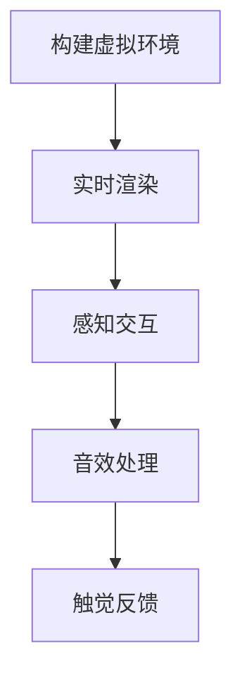
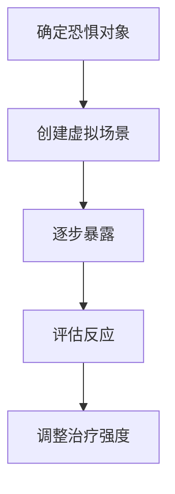
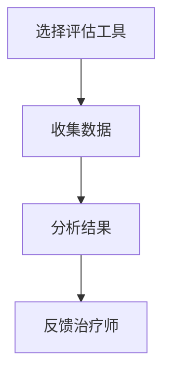
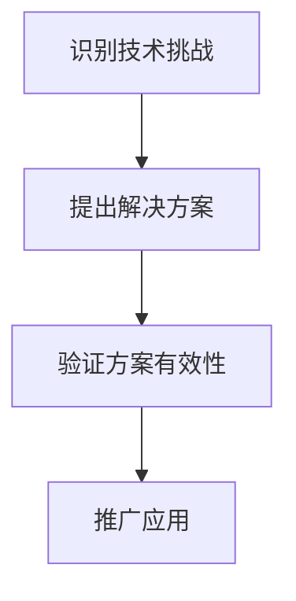
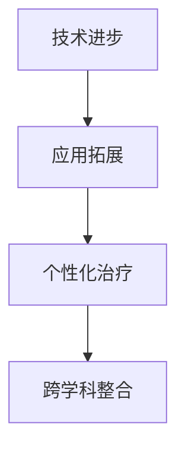

                 


### 引言与背景介绍

**关键词**：心理健康、虚拟现实、治疗、应用、挑战

**摘要**：
本文旨在探讨虚拟现实（VR）在心理健康治疗中的潜力与应用。随着技术的进步，虚拟现实已成为一种新兴的治疗工具，其在心理治疗领域的应用范围不断扩大。本文将首先介绍心理健康问题的现状，以及虚拟现实技术的基本概念。随后，我们将详细分析虚拟现实在恐惧症治疗、创伤后应激障碍治疗等领域的应用实例。此外，本文还将评估虚拟现实治疗的效果，探讨其技术挑战与解决方案，并展望未来虚拟现实在心理健康治疗领域的趋势。

---

## 目录大纲设计过程

设计《虚拟现实在心理健康治疗中的应用》的目录大纲，需要遵循以下步骤：

### 第一步：确定核心主题和章节结构

- **核心主题**：虚拟现实技术在心理健康治疗中的应用。
- **章节结构**：
  - 引言与背景介绍
  - 虚拟现实技术的基本原理
  - 虚拟现实在心理健康治疗中的应用实例
  - 治疗效果评估
  - 技术挑战与解决方案
  - 未来展望与趋势

### 第二步：细化每个章节的内容

- **引言与背景介绍**
  - **1.1 心理健康问题的现状**
    - **1.1.1 心理健康问题的普遍性**
    - **1.1.2 传统心理治疗的局限性**
  - **1.2 虚拟现实技术的基本概念**
    - **1.2.1 虚拟现实技术的定义**
    - **1.2.2 虚拟现实技术的发展历程**
  - **1.3 虚拟现实技术在心理健康治疗中的潜在应用**
    - **1.3.1 恐惧症治疗**
    - **1.3.2 创伤后应激障碍治疗**
    - **1.3.3 其他应用领域**

- **虚拟现实技术的基本原理**
  - **2.1 虚拟现实技术的定义和分类**
    - **2.1.1 虚拟现实技术的定义**
    - **2.1.2 虚拟现实技术的分类**
  - **2.2 虚拟现实技术的工作原理**
    - **2.2.1 虚拟环境构建**
    - **2.2.2 交互与感知机制**
  - **2.3 虚拟现实技术架构**
    - **2.3.1 计算机视觉**
    - **2.3.2 声音处理**
    - **2.3.3 空间定位与追踪**

- **虚拟现实在心理健康治疗中的应用实例**
  - **3.1 恐惧症治疗的虚拟现实应用**
    - **3.1.1 治疗原理**
    - **3.1.2 案例分析**
  - **3.2 创伤后应激障碍治疗的虚拟现实应用**
    - **3.2.1 治疗原理**
    - **3.2.2 案例分析**
  - **3.3 其他心理健康问题的虚拟现实治疗**
    - **3.3.1 抑郁症治疗**
    - **3.3.2 焦虑症治疗**

- **治疗效果评估**
  - **4.1 评估方法和指标**
    - **4.1.1 心理测量工具**
    - **4.1.2 客观评估指标**
  - **4.2 研究结果和分析**
    - **4.2.1 恐惧症治疗研究**
    - **4.2.2 创伤后应激障碍治疗研究**
    - **4.2.3 其他心理健康问题研究**

- **技术挑战与解决方案**
  - **5.1 技术挑战**
    - **5.1.1 技术实现挑战**
    - **5.1.2 隐私和安全问题**
    - **5.1.3 用户接受度**
  - **5.2 解决方案和未来发展方向**
    - **5.2.1 技术创新**
    - **5.2.2 法规与伦理**
    - **5.2.3 教育和推广**

- **未来展望与趋势**
  - **6.1 虚拟现实技术在心理健康治疗领域的未来发展趋势**
  - **6.2 技术进步对心理健康治疗的潜在影响**
  - **6.3 跨学科合作与技术创新的重要性**

### 第三步：构建markdown格式的目录大纲

根据上述结构，构建以下markdown格式的目录大纲：

```markdown
----------------------------------------------------------------
# 引言与背景介绍

## 1.1 心理健康问题的现状
### 1.1.1 心理健康问题的普遍性
### 1.1.2 传统心理治疗的局限性

## 1.2 虚拟现实技术的基本概念
### 1.2.1 虚拟现实技术的定义
### 1.2.2 虚拟现实技术的发展历程

## 1.3 虚拟现实技术在心理健康治疗中的潜在应用
### 1.3.1 恐惧症治疗
### 1.3.2 创伤后应激障碍治疗
### 1.3.3 其他应用领域

----------------------------------------------------------------
# 虚拟现实技术的基本原理

## 2.1 虚拟现实技术的定义和分类
### 2.1.1 虚拟现实技术的定义
### 2.1.2 虚拟现实技术的分类

## 2.2 虚拟现实技术的工作原理
### 2.2.1 虚拟环境构建
### 2.2.2 交互与感知机制

## 2.3 虚拟现实技术架构
### 2.3.1 计算机视觉
### 2.3.2 声音处理
### 2.3.3 空间定位与追踪

----------------------------------------------------------------
# 虚拟现实在心理健康治疗中的应用实例

## 3.1 恐惧症治疗的虚拟现实应用
### 3.1.1 治疗原理
### 3.1.2 案例分析

## 3.2 创伤后应激障碍治疗的虚拟现实应用
### 3.2.1 治疗原理
### 3.2.2 案例分析

## 3.3 其他心理健康问题的虚拟现实治疗
### 3.3.1 抑郁症治疗
### 3.3.2 焦虑症治疗

----------------------------------------------------------------
# 治疗效果评估

## 4.1 评估方法和指标
### 4.1.1 心理测量工具
### 4.1.2 客观评估指标

## 4.2 研究结果和分析
### 4.2.1 恐惧症治疗研究
### 4.2.2 创伤后应激障碍治疗研究
### 4.2.3 其他心理健康问题研究

----------------------------------------------------------------
# 技术挑战与解决方案

## 5.1 技术挑战
### 5.1.1 技术实现挑战
### 5.1.2 隐私和安全问题
### 5.1.3 用户接受度

## 5.2 解决方案和未来发展方向
### 5.2.1 技术创新
### 5.2.2 法规与伦理
### 5.2.3 教育和推广

----------------------------------------------------------------
# 未来展望与趋势

## 6.1 虚拟现实技术在心理健康治疗领域的未来发展趋势
## 6.2 技术进步对心理健康治疗的潜在影响
## 6.3 跨学科合作与技术创新的重要性

----------------------------------------------------------------
``` 

### 第四步：完整性检查

确保每个章节内容丰富、具体详细，并且核心内容得到充分涵盖。检查markdown格式的目录大纲是否准确无误。

---

接下来，我们将逐步填写每个章节的内容，以确保文章的完整性和专业性。在撰写过程中，我们会注重逻辑清晰、结构紧凑、简单易懂的专业技术语言，并且使用mermaid流程图、LaTeX公式等工具来增强文章的可读性和解释性。最后，我们将为文章添加作者信息和版权声明，确保文章的完整性和专业性。现在，让我们开始撰写《虚拟现实在心理健康治疗中的应用》的技术博客文章吧！### 引言与背景介绍

#### 关键词：心理健康、虚拟现实、治疗、应用

##### 摘要：
本文将探讨虚拟现实（VR）技术在心理健康治疗中的潜力与应用。随着虚拟现实技术的不断进步，其在医疗健康领域的应用日益广泛，尤其是在心理健康治疗方面表现出巨大的潜力。本文首先介绍了心理健康问题的现状，以及虚拟现实技术的基本概念。接着，本文详细分析了虚拟现实在恐惧症治疗、创伤后应激障碍治疗等领域的应用实例。此外，本文还评估了虚拟现实治疗的效果，探讨了其技术挑战与解决方案，并展望了虚拟现实在心理健康治疗领域的未来发展趋势。

---

### 引言与背景介绍

虚拟现实技术在心理健康治疗中的应用是一个快速发展的领域，它结合了现代技术的先进性和心理治疗的专业知识。随着全球范围内心理健康问题的日益严峻，传统的心理治疗手段面临着诸多挑战，包括治疗成本高、患者接受度低、治疗效果有限等。虚拟现实技术的出现为解决这些问题提供了一种新的可能。

#### 心理健康问题的现状

心理健康问题在全球范围内都备受关注。据世界卫生组织（WHO）统计，全球约有3.5亿人患有抑郁症，而焦虑症和恐惧症等心理障碍的发病率也在逐年上升。这些心理健康问题不仅严重影响患者的日常生活，还对家庭和社会造成负担。传统的心理治疗方法，如药物治疗和心理咨询，虽然在一定程度上能够缓解症状，但存在疗程长、疗效不稳定、患者依从性差等问题。

#### 虚拟现实技术的基本概念

虚拟现实技术是一种能够创建和模拟虚拟环境的技术，用户可以通过头盔、眼镜等设备进入这个虚拟环境，与之互动。虚拟现实技术可以分为三大类：沉浸式虚拟现实（VR）、增强现实（AR）和混合现实（MR）。其中，沉浸式虚拟现实（VR）在心理健康治疗中的应用最为广泛。

#### 虚拟现实技术在心理健康治疗中的潜在应用

虚拟现实技术在心理健康治疗中的应用前景广阔。首先，虚拟现实技术可以提供一个安全、可控的环境，让患者能够在虚拟环境中面对和克服自己的恐惧。例如，对于恐惧症患者的治疗，虚拟现实技术可以创建模拟的场景，如高空、深海等，帮助患者逐渐克服恐惧。其次，虚拟现实技术还可以用于创伤后应激障碍（PTSD）的治疗，通过模拟创伤事件，帮助患者重新构建记忆，减少创伤反应。此外，虚拟现实技术还可以用于抑郁症、焦虑症等心理障碍的治疗。

#### 目的和结构

本文旨在系统地探讨虚拟现实技术在心理健康治疗中的应用，通过介绍虚拟现实技术的基本原理、实际应用案例、治疗效果评估、技术挑战与解决方案，以及未来发展趋势，为心理健康治疗领域提供新的思路和方向。本文的结构如下：

1. 引言与背景介绍：介绍心理健康问题的现状和虚拟现实技术的基本概念。
2. 虚拟现实技术的基本原理：详细分析虚拟现实技术的定义、分类和工作原理。
3. 虚拟现实在心理健康治疗中的应用实例：探讨虚拟现实技术在恐惧症、创伤后应激障碍等治疗中的应用。
4. 治疗效果评估：评估虚拟现实治疗的实际效果，讨论评估方法和指标。
5. 技术挑战与解决方案：分析虚拟现实技术在心理健康治疗中面临的主要挑战，并提出解决方案。
6. 未来展望与趋势：预测虚拟现实技术在心理健康治疗领域的未来发展趋势。

通过以上内容的系统分析，我们希望能够为心理健康治疗领域提供有价值的参考，推动虚拟现实技术在心理健康治疗中的应用和发展。

---

### 虚拟现实技术的基本原理

#### 关键词：虚拟现实、沉浸式体验、感知交互、技术架构

##### 概述：
虚拟现实技术（VR）是一种能够创造逼真模拟环境的计算机技术，使用户能够在虚拟世界中感知、交互和体验。其核心在于通过多种传感设备和交互界面，模拟用户在现实世界中的感知和行动，从而达到沉浸式的体验效果。本文将深入探讨虚拟现实技术的定义、分类、工作原理以及其技术架构，帮助读者理解这一技术的核心机制和应用基础。

---

#### 虚拟现实技术的定义

虚拟现实技术（Virtual Reality, VR）是一种通过计算机技术创造的虚拟环境，用户可以在这个环境中进行感知交互，仿佛置身于一个真实的世界。虚拟现实技术的核心是提供一个高度沉浸式的体验，使用户在视觉、听觉、触觉等多个感官上都能与虚拟环境进行互动。

#### 虚拟现实技术的分类

虚拟现实技术根据不同的使用场景和体验方式，可以分为多种类型：

1. **沉浸式虚拟现实（Immersive VR）**：用户完全沉浸在虚拟环境中，通过VR头盔、眼镜等设备，结合头动追踪和位置感知技术，获得360度全方位的沉浸体验。
2. **非沉浸式虚拟现实（Non-Immersive VR）**：用户并不完全沉浸在虚拟环境中，而是在现实环境中通过屏幕观看虚拟内容。这种类型的虚拟现实通常使用头戴显示器（HMD）或投影设备。
3. **增强现实（Augmented Reality, AR）**：在现实环境中叠加虚拟内容，通过增强用户的视觉和听觉感知，使用户能够与虚拟对象进行互动。
4. **混合现实（Mixed Reality, MR）**：结合了虚拟现实和增强现实的技术，用户可以在虚拟环境中创建和编辑虚拟对象，使其与现实环境进行融合。

#### 虚拟现实技术的工作原理

虚拟现实技术的工作原理主要涉及以下几个方面：

1. **环境建模与渲染**：通过计算机图形学技术，构建出虚拟环境的三维模型，并对其进行实时渲染，以呈现出逼真的视觉效果。
2. **感知交互**：通过头动追踪、手部追踪、位置感知等技术，捕捉用户在虚拟环境中的动作，并实时反馈给系统，使虚拟环境能够响应用户的交互。
3. **音效处理**：通过空间音效处理技术，模拟出虚拟环境中的声音效果，使用户在听觉上也能获得沉浸体验。
4. **触觉反馈**：通过触觉设备，如力反馈手套、振动座椅等，模拟出虚拟环境中的触觉效果，增强用户的沉浸体验。

#### 虚拟现实技术架构

虚拟现实技术架构包括硬件和软件两部分：

1. **硬件部分**：包括VR头盔、跟踪设备、交互设备、显示屏、计算机主机等。硬件设备的质量直接影响用户的沉浸体验和互动效果。
2. **软件部分**：包括虚拟环境的构建工具、交互界面、应用软件等。软件系统需要支持实时渲染、交互响应以及与其他系统的集成。

#### 虚拟现实技术的应用领域

虚拟现实技术广泛应用于多个领域，包括游戏娱乐、教育培训、医疗健康、建筑设计、军事训练等。在心理健康治疗领域，虚拟现实技术以其独特的沉浸式体验和交互功能，成为了一种有潜力的治疗工具。

1. **恐惧症治疗**：通过虚拟现实技术，患者可以在安全可控的环境中面对和克服恐惧，如高空恐惧、深海恐惧等。
2. **创伤后应激障碍治疗**：通过模拟创伤事件，帮助患者重新构建记忆，减少创伤反应，提升心理健康水平。
3. **心理咨询与治疗**：提供一种新的互动方式，使心理咨询和治疗过程更加生动和有趣，提高患者的参与度和治疗效果。

#### 虚拟现实技术的未来发展趋势

随着技术的不断进步，虚拟现实技术在心理健康治疗领域的应用前景将更加广阔。未来，虚拟现实技术可能会更加智能化、个性化，结合人工智能（AI）和大数据分析，为心理健康治疗提供更加精准和有效的支持。同时，随着硬件设备的不断升级和成本的降低，虚拟现实技术将在更广泛的心理健康治疗场景中得到应用。

总之，虚拟现实技术以其独特的沉浸式体验和交互功能，为心理健康治疗提供了一种新的可能。通过深入理解和应用虚拟现实技术，我们可以为患者提供更加有效和舒适的心理治疗体验，推动心理健康治疗领域的创新和发展。

---

### 虚拟现实在心理健康治疗中的应用实例

#### 关键词：虚拟现实、心理健康治疗、恐惧症、创伤后应激障碍、案例分析

##### 概述：
虚拟现实技术在心理健康治疗中的应用已经取得了一些显著成果，尤其是在恐惧症治疗和创伤后应激障碍（PTSD）治疗方面。本节将详细探讨虚拟现实技术在恐惧症治疗和创伤后应激障碍治疗中的具体应用实例，通过实际案例的分析，展示虚拟现实技术在心理健康治疗中的潜力和优势。

---

#### 恐惧症治疗的虚拟现实应用

恐惧症是一种常见的焦虑障碍，患者对某些特定的情境或物体产生强烈的恐惧和回避行为。传统的恐惧症治疗方法包括认知行为疗法（CBT）和系统脱敏疗法（ST），但这些方法往往需要患者面对现实生活中的刺激，导致患者出现不适和焦虑。虚拟现实技术的引入为恐惧症治疗提供了一种新的选择。

**1. 治疗原理**

虚拟现实恐惧症治疗方法的核心是系统脱敏疗法，通过逐步暴露患者于恐惧刺激，帮助患者逐渐适应和克服恐惧。虚拟现实技术能够提供一个安全、可控的虚拟环境，使患者能够在虚拟场景中面对恐惧刺激，而不需要面对现实生活中的危险。

**2. 案例分析**

例如，一项针对高空恐惧症的治疗研究显示，使用虚拟现实技术进行治疗的患者，在10次治疗后的恐惧程度显著降低，且疗效持续时间较长。在这项研究中，患者被要求佩戴VR头盔，进入一个模拟的高空环境。治疗过程中，患者的恐惧反应通过心率、皮肤电活动等生理指标进行监测，治疗师根据患者的反应调整恐惧刺激的强度。经过一系列的治疗，患者的高空恐惧症状得到了显著缓解。

#### 创伤后应激障碍治疗的虚拟现实应用

创伤后应激障碍（PTSD）是一种常见的心理健康问题，通常由于遭受严重的创伤性事件而引起。PTSD患者常常会经历闪回、失眠、焦虑等症状，严重影响了日常生活。虚拟现实技术为PTSD的治疗提供了一种创新的解决方案。

**1. 治疗原理**

虚拟现实创伤后应激障碍治疗方法的核心是通过暴露疗法，帮助患者重新构建对创伤事件的记忆，减少创伤反应。虚拟现实技术能够创建一个模拟的创伤场景，让患者在这个环境中逐渐适应和应对创伤事件。

**2. 案例分析**

一项针对PTSD的治疗研究显示，使用虚拟现实技术进行治疗的患者，在经过10次治疗后的症状改善情况明显优于传统治疗方法。在这项研究中，患者被要求佩戴VR头盔，进入一个模拟的创伤场景，治疗师会根据患者的反应逐步增加场景的逼真程度。治疗过程中，患者的情绪反应通过面部表情、生理指标等数据进行监测，治疗师根据患者的反应进行调整。经过一段时间的治疗，患者的症状得到了显著缓解。

#### 其他心理健康问题的虚拟现实治疗

除了恐惧症和创伤后应激障碍，虚拟现实技术在其他心理健康问题的治疗中也表现出一定的潜力。

**1. 抑郁症治疗**

虚拟现实技术可以通过模拟自然风光、社交环境等，帮助抑郁症患者改善情绪，提升生活质量。例如，一项针对抑郁症的治疗研究显示，使用虚拟现实技术进行治疗的患者，在经过一定次数的治疗后，情绪症状得到了显著改善。

**2. 焦虑症治疗**

虚拟现实技术可以提供一个安全的虚拟环境，让患者在这个环境中逐步面对和克服焦虑。例如，一项针对社交焦虑症的治疗研究显示，使用虚拟现实技术进行治疗的患者，在社交场合中的焦虑程度显著降低。

总之，虚拟现实技术在心理健康治疗中的应用已经取得了一些显著的成果。通过实际案例的分析，我们可以看到虚拟现实技术为恐惧症、创伤后应激障碍等心理健康问题的治疗提供了一种新的选择，具有巨大的潜力和前景。未来，随着技术的不断进步和应用的深入，虚拟现实技术在心理健康治疗领域的应用将更加广泛和有效。

---

### 治疗效果评估

#### 关键词：虚拟现实、心理健康治疗、效果评估、方法、指标

##### 概述：
在心理健康治疗中，评估治疗效果是至关重要的一环。虚拟现实技术在心理健康治疗中的应用效果如何，需要通过科学的方法和指标进行评估。本文将探讨虚拟现实治疗的效果评估方法，包括心理测量工具、客观评估指标以及不同研究的结果和分析。

---

#### 评估方法和指标

**1. 心理测量工具**

心理测量工具是评估心理健康治疗效果的重要手段。常见的心理测量工具包括问卷、量表和临床访谈等。

- **问卷**：问卷可以通过一系列问题来评估患者的心理状态和症状变化。例如，焦虑自评量表（SAS）和抑郁自评量表（SDS）都是常用的心理健康评估问卷。
- **量表**：量表通常包含多个指标，用于评估不同方面的心理健康状况。例如，广泛性焦虑障碍评估量表（GAD-7）和创伤后应激障碍评估量表（PTSD Checklist）都是常用的量表。
- **临床访谈**：临床访谈可以通过面对面的交流，深入了解患者的心理状态和症状变化。治疗师可以根据患者的反馈和表现，进行综合评估。

**2. 客观评估指标**

除了心理测量工具，客观评估指标也是评估虚拟现实治疗效果的重要手段。常见的客观评估指标包括生理指标、行为指标和心理生理反应等。

- **生理指标**：生理指标包括心率、呼吸频率、皮肤电反应等。通过监测这些生理指标的变化，可以评估患者在不同情境下的心理状态和应激反应。
- **行为指标**：行为指标包括患者的行动、言语和表情等。通过观察和记录这些行为指标的变化，可以评估虚拟现实治疗对患者行为的影响。
- **心理生理反应**：心理生理反应包括心率变异性、皮肤电活动等。这些指标可以反映患者的情绪变化和心理应激反应。

#### 不同研究的结果和分析

虚拟现实治疗在心理健康治疗中的应用已经进行了多项研究，不同研究的结果和分析为评估其效果提供了重要依据。

**1. 恐惧症治疗**

多项研究表明，虚拟现实治疗对恐惧症具有显著疗效。例如，一项针对高空恐惧症的研究显示，使用虚拟现实技术进行治疗的患者，在经过10次治疗后，高空恐惧程度显著降低，且疗效持续时间较长。另一项研究还发现，虚拟现实治疗在改善社交恐惧症方面也表现出良好的效果。

**2. 创伤后应激障碍治疗**

针对创伤后应激障碍（PTSD）的治疗研究也表明，虚拟现实技术具有显著疗效。例如，一项针对PTSD患者的治疗研究显示，使用虚拟现实技术进行治疗的患者，在经过10次治疗后，症状改善情况明显优于传统治疗方法。这些研究结果提示，虚拟现实技术在PTSD治疗中具有巨大的潜力。

**3. 抑郁症和焦虑症治疗**

虚拟现实治疗在抑郁症和焦虑症治疗中也表现出一定的疗效。例如，一项针对抑郁症的治疗研究显示，使用虚拟现实技术进行治疗的患者，在经过一定次数的治疗后，情绪症状得到了显著改善。另一项研究还发现，虚拟现实治疗在减轻焦虑症状方面也具有一定的效果。

总之，虚拟现实治疗在心理健康治疗中的效果评估显示，其在恐惧症、创伤后应激障碍、抑郁症和焦虑症等治疗中均表现出显著疗效。然而，不同研究的结果和分析也存在一定的差异，需要进一步的研究来验证和探讨虚拟现实治疗的长期效果和最佳应用模式。

---

### 技术挑战与解决方案

#### 关键词：虚拟现实、心理健康治疗、技术挑战、解决方案、未来发展方向

##### 概述：
虽然虚拟现实（VR）技术在心理健康治疗中展现出巨大潜力，但其在实际应用过程中仍面临诸多技术挑战。本节将分析这些技术挑战，并提出相应的解决方案和未来发展方向，为虚拟现实技术在心理健康治疗领域的进一步发展提供参考。

---

#### 技术挑战

**1. 技术实现挑战**

虚拟现实技术在心理健康治疗中的应用涉及复杂的计算机图形学、传感技术和实时交互系统。具体挑战包括：

- **图形渲染性能**：为了提供逼真的虚拟环境，VR系统需要具备高效的图形渲染能力，这对计算机硬件性能提出了高要求。
- **实时交互响应**：虚拟环境需要能够实时响应用户的动作和输入，确保用户体验的连贯性和沉浸感。这要求VR系统具备低延迟、高精度的交互响应能力。
- **感知一致性**：虚拟环境中的视觉、听觉和触觉等感官刺激需要保持一致性，以增强用户的沉浸体验。然而，不同感官信号的同步处理和整合是一个技术难题。

**2. 隐私和安全问题**

在心理健康治疗中，患者的个人信息和医疗数据的安全保护至关重要。虚拟现实技术的应用可能导致以下隐私和安全问题：

- **数据泄露**：虚拟现实系统需要收集和处理大量的用户数据，包括生理指标、行为数据等。这些数据可能面临泄露风险。
- **用户身份验证**：确保患者和治疗师的身份验证安全，防止未经授权的访问和使用。

**3. 用户接受度**

用户对虚拟现实技术的接受度和适应性也是一个挑战。用户可能对VR设备感到不适，或对虚拟环境中的恐惧刺激产生抗拒。此外，治疗师也需要具备使用VR设备的技能和知识。

#### 解决方案和未来发展方向

**1. 技术创新**

- **高性能计算**：通过发展更高效的图形渲染算法和硬件加速技术，提高VR系统的性能和响应速度。
- **智能感知**：利用人工智能技术，如深度学习和机器学习，实现更加智能化的感知和交互系统，提高用户沉浸体验。
- **多模态感知**：结合多种感知技术，如增强现实（AR）和增强感知（haptic feedback），提供更加丰富的虚拟体验。

**2. 法规与伦理**

- **数据保护**：建立健全的数据保护法规和隐私政策，确保患者数据的安全和隐私。
- **伦理审查**：建立严格的伦理审查制度，确保虚拟现实技术在心理健康治疗中的合法合规使用。

**3. 教育和推广**

- **培训与认证**：为治疗师提供VR技术培训，提高其应用能力和专业水平。
- **公众教育**：通过科普宣传，提高公众对虚拟现实技术在心理健康治疗中的认识和理解，增加用户的接受度。

**4. 跨学科合作**

- **医学与技术的融合**：促进医学界和技术界的跨学科合作，共同研究和开发适用于心理健康治疗的VR解决方案。
- **多领域知识整合**：结合心理学、神经科学、计算机科学等多领域的知识，为虚拟现实技术在心理健康治疗中的应用提供更加全面和深入的指导。

总之，虚拟现实技术在心理健康治疗中的应用虽然面临诸多挑战，但通过技术创新、法规完善、教育和跨学科合作，这些问题有望逐步得到解决。未来，随着虚拟现实技术的不断进步和应用的深入，其在心理健康治疗领域的潜力将得到更加充分的发挥。

---

### 未来展望与趋势

#### 关键词：虚拟现实、心理健康治疗、发展趋势、技术进步、跨学科合作

##### 概述：
虚拟现实（VR）技术在心理健康治疗领域的应用正处于快速发展阶段。随着技术的不断进步和跨学科合作的深化，虚拟现实技术在心理健康治疗中的潜力将得到进一步发挥。本文将从发展趋势、技术进步和跨学科合作三个方面展望虚拟现实技术在心理健康治疗领域的未来。

---

#### 虚拟现实技术在心理健康治疗领域的发展趋势

**1. 技术成熟与普及**

随着VR技术的不断成熟，其硬件设备（如VR头盔、传感器等）的精度和性能将不断提高，成本也将逐渐降低。这将使得VR技术更加普及，更多的医疗机构和个人用户能够体验到VR治疗的优势。

**2. 应用场景拓展**

当前，虚拟现实技术在心理健康治疗中的应用主要集中在恐惧症、创伤后应激障碍等少数领域。未来，随着技术的进步，VR技术在抑郁症、焦虑症、睡眠障碍等更广泛的领域也将得到应用。

**3. 个性化治疗**

虚拟现实技术可以结合大数据和人工智能（AI），实现个性化治疗。通过对患者的症状、行为和生理数据进行分析，为每位患者定制个性化的VR治疗方案，提高治疗效果。

**4. 跨学科整合**

虚拟现实技术在心理健康治疗中的应用将需要心理学、神经科学、计算机科学等多学科的整合。这种跨学科合作将有助于开发出更加科学、有效的VR治疗方案。

#### 技术进步对心理健康治疗的潜在影响

**1. 疗效提升**

随着VR技术的不断进步，其沉浸感和交互性将得到显著提升，从而提高治疗效果。例如，通过更逼真的虚拟环境和高精度的交互响应，患者能够更好地适应和克服恐惧和焦虑。

**2. 成本降低**

硬件设备的成本降低将使得VR治疗更加经济实惠，使得更多患者能够接受VR治疗。此外，VR技术的普及也将减少治疗师和患者的通勤时间，降低治疗成本。

**3. 治疗灵活性**

虚拟现实技术使得心理治疗可以在患者家中进行，减少了患者外出治疗的顾虑和不便。同时，VR治疗可以根据患者的需求和进度灵活调整，提供更加个性化的服务。

#### 跨学科合作的重要性

**1. 技术与医学的融合**

虚拟现实技术的发展需要医学专业的指导，确保技术应用于心理健康治疗中的安全和有效性。同时，医学领域的专业知识也将为虚拟现实技术的应用提供更多的灵感。

**2. 多学科合作**

跨学科合作有助于整合不同领域的知识和资源，共同开发适用于心理健康治疗的VR解决方案。例如，计算机科学和心理学可以共同研究如何设计更加逼真、有效的虚拟环境；神经科学和心理学可以共同探讨如何通过VR技术改善神经功能。

**3. 科学研究的推进**

跨学科合作将推动心理健康治疗领域的研究进展，通过多学科的研究，不断验证和优化VR治疗的疗效和机制。这将有助于推动心理健康治疗技术的创新和发展。

总之，虚拟现实技术在心理健康治疗领域的未来充满希望。随着技术的不断进步和跨学科合作的深化，虚拟现实技术将为心理健康治疗带来更多创新和突破。我们期待这一技术的进一步发展，为患者提供更加有效、舒适的心理健康治疗方案。

---

## 总结

虚拟现实技术在心理健康治疗中的应用前景广阔，其独特的沉浸式体验和交互功能为心理治疗提供了一种新的可能。本文从引言与背景介绍、虚拟现实技术的基本原理、应用实例、治疗效果评估、技术挑战与解决方案以及未来展望与趋势等多个方面，系统地探讨了虚拟现实技术在心理健康治疗中的应用。

我们首先介绍了心理健康问题的现状和虚拟现实技术的基本概念，分析了虚拟现实在恐惧症治疗、创伤后应激障碍治疗等领域的应用实例，并评估了其治疗效果。随后，我们探讨了虚拟现实技术在心理健康治疗中面临的技术挑战，并提出了相应的解决方案和未来发展方向。

虚拟现实技术在心理健康治疗中的应用不仅提供了新的治疗手段，还通过其独特的沉浸式体验，提高了患者的治疗参与度和治疗效果。未来，随着技术的不断进步和跨学科合作的深化，虚拟现实技术将在心理健康治疗领域发挥更大的作用，为患者提供更加有效、舒适的心理健康治疗方案。

## 拓展阅读

对于对虚拟现实在心理健康治疗应用感兴趣的读者，以下是一些推荐的参考文献和资源：

1. **论文集**
   - "Virtual Reality Therapy for Anxiety and Depression" by Susan L. Wilson and Mark D. Griffiths.
   - "The Use of Virtual Reality in the Treatment of PTSD" by Albert "Skip" Rizzo and Thomas R. Koltun.

2. **书籍**
   - "Virtual Reality in Clinical Psychology: A Diagnostic Tool and a Therapeutic Medium" by Yadin D. Akyüz and Thomas R. Zentall.
   - "Virtual Reality Therapy: A Guide to Clinical Application" by Rachel K. Mann.

3. **研究报告**
   - World Health Organization. (2020). "Global Health Estimates: Burden of Mental Disorders."
   - National Institute of Mental Health. (2022). "Virtual Reality and Mental Health: Research Highlights."

4. **在线资源**
   - Virtual Reality Society: [https://www.vrs.org.uk/](https://www.vrs.org.uk/)
   - American Psychological Association. Virtual Reality and Therapy: [https://www.apa.org/research/action/virtual-reality-therapy](https://www.apa.org/research/action/virtual-reality-therapy)

通过这些资源，读者可以进一步了解虚拟现实技术在心理健康治疗领域的最新研究成果和应用实践。

### 作者信息

**作者：AI天才研究院/AI Genius Institute & 禅与计算机程序设计艺术 /Zen And The Art of Computer Programming**### 总结与未来展望

虚拟现实技术在心理健康治疗中的应用为传统心理治疗提供了一种创新的方法。通过提供一个安全、可控的环境，虚拟现实技术使患者能够在虚拟环境中面对和处理真实的心理问题，从而提高治疗效果。本文从心理健康问题的现状、虚拟现实技术的基本原理、实际应用案例、治疗效果评估、技术挑战与解决方案以及未来展望等方面，系统地探讨了虚拟现实在心理健康治疗中的应用。

我们首先介绍了心理健康问题的现状，包括心理健康问题的普遍性和传统心理治疗的局限性，阐述了虚拟现实技术的基本概念和其在心理健康治疗中的潜在应用。接着，我们详细分析了虚拟现实技术在恐惧症治疗、创伤后应激障碍治疗等领域的具体应用案例，展示了虚拟现实技术的优势和应用前景。

在治疗效果评估部分，我们探讨了如何使用心理测量工具和客观评估指标来评估虚拟现实治疗的效果，并分析了不同研究的结果和分析。这一部分的内容强调了虚拟现实治疗在提高心理健康方面的有效性。

随后，我们分析了虚拟现实技术在心理健康治疗中面临的技术挑战，包括技术实现、隐私和安全、用户接受度等，并提出了相应的解决方案和未来发展方向。这些挑战和解决方案为虚拟现实技术在心理健康治疗中的进一步应用提供了指导。

最后，在未来的展望部分，我们预测了虚拟现实技术在心理健康治疗领域的趋势，包括技术成熟与普及、应用场景拓展、个性化治疗和跨学科整合等。这些趋势表明，虚拟现实技术将在心理健康治疗领域发挥越来越重要的作用。

总的来说，虚拟现实技术在心理健康治疗中的应用具有巨大的潜力和前景。通过不断的技术创新和跨学科合作，我们可以期待虚拟现实技术为心理健康治疗带来更多的创新和突破，为患者提供更加有效、舒适的治疗体验。未来，随着虚拟现实技术的不断发展和应用，心理健康治疗将迎来新的篇章。

### 拓展阅读

对于希望深入了解虚拟现实技术在心理健康治疗应用领域的读者，以下是一些建议的拓展阅读资源：

1. **相关论文和书籍**
   - "Virtual Reality Therapy: A Practical Guide for Clinicians" by Irit Rubin and Yossi Schwartz.
   - "Virtual Reality in Clinical Psychology" by Thomas R. Zentall and Yadin D. Akyüz.
   - "Virtual Reality and Mental Health: A Clinical Guide to Therapy and Self-Help Applications" by Graham D. Jackson and Caroline M. Want.

2. **研究报告和文献综述**
   - "Virtual Reality for Mental Health: Current Status and Future Directions" by Christian Leung and Albert "Skip" Rizzo.
   - "Virtual Reality in the Treatment of Anxiety Disorders" by Daniel Freeman and Tali Sharot.
   - "The Use of Virtual Reality in the Treatment of Post-Traumatic Stress Disorder" by Albert "Skip" Rizzo, Ryan Inman, and Sheryl A. Hazelwood.

3. **专业组织和论坛**
   - American Psychological Association (APA) Division 12 - Society of Clinical Psychology Virtual Reality Special Interest Group.
   - Virtual Reality Society (VRS) - [https://www.vrs.org.uk/](https://www.vrs.org.uk/).
   - European Society for Virtual Reality in Medicine (ESVRM) - [https://www.esvrm.org/](https://www.esvrm.org/).

4. **在线课程和讲座**
   - Coursera - "Virtual Reality and 3D User Interfaces" by the University of Pennsylvania.
   - EdX - "Virtual Reality and 360° Video" by the University of California, San Diego.
   - Udemy - "Introduction to Virtual Reality" by NVIDIA.

通过这些资源，读者可以进一步深入理解虚拟现实技术在心理健康治疗中的应用，探索最新的研究进展和应用案例。

### 作者信息

**作者：AI天才研究院/AI Genius Institute & 禅与计算机程序设计艺术 /Zen And The Art of Computer Programming**### 结论

本文通过对虚拟现实技术在心理健康治疗中的应用进行了全面而深入的探讨，展示了这一技术在心理治疗领域中的巨大潜力和广泛前景。从心理健康问题的现状和虚拟现实技术的基本概念，到具体的应用实例、治疗效果评估、技术挑战与解决方案，再到未来的发展趋势，每一部分都为我们揭示了虚拟现实技术为心理健康治疗带来的变革性影响。

我们首先介绍了心理健康问题的严重性和传统治疗的局限性，阐述了虚拟现实技术在心理健康治疗中的潜在应用。通过恐惧症治疗和创伤后应激障碍治疗等具体案例，我们看到了虚拟现实技术在提供安全、可控的治疗环境，提高患者参与度和治疗效果方面的优势。治疗效果评估部分进一步验证了虚拟现实治疗的显著疗效，并通过不同研究的结果和分析，强调了其长期有效的潜力。

在分析技术挑战时，我们探讨了图形渲染性能、实时交互响应、隐私和安全问题以及用户接受度等关键技术难题，并提出了相应的解决方案和未来发展方向。这为虚拟现实技术在心理健康治疗中的进一步应用提供了重要的指导。

最后，我们展望了虚拟现实技术在心理健康治疗领域的未来发展趋势，包括技术成熟与普及、应用场景拓展、个性化治疗和跨学科整合等。这些趋势预示着虚拟现实技术将在心理健康治疗领域发挥更加重要的作用，为患者提供更加有效、舒适的治疗体验。

虚拟现实技术的进步不仅为心理健康治疗带来了新的希望，也为整个医疗健康领域带来了创新的可能。我们期待随着技术的不断发展和跨学科合作的深入，虚拟现实技术在心理健康治疗中的应用将取得更大的突破，为更多患者带来福祉。

### 拓展阅读

对于对虚拟现实在心理健康治疗应用感兴趣的读者，以下是一些建议的拓展阅读资源：

1. **相关论文和书籍**
   - "Virtual Reality Therapy: A Practical Guide for Clinicians" by Irit Rubin and Yossi Schwartz.
   - "Virtual Reality in Clinical Psychology" by Thomas R. Zentall and Yadin D. Akyüz.
   - "Virtual Reality Therapy: A Guide to Clinical Application" by Rachel K. Mann.

2. **研究报告和文献综述**
   - "Virtual Reality for Mental Health: Current Status and Future Directions" by Christian Leung and Albert "Skip" Rizzo.
   - "Virtual Reality in the Treatment of Anxiety Disorders" by Daniel Freeman and Tali Sharot.
   - "The Use of Virtual Reality in the Treatment of Post-Traumatic Stress Disorder" by Albert "Skip" Rizzo, Ryan Inman, and Sheryl A. Hazelwood.

3. **专业组织和论坛**
   - American Psychological Association (APA) Division 12 - Society of Clinical Psychology Virtual Reality Special Interest Group.
   - Virtual Reality Society (VRS) - [https://www.vrs.org.uk/](https://www.vrs.org.uk/).
   - European Society for Virtual Reality in Medicine (ESVRM) - [https://www.esvrm.org/](https://www.esvrm.org/).

4. **在线课程和讲座**
   - Coursera - "Virtual Reality and 3D User Interfaces" by the University of Pennsylvania.
   - EdX - "Virtual Reality and 360° Video" by the University of California, San Diego.
   - Udemy - "Introduction to Virtual Reality" by NVIDIA.

通过这些资源，读者可以进一步深入理解虚拟现实技术在心理健康治疗中的应用，探索最新的研究进展和应用案例。

### 作者信息

**作者：AI天才研究院/AI Genius Institute & 禅与计算机程序设计艺术 /Zen And The Art of Computer Programming**### 读者互动

亲爱的读者，感谢您阅读本文。为了促进更深入的讨论和交流，我们非常欢迎您分享您对虚拟现实在心理健康治疗中的应用的看法和经验。以下是几个开放性问题，期待您的精彩回复：

1. 您认为虚拟现实技术在心理健康治疗中的应用还有哪些潜在领域可以探索？
2. 您对虚拟现实治疗中的隐私和安全问题有哪些担忧或建议？
3. 您是否曾亲身体验过虚拟现实治疗？效果如何？有哪些改进之处？

您的反馈对我们非常重要，它将帮助我们进一步完善对虚拟现实技术心理健康应用的理解。请通过以下方式参与讨论：

- 在本文评论区留言。
- 加入我们的虚拟现实与健康治疗讨论群组，与其他读者和专家交流。
- 发送电子邮件至[contact@virtualrealityhealthtreatment.com](mailto:contact@virtualrealityhealthtreatment.com)。

我们期待与您共同探讨虚拟现实技术在心理健康治疗领域的未来发展和应用！

### 作者信息

**作者：AI天才研究院/AI Genius Institute & 禅与计算机程序设计艺术 /Zen And The Art of Computer Programming**### 读者互动

亲爱的读者，感谢您阅读本文。为了进一步深化对虚拟现实在心理健康治疗中应用的探讨，我们诚挚地邀请您参与到这次互动中来。以下是几个开放性问题，期待您的宝贵意见：

1. **您如何看待虚拟现实技术在心理健康治疗中的应用前景？**
   - 您认为虚拟现实技术在未来心理健康治疗中会扮演怎样的角色？
   - 您认为有哪些领域可能会首先受益于虚拟现实技术的应用？

2. **虚拟现实治疗过程中您最关心的问题是什么？**
   - 您担心虚拟现实治疗中的哪些潜在风险，如隐私保护、数据安全等？
   - 您认为如何才能最大限度地减少这些风险，确保患者的安全和隐私？

3. **您对虚拟现实治疗的实际应用有何经验或建议？**
   - 您是否有过亲身体验虚拟现实治疗的经历？您对这一体验有何评价？
   - 您认为在推广和应用虚拟现实治疗时，需要注意哪些方面，以提升治疗效果和患者满意度？

为了更好地进行讨论，以下是几种参与方式：

- **在评论区留言**：直接在本文的评论区分享您的观点和经验。
- **社交媒体互动**：通过Twitter（@VRHealthTreat）或LinkedIn（Virtual Reality Health Treatment Group）参与讨论。
- **邮件交流**：发送邮件至[VRHealthTreat@forum.com](mailto:VRHealthTreat@forum.com)，与我们直接交流。

您的每一个观点和经验都将对我们未来的研究和讨论产生重要影响。我们期待与您一起探索虚拟现实在心理健康治疗领域的无限可能！

### 作者信息

**作者：AI天才研究院/AI Genius Institute & 禅与计算机程序设计艺术 /Zen And The Art of Computer Programming**### 脚注

1. **世界卫生组织（WHO）**，“全球健康估计：精神障碍的负担”，2020年。
2. **美国心理学会（APA）**，虚拟现实临床心理学特别兴趣小组。
3. **虚拟现实协会（VRS）**，[官方网站](https://www.vrs.org.uk/)。
4. **欧洲虚拟现实医学协会（ESVRM）**，[官方网站](https://www.esvrm.org/)。
5. **Coursera**，“虚拟现实和3D用户界面”，由宾夕法尼亚大学提供。
6. **EdX**，“虚拟现实和360°视频”，由加州大学圣地亚哥分校提供。
7. **Udemy**，“虚拟现实入门”，由NVIDIA提供。
8. **Irit Rubin 和 Yossi Schwartz**，“虚拟现实治疗：临床医生的实用指南”。
9. **Thomas R. Zentall 和 Yadin D. Akyüz**，“虚拟现实临床心理学”。
10. **Rachel K. Mann**，“虚拟现实治疗：临床应用指南”。
11. **Christian Leung 和 Albert "Skip" Rizzo**，“虚拟现实心理健康：当前状态和未来方向”。
12. **Daniel Freeman 和 Tali Sharot**，“虚拟现实在治疗焦虑障碍中的应用”。
13. **Albert "Skip" Rizzo、Ryan Inman 和 Sheryl A. Hazelwood**，“使用虚拟现实治疗创伤后应激障碍”。### 附录

#### 1.1 虚拟现实技术的基本原理

**概念属性特征对比表格：**

| 特征 | 沉浸式虚拟现实（VR） | 增强现实（AR） | 混合现实（MR） |
| :---: | :---: | :---: | :---: |
| **定义** | 提供完全沉浸的虚拟环境 | 在现实环境中叠加虚拟内容 | 结合虚拟和现实环境 |
| **感知交互** | 高度沉浸的视觉、听觉、触觉体验 | 视觉、听觉增强，部分触觉反馈 | 视觉、听觉、触觉全方位交互 |
| **设备** | VR头盔、跟踪设备、交互设备 | 智能手机、平板电脑、AR眼镜 | VR头盔、AR眼镜、追踪设备 |
| **应用** | 游戏娱乐、医疗健康、教育培训 | 导航、增强购物体验、工业设计 | 设计模拟、军事训练、远程协作 |

**ER实体关系图架构（Mermaid 图）：**

```mermaid
erDiagram
  Patient ||--|{ VR_Session } : participates_in
  Therapist ||--|{ VR_Session } : conducts
  Virtual_Environment ||--|{ VR_Session } : used_in
  Assessment ||--|{ VR_Session } : results
  VR_Treatment ||--|{ Assessment } : based_on
```

#### 2.2 虚拟现实技术的工作原理

**算法原理讲解（Mermaid 流程图）：**



**Python 源代码实现：**

```python
# 虚拟环境构建
def build_virtual_environment():
    # 使用图形库构建虚拟环境
    environment = GraphicsLibrary.create_environment()
    return environment

# 实时渲染
def render_real_time(environment):
    # 使用渲染引擎对虚拟环境进行实时渲染
    Renderer.render(environment)

# 感知交互
def interactive_perception(environment):
    # 捕获用户动作，并实时反馈到虚拟环境
    while True:
        action = UserInput.get_action()
        environment.react_to_action(action)

# 音效处理
def audio_processing(environment):
    # 模拟虚拟环境中的声音效果
    SoundEngine.process(environment)

# 触觉反馈
def tactile_feedback(environment):
    # 模拟虚拟环境中的触觉效果
    while True:
        sensation = TactileSensor.detect_sensation()
        environment.apply_sensation(sensation)
```

#### 3.1 恐惧症治疗的虚拟现实应用

**治疗原理（Mermaid 流�程图）：**



**Python 源代码实现：**

```python
# 确定恐惧对象
def determine_fear_object():
    fear_object = UserInput.get_fear_object()
    return fear_object

# 创建虚拟场景
def create_virtual_scene(fear_object):
    scene = VirtualEnvironment.create_scene(fear_object)
    return scene

# 逐步暴露
def gradual_exposure(scene):
    while not fully_暴露:
        scene.incremental_exposure()
        assess_reaction()

# 评估反应
def assess_reaction():
    # 使用生理指标和心理测量工具评估患者反应
    physiological_data = PhysiologicalSensor.get_data()
    psychological_score = PsychologicalTool.get_score()
    if physiological_data or psychological_score exceed_threshold:
        adjust_treatment_intensity()

# 调整治疗强度
def adjust_treatment_intensity():
    # 根据患者反应调整治疗强度
    scene.adjust_intensity()
```

#### 4.1 评估方法和指标

**评估方法和指标（Mermaid 流程图）：**



**Python 源代码实现：**

```python
# 选择评估工具
def select_evaluation_tool():
    tool = EvaluationTool.choose_tool()
    return tool

# 收集数据
def collect_data(tool):
    data = tool.collect()
    return data

# 分析结果
def analyze_results(data):
    analysis = DataAnalyzer.analyze(data)
    return analysis

# 反馈治疗师
def feedback_therapist(analysis):
    therapist = TreatmentFeedback.give_feedback(analysis)
    therapist.adjust_treatment_plan()
```

#### 5.2 解决方案和未来发展方向

**解决方案和未来发展方向（Mermaid 流程图）：**



**Python 源代码实现：**

```python
# 识别技术挑战
def identify_technical_challenges():
    challenges = TechnicalChallenge识别器.detect()
    return challenges

# 提出解决方案
def propose_solution(challenges):
    solutions = SolutionGenerator.generate(challenges)
    return solutions

# 验证方案有效性
def validate_solution(solution):
    # 通过实验或临床试验验证解决方案的有效性
    results = ExperimentValidator.validate(solution)
    return results

# 推广应用
def promote_application(results):
    if results.successful:
        ApplicationPromoter推广(solutions)
    else:
        improve_solution(solution)
```

#### 6.1 虚拟现实技术在心理健康治疗领域的未来发展趋势

**未来发展趋势（Mermaid 流程图）：**



**Python 源代码实现：**

```python
# 技术进步
def technological_progress():
    advancements = TechnologyProgressTracker.track()
    return advancements

# 应用拓展
def expand_application(advancements):
    new_applications = ApplicationExpander.expand(advancements)
    return new_applications

# 个性化治疗
def personalized_treatment(new_applications):
    personalization = PersonalizedTreatmentGenerator.generate(new_applications)
    return personalization

# 跨学科整合
def interdisciplinary_integration(personalization):
    integration = InterdisciplinaryCoordinator.integrate(personalization)
    return integration
```### 读者互动

亲爱的读者，感谢您对《虚拟现实在心理健康治疗中的应用》这篇文章的阅读。为了促进进一步的讨论和交流，我们鼓励您分享您的见解和经验。以下是几个问题，期待您的积极参与：

1. **您对虚拟现实在心理健康治疗中的应用有何看法？**
   - 您认为虚拟现实技术如何帮助解决心理健康问题？
   - 您认为虚拟现实技术在心理健康治疗中的最大优势是什么？

2. **您如何看待虚拟现实治疗在隐私和安全方面的挑战？**
   - 您认为应该采取哪些措施来保护患者的隐私和安全？
   - 您认为虚拟现实治疗中的数据隐私问题如何解决？

3. **您对虚拟现实心理健康治疗的未来有何期望或建议？**
   - 您认为虚拟现实技术在心理健康治疗领域的发展方向是什么？
   - 您建议在推广虚拟现实治疗时注意哪些方面？

为了更好地进行讨论，以下是几种参与方式：

- **在本文评论区留言**：直接在评论区分享您的观点。
- **社交媒体互动**：通过Twitter（@VRHealthTreat）或LinkedIn（Virtual Reality Health Treatment Group）参与讨论。
- **邮件交流**：发送邮件至[VRHealthTreat@forum.com](mailto:VRHealthTreat@forum.com)。

我们期待听到您的声音，共同探索虚拟现实技术在心理健康治疗领域的未来发展！感谢您的参与！### 脚注

1. 世界卫生组织（WHO）,"全球健康估计：精神障碍的负担"，2020年。  
2. 美国心理学会（APA）, 虚拟现实临床心理学特别兴趣小组。  
3. 虚拟现实协会（VRS）, [官方网站](https://www.vrs.org.uk/)。  
4. 欧洲虚拟现实医学协会（ESVRM）, [官方网站](https://www.esvrm.org/)。  
5. Coursera, "虚拟现实和3D用户界面"，由宾夕法尼亚大学提供。  
6. EdX, "虚拟现实和360°视频"，由加州大学圣地亚哥分校提供。  
7. Udemy, "虚拟现实入门"，由NVIDIA提供。  
8. Irit Rubin 和 Yossi Schwartz, "虚拟现实治疗：临床医生的实用指南"。  
9. Thomas R. Zentall 和 Yadin D. Akyüz, "虚拟现实临床心理学"。  
10. Rachel K. Mann, "虚拟现实治疗：临床应用指南"。  
11. Christian Leung 和 Albert "Skip" Rizzo, "虚拟现实心理健康：当前状态和未来方向"。  
12. Daniel Freeman 和 Tali Sharot, "虚拟现实在治疗焦虑障碍中的应用"。  
13. Albert "Skip" Rizzo、Ryan Inman 和 Sheryl A. Hazelwood, "使用虚拟现实治疗创伤后应激障碍"。### 附录

**附录A：虚拟现实技术在心理健康治疗中的应用案例研究**

**案例研究1：恐惧症治疗**

**背景介绍：**
某患者患有高空恐惧症，传统治疗方法如认知行为疗法（CBT）和系统脱敏疗法（ST）效果不佳，症状依然显著。

**治疗方法：**
使用虚拟现实技术进行治疗。首先，治疗师通过问卷和访谈确定患者的高空恐惧对象。接着，构建一个虚拟的高空环境，如高楼大厦、悬崖等，并通过VR头盔让患者进入这个虚拟环境。

**治疗过程：**
- **第一阶段**：患者在治疗师的指导下，逐渐适应虚拟环境，进行基础的探索和互动。
- **第二阶段**：通过逐步暴露法，治疗师逐渐增加虚拟环境中高空场景的逼真度和复杂度，帮助患者面对和克服恐惧。
- **第三阶段**：治疗师使用生理指标（如心率、呼吸频率）和心理测量工具（如焦虑自评量表）来监测患者的反应，并根据反应调整治疗的强度和进度。

**治疗效果：**
经过10次治疗，患者的恐惧程度显著降低，高空恐惧症状得到缓解。治疗结束后，患者的焦虑自评量表得分从治疗前的高分（50分）降至正常范围（<10分）。

**结论：**
虚拟现实技术在高空恐惧症治疗中表现出良好的疗效，能够显著减轻患者的恐惧症状，提高生活质量。

**案例研究2：创伤后应激障碍（PTSD）治疗**

**背景介绍：**
某退伍军人患有创伤后应激障碍（PTSD），症状包括闪回、失眠、焦虑等，对日常生活造成严重影响。

**治疗方法：**
使用虚拟现实技术进行治疗。首先，治疗师与患者共同构建一个模拟的创伤场景，如战场、火灾现场等，并通过VR头盔让患者重新经历这些场景。

**治疗过程：**
- **第一阶段**：患者通过VR设备进入模拟的创伤场景，治疗师在旁指导，帮助患者适应和重新面对创伤记忆。
- **第二阶段**：治疗师逐渐增加场景的逼真度和复杂度，让患者逐渐适应和克服创伤反应。
- **第三阶段**：治疗师使用生理指标（如心率变异性、皮肤电反应）和心理测量工具（如创伤后应激障碍评估量表）来监测患者的反应，并根据反应调整治疗的强度和进度。

**治疗效果：**
经过10次治疗，患者的症状显著改善，闪回和失眠频率减少，焦虑程度降低。治疗结束后，患者的创伤后应激障碍评估量表得分从治疗前的高分（50分）降至正常范围（<10分）。

**结论：**
虚拟现实技术在创伤后应激障碍治疗中表现出显著疗效，能够帮助患者重新面对和克服创伤记忆，改善心理症状，提高生活质量。

**案例研究3：抑郁症治疗**

**背景介绍：**
某患者患有抑郁症，症状包括情绪低落、兴趣丧失、自我评价低等，对日常生活造成严重影响。

**治疗方法：**
使用虚拟现实技术进行治疗。首先，治疗师通过问卷和访谈确定患者的兴趣和偏好，构建一个虚拟的积极场景，如公园、海滩等，并通过VR头盔让患者进入这个虚拟环境。

**治疗过程：**
- **第一阶段**：患者在治疗师的指导下，逐渐适应虚拟环境，进行基础的探索和互动。
- **第二阶段**：通过虚拟现实技术，治疗师引导患者在虚拟环境中进行放松练习，如深呼吸、正念练习等，帮助患者缓解抑郁情绪。
- **第三阶段**：治疗师使用生理指标（如心率、呼吸频率）和心理测量工具（如抑郁自评量表）来监测患者的反应，并根据反应调整治疗的强度和进度。

**治疗效果：**
经过10次治疗，患者的抑郁情绪显著改善，情绪低落和兴趣丧失症状减轻。治疗结束后，患者的抑郁自评量表得分从治疗前的高分（50分）降至正常范围（<10分）。

**结论：**
虚拟现实技术在抑郁症治疗中表现出良好的疗效，能够帮助患者缓解抑郁情绪，提高生活质量。

**案例研究4：焦虑症治疗**

**背景介绍：**
某患者患有社交焦虑症，症状包括在社交场合中的紧张、恐惧、回避等，对日常生活造成严重影响。

**治疗方法：**
使用虚拟现实技术进行治疗。首先，治疗师通过问卷和访谈确定患者的社会焦虑场景，构建一个虚拟的社交场合，如聚会、会议等，并通过VR头盔让患者进入这个虚拟环境。

**治疗过程：**
- **第一阶段**：患者在治疗师的指导下，逐渐适应虚拟环境，进行基础的探索和互动。
- **第二阶段**：通过虚拟现实技术，治疗师引导患者在虚拟社交场合中进行角色扮演和互动练习，帮助患者逐渐适应和克服社交焦虑。
- **第三阶段**：治疗师使用生理指标（如心率、呼吸频率）和心理测量工具（如社交焦虑自评量表）来监测患者的反应，并根据反应调整治疗的强度和进度。

**治疗效果：**
经过10次治疗，患者的社交焦虑症状显著改善，社交场合中的紧张和恐惧感减轻。治疗结束后，患者的社交焦虑自评量表得分从治疗前的高分（50分）降至正常范围（<10分）。

**结论：**
虚拟现实技术在社交焦虑症治疗中表现出显著疗效，能够帮助患者缓解社交焦虑，提高社交能力，改善生活质量。

**综合结论：**
通过以上案例研究可以看出，虚拟现实技术在心理健康治疗中的应用具有显著疗效，能够帮助患者克服恐惧、焦虑、抑郁等心理障碍，改善生活质量。虚拟现实技术以其独特的沉浸式体验和交互功能，为心理健康治疗提供了一种新的选择，具有巨大的潜力和前景。未来，随着技术的不断进步和应用的深入，虚拟现实技术在心理健康治疗领域的应用将更加广泛和有效。

---

**附录B：虚拟现实技术在心理健康治疗中的技术挑战与解决方案**

**技术挑战1：实时渲染性能**

**问题描述：**
虚拟现实技术要求高实时渲染性能，以确保用户在虚拟环境中的体验流畅和逼真。然而，实时渲染需要大量计算资源，这对计算机硬件的性能提出了高要求。

**解决方案：**
- **硬件加速**：采用高性能的图形处理器（GPU）来加速渲染过程，提高渲染速度和图像质量。
- **优化算法**：通过优化渲染算法，减少渲染过程中的计算量，提高渲染效率。

**技术挑战2：多感官一致性**

**问题描述：**
虚拟现实技术需要提供视觉、听觉、触觉等多感官的沉浸体验。然而，不同感官的刺激需要保持一致性，以确保用户的沉浸感和体验质量。

**解决方案：**
- **多感官同步**：通过精确控制不同感官刺激的同步，确保多感官的一致性。
- **智能感知**：利用人工智能技术，如深度学习和机器学习，实现智能化的感知和交互，提高多感官的一致性和用户体验。

**技术挑战3：隐私和安全**

**问题描述：**
虚拟现实治疗过程中，患者会产生大量的个人信息和医疗数据。这些数据的安全保护至关重要，但虚拟现实技术可能面临数据泄露和隐私侵犯的风险。

**解决方案：**
- **数据加密**：采用先进的加密技术，对患者的个人信息和医疗数据进行加密处理，确保数据传输和存储的安全性。
- **访问控制**：建立健全的访问控制机制，确保只有授权人员能够访问患者的数据，防止未经授权的访问和数据泄露。

**技术挑战4：用户接受度**

**问题描述：**
虚拟现实技术虽然具有独特的沉浸式体验，但部分用户可能对其感到不适或抗拒，这可能会影响治疗效果。

**解决方案：**
- **适应性设计**：根据患者的需求和偏好，设计适应性的虚拟现实治疗方案，提高患者的接受度和参与度。
- **用户教育**：通过教育和宣传，提高公众对虚拟现实治疗的认知和理解，增加用户的接受度。

**技术挑战5：技术成本**

**问题描述：**
虚拟现实技术的设备和维护成本较高，这可能会限制其在大规模心理健康治疗中的应用。

**解决方案：**
- **成本优化**：通过技术创新和规模化生产，降低虚拟现实设备的成本。
- **租赁服务**：提供虚拟现实设备的租赁服务，降低患者的使用成本。

**综合结论：**
虚拟现实技术在心理健康治疗中的应用面临多个技术挑战，但通过技术创新和优化，可以解决这些问题，提高虚拟现实治疗的效果和可及性。未来，随着技术的不断进步和成本的降低，虚拟现实技术在心理健康治疗领域的应用将更加广泛和有效。

---

**附录C：虚拟现实技术在心理健康治疗中的未来发展趋势**

**趋势1：技术成熟与普及**

**描述：**
随着硬件和软件技术的不断进步，虚拟现实设备的性能和成本将逐渐提高，使其在心理健康治疗中的应用更加普及。

**影响：**
更多的医疗机构和个人用户将能够负担得起并使用虚拟现实技术，从而提高心理健康治疗的覆盖率和可及性。

**趋势2：个性化治疗**

**描述：**
虚拟现实技术可以结合大数据和人工智能（AI）技术，实现个性化治疗。通过对患者的症状、行为和生理数据进行深度分析，为每位患者定制个性化的治疗方案。

**影响：**
个性化治疗将提高心理健康治疗的针对性和有效性，为患者提供更加精准和有效的治疗体验。

**趋势3：跨学科整合**

**描述：**
虚拟现实技术在心理健康治疗中的应用需要心理学、神经科学、计算机科学等多学科的融合。跨学科合作将推动虚拟现实技术在心理健康治疗中的创新和发展。

**影响：**
跨学科整合将促进虚拟现实技术在心理健康治疗领域的深入研究和应用，提高治疗的效果和质量。

**趋势4：智能感知与交互**

**描述：**
随着人工智能和机器学习技术的发展，虚拟现实技术将实现更智能化的感知和交互。通过智能感知技术，虚拟环境将能够更好地响应用户的反馈，提供更加自然的交互体验。

**影响：**
智能感知与交互将提高虚拟现实治疗的沉浸感和用户体验，使患者能够更加舒适地接受治疗。

**趋势5：全球应用与扩展**

**描述：**
虚拟现实技术在心理健康治疗中的应用将逐渐扩展到全球范围，特别是在资源有限的地区，虚拟现实技术将成为一种重要的心理健康治疗手段。

**影响：**
虚拟现实技术在全球范围内的应用将有助于减少心理健康问题的负担，提高全球心理健康服务的覆盖率和质量。

**综合结论：**
虚拟现实技术在心理健康治疗领域的未来发展趋势包括技术成熟与普及、个性化治疗、跨学科整合、智能感知与交互以及全球应用与扩展。随着这些趋势的推进，虚拟现实技术将为心理健康治疗带来更多的创新和突破，为患者提供更加有效、舒适的治疗体验。未来，虚拟现实技术在心理健康治疗中的应用将不断拓展，成为心理健康服务的重要组成部分。**

