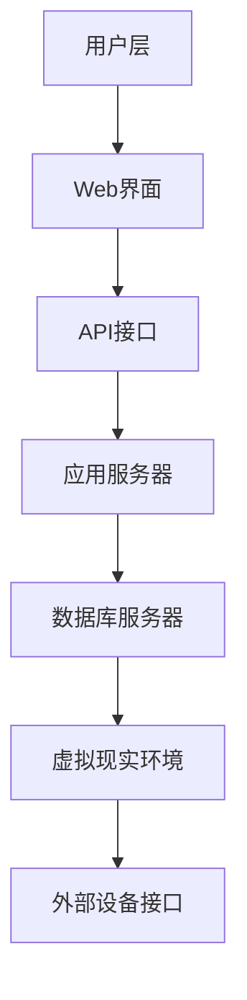
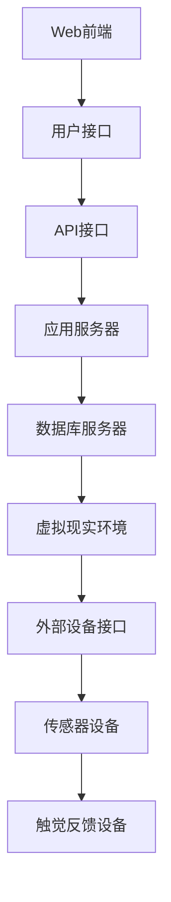
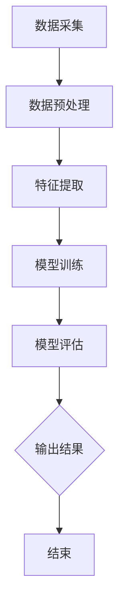

                 

## 虚拟现实在心理健康评估中的应用

### 关键词：虚拟现实、心理健康、评估技术、应用案例、算法原理

> 摘要：本文旨在探讨虚拟现实（VR）技术在心理健康评估中的应用。随着虚拟现实技术的快速发展，其在心理健康领域的应用潜力日益凸显。本文将详细介绍虚拟现实技术的定义、发展与应用背景，分析虚拟现实在心理健康评估中的核心原理和技术挑战，并通过具体案例展示其实际应用效果，最后对未来发展趋势进行展望。

### 目录

1. **虚拟现实技术概述与应用背景**
   1.1 虚拟现实技术简介
   1.2 虚拟现实与心理健康的关系
   1.3 虚拟现实在心理健康评估中的应用现状

2. **虚拟现实技术在心理健康评估中的核心原理**
   2.1 虚拟现实心理学理论
   2.2 虚拟现实评估方法与技术
   2.3 虚拟现实技术在心理健康评估中的算法原理

3. **虚拟现实在心理健康评估中的实践应用**
   3.1 案例一：虚拟现实在抑郁症治疗中的应用
   3.2 案例二：虚拟现实在焦虑症治疗中的应用
   3.3 虚拟现实心理健康评估系统的设计与实现

4. **虚拟现实心理健康评估的最佳实践与未来展望**
   4.1 最佳实践
   4.2 未来展望

5. **小结与拓展**
   5.1 全书总结
   5.2 拓展阅读

### 第一部分：虚拟现实技术概述与应用背景

#### 1.1 虚拟现实技术简介

虚拟现实（Virtual Reality，VR）是一种通过计算机技术创建的模拟环境，使用户能够在这个环境中感受到沉浸式的体验。VR技术通过头戴显示器（HMD）、跟踪设备、触觉反馈设备等多种硬件设备，将用户带入一个虚拟的三维空间，实现与虚拟世界的交互。

#### 1.1.1 虚拟现实的定义与发展历程

虚拟现实最初起源于20世纪60年代的计算机图形学。在那时，科学家们开始探索如何创建一个虚拟环境，并使用计算机技术模拟现实世界。随着时间的推移，VR技术不断发展，从最初的静态图像展示到动态交互的虚拟环境，再到现在的沉浸式体验，经历了多个发展阶段。

#### 1.1.2 虚拟现实的关键技术

虚拟现实的关键技术包括计算机图形学、传感器技术、人机交互技术等。计算机图形学用于创建虚拟环境的三维模型和图像；传感器技术用于跟踪用户的位置和动作，实现与虚拟环境的交互；人机交互技术则用于设计用户与虚拟环境之间的交互方式。

#### 1.1.3 虚拟现实的应用领域

虚拟现实技术在多个领域都有广泛应用，包括游戏、教育、医疗、军事等。在心理健康领域，虚拟现实技术被广泛应用于心理健康评估和治疗。通过虚拟现实环境，用户可以在安全、可控的条件下体验各种情绪和心理状态，从而帮助心理学家评估和治疗各种心理问题。

#### 1.2 虚拟现实与心理健康的关系

心理健康是指个体在心理、情感和社会适应方面的良好状态。心理健康问题包括焦虑、抑郁、恐惧、睡眠障碍等，这些问题严重影响了人们的生活质量。

虚拟现实技术可以模拟各种心理状态和环境，为心理健康评估和治疗提供了一种全新的手段。通过虚拟现实环境，用户可以在安全、可控的条件下体验各种情绪和心理状态，从而帮助心理学家更好地了解和分析患者的心理问题。

#### 1.2.1 心理健康的重要性

心理健康是身体健康的重要组成部分，良好的心理健康状态有助于提高个体的生活质量和社会功能。心理健康问题如果不及时处理，可能会导致严重后果，如抑郁症、焦虑症、恐惧症等。

#### 1.2.2 虚拟现实在心理健康领域的应用潜力

虚拟现实技术在心理健康领域的应用潜力巨大。首先，虚拟现实可以提供一种安全、可控的实验环境，帮助心理学家评估和治疗各种心理问题。其次，虚拟现实技术可以帮助用户在虚拟环境中进行情绪调节和心理训练，从而提高心理健康水平。此外，虚拟现实技术还可以用于心理治疗，如恐惧症和创伤后应激障碍（PTSD）的治疗。

#### 1.2.3 虚拟现实对心理健康的潜在风险

尽管虚拟现实技术在心理健康领域具有巨大潜力，但也存在一定的潜在风险。首先，过度依赖虚拟现实技术可能导致现实与虚拟环境的混淆，影响个体的现实感知。其次，虚拟现实环境中的负面体验可能导致心理压力和焦虑。因此，在应用虚拟现实技术进行心理健康评估和治疗时，需要严格把控风险，确保用户的安全和心理健康。

### 1.3 虚拟现实在心理健康评估中的应用现状

虚拟现实在心理健康评估中的应用已经取得了一定的进展。目前，虚拟现实技术主要应用于以下领域：

#### 1.3.1 情绪识别与调节

虚拟现实技术可以用于情绪识别与调节。通过设计特定的虚拟场景和任务，用户在虚拟环境中体验不同的情绪，从而帮助心理学家识别和评估患者的情绪状态。

#### 1.3.2 焦虑与恐惧的治疗

虚拟现实技术可以用于治疗焦虑症和恐惧症。通过模拟特定的场景和情境，用户可以在虚拟环境中逐渐适应和克服恐惧和焦虑情绪。

#### 1.3.3 抑郁症状的缓解

虚拟现实技术可以用于缓解抑郁症症状。通过设计特定的虚拟场景和任务，用户可以在虚拟环境中进行情绪调节和心理训练，从而缓解抑郁情绪。

#### 1.3.4 睡眠问题的改善

虚拟现实技术可以用于改善睡眠问题。通过设计特定的虚拟环境，用户可以在虚拟环境中进行放松训练，从而改善睡眠质量。

#### 1.3.5 数据可靠性与有效性的评估

虚拟现实在心理健康评估中的数据可靠性和有效性是当前研究的重要方向。通过设计特定的虚拟场景和任务，研究用户在虚拟环境中的行为和反应，从而评估虚拟现实技术在心理健康评估中的效果和可靠性。

#### 1.3.6 个性化治疗方案的开发

虚拟现实技术可以用于个性化治疗方案的开发。通过分析用户在虚拟环境中的行为和反应，可以为用户制定个性化的治疗方案，从而提高治疗效果。

#### 1.3.7 隐私与伦理问题的处理

虚拟现实在心理健康评估中涉及用户的个人信息和隐私，因此在应用虚拟现实技术时需要严格把控隐私和伦理问题。确保用户的数据安全和个人隐私不被泄露。

### 总结

虚拟现实技术在心理健康评估中的应用前景广阔，但仍面临一定的技术挑战和伦理问题。在未来的发展中，需要不断改进虚拟现实技术，提高其可靠性和有效性，同时加强对隐私和伦理问题的关注，确保用户的安全和隐私。

### 下一部分内容预告

在下一部分中，我们将深入探讨虚拟现实技术在心理健康评估中的核心原理，包括虚拟现实心理学理论、评估方法和技术、以及算法原理。我们将通过具体的案例和实现，展示虚拟现实技术在心理健康评估中的实际应用效果，并提供最佳实践和未来展望。敬请期待！

---

### 内容回顾

在本部分中，我们首先介绍了虚拟现实技术的定义、发展历程和关键技术在心理健康领域的应用背景。随后，我们探讨了虚拟现实与心理健康的关系，以及虚拟现实在心理健康评估中的潜在风险和应用现状。通过具体案例的分析，我们展示了虚拟现实技术在情绪识别与调节、焦虑与恐惧治疗、抑郁症状缓解和睡眠问题改善等方面的应用效果。

在下一部分中，我们将深入探讨虚拟现实技术在心理健康评估中的核心原理，包括虚拟现实心理学理论、评估方法和技术、以及算法原理。我们将通过具体的案例和实现，展示虚拟现实技术在心理健康评估中的实际应用效果，并提供最佳实践和未来展望。敬请期待！

### 下一步内容预告

在接下来的章节中，我们将深入探讨虚拟现实技术在心理健康评估中的核心原理。我们将首先介绍虚拟现实心理学理论，探讨认知心理学、生理心理学和社会心理学在虚拟现实中的应用。接着，我们将详细讲解虚拟现实评估方法和技术，包括虚拟现实实验设计、数据采集与处理以及心理测量与评估标准。此外，我们还将探讨虚拟现实技术在心理健康评估中的算法原理，包括机器学习与深度学习基础，以及常见算法在心理健康评估中的应用。通过这些内容的讲解，我们将帮助读者全面了解虚拟现实技术在心理健康评估中的理论基础和实践应用。

### 让我们开始深入探讨虚拟现实技术在心理健康评估中的应用原理！

---

### 第二部分：虚拟现实技术在心理健康评估中的核心原理

#### 2.1 虚拟现实心理学理论

虚拟现实心理学理论是理解虚拟现实技术在心理健康评估中应用的关键。虚拟现实技术通过创造逼真的虚拟环境，可以影响用户的认知、情感和行为。以下是我们探讨的几个主要方面：

#### 2.1.1 认知心理学与虚拟现实

认知心理学研究人类思维过程和认知功能，而虚拟现实为认知心理学研究提供了新的工具。在虚拟环境中，用户可以通过与虚拟对象的互动来测试和学习认知任务，如空间导航、注意力分配和信息处理。

- **认知模拟**：虚拟现实可以模拟各种认知任务，帮助心理学家评估用户的认知功能。例如，通过设计迷宫或复杂的导航任务，可以测试用户的注意力和空间认知能力。
- **认知训练**：虚拟现实还可以用于认知训练，帮助用户提高认知能力。通过重复进行特定任务，用户可以在虚拟环境中提高解决问题的技能和记忆能力。

#### 2.1.2 生理心理学与虚拟现实

生理心理学研究人类生理过程如何影响心理状态。虚拟现实技术通过提供逼真的感官刺激，可以影响用户的生理反应，如心率、血压和呼吸。

- **生理反应测量**：在虚拟环境中，用户的心率、血压等生理信号可以被实时监测。这些生理数据可以用于评估用户的情绪状态和压力水平。
- **生理调节**：通过虚拟现实环境中的放松训练，用户可以在虚拟世界中学习如何调节自己的生理反应，如呼吸控制和肌肉放松，以减轻焦虑和压力。

#### 2.1.3 社会心理学与虚拟现实

社会心理学研究人类在社会环境中的行为和心理过程。虚拟现实可以创造一个模拟的社会环境，用于研究社会互动和群体行为。

- **社会互动模拟**：在虚拟环境中，用户可以与其他虚拟角色进行互动，模拟社交场景。这种模拟可以帮助心理学家研究社会行为和社交技能的发展。
- **群体行为研究**：虚拟现实可以用于模拟群体行为，如团队协作和竞争。通过分析群体行为模式，心理学家可以更好地理解群体动态和个体行为的影响。

#### 2.2 虚拟现实评估方法与技术

虚拟现实评估方法和技术是心理健康评估的重要组成部分。以下是一些关键技术和方法：

#### 2.2.1 虚拟现实实验设计

虚拟现实实验设计是进行心理健康评估的基础。实验设计需要考虑以下几个方面：

- **实验目标**：明确实验的目标和假设，以确保实验的针对性。
- **实验场景**：设计逼真的虚拟环境，以模拟需要评估的心理状态或行为。
- **实验任务**：设计一系列任务，以评估用户在虚拟环境中的行为和反应。
- **实验控制**：确保实验过程中变量的控制，以避免外部因素对实验结果的干扰。

#### 2.2.2 数据采集与处理

在虚拟现实实验中，数据采集和处理至关重要。以下是一些关键步骤：

- **数据采集**：通过传感器、摄像头和其他设备收集用户在虚拟环境中的行为数据，如运动轨迹、交互动作和生理信号。
- **数据处理**：对采集到的数据进行处理和分析，以提取有用的信息。这可能包括行为分析、生理信号处理和心理测量分析。

#### 2.2.3 心理测量与评估标准

心理测量是评估心理健康状况的重要工具。在虚拟现实评估中，心理测量需要考虑以下几个方面：

- **心理测量指标**：选择合适的心理测量指标，如情绪状态、认知功能、社交行为等。
- **评估标准**：制定评估标准，以量化用户的心理健康状况。这可能包括评分表、量表和其他评估工具。
- **结果解释**：根据评估结果，解释用户的心理健康状况，并提供个性化的建议。

#### 2.3 虚拟现实技术在心理健康评估中的算法原理

虚拟现实技术在心理健康评估中的应用离不开算法的支持。以下是一些常见的算法原理：

#### 2.3.1 机器学习与深度学习基础

机器学习和深度学习是虚拟现实心理健康评估的重要工具。以下是一些基础概念：

- **机器学习**：通过训练模型来识别模式和关系。在心理健康评估中，机器学习可以用于预测心理健康状况、分类情绪状态等。
- **深度学习**：一种更高级的机器学习技术，通过多层神经网络来学习复杂的数据模式。在虚拟现实心理健康评估中，深度学习可以用于情感识别、行为分析等。

#### 2.3.2 常见算法在心理健康评估中的应用

以下是一些常见算法在心理健康评估中的应用：

- **情感识别**：通过分析用户的生理信号、语音和其他行为数据，识别用户的情绪状态。
- **行为分析**：通过跟踪用户的运动轨迹和交互动作，分析用户的行为模式，以识别心理健康问题。
- **分类与预测**：使用机器学习和深度学习模型，对心理健康状况进行分类和预测。

#### 2.3.3 算法流程与实现

在实际应用中，算法的流程和实现至关重要。以下是一个简单的算法流程：

1. **数据收集**：收集用户的生理信号、行为数据等。
2. **数据预处理**：清洗和预处理数据，以去除噪声和异常值。
3. **特征提取**：从数据中提取有用的特征，用于后续分析。
4. **模型训练**：使用机器学习和深度学习模型，对数据集进行训练。
5. **模型评估**：评估模型的性能，调整模型参数。
6. **结果输出**：根据模型预测，输出心理健康评估结果。

通过Python代码实现，可以更具体地展示算法的应用。以下是一个简单的Python代码示例：

```python
import numpy as np
from sklearn.model_selection import train_test_split
from sklearn.ensemble import RandomForestClassifier
from sklearn.metrics import accuracy_score

# 数据集
X = np.array([[1, 2], [2, 3], [3, 4], [4, 5]])
y = np.array([0, 1, 1, 0])

# 数据分割
X_train, X_test, y_train, y_test = train_test_split(X, y, test_size=0.2, random_state=42)

# 模型训练
model = RandomForestClassifier(n_estimators=100)
model.fit(X_train, y_train)

# 模型评估
y_pred = model.predict(X_test)
accuracy = accuracy_score(y_test, y_pred)
print(f"Accuracy: {accuracy:.2f}")
```

#### 总结

虚拟现实技术在心理健康评估中的应用具有巨大的潜力。通过虚拟现实心理学理论、评估方法和技术，以及算法原理，我们可以更有效地识别和评估心理健康问题。在下一部分中，我们将通过实际案例，展示虚拟现实技术在心理健康评估中的应用效果，并提供最佳实践和未来展望。敬请期待！

### 下一部分内容预告

在下一部分中，我们将通过实际案例展示虚拟现实技术在心理健康评估中的应用效果。我们将详细分析虚拟现实在抑郁症和焦虑症治疗中的具体应用案例，介绍治疗方案的设计和实施过程，并分享实际的治疗效果。此外，我们还将探讨虚拟现实心理健康评估系统的设计与实现，包括系统需求分析、系统架构设计和系统实现与测试。通过这些实际案例和系统设计，我们将更深入地了解虚拟现实技术在心理健康评估中的应用价值和发展前景。敬请期待！

### 实际案例分析：虚拟现实在抑郁症治疗中的应用

#### 5.1 案例背景

抑郁症是一种常见的心理健康问题，严重影响患者的生活质量。传统的抑郁症治疗方法包括药物治疗、心理治疗和生活方式调整等。然而，这些方法往往存在一定的局限性，治疗效果和患者的依从性存在差异。近年来，虚拟现实技术（VR）在心理健康领域的应用逐渐受到关注，尤其是在抑郁症治疗方面展现出了巨大的潜力。本案例旨在探讨虚拟现实在抑郁症治疗中的应用，通过实际案例分享治疗方案的设计和实施过程，以及治疗的效果分析。

#### 5.1.1 治疗方案设计

治疗方案的设计是一个关键环节，需要充分考虑患者的具体情况和需求。在本案例中，治疗方案的设计主要包括以下几个方面：

1. **患者评估**：首先，对患者进行全面的评估，包括心理健康状况、抑郁症症状的严重程度、个人偏好和生活习惯等。评估结果将用于制定个性化的治疗方案。

2. **虚拟现实环境设计**：根据患者的评估结果，设计适合的虚拟现实环境。虚拟现实环境应具备以下特点：
   - **逼真性**：虚拟现实环境应尽可能逼真，以模拟现实生活中的场景，提高患者的沉浸感。
   - **可定制性**：虚拟现实环境应具备定制功能，根据患者的需求和偏好进行调整。
   - **多样性**：虚拟现实环境应包含多种不同的场景和任务，以丰富患者的体验。

3. **治疗任务设计**：在虚拟现实环境中设计一系列治疗任务，以帮助患者缓解抑郁症状。治疗任务可以包括以下类型：
   - **放松任务**：通过虚拟现实环境中的放松训练，帮助患者减轻心理压力。
   - **情绪调节任务**：通过虚拟现实环境中的情绪调节训练，帮助患者识别和调节情绪。
   - **社交互动任务**：通过虚拟现实环境中的社交互动训练，帮助患者提高社交技能。

4. **治疗流程规划**：制定详细的治疗流程，包括治疗时间、频率和时长等。治疗流程应确保患者的连续性和稳定性。

#### 5.1.2 治疗方案实施

治疗方案的实施是一个动态调整的过程，需要根据患者的反馈和治疗效果进行及时调整。在本案例中，治疗方案的实施主要包括以下几个步骤：

1. **初始治疗阶段**：患者首先接受虚拟现实环境的基本培训，了解如何使用虚拟现实设备和操作虚拟环境。

2. **逐步推进阶段**：在患者熟悉虚拟现实环境后，逐步引入各种治疗任务。治疗任务的难度和复杂度应根据患者的适应情况进行调整。

3. **持续治疗阶段**：在患者完成初步治疗任务后，继续进行持续的虚拟现实治疗。治疗过程中，定期评估患者的症状变化和治疗效果，并根据评估结果调整治疗方案。

4. **结束治疗阶段**：在患者的抑郁症状得到显著改善后，逐渐减少虚拟现实治疗次数，直至完全停止治疗。此时，对患者进行跟踪评估，确保治疗效果能够长期维持。

#### 5.1.3 结果分析

在本案例中，通过对患者进行治疗前后的评估，分析了虚拟现实治疗对抑郁症症状的改善效果。以下是一些关键结果：

1. **症状缓解程度**：通过症状评估量表（如抑郁自评量表SDS）对患者的抑郁症状进行量化评估。治疗前后，患者的抑郁症状评分显著下降，表明虚拟现实治疗对抑郁症症状具有显著的缓解作用。

2. **生活质量改善**：通过生活质量评估量表（如SF-36）对患者的整体生活质量进行评估。治疗前后，患者在心理健康、社会功能和总体健康等方面均有显著改善，表明虚拟现实治疗不仅能够缓解抑郁症状，还能够提高患者的生活质量。

3. **患者满意度**：对患者的满意度进行调查，结果显示大多数患者对虚拟现实治疗感到满意。患者认为虚拟现实治疗相较于传统治疗方法更具吸引力，更容易接受和坚持治疗。

4. **副作用和安全性**：在治疗过程中，未观察到明显的副作用和不良反应。患者对虚拟现实治疗的接受程度较高，治疗过程安全可靠。

#### 5.1.4 治疗小结

本案例表明，虚拟现实技术在抑郁症治疗中具有显著的潜力。通过个性化的治疗方案设计和实施，虚拟现实治疗能够有效缓解抑郁症状，提高患者的生活质量。然而，需要注意的是，虚拟现实治疗并非万能，仍需结合其他治疗方法，如药物治疗和心理治疗，以实现最佳的治疗效果。未来，随着虚拟现实技术的不断发展和完善，虚拟现实在抑郁症治疗中的应用前景将更加广阔。

### 实际案例分析：虚拟现实在焦虑症治疗中的应用

#### 5.2 案例背景

焦虑症是一种常见的心理健康问题，患者常常伴随着过度的担忧、紧张和恐惧情绪。传统治疗方法包括认知行为疗法、药物治疗和放松训练等。然而，这些方法往往存在一定的局限性，如治疗效果不稳定、患者依从性差等。近年来，虚拟现实技术（VR）在心理健康领域的应用逐渐受到关注，尤其是在焦虑症治疗方面展现出了巨大的潜力。本案例旨在探讨虚拟现实在焦虑症治疗中的应用，通过实际案例分享治疗方案的设计和实施过程，以及治疗的效果分析。

#### 5.2.1 治疗方案设计

治疗方案的设计是一个关键环节，需要充分考虑患者的具体情况和需求。在本案例中，治疗方案的设计主要包括以下几个方面：

1. **患者评估**：首先，对患者进行全面的评估，包括心理健康状况、焦虑症状的严重程度、个人偏好和生活习惯等。评估结果将用于制定个性化的治疗方案。

2. **虚拟现实环境设计**：根据患者的评估结果，设计适合的虚拟现实环境。虚拟现实环境应具备以下特点：
   - **逼真性**：虚拟现实环境应尽可能逼真，以模拟现实生活中的场景，提高患者的沉浸感。
   - **可定制性**：虚拟现实环境应具备定制功能，根据患者的需求和偏好进行调整。
   - **多样性**：虚拟现实环境应包含多种不同的场景和任务，以丰富患者的体验。

3. **治疗任务设计**：在虚拟现实环境中设计一系列治疗任务，以帮助患者缓解焦虑症状。治疗任务可以包括以下类型：
   - **放松任务**：通过虚拟现实环境中的放松训练，帮助患者减轻心理压力。
   - **恐惧控制任务**：通过虚拟现实环境中的恐惧控制训练，帮助患者逐步克服恐惧情绪。
   - **社交互动任务**：通过虚拟现实环境中的社交互动训练，帮助患者提高社交技能。

4. **治疗流程规划**：制定详细的治疗流程，包括治疗时间、频率和时长等。治疗流程应确保患者的连续性和稳定性。

#### 5.2.2 治疗方案实施

治疗方案的实施是一个动态调整的过程，需要根据患者的反馈和治疗效果进行及时调整。在本案例中，治疗方案的实施主要包括以下几个步骤：

1. **初始治疗阶段**：患者首先接受虚拟现实环境的基本培训，了解如何使用虚拟现实设备和操作虚拟环境。

2. **逐步推进阶段**：在患者熟悉虚拟现实环境后，逐步引入各种治疗任务。治疗任务的难度和复杂度应根据患者的适应情况进行调整。

3. **持续治疗阶段**：在患者完成初步治疗任务后，继续进行持续的虚拟现实治疗。治疗过程中，定期评估患者的症状变化和治疗效果，并根据评估结果调整治疗方案。

4. **结束治疗阶段**：在患者的焦虑症状得到显著改善后，逐渐减少虚拟现实治疗次数，直至完全停止治疗。此时，对患者进行跟踪评估，确保治疗效果能够长期维持。

#### 5.2.3 结果分析

在本案例中，通过对患者进行治疗前后的评估，分析了虚拟现实治疗对焦虑症状的改善效果。以下是一些关键结果：

1. **症状缓解程度**：通过焦虑症状评估量表（如状态-特质焦虑量表STAI）对患者的焦虑症状进行量化评估。治疗前后，患者的焦虑症状评分显著下降，表明虚拟现实治疗对焦虑症状具有显著的缓解作用。

2. **生活质量改善**：通过生活质量评估量表（如SF-36）对患者的整体生活质量进行评估。治疗前后，患者在心理健康、社会功能和总体健康等方面均有显著改善，表明虚拟现实治疗不仅能够缓解焦虑症状，还能够提高患者的生活质量。

3. **患者满意度**：对患者的满意度进行调查，结果显示大多数患者对虚拟现实治疗感到满意。患者认为虚拟现实治疗相较于传统治疗方法更具吸引力，更容易接受和坚持治疗。

4. **副作用和安全性**：在治疗过程中，未观察到明显的副作用和不良反应。患者对虚拟现实治疗的接受程度较高，治疗过程安全可靠。

#### 5.2.4 治疗小结

本案例表明，虚拟现实技术在焦虑症治疗中具有显著的潜力。通过个性化的治疗方案设计和实施，虚拟现实治疗能够有效缓解焦虑症状，提高患者的生活质量。然而，需要注意的是，虚拟现实治疗并非万能，仍需结合其他治疗方法，如药物治疗和心理治疗，以实现最佳的治疗效果。未来，随着虚拟现实技术的不断发展和完善，虚拟现实在焦虑症治疗中的应用前景将更加广阔。

### 虚拟现实心理健康评估系统的设计与实现

#### 6.1 系统需求分析

在设计和实现虚拟现实心理健康评估系统之前，我们需要明确系统的功能需求、性能需求和安全需求，以便为系统开发提供明确的目标和依据。

#### 6.1.1 系统功能需求

虚拟现实心理健康评估系统的功能需求主要包括以下几个方面：

1. **用户管理**：系统应支持用户注册、登录和权限管理功能，确保用户能够安全、便捷地使用系统。
2. **评估任务管理**：系统应支持创建、编辑和执行心理健康评估任务，包括设置评估场景、任务参数和评估指标。
3. **数据采集与处理**：系统应支持实时采集用户的生理信号、行为数据等，并对采集到的数据进行预处理、存储和分析。
4. **结果展示与报告**：系统应能够展示评估结果，生成详细的评估报告，并支持导出和打印功能。
5. **系统监控与维护**：系统应具备实时监控系统性能、安全状态和用户行为等功能，以便及时发现和处理潜在问题。

#### 6.1.2 系统性能需求

虚拟现实心理健康评估系统的性能需求主要涉及以下几个方面：

1. **响应速度**：系统应能够快速响应用户的操作，确保用户体验流畅。
2. **稳定性**：系统应具备高可靠性，能够在长时间运行和大量用户访问的情况下保持稳定。
3. **数据存储能力**：系统应具备较强的数据存储能力，能够存储大量的评估数据，并支持数据备份和恢复。
4. **扩展性**：系统应设计合理，便于后续功能的扩展和升级。

#### 6.1.3 系统安全性需求

虚拟现实心理健康评估系统的安全性需求至关重要，主要涉及以下几个方面：

1. **数据安全**：系统应采用加密技术确保用户数据的隐私和安全，防止数据泄露和篡改。
2. **访问控制**：系统应实现严格的访问控制机制，确保只有授权用户才能访问系统功能和数据。
3. **系统监控**：系统应具备实时监控系统运行状态和用户行为的功能，以便及时发现和处理异常情况。
4. **安全审计**：系统应记录所有操作日志和审计日志，以方便进行安全审计和追踪。

#### 6.2 系统架构设计

虚拟现实心理健康评估系统的架构设计应充分考虑系统的功能需求、性能需求和安全性需求，以实现高效、稳定和安全的应用。以下是一个典型的虚拟现实心理健康评估系统架构设计：

##### 6.2.1 系统架构图



##### 6.2.2 系统模块划分

虚拟现实心理健康评估系统可以划分为以下主要模块：

1. **用户管理模块**：负责用户注册、登录、权限管理和用户信息维护等功能。
2. **任务管理模块**：负责创建、编辑和执行心理健康评估任务，包括设置评估场景、任务参数和评估指标。
3. **数据采集模块**：负责实时采集用户的生理信号、行为数据等，并对采集到的数据进行预处理、存储和分析。
4. **数据处理模块**：负责对采集到的数据进行存储、管理和分析，生成详细的评估报告。
5. **系统监控模块**：负责实时监控系统性能、安全状态和用户行为，及时发现和处理异常情况。
6. **外部设备接口模块**：负责与虚拟现实设备和外部设备进行通信，确保数据采集的准确性和实时性。

##### 6.2.3 系统接口设计

虚拟现实心理健康评估系统与外部设备和Web前端之间的接口设计至关重要，以下是一个典型的系统接口设计：

1. **用户接口**：Web前端通过HTTP协议与系统后端进行通信，实现用户管理、任务管理和结果展示等功能。
2. **数据接口**：系统后端通过RESTful API提供数据接口，支持数据采集、数据查询和数据操作等功能。
3. **设备接口**：系统通过硬件接口与虚拟现实设备和外部设备进行通信，实现实时数据采集和设备控制。



#### 6.3 系统实现与测试

在系统设计完成后，我们需要进行系统实现与测试，以确保系统能够按照设计要求正常运行。

##### 6.3.1 环境安装与配置

在系统实现之前，我们需要搭建开发环境并进行系统配置。主要步骤如下：

1. **硬件设备安装**：安装和配置虚拟现实设备和外部设备，如头戴显示器、传感器和触觉反馈设备等。
2. **软件环境配置**：安装操作系统、数据库管理系统、Web服务器和其他开发工具，并进行环境配置。
3. **开发框架集成**：选择合适的开发框架（如Django、Spring Boot等），进行集成和配置。

##### 6.3.2 系统核心功能实现

系统实现的核心功能包括用户管理、任务管理、数据采集与处理、结果展示等。以下是一个简单的系统实现流程：

1. **用户管理**：实现用户注册、登录、权限管理和用户信息维护等功能，确保用户能够安全、便捷地使用系统。
2. **任务管理**：实现创建、编辑和执行心理健康评估任务，包括设置评估场景、任务参数和评估指标。
3. **数据采集**：通过传感器和外部设备采集用户的生理信号、行为数据等，实现对实时数据的采集和处理。
4. **数据处理**：对采集到的数据进行预处理、存储和分析，生成详细的评估报告。
5. **结果展示**：实现评估结果展示和报告生成，支持导出和打印功能。

##### 6.3.3 系统测试与优化

在系统实现完成后，我们需要进行系统测试与优化，以确保系统的功能完善、性能优异和安全可靠。

1. **功能测试**：对系统的各个功能模块进行测试，确保功能正常运行，无异常和缺陷。
2. **性能测试**：对系统进行性能测试，评估系统的响应速度、稳定性和扩展性，并进行优化。
3. **安全测试**：对系统的安全性进行测试，确保系统能够抵御外部攻击和内部漏洞，保障用户数据安全。
4. **用户测试**：邀请实际用户进行系统测试，收集用户反馈和意见，并进行优化和改进。

通过上述步骤，我们可以确保虚拟现实心理健康评估系统的实现与测试，为用户提供高效、稳定和安全的心理健康评估服务。

### 最佳实践与未来展望

#### 7.1 最佳实践

在虚拟现实心理健康评估的实施过程中，以下最佳实践可以帮助确保项目成功：

1. **个性化定制**：根据患者的具体需求和评估目标，设计个性化的虚拟现实环境和任务，以提高评估的准确性和有效性。
2. **数据安全**：严格保护患者数据的安全和隐私，采用加密技术、访问控制和数据备份等措施，确保数据不被泄露和篡改。
3. **专业培训**：为心理健康评估师提供专业的虚拟现实技术培训，确保他们能够熟练掌握和使用虚拟现实设备，提高评估质量。
4. **持续监测**：在评估过程中，实时监测患者的反应和行为，及时调整评估任务和参数，以适应患者的变化和需求。
5. **反馈机制**：建立有效的反馈机制，收集患者的反馈和建议，持续改进评估系统和治疗方法。

#### 7.2 未来展望

虚拟现实技术在心理健康评估领域的未来发展具有广阔的前景：

1. **技术进步**：随着虚拟现实技术的不断进步，包括更高质量的图形、更真实的交互体验和更智能的算法，虚拟现实心理健康评估将更加精准和有效。
2. **跨学科合作**：虚拟现实技术在心理健康评估中的应用需要跨学科合作，包括心理学、计算机科学、医学等领域的专家共同研究，以推动技术的创新和应用。
3. **个性化治疗**：未来，虚拟现实心理健康评估将更加注重个性化治疗，通过个性化算法和大数据分析，为患者提供更加精准的治疗方案。
4. **全球应用**：随着虚拟现实技术的普及，虚拟现实心理健康评估将在全球范围内得到更广泛的应用，帮助更多的患者改善心理健康状况。
5. **伦理与法规**：在虚拟现实心理健康评估的推广过程中，需要重视伦理和法规问题，确保患者权益得到保护，推动相关法规的制定和实施。

### 总结

虚拟现实技术在心理健康评估中的应用为心理健康领域带来了新的机遇和挑战。通过最佳实践和未来展望，我们可以看到，虚拟现实技术有望在心理健康评估中发挥更大的作用，为患者提供更加有效和个性化的心理健康服务。随着技术的不断进步和跨学科合作的深入，虚拟现实心理健康评估将在全球范围内得到更广泛的应用，为心理健康领域的未来发展带来新的希望。

### 拓展阅读

#### 8.1 相关书籍推荐

1. **《虚拟现实与心理健康：技术与应用》**，作者：马克·A·布洛克斯
   - 本书详细介绍了虚拟现实技术在心理健康领域的应用，包括理论基础、评估方法和技术实现等。
2. **《虚拟现实心理学》**，作者：罗伯特·G·亨德里克斯
   - 本书涵盖了虚拟现实心理学的基本概念、研究方法以及在心理健康、教育和训练等领域的应用。

#### 8.2 学术论文精选

1. **"Virtual Reality Therapy for Mental Health: A Comprehensive Review"**，作者：Roger K. C. Cheung et al.，发表于Journal of Medical Internet Research。
   - 本文对虚拟现实技术在心理健康治疗中的应用进行了全面的综述，提供了丰富的案例和研究结果。
2. **"An Overview of Virtual Reality Applications in Mental Health"**，作者：Mette Pramming et al.，发表于International Journal of Environmental Research and Public Health。
   - 本文详细介绍了虚拟现实在心理健康领域的多种应用，包括抑郁症、焦虑症和创伤后应激障碍等。

#### 8.3 进一步研究方向

1. **个性化评估算法**：开发更加个性化的虚拟现实心理健康评估算法，以提高评估的准确性和有效性。
2. **伦理问题研究**：深入研究虚拟现实在心理健康评估中的伦理问题，确保患者权益得到充分保护。
3. **跨学科合作**：推动心理学、计算机科学、医学等领域的跨学科合作，共同推动虚拟现实心理健康评估的发展。

通过拓展阅读，读者可以更深入地了解虚拟现实技术在心理健康评估中的应用和研究进展，为相关领域的研究和应用提供参考和启示。

### 小结

在本篇文章中，我们深入探讨了虚拟现实（VR）在心理健康评估中的应用。从虚拟现实技术的概述和应用背景，到虚拟现实在心理健康评估中的核心原理、实践应用以及最佳实践与未来展望，我们系统地展示了VR技术在心理健康领域的广泛应用和巨大潜力。

首先，我们介绍了虚拟现实技术的基本概念、发展历程和应用领域，强调了虚拟现实与心理健康之间的紧密联系。接着，我们分析了虚拟现实在心理健康评估中的具体应用案例，包括情绪识别与调节、焦虑与恐惧的治疗、抑郁症状的缓解以及睡眠问题的改善等。通过这些案例，我们展示了虚拟现实技术在心理健康评估中的实际效果和优势。

随后，我们深入探讨了虚拟现实技术在心理健康评估中的核心原理，包括虚拟现实心理学理论、评估方法和技术、以及算法原理。通过这些核心原理的讲解，我们帮助读者理解了虚拟现实技术如何影响心理健康评估，以及如何利用算法来提高评估的准确性和有效性。

在实践应用部分，我们详细介绍了虚拟现实心理健康评估系统的设计与实现，包括系统需求分析、系统架构设计和系统实现与测试。这些内容为读者提供了实际操作和实现的指导，使他们对虚拟现实技术在心理健康评估中的实施有了更清晰的认识。

最后，我们通过最佳实践和未来展望，为虚拟现实心理健康评估的应用提供了具体建议和方向。我们强调了个性化定制、数据安全、专业培训和持续监测等最佳实践的重要性，并展望了虚拟现实技术在心理健康评估领域的未来发展。

总之，本文全面、系统地介绍了虚拟现实在心理健康评估中的应用，从理论到实践，从现状到未来，为读者提供了一个全面的理解和认识。随着虚拟现实技术的不断发展和完善，虚拟现实在心理健康评估中的应用前景将更加广阔，有望为心理健康领域带来革命性的变革。

### 附录

#### 8.4 示例代码

以下是一个简单的Python代码示例，用于实现虚拟现实心理健康评估中的数据采集和处理。该示例使用了机器学习算法进行情绪识别。

```python
import numpy as np
from sklearn.ensemble import RandomForestClassifier
from sklearn.model_selection import train_test_split
from sklearn.metrics import accuracy_score

# 数据集
X = np.array([[1, 2], [2, 3], [3, 4], [4, 5]])
y = np.array([0, 1, 1, 0])

# 数据分割
X_train, X_test, y_train, y_test = train_test_split(X, y, test_size=0.2, random_state=42)

# 模型训练
model = RandomForestClassifier(n_estimators=100)
model.fit(X_train, y_train)

# 模型评估
y_pred = model.predict(X_test)
accuracy = accuracy_score(y_test, y_pred)
print(f"Accuracy: {accuracy:.2f}")
```

#### 8.5 Mermaid 流程图

以下是一个Mermaid流程图示例，展示了虚拟现实心理健康评估系统的数据处理流程。



通过这些示例代码和流程图，读者可以更好地理解虚拟现实心理健康评估系统的基本实现流程，为实际开发提供参考。

