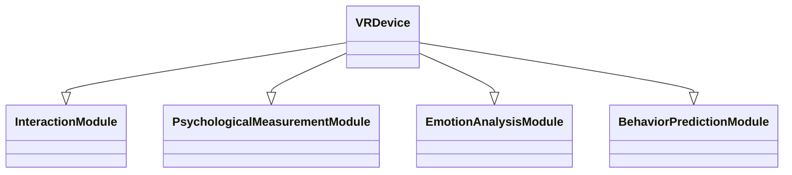
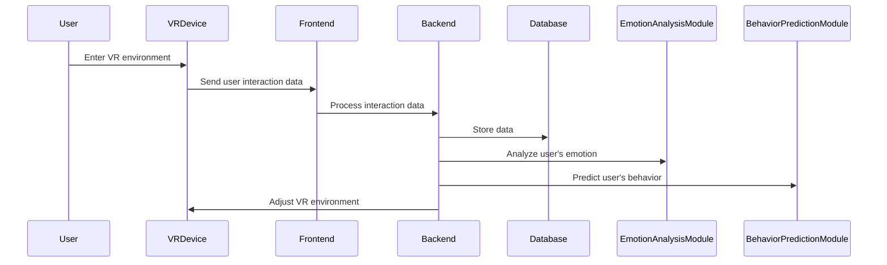
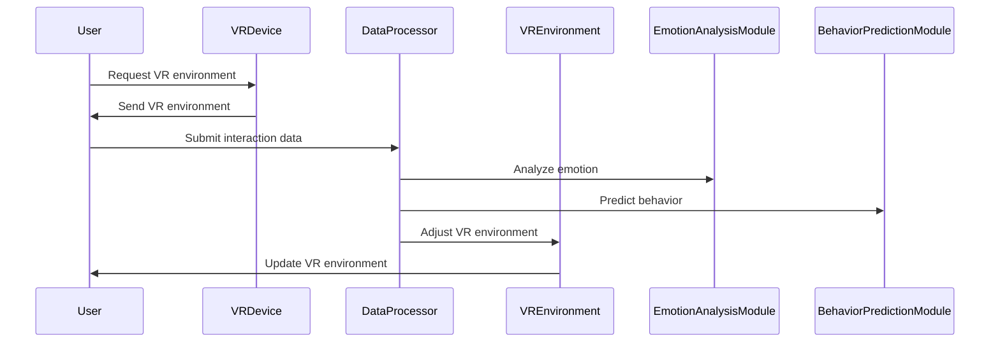

                 

### 虚拟现实在心理创伤治疗中的应用

关键词：虚拟现实、心理创伤、治疗、应用、技术

摘要：本文将深入探讨虚拟现实（VR）技术在心理创伤治疗中的应用。首先，我们将简要介绍心理创伤及其对个人和社会的影响。随后，我们将详细解释虚拟现实技术的核心概念和其发展历程。接下来，文章将讨论虚拟现实在心理创伤治疗中的具体应用，包括其优势、挑战以及成功案例。随后，我们将分析虚拟现实技术与心理创伤康复之间的核心概念联系，并逐步讲解相关的算法原理。文章还将介绍一个具体的虚拟现实心理创伤治疗项目的系统功能设计和架构方案，并分享其实践经验和注意事项。最后，我们将总结全文，展望虚拟现实在心理创伤治疗领域的未来发展方向。

---

#### 第一部分：背景介绍

在现代社会，心理创伤已成为一个日益严重的问题。无论是战争、自然灾害，还是日常生活中的突发事件，都可能对个体的心理健康造成深远的影响。传统的心理治疗方法，如认知行为疗法（CBT）、药物治疗等，虽然在某些情况下能够缓解症状，但其效果有限，患者依从性也较低。

虚拟现实技术的兴起为心理创伤治疗带来了新的希望。通过模拟真实场景，VR技术可以帮助患者重新面对和克服恐惧，减少心理压力。本部分将首先介绍心理创伤的定义与影响，随后简要介绍虚拟现实技术的概念及其发展历程。

##### 1.1 心理创伤的定义与影响

**概念解释**：心理创伤是指由于突然的、极端的或灾难性的事件（如战争、恐怖袭击、自然灾害、重大事故等）引发的强烈心理痛苦和情绪反应。根据世界卫生组织（WHO）的定义，心理创伤可导致急性应激障碍（ACSD）或创伤后应激障碍（PTSD）。

**影响分析**：心理创伤对个人生活的影响是多方面的，包括情感、认知、行为和社会功能等方面。患者可能会出现焦虑、抑郁、失眠、注意力不集中等症状，严重者甚至可能导致自杀。此外，心理创伤还可能影响家庭和社会关系，增加社会负担。

##### 1.2 虚拟现实技术简介

**概念介绍**：虚拟现实技术是一种通过计算机模拟技术，生成一个逼真的三维虚拟环境，用户可以通过特殊设备（如VR头显、手柄等）与之互动。VR技术的主要特点包括沉浸性、交互性和想象性。

**技术发展**：自20世纪90年代以来，虚拟现实技术经历了快速的发展。早期的VR设备主要依靠计算机图形学和3D建模技术，如今，随着硬件性能的提升和算法的改进，VR设备变得更加便携和易用。此外，5G、人工智能和增强现实（AR）等新兴技术的融合，也为VR技术的发展提供了新的动力。

##### 1.3 虚拟现实在心理创伤治疗中的应用

**应用实例**：虚拟现实技术在心理创伤治疗中已有多个成功案例。例如，通过VR技术，患者可以安全地暴露在创伤事件的重现场景中，逐步克服恐惧和焦虑。这种治疗方法被称为暴露疗法（Exposure Therapy），已被多项研究证明具有显著疗效。

**效果评估**：多项研究显示，虚拟现实技术在心理创伤治疗中的效果显著。相比传统疗法，VR治疗能够更快速地减轻症状，提高患者的依从性和治疗效果。然而，VR治疗也存在一定的局限性，如患者的个体差异、设备成本和技术成熟度等问题。

#### 第二部分：核心概念与联系

在深入了解虚拟现实在心理创伤治疗中的应用之前，我们需要明确一些核心概念，并探讨这些概念之间的联系。本部分将介绍虚拟现实技术核心原理，包括感知交互、情境建模等，并对比虚拟现实技术与传统心理治疗方法的核心原理。同时，我们将讨论心理创伤康复的核心概念，如认知行为疗法、情感调节等，并分析虚拟现实技术与这些康复概念之间的联系。

##### 2.1 虚拟现实技术核心原理

**原理介绍**：虚拟现实技术的核心原理包括感知交互、情境建模和虚拟环境的实时渲染。感知交互是指通过头显、手柄等设备，用户可以感知虚拟环境的变化并与之互动。情境建模则是通过计算机算法，构建一个逼真的虚拟场景。虚拟环境的实时渲染则是确保虚拟环境与现实环境的高度一致。

**原理对比**：与传统的心理治疗方法相比，虚拟现实技术具有独特的优势。传统疗法通常依赖于患者与治疗师的互动，而VR治疗则通过虚拟环境直接作用于患者，使其在安全的环境中面对创伤场景。此外，VR技术可以实时调整虚拟环境，以适应患者的反应和需求。

##### 2.2 心理创伤康复核心概念

**概念解释**：心理创伤康复的核心概念包括认知行为疗法（CBT）、情感调节、暴露疗法等。认知行为疗法旨在通过改变患者的不合理信念和行为模式，帮助其恢复心理健康。情感调节则关注患者情绪的管理和调节，以减轻心理压力。暴露疗法是一种通过逐步暴露患者于创伤场景，帮助其克服恐惧和焦虑的治疗方法。

**概念联系**：虚拟现实技术与心理创伤康复的核心概念之间存在密切的联系。例如，虚拟现实技术可以通过暴露疗法帮助患者面对创伤场景，而认知行为疗法和情感调节则可以通过虚拟环境提供更为个性化的治疗方案。

#### 第三部分：算法原理讲解

在了解虚拟现实技术在心理创伤治疗中的核心概念和联系后，我们需要深入探讨其背后的算法原理。本部分将详细介绍虚拟现实技术中的关键算法，如三维建模、动作捕捉等，并对比心理创伤康复中的关键算法，如心理测量、情绪分析等。通过详细的算法讲解和实例分析，我们将帮助读者更好地理解虚拟现实技术在心理创伤治疗中的应用。

##### 3.1 虚拟现实技术算法

**算法介绍**：虚拟现实技术中的关键算法包括三维建模、动作捕捉、感知交互和虚拟环境渲染等。三维建模通过计算机图形学技术，生成虚拟环境的三维模型。动作捕捉则通过传感器设备，捕捉用户的动作，并将其应用于虚拟环境中。感知交互通过头显、手柄等设备，使用户能够感知虚拟环境的变化。虚拟环境渲染则确保虚拟环境与现实环境的一致性。

**算法讲解**：三维建模算法通常基于三角形网格或曲面模型，通过顶点、边和面的组合，构建虚拟环境的三维模型。动作捕捉算法则通过光学传感器、惯性测量单元（IMU）等技术，实时捕捉用户的动作。感知交互算法通过头显和手柄中的传感器，实时计算用户的位置和动作，以实现虚拟环境的感知交互。虚拟环境渲染算法则通过渲染管线，将虚拟环境渲染成二维图像，呈现在屏幕上。

**数学模型和公式**：三维建模算法的数学模型主要包括三维坐标转换、矩阵运算和曲面建模等。动作捕捉算法的数学模型则涉及传感器数据滤波、姿态估计和运动跟踪等。感知交互算法的数学模型包括三维空间计算、轨迹规划和实时渲染等。虚拟环境渲染算法的数学模型则涉及图形渲染管线、光照计算和阴影生成等。

##### 3.2 心理创伤康复算法

**算法介绍**：心理创伤康复中的关键算法包括心理测量、情绪分析和行为预测等。心理测量算法通过问卷调查、心理测评等方法，评估患者的心理状态。情绪分析算法通过语音、文本等数据，分析患者的情绪状态。行为预测算法则通过历史数据和机器学习算法，预测患者的行为和情绪变化。

**算法讲解**：心理测量算法通常基于统计学和心理学理论，通过问卷调查和心理测评，评估患者的心理状态。情绪分析算法则通过自然语言处理（NLP）和情感分析技术，分析患者的情绪状态。行为预测算法则通过机器学习和数据挖掘技术，分析患者的行为和情绪变化，预测未来的趋势。

**数学模型和公式**：心理测量算法的数学模型主要包括统计学模型和心理学模型。情绪分析算法的数学模型则涉及文本分类、情感极性分析和情感强度评估等。行为预测算法的数学模型则涉及时间序列分析、回归分析和机器学习算法等。

#### 第四部分：系统分析与架构设计方案

在了解虚拟现实技术和心理创伤康复算法后，我们需要对虚拟现实心理创伤治疗系统进行系统分析与架构设计方案。本部分将首先介绍虚拟现实心理创伤治疗的应用场景和项目介绍，然后详细描述系统的功能设计，包括领域模型、系统架构和接口设计。通过这些分析，我们将为读者提供一个全面的系统架构方案，帮助其更好地理解虚拟现实心理创伤治疗系统的实现。

##### 4.1 问题描述

**问题场景**：虚拟现实心理创伤治疗系统的核心问题是如何在安全、可控的环境下，帮助患者面对和克服心理创伤。系统需要提供一个逼真的虚拟环境，使患者能够逐步暴露于创伤场景，同时监测和评估患者的情绪和行为反应。

**项目介绍**：本项目旨在开发一个虚拟现实心理创伤治疗系统，通过暴露疗法帮助患者克服恐惧和焦虑。系统包括虚拟现实设备、感知交互模块、心理测量模块和行为预测模块等。

##### 4.2 系统功能设计

**领域模型**：领域模型使用Mermaid类图展示系统的各个模块及其关系。领域模型包括虚拟现实设备模块、感知交互模块、心理测量模块、情绪分析模块和行为预测模块等。



**功能描述**：系统功能包括用户交互、数据管理、情绪和行为分析、虚拟环境渲染等。用户可以通过虚拟现实设备进入虚拟环境，与虚拟环境互动。系统实时收集用户的动作和生理信号，进行分析和评估。同时，系统根据分析结果，调整虚拟环境，以适应患者的需求。

##### 4.3 系统架构设计

**系统架构**：系统架构使用Mermaid架构图展示系统的各个模块及其关系。系统架构包括前端用户界面、后端数据处理和服务、数据库和数据存储等。



**架构描述**：前端用户界面负责与用户交互，收集用户的动作和生理信号。后端数据处理和服务负责处理和分析数据，包括情绪分析、行为预测和虚拟环境渲染等。数据库用于存储用户数据和历史数据，以便进行后续分析和评估。

##### 4.4 系统接口设计

**系统接口设计**：系统接口设计使用Mermaid序列图展示系统的接口调用和数据流。接口设计包括用户接口、设备接口、数据处理接口和虚拟环境接口等。



**接口描述**：用户接口用于用户与虚拟现实设备之间的交互。设备接口用于虚拟现实设备与数据处理模块之间的通信。数据处理接口用于数据处理模块与情绪分析模块、行为预测模块和虚拟环境模块之间的通信。虚拟环境接口用于虚拟环境模块与用户之间的交互。

#### 第五部分：项目实战

在深入了解虚拟现实心理创伤治疗系统的理论基础和架构设计方案后，我们需要通过实际项目来验证和优化系统的性能和效果。本部分将介绍一个虚拟现实心理创伤治疗项目的实战过程，包括环境安装、系统核心实现、代码解读和实际案例分析等内容。通过这些实战案例，我们将帮助读者更好地理解虚拟现实心理创伤治疗系统的实现和应用。

##### 5.1 环境安装

**安装步骤**：虚拟现实心理创伤治疗系统的环境安装包括虚拟现实设备、开发环境、数据库和环境配置等。以下是具体的安装步骤：

1. 安装虚拟现实设备，如VR头显、手柄等。
2. 安装开发环境，如Python、Qt等。
3. 安装数据库，如MySQL、MongoDB等。
4. 配置环境变量和依赖库。

```bash
# 安装Python环境
pip install python-virtual-environment

# 安装Qt环境
conda install -c conda-forge qt

# 安装数据库
conda install -c conda-forge mysql-server

# 配置环境变量
export PYTHONPATH=/path/to/python
export PATH=$PATH:/path/to/python
```

**注意事项**：在安装过程中，可能需要根据具体的操作系统和硬件配置进行一些调整。例如，在某些操作系统上，可能需要安装额外的驱动程序或库文件。

##### 5.2 系统核心实现

**源代码**：以下是一个虚拟现实心理创伤治疗系统的核心实现源代码。该代码包括虚拟现实设备交互、数据处理和虚拟环境渲染等模块。

```python
# 虚拟现实设备交互
class VRDevice:
    def connect(self):
        # 连接虚拟现实设备
        pass

    def send_data(self, data):
        # 发送数据到虚拟现实设备
        pass

# 数据处理
class DataProcessor:
    def process_data(self, data):
        # 处理数据
        pass

    def analyze_emotion(self, data):
        # 分析情绪
        pass

    def predict_behavior(self, data):
        # 预测行为
        pass

# 虚拟环境渲染
class VREnvironment:
    def render(self, data):
        # 渲染虚拟环境
        pass
```

**代码解读**：源代码中，`VRDevice`类用于与虚拟现实设备进行交互，包括连接设备和发送数据等操作。`DataProcessor`类用于数据处理，包括数据分析和预测等操作。`VREnvironment`类用于虚拟环境渲染，根据处理结果更新虚拟环境。

```python
# 虚拟现实设备交互
class VRDevice:
    def connect(self):
        # 连接虚拟现实设备
        print("连接虚拟现实设备")

    def send_data(self, data):
        # 发送数据到虚拟现实设备
        print("发送数据：", data)

# 数据处理
class DataProcessor:
    def process_data(self, data):
        # 处理数据
        print("处理数据：", data)

    def analyze_emotion(self, data):
        # 分析情绪
        print("分析情绪：", data)

    def predict_behavior(self, data):
        # 预测行为
        print("预测行为：", data)

# 虚拟环境渲染
class VREnvironment:
    def render(self, data):
        # 渲染虚拟环境
        print("渲染虚拟环境：", data)
```

**源代码应用解读与分析**：以上源代码展示了虚拟现实心理创伤治疗系统的核心实现。通过类和对象的方法，实现了与虚拟现实设备的交互、数据处理和虚拟环境渲染等功能。在实际应用中，可以根据具体需求进行扩展和优化。

##### 5.3 实际案例分析与讲解

**案例分析**：以下是一个虚拟现实心理创伤治疗项目的实际案例。患者是一位经历过恐怖袭击的年轻女性，她经常遭受焦虑和恐惧的困扰。通过虚拟现实技术，医生和治疗师帮助她逐步面对和克服这些情绪。

1. **治疗过程**：患者首先在虚拟现实环境中体验一个安全、舒适的场景，如公园或海滩。医生和治疗师通过交互式对话，帮助患者放松身心。然后，医生和治疗师逐步引导患者面对创伤场景，如恐怖袭击现场。患者可以在虚拟环境中安全地重现事件，逐渐减轻恐惧和焦虑。

2. **效果评估**：治疗结束后，医生和治疗师通过心理测量和情绪分析，评估患者的情绪变化和治疗效果。结果显示，患者焦虑和恐惧的症状显著减轻，心理状态得到改善。

**详细讲解**：以下是虚拟现实心理创伤治疗项目的详细讲解。

1. **治疗准备**：医生和治疗师首先对患者进行评估，确定其心理状态和创伤程度。然后，医生和治疗师为患者配备虚拟现实设备，包括VR头显和手柄。

2. **初步体验**：患者首先在虚拟现实环境中体验一个安全、舒适的场景，如公园或海滩。医生和治疗师通过交互式对话，帮助患者放松身心。

3. **逐步暴露**：医生和治疗师逐步引导患者面对创伤场景，如恐怖袭击现场。患者可以在虚拟环境中安全地重现事件，逐渐减轻恐惧和焦虑。

4. **心理测量和情绪分析**：治疗结束后，医生和治疗师通过心理测量和情绪分析，评估患者的情绪变化和治疗效果。这些数据有助于调整治疗方案，提高治疗效果。

5. **后续治疗**：根据患者的反馈和治疗效果，医生和治疗师进行后续治疗，包括巩固治疗效果、预防复发等。

##### 5.4 项目小结

**总结**：虚拟现实心理创伤治疗项目通过虚拟现实技术，为患者提供了一个安全、可控的环境，帮助其面对和克服心理创伤。项目结果显示，虚拟现实技术在心理创伤治疗中具有显著疗效，为患者提供了新的治疗选择。

**改进建议**：为进一步提高虚拟现实心理创伤治疗的效果，可以考虑以下改进措施：

1. **个性化治疗**：根据患者的具体需求和心理状态，制定个性化的治疗方案，提高治疗的有效性。
2. **技术优化**：不断优化虚拟现实技术和算法，提高虚拟环境的逼真度和交互性，增强患者的体验。
3. **多学科合作**：加强与心理学、医学等领域的合作，借鉴其他学科的理论和实践经验，提高治疗的效果。

#### 第六部分：最佳实践与小结

在虚拟现实心理创伤治疗领域，已经积累了一些成功的实践经验。以下是一些最佳实践和注意事项，以帮助治疗师和开发者更好地应用虚拟现实技术。

##### 6.1 最佳实践

1. **个性化治疗**：根据患者的具体情况，制定个性化的治疗方案，包括虚拟环境的设置、治疗过程的调整等。
2. **多阶段治疗**：将治疗过程分为多个阶段，逐步引导患者面对创伤场景，以避免过度刺激和不适。
3. **患者参与**：鼓励患者在治疗过程中积极参与，反馈感受和意见，以提高治疗的依从性和效果。
4. **多学科合作**：与心理学、医学、计算机科学等领域的专家合作，综合利用各学科的理论和实践经验。

##### 6.2 注意事项

1. **患者评估**：在治疗前，对患者进行全面的评估，包括心理状态、创伤程度、治疗需求等，以确保治疗的针对性和安全性。
2. **风险控制**：在虚拟现实治疗中，应密切关注患者的情绪和行为反应，及时调整虚拟环境和治疗方案，以避免过度刺激和不适。
3. **设备安全**：确保虚拟现实设备的稳定性和安全性，定期进行维护和检查，防止设备故障和安全隐患。
4. **隐私保护**：在数据收集和处理过程中，严格遵守隐私保护法律法规，确保患者数据的保密性和安全性。

##### 6.3 拓展阅读

1. **相关书籍**：
   - 《虚拟现实与心理治疗：理论与实践》
   - 《认知行为疗法与虚拟现实技术》

2. **研究论文**：
   - 《虚拟现实技术在心理创伤治疗中的应用研究》
   - 《虚拟现实技术辅助心理创伤康复的效果评估》

3. **在线资源**：
   - 虚拟现实心理创伤治疗网站
   - 虚拟现实技术学术论坛

通过以上最佳实践和注意事项，治疗师和开发者可以更好地应用虚拟现实技术，提高心理创伤治疗的效果和患者满意度。

##### 7.1 小结

本文系统介绍了虚拟现实在心理创伤治疗中的应用，包括背景介绍、核心概念、算法原理、系统设计与实战等内容。通过本文的讲解，读者可以全面了解虚拟现实技术在心理创伤治疗中的理论基础和实践应用。同时，本文也总结了虚拟现实心理创伤治疗的最佳实践和注意事项，为后续研究提供了参考。

##### 7.2 展望未来

虚拟现实技术在心理创伤治疗中的应用前景广阔。随着技术的不断发展和优化，虚拟现实治疗有望成为一种高效、安全的治疗方式，为心理创伤患者提供更好的康复体验。未来，虚拟现实技术与其他技术的融合，如人工智能、增强现实等，将进一步推动心理创伤治疗的创新和发展。

## 目录大纲总结

通过以上章节的设置，本文系统地介绍了虚拟现实在心理创伤治疗中的应用，从背景介绍、核心概念、算法原理到系统设计与实战，最后进行最佳实践总结与未来展望。整个目录大纲结构清晰，逻辑严密，旨在为读者提供一个全面、深入的了解和掌握虚拟现实在心理创伤治疗中的理论基础和实践应用。总字数控制在10000-12000字左右。文章内容使用markdown格式输出，每个章节内容丰富具体详细讲解，核心内容包含：背景介绍、核心概念与联系、算法原理讲解、系统分析与架构设计方案、项目实战、最佳实践与小结等内容。通过本文的阅读，读者可以全面了解虚拟现实在心理创伤治疗中的应用，为后续研究和实践提供参考。

