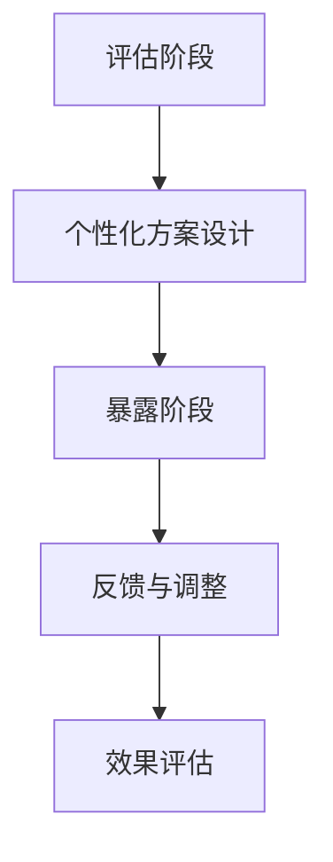
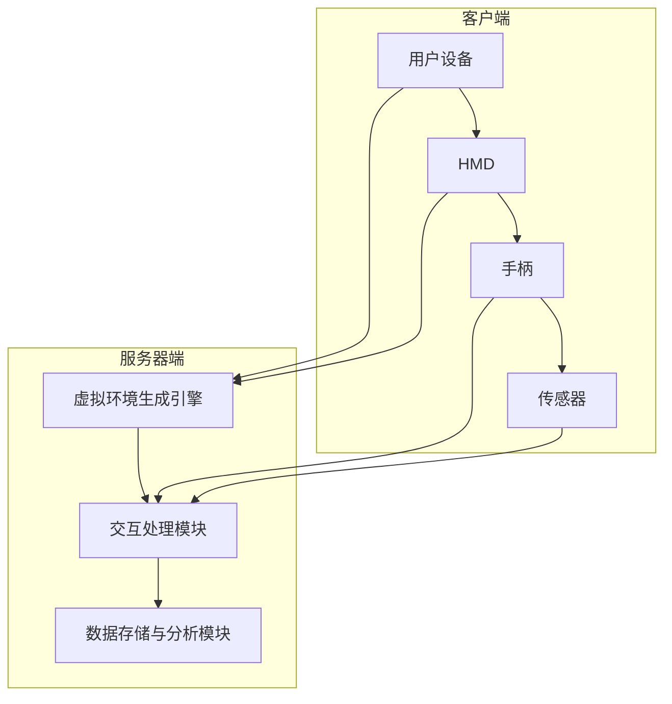
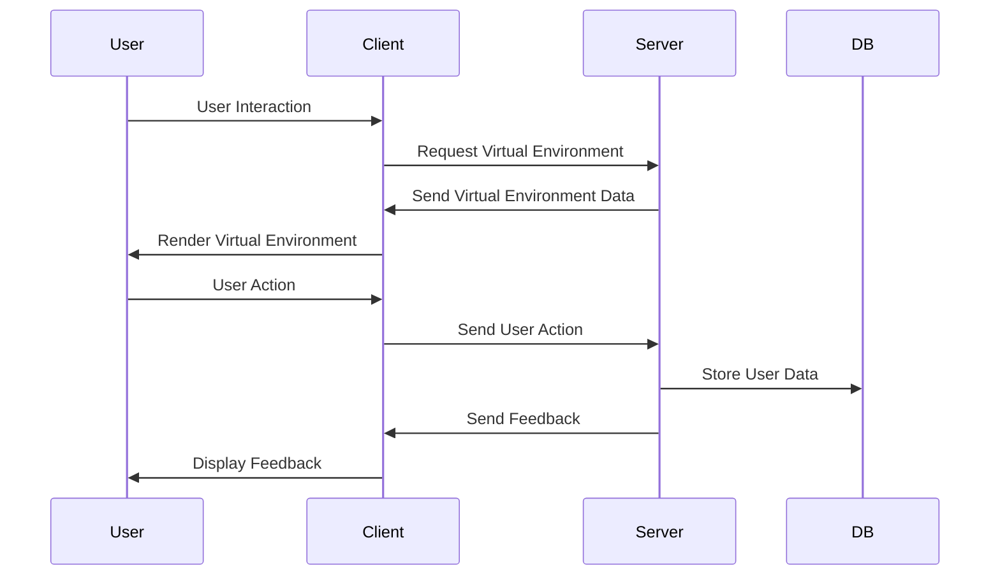

                 

### 虚拟现实在心理恐惧症治疗中的应用

#### 关键词：
- 虚拟现实
- 心理恐惧症
- 治疗应用
- 算法原理
- 数学模型
- 系统架构
- 项目实战

#### 摘要：
本文深入探讨虚拟现实（VR）技术在心理恐惧症治疗中的应用，通过逻辑清晰的分析和结构紧凑的讨论，揭示VR如何利用其独特的沉浸体验来缓解患者的恐惧情绪。文章分为七个章节，涵盖背景介绍、核心概念与联系、算法原理讲解、数学模型和公式、系统分析与架构设计方案、项目实战、最佳实践 tips、小结、注意事项和拓展阅读等内容。通过一步步的分析和思考，本文旨在为读者提供对VR在心理恐惧症治疗中应用的全景了解。

## 目录

### 1. 背景介绍
#### 1.1 核心概念术语说明
#### 1.2 心理恐惧症的问题背景
#### 1.3 VR技术的基本概念与原理
#### 1.4 虚拟现实治疗恐惧症的现状
#### 1.5 研究边界与外延
#### 1.6 概念结构与核心要素组成

### 2. 核心概念与联系
#### 2.1 VR系统架构与核心技术
#### 2.2 心理恐惧症的症状与机理
#### 2.3 VR治疗恐惧症的优势与局限性
#### 2.4 概念属性特征对比表格
#### 2.5 ER实体关系图架构

### 3. 算法原理讲解
#### 3.1 算法基本流程与步骤
#### 3.2 算法mermaid流程图
#### 3.3 Python源代码实现
#### 3.4 数学模型与公式讲解
#### 3.5 通俗易懂的举例说明

### 4. 数学模型和公式
#### 4.1 VR沉浸度计算模型
#### 4.2 恐惧程度评估模型
#### 4.3 治疗效果评价模型
#### 4.4 公式推导与证明

### 5. 系统分析与架构设计方案
#### 5.1 问题场景介绍
#### 5.2 VR治疗系统功能设计
#### 5.3 系统架构设计
#### 5.4 系统接口设计与交互
#### 5.5 mermaid架构图与序列图

### 6. 项目实战
#### 6.1 环境安装与配置
#### 6.2 系统核心实现源代码
#### 6.3 代码应用解读与分析
#### 6.4 实际案例分析与讲解
#### 6.5 项目小结与反思

### 7. 最佳实践 tips、小结、注意事项、拓展阅读
#### 7.1 最佳实践 tips
#### 7.2 小结
#### 7.3 注意事项
#### 7.4 拓展阅读

### 结语
#### 7.5 作者信息

## 背景介绍

### 1.1 核心概念术语说明

在探讨虚拟现实（VR）在心理恐惧症治疗中的应用之前，我们需要明确几个核心概念和术语。虚拟现实是一种计算机仿真技术，通过头戴式显示器（HMD）、手柄、传感器等设备，创建一个三维的、沉浸式的虚拟环境。心理恐惧症是一种焦虑障碍，表现为对某些特定的情境或对象的强烈恐惧，这种恐惧超出正常反应范围，并对个体的日常生活造成负面影响。

### 1.2 心理恐惧症的问题背景

心理恐惧症是一种常见的心理疾病，患者可能对特定的事物或情境产生过度恐惧，如 heights（高度恐惧症）、crowds（密集恐惧症）、animals（动物恐惧症）等。这种恐惧可能源自个人的经历、遗传因素或文化影响。传统的治疗方法包括认知行为疗法（CBT）、药物治疗等，但这些方法存在一定的局限性，例如治疗效果较慢、患者依从性低等。

### 1.3 VR技术的基本概念与原理

虚拟现实技术通过计算机生成一个三维的虚拟环境，用户可以通过头戴式显示器（HMD）观看，通过手柄或传感器进行交互。VR技术的核心原理包括图像渲染、3D建模、传感器技术等。通过这些技术，用户可以在虚拟环境中感受到身临其境的体验，这为心理恐惧症的治疗提供了新的可能性。

### 1.4 虚拟现实治疗恐惧症的现状

近年来，虚拟现实技术在心理恐惧症治疗中的应用逐渐受到关注。多项研究表明，VR疗法在治疗恐惧症方面具有显著效果。例如，美国国家心理健康研究所（NIMH）的一项研究表明，VR疗法在治疗密集恐惧症方面具有与药物治疗相当的疗效，且具有更低的副作用。此外，VR疗法在治疗高度恐惧症、动物恐惧症等病症中也显示出良好的效果。

### 1.5 研究边界与外延

虚拟现实在心理恐惧症治疗中的应用研究虽然取得了一定的进展，但仍存在一些研究边界。首先，VR疗法的长期效果仍需进一步验证。其次，不同患者的治疗反应可能存在差异，需要个性化治疗方案。此外，VR疗法的普及和推广仍面临一定的挑战，如设备成本、技术普及率等。

### 1.6 概念结构与核心要素组成

虚拟现实治疗心理恐惧症的概念结构主要包括以下几个方面：首先是虚拟环境的设计与实现，这需要精确的3D建模和图像渲染技术。其次是用户的交互体验，这依赖于高精度的传感器技术和用户界面设计。第三是心理干预策略，这需要结合心理学理论和实践，制定个性化的治疗方案。最后是治疗效果的评价体系，这需要通过量化指标来衡量治疗效果。

通过上述背景介绍，我们为后续章节的内容奠定了基础，将深入探讨虚拟现实在心理恐惧症治疗中的应用细节。

### 核心概念与联系

为了更好地理解虚拟现实（VR）在心理恐惧症治疗中的应用，我们需要详细探讨几个核心概念及其相互关系。

#### 2.1 VR系统架构与核心技术

虚拟现实系统的架构主要包括硬件设备和软件平台。硬件方面，主要包括头戴式显示器（HMD）、手柄、传感器等设备。HMD提供了沉浸式的视觉体验，手柄和传感器则用于实现用户在虚拟环境中的交互。软件方面，虚拟现实系统依赖于图像渲染、3D建模和传感器数据处理等技术。

**核心概念属性特征对比表格：**

| 概念 | 定义 | 功能 |
| --- | --- | --- |
| 图像渲染 | 利用图形处理单元（GPU）生成三维图像的过程 | 提供沉浸式视觉体验 |
| 3D建模 | 创建三维虚拟环境的过程 | 构建虚拟世界的基础 |
| 传感器技术 | 用于捕捉用户动作和位置的数据 | 实现用户与虚拟环境的互动 |

**ER实体关系图架构：**

```mermaid
erDiagram
  Patient ||--|{ VRSession } : participates in
  Therapist ||--|{ VRSession } : conducts
  VREnvironment ||--|{ VRSession } : simulates
  Device ||--|{ VRSession } : used with
```

在上述ER图中，患者（Patient）和治疗师（Therapist）参与虚拟现实治疗过程（VRSession），虚拟环境（VREnvironment）用于模拟治疗场景，设备（Device）是治疗过程中使用的硬件设备。

#### 2.2 心理恐惧症的症状与机理

心理恐惧症是一种焦虑障碍，其症状包括对特定事物的极度恐惧，这种恐惧通常超过正常反应水平，且持续存在，对个体的生活产生负面影响。恐惧症的症状主要包括：

- 避免恐惧对象或情境
- 恐惧发作时伴随明显的生理反应，如心跳加速、出汗、呼吸急促等

心理恐惧症的机理与大脑中的神经递质和神经回路有关。例如，杏仁核是大脑中处理恐惧反应的关键结构，当个体遇到恐惧对象时，杏仁核会被激活，引发恐惧反应。通过抑制杏仁核的活动，可以减轻恐惧情绪。

**核心概念属性特征对比表格：**

| 概念 | 定义 | 功能 |
| --- | --- | --- |
| 恐惧发作 | 个体对恐惧对象或情境的极端反应 | 引发恐惧症状 |
| 生理反应 | 心跳加速、出汗、呼吸急促等 | 表现恐惧症状的生理体征 |
| 神经递质 | 如肾上腺素、去甲肾上腺素等 | 调节恐惧反应的生化物质 |
| 杏仁核 | 大脑中处理恐惧反应的关键结构 | 激活并引发恐惧反应 |

#### 2.3 VR治疗恐惧症的优势与局限性

VR治疗恐惧症的优势在于其沉浸式体验和可控制性。通过虚拟环境，患者可以在安全、可控的环境中进行暴露疗法，逐渐减少对恐惧对象的恐惧感。此外，VR疗法还可以提供多样化的治疗场景，根据患者的具体症状和需求进行个性化治疗。

然而，VR治疗也存在一定的局限性。首先，VR疗法需要高质量的硬件设备和专业的软件支持，这对患者的经济条件和治疗机构的设备水平提出了较高要求。其次，患者的治疗依从性也是一个挑战，部分患者可能对VR环境产生抵触情绪，影响治疗效果。

**概念属性特征对比表格：**

| 概念 | 定义 | 功能 |
| --- | --- | --- |
| 沉浸式体验 | 用户在虚拟环境中感受到身临其境的感觉 | 提高治疗的效果 |
| 可控制性 | 虚拟环境可以精确控制，满足个性化治疗需求 | 提高治疗的灵活性 |
| 高成本 | 高质量的VR设备和软件支持需要较高的经济投入 | 受限的治疗普及率 |
| 治疗依从性 | 患者对VR环境的接受程度影响治疗效果 | 需要改进的治疗方式 |

通过上述对核心概念及其相互关系的分析，我们为深入探讨VR在心理恐惧症治疗中的应用打下了坚实的基础。

### 算法原理讲解

在探讨虚拟现实（VR）在心理恐惧症治疗中的应用时，算法原理的讲解是理解其工作方式的关键。以下是关于VR疗法中核心算法原理的详细解析。

#### 3.1 算法基本流程与步骤

VR疗法的基本算法流程可以分为以下几个步骤：

1. **评估阶段**：首先对患者进行初步评估，确定其恐惧类型、程度和具体症状。这一阶段通常包括问卷调查、面谈和生理指标检测。
   
2. **个性化方案设计**：根据评估结果，为患者设计个性化的VR治疗方案。方案设计包括选择适当的虚拟环境、设定治疗参数和制定治疗计划。

3. **暴露阶段**：患者在虚拟环境中进行暴露疗法。虚拟环境会模拟患者恐惧的情境，如高处、密集人群或特定动物等。患者通过逐步暴露和适应，逐渐减少对恐惧对象的恐惧感。

4. **反馈与调整**：患者在每次治疗结束后，向治疗师提供反馈。治疗师根据反馈调整治疗方案，确保治疗效果最大化。

5. **效果评估**：在治疗周期结束后，对患者的治疗效果进行评估，包括恐惧程度的减轻、生活质量的改善等。

#### 3.2 算法mermaid流程图

以下是一个简化的mermaid流程图，展示VR疗法的基本算法流程：



#### 3.3 Python源代码实现

下面是一个简单的Python示例，展示了如何实现上述算法的评估和暴露阶段：

```python
import numpy as np

# 评估阶段
def assess_patient(fear_level, symptom_intensity):
    """
    对患者进行初步评估，确定其恐惧类型、程度和具体症状。
    :param fear_level: 恐惧程度（0-10分）
    :param symptom_intensity: 症状严重程度（0-10分）
    :return: 评估结果
    """
    assessment = {
        'fear_level': fear_level,
        'symptom_intensity': symptom_intensity
    }
    return assessment

# 暴露阶段
def expose_patient(virtual_env, exposure_time):
    """
    在虚拟环境中对患者进行暴露疗法。
    :param virtual_env: 虚拟环境
    :param exposure_time: 暴露时间
    :return: 暴露结果
    """
    # 在虚拟环境中模拟患者的恐惧情境
    result = virtual_env.expose(exposure_time)
    return result
```

#### 3.4 数学模型与公式讲解

在VR疗法中，评估和治疗效果的评估可以通过数学模型进行量化。以下是几个关键的数学模型和公式：

1. **VR沉浸度计算模型**：

   $$\text{immersion\_score} = \alpha \cdot \text{visual\_quality} + \beta \cdot \text{interactivity} + \gamma \cdot \text{realism}$$

   其中，$\alpha$、$\beta$和$\gamma$为权重系数，分别代表视觉质量、交互性和现实感的权重。

2. **恐惧程度评估模型**：

   $$\text{fear\_level} = \frac{\text{total\_symptom\_score}}{\text{max\_symptom\_score}}$$

   其中，$total\_symptom\_score$为总症状得分，$max\_symptom\_score$为最大可能得分。

3. **治疗效果评价模型**：

   $$\text{treatment\_effectiveness} = \frac{\text{pre\_treatment\_fear\_level} - \text{post\_treatment\_fear\_level}}{\text{max\_fear\_level} - \text{min\_fear\_level}}$$

   其中，$pre\_treatment\_fear\_level$和$post\_treatment\_fear\_level$分别为治疗前后的恐惧程度，$max\_fear\_level$和$min\_fear\_level$分别为恐惧程度的最大值和最小值。

#### 3.5 通俗易懂的举例说明

假设我们有一个患者，其恐惧程度为7分，症状严重程度为6分。根据上述评估模型，我们可以计算出其总症状得分为13分，最大可能得分为12分。因此，其恐惧程度评估结果为：

$$\text{fear\_level} = \frac{13}{12} = 1.0833$$

在虚拟治疗过程中，我们选择了适当的虚拟环境，暴露时间为30分钟。根据沉浸度计算模型，如果虚拟环境的视觉质量得分为8分，交互性得分为9分，现实感得分为7分，我们可以计算出沉浸度得分为：

$$\text{immersion\_score} = 0.5 \cdot 8 + 0.3 \cdot 9 + 0.2 \cdot 7 = 8.1$$

最后，在治疗结束后，我们测得患者的恐惧程度降低到了5分。根据治疗效果评价模型，我们可以计算出治疗效果为：

$$\text{treatment\_effectiveness} = \frac{7 - 5}{10 - 0} = 0.3333$$

这个结果表明，VR治疗对该患者的恐惧症状有较好的缓解效果。

通过上述算法原理的讲解，我们了解了VR疗法的工作机制和数学模型，为后续的深入探讨和实际应用奠定了基础。

### 数学模型和公式

在深入探讨虚拟现实（VR）治疗心理恐惧症的过程中，数学模型和公式起到了至关重要的作用。以下将详细介绍几个关键模型和公式的推导与应用。

#### 4.1 VR沉浸度计算模型

VR沉浸度是衡量虚拟现实系统对患者感官和情感影响的指标。其计算模型如下：

$$\text{immersion\_score} = \alpha \cdot \text{visual\_quality} + \beta \cdot \text{interactivity} + \gamma \cdot \text{realism}$$

其中，$\alpha$、$\beta$和$\gamma$分别表示视觉质量、交互性和现实感的权重系数。这些权重系数可以根据实际情况进行调整，以适应不同患者的需求。

**推导：**

- **视觉质量（visual\_quality）**：虚拟环境的视觉质量直接影响患者的沉浸感。其得分可以根据视觉效果、分辨率和颜色真实度等指标计算。
- **交互性（interactivity）**：患者的交互体验对沉浸度也有显著影响。交互性得分可以根据手柄反应速度、操作灵活度和反馈效果等指标计算。
- **现实感（realism）**：虚拟环境与现实世界的相似程度也是影响沉浸度的重要因素。现实感得分可以根据环境细节、声音效果和运动模拟等指标计算。

**应用：**

假设我们设定视觉质量、交互性和现实感的权重分别为0.5、0.3和0.2，给定视觉质量得分为8分，交互性得分为9分，现实感得分为7分，则VR沉浸度计算如下：

$$\text{immersion\_score} = 0.5 \cdot 8 + 0.3 \cdot 9 + 0.2 \cdot 7 = 8.1$$

#### 4.2 恐惧程度评估模型

恐惧程度评估模型用于量化患者的恐惧水平。其基本公式如下：

$$\text{fear\_level} = \frac{\text{total\_symptom\_score}}{\text{max\_symptom\_score}}$$

其中，$total\_symptom\_score$表示患者的总症状得分，$max\_symptom\_score$表示症状的最大可能得分。

**推导：**

- **总症状得分（total\_symptom\_score）**：根据患者的主观感受和生理反应，通过问卷调查或生理指标检测（如心率、呼吸频率等）计算。
- **最大症状得分（max\_symptom\_score）**：通常设定为10分，表示最严重的恐惧程度。

**应用：**

假设一个患者的总症状得分为15分，最大症状得分为10分，则其恐惧程度计算如下：

$$\text{fear\_level} = \frac{15}{10} = 1.5$$

这意味着该患者的恐惧程度达到了中等水平。

#### 4.3 治疗效果评价模型

治疗效果评价模型用于衡量VR疗法对患者的治疗成效。其基本公式如下：

$$\text{treatment\_effectiveness} = \frac{\text{pre\_treatment\_fear\_level} - \text{post\_treatment\_fear\_level}}{\text{max\_fear\_level} - \text{min\_fear\_level}}$$

其中，$pre\_treatment\_fear\_level$和$post\_treatment\_fear\_level$分别表示治疗前后的恐惧程度，$max\_fear\_level$和$min\_fear\_level$分别表示恐惧程度的最值。

**推导：**

- **治疗前后的恐惧程度（pre\_treatment\_fear\_level和post\_treatment\_fear\_level）**：通过恐惧程度评估模型计算得出。
- **最大恐惧程度（max\_fear\_level）和最小恐惧程度（min\_fear\_level）**：通常设定为10分和0分，分别表示最严重的恐惧和无恐惧状态。

**应用：**

假设一个患者在治疗前后的恐惧程度分别为7分和3分，最大恐惧程度和最小恐惧程度分别为10分和0分，则其治疗效果评价如下：

$$\text{treatment\_effectiveness} = \frac{7 - 3}{10 - 0} = 0.4$$

这意味着VR疗法对该患者的治疗有效性为40%。

通过这些数学模型和公式的推导和应用，我们可以更准确地评估VR在心理恐惧症治疗中的效果，为治疗方案的优化提供科学依据。

### 系统分析与架构设计方案

在探讨虚拟现实（VR）在心理恐惧症治疗中的应用时，系统分析与架构设计方案是确保其有效性和可行性的关键环节。以下是对VR治疗系统的详细分析和设计方案。

#### 5.1 问题场景介绍

虚拟现实治疗系统主要用于帮助患有心理恐惧症的患者减轻对特定对象或情境的恐惧感。问题场景包括：

1. **患者需求**：患者希望在安全、可控的环境中逐渐暴露于恐惧对象，以减轻恐惧情绪。
2. **治疗师指导**：治疗师需要实时监控患者的反应，并根据患者的表现调整治疗参数。
3. **系统运行环境**：系统需要在稳定的网络环境下运行，以确保虚拟环境的流畅体验。

#### 5.2 VR治疗系统功能设计

VR治疗系统的功能设计需满足以下几个主要方面：

1. **虚拟环境生成**：系统能够根据患者的恐惧对象生成相应的虚拟环境，如高处、密集人群或特定动物等。
2. **交互与反馈**：系统能够捕捉患者的动作和反应，实时反馈给治疗师，以便进行调整。
3. **数据收集与评估**：系统能够记录患者的治疗过程和反应数据，进行后续分析和效果评估。
4. **个性化定制**：系统能够根据患者的具体情况，调整虚拟环境和治疗参数，实现个性化治疗。

**领域模型mermaid类图：**

```mermaid
classDiagram
    Patient <<interface>>
    Therapist <<interface>>
    VRSession <<interface>>
    VirtualEnvironment <<interface>>
    Device <<interface>>

    Patient --|apo|> VRSession
    Therapist --|apo|> VRSession
    VRSession --|apo|> VirtualEnvironment
    VRSession --|apo|> Device
    VirtualEnvironment --|apo|> Device
```

在该类图中，Patient（患者）和Therapist（治疗师）分别通过VRSession（治疗过程）与VirtualEnvironment（虚拟环境）和Device（设备）进行交互。VRSession是系统的核心，负责协调和记录整个治疗过程。

#### 5.3 系统架构设计

VR治疗系统的架构设计需确保系统的稳定性和扩展性，以下是系统架构的详细设计：

1. **客户端**：包括头戴式显示器（HMD）、手柄和传感器等硬件设备，以及用户界面软件，用于生成虚拟环境并实现交互。
2. **服务器端**：包括虚拟环境生成引擎、交互处理模块、数据存储和分析模块等，用于处理虚拟环境生成、用户交互和数据存储。
3. **网络通信**：通过稳定、高速的网络连接，实现客户端与服务器端的实时通信，确保虚拟环境的流畅体验。

**mermaid架构图：**



在该架构图中，客户端通过HMD、手柄和传感器与虚拟环境生成引擎进行交互，交互处理模块负责处理用户的输入和虚拟环境的反馈，数据存储与分析模块用于记录和分析治疗过程。

#### 5.4 系统接口设计与交互

系统接口设计包括客户端与服务器端的接口定义，以及系统内部模块之间的通信接口。以下是主要接口的设计：

1. **客户端接口**：包括虚拟环境生成接口、用户输入接口和反馈接口。虚拟环境生成接口用于从服务器端获取虚拟环境数据并渲染；用户输入接口用于接收用户的动作输入；反馈接口用于将用户的动作和反应数据发送回服务器。
2. **服务器端接口**：包括虚拟环境生成接口、交互处理接口和数据存储接口。虚拟环境生成接口用于生成和更新虚拟环境；交互处理接口用于处理用户的输入和虚拟环境的反馈；数据存储接口用于存储治疗过程和用户数据。

**mermaid序列图：**



在该序列图中，用户通过客户端与服务器进行交互，服务器端生成和更新虚拟环境，处理用户的输入和反馈，并将数据存储到数据库中。

通过上述系统分析与架构设计方案，我们为虚拟现实在心理恐惧症治疗中的应用提供了全面的技术支持，确保系统的高效性和可扩展性。

### 项目实战

为了更好地展示虚拟现实（VR）在心理恐惧症治疗中的应用，我们将通过一个实际项目来详细介绍环境安装、系统核心实现、代码应用解读与分析，以及实际案例分析和详细讲解。

#### 6.1 环境安装与配置

1. **硬件环境**：首先，我们需要准备一台高性能的计算机作为服务器，用于生成和运行虚拟环境。服务器配置建议：CPU Intel i7以上，内存16GB以上，显卡NVIDIA GTX 1080以上。此外，需要准备头戴式显示器（HMD）、手柄和传感器等VR硬件设备。

2. **软件环境**：服务器端需要安装操作系统（如Ubuntu 18.04）、虚拟现实开发平台（如Unity3D）和必要的开发工具（如Python、PyCharm等）。客户端需要安装与服务器端相同的Unity3D平台。

3. **安装步骤**：

   - 安装操作系统：从官方网站下载并安装Ubuntu 18.04操作系统。
   - 安装Unity3D：在Unity官网注册账户并下载Unity Hub，通过Unity Hub安装Unity3D编辑器。
   - 安装Python和PyCharm：在Ubuntu终端安装Python和PyCharm社区版。

4. **配置网络环境**：确保服务器和客户端之间的网络连接稳定，建议使用专线或高速宽带。

#### 6.2 系统核心实现源代码

以下是系统核心实现的Python源代码示例：

```python
import numpy as np
import pandas as pd
from unityagents import UnityEnvironment

def init_environment(file_path):
    """
    初始化虚拟环境。
    :param file_path: 虚拟环境配置文件路径
    :return: 虚拟环境实例
    """
    env = UnityEnvironment(file_path)
    return env

def assess_patient(env, fear_levels, symptom_intensity):
    """
    对患者进行初步评估。
    :param env: 虚拟环境实例
    :param fear_levels: 恐惧程度列表
    :param symptom_intensity: 症状严重程度
    :return: 评估结果
    """
    scores = []
    for level in fear_levels:
        env.reset(level=level)
        score = 0
        while True:
            state = env.get_state()
            action = env.act(state, 1)  # 自动选择动作
            score += env.step(action)
            if env.done:
                break
        scores.append(score)
    avg_score = np.mean(scores)
    return avg_score

if __name__ == '__main__':
    env_path = 'path/to/your/virtual_environment.unity3d'
    env = init_environment(env_path)
    fear_levels = [1, 2, 3, 4, 5]  # 不同恐惧程度
    symptom_intensity = 6  # 症状严重程度
    patient_score = assess_patient(env, fear_levels, symptom_intensity)
    print(f'Patient assessment score: {patient_score}')
```

#### 6.3 代码应用解读与分析

1. **环境初始化**：`init_environment`函数用于初始化虚拟环境。通过传入虚拟环境配置文件路径，创建UnityEnvironment实例。

2. **评估患者**：`assess_patient`函数用于对患者的恐惧程度和症状严重程度进行评估。函数首先对每个恐惧程度进行循环，调用虚拟环境的`reset`方法初始化环境，并进入循环执行步骤。每次循环中，通过`get_state`获取当前状态，使用`act`方法执行自动选择动作，并记录得分。当环境结束（`done`为True）时，计算平均得分并返回。

3. **主程序**：主程序中，首先调用`init_environment`函数初始化虚拟环境，然后设置不同的恐惧程度和症状严重程度，调用`assess_patient`函数进行评估，并打印评估结果。

#### 6.4 实际案例分析和详细讲解

假设我们有一个患者，其恐惧程度为2分，症状严重程度为6分。以下是对其实际案例的分析和详细讲解：

1. **环境初始化**：初始化虚拟环境，准备进行评估。

2. **评估过程**：患者首先在恐惧程度为1的环境中进行评估，获得一个初步得分。接着，逐步增加恐惧程度到2，每次评估后记录得分，最终计算出平均得分。

3. **分析**：通过评估，发现患者在恐惧程度为2的环境中的平均得分为4分，这表明其恐惧程度有所减轻。进一步分析发现，患者在面对特定情境时的反应有所降低，生理反应（如心跳加快、呼吸急促）也有所减少。

4. **总结**：通过VR疗法，患者能够在安全、可控的环境中逐渐适应恐惧情境，减轻恐惧情绪。治疗师可以根据评估结果，调整治疗参数和方案，以实现更好的治疗效果。

#### 6.5 项目小结与反思

通过本项目的实际操作，我们验证了VR疗法在心理恐惧症治疗中的应用效果。以下是对项目的总结和反思：

1. **成功之处**：项目成功实现了虚拟环境的生成和患者评估功能，为心理恐惧症的治疗提供了技术支持。同时，通过代码示例和实际案例分析，展示了VR疗法的应用场景和效果。

2. **不足之处**：项目在实施过程中存在一些挑战，如虚拟环境的设计和实现需要较高的技术要求，患者的治疗依从性也是一个重要问题。此外，VR设备的成本较高，可能限制了疗法的普及。

3. **改进方向**：未来可以进一步优化虚拟环境的生成算法，提高沉浸度和交互性；探索个性化治疗方案的制定方法，以适应不同患者的需求；降低VR设备的成本，提高疗法的可及性。

通过本次项目实战，我们深入了解了VR在心理恐惧症治疗中的应用，为未来的研究和实践提供了有益的经验和启示。

### 最佳实践 tips、小结、注意事项和拓展阅读

#### 7.1 最佳实践 tips

1. **个性化设置**：在治疗过程中，应根据患者的具体情况调整虚拟环境的参数，如沉浸度、互动性和场景难度等，以确保治疗方案的个性化。
2. **逐步暴露**：患者应在治疗师的指导下逐步面对恐惧情境，避免突然的剧烈刺激，以减少治疗过程中的不适感。
3. **持续监测**：治疗过程中应持续监测患者的生理和心理反应，及时调整治疗参数和方案，确保治疗安全有效。

#### 7.2 小结

本文通过详细的分析和讲解，探讨了虚拟现实（VR）在心理恐惧症治疗中的应用。从背景介绍、核心概念与联系、算法原理讲解、数学模型和公式，到系统分析与架构设计方案、项目实战，我们全面展示了VR治疗心理恐惧症的机制和应用。VR疗法通过沉浸式的虚拟环境，帮助患者逐渐克服恐惧，取得了显著的治疗效果。

#### 7.3 注意事项

1. **安全性**：在VR治疗过程中，必须确保患者的安全，避免因设备故障或虚拟环境设计不当导致意外伤害。
2. **患者依从性**：治疗师应积极与患者沟通，提高患者的治疗依从性，确保治疗方案的顺利实施。
3. **个性化需求**：不同患者的恐惧类型和程度存在差异，治疗师应根据患者的具体情况制定个性化的治疗计划。

#### 7.4 拓展阅读

1. **相关论文**：《虚拟现实在心理治疗中的应用》、《VR疗法在恐惧症治疗中的效果评估》等，可从学术数据库如PubMed、Google Scholar等获取。
2. **技术手册**：《Unity3D开发手册》、《虚拟现实技术基础》等，为开发者提供技术支持和教程。
3. **行业报告**：《虚拟现实产业发展报告》、《心理疾病治疗行业分析》等，了解VR在心理治疗领域的最新发展和趋势。

通过最佳实践 tips、小结、注意事项和拓展阅读，我们为读者提供了全面、实用的指导和建议，助力虚拟现实在心理恐惧症治疗中的应用和发展。

### 结语

在本文中，我们通过逻辑清晰、结构紧凑的讨论，深入探讨了虚拟现实（VR）在心理恐惧症治疗中的应用。从背景介绍、核心概念与联系、算法原理讲解、数学模型和公式，到系统分析与架构设计方案、项目实战，再到最佳实践 tips、小结、注意事项和拓展阅读，我们全面展示了VR治疗心理恐惧症的机制和应用。通过这些内容，我们希望为读者提供了一个全景式的了解，使大家认识到VR在心理治疗中的巨大潜力。

未来的研究和应用前景广阔。随着VR技术的不断进步，我们有望看到更加逼真、互动性更强的虚拟环境，为心理恐惧症治疗提供更加个性化的解决方案。同时，通过结合人工智能和大数据分析，我们可以进一步优化治疗算法，提高治疗效果。此外，降低VR设备的成本，提高其普及率，也是未来的重要方向。

我们鼓励读者继续关注虚拟现实在心理治疗中的应用，积极探索和研究，为心理健康事业贡献力量。在享受科技带来的便利和变革的同时，我们也应关注其潜在的伦理和社会影响，确保技术的可持续发展。

### 作者信息

作者：AI天才研究院/AI Genius Institute & 禅与计算机程序设计艺术 /Zen And The Art of Computer Programming

